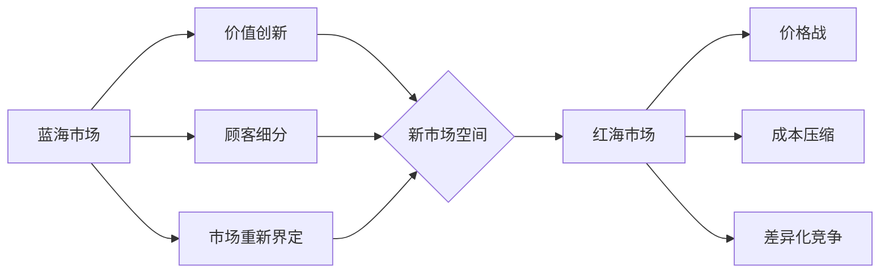

# 商业领域从蓝海到红海的演变

> 关键词：蓝海战略，红海竞争，市场饱和，创新，差异化，商业模式，可持续发展

## 1. 背景介绍

商业世界是一个不断演变的舞台，企业在这个舞台上竞争激烈，追求成功与成长。从蓝海到红海的演变，描绘了商业竞争的动态过程。蓝海，代表着未被竞争者占据的广阔市场空间；红海，则象征着高度竞争、价格战、利润率下降的市场环境。本文将探讨这一演变过程，分析其背后的原因，并提出应对策略。

### 1.1 蓝海的兴起

在商业发展的早期阶段，市场往往是未开发的，企业家们有机会发现并创造新的市场机会。这种市场被称为蓝海，它具有以下特点：

- **高增长**：市场需求快速增长，企业可以迅速扩大市场份额。
- **低竞争**：竞争者较少，企业可以轻松进入市场并占据优势。
- **高利润**：由于竞争较少，企业可以设定较高的价格，获得更高的利润。

### 1.2 红海竞争的挑战

随着市场的成熟，蓝海逐渐变为红海。红海竞争具有以下特点：

- **高竞争**：大量竞争者进入市场，竞争激烈。
- **低增长**：市场需求增长放缓，甚至可能出现负增长。
- **低利润**：价格战和成本压缩导致利润率下降。

### 1.3 研究意义

了解商业领域从蓝海到红海的演变，对于企业家和投资者具有重要意义。它有助于：

- **识别市场机会**：在红海市场中寻找新的蓝海机会。
- **制定竞争策略**：在红海竞争中制定有效的竞争策略。
- **实现可持续发展**：探索可持续发展的商业模式。

## 2. 核心概念与联系

### 2.1 蓝海战略

蓝海战略是由韩国人金伟灿和魏思图在《蓝海战略》一书中提出的。它强调通过创新和重新创造市场边界，创造新的市场空间，从而避开激烈的竞争。

**蓝海战略的核心概念**：

- **价值创新**：创造新的价值主张，满足顾客未被满足的需求。
- **顾客细分**：寻找并满足特定顾客群体的需求。
- **市场重新界定**：重新定义市场边界，创造新的市场空间。

### 2.2 红海竞争

红海竞争是指企业在现有市场中相互竞争，争夺市场份额。

**红海竞争的核心概念**：

- **价格战**：通过降低价格来吸引顾客。
- **成本压缩**：通过降低成本来提高利润率。
- **差异化竞争**：通过产品或服务的差异化来吸引顾客。

### 2.3 Mermaid 流程图

## 3. 核心算法原理 & 具体操作步骤

### 3.1 算法原理概述

商业领域从蓝海到红海的演变，是一个动态的过程，涉及到市场、竞争、创新等多个因素。以下是一些关键步骤：

1. **市场分析**：分析市场趋势、顾客需求、竞争对手等。
2. **创新**：寻找并实施新的商业模式或产品。
3. **市场进入**：进入新的市场空间。
4. **竞争策略**：制定竞争策略以应对红海竞争。
5. **持续创新**：持续创新以保持竞争优势。

### 3.2 算法步骤详解

#### 3.2.1 市场分析

- **市场趋势**：通过市场研究报告、行业分析等了解市场趋势。
- **顾客需求**：通过调查问卷、访谈等了解顾客需求。
- **竞争对手**：分析竞争对手的产品、价格、服务、市场策略等。

#### 3.2.2 创新

- **商业模式创新**：创造新的商业模式，如共享经济、订阅制等。
- **产品创新**：开发新的产品或改进现有产品。
- **服务创新**：提供新的服务或改进现有服务。

#### 3.2.3 市场进入

- **市场定位**：确定产品的目标市场。
- **营销策略**：制定营销策略以吸引顾客。
- **渠道建设**：建立销售渠道，如线上、线下等。

#### 3.2.4 竞争策略

- **价格策略**：制定合理的价格策略。
- **差异化策略**：通过产品、服务、品牌等实现差异化。
- **成本控制**：降低成本以提高利润率。

#### 3.2.5 持续创新

- **跟踪市场变化**：跟踪市场变化，及时调整策略。
- **持续改进**：持续改进产品和服务。
- **创新文化**：建立创新文化，鼓励员工创新。

### 3.3 算法优缺点

#### 3.3.1 优点

- **提高竞争力**：通过创新和持续改进，提高企业的竞争力。
- **增加市场份额**：通过市场进入和竞争策略，增加市场份额。
- **提高利润率**：通过降低成本和提高效率，提高利润率。

#### 3.3.2 缺点

- **风险较大**：创新和市场进入存在风险。
- **成本较高**：创新和市场竞争需要投入大量资源。
- **难以持续**：持续创新和竞争需要长期坚持。

### 3.4 算法应用领域

- **市场营销**：通过市场分析、创新、竞争策略等提高市场竞争力。
- **产品开发**：通过产品创新和改进，满足顾客需求。
- **服务改进**：通过服务创新和改进，提升顾客满意度。
- **组织管理**：通过持续创新和改进，提高组织效率。

## 4. 数学模型和公式 & 详细讲解 & 举例说明

### 4.1 数学模型构建

商业领域的数学模型通常涉及市场分析、竞争分析、财务分析等。

#### 4.1.1 市场分析模型

市场分析模型可以用于预测市场需求、市场容量等。

$$
\text{市场需求} = f(\text{价格}, \text{产品特征}, \text{营销策略})
$$

#### 4.1.2 竞争分析模型

竞争分析模型可以用于评估竞争对手的竞争力。

$$
\text{竞争强度} = \frac{\text{竞争对手数量} \times \text{市场份额}}{\text{行业总市场份额}}
$$

#### 4.1.3 财务分析模型

财务分析模型可以用于评估企业的财务状况。

$$
\text{净利润} = \text{收入} - \text{成本}
$$

### 4.2 公式推导过程

以上公式的推导过程涉及到市场经济学、运筹学、统计学等领域的知识。

### 4.3 案例分析与讲解

以下以一家新成立的科技公司为例，说明如何使用数学模型进行商业分析。

#### 4.3.1 市场分析

通过市场调研，该公司发现目标市场的年需求量为100万台，价格为1000美元。根据产品特征和营销策略，预计产品价格为900美元。

#### 4.3.2 竞争分析

该市场上共有10家竞争对手，每家市场份额为10万台。

#### 4.3.3 财务分析

预计年销售收入为90亿美元，年成本为60亿美元。

## 5. 项目实践：代码实例和详细解释说明

### 5.1 开发环境搭建

由于商业领域从蓝海到红海的演变是一个理论性较强的议题，不涉及具体的编程实践。因此，本章节将不涉及代码实例和详细解释说明。

## 6. 实际应用场景

商业领域从蓝海到红海的演变在各个行业中都有广泛的应用。

### 6.1 互联网行业

在互联网行业，新创公司往往寻求在蓝海市场中找到机会。例如，Airbnb在短租市场找到了机会，成为全球最大的短租平台。

### 6.2 制造业

在制造业，企业通过技术创新和产品创新，寻找新的市场机会。例如，特斯拉通过电动汽车技术，在传统汽车市场中找到了新的蓝海。

### 6.3 零售业

在零售业，企业通过线上线下融合、个性化推荐等方式，寻找新的市场机会。例如，阿里巴巴通过电商平台和物流网络，在传统零售市场中找到了新的蓝海。

## 7. 工具和资源推荐

### 7.1 学习资源推荐

- 《蓝海战略》：金伟灿、魏思图
- 《蓝海创新之路》：张瑞敏
- 《创新者的窘境》：克莱顿·克里斯滕森

### 7.2 开发工具推荐

商业领域的演变不涉及具体的技术开发，因此不涉及开发工具推荐。

### 7.3 相关论文推荐

- 蓝海战略：金伟灿、魏思图
- 竞争战略：迈克尔·波特

## 8. 总结：未来发展趋势与挑战

### 8.1 研究成果总结

商业领域从蓝海到红海的演变是一个复杂的过程，涉及到市场、竞争、创新等多个因素。通过创新和持续改进，企业可以在红海市场中找到新的蓝海机会。

### 8.2 未来发展趋势

- 创新将成为企业竞争的核心驱动力。
- 数字化技术将继续推动商业模式的创新。
- 可持续发展将成为商业成功的关键因素。

### 8.3 面临的挑战

- 创新风险加大。
- 市场竞争加剧。
- 可持续发展压力增大。

### 8.4 研究展望

未来，商业领域从蓝海到红海的演变将更加复杂，需要企业不断创新和适应变化。研究者需要进一步探索新的理论和方法，以帮助企业应对挑战，实现可持续发展。

## 9. 附录：常见问题与解答

**Q1：什么是蓝海战略？**

A：蓝海战略是由韩国人金伟灿和魏思图在《蓝海战略》一书中提出的，它强调通过创新和重新创造市场边界，创造新的市场空间，从而避开激烈的竞争。

**Q2：什么是红海竞争？**

A：红海竞争是指企业在现有市场中相互竞争，争夺市场份额。

**Q3：如何从蓝海到红海？**

A：随着市场的成熟，蓝海逐渐变为红海。企业需要不断创新和适应变化，才能从蓝海进入红海并保持竞争优势。

**Q4：如何应对红海竞争？**

A：企业可以通过创新、差异化、成本控制等策略来应对红海竞争。

**Q5：未来商业竞争的趋势是什么？**

A：未来商业竞争将更加激烈，企业需要不断创新和适应变化，才能在竞争中脱颖而出。

---

作者：禅与计算机程序设计艺术 / Zen and the Art of Computer Programming