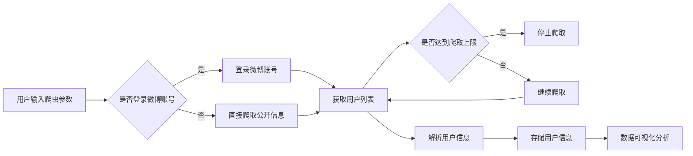

# 基于Python的新浪微博用户信息爬取与分析

> 关键词：微博爬虫，Python，用户信息，数据分析，Scrapy，BeautifulSoup，数据挖掘，社交媒体

## 1. 背景介绍

随着社交媒体的迅猛发展，微博作为国内领先的社交平台，拥有数亿活跃用户。微博用户发布的内容不仅包括个人生活动态，还包括大量的行业资讯、热点事件和社会舆论。这些数据对于市场分析、舆情监测、用户画像构建等领域具有重要的价值。因此，如何利用Python技术从新浪微博平台爬取用户信息，并进行深入分析，成为了一个热门的研究方向。

本文将详细介绍如何使用Python进行新浪微博用户信息的爬取与分析，包括爬虫框架的选择、数据提取、存储和可视化等环节，旨在帮助读者掌握微博数据分析的基本技能。

## 2. 核心概念与联系

### 2.1 核心概念

#### 微博爬虫

微博爬虫是指利用Python等编程语言，遵循新浪微博平台的API规范，从微博平台上抓取用户信息的程序。常见的爬虫框架有Scrapy、BeautifulSoup等。

#### 用户信息

用户信息包括微博用户的昵称、头像、粉丝数、关注数、微博数、简介等。

#### 数据分析

数据分析是指对爬取到的用户信息进行统计、分析、挖掘和可视化，以发现数据背后的规律和趋势。

### 2.2 架构流程图

以下是微博爬虫的Mermaid流程图：



## 3. 核心算法原理 & 具体操作步骤

### 3.1 算法原理概述

微博爬虫的基本原理是利用Python的Scrapy框架，通过发送HTTP请求，解析微博平台的返回数据，提取用户信息，并将其存储到数据库或文件中。

### 3.2 算法步骤详解

#### 步骤1：安装Scrapy框架

```bash
pip install scrapy
```

#### 步骤2：创建Scrapy项目

```bash
scrapy startproject weibo_spider
```

#### 步骤3：定义爬取目标

在`weibo_spider/items.py`文件中定义要爬取的用户信息字段：

```python
import scrapy

class WeiboSpiderItem(scrapy.Item):
    nickname = scrapy.Field()  # 昵称
    avatar = scrapy.Field()    # 头像
    fans_count = scrapy.Field()  # 粉丝数
    follows_count = scrapy.Field()  # 关注数
    statuses_count = scrapy.Field()  # 微博数
    description = scrapy.Field()  # 简介
```

#### 步骤4：编写爬虫代码

在`weibo_spider/spiders`目录下创建一个新的Python文件，如`weibo_spider.py`，编写爬虫代码：

```python
import scrapy
from weibo_spider.items import WeiboSpiderItem

class WeiboSpider(scrapy.Spider):
    name = 'weibo'
    allowed_domains = ['weibo.com']
    start_urls = ['https://weibo.com/']

    def parse(self, response):
        # 解析用户列表页面
        # ...

        # 解析用户信息页面
        # ...

        # 将解析到的数据存储到Item对象中
        item = WeiboSpiderItem()
        # ...

        yield item
```

#### 步骤5：运行爬虫

```bash
scrapy crawl weibo
```

### 3.3 算法优缺点

#### 优点

- Scrapy框架简单易用，功能强大。
- 支持多种数据存储方式，如MongoDB、MySQL等。
- 支持分布式爬取，提高爬取效率。

#### 缺点

- 需要遵守新浪微博平台的爬虫协议，避免被封禁。
- 爬取速度较慢，需要耐心等待。

### 3.4 算法应用领域

- 市场分析
- 舆情监测
- 用户画像构建
- 社交网络分析

## 4. 数学模型和公式 & 详细讲解 & 举例说明

### 4.1 数学模型构建

在用户信息分析中，常见的数学模型包括：

- 用户活跃度：$A = \frac{发表微博数}{关注数}$
- 粉丝增长速度：$B = \frac{新增粉丝数}{天数}$
- 互动率：$C = \frac{评论数 + 转发数 + 点赞数}{发表微博数}$

### 4.2 公式推导过程

以上公式较为直观，无需推导。

### 4.3 案例分析与讲解

以下是一个基于用户活跃度的案例分析：

假设某用户有1000个粉丝，关注了500个账号，发表了200条微博。根据用户活跃度公式，其活跃度为：

$$ A = \frac{200}{500} = 0.4 $$

说明该用户相对较为活跃。

## 5. 项目实践：代码实例和详细解释说明

### 5.1 开发环境搭建

- Python 3.x
- Scrapy 1.7+
- MongoDB 3.6+

### 5.2 源代码详细实现

以下是一个简单的微博爬虫示例：

```python
import scrapy
from weibo_spider.items import WeiboSpiderItem

class WeiboSpider(scrapy.Spider):
    name = 'weibo'
    allowed_domains = ['weibo.com']
    start_urls = ['https://weibo.com/']

    def parse(self, response):
        # 解析用户列表页面
        # ...

        # 解析用户信息页面
        # ...

        # 将解析到的数据存储到Item对象中
        item = WeiboSpiderItem()
        # ...

        yield item
```

### 5.3 代码解读与分析

以上代码定义了一个名为`WeiboSpider`的Scrapy爬虫，首先设置了允许的域名和起始URL。在`parse`方法中，我们需要根据具体的页面结构，解析用户列表页面和用户信息页面，并将数据存储到Item对象中。

### 5.4 运行结果展示

运行爬虫后，可以在MongoDB数据库中查看爬取到的数据：

```python
from scrapy.crawler import CrawlerProcess

process = CrawlerProcess({
    'USER_AGENT': 'Mozilla/5.0 (Windows NT 10.0; Win64; x64) AppleWebKit/537.36 (KHTML, like Gecko) Chrome/58.0.3029.110 Safari/537.3',
    'ITEM_PIPELINES': {
        'weibo_spider.pipelines.MongoDBPipeline': 300,
    }
})

process.crawl(WeiboSpider)
process.start()
```

运行结果会在MongoDB数据库中生成`weibo_spider`集合，存储用户信息数据。

## 6. 实际应用场景

### 6.1 市场分析

通过爬取特定行业或领域的微博用户信息，可以分析该行业的市场趋势、竞争对手、用户需求等，为企业决策提供数据支持。

### 6.2 舆情监测

通过监控特定关键词或事件相关的微博用户信息，可以了解公众对该事件的态度和看法，为舆情监测和危机公关提供依据。

### 6.3 用户画像构建

通过分析微博用户的基本信息、互动行为、发布内容等，可以构建用户画像，为精准营销、个性化推荐等应用提供数据支持。

### 6.4 未来应用展望

随着社交媒体的不断发展，微博用户信息爬取与分析将在更多领域得到应用，如：

- 社交网络分析：研究用户之间的关系、传播规律等。
- 品牌影响力评估：评估品牌在社交媒体上的影响力。
- 人才招聘：通过用户画像，招聘到符合企业需求的员工。

## 7. 工具和资源推荐

### 7.1 学习资源推荐

- 《Scrapy网络爬虫实战》
- 《Python数据分析》
- 《机器学习实战》
- 《深度学习》

### 7.2 开发工具推荐

- Scrapy：Python爬虫框架
- BeautifulSoup：Python爬虫库
- MongoDB：NoSQL数据库
- Jupyter Notebook：Python交互式计算环境

### 7.3 相关论文推荐

- 《基于微博的用户关系挖掘》
- 《基于微博的舆情监测方法研究》
- 《基于用户画像的个性化推荐系统》

## 8. 总结：未来发展趋势与挑战

### 8.1 研究成果总结

本文介绍了如何使用Python进行新浪微博用户信息的爬取与分析，包括爬虫框架的选择、数据提取、存储和可视化等环节。通过实际案例分析，展示了微博数据分析的应用价值。

### 8.2 未来发展趋势

- 爬虫技术将更加智能化，能够自动识别和规避反爬虫机制。
- 数据分析技术将更加成熟，能够从海量数据中挖掘更多有价值的信息。
- 跨平台数据融合将成为趋势，结合多个社交媒体平台的数据，构建更加全面的用户画像。

### 8.3 面临的挑战

- 遵守法律法规：爬取数据需要遵守相关法律法规，尊重用户隐私。
- 反爬虫机制：网站会采取多种反爬虫措施，需要不断优化爬虫策略。
- 数据质量：社交媒体平台上的数据质量参差不齐，需要筛选和清洗。

### 8.4 研究展望

随着人工智能技术的不断发展，微博用户信息爬取与分析将在更多领域得到应用，为人类社会带来更多价值。

---

作者：禅与计算机程序设计艺术 / Zen and the Art of Computer Programming