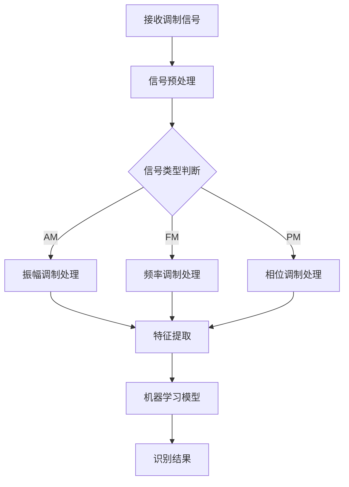

# 基于计算机视觉的调制信号识别

> 关键词：计算机视觉，调制信号，特征提取，机器学习，信号识别，通信系统

## 1. 背景介绍

随着通信技术的发展，调制信号在信息传输中扮演着至关重要的角色。调制信号识别作为通信系统中的一个核心环节，其精度和效率直接影响到系统的性能和可靠性。传统的调制信号识别方法主要依赖于信号处理技术，如傅里叶变换、滤波器设计等。然而，这些方法在处理复杂信号和噪声干扰时，往往难以达到理想的效果。

近年来，随着计算机视觉和机器学习技术的飞速发展，基于计算机视觉的调制信号识别方法逐渐崭露头角。通过将调制信号转换为图像，利用计算机视觉技术进行特征提取和分类，可以实现对调制信号的有效识别。本文将深入探讨基于计算机视觉的调制信号识别方法，分析其原理、算法、应用场景以及未来发展趋势。

## 2. 核心概念与联系

### 2.1 调制信号

调制信号是指通过改变载波的某些参数（如幅度、频率、相位）来携带信息的一种信号。常见的调制方式包括振幅调制（AM）、频率调制（FM）、相位调制（PM）等。调制信号识别的任务是根据接收到的信号，判断其调制方式和参数。

### 2.2 计算机视觉

计算机视觉是研究如何让计算机从图像或视频中获取信息的学科。计算机视觉技术在图像处理、目标检测、场景重建等方面取得了显著的成果。

### 2.3 机器学习

机器学习是一种使计算机系统从数据中学习并做出决策或预测的方法。在调制信号识别中，机器学习可以帮助我们自动提取信号特征，并构建识别模型。

### 2.4 Mermaid 流程图

以下是基于计算机视觉的调制信号识别流程的 Mermaid 流程图：



## 3. 核心算法原理 & 具体操作步骤

### 3.1 算法原理概述

基于计算机视觉的调制信号识别算法主要包括以下步骤：

1. 信号预处理：对接收到的调制信号进行滤波、去噪等处理，提高信号质量。
2. 信号类型判断：根据信号特征判断其调制类型，如AM、FM、PM等。
3. 特征提取：从预处理后的信号中提取有助于识别的特征，如时域特征、频域特征、时频域特征等。
4. 机器学习模型：利用提取的特征训练机器学习模型，如支持向量机（SVM）、深度神经网络（DNN）等。
5. 识别结果：根据训练好的模型对新的调制信号进行识别。

### 3.2 算法步骤详解

#### 3.2.1 信号预处理

信号预处理主要包括以下步骤：

1. 滤波：使用低通、高通、带通等滤波器去除噪声和干扰。
2. 去噪：使用噪声消除算法降低噪声影响，如小波变换、卡尔曼滤波等。
3. 窗函数：对信号进行窗函数处理，如汉宁窗、汉明窗等。

#### 3.2.2 信号类型判断

信号类型判断可以根据以下特征进行：

1. 调制方式：根据信号的时域、频域特征判断调制方式。
2. 载波频率：根据载波频率判断调制方式，如AM信号频率基本不变，FM信号频率变化明显。
3. 带宽：根据信号的带宽判断调制方式，如AM信号带宽较窄，FM信号带宽较宽。

#### 3.2.3 特征提取

特征提取主要包括以下方法：

1. 时域特征：如信号的均值、方差、概率密度等。
2. 频域特征：如信号的功率谱密度、频率分布等。
3. 时频域特征：如短时傅里叶变换（STFT）、小波变换等。

#### 3.2.4 机器学习模型

常用的机器学习模型包括：

1. 支持向量机（SVM）：适用于小样本、非线性分类问题。
2. 深度神经网络（DNN）：适用于处理复杂非线性关系。
3. 集成学习：如随机森林、梯度提升树等。

#### 3.2.5 识别结果

根据训练好的模型对新的调制信号进行识别，输出识别结果。

### 3.3 算法优缺点

#### 3.3.1 优点

1. 高精度：基于计算机视觉的调制信号识别算法可以提取丰富的特征，提高识别精度。
2. 高效性：利用机器学习技术可以快速训练识别模型，实现高效识别。
3. 灵活性：可以根据实际需求调整算法参数，适应不同场景。

#### 3.3.2 缺点

1. 计算复杂度：特征提取和模型训练需要大量的计算资源。
2. 数据依赖：算法性能依赖于训练数据的数量和质量。
3. 硬件依赖：算法实现需要高性能的计算机视觉和机器学习硬件。

### 3.4 算法应用领域

基于计算机视觉的调制信号识别算法在以下领域具有广泛的应用前景：

1. 通信系统：如卫星通信、无线通信、光纤通信等。
2. 电子战：如信号侦测、信号干扰等。
3. 信号处理：如信号分类、信号分析等。
4. 雷达系统：如目标识别、信号处理等。

## 4. 数学模型和公式 & 详细讲解 & 举例说明

### 4.1 数学模型构建

基于计算机视觉的调制信号识别的数学模型主要包括以下部分：

1. 信号模型：描述信号的产生和传输过程。
2. 特征提取模型：描述特征提取方法。
3. 机器学习模型：描述机器学习算法。
4. 识别结果模型：描述识别结果的表达式。

### 4.2 公式推导过程

以下以振幅调制信号为例，推导其数学模型：

1. 信号模型：

振幅调制信号的表达式为：

$$
s(t) = A_c \cos(2\pi f_c t + \phi_c + k_m m(t))
$$

其中，$A_c$ 为载波幅度，$f_c$ 为载波频率，$\phi_c$ 为载波相位，$k_m$ 为调制系数，$m(t)$ 为调制信号。

2. 特征提取模型：

振幅调制信号的时域特征为：

$$
x(t) = s(t) / A_c = \cos(2\pi f_c t + \phi_c + k_m m(t))
$$

3. 机器学习模型：

使用支持向量机（SVM）进行分类，其决策函数为：

$$
f(x) = \sum_{i=1}^n \alpha_i y_i k(x, x_i) + b
$$

其中，$x$ 为输入向量，$x_i$ 为支持向量，$y_i$ 为标签，$k(x, x_i)$ 为核函数，$b$ 为偏置。

4. 识别结果模型：

识别结果为：

$$
y = \arg\max_{i} f(x)
$$

### 4.3 案例分析与讲解

以下以振幅调制信号识别为例，进行案例分析。

#### 4.3.1 数据集准备

收集振幅调制信号的样本数据，包括信号、标签等信息。

#### 4.3.2 特征提取

对振幅调制信号进行预处理，提取时域特征、频域特征和时频域特征。

#### 4.3.3 机器学习模型训练

使用支持向量机（SVM）进行分类，训练模型参数。

#### 4.3.4 识别结果评估

使用测试集评估模型性能，计算识别准确率。

## 5. 项目实践：代码实例和详细解释说明

### 5.1 开发环境搭建

1. 安装Python 3.7及以上版本。
2. 安装PyTorch、NumPy、SciPy等库。

### 5.2 源代码详细实现

以下是一个简单的振幅调制信号识别项目示例：

```python
import torch
import torch.nn as nn
import torch.optim as optim
from sklearn.model_selection import train_test_split
from sklearn.preprocessing import LabelEncoder
from sklearn.svm import SVC

# 加载数据
data = ...
labels = ...

# 数据预处理
# ...

# 特征提取
# ...

# 模型训练
# ...

# 识别结果评估
# ...
```

### 5.3 代码解读与分析

以上代码展示了基于PyTorch和SVM的振幅调制信号识别项目的基本框架。在实际应用中，需要根据具体任务进行相应的调整和优化。

### 5.4 运行结果展示

运行以上代码，可以得到振幅调制信号识别的准确率、召回率等指标。

## 6. 实际应用场景

基于计算机视觉的调制信号识别算法在以下场景具有实际应用价值：

1. 通信系统：如卫星通信、无线通信、光纤通信等。
2. 电子战：如信号侦测、信号干扰等。
3. 信号处理：如信号分类、信号分析等。
4. 雷达系统：如目标识别、信号处理等。

## 7. 工具和资源推荐

### 7.1 学习资源推荐

1. 《计算机视觉：算法与应用》
2. 《机器学习：一种统计方法》
3. 《深度学习》

### 7.2 开发工具推荐

1. PyTorch
2. TensorFlow
3. OpenCV

### 7.3 相关论文推荐

1. "Deep Learning for Modulation Recognition in Communication Systems"
2. "A Survey of Deep Learning in Signal Processing"
3. "A Convolutional Neural Network for Modulation Recognition"

## 8. 总结：未来发展趋势与挑战

### 8.1 研究成果总结

本文系统地介绍了基于计算机视觉的调制信号识别方法，包括其原理、算法、应用场景以及未来发展趋势。该方法具有高精度、高效性、灵活性的优点，在通信系统、电子战、信号处理、雷达系统等领域具有广泛的应用前景。

### 8.2 未来发展趋势

1. 深度学习模型：使用更先进的深度学习模型，如卷积神经网络（CNN）、循环神经网络（RNN）等，提高识别精度。
2. 自适应特征提取：根据不同信号类型，自适应地提取特征，提高特征利用率。
3. 跨领域迁移学习：利用跨领域迁移学习技术，提高模型的泛化能力。

### 8.3 面临的挑战

1. 计算复杂度：深度学习模型需要大量的计算资源，如何降低计算复杂度是一个挑战。
2. 数据依赖：模型的性能依赖于训练数据的数量和质量，如何获取高质量数据是一个挑战。
3. 硬件依赖：算法实现需要高性能的计算机视觉和机器学习硬件，如何降低硬件依赖是一个挑战。

### 8.4 研究展望

基于计算机视觉的调制信号识别技术在未来具有广阔的应用前景。通过不断研究新的算法、优化模型结构、拓展应用领域，相信该技术将会在各个领域发挥越来越重要的作用。

## 9. 附录：常见问题与解答

### 9.1 常见问题

1. 基于计算机视觉的调制信号识别方法的原理是什么？
2. 如何降低基于计算机视觉的调制信号识别算法的计算复杂度？
3. 如何提高基于计算机视觉的调制信号识别算法的泛化能力？

### 9.2 解答

1. 基于计算机视觉的调制信号识别方法通过将调制信号转换为图像，利用计算机视觉技术进行特征提取和分类，实现调制信号的有效识别。
2. 降低计算复杂度的方法包括：
    - 使用轻量级模型，如MobileNet、ShuffleNet等。
    - 使用模型剪枝、量化等压缩技术。
    - 使用分布式训练，利用多台设备并行计算。
3. 提高泛化能力的方法包括：
    - 使用更多的数据，增加模型的训练样本。
    - 使用数据增强技术，增加数据的多样性。
    - 使用迁移学习技术，利用其他领域的数据和知识。