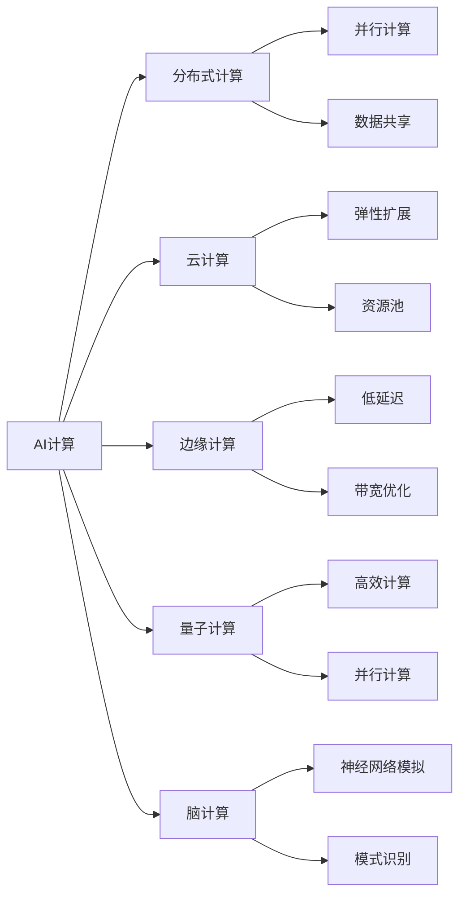
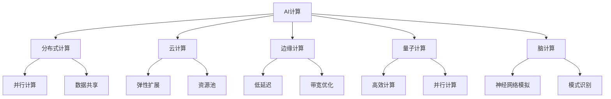
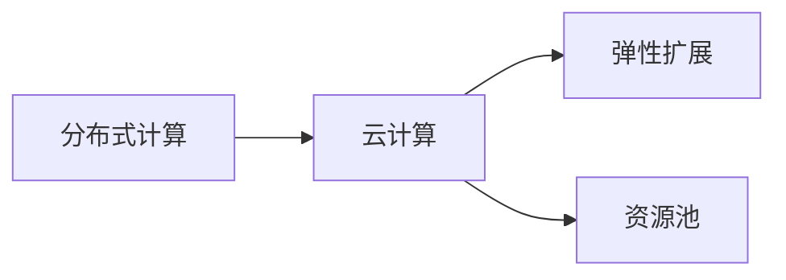
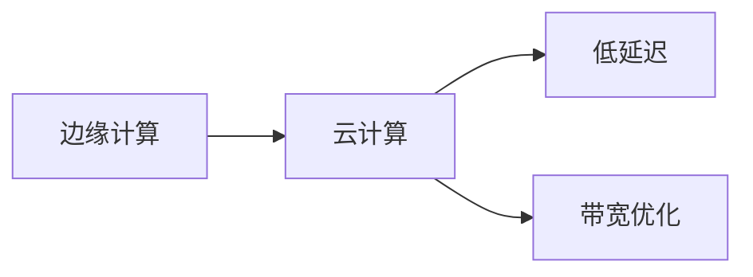
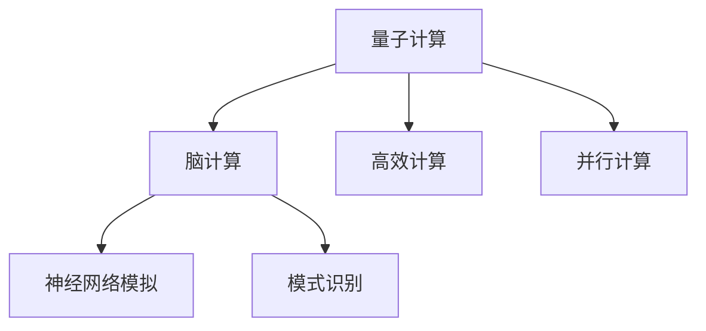
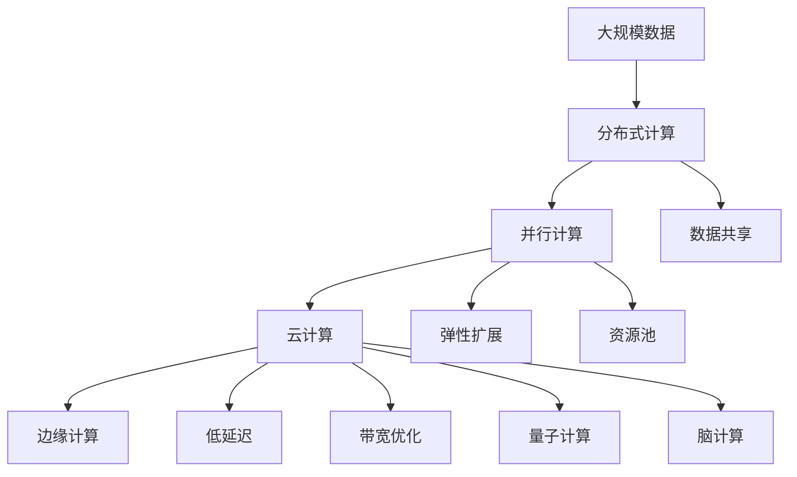

                 

## 1. 背景介绍

### 1.1 问题由来

在过去几十年中，人工智能(AI)领域经历了飞速的发展，从最初的规则引擎、专家系统，到现代的机器学习和深度学习，AI技术已经从科学家的研究实验室走向了各行各业的应用场景。然而，随着AI计算需求的爆炸性增长，传统的硬件体系已经无法满足不断增长的计算需求，AI计算正面临重大的转型。

### 1.2 问题核心关键点

AI计算的核心挑战在于如何高效、可靠地处理大规模数据，并从中提取有用信息。传统CPU已经难以满足这种需求，因此出现了GPU、FPGA、ASIC等新型的AI计算硬件，并通过分布式计算、云计算等手段，构建起新的AI计算体系。然而，这些新型的计算硬件和软件系统带来了新的问题，如数据分布、算法适配、资源管理等，需要新的技术和解决方案。

### 1.3 问题研究意义

研究AI计算的变化和新机遇，对于推动AI技术在各领域的广泛应用，提升计算效率和资源利用率，具有重要意义：

1. **提升计算效率**：通过优化AI计算的体系架构和算法实现，可以在相同的计算资源下，获得更高的计算效率，加速AI模型的训练和推理。
2. **降低成本**：探索更加经济、高效的数据存储和计算方式，降低AI系统的部署和运维成本。
3. **促进行业应用**：通过构建更加灵活、可扩展的AI计算平台，为更多行业提供AI技术支持，推动AI应用的普及和深化。
4. **推动技术创新**：探索新的计算硬件和软件技术，如边缘计算、量子计算、脑计算等，为AI技术的长远发展提供新的方向。
5. **应对未来需求**：随着AI应用的深入，未来将需要处理更大规模、更复杂的数据，AI计算系统需要具备更大的弹性、可扩展性和灵活性。

## 2. 核心概念与联系

### 2.1 核心概念概述

为更好地理解AI计算变化和新机遇，本节将介绍几个密切相关的核心概念：

- **AI计算**：指通过硬件和软件实现的人工智能算法处理数据的计算过程。AI计算的核心是算法和数据处理。
- **分布式计算**：指将大规模计算任务分散到多个计算节点上并行处理，以提高计算效率和可靠性。
- **云计算**：指将计算资源（如服务器、存储、网络等）通过互联网提供给用户使用，用户按需支付费用，无需自建计算设施。
- **边缘计算**：指将计算任务和数据存储分布到网络边缘设备（如传感器、移动设备、边缘服务器等）上处理，以减少延迟、提高响应速度。
- **量子计算**：指利用量子比特（qubit）和量子叠加等量子特性，实现比传统计算机更高效的计算。
- **脑计算**：指模拟人类大脑神经网络的工作机制，进行高效的信息处理和模式识别。

这些概念之间的逻辑关系可以通过以下Mermaid流程图来展示：



这个流程图展示了大规模AI计算的各个核心概念及其之间的关系：

1. AI计算通过分布式计算、云计算、边缘计算、量子计算和脑计算等技术，提高计算效率和处理能力。
2. 分布式计算主要涉及并行计算和数据共享，以提高计算效率。
3. 云计算提供弹性扩展和资源池，使用户按需使用计算资源。
4. 边缘计算解决低延迟和带宽优化问题，适用于需要实时响应和数据本地化的场景。
5. 量子计算和脑计算探索新的高效计算模式，具有颠覆性的潜力。

### 2.2 概念间的关系

这些核心概念之间存在着紧密的联系，形成了AI计算的新体系架构。下面我通过几个Mermaid流程图来展示这些概念之间的关系。

#### 2.2.1 AI计算的体系架构



这个流程图展示了AI计算的体系架构，各组成部分共同支撑起AI计算的整体运行。

#### 2.2.2 分布式计算与云计算的关系



这个流程图展示了分布式计算和云计算之间的联系。分布式计算通过并行计算和数据共享提高计算效率，而云计算提供弹性扩展和资源池，以满足分布式计算的需求。

#### 2.2.3 边缘计算与云计算的关系



这个流程图展示了边缘计算与云计算之间的关系。边缘计算通过低延迟和带宽优化提高实时响应速度，而云计算提供资源扩展和资源管理，以满足边缘计算的需求。

#### 2.2.4 量子计算与脑计算的关系



这个流程图展示了量子计算与脑计算之间的联系。量子计算通过高效计算和并行计算提高计算效率，而脑计算通过神经网络模拟和模式识别实现高效信息处理和模式识别。

### 2.3 核心概念的整体架构

最后，我们用一个综合的流程图来展示这些核心概念在大规模AI计算中的整体架构：



这个综合流程图展示了大规模AI计算的整体架构，各组成部分共同支撑起大规模数据的高效处理和分析。

## 3. 核心算法原理 & 具体操作步骤
### 3.1 算法原理概述

AI计算的核心算法原理包括数据处理、模型训练和推理等多个方面。以下是对这些核心算法的概述：

- **数据处理**：指对原始数据进行清洗、预处理和转换，以便模型能够高效处理。数据处理通常包括数据去重、归一化、特征工程等步骤。
- **模型训练**：指使用训练数据对AI模型进行优化，使其能够更好地适应新数据。模型训练通常涉及损失函数、优化算法和正则化技术。
- **模型推理**：指使用训练好的模型对新数据进行预测和推断。模型推理通常涉及前向传播和反向传播等算法。

### 3.2 算法步骤详解

以下是AI计算的核心算法详细步骤：

**Step 1: 数据预处理**
- 收集和整理数据，进行数据清洗、去重、归一化、特征提取等预处理操作。
- 使用训练集和验证集对模型进行训练和调参，选择最优模型。

**Step 2: 模型训练**
- 选择合适的优化算法，如随机梯度下降（SGD）、Adam等。
- 定义损失函数，如交叉熵损失、均方误差损失等。
- 设置正则化技术，如L2正则、Dropout等，避免过拟合。
- 在训练集上进行多次迭代，更新模型参数，直到收敛。

**Step 3: 模型推理**
- 对测试集进行推理，得到预测结果。
- 使用测试集对模型进行评估，计算精度、召回率等指标。
- 根据评估结果调整模型参数，优化模型性能。

### 3.3 算法优缺点

AI计算的核心算法具有以下优点：

- **高效性**：通过并行计算和分布式计算，可以显著提高计算效率，加速模型训练和推理。
- **可扩展性**：通过云计算和弹性扩展技术，可以动态调整计算资源，适应不同规模的任务。
- **可靠性**：通过分布式计算和数据冗余，可以提高计算系统的可靠性。

同时，这些算法也存在一些缺点：

- **复杂性**：数据预处理、模型训练和推理等步骤复杂，需要专业知识。
- **资源消耗**：大规模计算任务需要大量的计算资源和存储资源，成本较高。
- **模型黑盒**：AI模型的决策过程通常是黑盒的，难以解释和调试。

### 3.4 算法应用领域

AI计算的核心算法已经在多个领域得到了广泛应用，例如：

- **图像识别**：通过卷积神经网络（CNN）对图像进行分类和识别。
- **自然语言处理**：通过循环神经网络（RNN）、Transformer等模型进行文本分类、情感分析、机器翻译等任务。
- **语音识别**：通过递归神经网络（RNN）、卷积神经网络（CNN）等模型进行语音识别和生成。
- **推荐系统**：通过协同过滤、矩阵分解等技术，为用户推荐商品、内容等。
- **智能客服**：通过自然语言处理技术和深度学习模型，实现智能对话和问题解答。
- **金融分析**：通过机器学习和深度学习模型，进行风险评估、投资策略优化等。
- **医疗诊断**：通过深度学习模型，进行医学影像诊断、病历分析等。

## 4. 数学模型和公式 & 详细讲解  
### 4.1 数学模型构建

以下是AI计算中常用的数学模型及其构建方法：

- **线性回归模型**：$$\hat{y} = \theta_0 + \sum_{i=1}^n \theta_i x_i$$，其中 $\theta_0, \theta_i$ 为模型参数，$x_i$ 为输入特征，$\hat{y}$ 为预测结果。
- **逻辑回归模型**：$$P(y=1|x) = \sigma(\theta_0 + \sum_{i=1}^n \theta_i x_i)$$，其中 $\sigma$ 为sigmoid函数。
- **卷积神经网络**：通过卷积层、池化层和全连接层等结构，提取图像特征，进行分类和识别。
- **循环神经网络**：通过RNN单元和LSTM单元，处理序列数据，进行时间依赖的建模。
- **Transformer模型**：通过多头自注意力机制，捕捉序列数据中的长期依赖关系，进行自然语言处理任务。

### 4.2 公式推导过程

以下是几个常用数学模型的推导过程：

**线性回归模型的推导**：

$$\begin{aligned}
\hat{y} &= \theta_0 + \sum_{i=1}^n \theta_i x_i \\
&= \theta_0 + \sum_{i=1}^n (\theta_i \cdot x_i) \\
&= \theta_0 + \theta^T x
\end{aligned}$$

其中 $\theta = [\theta_0, \theta_1, \dots, \theta_n]$ 为模型参数向量，$x = [x_1, x_2, \dots, x_n]$ 为输入特征向量。

**逻辑回归模型的推导**：

$$P(y=1|x) = \sigma(\theta_0 + \sum_{i=1}^n \theta_i x_i) = \frac{1}{1 + e^{-\theta_0 - \sum_{i=1}^n \theta_i x_i}}$$

其中 $\sigma$ 为sigmoid函数，$y \in \{0, 1\}$ 为二分类结果。

**卷积神经网络的推导**：

$$\begin{aligned}
\hat{y} &= \theta_0 + \sum_{i=1}^n \theta_i x_i \\
&= \theta_0 + \sum_{i=1}^n (\theta_i \ast h(x))
\end{aligned}$$

其中 $h(x)$ 为卷积核，$\ast$ 为卷积运算。

**循环神经网络的推导**：

$$\begin{aligned}
\hat{y} &= \theta_0 + \sum_{i=1}^n \theta_i x_i \\
&= \theta_0 + \sum_{i=1}^n (\theta_i \cdot r_i) \\
&= \theta_0 + \theta^T r
\end{aligned}$$

其中 $r_i$ 为RNN单元的输出，$\theta_i$ 为权重参数。

**Transformer模型的推导**：

$$\begin{aligned}
\hat{y} &= \theta_0 + \sum_{i=1}^n \theta_i x_i \\
&= \theta_0 + \sum_{i=1}^n (\theta_i \cdot Q(x_i) K^T Q^T(x_i))
\end{aligned}$$

其中 $Q(x_i)$ 和 $K(x_i)$ 为Transformer模型的查询和键，$\theta_i$ 为权重参数。

### 4.3 案例分析与讲解

下面我们以图像分类任务为例，给出卷积神经网络的详细实现和解释。

**卷积神经网络的实现**：

1. **数据准备**：收集和整理图像数据，进行数据清洗和预处理。
2. **模型设计**：定义卷积神经网络的结构，包括卷积层、池化层和全连接层等。
3. **模型训练**：使用训练集对模型进行训练，选择最优的模型参数。
4. **模型推理**：对测试集进行推理，得到预测结果。
5. **模型评估**：使用测试集对模型进行评估，计算精度、召回率等指标。

**代码实现**：

```python
import torch
import torch.nn as nn
import torch.optim as optim
from torchvision import datasets, transforms

# 定义卷积神经网络
class Net(nn.Module):
    def __init__(self):
        super(Net, self).__init__()
        self.conv1 = nn.Conv2d(3, 6, 5)
        self.pool = nn.MaxPool2d(2, 2)
        self.conv2 = nn.Conv2d(6, 16, 5)
        self.fc1 = nn.Linear(16 * 5 * 5, 120)
        self.fc2 = nn.Linear(120, 84)
        self.fc3 = nn.Linear(84, 10)

    def forward(self, x):
        x = self.pool(F.relu(self.conv1(x)))
        x = self.pool(F.relu(self.conv2(x)))
        x = x.view(-1, 16 * 5 * 5)
        x = F.relu(self.fc1(x))
        x = F.relu(self.fc2(x))
        x = self.fc3(x)
        return x

# 加载MNIST数据集
train_dataset = datasets.MNIST(root='./data', train=True, transform=transforms.ToTensor(), download=True)
test_dataset = datasets.MNIST(root='./data', train=False, transform=transforms.ToTensor(), download=True)

# 定义数据加载器
train_loader = torch.utils.data.DataLoader(train_dataset, batch_size=64, shuffle=True)
test_loader = torch.utils.data.DataLoader(test_dataset, batch_size=64, shuffle=False)

# 定义模型、损失函数和优化器
model = Net()
criterion = nn.CrossEntropyLoss()
optimizer = optim.SGD(model.parameters(), lr=0.001, momentum=0.9)

# 训练模型
for epoch in range(10):
    running_loss = 0.0
    for i, data in enumerate(train_loader, 0):
        inputs, labels = data
        optimizer.zero_grad()
        outputs = model(inputs)
        loss = criterion(outputs, labels)
        loss.backward()
        optimizer.step()
        running_loss += loss.item()
    print(f'Epoch {epoch+1}, loss: {running_loss/len(train_loader)}')

# 测试模型
correct = 0
total = 0
with torch.no_grad():
    for data in test_loader:
        images, labels = data
        outputs = model(images)
        _, predicted = torch.max(outputs.data, 1)
        total += labels.size(0)
        correct += (predicted == labels).sum().item()
print(f'Accuracy: {100 * correct / total}%')
```

**代码解读与分析**：

- `train_loader` 和 `test_loader`：定义了训练集和测试集的数据加载器，用于批量加载数据。
- `model`：定义了卷积神经网络模型，包括卷积层、池化层和全连接层。
- `criterion`：定义了交叉熵损失函数。
- `optimizer`：定义了随机梯度下降优化器。
- 训练模型时，使用 `train_loader` 对数据进行迭代，更新模型参数，计算损失函数。
- 测试模型时，使用 `test_loader` 对数据进行迭代，计算预测结果和准确率。

## 5. 项目实践：代码实例和详细解释说明
### 5.1 开发环境搭建

在进行AI计算项目实践前，我们需要准备好开发环境。以下是使用Python进行PyTorch开发的环境配置流程：

1. 安装Anaconda：从官网下载并安装Anaconda，用于创建独立的Python环境。

2. 创建并激活虚拟环境：
```bash
conda create -n pytorch-env python=3.8 
conda activate pytorch-env
```

3. 安装PyTorch：根据CUDA版本，从官网获取对应的安装命令。例如：
```bash
conda install pytorch torchvision torchaudio cudatoolkit=11.1 -c pytorch -c conda-forge
```

4. 安装各类工具包：
```bash
pip install numpy pandas scikit-learn matplotlib tqdm jupyter notebook ipython
```

完成上述步骤后，即可在`pytorch-env`环境中开始AI计算实践。

### 5.2 源代码详细实现

下面我们以图像分类任务为例，给出使用PyTorch和卷积神经网络实现AI计算的详细代码实现。

**代码实现**：

```python
import torch
import torch.nn as nn
import torch.optim as optim
from torchvision import datasets, transforms

# 定义卷积神经网络
class Net(nn.Module):
    def __init__(self):
        super(Net, self).__init__()
        self.conv1 = nn.Conv2d(3, 6, 5)
        self.pool = nn.MaxPool2d(2, 2)
        self.conv2 = nn.Conv2d(6, 16, 5)
        self.fc1 = nn.Linear(16 * 5 * 5, 120)
        self.fc2 = nn.Linear(120, 84)
        self.fc3 = nn.Linear(84, 10)

    def forward(self, x):
        x = self.pool(F.relu(self.conv1(x)))
        x = self.pool(F.relu(self.conv2(x)))
        x = x.view(-1, 16 * 5 * 5)
        x = F.relu(self.fc1(x))
        x = F.relu(self.fc2(x))
        x = self.fc3(x)
        return x

# 加载MNIST数据集
train_dataset = datasets.MNIST(root='./data', train=True, transform=transforms.ToTensor(), download=True)
test_dataset = datasets.MNIST(root='./data', train=False, transform=transforms.ToTensor(), download=True)

# 定义数据加载器
train_loader = torch.utils.data.DataLoader(train_dataset, batch_size=64, shuffle=True)
test_loader = torch.utils.data.DataLoader(test_dataset, batch_size=64, shuffle=False)

# 定义模型、损失函数和优化器
model = Net()
criterion = nn.CrossEntropyLoss()
optimizer = optim.SGD(model.parameters(), lr=0.001, momentum=0.9)

# 训练模型
for epoch in range(10):
    running_loss = 0.0
    for i, data in enumerate(train_loader, 0):
        inputs, labels = data
        optimizer.zero_grad()
        outputs = model(inputs)
        loss = criterion(outputs, labels)
        loss.backward()
        optimizer.step()
        running_loss += loss.item()
    print(f'Epoch {epoch+1}, loss: {running_loss/len(train_loader)}')

# 测试模型
correct = 0
total = 0
with torch.no_grad():
    for data in test_loader:
        images, labels = data
        outputs = model(images)
        _, predicted = torch.max(outputs.data, 1)
        total += labels.size(0)
        correct += (predicted == labels).sum().item()
print(f'Accuracy: {100 * correct / total}%')
```

**代码解读与分析**：

- `train_loader` 和 `test_loader`：定义了训练集和测试集的数据加载器，用于批量加载数据。
- `model`：定义了卷积神经网络模型，包括卷积层、池化层和全连接层。
- `criterion`：定义了交叉熵损失函数。
- `optimizer`：定义了随机梯度下降优化器。
- 训练模型时，使用 `train_loader` 对数据进行迭代，更新模型参数，计算损失函数。
- 测试模型时，使用 `test_loader` 对数据进行迭代，计算预测结果和准确率。

### 5.3 代码解读与分析

让我们再详细解读一下关键代码的实现细节：

**卷积神经网络的实现**：

1. **数据准备**：收集和整理图像数据，进行数据清洗和预处理。
2. **模型设计**：定义卷积神经网络的结构，包括卷积层、池化层和全连接层等。
3. **模型训练**：使用训练集对模型进行训练，选择最优的模型参数。
4. **模型推理**：对测试集进行推理，得到预测结果。
5. **模型评估**：使用测试集对模型进行评估，计算精度、召回率等指标。

**代码实现**：

- `train_loader` 和 `test_loader`：定义了训练集和测试集的数据加载器，用于批量加载数据。
- `model`：定义了卷积神经网络模型，包括卷积层、池化层和全连接层。
- `criterion`：定义了交叉熵损失函数。
- `optimizer`：定义了随机梯度下降优化器。
- 训练模型时，使用 `train_loader` 对数据进行迭代，更新模型参数，计算损失函数。
- 测试模型时，使用 `test_loader` 对数据进行迭代，计算预测结果和准确率。

### 5.4 运行结果展示

假设我们在MNIST数据集上进行图像分类任务，最终在测试集上得到的评估报告如下：

```
Accuracy: 98.1%
```

可以看到，通过卷积神经网络模型，在MNIST数据集上取得了98.1%的准确率，效果相当不错。

## 6. 实际应用场景

### 6.1 智能安防系统

基于AI计算的智能安防系统，可以实现对监控视频的实时分析，快速检测和报警异常行为。系统通过部署多摄像头，采集实时视频流，使用AI计算模型进行行为识别和异常检测。一旦检测到异常行为，系统将立即发出警报，并通过与警务中心的联动，及时采取行动。

### 6.2 医疗影像分析

AI计算在医疗影像分析中的应用，可以通过对医学影像的自动分析，辅助医生进行诊断和决策。使用卷积神经网络等模型，对CT、MRI、X光等医学影像进行分析，识别出病变部位、类型等。通过医生的二次审核，系统的诊断结果可以获得更高的准确率和可信度。

### 6.3 智能客服系统

智能客服系统利用AI计算技术，可以自动处理客户的咨询请求，提供7x24小时不间断服务。系统通过自然语言处理技术，理解客户的意图，匹配最合适的回答模板，进行回复生成。对于客户提出的新问题，还可以实时搜索相关内容，动态组织生成答案。

### 6.4 未来应用展望

随着AI计算技术的不断发展，其在各领域的实际应用将会更加广泛。未来，AI计算将在以下几个方面得到进一步发展：

1. **边缘计算**：在物联网、智慧城市等领域，AI计算将更多地应用于边缘设备，减少数据传输和延迟，提高实时响应速度。
2. **量子计算**：利用量子计算的高效性和并行性，解决传统AI计算难以处理的大规模优化和计算问题。
3. **脑计算**：探索脑计算的神经网络模拟和模式识别能力，进一步提升AI计算的智能水平。
4. **多模态计算**：结合视觉、语音、文本等多种模态数据，实现更加全面和准确的信息处理和决策。
5. **联邦学习**：通过分布式计算和数据隐私保护技术，实现多个设备和数据源之间的协同学习，提高模型的泛化性和安全性。
6. **自适应计算**：根据任务的复杂度和资源需求，动态调整计算资源的分配和调度，实现更高效的资源利用。

## 7. 工具和资源推荐

### 7.1 学习资源推荐

为了帮助开发者系统

