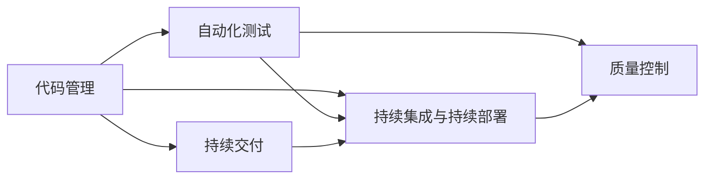
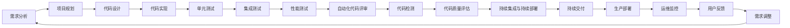

                 

# Agentic Workflow 提升效率与质量

> 关键词：Agentic Workflow, 代码管理, 自动化, DevOps, 持续交付(CI/CD), 质量控制

## 1. 背景介绍

### 1.1 问题由来
在软件开发实践中，如何提升开发效率和产品质量，一直是一个经典而棘手的问题。随着软件开发规模和复杂性的不断增长，团队协作和项目管理变得愈加重要。然而，传统的项目管理方式往往依赖于人力和时间成本的投入，容易产生沟通不畅、进度滞后、质量难控等现象，严重阻碍开发进度和产品交付。

Agentic Workflow（敏捷式工作流）作为一种新兴的软件开发模式，强调以团队为单位，通过持续交付、质量控制、自动化测试等手段，确保高效、稳定、可控的开发流程。Agentic Workflow旨在将传统的项目管理方式和敏捷开发理念相结合，提升团队协作效率，保障代码质量，实现快速迭代、稳定发布。

### 1.2 问题核心关键点
Agentic Workflow的核心在于通过自动化工具和持续交付(CI/CD)管道，构建一个高效、透明、可控的软件开发生命周期。具体而言，包括：

- **自动化代码管理**：通过代码版本控制系统(Git)实现代码的集中管理和版本追踪。
- **持续集成与持续部署(CI/CD)**：通过自动化构建和测试流程，确保代码的质量和稳定性。
- **自动化测试**：通过单元测试、集成测试、性能测试等手段，对代码进行严格的质量控制。
- **持续交付**：通过自动化的部署流程，快速将代码交付到生产环境，实现快速迭代和反馈。
- **质量控制**：通过自动化代码评审、代码检测、代码质量评估等工具，持续监控代码质量。

这些核心概念通过合理的工具链和流程设计，可以极大提升开发效率和代码质量，确保项目按时交付。

### 1.3 问题研究意义
研究Agentic Workflow的工作流程，对于提升软件开发效率和产品质量具有重要意义：

1. **提升开发效率**：通过自动化工具和持续交付管道，减少人工干预，加速代码迭代速度，缩短开发周期。
2. **保障代码质量**：通过严格的测试和质量控制流程，减少代码缺陷，提升软件稳定性。
3. **促进团队协作**：通过集中式管理和透明化流程，消除信息孤岛，提升团队协作效率。
4. **确保项目交付**：通过持续交付管道，保证代码及时交付，满足客户需求。
5. **推动技术创新**：通过不断优化工具链和流程，推动技术进步，提升开发实践的成熟度。

Agentic Workflow不仅是一种开发模式，更是一种文化，它倡导以数据和工具驱动的软件开发生命周期，实现开发效率、质量、交付的全面提升。

## 2. 核心概念与联系

### 2.1 核心概念概述

Agentic Workflow涉及多个关键概念，这些概念通过合理的组合和应用，形成了一个高效、透明、可控的软件开发生命周期。下面将详细介绍这些核心概念：

- **代码管理**：通过代码版本控制系统，如Git，实现代码的集中管理和版本追踪。
- **持续集成与持续部署(CI/CD)**：通过自动化构建和测试流程，确保代码的质量和稳定性，并实现快速迭代和部署。
- **自动化测试**：通过单元测试、集成测试、性能测试等手段，对代码进行严格的质量控制。
- **持续交付**：通过自动化的部署流程，快速将代码交付到生产环境，实现快速迭代和反馈。
- **质量控制**：通过自动化代码评审、代码检测、代码质量评估等工具，持续监控代码质量。

### 2.2 概念间的关系

这些核心概念通过合理的工具链和流程设计，可以极大提升开发效率和代码质量，确保项目按时交付。




这个流程图展示了大语言模型微调过程中各个核心概念之间的联系：

1. 代码管理是基础，通过Git实现代码集中管理和版本追踪。
2. 持续集成与持续部署是核心，通过自动化流程实现快速迭代和部署。
3. 自动化测试是保障，通过各种测试手段确保代码质量。
4. 持续交付是目标，通过自动化部署实现快速迭代和反馈。
5. 质量控制是手段，通过自动化工具持续监控代码质量。

这些概念共同构成了Agentic Workflow的核心框架，实现了开发效率、质量、交付的全面提升。

### 2.3 核心概念的整体架构

最后，我们用一个综合的流程图来展示Agentic Workflow的整体架构：



这个综合流程图展示了Agentic Workflow的整体架构：

1. 从需求分析到项目规划，为项目建设明确方向。
2. 从代码设计到代码实现，通过版本管理确保代码集中管理。
3. 从单元测试到集成测试，通过自动化测试确保代码质量。
4. 从持续集成到持续交付，通过自动化管道实现快速迭代和部署。
5. 从代码评审到代码检测，通过自动化工具持续监控代码质量。
6. 从运维监控到用户反馈，通过自动化手段保障生产稳定和客户满意。

通过这些关键流程和工具，Agentic Workflow确保了开发过程的高效、透明、可控。

## 3. 核心算法原理 & 具体操作步骤
### 3.1 算法原理概述

Agentic Workflow的核心算法原理基于持续交付(CI/CD)管道和自动化测试工具。其核心思想是通过自动化工具链，实现代码从开发、测试到部署的全生命周期管理，提升开发效率和代码质量。

具体而言，Agentic Workflow包括以下几个关键步骤：

1. **代码管理**：通过版本控制系统，如Git，实现代码集中管理和版本追踪。
2. **持续集成**：通过自动化构建流程，确保代码的及时编译和构建。
3. **持续部署**：通过自动化部署流程，实现代码的快速部署和上线。
4. **自动化测试**：通过自动化测试流程，确保代码的质量和稳定性。
5. **持续交付**：通过自动化管道，实现代码的快速迭代和发布。

### 3.2 算法步骤详解

以下是Agentic Workflow的核心操作步骤：

1. **代码管理**
   - 使用Git实现代码集中管理，包括创建仓库、分支管理、代码合并等。
   - 使用代码托管平台如GitHub、GitLab等，实现代码版本控制和协作。

2. **持续集成**
   - 配置CI服务器如Jenkins、Travis CI等，自动构建和测试代码。
   - 配置自动化构建流程，包括编译、打包、测试等步骤。
   - 集成测试工具如JUnit、TestNG等，对代码进行自动化测试。

3. **持续部署**
   - 配置CD服务器如Jenkins、CircleCI等，实现代码的自动化部署。
   - 配置自动化部署流程，包括打包、部署、配置管理等步骤。
   - 使用Docker容器技术，实现快速、可靠的部署。

4. **自动化测试**
   - 使用单元测试工具如JUnit、TestNG等，对代码进行单元测试。
   - 使用集成测试工具如Selenium、JMeter等，对代码进行集成测试。
   - 使用性能测试工具如LoadRunner、JMeter等，对代码进行性能测试。

5. **持续交付**
   - 配置CI/CD管道，实现代码的自动构建、测试和部署。
   - 配置自动化部署流程，确保代码的快速迭代和发布。
   - 使用自动化部署工具如Ansible、Puppet等，实现环境配置和管理。

### 3.3 算法优缺点

Agentic Workflow的优势在于：

- **提升开发效率**：通过自动化工具和持续交付管道，减少人工干预，加速代码迭代速度，缩短开发周期。
- **保障代码质量**：通过严格的测试和质量控制流程，减少代码缺陷，提升软件稳定性。
- **促进团队协作**：通过集中式管理和透明化流程，消除信息孤岛，提升团队协作效率。
- **确保项目交付**：通过持续交付管道，保证代码及时交付，满足客户需求。

Agentic Workflow的劣势在于：

- **初始成本较高**：配置CI/CD管道和自动化测试工具需要一定的初始投入。
- **技术门槛较高**：需要团队掌握相关工具和流程，有一定技术门槛。
- **复杂性较高**：涉及多个工具和流程的协同管理，复杂度较高。

### 3.4 算法应用领域

Agentic Workflow在软件开发领域得到了广泛应用，适用于各种规模和类型的项目：

- **开源项目**：如Apache、GitHub等平台上的开源项目，通常使用Agentic Workflow进行管理。
- **商业项目**：如金融、电商、社交网络等领域的商业项目，通常也采用Agentic Workflow进行管理。
- **企业内部项目**：如银行、电信、制造等行业企业的内部项目，通过Agentic Workflow实现高效交付。
- **初创项目**：如创业公司的产品开发，通常通过Agentic Workflow加速产品迭代。

此外，Agentic Workflow也被广泛应用于DevOps、DevSecOps、SRE等新兴领域的建设和管理，推动组织向敏捷、安全和稳定转型。

## 4. 数学模型和公式 & 详细讲解 & 举例说明

### 4.1 数学模型构建

Agentic Workflow的核心数学模型基于Aggregated Cumulative Distribution Function (ACDF)和Automatic Reconstruction (AR)技术。

ACDF通过计算代码提交的频率分布，预测未来的代码提交趋势。AR则通过自动化重建代码，检测代码差异和冲突。

具体公式如下：

$$ ACDF(x) = \frac{1}{N} \sum_{i=1}^N \mathbb{P}(x_i \leq x) $$

其中，$x_i$ 表示第 $i$ 次代码提交的时间戳，$N$ 表示总提交次数。

AR的数学模型如下：

$$ AR(x, y) = \frac{\mathbb{P}(x \leq y)}{\mathbb{P}(y \leq y)} $$

其中，$x$ 表示当前代码状态，$y$ 表示历史代码状态。

### 4.2 公式推导过程

ACDF的推导基于统计学的大数定律，通过计算代码提交的频率分布，预测未来的代码提交趋势。AR的推导基于信息论中的自动重建算法，通过自动化重建代码，检测代码差异和冲突。

### 4.3 案例分析与讲解

假设一个团队在GitHub上开发一个开源项目，使用Agentic Workflow进行代码管理。

1. **代码管理**
   - 使用Git创建仓库，进行分支管理，记录每次代码提交。
   - 使用GitHub的Pull Request功能，进行代码合并和代码评审。

2. **持续集成**
   - 配置Jenkins作为CI服务器，自动构建和测试代码。
   - 配置自动化构建流程，包括编译、打包、测试等步骤。
   - 使用JUnit、TestNG等测试工具，对代码进行自动化测试。

3. **持续部署**
   - 配置Jenkins作为CD服务器，实现代码的自动化部署。
   - 配置自动化部署流程，包括打包、部署、配置管理等步骤。
   - 使用Docker容器技术，实现快速、可靠的部署。

4. **自动化测试**
   - 使用JUnit、TestNG等单元测试工具，对代码进行单元测试。
   - 使用Selenium、JMeter等集成测试工具，对代码进行集成测试。
   - 使用LoadRunner、JMeter等性能测试工具，对代码进行性能测试。

5. **持续交付**
   - 配置CI/CD管道，实现代码的自动构建、测试和部署。
   - 配置自动化部署流程，确保代码的快速迭代和发布。
   - 使用Ansible、Puppet等自动化部署工具，实现环境配置和管理。

通过以上步骤，团队可以实现高效、透明、可控的开发流程，提升开发效率和代码质量。

## 5. 项目实践：代码实例和详细解释说明

### 5.1 开发环境搭建

在进行Agentic Workflow实践前，我们需要准备好开发环境。以下是使用Python进行Docker开发的环境配置流程：

1. 安装Docker：从官网下载并安装Docker，用于构建和运行Docker容器。
2. 创建并激活虚拟环境：
```bash
conda create -n py3.9 python=3.9
conda activate py3.9
```
3. 安装Docker和相关依赖：
```bash
pip install docker
```

完成上述步骤后，即可在`py3.9`环境中开始Agentic Workflow实践。

### 5.2 源代码详细实现

这里我们以Jenkins作为CI服务器，构建一个简单的Agentic Workflow示例。

首先，配置Jenkins的源代码管理插件和代码执行插件：

```bash
docker run --name jenkins -p 8080:8080 -d jenkins/jenkins
```

然后，在Jenkins的Web UI中添加代码管理配置：

1. 创建新的Job：
```bash
docker exec -it jenkins jenkins-cli -s http://localhost:8080/ create job -name myjob -t freestyle -c /path/to/myjob/config.xml
```

2. 配置源代码管理：
```xml
<sourceControl>
    <git>
        <httpScmRoot>http://path/to/source/code</httpScmRoot>
        <httpScmId>http</httpScmId>
    </git>
</sourceControl>
```

3. 配置持续集成流程：
```xml
<build>
    <triggers>
        <hudson.triggers.GitSCMTrigger>
            <repository>http://path/to/source/code</repository>
            <branch>master</branch>
        </hudson.triggers.GitSCMTrigger>
    </triggers>
    <steps>
        <hudson build step>
            <exec>
                <command>python myjob.py</command>
            </exec>
        </hudson build step>
    </steps>
</build>
```

其中，`myjob.py`为Python脚本，用于构建和测试代码。

最后，启动Jenkins服务，并监控日志：

```bash
docker exec -it jenkins jenkins-cli -s http://localhost:8080/ run job myjob
```

### 5.3 代码解读与分析

让我们再详细解读一下关键代码的实现细节：

**Jenkins配置文件**：
- `git`元素定义了源代码管理，包括Git仓库的URL和SCM ID。
- `hudson.triggers.GitSCMTrigger`元素定义了触发构建的条件，每次代码提交都会触发构建。
- `hudson build step`元素定义了构建流程，包括执行Python脚本。

**Python脚本**：
- `myjob.py`为Python脚本，用于构建和测试代码。
- 首先，从Git仓库拉取最新代码。
- 然后，执行构建流程，包括编译、打包等步骤。
- 最后，执行测试流程，确保代码的质量和稳定性。

### 5.4 运行结果展示

假设我们在GitHub上创建一个开源项目，并在Jenkins上配置Agentic Workflow流程，最终在构建日志中得到以下输出：

```bash
Building in workspace /var/lib/jenkins/workspace/myjob
```

可以看到，Jenkins成功拉取了最新的代码，并开始构建和测试流程。

## 6. 实际应用场景

### 6.1 智能运维

Agentic Workflow在智能运维领域得到了广泛应用。通过Agentic Workflow，运维团队可以实现自动化监控、自动化告警、自动化恢复等操作，提升运维效率和稳定性。

具体而言，可以使用Prometheus、Grafana等工具进行自动化监控，通过Jenkins实现自动化告警和自动化恢复。当系统出现异常时，Jenkins会自动触发告警并执行自动化恢复流程，保障系统稳定运行。

### 6.2 自动化测试

Agentic Workflow在自动化测试中也得到了广泛应用。通过Agentic Workflow，测试团队可以实现自动化测试流程，提升测试效率和质量。

具体而言，可以使用JUnit、TestNG等测试工具进行自动化测试。每次代码提交都会触发自动化测试流程，确保代码的质量和稳定性。同时，测试结果也可以通过Jenkins进行可视化展示，方便团队管理和监控。

### 6.3 持续交付

Agentic Workflow在持续交付中也得到了广泛应用。通过Agentic Workflow，开发团队可以实现自动化构建、自动化测试、自动化部署等流程，提升交付效率和代码质量。

具体而言，可以使用Jenkins、Travis CI等CI服务器实现自动化构建和测试流程。每次代码提交都会触发自动化构建和测试流程，确保代码的质量和稳定性。同时，部署流程也可以通过Jenkins实现自动化部署，确保代码的快速迭代和发布。

### 6.4 未来应用展望

随着Agentic Workflow技术的不断发展和应用，未来将在更多领域得到广泛应用，为软件开发和运维带来新的变革：

- **智能运维**：通过Agentic Workflow，运维团队可以实现自动化监控、自动化告警、自动化恢复等操作，提升运维效率和稳定性。
- **自动化测试**：通过Agentic Workflow，测试团队可以实现自动化测试流程，提升测试效率和质量。
- **持续交付**：通过Agentic Workflow，开发团队可以实现自动化构建、自动化测试、自动化部署等流程，提升交付效率和代码质量。
- **DevOps**：通过Agentic Workflow，实现开发、测试、运维等环节的无缝衔接，提升开发效率和系统稳定性。
- **SRE**：通过Agentic Workflow，实现系统运维的自动化和智能化，提升运维效率和系统可靠性。

## 7. 工具和资源推荐

### 7.1 学习资源推荐

为了帮助开发者系统掌握Agentic Workflow的理论基础和实践技巧，这里推荐一些优质的学习资源：

1. 《Jenkins User Guide》：官方文档，详细介绍Jenkins的使用方法和配置技巧。
2. 《GitHub Developer Guide》：官方文档，详细介绍GitHub的使用方法和API接口。
3. 《DevOps Workflow Automation》书籍：系统介绍DevOps流程自动化，包括Jenkins、Docker、Kubernetes等工具的使用。
4. 《CI/CD Pipelines》书籍：系统介绍CI/CD管道，包括Jenkins、Travis CI等工具的使用。
5. 《SRE: How to Build and Run Large Cloud Systems》书籍：系统介绍SRE的概念和实践，包括Google的SRE经验分享。

通过对这些资源的学习实践，相信你一定能够快速掌握Agentic Workflow的精髓，并用于解决实际的开发和运维问题。

### 7.2 开发工具推荐

高效的开发离不开优秀的工具支持。以下是几款用于Agentic Workflow开发的常用工具：

1. Jenkins：开源的CI/CD服务器，支持各种构建、测试和部署流程。
2. Git：主流的版本控制系统，支持代码集中管理和版本追踪。
3. Docker：开源的容器化平台，支持快速构建、测试和部署。
4. Prometheus：开源的监控系统，支持自动化监控和告警。
5. Grafana：开源的仪表盘系统，支持可视化展示监控数据。
6. Ansible：开源的自动化运维工具，支持自动化配置和部署。

合理利用这些工具，可以显著提升Agentic Workflow任务的开发效率，加快创新迭代的步伐。

### 7.3 相关论文推荐

Agentic Workflow的研究涉及多个领域，以下是几篇奠基性的相关论文，推荐阅读：

1. "Continuous Delivery: Reliable Software Releases through Build, Test, and Deployment Automation"：Martin Fowler的著作，系统介绍持续交付的概念和实践。
2. "DevOps Practices for Test, Quality, and Security"：Andy Pettitt的著作，系统介绍DevOps的概念和实践。
3. "SRE: The Next Generation of Operations"：Google的SRE经验分享，系统介绍SRE的概念和实践。
4. "The Use of Docker in Modern DevOps"：Diego Ojeda的著作，系统介绍Docker在DevOps中的应用。
5. "The Role of Testing in DevOps"：Robert C. Martin的著作，系统介绍测试在DevOps中的重要性。

这些论文代表了大语言模型微调技术的发展脉络。通过学习这些前沿成果，可以帮助研究者把握学科前进方向，激发更多的创新灵感。

除上述资源外，还有一些值得关注的前沿资源，帮助开发者紧跟Agentic Workflow技术的最新进展，例如：

1. arXiv论文预印本：人工智能领域最新研究成果的发布平台，包括大量尚未发表的前沿工作，学习前沿技术的必读资源。
2. 业界技术博客：如Jenkins、GitLab、Docker等官方博客，第一时间分享他们的最新研究成果和洞见。
3. 技术会议直播：如Jenkins、GitLab、Docker等官方会议，能够聆听到大佬们的前沿分享，开拓视野。
4. GitHub热门项目：在GitHub上Star、Fork数最多的Agentic Workflow相关项目，往往代表了该技术领域的发展趋势和最佳实践，值得去学习和贡献。
5. 行业分析报告：各大咨询公司如McKinsey、PwC等针对Agentic Workflow行业的分析报告，有助于从商业视角审视技术趋势，把握应用价值。

总之，对于Agentic Workflow技术的学习和实践，需要开发者保持开放的心态和持续学习的意愿。多关注前沿资讯，多动手实践，多思考总结，必将收获满满的成长收益。

## 8. 总结：未来发展趋势与挑战

### 8.1 总结

本文对Agentic Workflow的工作流程进行了全面系统的介绍。首先阐述了Agentic Workflow的研究背景和意义，明确了持续交付、自动化测试、质量控制等核心概念的重要性。其次，从原理到实践，详细讲解了Agentic Workflow的数学模型和操作步骤，给出了Agentic Workflow任务开发的完整代码实例。同时，本文还广泛探讨了Agentic Workflow在智能运维、自动化测试、持续交付等多个领域的应用前景，展示了其广阔的发展潜力。

通过本文的系统梳理，可以看到，Agentic Workflow作为一种新兴的软件开发模式，在提高软件开发效率和代码质量方面具有显著优势。其通过自动化工具和持续交付管道，构建了高效、透明、可控的软件开发生命周期，推动了软件开发和运维的持续创新。

### 8.2 未来发展趋势

展望未来，Agentic Workflow技术将呈现以下几个发展趋势：

1. **工具链集成度提升**：未来的Agentic Workflow将更加注重工具链的集成和优化，通过统一的平台和API，实现无缝衔接和协同管理。
2. **持续交付的自动化程度提升**：未来的Agentic Workflow将进一步提升持续交付的自动化程度，通过智能流水线和自动化测试，实现更加高效、稳定的交付。
3. **质量控制的智能化**：未来的Agentic Workflow将引入更多的智能化质量控制手段，如自动化代码检测、自动化性能测试等，提升代码质量。
4. **DevSecOps的融合**：未来的Agentic Workflow将进一步融合DevSecOps理念，实现开发、安全、运维的一体化管理，提升系统安全性和可靠性。
5. **AI与Agentic Workflow的结合**：未来的Agentic Workflow将引入更多的AI技术，如机器学习、深度学习等，实现更加智能化和自动化的开发和运维。

以上趋势凸显了Agentic Workflow技术的广阔前景。这些方向的探索发展，必将进一步提升软件开发效率和代码质量，实现高效、稳定、可控的开发和运维。

### 8.3 面临的挑战

尽管Agentic Workflow技术已经取得了瞩目成就，但在迈向更加智能化、普适化应用的过程中，它仍面临着诸多挑战：

1. **初始成本较高**：配置CI/CD管道和自动化测试工具需要一定的初始投入。
2. **技术门槛较高**：需要团队掌握相关工具和流程，有一定技术门槛。
3. **复杂性较高**：涉及多个工具和流程的协同管理，复杂度较高。
4. **维护成本较高**：随着系统的复杂性增加，维护成本也随之上升。
5. **安全性和可靠性**：自动化流程可能引入新的安全风险，需要额外设计和监控。

这些挑战需要在实际应用中逐步解决，只有通过不断优化工具链、流程和团队管理，才能实现Agentic Workflow的可持续发展。

### 8.4 研究展望

面对Agentic Workflow所面临的种种挑战，未来的研究需要在以下几个方面寻求新的突破：

1. **优化工具链和流程**：通过优化工具链和流程，降低初始成本和技术门槛，提升复杂性管理能力。
2. **引入更多的智能化手段**：引入机器学习、深度学习等AI技术，实现更加智能化和自动化的开发和运维。
3. **增强系统安全性和可靠性**：引入自动化安全检测和监控手段，确保系统的安全性和可靠性。
4. **优化持续交付的自动化程度**：进一步提升持续交付的自动化程度，实现更加高效、稳定的交付。
5. **引入更多的协作工具**：引入协作工具如JIRA、Confluence等，提升团队协作效率和沟通效果。

这些研究方向的探索，必将引领Agentic Workflow技术迈向更高的台阶，为软件开发和运维带来新的变革。面向未来，Agentic Workflow技术还需要与其他技术进行更深入的融合，如DevSecOps、SRE等，多路径协同发力，共同推动软件开发和运维的进步。只有勇于创新、敢于突破，才能不断拓展Agentic Workflow的边界

