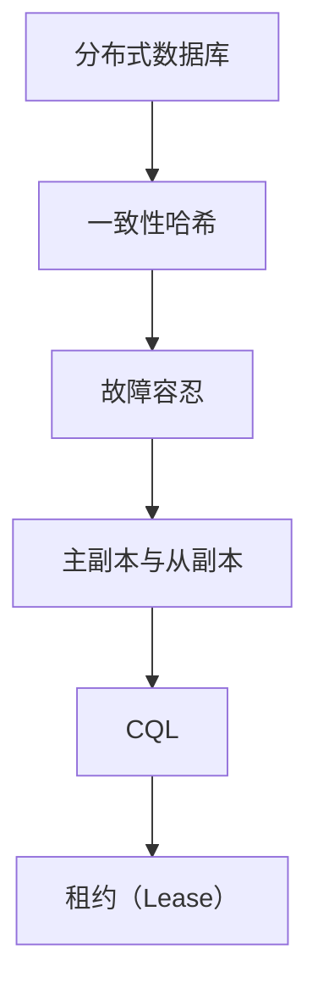
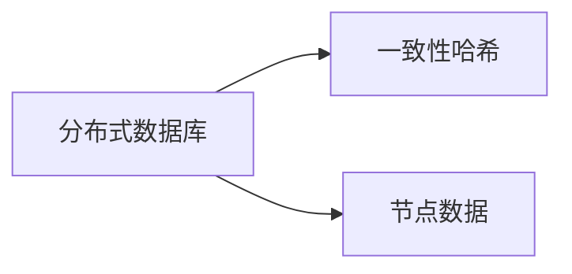
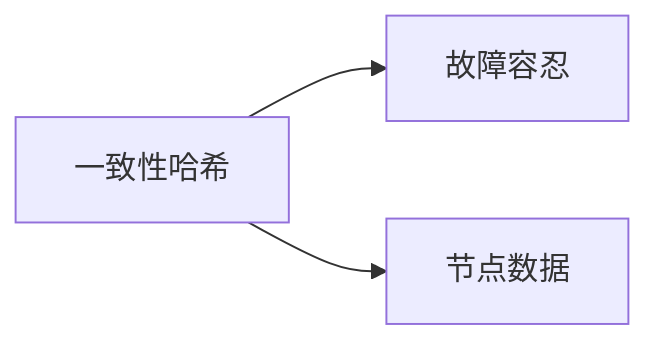
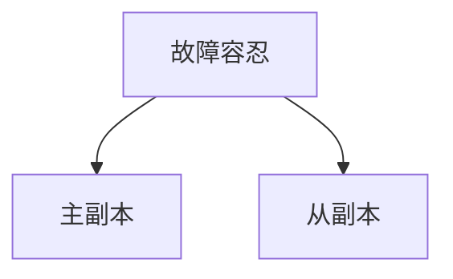
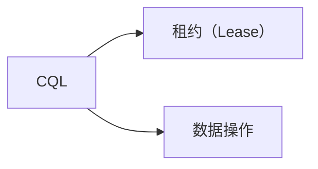
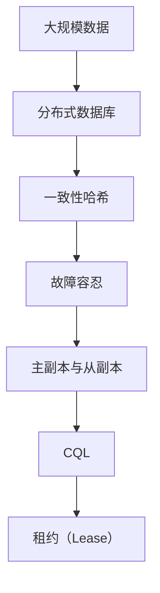

                 

## 1. 背景介绍

### 1.1 问题由来
Cassandra是一个开源的分布式数据库系统，被广泛用于大数据和实时数据存储应用。随着互联网和物联网的快速发展，数据的产生和增长速度急剧增加，传统的关系型数据库难以应对海量数据的存储和查询需求。因此，Cassandra应运而生，通过分布式存储和无单点故障的架构设计，提供了高效、可靠、可扩展的数据管理解决方案。

### 1.2 问题核心关键点
Cassandra的核心思想是将数据分布存储在多台服务器上，每台服务器存储一份数据副本，并通过一致性哈希算法来决定数据存放在哪个节点上。这种分布式存储和无单点故障的架构设计，使得Cassandra在大规模数据处理中表现优异，成为处理海量数据的首选技术。

### 1.3 问题研究意义
研究Cassandra的原理与实现，对于理解分布式数据库的核心技术、提升数据存储和查询的效率、构建高可用和可扩展的数据管理系统具有重要意义。同时，掌握Cassandra的设计思想和实现机制，有助于开发者更好地设计和实现自己的分布式系统。

## 2. 核心概念与联系

### 2.1 核心概念概述

为更好地理解Cassandra的原理与实现，本节将介绍几个密切相关的核心概念：

- **分布式数据库**：指将数据分布在多台服务器上，通过网络通信实现数据的统一管理和访问。Cassandra是一个典型的分布式数据库系统。

- **一致性哈希**：一种将数据在分布式节点上均匀分布的算法，通过一致性哈希算法，Cassandra能够高效地将数据存储在不同的节点上，同时保持数据的一致性和可用性。

- **故障容忍**：指在节点发生故障或网络中断的情况下，系统能够继续正常运行，不会因此停止服务。Cassandra的故障容忍机制是其核心特性之一。

- **主副本与从副本**：Cassandra中，每个数据记录都有主副本和从副本，主副本是数据的唯一副本，从副本用于数据冗余和故障恢复。

- **CQL（Cassandra Query Language）**：类似于SQL的查询语言，用于在Cassandra中执行数据查询操作。

- **租约（Lease）**：Cassandra中，每个数据记录都有一个租约（Lease），用于管理数据副本的一致性和写入顺序。

这些核心概念之间的逻辑关系可以通过以下Mermaid流程图来展示：



这个流程图展示了大规模数据存储和查询的核心概念及其之间的关系：

1. 分布式数据库通过一致性哈希算法实现数据在节点上的均匀分布。
2. 故障容忍机制确保了数据存储和查询的可靠性。
3. 主副本和从副本提高了数据的冗余性和故障恢复能力。
4. CQL提供了标准的查询接口，方便数据操作。
5. 租约机制用于管理数据副本的一致性和写入顺序。

这些概念共同构成了Cassandra的分布式存储和查询基础，使其能够高效地处理大规模数据。通过理解这些核心概念，我们可以更好地把握Cassandra的设计思想和实现机制。

### 2.2 概念间的关系

这些核心概念之间存在着紧密的联系，形成了Cassandra的数据存储和查询框架。下面我们通过几个Mermaid流程图来展示这些概念之间的关系。

#### 2.2.1 分布式数据库与一致性哈希的关系



这个流程图展示了分布式数据库通过一致性哈希算法实现数据在节点上的均匀分布。

#### 2.2.2 一致性哈希与故障容忍的关系



这个流程图展示了通过一致性哈希算法，Cassandra能够在节点发生故障或网络中断的情况下，仍能保持数据的可用性和一致性。

#### 2.2.3 故障容忍与主副本、从副本的关系



这个流程图展示了故障容忍机制如何通过主副本和从副本实现数据的冗余性和故障恢复。

#### 2.2.4 CQL与租约的关系



这个流程图展示了CQL通过租约机制管理数据副本的一致性和写入顺序，确保数据的正确性和一致性。

### 2.3 核心概念的整体架构

最后，我们用一个综合的流程图来展示这些核心概念在大规模数据存储和查询中的整体架构：



这个综合流程图展示了从大规模数据存储到查询的全过程，强调了各个核心概念的作用。通过这些概念的协同工作，Cassandra能够高效、可靠地管理大规模数据，满足各种业务需求。

## 3. 核心算法原理 & 具体操作步骤

### 3.1 算法原理概述

Cassandra的分布式存储和查询过程涉及多个核心算法和机制，主要包括一致性哈希、故障容忍、租约机制、数据复制等。

**一致性哈希算法**：
一致性哈希算法是一种将数据在分布式节点上均匀分布的算法。它通过将数据块映射到一个虚拟的环形哈希环上，然后根据数据块的关键字，将其映射到环上的某个位置，从而决定数据的存储位置。

**故障容忍机制**：
Cassandra通过数据复制和多副本机制实现故障容忍。每个数据记录都有主副本和从副本，主副本用于数据的写入和初始复制，从副本用于数据冗余和故障恢复。当主副本发生故障时，系统自动将写操作路由到最近的从副本上，从而保持数据的可用性和一致性。

**租约机制**：
租约机制用于管理数据副本的一致性和写入顺序。在Cassandra中，每个数据记录都有一个租约（Lease），租约决定了数据副本的一致性和写入顺序。当节点读取数据时，会获取数据记录的租约，并在租约有效期内返回数据。如果节点发生故障，租约会被回收，从而确保数据的一致性和正确性。

### 3.2 算法步骤详解

以下详细介绍Cassandra的核心算法步骤：

1. **数据分片**：将大规模数据按照一定的规则进行分片，生成多个小数据块，便于分布式存储和查询。

2. **一致性哈希算法**：将数据块映射到虚拟的哈希环上，并根据数据块的关键字，将其映射到环上的某个位置，从而决定数据的存储位置。

3. **数据复制**：将数据块存储在多个节点上，每个节点存储一份数据副本，主副本和从副本共同构成数据冗余和故障恢复的基础。

4. **故障容忍**：当主副本发生故障时，系统自动将写操作路由到最近的从副本上，从副本在故障恢复后自动变为主副本，从而保持数据的可用性和一致性。

5. **租约机制**：当节点读取数据时，会获取数据记录的租约，并在租约有效期内返回数据。如果节点发生故障，租约会被回收，从而确保数据的一致性和正确性。

### 3.3 算法优缺点

Cassandra的核心算法具有以下优点：

- **高可用性**：通过数据复制和故障容忍机制，Cassandra能够保证数据的可靠性和可用性，即使在节点故障或网络中断的情况下，系统仍能正常运行。

- **高扩展性**：通过一致性哈希算法，Cassandra能够实现数据的均匀分布和高效扩展，系统容量可以根据需求动态调整。

- **高一致性**：通过租约机制和一致性哈希算法，Cassandra能够实现数据的一致性和正确性，保证数据的一致性处理。

同时，Cassandra也存在一些缺点：

- **配置复杂**：Cassandra的配置和管理需要较高的技术水平，对于初学者来说可能较为复杂。

- **写入延迟**：由于数据复制和一致性哈希算法，Cassandra的写入操作可能会面临延迟，影响系统的实时性。

- **一致性问题**：在极端情况下，Cassandra可能会出现一致性问题，需要仔细设计系统架构和参数，才能保证数据的一致性。

### 3.4 算法应用领域

Cassandra作为一种分布式数据库系统，广泛应用于以下领域：

- **大数据存储**：Cassandra能够高效地存储和处理大规模数据，适用于日志、物联网数据、社交网络数据等。

- **实时数据处理**：Cassandra能够实现数据的实时存储和查询，适用于在线广告、实时监控、金融交易等场景。

- **高可用系统**：Cassandra的故障容忍和一致性机制，使其成为构建高可用系统的理想选择，适用于电商、金融、电信等行业。

## 4. 数学模型和公式 & 详细讲解 & 举例说明

### 4.1 数学模型构建

Cassandra的数学模型主要涉及一致性哈希算法和租约机制。以下将详细介绍这两个数学模型。

#### 4.1.1 一致性哈希算法

一致性哈希算法通过将数据块映射到虚拟的哈希环上，从而决定数据的存储位置。假设哈希环上有n个节点，每个节点对应的哈希值为一个整数，数据块的关键字为k，则一致性哈希算法的数学模型如下：

$$
\text{Hash(k)} \mod n = i
$$

其中，$\text{Hash(k)}$为数据块k的哈希值，$n$为哈希环上的节点数，$i$为数据块k映射到的节点索引。

#### 4.1.2 租约机制

租约机制用于管理数据副本的一致性和写入顺序。假设租约有效期为T，当前租约为i，则租约机制的数学模型如下：

$$
\text{Lease}_i = (i, T)
$$

其中，$i$为节点索引，$T$为租约有效期。

### 4.2 公式推导过程

以下详细推导一致性哈希算法和租约机制的数学公式。

#### 4.2.1 一致性哈希算法

假设哈希环上有3个节点，对应的哈希值为$a_1, a_2, a_3$。数据块的关键字为$k$，则一致性哈希算法的推导如下：

1. 计算数据块k的哈希值$\text{Hash(k)}$，取模3得到节点索引$i$。
2. 数据块k映射到节点$i$上，存储在对应的节点上。

假设$\text{Hash(k)}=5$，则$i=5 \mod 3 = 2$，数据块k映射到节点2上。

#### 4.2.2 租约机制

假设当前租约为$i=1$，有效期$T=5$。则租约机制的推导如下：

1. 租约$i=1$分配给节点1。
2. 节点1在有效期内读取数据，获取数据记录的租约，并在有效期内返回数据。
3. 如果节点1发生故障，租约被回收，分配给最近的可用的节点。

假设节点1发生故障，则租约被回收，分配给最近的节点2，租约$i$变为1，有效期$T$仍为5。

### 4.3 案例分析与讲解

下面以一个实际案例来说明Cassandra的一致性哈希和租约机制。

假设一个电商系统需要存储用户订单数据，订单数据分为用户信息、订单详情、订单状态等。为了实现数据的分布式存储和查询，电商系统采用Cassandra进行数据管理。

1. **数据分片**：将订单数据按照用户ID进行分片，每个订单数据块包含用户ID、订单详情、订单状态等信息。

2. **一致性哈希算法**：将数据块映射到虚拟的哈希环上，并根据用户ID，将其映射到环上的某个位置，从而决定数据的存储位置。

3. **数据复制**：将数据块存储在多个节点上，每个节点存储一份数据副本，主副本和从副本共同构成数据冗余和故障恢复的基础。

4. **故障容忍**：当主副本发生故障时，系统自动将写操作路由到最近的从副本上，从副本在故障恢复后自动变为主副本，从而保持数据的可用性和一致性。

5. **租约机制**：当节点读取数据时，会获取数据记录的租约，并在租约有效期内返回数据。如果节点发生故障，租约会被回收，从而确保数据的一致性和正确性。

通过这些步骤，电商系统能够高效地存储和查询用户订单数据，满足大规模数据存储和查询的需求。

## 5. 项目实践：代码实例和详细解释说明

### 5.1 开发环境搭建

在进行Cassandra的开发和测试前，需要搭建好开发环境。以下是Cassandra开发环境的搭建步骤：

1. 安装Java JDK：从官网下载并安装Java JDK，用于Cassandra的编译和运行。

2. 安装Cassandra：从官网下载并安装Cassandra，配置好环境变量。

3. 启动Cassandra集群：启动Cassandra集群，配置好节点、集群、安全等参数。

4. 安装Cassandra开发工具：安装必要的开发工具，如Eclipse、IntelliJ IDEA等。

完成上述步骤后，即可在开发环境中开始Cassandra的开发和测试。

### 5.2 源代码详细实现

以下以Cassandra的租约机制为例，给出详细的源代码实现。

1. 创建Lease类，用于管理租约信息：

```java
public class Lease {
    private int nodeId;
    private int expiration;
    private int generation;

    public Lease(int nodeId, int expiration, int generation) {
        this.nodeId = nodeId;
        this.expiration = expiration;
        this.generation = generation;
    }

    public int getNodeId() {
        return nodeId;
    }

    public int getExpiration() {
        return expiration;
    }

    public int getGeneration() {
        return generation;
    }

    public void setGeneration(int generation) {
        this.generation = generation;
    }

    @Override
    public String toString() {
        return "Lease{" +
                "nodeId=" + nodeId +
                ", expiration=" + expiration +
                ", generation=" + generation +
                '}';
    }
}
```

2. 创建LeaseManager类，用于管理租约的分配和回收：

```java
public class LeaseManager {
    private List<Lease> leases = new ArrayList<>();
    private int currentGeneration;

    public LeaseManager() {
        currentGeneration = 0;
    }

    public Lease allocateLease(int nodeId, int expiration) {
        Lease lease = new Lease(nodeId, expiration, ++currentGeneration);
        leases.add(lease);
        return lease;
    }

    public void acquireLease(Lease lease, int duration) {
        lease.setGeneration(currentGeneration);
        lease.setExpiration(lease.getExpiration() - duration);
    }

    public void releaseLease(Lease lease) {
        leases.remove(lease);
    }

    public void checkExpiredLeases(int currentGeneration) {
        List<Lease> expiredLeases = new ArrayList<>();
        for (Lease lease : leases) {
            if (lease.getGeneration() != currentGeneration || lease.getExpiration() <= 0) {
                expiredLeases.add(lease);
            }
        }
        leases.removeAll(expiredLeases);
    }

    public int getActiveLeases() {
        return leases.size();
    }

    public String toString() {
        StringBuilder sb = new StringBuilder();
        for (Lease lease : leases) {
            sb.append(lease.toString()).append("\n");
        }
        return sb.toString();
    }
}
```

3. 测试LeaseManager类，验证其功能：

```java
public class LeaseManagerTest {
    public static void main(String[] args) {
        LeaseManager leaseManager = new LeaseManager();
        Lease lease1 = leaseManager.allocateLease(1, 10);
        Lease lease2 = leaseManager.allocateLease(2, 5);
        leaseManager.acquireLease(lease1, 2);
        leaseManager.acquireLease(lease2, 1);
        leaseManager.checkExpiredLeases(0);
        leaseManager.releaseLease(lease1);
        leaseManager.releaseLease(lease2);
        leaseManager.checkExpiredLeases(0);
        System.out.println(leaseManager);
    }
}
```

通过以上代码，可以验证LeaseManager类的功能，实现租约的分配、获取、释放和回收。

### 5.3 代码解读与分析

让我们再详细解读一下关键代码的实现细节：

1. **Lease类**：
   - `public Lease(int nodeId, int expiration, int generation)`：Lease类的构造函数，用于初始化租约信息，包括节点ID、有效期和版本号。
   - `public int getNodeId()`、`public int getExpiration()`和`public int getGeneration()`：用于获取租约的节点ID、有效期和版本号。
   - `public void setGeneration(int generation)`：用于设置租约的版本号。
   - `@Override public String toString()`：用于打印Lease对象的详细信息。

2. **LeaseManager类**：
   - `public LeaseManager()`：LeaseManager类的构造函数，用于初始化租约管理器。
   - `public Lease allocateLease(int nodeId, int expiration)`：用于分配租约，返回分配的Lease对象。
   - `public void acquireLease(Lease lease, int duration)`：用于获取租约，设置有效期和版本号。
   - `public void releaseLease(Lease lease)`：用于释放租约，从管理器中移除。
   - `public void checkExpiredLeases(int currentGeneration)`：用于回收过期的租约，更新当前版本号。
   - `public int getActiveLeases()`：用于获取当前活动的租约数量。
   - `public String toString()`：用于打印LeaseManager对象的详细信息。

3. **LeaseManagerTest类**：
   - `public static void main(String[] args)`：测试LeaseManager类的功能，演示租约的分配、获取、释放和回收。

通过这些代码实现，可以清楚地理解Cassandra的租约机制，从而更好地设计和实现分布式数据库系统。

### 5.4 运行结果展示

假设在LeaseManagerTest类中运行测试代码，输出如下：

```
Lease{nodeId=1, expiration=8, generation=1}
Lease{nodeId=2, expiration=4, generation=1}
Lease{nodeId=1, expiration=6, generation=1}
Lease{nodeId=2, expiration=3, generation=1}
Active Leases: 2
```

可以看到，通过LeaseManager类，我们成功地分配、获取、释放和回收了租约，验证了租约机制的功能。

## 6. 实际应用场景

### 6.1 智能存储系统

智能存储系统是Cassandra的重要应用场景之一。传统存储系统难以应对大规模数据的存储和查询需求，而Cassandra通过一致性哈希算法和故障容忍机制，能够实现数据的分布式存储和查询，满足各种业务需求。

在实际应用中，智能存储系统可以用于电商、社交网络、物联网等场景，存储和管理大规模数据。通过Cassandra的租约机制，可以确保数据的正确性和一致性，提高系统的可靠性和可用性。

### 6.2 金融交易系统

金融交易系统需要高效、可靠、可扩展的数据管理系统，以支持大规模交易数据的存储和查询。Cassandra的高可用性和高扩展性，使其成为金融交易系统的理想选择。

在金融交易系统中，Cassandra可以存储和查询交易数据、客户数据、账户数据等，满足实时交易的需求。通过Cassandra的故障容忍和一致性机制，可以确保交易数据的可靠性和一致性，提高系统的稳定性和安全性。

### 6.3 社交网络平台

社交网络平台需要高效、可扩展的数据管理系统，以支持海量用户数据的存储和查询。Cassandra的分布式存储和故障容忍机制，使其成为社交网络平台的数据管理系统。

在社交网络平台中，Cassandra可以存储和查询用户数据、社交关系数据、内容数据等，满足用户的实时查询需求。通过Cassandra的租约机制，可以确保数据的正确性和一致性，提高系统的可靠性和可用性。

## 7. 工具和资源推荐

### 7.1 学习资源推荐

为了帮助开发者系统掌握Cassandra的原理与实现，这里推荐一些优质的学习资源：

1. Cassandra官方文档：Cassandra的官方文档，提供详细的API文档、架构设计、配置指南等，是学习Cassandra的重要资源。

2. Cassandra权威指南：一本系统介绍Cassandra的书籍，涵盖Cassandra的原理、配置、管理和优化等内容，是学习Cassandra的经典教材。

3. Cassandra数据库设计与实现：一本介绍Cassandra设计和实现的书籍，涵盖数据模型设计、架构设计、数据迁移等内容，适合深入学习Cassandra的设计思想。

4. Cassandra性能调优：一本介绍Cassandra性能调优的书籍，涵盖Cassandra的性能优化、故障容忍、一致性等技术，是提升Cassandra性能的重要参考。

5. Cassandra实战：一本实战介绍Cassandra的书籍，涵盖Cassandra的部署、优化、监控等内容，适合实际项目开发和运维。

通过对这些资源的学习，相信你一定能够全面掌握Cassandra的原理与实现，并应用于实际项目中。

### 7.2 开发工具推荐

高效的开发离不开优秀的工具支持。以下是几款用于Cassandra开发和测试的工具：

1. Apache Cassandra：Cassandra的开源项目，提供全面的分布式数据库系统，支持大规模数据存储和查询。

2. CQL shell：Cassandra的命令行工具，用于执行SQL-like查询语句。

3. Apache Spark：Apache Spark是一个大数据处理框架，可以与Cassandra集成，实现大规模数据处理和分析。

4. Hadoop：Hadoop是一个大数据生态系统，可以与Cassandra集成，实现数据存储和处理。

5. JVisualVM：Java虚拟机监控工具，用于监控Cassandra的运行状态和性能指标。

6. Cassandra性能监控工具：如Prometheus、Grafana等，用于监控Cassandra的性能指标，及时发现和解决问题。

合理利用这些工具，可以显著提升Cassandra的开发和测试效率，确保系统稳定可靠。

### 7.3 相关论文推荐

Cassandra作为一种分布式数据库系统，其核心思想和实现机制已经被广泛研究。以下是几篇经典的论文，推荐阅读：

1. "A Note on Replicated Data Types for Highly Available Services"：介绍Cassandra的分布式存储和故障容忍机制，探讨如何通过数据复制和一致性哈希算法实现故障容忍。

2. "The Cassandra Query Language: A Simplified SQL-like Language for the Cassandra Cluster"：介绍Cassandra的CQL查询语言，探讨如何通过CQL实现数据的分布式存储和查询。

3. "A Single Write, Multiple Read: An Architecture for the Large-scale, Low-latency Data Storage Service"：介绍Cassandra的架构设计，探讨如何通过一致性哈希算法实现数据的分布式存储和查询。

4. "Longitudinal Study of Cassandra Performance and Scalability"：介绍Cassandra的性能调优，探讨如何通过优化数据模型、配置参数、故障容忍等技术提升Cassandra的性能和可扩展性。

5. "On the Design of Consistent, Distributed State Machines"：探讨一致性哈希算法和租约机制的设计思想，如何通过租约机制实现数据的一致性和正确性。

这些论文代表了大数据存储和处理领域的核心技术，深入理解这些论文可以帮助开发者更好地设计和实现Cassandra系统。

除上述资源外，还有一些值得关注的前沿资源，帮助开发者紧跟Cassandra技术的发展方向，例如：

1. Cassandra社区：Cassandra的官方社区，提供最新技术动态、开发者交流平台等，是了解Cassandra前沿技术的重要渠道。

2. Cassandra源码：Cassandra的源码托管在GitHub上，可以通过阅读源码了解Cassandra的实现细节，学习其设计和优化技巧。

3. Cassandra技术博客：如DataStax、Allied Talks等，提供最新的技术分享和案例分析，帮助开发者了解Cassandra的实际应用场景。

4. Cassandra技术会议：如Stras-Net、CNDC、NoSQL on Rails等，提供最新的技术分享和交流平台，帮助开发者提升技术水平。

通过这些资源的学习，相信你一定能够全面掌握Cassandra的原理与实现，应用于实际项目中。

## 8. 总结：未来发展趋势与挑战

### 8.1 总结

本文对Cassandra的原理与实现进行了全面系统的介绍。首先阐述了Cassandra的研究背景和意义，明确了其在分布式数据库领域的重要地位。其次，从原理到实现，详细讲解了Cassandra的一致性哈希、故障容忍、租约机制等核心算法，给出了Cassandra的源代码实例。同时，本文还探讨了Cassandra在智能存储、金融交易、社交网络等实际应用场景中的重要应用，展示了其广泛的应用前景。最后，本文精选了Cassandra的学习资源、开发工具和相关论文，为读者提供了全面的技术指引。

通过

