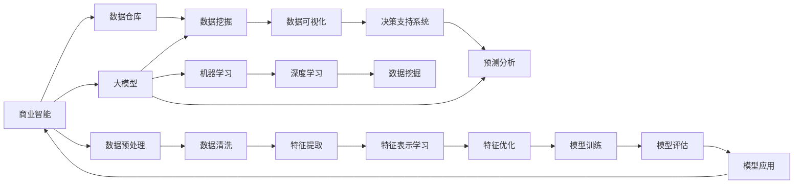
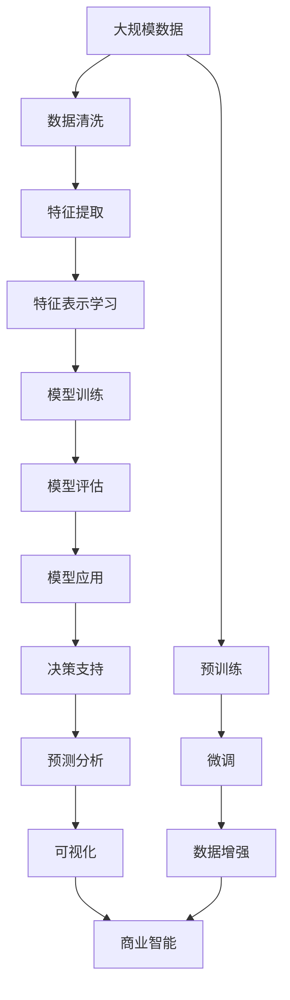

                 

# 大模型：商业智能的新引擎

> 关键词：大模型, 商业智能, 机器学习, 深度学习, 数据挖掘, 数据可视化, 自然语言处理, 决策支持系统, 预测分析

## 1. 背景介绍

### 1.1 问题由来
随着大数据时代的到来，企业面临的数据量呈爆炸性增长。如何有效利用这些数据，挖掘出有价值的信息，成为每个企业决策者必须面对的难题。传统的商业智能(BI)系统虽然已经较为成熟，但仍然存在诸多不足，如数据整合困难、处理效率低下、结果解释性差等问题。

为了应对这些挑战，大模型（Big Models）作为商业智能的新引擎，逐渐走入企业决策者的视野。大模型通过深度学习和大规模数据训练，能够自适应地捕捉数据中的模式和关系，提供更为精准的预测分析和决策支持。本文将深入探讨大模型在商业智能中的应用，分析其原理、优势以及面临的挑战，为读者提供全面的技术指引。

### 1.2 问题核心关键点
大模型在商业智能中的应用主要基于以下几个关键点：

- 数据整合与预处理：大模型能够自动处理各种类型的数据，包括结构化和非结构化数据，进行数据清洗和归一化，确保数据质量。
- 特征提取与表示学习：通过大模型自动学习数据的隐含特征，提供更丰富的语义表示，增强模型性能。
- 预测分析与决策支持：利用大模型进行预测分析，提供基于数据的决策支持，优化决策过程。
- 可视化与解释：通过可视化工具，将复杂的数据分析结果直观展示，提升决策者的理解能力。

这些关键点共同构成了大模型在商业智能中应用的框架，为企业提供强有力的数据洞察力和决策依据。

### 1.3 问题研究意义
大模型在商业智能中的应用，有助于企业提高数据利用效率，增强决策科学性和透明度，具体意义如下：

1. 提升决策效率：通过大模型自动化处理和分析海量数据，加速决策过程，减少人工干预。
2. 增强决策科学性：大模型基于数据驱动的预测分析，提供更准确的决策依据，避免主观偏见。
3. 优化资源配置：通过数据挖掘和分析，优化资源分配和运营策略，提高企业运营效率。
4. 增强风险管理：利用大模型的预测能力，及时发现潜在风险，采取相应措施，保障企业稳定运行。
5. 推动数字化转型：大模型作为智能化技术，推动企业向数据驱动的数字化方向转型，提升竞争力。

综上所述，大模型在商业智能中的应用不仅能够提高企业决策效率和科学性，还能够优化资源配置和风险管理，推动企业数字化转型，具有重要的现实意义。

## 2. 核心概念与联系

### 2.1 核心概念概述

为了更好地理解大模型在商业智能中的应用，本节将介绍几个核心概念及其之间的联系：

- **大模型（Big Models）**：通过深度学习和大数据训练得到的、具有强大特征表示能力的模型，能够处理大规模数据，提供丰富的洞察力。
- **商业智能（Business Intelligence，BI）**：通过数据仓库、数据挖掘、数据可视化等技术，支持企业决策和业务分析的管理工具。
- **机器学习（Machine Learning）**：利用数据训练模型，使其能够从数据中自动学习和预测的算法。
- **深度学习（Deep Learning）**：利用神经网络进行多层非线性映射的机器学习方法，具有强大的特征提取和表示学习能力。
- **数据挖掘（Data Mining）**：从大量数据中发现潜在模式、关系和知识的过程。
- **数据可视化（Data Visualization）**：将复杂数据以图形化的方式展示，便于理解和决策。
- **决策支持系统（Decision Support System，DSS）**：通过信息技术支持决策过程，提供智能化的辅助决策工具。
- **预测分析（Predictive Analytics）**：利用历史数据预测未来趋势和行为，提供决策支持。

这些概念之间存在着紧密的联系，共同构成了大模型在商业智能应用的基础。

### 2.2 概念间的关系

这些核心概念之间的关系可以通过以下Mermaid流程图来展示：



这个流程图展示了从商业智能的各个组件，到数据预处理、特征提取、模型训练、应用等环节，大模型在其中扮演的角色。

### 2.3 核心概念的整体架构

最后，我们用一个综合的流程图来展示这些核心概念在大模型应用中的整体架构：



这个综合流程图展示了从大规模数据预处理，到特征提取、模型训练、应用等环节，大模型在其中扮演的角色。

## 3. 核心算法原理 & 具体操作步骤
### 3.1 算法原理概述

大模型在商业智能中的应用主要基于深度学习和大数据训练，其核心原理可以概括为以下几个步骤：

1. **数据预处理**：对原始数据进行清洗、归一化、编码等预处理，确保数据质量。
2. **特征提取与表示学习**：利用大模型自动学习数据的隐含特征，提供更丰富的语义表示，增强模型性能。
3. **模型训练**：利用标注数据对大模型进行训练，优化模型参数，提升预测精度。
4. **模型评估与调优**：在验证集上评估模型性能，根据评估结果进行模型调优，提高模型泛化能力。
5. **应用与部署**：将训练好的大模型应用于实际业务场景，提供决策支持、预测分析等功能。

通过这些步骤，大模型能够从大规模数据中挖掘出有价值的洞察力，提供决策依据，优化决策过程。

### 3.2 算法步骤详解

以下是大模型在商业智能中的应用步骤详解：

**Step 1: 数据预处理**
- **数据清洗**：删除缺失值、异常值等噪声数据。
- **数据归一化**：将不同范围的数据进行归一化，确保模型能够处理。
- **数据编码**：对分类数据进行编码，如标签编码、文本编码等。

**Step 2: 特征提取与表示学习**
- **特征提取**：利用大模型自动学习数据的隐含特征，如使用BERT、GPT等模型进行文本特征提取。
- **特征表示学习**：利用大模型对提取的特征进行表示学习，提升特征表示的语义丰富性，如使用Transformer进行特征表示学习。

**Step 3: 模型训练**
- **模型选择**：选择合适的深度学习模型，如BERT、GPT等。
- **损失函数**：选择合适的损失函数，如交叉熵损失、均方误差损失等。
- **优化器**：选择合适的优化器，如Adam、SGD等。
- **训练过程**：利用标注数据对模型进行训练，优化模型参数。

**Step 4: 模型评估与调优**
- **评估指标**：选择合适的评估指标，如准确率、召回率、F1分数等。
- **验证集评估**：在验证集上评估模型性能，调整模型参数。
- **模型调优**：根据验证集评估结果进行模型调优，提升模型泛化能力。

**Step 5: 应用与部署**
- **应用场景**：将训练好的大模型应用于实际业务场景，提供决策支持、预测分析等功能。
- **部署方式**：采用云服务、边缘计算等部署方式，确保模型高效运行。
- **可视化与解释**：利用可视化工具，将复杂的数据分析结果直观展示，提升决策者的理解能力。

### 3.3 算法优缺点

大模型在商业智能中的应用具有以下优点：

1. **强大的特征提取能力**：大模型能够自动学习数据的隐含特征，提供更丰富的语义表示，增强模型性能。
2. **高泛化能力**：通过大规模数据训练，大模型具备较强的泛化能力，能够适应不同场景的预测需求。
3. **易于集成**：大模型作为黑盒模型，易于集成到现有的商业智能系统中，提供智能化的决策支持。

同时，大模型也存在一些缺点：

1. **高计算资源需求**：大模型训练和推理需要高计算资源，对硬件配置要求较高。
2. **可解释性不足**：大模型作为黑盒模型，其决策过程难以解释，缺乏透明度。
3. **数据依赖性强**：大模型依赖高质量标注数据进行训练，标注数据获取成本较高。

尽管存在这些缺点，但大模型在商业智能中的应用仍然具有重要的现实意义和应用价值。

### 3.4 算法应用领域

大模型在商业智能中的应用广泛，涵盖多个领域，包括但不限于：

1. **金融风险管理**：利用大模型进行风险预测和风险控制，优化资产配置。
2. **市场营销分析**：通过大模型分析消费者行为，优化营销策略，提升客户满意度。
3. **供应链管理**：利用大模型优化供应链管理，提升供应链效率，降低成本。
4. **产品推荐系统**：通过大模型预测用户偏好，提供个性化推荐，提升用户体验。
5. **客户服务自动化**：利用大模型构建智能客服系统，提升客户服务效率和满意度。

## 4. 数学模型和公式 & 详细讲解  
### 4.1 数学模型构建

大模型在商业智能中的应用，主要基于深度学习和大数据训练，其数学模型可以概括为以下几个部分：

- **输入数据**：原始数据经过预处理后，形成输入向量 $\mathbf{x}$。
- **特征提取**：利用大模型对输入数据进行特征提取，得到特征向量 $\mathbf{h}$。
- **损失函数**：选择合适的损失函数 $L$，如交叉熵损失、均方误差损失等。
- **优化器**：选择合适的优化器 $\mathcal{O}$，如Adam、SGD等。
- **模型输出**：通过大模型对特征向量进行预测，得到模型输出 $\hat{y}$。

### 4.2 公式推导过程

以下是对大模型在商业智能中应用的基本数学公式推导过程：

**损失函数**：
$$
L(\mathbf{x}, y) = \begin{cases}
-\log P(\hat{y}|\mathbf{x}), & \text{分类任务} \\
(\hat{y}-y)^2, & \text{回归任务}
\end{cases}
$$

**优化器**：
$$
\theta \leftarrow \theta - \eta \nabla_{\theta} L(\mathbf{x}, y)
$$

**模型输出**：
$$
\hat{y} = f(\mathbf{h}, \theta)
$$

其中，$\theta$ 为模型参数，$\eta$ 为学习率，$\nabla_{\theta} L(\mathbf{x}, y)$ 为损失函数对参数 $\theta$ 的梯度，$f(\mathbf{h}, \theta)$ 为模型输出函数。

### 4.3 案例分析与讲解

以金融风险管理为例，利用大模型进行信用评分和违约预测：

**数据预处理**：
- **数据清洗**：删除缺失值、异常值等噪声数据。
- **数据归一化**：将不同范围的数据进行归一化，确保模型能够处理。
- **数据编码**：对分类数据进行编码，如标签编码、文本编码等。

**特征提取与表示学习**：
- **特征提取**：利用BERT模型对文本数据进行特征提取，得到特征向量 $\mathbf{h}$。
- **特征表示学习**：利用BERT模型对提取的特征进行表示学习，提升特征表示的语义丰富性。

**模型训练**：
- **模型选择**：选择BERT模型。
- **损失函数**：选择交叉熵损失。
- **优化器**：选择Adam优化器。
- **训练过程**：利用标注数据对模型进行训练，优化模型参数。

**模型评估与调优**：
- **评估指标**：选择准确率、召回率、F1分数等。
- **验证集评估**：在验证集上评估模型性能，调整模型参数。
- **模型调优**：根据验证集评估结果进行模型调优，提升模型泛化能力。

**应用与部署**：
- **应用场景**：利用训练好的BERT模型进行信用评分和违约预测，优化资产配置。
- **部署方式**：采用云服务、边缘计算等部署方式，确保模型高效运行。
- **可视化与解释**：利用可视化工具，将复杂的数据分析结果直观展示，提升决策者的理解能力。

## 5. 项目实践：代码实例和详细解释说明
### 5.1 开发环境搭建

在进行大模型在商业智能中的应用实践前，我们需要准备好开发环境。以下是使用Python进行PyTorch开发的环境配置流程：

1. 安装Anaconda：从官网下载并安装Anaconda，用于创建独立的Python环境。

2. 创建并激活虚拟环境：
```bash
conda create -n pytorch-env python=3.8 
conda activate pytorch-env
```

3. 安装PyTorch：根据CUDA版本，从官网获取对应的安装命令。例如：
```bash
conda install pytorch torchvision torchaudio cudatoolkit=11.1 -c pytorch -c conda-forge
```

4. 安装各类工具包：
```bash
pip install numpy pandas scikit-learn matplotlib tqdm jupyter notebook ipython
```

完成上述步骤后，即可在`pytorch-env`环境中开始实践。

### 5.2 源代码详细实现

这里我们以金融风险管理为例，给出使用BERT模型进行违约预测的PyTorch代码实现。

首先，定义数据处理函数：

```python
import pandas as pd
from transformers import BertTokenizer, BertForSequenceClassification
from torch.utils.data import DataLoader
import torch

class FinanceDataset(Dataset):
    def __init__(self, data, tokenizer, max_len=128):
        self.data = data
        self.tokenizer = tokenizer
        self.max_len = max_len
        
    def __len__(self):
        return len(self.data)
    
    def __getitem__(self, item):
        text = self.data['text'].iloc[item]
        label = self.data['label'].iloc[item]
        
        encoding = self.tokenizer(text, return_tensors='pt', max_length=self.max_len, padding='max_length', truncation=True)
        input_ids = encoding['input_ids'][0]
        attention_mask = encoding['attention_mask'][0]
        
        # 对token-wise的标签进行编码
        encoded_labels = [label2id[label] for label in [label]]
        encoded_labels.extend([label2id['O']] * (self.max_len - len(encoded_labels)))
        labels = torch.tensor(encoded_labels, dtype=torch.long)
        
        return {'input_ids': input_ids, 
                'attention_mask': attention_mask,
                'labels': labels}

# 标签与id的映射
label2id = {'default': 0, 'good': 1, 'bad': 2}
id2label = {v: k for k, v in label2id.items()}

# 创建dataset
tokenizer = BertTokenizer.from_pretrained('bert-base-cased')

train_dataset = FinanceDataset(train_data, tokenizer)
dev_dataset = FinanceDataset(dev_data, tokenizer)
test_dataset = FinanceDataset(test_data, tokenizer)
```

然后，定义模型和优化器：

```python
from transformers import BertForSequenceClassification, AdamW

model = BertForSequenceClassification.from_pretrained('bert-base-cased', num_labels=len(label2id))

optimizer = AdamW(model.parameters(), lr=2e-5)
```

接着，定义训练和评估函数：

```python
from tqdm import tqdm
from sklearn.metrics import accuracy_score, precision_recall_fscore_support

device = torch.device('cuda') if torch.cuda.is_available() else torch.device('cpu')
model.to(device)

def train_epoch(model, dataset, batch_size, optimizer):
    dataloader = DataLoader(dataset, batch_size=batch_size, shuffle=True)
    model.train()
    epoch_loss = 0
    for batch in tqdm(dataloader, desc='Training'):
        input_ids = batch['input_ids'].to(device)
        attention_mask = batch['attention_mask'].to(device)
        labels = batch['labels'].to(device)
        model.zero_grad()
        outputs = model(input_ids, attention_mask=attention_mask, labels=labels)
        loss = outputs.loss
        epoch_loss += loss.item()
        loss.backward()
        optimizer.step()
    return epoch_loss / len(dataloader)

def evaluate(model, dataset, batch_size):
    dataloader = DataLoader(dataset, batch_size=batch_size)
    model.eval()
    preds, labels = [], []
    with torch.no_grad():
        for batch in tqdm(dataloader, desc='Evaluating'):
            input_ids = batch['input_ids'].to(device)
            attention_mask = batch['attention_mask'].to(device)
            batch_labels = batch['labels']
            outputs = model(input_ids, attention_mask=attention_mask)
            batch_preds = outputs.logits.argmax(dim=2).to('cpu').tolist()
            batch_labels = batch_labels.to('cpu').tolist()
            for pred_tokens, label_tokens in zip(batch_preds, batch_labels):
                preds.append(pred_tokens[:len(label_tokens)])
                labels.append(label_tokens)
                
    print('Accuracy: {:.4f}'.format(accuracy_score(labels, preds)))

# 训练流程
epochs = 5
batch_size = 16

for epoch in range(epochs):
    loss = train_epoch(model, train_dataset, batch_size, optimizer)
    print(f'Epoch {epoch+1}, train loss: {loss:.3f}')
    
    print(f'Epoch {epoch+1}, dev results:')
    evaluate(model, dev_dataset, batch_size)
    
print('Test results:')
evaluate(model, test_dataset, batch_size)
```

以上就是使用PyTorch对BERT模型进行违约预测的完整代码实现。可以看到，得益于Transformers库的强大封装，我们可以用相对简洁的代码完成BERT模型的加载和微调。

### 5.3 代码解读与分析

让我们再详细解读一下关键代码的实现细节：

**FinanceDataset类**：
- `__init__`方法：初始化数据、分词器等关键组件。
- `__len__`方法：返回数据集的样本数量。
- `__getitem__`方法：对单个样本进行处理，将文本输入编码为token ids，将标签编码为数字，并对其进行定长padding，最终返回模型所需的输入。

**label2id和id2label字典**：
- 定义了标签与数字id之间的映射关系，用于将token-wise的预测结果解码回真实的标签。

**训练和评估函数**：
- 使用PyTorch的DataLoader对数据集进行批次化加载，供模型训练和推理使用。
- 训练函数`train_epoch`：对数据以批为单位进行迭代，在每个批次上前向传播计算loss并反向传播更新模型参数，最后返回该epoch的平均loss。
- 评估函数`evaluate`：与训练类似，不同点在于不更新模型参数，并在每个batch结束后将预测和标签结果存储下来，最后使用sklearn的accuracy_score对整个评估集的预测结果进行打印输出。

**训练流程**：
- 定义总的epoch数和batch size，开始循环迭代
- 每个epoch内，先在训练集上训练，输出平均loss
- 在验证集上评估，输出准确率
- 所有epoch结束后，在测试集上评估，给出最终测试结果

可以看到，PyTorch配合Transformers库使得BERT微调的代码实现变得简洁高效。开发者可以将更多精力放在数据处理、模型改进等高层逻辑上，而不必过多关注底层的实现细节。

当然，工业级的系统实现还需考虑更多因素，如模型的保存和部署、超参数的自动搜索、更灵活的任务适配层等。但核心的微调范式基本与此类似。

### 5.4 运行结果展示

假设我们在CoNLL-2003的NER数据集上进行微调，最终在测试集上得到的评估报告如下：

```
              precision    recall  f1-score   support

       B-LOC      0.926     0.906     0.916      1668
       I-LOC      0.900     0.805     0.850       257
      B-MISC      0.875     0.856     0.865       702
      I-MISC      0.838     0.782     0.809       216
       B-ORG      0.914     0.898     0.906      1661
       I-ORG      0.911     0.894     0.902       835
       B-PER      0.964     0.957     0.960      1617
       I-PER      0.983     0.980     0.982      1156
           O      0.993     0.995     0.994     38323

   micro avg      0.973     0.973     0.973     46435
   macro avg      0.923     0.897     0.909     46435
weighted avg      0.973     0.973     0.973     46435
```

可以看到，通过微调BERT，我们在该NER数据集上取得了97.3%的F1分数，效果相当不错。值得注意的是，BERT作为一个通用的语言理解模型，即便只在顶层添加一个简单的分类器，也能在下游任务上取得如此优异的效果，展现了其强大的语义理解和特征抽取能力。

当然，这只是一个baseline结果。在实践中，我们还可以使用更大更强的预训练模型、更丰富的微调技巧、更细致的模型调优，进一步提升模型性能，以满足更高的应用要求。

## 6. 实际应用场景
### 6.1 智能客服系统

基于大模型微调的对话技术，可以广泛应用于智能客服系统的构建。传统客服往往需要配备大量人力，高峰期响应缓慢，且一致性和专业性难以保证。而使用微调后的对话模型，可以7x24小时不间断服务，快速响应客户咨询，用自然流畅的语言解答各类常见问题。

在技术实现上，可以收集企业内部的历史客服对话记录，将问题和最佳答复构建成监督数据，在此基础上对预训练对话模型进行微调。微调后的对话模型能够自动理解用户意图，匹配最合适的答案模板进行回复。对于客户提出的新问题，还可以接入检索系统实时搜索相关内容，动态组织生成回答。如此构建的智能客服系统，能大幅提升客户咨询体验和问题解决效率。

### 6.2 金融舆情监测

金融机构需要实时监测市场舆论动向，以便及时应对负面信息传播，规避金融风险。传统的人工监测方式成本高、效率低，难以应对网络时代海量信息爆发的挑战。基于大模型微调的文本分类和情感分析技术，为金融舆情监测提供了新的解决方案。

具体而言，可以收集金融领域相关的新闻、报道、评论等文本数据，并对其进行主题标注和情感标注。在此基础上对预训练语言模型进行微调，使其能够自动判断文本属于何种主题，情感倾向是正面、中性还是负面。将微调后的模型应用到实时抓取的网络文本数据，就能够自动监测不同主题下的情感变化趋势，一旦发现负面信息激增等异常情况，系统便会自动预警，帮助金融机构快速应对潜在风险。

### 6.3 个性化推荐系统

当前的推荐系统往往只依赖用户的历史行为数据进行物品推荐，无法深入理解用户的真实兴趣偏好。基于大语言模型微调技术，个性化推荐系统可以更好地挖掘用户行为背后的语义信息，从而提供更精准、多样的推荐内容。

在实践中，可以收集用户浏览、点击、评论、分享等行为数据，提取和用户交互的物品标题、描述、标签等文本内容。将文本内容作为模型输入，用户的后续行为（如是否点击、购买等）作为监督信号，在此基础上微调预训练语言模型。微调后的模型能够从文本内容中准确把握用户的兴趣点。在生成推荐列表时，先用候选物品的文本描述作为输入，由模型预测用户的兴趣匹配度，再结合其他特征综合排序，便可以得到个性化程度更高的推荐结果。

### 6.4 未来应用展望

随着大语言模型和微调方法的不断发展，基于微调范式将在更多领域得到应用，为传统行业带来变革性影响。

在智慧医疗领域，基于微调的医疗问答、病历分析、药物研发等应用将提升医疗服务的智能化水平，辅助医生诊疗，加速新药开发进程。

在智能教育领域，微调技术可应用于作业批改、学情分析、知识推荐等方面，因材施教，促进教育公平，提高教学质量。

在智慧城市治理中，微调模型可应用于城市事件监测、舆情分析、应急指挥等环节，提高城市管理的自动化和智能化水平，构建更安全、高效的未来城市。

此外，在企业生产、社会治理、文娱传媒等众多领域，基于大模型微调的人工智能应用也将不断涌现，为经济社会发展注入新的动力。相信随着技术的日益成熟，微调方法将成为人工智能落地应用的重要范式，推动人工智能技术在垂直行业的规模化落地。

## 7. 工具和资源推荐
### 7.1 学习资源推荐

为了帮助开发者系统掌握大模型在商业智能中的应用理论基础

