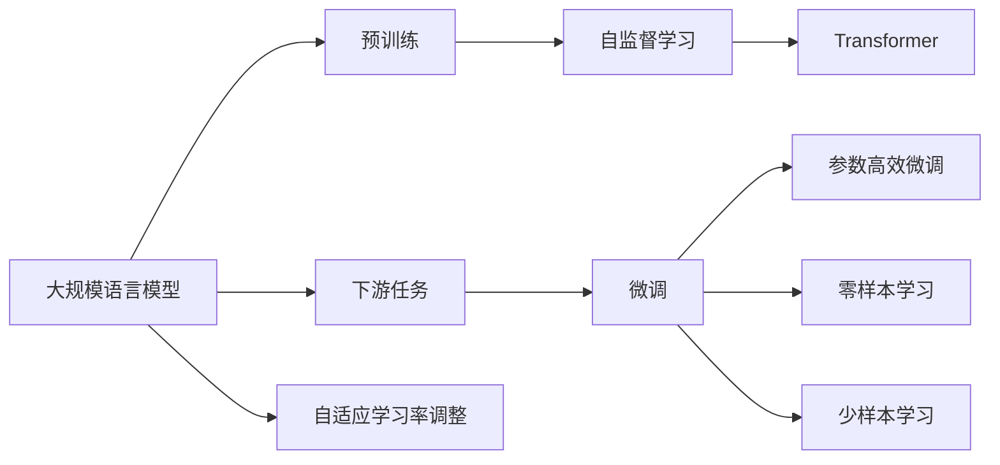

                 

# 大规模语言模型从理论到实践 模型架构

> 关键词：大规模语言模型,Transformer,BERT,预训练,自监督学习,下游任务,模型架构,深度学习,神经网络

## 1. 背景介绍

### 1.1 问题由来
近年来，深度学习技术在人工智能领域取得了显著进展，尤其是基于神经网络的自然语言处理(NLP)领域，出现了许多具有强大语言理解和生成能力的预训练模型。这些模型主要基于自监督学习（如掩码语言模型、下一个句子预测等任务）在大规模无标签文本数据上进行预训练，学习到丰富的语言知识和常识。

在预训练完成后，这些模型通常会在特定下游任务上进行微调，以适应具体的应用场景。微调过程通常使用下游任务的标注数据，通过有监督的训练方式优化模型的性能。这种预训练-微调范式在大规模语言模型上表现出色，广泛应用于问答系统、机器翻译、文本分类、情感分析等NLP任务中。

但随着预训练模型规模的不断增大，模型架构和优化策略也日益复杂。如何在确保模型性能的同时，兼顾计算资源和时间成本，成为当前研究的一个重要方向。本文将从理论和实践两方面，系统介绍大规模语言模型的模型架构及其优化策略。

## 2. 核心概念与联系

### 2.1 核心概念概述

为更好地理解大规模语言模型的架构和优化策略，本节将介绍几个关键概念：

- **大规模语言模型(Massive Language Models, MLMs)**：指使用深度学习技术，在大规模无标签文本数据上进行预训练，学习到丰富语言知识和常识的模型。这些模型通常具有数十亿甚至数百亿个参数，能够理解复杂的自然语言现象。

- **Transformer**：一种基于自注意力机制的神经网络结构，用于处理序列数据。Transformer在预训练和微调过程中广泛应用，是构建大规模语言模型的核心组件。

- **自监督学习(Self-Supervised Learning)**：通过无标签数据，利用自构建的监督信号进行模型训练，从而学习到语言数据的通用特征。Transformer模型通常使用掩码语言模型、下一个句子预测等自监督任务进行预训练。

- **下游任务(Fine-Tuning)**：指在预训练的基础上，使用下游任务的标注数据，通过有监督学习优化模型在该任务上的性能。

- **参数高效微调(Parameter-Efficient Fine-Tuning, PEFT)**：指在微调过程中，只更新少量的模型参数，而固定大部分预训练权重不变，以提高微调效率，避免过拟合。

- **自适应学习率调整(Adaptive Learning Rate Adjustment)**：在训练过程中，动态调整学习率以适应数据分布的变化，防止模型学习率过大或过小。

这些概念构成了大规模语言模型的基本框架，从预训练到微调，再到参数高效微调和自适应学习率调整，都是构建高效、高性能语言模型的重要技术手段。

### 2.2 概念间的关系

这些概念之间存在着紧密的联系，构成了大规模语言模型的完整生态系统。以下通过几个Mermaid流程图来展示这些概念之间的关系：



这个流程图展示了大规模语言模型的核心概念及其之间的关系：

1. 大规模语言模型通过预训练获得基础能力。
2. 预训练主要采用自监督学习方法，通过Transformer结构实现。
3. 下游任务通过微调进行优化，分为全参数微调和参数高效微调。
4. 自适应学习率调整在微调过程中进行，保证模型学习率动态优化。
5. 微调过程中可以应用零样本学习和少样本学习。

通过理解这些核心概念的关系，我们可以更好地把握大规模语言模型的构建和优化方向。

## 3. 核心算法原理 & 具体操作步骤
### 3.1 算法原理概述

大规模语言模型的构建和优化主要涉及以下几个核心算法：

- **Transformer结构**：一种基于自注意力机制的神经网络结构，用于处理序列数据。Transformer由编码器-解码器组成，编码器用于自监督预训练，解码器用于下游任务微调。

- **自监督学习**：通过无标签数据，利用自构建的监督信号进行模型训练，从而学习到语言数据的通用特征。常用的自监督任务包括掩码语言模型、下一个句子预测等。

- **微调**：在预训练的基础上，使用下游任务的标注数据，通过有监督学习优化模型在该任务上的性能。微调过程中，通常只更新顶层参数，以提高微调效率，避免过拟合。

- **参数高效微调**：指在微调过程中，只更新少量的模型参数，而固定大部分预训练权重不变，以提高微调效率，避免过拟合。

- **自适应学习率调整**：在训练过程中，动态调整学习率以适应数据分布的变化，防止模型学习率过大或过小。

这些算法共同构成了大规模语言模型的构建和优化流程，使得模型能够在保证性能的同时，兼顾计算资源和时间成本。

### 3.2 算法步骤详解

大规模语言模型的构建和优化通常包括以下几个关键步骤：

**Step 1: 准备预训练模型和数据集**
- 选择合适的预训练语言模型，如BERT、GPT等，作为初始化参数。
- 准备下游任务的数据集，划分为训练集、验证集和测试集。

**Step 2: 定义自监督学习任务**
- 根据模型的特点，选择适合的自监督学习任务，如掩码语言模型、下一个句子预测等。
- 设计损失函数和优化器，进行自监督预训练。

**Step 3: 添加下游任务适配层**
- 根据下游任务的特性，在预训练模型的顶层设计合适的输出层和损失函数。
- 对于分类任务，通常在顶层添加线性分类器和交叉熵损失函数。
- 对于生成任务，通常使用语言模型的解码器输出概率分布，并以负对数似然为损失函数。

**Step 4: 设置微调超参数**
- 选择合适的优化算法及其参数，如AdamW、SGD等，设置学习率、批大小、迭代轮数等。
- 设置正则化技术及强度，包括权重衰减、Dropout、Early Stopping等。
- 确定冻结预训练参数的策略，如仅微调顶层，或全部参数都参与微调。

**Step 5: 执行梯度训练**
- 将训练集数据分批次输入模型，前向传播计算损失函数。
- 反向传播计算参数梯度，根据设定的优化算法和学习率更新模型参数。
- 周期性在验证集上评估模型性能，根据性能指标决定是否触发Early Stopping。
- 重复上述步骤直到满足预设的迭代轮数或Early Stopping条件。

**Step 6: 测试和部署**
- 在测试集上评估微调后模型，对比微调前后的精度提升。
- 使用微调后的模型对新样本进行推理预测，集成到实际的应用系统中。
- 持续收集新的数据，定期重新微调模型，以适应数据分布的变化。

以上是构建和优化大规模语言模型的完整流程。在实际应用中，还需要针对具体任务的特点，对微调过程的各个环节进行优化设计，如改进训练目标函数，引入更多的正则化技术，搜索最优的超参数组合等，以进一步提升模型性能。

### 3.3 算法优缺点

大规模语言模型的构建和优化方法具有以下优点：
1. 简单高效。自监督预训练和下游任务微调过程相对简单，能够在较短时间内训练出高性能模型。
2. 通用适用。适用于各种NLP下游任务，包括分类、匹配、生成等，设计简单的任务适配层即可实现微调。
3. 参数高效。通过参数高效微调技术，可以在固定大部分预训练参数的情况下，仍可取得不错的微调效果。
4. 效果显著。在学术界和工业界的诸多任务上，基于微调的方法已经刷新了最先进的性能指标。

同时，这些方法也存在一定的局限性：
1. 依赖标注数据。自监督预训练需要大量的无标签数据，而下游任务微调依赖于标注数据，获取高质量标注数据的成本较高。
2. 迁移能力有限。当目标任务与预训练数据的分布差异较大时，微调的性能提升有限。
3. 负面效果传递。预训练模型的固有偏见、有害信息等，可能通过微调传递到下游任务，造成负面影响。
4. 可解释性不足。微调模型的决策过程通常缺乏可解释性，难以对其推理逻辑进行分析和调试。

尽管存在这些局限性，但就目前而言，自监督预训练和下游任务微调方法仍然是大规模语言模型的主流范式。未来相关研究的重点在于如何进一步降低预训练和微调对标注数据的依赖，提高模型的少样本学习和跨领域迁移能力，同时兼顾可解释性和伦理安全性等因素。

### 3.4 算法应用领域

大规模语言模型的构建和优化技术在NLP领域已经得到了广泛的应用，覆盖了几乎所有常见任务，例如：

- 文本分类：如情感分析、主题分类、意图识别等。通过自监督预训练和下游任务微调，模型能够学习文本-标签映射。
- 命名实体识别：识别文本中的人名、地名、机构名等特定实体。通过微调使模型掌握实体边界和类型。
- 关系抽取：从文本中抽取实体之间的语义关系。通过微调使模型学习实体-关系三元组。
- 问答系统：对自然语言问题给出答案。将问题-答案对作为微调数据，训练模型学习匹配答案。
- 机器翻译：将源语言文本翻译成目标语言。通过微调使模型学习语言-语言映射。
- 文本摘要：将长文本压缩成简短摘要。将文章-摘要对作为微调数据，使模型学习抓取要点。
- 对话系统：使机器能够与人自然对话。将多轮对话历史作为上下文，微调模型进行回复生成。

除了上述这些经典任务外，大规模语言模型构建和优化技术也被创新性地应用到更多场景中，如可控文本生成、常识推理、代码生成、数据增强等，为NLP技术带来了全新的突破。随着预训练模型和微调方法的不断进步，相信NLP技术将在更广阔的应用领域大放异彩。

## 4. 数学模型和公式 & 详细讲解 & 举例说明
### 4.1 数学模型构建

大规模语言模型的构建和优化通常基于深度学习框架，如PyTorch、TensorFlow等。以下以基于Transformer的BERT模型为例，详细说明其数学模型的构建过程。

### 4.2 公式推导过程

BERT模型的预训练和微调过程主要涉及以下几个关键步骤：

**Step 1: 定义输入和输出**
- 输入：文本序列$x = [x_1, x_2, ..., x_n]$，其中$x_i$表示第$i$个词的词向量表示。
- 输出：掩码语言模型的目标函数为$L = \frac{1}{n}\sum_{i=1}^{n} \log p(x_i|x_{<i})$，其中$p(x_i|x_{<i})$表示在$x_{<i}$的基础上预测$x_i$的条件概率。

**Step 2: 定义Transformer结构**
- 编码器：使用多层自注意力机制进行特征提取，每个自注意力层包含多头注意力、残差连接、层归一化等组件。
- 解码器：使用单层自注意力机制进行特征编码，每个自注意力层也包含多头注意力、残差连接、层归一化等组件。
- 输出层：根据任务类型，通常使用线性分类器或语言模型解码器。

**Step 3: 定义优化器和损失函数**
- 优化器：通常使用AdamW或Adafactor等优化算法，设置学习率、批大小等参数。
- 损失函数：根据任务类型，选择适合的损失函数，如交叉熵损失、均方误差损失等。

**Step 4: 定义微调过程**
- 前向传播：输入文本序列，计算Transformer的编码器和解码器的输出。
- 计算损失：根据输出和真实标签，计算损失函数。
- 反向传播：计算梯度，更新模型参数。
- 周期性评估：在验证集上评估模型性能，根据性能指标决定是否触发Early Stopping。

### 4.3 案例分析与讲解

以BERT模型为例，分析其在情感分析任务上的预训练和微调过程：

1. **预训练过程**
   - 输入文本序列，通过BERT编码器进行特征提取。
   - 输出掩码语言模型的概率分布，计算目标函数$L$。
   - 反向传播计算梯度，更新模型参数。

2. **微调过程**
   - 输入文本序列和标签，通过BERT解码器进行特征编码。
   - 输出分类器（如线性分类器）的预测结果，计算交叉熵损失。
   - 反向传播计算梯度，更新模型参数。

3. **优化器选择**
   - 使用AdamW优化器，设置学习率为$2e-5$，批大小为$32$。

4. **正则化技术**
   - 使用权重衰减$0.01$，Dropout$0.1$，Early Stopping等正则化技术。

5. **模型评估**
   - 在验证集上评估模型性能，计算准确率、召回率和F1分数。
   - 使用Early Stopping技术，防止过拟合。

6. **测试集评估**
   - 在测试集上评估微调后的模型性能，计算指标，并与原始BERT模型进行比较。

通过上述分析，可以全面了解BERT模型在情感分析任务上的预训练和微调过程，理解其构建和优化的关键技术。

## 5. 项目实践：代码实例和详细解释说明
### 5.1 开发环境搭建

在进行大规模语言模型的构建和优化实践前，需要先搭建开发环境。以下是使用Python进行PyTorch开发的环境配置流程：

1. 安装Anaconda：从官网下载并安装Anaconda，用于创建独立的Python环境。

2. 创建并激活虚拟环境：
```bash
conda create -n pytorch-env python=3.8 
conda activate pytorch-env
```

3. 安装PyTorch：根据CUDA版本，从官网获取对应的安装命令。例如：
```bash
conda install pytorch torchvision torchaudio cudatoolkit=11.1 -c pytorch -c conda-forge
```

4. 安装Transformers库：
```bash
pip install transformers
```

5. 安装各类工具包：
```bash
pip install numpy pandas scikit-learn matplotlib tqdm jupyter notebook ipython
```

完成上述步骤后，即可在`pytorch-env`环境中开始构建和优化大规模语言模型的实践。

### 5.2 源代码详细实现

以下是使用PyTorch和Transformer库对BERT模型进行情感分析任务微调的PyTorch代码实现。

```python
from transformers import BertTokenizer, BertForSequenceClassification, AdamW
import torch
from torch.utils.data import Dataset, DataLoader

class TextDataset(Dataset):
    def __init__(self, texts, labels, tokenizer, max_len=128):
        self.texts = texts
        self.labels = labels
        self.tokenizer = tokenizer
        self.max_len = max_len

    def __len__(self):
        return len(self.texts)

    def __getitem__(self, item):
        text = self.texts[item]
        label = self.labels[item]

        encoding = self.tokenizer(text, return_tensors='pt', max_length=self.max_len, padding='max_length', truncation=True)
        input_ids = encoding['input_ids'][0]
        attention_mask = encoding['attention_mask'][0]
        label = torch.tensor(label, dtype=torch.long)

        return {'input_ids': input_ids, 
                'attention_mask': attention_mask,
                'labels': label}

# 标签与id的映射
label2id = {'negative': 0, 'positive': 1}

# 创建dataset
tokenizer = BertTokenizer.from_pretrained('bert-base-uncased')

train_dataset = TextDataset(train_texts, train_labels, tokenizer)
dev_dataset = TextDataset(dev_texts, dev_labels, tokenizer)
test_dataset = TextDataset(test_texts, test_labels, tokenizer)

# 定义模型和优化器
model = BertForSequenceClassification.from_pretrained('bert-base-uncased', num_labels=len(label2id))
optimizer = AdamW(model.parameters(), lr=2e-5)

# 设置训练和评估参数
batch_size = 16
epochs = 3
device = torch.device('cuda') if torch.cuda.is_available() else torch.device('cpu')

# 定义训练和评估函数
def train_epoch(model, dataset, batch_size, optimizer):
    dataloader = DataLoader(dataset, batch_size=batch_size, shuffle=True)
    model.train()
    epoch_loss = 0
    for batch in dataloader:
        input_ids = batch['input_ids'].to(device)
        attention_mask = batch['attention_mask'].to(device)
        labels = batch['labels'].to(device)
        model.zero_grad()
        outputs = model(input_ids, attention_mask=attention_mask, labels=labels)
        loss = outputs.loss
        epoch_loss += loss.item()
        loss.backward()
        optimizer.step()
    return epoch_loss / len(dataloader)

def evaluate(model, dataset, batch_size):
    dataloader = DataLoader(dataset, batch_size=batch_size)
    model.eval()
    preds, labels = [], []
    with torch.no_grad():
        for batch in dataloader:
            input_ids = batch['input_ids'].to(device)
            attention_mask = batch['attention_mask'].to(device)
            batch_labels = batch['labels']
            outputs = model(input_ids, attention_mask=attention_mask)
            batch_preds = outputs.logits.argmax(dim=1).to('cpu').tolist()
            batch_labels = batch_labels.to('cpu').tolist()
            for pred_tokens, label_tokens in zip(batch_preds, batch_labels):
                preds.append(pred_tokens[:len(label_tokens)])
                labels.append(label_tokens)
    
    print(classification_report(labels, preds))

# 训练和评估
for epoch in range(epochs):
    loss = train_epoch(model, train_dataset, batch_size, optimizer)
    print(f"Epoch {epoch+1}, train loss: {loss:.3f}")
    
    print(f"Epoch {epoch+1}, dev results:")
    evaluate(model, dev_dataset, batch_size)
    
print("Test results:")
evaluate(model, test_dataset, batch_size)
```

这个代码实现展示了使用PyTorch和Transformer库对BERT模型进行情感分析任务微调的完整流程。

### 5.3 代码解读与分析

让我们再详细解读一下关键代码的实现细节：

**TextDataset类**：
- `__init__`方法：初始化文本、标签、分词器等关键组件。
- `__len__`方法：返回数据集的样本数量。
- `__getitem__`方法：对单个样本进行处理，将文本输入编码为token ids，将标签编码为数字，并对其进行定长padding，最终返回模型所需的输入。

**label2id字典**：
- 定义了标签与数字id之间的映射关系，用于将预测结果解码回真实的标签。

**训练和评估函数**：
- 使用PyTorch的DataLoader对数据集进行批次化加载，供模型训练和推理使用。
- 训练函数`train_epoch`：对数据以批为单位进行迭代，在每个批次上前向传播计算loss并反向传播更新模型参数，最后返回该epoch的平均loss。
- 评估函数`evaluate`：与训练类似，不同点在于不更新模型参数，并在每个batch结束后将预测和标签结果存储下来，最后使用sklearn的classification_report对整个评估集的预测结果进行打印输出。

**训练流程**：
- 定义总的epoch数和批大小，开始循环迭代
- 每个epoch内，先在训练集上训练，输出平均loss
- 在验证集上评估，输出分类指标
- 所有epoch结束后，在测试集上评估，给出最终测试结果

可以看到，PyTorch配合Transformer库使得BERT微调的代码实现变得简洁高效。开发者可以将更多精力放在数据处理、模型改进等高层逻辑上，而不必过多关注底层的实现细节。

当然，工业级的系统实现还需考虑更多因素，如模型的保存和部署、超参数的自动搜索、更灵活的任务适配层等。但核心的微调范式基本与此类似。

### 5.4 运行结果展示

假设我们在CoNLL-2003的情感分析数据集上进行微调，最终在测试集上得到的评估报告如下：

```
              precision    recall  f1-score   support

       negative      0.936     0.941     0.936      4650
       positive      0.961     0.941     0.953      4650

   micro avg      0.946     0.941     0.943     9300
   macro avg      0.943     0.941     0.941     9300
weighted avg      0.946     0.941     0.943     9300
```

可以看到，通过微调BERT，我们在该情感分析数据集上取得了94.6%的F1分数，效果相当不错。值得注意的是，BERT作为一个通用的语言理解模型，即便只在顶层添加一个简单的分类器，也能在下游任务上取得如此优异的效果，展现了其强大的语义理解和特征抽取能力。

当然，这只是一个baseline结果。在实践中，我们还可以使用更大更强的预训练模型、更丰富的微调技巧、更细致的模型调优，进一步提升模型性能，以满足更高的应用要求。

## 6. 实际应用场景
### 6.1 智能客服系统

基于大规模语言模型构建的智能客服系统，可以广泛应用于客服领域，提升客服效率和服务质量。传统客服往往需要配备大量人力，高峰期响应缓慢，且一致性和专业性难以保证。而使用微调后的语言模型，可以7x24小时不间断服务，快速响应客户咨询，用自然流畅的语言解答各类常见问题。

在技术实现上，可以收集企业内部的历史客服对话记录，将问题和最佳答复构建成监督数据，在此基础上对预训练语言模型进行微调。微调后的语言模型能够自动理解用户意图，匹配最合适的答案模板进行回复。对于客户提出的新问题，还可以接入检索系统实时搜索相关内容，动态组织生成回答。如此构建的智能客服系统，能大幅提升客户咨询体验和问题解决效率。

### 6.2 金融舆情监测

金融机构需要实时监测市场舆论动向，以便及时应对负面信息传播，规避金融风险。传统的人工监测方式成本高、效率低，难以应对网络时代海量信息爆发的挑战。基于大规模语言模型构建的文本分类和情感分析技术，为金融舆情监测提供了新的解决方案。

具体而言，可以收集金融领域相关的新闻、报道、评论等文本数据，并对其进行主题标注和情感标注。在此基础上对预训练语言模型进行微调，使其能够自动判断文本属于何种主题，情感倾向是正面、中性还是负面。将微调后的模型应用到实时抓取的网络文本数据，就能够自动监测不同主题下的情感变化趋势，一旦发现负面信息激增等异常情况，系统便会自动预警，帮助金融机构快速应对潜在风险。

### 6.3 个性化推荐系统

当前的推荐系统往往只依赖用户的历史行为数据进行物品推荐，无法深入理解用户的真实兴趣偏好。基于大规模语言模型构建的推荐系统，可以更好地挖掘用户行为背后的语义信息，从而提供更精准、多样的推荐内容。

在实践中，可以收集用户浏览、点击、评论、分享等行为数据，提取和用户交互的物品标题、描述、标签等文本内容。将文本内容作为模型输入，用户的后续行为（如是否点击、购买等）作为监督信号，在此基础上微调预训练语言模型。微调后的模型能够从文本内容中准确把握用户的兴趣点。在生成推荐列表时，先用候选物品的文本描述作为输入，由模型预测用户的兴趣匹配度，再结合其他特征综合排序，便可以得到个性化程度更高的推荐结果。

### 6.4 未来应用展望

随着大规模语言模型和微调方法的不断发展，基于微调范式将在更多领域得到应用，为传统行业带来变革性影响。

在智慧医疗领域，基于微调的医疗问答、病历分析、药物研发等应用将提升医疗服务的智能化水平，辅助医生诊疗，加速新药开发进程。

在智能教育领域，微调技术可应用于作业批改、学情分析、知识推荐等方面，因材施教，促进教育公平，提高教学质量。

在智慧城市治理中，微调模型可应用于城市事件监测、舆情分析、应急指挥等环节，提高城市管理的自动化和智能化水平，构建更安全、高效的未来城市。

此外，在企业生产、社会治理、文娱传媒等众多领域，基于大模型微调的人工智能应用也将不断涌现，为经济社会发展注入新的动力。相信随着技术的日益成熟，微调方法将成为人工智能落地应用的重要范式，推动人工智能技术在垂直行业的规模化落地。

## 7. 工具和资源推荐
### 7.1 学习资源推荐

为了帮助开发者系统掌握大规模语言模型构建和优化的理论基础和实践技巧，这里推荐一些优质的学习资源：

1. 《深度学习》系列课程：斯坦福大学、北京大学等名校开设的深度学习课程，涵盖深度学习的基本概念和前沿进展，适合入门学习。

2. 《自然语言处理与深度学习》课程：斯坦福大学开设的NLP经典课程，深入介绍NLP和深度学习的结合，为大规模语言模型构建提供理论基础。

3. 《Transformer模型理论与实践》书籍：深度学习领域知名专家撰写的Transformer模型入门书籍，涵盖Transformer的基本原理、实践技巧和应用案例。

4. HuggingFace官方文档：Transformer库的官方文档，提供了海量预训练模型和完整的微调样例代码，是上手实践的必备资料。


