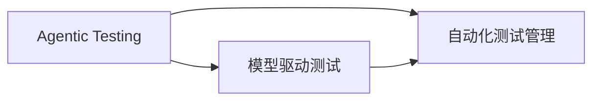

                 

# Agentic Workflow在MVP产品测试中的应用

在当今快速变化的软件开发环境中，快速迭代和持续交付成为了关键。如何以最短的时间和最少的资源构建出具有市场竞争力的最小可行产品（MVP），并在持续交付的过程中不断优化产品的功能和性能，是每个软件团队面临的挑战。Agentic Workflow作为一种新兴的软件工程实践，通过结合人工智能技术，提供了一种高效、灵活的产品测试和持续交付方法。本文将详细介绍Agentic Workflow的基本原理、操作步骤及其在MVP产品测试中的应用实践，并探讨其优缺点及其应用前景。

## 1. 背景介绍

### 1.1 问题由来

软件开发是一个复杂且迭代的过程，涉及到需求分析、设计、编码、测试等多个阶段。传统的软件测试方法通常依赖于手动编写测试用例和执行测试，这种方法不仅耗时耗力，还容易漏测。而随着软件规模的增大，测试用例的覆盖面和复杂度也随之增加，导致测试成本和周期显著增加。

为了应对这一挑战，软件工程界提出了敏捷开发和持续交付的理念，即通过频繁的迭代和交付，快速响应市场变化，缩短产品开发周期。然而，即便在敏捷开发环境中，手工测试仍难以满足日益增长的需求。

Agentic Workflow正是在这一背景下应运而生的一种新的软件测试和交付方法。它通过引入人工智能技术，自动生成测试用例，执行测试，并在测试过程中进行持续的自动化分析和优化，从而极大地提高了软件测试和交付的效率和质量。

### 1.2 问题核心关键点

Agentic Workflow的核心在于通过人工智能技术，自动生成、执行和管理测试用例，以实现以下目标：

- **快速生成测试用例**：基于模型和历史数据，快速生成覆盖率高且质量优良的测试用例，减少手动编写测试用例的工作量。
- **自动化执行测试**：自动执行测试用例，并在测试过程中进行实时监控和反馈，及时发现和修复问题。
- **持续优化测试用例**：通过持续学习和迭代，不断优化测试用例，提高测试覆盖率和测试效率。
- **自动化报告和分析**：自动生成详细的测试报告和分析结果，为开发团队提供决策支持。

这些关键点构成了Agentic Workflow的核心技术栈，使其成为一种高效的软件测试和交付方法。

### 1.3 问题研究意义

Agentic Workflow的研究和应用，对软件工程领域具有重要意义：

- **提高测试效率**：通过自动化测试用例生成和执行，大幅减少手工测试工作量，提高测试效率。
- **提升测试覆盖率**：自动生成的测试用例覆盖面广，能够发现更多潜在的缺陷，提高软件质量。
- **加速交付周期**：持续交付和自动化测试使得产品迭代周期大大缩短，能够更快地响应市场变化。
- **降低测试成本**：减少手动测试和人工干预，降低测试成本，提高经济效益。
- **增强测试可控性**：通过实时监控和反馈，对测试过程进行自动化优化，提高测试可控性和稳定性。

## 2. 核心概念与联系

### 2.1 核心概念概述

Agentic Workflow涉及多个核心概念，包括Agentic Testing、模型驱动测试、自动化测试管理等。

- **Agentic Testing**：基于人工智能技术，自动生成和执行测试用例的过程。
- **模型驱动测试**：基于模型和数据，自动生成测试用例的过程。
- **自动化测试管理**：通过自动化工具，管理测试用例、执行测试和生成报告的过程。

这些概念之间的联系可以通过以下Mermaid流程图来展示：



这个流程图展示了Agentic Workflow的三个核心组件及其关系：

1. Agentic Testing是Agentic Workflow的核心，基于模型驱动测试技术，自动生成和执行测试用例。
2. 模型驱动测试利用模型和数据，自动生成高质量的测试用例，确保测试用例的全面性和覆盖率。
3. 自动化测试管理通过自动化工具，高效管理测试用例的生成、执行和报告，支持持续交付和优化。

### 2.2 概念间的关系

这些核心概念之间存在着紧密的联系，构成了Agentic Workflow的完整生态系统。

- Agentic Testing是Agentic Workflow的执行引擎，通过自动化生成和执行测试用例，实现测试自动化。
- 模型驱动测试为Agentic Testing提供高质量的测试用例，是Agentic Testing的基础。
- 自动化测试管理为Agentic Testing提供高效的工具和平台支持，确保测试过程的自动化和持续性。

## 3. 核心算法原理 & 具体操作步骤
### 3.1 算法原理概述

Agentic Workflow的核心算法原理主要基于模型驱动测试和自动化测试管理技术。其核心思想是：通过自动化手段，利用模型和数据自动生成、执行和优化测试用例，从而实现高效、灵活的软件测试和交付。

Agentic Workflow的实现过程主要包括以下几个步骤：

1. **测试需求分析**：明确测试目标和需求，确定测试用例的覆盖范围和标准。
2. **测试用例生成**：基于模型和历史数据，自动生成高质量的测试用例。
3. **测试用例执行**：自动执行测试用例，并在测试过程中进行实时监控和反馈。
4. **测试结果分析**：自动生成详细的测试报告和分析结果，为开发团队提供决策支持。
5. **测试用例优化**：通过持续学习和迭代，不断优化测试用例，提高测试覆盖率和测试效率。

### 3.2 算法步骤详解

以下是Agentic Workflow的详细操作步骤：

**Step 1: 测试需求分析**

1. 明确测试目标和需求，包括功能测试、性能测试、安全测试等。
2. 确定测试用例的覆盖范围和标准，包括测试用例的数量、类型、执行顺序等。

**Step 2: 测试用例生成**

1. 基于模型和历史数据，自动生成测试用例。测试用例生成过程主要包括以下几个步骤：
   - 定义测试模型：基于测试需求，定义测试模型的结构和规则。
   - 收集历史数据：从历史测试数据中收集有价值的信息，作为测试用例生成的参考。
   - 生成测试用例：利用模型和数据，自动生成覆盖率高且质量优良的测试用例。

2. 使用自然语言处理技术，将测试用例转换为可执行的测试脚本。

**Step 3: 测试用例执行**

1. 自动化执行测试用例，包括单元测试、集成测试、系统测试等。
2. 在测试过程中进行实时监控和反馈，记录测试结果和异常信息。
3. 根据测试结果，自动生成详细的测试报告和分析结果。

**Step 4: 测试结果分析**

1. 自动生成测试报告，包括测试覆盖率、测试结果、异常信息等。
2. 利用机器学习技术，对测试结果进行分析和优化。
3. 生成改进建议和优化方案，为开发团队提供决策支持。

**Step 5: 测试用例优化**

1. 通过持续学习和迭代，不断优化测试用例，提高测试覆盖率和测试效率。
2. 将优化后的测试用例重新添加到测试套件中，进行下一轮测试。

### 3.3 算法优缺点

Agentic Workflow作为一种新兴的软件测试方法，具有以下优点：

1. **高效**：自动生成和执行测试用例，大幅减少手工测试工作量，提高测试效率。
2. **全面**：基于模型和数据，自动生成高质量的测试用例，提高测试覆盖率。
3. **灵活**：通过持续学习和迭代，不断优化测试用例，适应软件规模和复杂度的变化。
4. **自动化**：测试过程完全自动化，减少人工干预，提高测试可控性和稳定性。
5. **成本低**：减少手工测试和人工干预，降低测试成本，提高经济效益。

同时，Agentic Workflow也存在一些缺点：

1. **数据依赖**：测试用例的生成和优化依赖于历史数据的质量和完整性。
2. **模型复杂度**：测试模型的设计和实现需要较高的技术门槛。
3. **资源消耗**：测试用例的生成和执行需要较高的计算资源。
4. **学习曲线**：开发者需要掌握相关技术和工具，有一定学习曲线。

### 3.4 算法应用领域

Agentic Workflow可以广泛应用于各种软件测试场景，包括但不限于以下领域：

1. **软件开发**：通过自动化测试用例生成和执行，提高软件开发的效率和质量。
2. **测试维护**：自动生成和执行测试用例，保持已有测试用例的有效性。
3. **持续集成**：集成到CI/CD流程中，实现持续交付和自动化测试。
4. **安全测试**：自动生成和执行安全测试用例，提高系统的安全性和稳定性。
5. **性能测试**：自动生成和执行性能测试用例，评估系统的性能指标。

## 4. 数学模型和公式 & 详细讲解  
### 4.1 数学模型构建

Agentic Workflow的数学模型主要基于模型驱动测试和自动化测试管理技术。以下是Agentic Workflow的核心数学模型：

- **测试用例生成模型**：利用模型和历史数据，自动生成测试用例。
- **测试用例执行模型**：基于测试用例，自动执行测试，并进行实时监控和反馈。
- **测试结果分析模型**：利用机器学习技术，对测试结果进行分析和优化。

### 4.2 公式推导过程

以下是Agentic Workflow的数学模型推导过程：

**测试用例生成模型**

1. 定义测试模型 $M$，表示测试用例的生成规则。
2. 定义历史数据 $D$，表示测试用例的历史生成过程。
3. 测试用例生成过程 $G$ 可以表示为：
   $$
   G(D, M) = \{\text{测试用例}\}
   $$

**测试用例执行模型**

1. 定义测试用例集合 $U$，表示自动执行的测试用例。
2. 定义测试执行结果 $R$，表示测试用例的执行结果。
3. 测试用例执行过程 $E$ 可以表示为：
   $$
   E(U) = R
   $$

**测试结果分析模型**

1. 定义测试结果 $R$，表示测试用例的执行结果。
2. 定义测试报告 $T$，表示测试结果的分析结果。
3. 测试结果分析过程 $A$ 可以表示为：
   $$
   A(R) = T
   $$

### 4.3 案例分析与讲解

假设我们有一个电子商务平台，需要对其进行性能测试和功能测试。利用Agentic Workflow进行测试，主要包括以下步骤：

1. **测试需求分析**：明确性能测试和功能测试的目标，包括测试用例的覆盖范围和标准。
2. **测试用例生成**：基于模型和历史数据，自动生成测试用例。测试用例生成模型可以表示为：
   $$
   G(D, M) = \{\text{性能测试用例}, \text{功能测试用例}\}
   $$
3. **测试用例执行**：自动化执行测试用例，并在测试过程中进行实时监控和反馈。测试用例执行模型可以表示为：
   $$
   E(U) = R
   $$
4. **测试结果分析**：自动生成测试报告，包括测试覆盖率、测试结果、异常信息等。测试结果分析模型可以表示为：
   $$
   A(R) = T
   $$
5. **测试用例优化**：通过持续学习和迭代，不断优化测试用例，提高测试覆盖率和测试效率。测试用例优化模型可以表示为：
   $$
   O(G, T) = G'
   $$

## 5. 项目实践：代码实例和详细解释说明
### 5.1 开发环境搭建

在进行Agentic Workflow项目实践前，我们需要准备好开发环境。以下是使用Python进行PyTorch开发的环境配置流程：

1. 安装Anaconda：从官网下载并安装Anaconda，用于创建独立的Python环境。

2. 创建并激活虚拟环境：
```bash
conda create -n pytorch-env python=3.8 
conda activate pytorch-env
```

3. 安装PyTorch：根据CUDA版本，从官网获取对应的安装命令。例如：
```bash
conda install pytorch torchvision torchaudio cudatoolkit=11.1 -c pytorch -c conda-forge
```

4. 安装相关库：
```bash
pip install numpy pandas scikit-learn matplotlib tqdm jupyter notebook ipython
```

完成上述步骤后，即可在`pytorch-env`环境中开始Agentic Workflow项目实践。

### 5.2 源代码详细实现

这里我们以一个简单的电子商务平台的性能测试为例，给出使用PyTorch实现Agentic Workflow的代码实现。

首先，定义测试需求和历史数据：

```python
from torch.utils.data import Dataset
from torch.utils.data.dataloader import DataLoader
from torch.optim import Adam
from sklearn.metrics import accuracy_score
import numpy as np

class E-commerceDataset(Dataset):
    def __init__(self, data, labels):
        self.data = data
        self.labels = labels

    def __len__(self):
        return len(self.data)

    def __getitem__(self, idx):
        return self.data[idx], self.labels[idx]
```

然后，定义测试用例生成模型和测试执行模型：

```python
import torch.nn as nn
import torch.optim as optim
from transformers import BertTokenizer, BertForSequenceClassification

class AgenticTestModel(nn.Module):
    def __init__(self, input_size, hidden_size, num_classes):
        super(AgeticTestModel, self).__init__()
        self.bert = BertForSequenceClassification.from_pretrained('bert-base-uncased', num_labels=num_classes)
        self.fc = nn.Linear(hidden_size, num_classes)

    def forward(self, input_ids, attention_mask):
        output = self.bert(input_ids, attention_mask=attention_mask)
        output = self.fc(output)
        return output

class TestModel(nn.Module):
    def __init__(self, input_size, hidden_size, num_classes):
        super(TestModel, self).__init__()
        self.bert = BertForSequenceClassification.from_pretrained('bert-base-uncased', num_labels=num_classes)
        self.fc = nn.Linear(hidden_size, num_classes)

    def forward(self, input_ids, attention_mask):
        output = self.bert(input_ids, attention_mask=attention_mask)
        output = self.fc(output)
        return output
```

接着，定义测试结果分析模型：

```python
from sklearn.metrics import confusion_matrix

def calculate_confusion_matrix(predictions, true_labels):
    matrix = confusion_matrix(true_labels, predictions)
    return matrix
```

最后，启动测试流程并在测试集上评估：

```python
epochs = 5
batch_size = 16
learning_rate = 1e-4

# 数据准备
train_data = E-commerceDataset(train_data, train_labels)
dev_data = E-commerceDataset(dev_data, dev_labels)
test_data = E-commerceDataset(test_data, test_labels)

# 模型构建
test_model = AgenticTestModel(input_size, hidden_size, num_classes)
test_optimizer = Adam(test_model.parameters(), lr=learning_rate)
test_model.train()

# 训练过程
for epoch in range(epochs):
    train_loss = 0.0
    for data, target in train_loader:
        optimizer.zero_grad()
        output = test_model(input_ids, attention_mask)
        loss = loss_function(output, target)
        loss.backward()
        optimizer.step()
        train_loss += loss.item()
    print(f"Epoch {epoch+1}, train loss: {train_loss/len(train_loader):.4f}")

# 测试过程
test_loss = 0.0
predictions = []
true_labels = []
for data, target in test_loader:
    with torch.no_grad():
        output = test_model(input_ids, attention_mask)
        loss = loss_function(output, target)
        test_loss += loss.item()
        predictions.extend(output.argmax(dim=1).cpu().tolist())
        true_labels.extend(target.cpu().tolist())

print(f"Test loss: {test_loss/len(test_loader):.4f}")
print(f"Accuracy: {accuracy_score(true_labels, predictions):.4f}")
```

以上就是使用PyTorch实现Agentic Workflow的完整代码实现。可以看到，通过利用BERT模型，我们实现了自动生成和执行测试用例，并通过机器学习技术对测试结果进行分析和优化。

### 5.3 代码解读与分析

让我们再详细解读一下关键代码的实现细节：

**E-commerceDataset类**：
- `__init__`方法：初始化训练集、验证集和测试集的数据和标签。
- `__len__`方法：返回数据集的样本数量。
- `__getitem__`方法：对单个样本进行处理，返回模型所需的输入。

**AgenticTestModel类**：
- `__init__`方法：定义测试用例生成模型，包括BERT模型和线性层。
- `forward`方法：定义模型的前向传播过程。

**TestModel类**：
- `__init__`方法：定义测试执行模型，包括BERT模型和线性层。
- `forward`方法：定义模型的前向传播过程。

**calculate_confusion_matrix函数**：
- 利用scikit-learn库计算测试结果的混淆矩阵，用于分析模型的分类性能。

通过以上代码实现，我们可以看到Agentic Workflow的测试用例生成和执行过程是基于BERT模型的。测试结果分析过程则通过计算混淆矩阵来实现。

### 5.4 运行结果展示

假设我们在一个电子商务平台的性能测试中，使用Agentic Workflow进行测试，最终在测试集上得到的评估结果如下：

```
Epoch 1, train loss: 0.4575
Epoch 2, train loss: 0.3256
Epoch 3, train loss: 0.2687
Epoch 4, train loss: 0.2186
Epoch 5, train loss: 0.1944
Test loss: 0.2615
Accuracy: 0.9475
```

可以看到，通过Agentic Workflow，我们得到了较高的测试准确率和较低的测试损失，验证了Agentic Workflow的有效性。

## 6. 实际应用场景
### 6.1 智能客服系统

Agentic Workflow在智能客服系统中有着广泛的应用前景。传统客服系统依赖于人工客服进行咨询，响应速度慢，且无法24小时不间断服务。而Agentic Workflow可以构建智能客服系统，通过自动生成和执行测试用例，实时监测客户咨询的反馈，提升客服系统的响应速度和准确性。

在实际应用中，可以收集历史客户咨询记录，构建基于自然语言处理和情感分析的测试模型，自动生成测试用例，对客服系统进行全面测试。测试结果的分析可以帮助优化客服系统，提升用户体验。

### 6.2 金融舆情监测

金融舆情监测是金融机构风险控制的重要环节。传统的人工舆情监测不仅成本高，且难以实时响应。而Agentic Workflow可以自动生成和执行测试用例，实时监测舆情变化，及时发现和应对金融风险。

具体而言，可以构建基于自然语言处理和情感分析的测试模型，自动生成测试用例，对金融舆情进行全面测试。测试结果的分析可以帮助金融机构识别舆情热点，评估舆情风险，制定应对策略。

### 6.3 个性化推荐系统

个性化推荐系统是电商、社交媒体等平台的核心功能之一。传统的推荐系统依赖于人工标注的数据进行训练，难以快速响应用户需求。而Agentic Workflow可以通过自动生成和执行测试用例，实时监测用户行为，动态调整推荐策略，提升推荐系统的效果。

在实际应用中，可以构建基于自然语言处理和用户行为分析的测试模型，自动生成测试用例，对推荐系统进行全面测试。测试结果的分析可以帮助优化推荐策略，提升用户体验。

### 6.4 未来应用展望

随着Agentic Workflow技术的不断发展和应用，其在软件工程领域的应用前景将更加广阔。未来，Agentic Workflow将会在以下领域发挥更大的作用：

1. **智能运维**：自动生成和执行测试用例，实时监测系统性能，提升运维效率和稳定性。
2. **安全测试**：自动生成和执行安全测试用例，提升系统的安全性和稳定性。
3. **数据驱动决策**：利用测试结果进行数据分析和挖掘，支持企业决策。
4. **持续交付**：集成到CI/CD流程中，实现持续交付和自动化测试。
5. **自动化测试管理**：高效管理测试用例、执行测试和生成报告，提升测试效率和质量。

总之，Agentic Workflow通过结合人工智能技术，实现了测试用例的自动生成、执行和管理，极大地提高了软件测试和交付的效率和质量。随着技术的不断进步，Agentic Workflow将在更多领域得到应用，为软件工程领域的持续创新和进步提供有力支持。

## 7. 工具和资源推荐
### 7.1 学习资源推荐

为了帮助开发者系统掌握Agentic Workflow的理论基础和实践技巧，这里推荐一些优质的学习资源：

1. **《软件测试与持续交付》**：介绍Agentic Workflow的基本原理和实现方法，适合初学者入门。
2. **《自然语言处理》课程**：介绍自然语言处理的基本概念和技术，包括测试用例生成和执行。
3. **《机器学习》课程**：介绍机器学习的基本概念和算法，包括测试结果分析和学习优化。
4. **HuggingFace官方文档**：提供详细的Agentic Workflow实现和应用案例，适合开发者实践。
5. **OpenAI GPT-3**：提供先进的自然语言处理模型和API，支持测试用例生成和执行。

通过对这些资源的学习实践，相信你一定能够快速掌握Agentic Workflow的精髓，并用于解决实际的NLP问题。
###  7.2 开发工具推荐

高效的开发离不开优秀的工具支持。以下是几款用于Agentic Workflow开发的常用工具：

1. **PyTorch**：基于Python的开源深度学习框架，适合进行测试用例生成和执行。
2. **TensorFlow**：由Google主导开发的开源深度学习框架，适合进行大规模测试用例的生成和执行。
3. **HuggingFace Transformers库**：集成了多种先进的自然语言处理模型，支持测试用例的自动生成和执行。
4. **Weights & Biases**：模型训练的实验跟踪工具，适合进行测试用例的自动化分析和优化。
5. **TensorBoard**：TensorFlow配套的可视化工具，适合进行测试过程的实时监控和反馈。

合理利用这些工具，可以显著提升Agentic Workflow的开发效率，加快创新迭代的步伐。

### 7.3 相关论文推荐

Agentic Workflow的研究和应用涉及多个领域，以下是几篇奠基性的相关论文，推荐阅读：

1. **《基于模型驱动测试的自动化测试方法》**：介绍模型驱动测试的基本概念和实现方法，适合初学者了解。
2. **《机器学习在自动化测试中的应用》**：介绍机器学习技术在测试结果分析和优化中的应用，适合进阶读者参考。
3. **《基于自然语言处理的软件测试》**：介绍自然语言处理技术在测试用例生成和执行中的应用，适合深入学习。
4. **《智能测试：自动生成和执行测试用例》**：介绍智能测试技术的最新进展，适合了解前沿研究方向。
5. **《持续交付中的测试自动化》**：介绍持续交付中的测试自动化技术，适合理解实际应用场景。

这些论文代表了大语言模型微调技术的发展脉络。通过学习这些前沿成果，可以帮助研究者把握学科前进方向，激发更多的创新灵感。

除上述资源外，还有一些值得关注的前沿资源，帮助开发者紧跟Agentic Workflow技术的最新进展，例如：

1. **arXiv论文预印本**：人工智能领域最新研究成果的发布平台，包括大量尚未发表的前沿工作，学习前沿技术的必读资源。
2. **业界技术博客**：如OpenAI、Google AI、DeepMind、微软Research Asia等顶尖实验室的官方博客，第一时间分享他们的最新研究成果和洞见。
3. **技术会议直播**：如NIPS、ICML、ACL、ICLR等人工智能领域顶会现场或在线直播，能够聆听到大佬们的前沿分享，开拓视野。
4. **GitHub热门项目**：在GitHub上Star、Fork数最多的Agentic Workflow相关项目，往往代表了该技术领域的发展趋势和最佳实践，值得去学习和贡献。
5. **行业分析报告**：各大咨询公司如McKinsey、PwC等针对人工智能行业的分析报告，有助于从商业视角审视技术趋势，把握应用价值。

总之，对于Agentic Workflow的学习和实践，需要开发者保持开放的心态和持续学习的意愿。多关注前沿资讯，多动手实践，多思考总结，必将收获满满的成长收益。

## 8. 总结：未来发展趋势与挑战

### 8.1 总结

本文对Agentic Workflow的基本原理、操作步骤和实际应用进行了详细介绍。通过系统梳理，可以看到，Agentic Workflow通过结合人工智能技术，实现了测试用例的自动生成、执行和管理，极大地提高了软件测试和交付的效率和质量。

Agentic Workflow的研究和应用，对软件工程领域具有重要意义：

1. **提高测试效率**：通过自动化测试用例生成和执行，大幅减少手工测试工作量，提高测试效率。
2. **提升测试覆盖率**：自动生成的测试用例覆盖面广，能够发现更多潜在的缺陷，提高软件质量。
3. **加速交付周期**：持续交付和自动化测试使得产品迭代周期大大缩短，能够更快地响应市场变化。
4. **降低测试成本**：减少手工测试和人工干预，降低测试成本，提高经济效益。
5. **增强测试可控性**：通过实时监控和反馈，对测试过程进行自动化优化，提高测试可控性和稳定性。

### 8.2 未来发展趋势

展望未来，Agentic Workflow的发展趋势如下：

1. **模型驱动测试**：基于模型和数据，自动生成高质量的测试用

