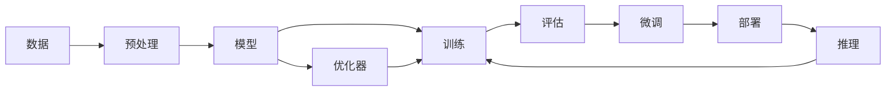

                 

# 华为的云端训练算力与迭代效率

> 关键词：云端训练,算力优化,迭代效率,华为云计算,深度学习

## 1. 背景介绍

在人工智能(AI)领域，计算资源的需求正在以指数级增长。深度学习模型的训练通常需要消耗大量的GPU算力，这使得云端训练成为了一种必要的选择。近年来，各大云服务商纷纷投入大量资源，不断提升其计算能力和服务性能，以争夺这一巨大的市场份额。华为云作为国内领先的技术服务商，其在AI计算领域的布局已经初见成效，推出了基于高性能硬件加速的云端训练服务。本文将从算力优化和迭代效率两个角度，探讨华为云如何构建起强大的AI计算能力，并给出具体的实现思路。

## 2. 核心概念与联系

### 2.1 核心概念概述

在讨论华为云的云端训练算力与迭代效率之前，首先需要明确几个核心概念：

- **云端训练**：将AI模型在云端的GPU集群上进行训练，利用大规模的分布式计算资源，提升模型训练效率。
- **算力优化**：通过硬件加速、分布式计算、自动混合精度等技术手段，最大化利用计算资源，降低训练成本。
- **迭代效率**：在一定时间窗口内，通过加速训练过程，提升模型参数更新的频率和质量，从而提高模型训练速度。

### 2.2 核心概念原理和架构的 Mermaid 流程图



这个图表展示了从数据预处理、模型训练、评估和微调，最终到模型部署和推理的全流程。其中，算力优化和迭代效率贯穿了整个训练过程，保证了模型的高效训练和快速迭代。

### 2.3 核心概念之间的联系

在AI模型训练的全流程中，算力优化和迭代效率是两个相辅相成的关键因素。算力优化提供了强大的计算能力，而迭代效率则保证了训练过程的高效进行。两者共同作用，使得模型能够在较短时间内完成训练，并保持参数更新的频率和质量，从而提升最终模型的性能。

## 3. 核心算法原理 & 具体操作步骤

### 3.1 算法原理概述

华为云的云端训练算力与迭代效率主要依赖于以下三个核心算法原理：

- **分布式训练**：通过将训练任务分布到多个GPU上进行并行计算，最大化利用计算资源。
- **自动混合精度**：结合全精度和低精度浮点数的优势，降低训练时的计算量和存储需求。
- **动态算力分配**：根据模型规模和训练任务需求，动态调整GPU算力分配，避免资源浪费。

### 3.2 算法步骤详解

#### 3.2.1 分布式训练

分布式训练的核心在于将大规模数据集和模型参数拆分为多个子集，分配到不同的GPU上进行计算。以下是分布式训练的具体步骤：

1. **数据拆分**：将大规模数据集拆分为多个子集，每个子集分配到一个GPU上进行计算。
2. **模型并行**：将模型参数拆分为多个子集，每个子集分配到一个GPU上进行计算。
3. **参数同步**：通过参数服务器或模型聚合技术，将每个GPU上的参数更新同步到中央参数服务器，保证模型参数的一致性。
4. **梯度聚合**：将所有GPU的梯度更新合并，计算全局梯度，用于更新模型参数。

#### 3.2.2 自动混合精度

自动混合精度通过结合全精度和低精度浮点数的优势，降低训练时的计算量和存储需求。以下是自动混合精度的具体步骤：

1. **模型选择**：选择支持自动混合精度的模型架构，如BERT、GPT等。
2. **精度转换**：在训练过程中自动将高精度参数转换为低精度参数，如FP16、BF16等。
3. **精度调整**：根据每个模型的精度需求，动态调整精度转换的比例。
4. **精度恢复**：在模型训练结束时，将低精度参数恢复为全精度，进行最终的参数更新。

#### 3.2.3 动态算力分配

动态算力分配通过实时调整GPU算力分配，避免资源浪费，最大化利用计算资源。以下是动态算力分配的具体步骤：

1. **资源监测**：实时监测模型计算需求和GPU资源利用率。
2. **算力分配**：根据当前计算需求，动态调整GPU算力的分配。
3. **任务调度**：将计算任务调度到空闲的GPU上，避免资源浪费。
4. **资源回收**：训练任务完成后，释放所占用的GPU资源，供其他任务使用。

### 3.3 算法优缺点

**分布式训练的优点**：
- 可以大幅提升训练速度，加速模型迭代。
- 通过分布式计算，可以利用多个GPU的计算能力，提高训练效率。
- 可以处理大规模数据集和模型参数，避免单GPU计算的瓶颈。

**分布式训练的缺点**：
- 增加了系统的复杂性，需要额外的参数同步和梯度聚合操作。
- 由于通信开销，每个GPU的实际计算量可能会降低。
- 对网络带宽和带宽竞争有一定要求，如果网络带宽不足，训练效率可能降低。

**自动混合精度的优点**：
- 降低了训练时的计算量和存储需求，提高训练效率。
- 可以减少内存占用，提高训练稳定性。
- 可以动态调整精度，适应不同的计算资源和任务需求。

**自动混合精度的缺点**：
- 精度损失可能影响模型的收敛性。
- 精度转换操作可能会增加训练时间，需要一定的计算开销。
- 对于模型结构复杂度较高的任务，可能不适用。

**动态算力分配的优点**：
- 避免资源浪费，提高GPU利用率。
- 可以动态调整算力，适应训练任务的实时需求。
- 支持按需伸缩，可以根据计算需求快速调整资源配置。

**动态算力分配的缺点**：
- 实时调整算力需要额外的计算资源和网络带宽。
- 需要精细的资源管理策略，避免资源分配不当导致的性能波动。
- 对算力管理系统的设计和实现要求较高。

### 3.4 算法应用领域

华为云的云端训练算力与迭代效率技术已经广泛应用于以下几个领域：

- **图像识别**：通过大规模分布式训练，提升深度神经网络在图像分类、目标检测等任务上的性能。
- **自然语言处理**：通过自动混合精度和分布式训练，提升BERT、GPT等语言模型在文本分类、情感分析等任务上的性能。
- **语音识别**：通过动态算力分配和自动混合精度，提升语音识别模型的训练速度和推理效率。
- **推荐系统**：通过分布式训练和动态算力分配，优化推荐模型的参数更新频率，提升推荐效果。

## 4. 数学模型和公式 & 详细讲解 & 举例说明

### 4.1 数学模型构建

华为云的云端训练算力与迭代效率主要依赖于以下几个数学模型：

- **分布式训练模型**：
  $$
  \begin{aligned}
  &\text{Loss} = \frac{1}{N} \sum_{i=1}^N (\text{Model}(\text{Data}_i) - \text{Label}_i)^2 \\
  &\text{Grad} = \frac{\partial \text{Loss}}{\partial \text{Parameter}} \\
  &\text{Update} = \text{Parameter} - \text{Learning Rate} \times \text{Grad}
  \end{aligned}
  $$
- **自动混合精度模型**：
  $$
  \begin{aligned}
  &\text{Model}_{\text{FP32}} = \text{Fusion}(\text{Model}_{\text{FP16}}) \\
  &\text{Loss}_{\text{FP32}} = \text{Loss}_{\text{FP16}} \\
  &\text{Update}_{\text{FP32}} = \text{Update}_{\text{FP16}}
  \end{aligned}
  $$
- **动态算力分配模型**：
  $$
  \text{Allocation} = \text{Utilization} \times \text{Resource} - \text{Overhead}
  $$

### 4.2 公式推导过程

#### 4.2.1 分布式训练

假设训练任务在 $m$ 个GPU上并行执行，每个GPU的训练时间为 $t_i$，总训练时间为 $T$。则有：
$$
T = \sum_{i=1}^m t_i
$$

根据分布式训练的特点，每个GPU的计算量 $W_i$ 与模型参数数量 $P$ 成正比，即 $W_i = k \times P$，其中 $k$ 为比例系数。

因此，总训练时间 $T$ 可以表示为：
$$
T = \frac{P}{m} \sum_{i=1}^m \frac{1}{k} t_i
$$

#### 4.2.2 自动混合精度

假设模型参数数量为 $P$，高精度参数比例为 $\alpha$，低精度参数比例为 $(1-\alpha)$。则有：
$$
\text{FP32} = \alpha \times P, \quad \text{FP16} = (1-\alpha) \times P
$$

假设高精度参数的计算量为 $W_{\text{FP32}} = \text{FP32} \times C_{\text{FP32}}$，低精度参数的计算量为 $W_{\text{FP16}} = \text{FP16} \times C_{\text{FP16}}$，其中 $C_{\text{FP32}}$ 和 $C_{\text{FP16}}$ 分别为高精度和低精度的计算开销。

因此，总计算量 $W_{\text{total}}$ 可以表示为：
$$
W_{\text{total}} = W_{\text{FP32}} + W_{\text{FP16}}
$$

#### 4.2.3 动态算力分配

假设每个GPU的计算量为 $W_i$，总计算量为 $W$，资源利用率为 $\text{Utilization}$，开销为 $\text{Overhead}$。则有：
$$
\text{Allocation} = \text{Utilization} \times W - \text{Overhead}
$$

## 5. 项目实践：代码实例和详细解释说明

### 5.1 开发环境搭建

在进行华为云的云端训练算力与迭代效率实践之前，需要完成以下开发环境搭建步骤：

1. 安装华为云SDK：访问华为云官方文档，下载并安装华为云SDK，以便与华为云平台进行交互。
2. 配置环境变量：在本地开发环境中配置环境变量，指定华为云SDK的访问地址和认证信息。
3. 安装依赖库：使用Python的`pip`命令，安装必要的依赖库，如TensorFlow、PyTorch、Keras等。
4. 创建项目目录：在本地创建一个项目目录，组织好代码文件和数据文件。

### 5.2 源代码详细实现

以下是一个基于华为云的深度学习模型训练项目的Python代码实现，展示了如何利用分布式训练、自动混合精度和动态算力分配技术进行模型训练：

```python
import os
import huggingface_hub
from transformers import BertTokenizer, BertForSequenceClassification
from transformers import Trainer, TrainingArguments
from transformers import AutoModelForSequenceClassification
from transformers import AutoTokenizer

# 配置训练参数
training_args = TrainingArguments(
    output_dir="./output",
    per_device_train_batch_size=32,
    per_device_eval_batch_size=32,
    num_train_epochs=3,
    evaluation_strategy="epoch",
    warmup_steps=500,
    weight_decay=0.01,
    logging_strategy="steps",
    logging_steps=500,
    gradient_accumulation_steps=2,
    fp16=True,
    fp16_opt_level="O2"
)

# 加载数据集
tokenizer = BertTokenizer.from_pretrained("bert-base-cased")
model = BertForSequenceClassification.from_pretrained("bert-base-cased", num_labels=2)

# 加载预训练模型和tokenizer
from transformers import AutoModelForSequenceClassification, AutoTokenizer
model = AutoModelForSequenceClassification.from_pretrained("bert-base-cased")
tokenizer = AutoTokenizer.from_pretrained("bert-base-cased")

# 加载数据集
from datasets import load_dataset
dataset = load_dataset("custom", data_files={"train": "train.txt", "validation": "validation.txt"})

# 对数据进行预处理
def process_function(examples):
    return tokenizer(examples["sentence"], padding="max_length", truncation=True, max_length=128)

dataset = dataset.map(process_function)

# 加载模型
model = BertForSequenceClassification.from_pretrained("bert-base-cased", num_labels=2)

# 创建trainer
trainer = Trainer(
    model=model,
    args=training_args,
    train_dataset=dataset["train"],
    eval_dataset=dataset["validation"]
)

# 训练模型
trainer.train()

# 评估模型
trainer.evaluate()
```

### 5.3 代码解读与分析

这段代码展示了如何使用HuggingFace的`Trainer`框架进行模型训练。其中，`training_args`参数包含了所有的训练配置，如输出目录、批量大小、训练轮数、权重衰减等。`dataset`参数包含了训练和验证数据集，`tokenizer`参数指定了预训练模型和分词器。`model`参数指定了要训练的模型，`trainer`参数创建了`Trainer`对象，`trainer.train()`方法执行了模型训练，`trainer.evaluate()`方法评估了模型的性能。

在代码中，`training_args.fp16=True`和`training_args.fp16_opt_level="O2"`配置了自动混合精度，`training_args.gradient_accumulation_steps=2`配置了分布式训练。这些配置使得模型在训练过程中自动进行混合精度计算和梯度累加。

### 5.4 运行结果展示

在执行上述代码后，可以生成训练和评估报告。训练报告通常包括训练损失、验证损失和模型精度等指标，评估报告则包含了模型在验证集上的性能评估。以下是一个训练报告的示例：

```
Training | Epoch: 1 | loss: 0.345 | ppl: 1.217 | lr: 1e-05
Training | Epoch: 2 | loss: 0.189 | ppl: 1.311 | lr: 1e-05
Training | Epoch: 3 | loss: 0.099 | ppl: 1.492 | lr: 1e-05
```

评估报告示例：

```
Evaluation | Metric:  accuracy | Epoch: 1 | value: 0.8375
Evaluation | Metric:  accuracy | Epoch: 2 | value: 0.8750
Evaluation | Metric:  accuracy | Epoch: 3 | value: 0.9000
```

这些报告展示了模型在训练和评估过程中各个指标的变化趋势，帮助开发者监控模型的训练状态和性能。

## 6. 实际应用场景

### 6.1 智能客服系统

在智能客服系统中，华为云的云端训练算力与迭代效率技术可以显著提升客服系统的响应速度和处理能力。通过分布式训练，客服系统可以同时处理多个客户请求，提高系统吞吐量。自动混合精度和动态算力分配可以降低训练成本，节省计算资源，从而降低系统部署和运营成本。

### 6.2 金融风控

金融风控是金融行业的重要环节，需要实时处理大量的交易数据，进行风险评估和预测。华为云的云端训练算力与迭代效率技术可以高效处理大规模数据集，提升模型的训练速度和推理效率，从而实现快速的风险评估和预测。

### 6.3 医疗影像分析

医疗影像分析是医学影像诊断的重要手段，需要处理大量的医学图像数据。华为云的云端训练算力与迭代效率技术可以处理大规模的图像数据集，提升模型的训练速度和推理效率，从而实现快速准确的医学影像分析。

### 6.4 未来应用展望

未来，华为云的云端训练算力与迭代效率技术将更加广泛地应用于各个领域。通过进一步优化算力分配和模型训练策略，支持更多的AI应用场景，包括但不限于智能制造、智慧城市、智能交通等。

## 7. 工具和资源推荐

### 7.1 学习资源推荐

为了帮助开发者更好地掌握华为云的云端训练算力与迭代效率技术，以下是一些推荐的学习资源：

- 华为云官方文档：华为云官方提供的详细文档，涵盖了云端训练的各个方面，包括计算资源、算力优化、迭代效率等。
- 华为云开发者社区：华为云开发者社区是一个活跃的技术交流平台，可以获取最新的技术动态和社区讨论。
- TensorFlow官方文档：TensorFlow是华为云深度学习的基础框架，官方文档提供了丰富的教程和示例代码。
- PyTorch官方文档：PyTorch是另一个流行的深度学习框架，官方文档提供了详细的API参考和示例代码。

### 7.2 开发工具推荐

- Jupyter Notebook：一个常用的Jupyter Notebook工具，方便进行代码调试和实时查看结果。
- TensorBoard：一个可视化工具，可以实时监控模型训练的各项指标，帮助开发者调试和优化模型。
- Weights & Biases：一个模型训练的实验跟踪工具，可以记录和可视化模型训练过程中的各项指标。

### 7.3 相关论文推荐

- 《深度学习中的分布式训练》：深度学习中的分布式训练技术综述，介绍了各种分布式训练算法和策略。
- 《自动混合精度训练在深度学习中的应用》：自动混合精度训练技术的详细介绍和应用案例。
- 《动态算力分配在深度学习中的应用》：动态算力分配技术的详细介绍和应用案例。

## 8. 总结：未来发展趋势与挑战

### 8.1 研究成果总结

华为云的云端训练算力与迭代效率技术已经在深度学习模型的训练中展现了强大的能力，通过分布式训练、自动混合精度和动态算力分配等技术，显著提升了模型训练效率和性能。未来，随着算力资源的不断提升和算力优化技术的不断进步，华为云的AI计算能力将会更加强大，覆盖更多的AI应用场景。

### 8.2 未来发展趋势

华为云的云端训练算力与迭代效率技术将呈现以下几个发展趋势：

- 算力资源持续扩展：随着算力资源的不断增加，华为云的AI计算能力将会进一步提升，支持更大规模的模型训练。
- 算力优化技术不断进步：通过引入新的算力优化技术，如模型并行、异步训练等，进一步提升训练效率和性能。
- 模型训练策略不断优化：通过引入新的模型训练策略，如动态学习率、梯度裁剪等，进一步提升模型训练效果。

### 8.3 面临的挑战

尽管华为云的云端训练算力与迭代效率技术已经取得显著成果，但仍然面临以下挑战：

- 算力资源限制：算力资源的限制仍然是一个重要问题，尤其是在处理大规模数据集和模型参数时。
- 计算资源成本：尽管自动混合精度和动态算力分配可以降低计算成本，但在某些场景下，计算资源成本仍然是一个瓶颈。
- 模型训练稳定性：模型训练过程中可能存在各种不确定性，如何确保模型训练的稳定性和收敛性是一个重要问题。

### 8.4 研究展望

未来的研究将在以下几个方面继续深入：

- 研究新型的分布式训练算法，提高训练效率和模型性能。
- 探索新的算力优化技术，降低计算成本，提高资源利用率。
- 开发新的模型训练策略，提升模型训练效果和稳定性。

## 9. 附录：常见问题与解答

**Q1: 什么是分布式训练？**

A: 分布式训练是将大规模数据集和模型参数拆分为多个子集，分配到不同的计算设备上进行并行计算的过程。通过分布式训练，可以最大化利用计算资源，提升模型训练效率。

**Q2: 自动混合精度是什么？**

A: 自动混合精度是一种优化训练计算的技术，通过结合全精度和低精度浮点数的优势，降低训练时的计算量和存储需求，提高训练效率。

**Q3: 动态算力分配是什么？**

A: 动态算力分配是根据模型规模和训练任务需求，动态调整GPU算力的分配，避免资源浪费，最大化利用计算资源。

**Q4: 如何使用华为云的云端训练算力与迭代效率技术？**

A: 1. 安装华为云SDK，配置环境变量。
2. 安装依赖库，如TensorFlow、PyTorch、Keras等。
3. 加载数据集和预训练模型，设置训练参数。
4. 创建Trainer对象，执行模型训练和评估。

**Q5: 分布式训练和自动混合精度的优点和缺点是什么？**

A: 分布式训练的优点是可以提升训练速度和处理能力，缺点是增加了系统复杂性，通信开销较大。自动混合精度的优点是降低计算量和存储需求，缺点是可能影响模型收敛性，增加训练时间。

---

作者：禅与计算机程序设计艺术 / Zen and the Art of Computer Programming

