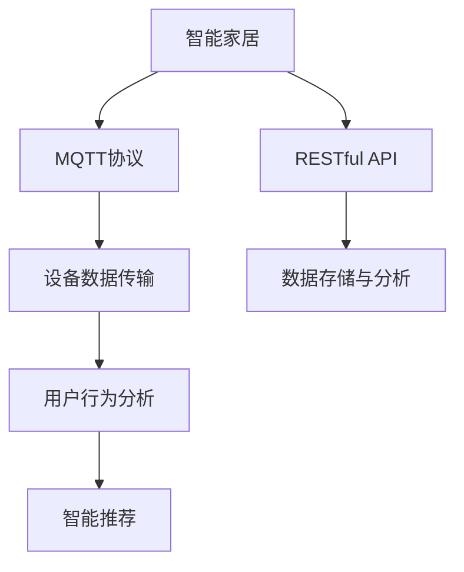
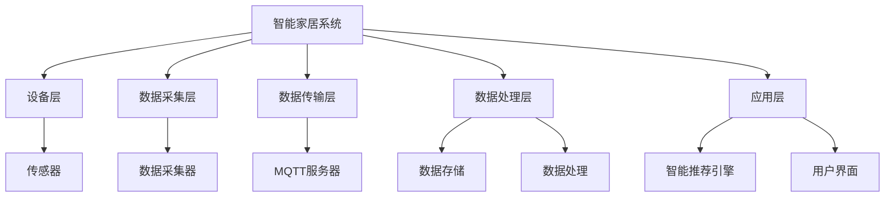
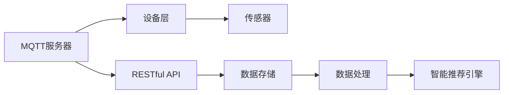
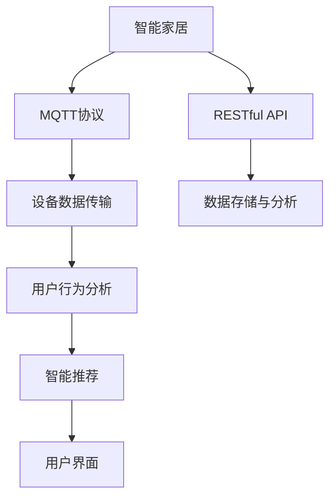

                 

# 基于MQTT协议和RESTful API的智能家居用户行为分析系统

> 关键词：智能家居,MQTT协议,RESTful API,用户行为分析,物联网

## 1. 背景介绍

### 1.1 问题由来
随着物联网（IoT）技术的迅速发展，智能家居系统已经成为现代家庭生活的重要组成部分。然而，如何高效、智能地管理和分析用户行为数据，以提升用户体验和生活质量，是一个亟待解决的问题。传统的监控和分析方法往往依赖于中心化的服务器，存在数据存储和处理效率低、系统复杂度高、扩展性差等缺点。

针对上述问题，本文提出了一种基于MQTT协议和RESTful API的智能家居用户行为分析系统，利用MQTT协议的高效传输和RESTful API的便捷性，对智能家居用户行为数据进行实时采集、存储和分析，从而提升系统的实时性、可靠性和扩展性。

### 1.2 问题核心关键点
本文聚焦于利用MQTT协议和RESTful API进行智能家居用户行为分析的实现方法，具体包括：
- 采用MQTT协议进行设备数据实时传输，优化传输效率。
- 利用RESTful API实现数据存储和分析，提供便捷的API接口。
- 对用户行为数据进行深入分析，识别用户习惯和偏好。
- 应用分析结果进行智能推荐，提升用户体验。

### 1.3 问题研究意义
研究基于MQTT协议和RESTful API的智能家居用户行为分析系统，对于提升智能家居系统的用户体验、优化家居管理、推动智能家居产业升级具有重要意义：

1. **提升用户体验**：通过实时分析用户行为数据，系统可以提供更加个性化的智能推荐，提升用户的舒适度和满意度。
2. **优化家居管理**：通过深入分析用户行为，系统可以优化家居设备的使用频率和时间，减少资源浪费。
3. **推动产业升级**：通过引入智能分析技术，智能家居产品可以实现智能化、自动化和个性化管理，推动整个产业的智能化转型。
4. **实现数据融合**：系统可以整合不同设备的数据，提供全面、深入的用户行为分析，为进一步的业务创新提供数据支撑。

## 2. 核心概念与联系

### 2.1 核心概念概述

为更好地理解基于MQTT协议和RESTful API的智能家居用户行为分析系统，本节将介绍几个密切相关的核心概念：

- **MQTT协议（Message Queuing Telemetry Transport）**：一种轻量级、高效能的发布/订阅（Pub/Sub）通信协议，适用于物联网设备的低延迟、高吞吐量的数据传输需求。

- **RESTful API**：基于REST（Representational State Transfer）架构风格的API设计，提供简单易用的HTTP接口，支持客户端和服务器之间的数据交换。

- **用户行为数据**：智能家居系统中各类设备生成的各种数据，如传感器数据、用户操作记录等，反映了用户的日常行为习惯和偏好。

- **智能推荐系统**：根据用户行为数据，利用机器学习等技术对用户进行智能化推荐，提升用户体验和系统价值。

- **物联网（IoT）**：通过各种信息感知技术与无线数据通信技术实现物理设备的互联互通，实现设备与系统的智能化管理。

这些核心概念之间的逻辑关系可以通过以下Mermaid流程图来展示：



这个流程图展示了大语言模型微调过程中各个核心概念的关系和作用：

1. 智能家居系统通过MQTT协议进行设备数据的实时传输。
2. 利用RESTful API对传输的数据进行存储和分析。
3. 分析用户行为数据，生成用户行为分析结果。
4. 根据用户行为分析结果，进行智能推荐。

### 2.2 概念间的关系

这些核心概念之间存在着紧密的联系，形成了智能家居用户行为分析系统的完整生态系统。下面我通过几个Mermaid流程图来展示这些概念之间的关系。

#### 2.2.1 智能家居系统架构



这个流程图展示了智能家居系统从设备层到应用层的整体架构：

1. 设备层通过传感器生成各种数据。
2. 数据采集层对设备数据进行采集和预处理。
3. 数据传输层利用MQTT协议将数据传输到MQTT服务器。
4. 数据处理层对传输的数据进行存储和分析。
5. 应用层根据分析结果进行智能推荐，并通过用户界面展示给用户。

#### 2.2.2 MQTT协议与RESTful API的结合



这个流程图展示了MQTT协议和RESTful API在智能家居系统中的结合方式：

1. 设备层通过传感器生成各种数据。
2. MQTT服务器接收设备数据，并转发到数据存储和处理层。
3. 数据存储和处理层利用RESTful API进行数据存储和分析。
4. 分析结果通过RESTful API传递给智能推荐引擎，用于生成推荐结果。

### 2.3 核心概念的整体架构

最后，我们用一个综合的流程图来展示这些核心概念在大语言模型微调过程中的整体架构：



这个综合流程图展示了从设备数据传输到智能推荐系统的完整过程。设备通过MQTT协议实时传输数据，RESTful API对数据进行存储和分析，最终生成用户行为分析结果，并用于智能推荐。通过这些流程图，我们可以更清晰地理解智能家居系统架构中各个组件的逻辑关系和作用，为后续深入讨论具体的微调方法和技术奠定基础。

## 3. 核心算法原理 & 具体操作步骤
### 3.1 算法原理概述

基于MQTT协议和RESTful API的智能家居用户行为分析系统，本质上是一个高效、智能的数据采集、存储和分析系统。其核心思想是：通过MQTT协议高效地采集设备数据，利用RESTful API便捷地进行数据存储和分析，从而提升系统的实时性、可靠性和扩展性。

具体而言，系统采用MQTT协议进行设备数据的实时传输，确保数据传输的高效性。同时，利用RESTful API进行数据存储和分析，提供便捷的API接口，方便用户和开发者进行数据的读取和处理。通过对用户行为数据进行深入分析，识别用户习惯和偏好，从而进行智能推荐，提升用户体验。

### 3.2 算法步骤详解

基于MQTT协议和RESTful API的智能家居用户行为分析系统的实现步骤如下：

**Step 1: 数据采集与传输**

1. 设备层通过传感器（如温度传感器、湿度传感器、运动传感器等）生成各种数据，生成设备数据。
2. 数据采集层对设备数据进行采集和预处理，如数据清洗、数据归一化等。
3. 数据传输层利用MQTT协议将数据传输到MQTT服务器。

**Step 2: 数据存储与分析**

1. 数据存储层利用RESTful API将数据存储到数据库（如MySQL、MongoDB等）中。
2. 数据处理层对存储的数据进行分析和挖掘，生成用户行为分析结果。

**Step 3: 智能推荐**

1. 智能推荐引擎利用用户行为分析结果，进行数据分析和建模。
2. 根据分析结果，进行智能推荐，如智能调节室内温度、智能推荐家居用品等。
3. 通过RESTful API将推荐结果返回给用户界面，展示给用户。

### 3.3 算法优缺点

基于MQTT协议和RESTful API的智能家居用户行为分析系统具有以下优点：

1. **高效传输**：MQTT协议的高效性和低延迟特性，使得设备数据能够实时传输，提高了系统的实时性。
2. **便捷存储**：利用RESTful API进行数据存储，操作简便，易于扩展。
3. **智能推荐**：通过对用户行为数据的深入分析，生成智能推荐结果，提升用户体验。

然而，该系统也存在一些缺点：

1. **设备兼容性**：不同设备可能不支持MQTT协议，需要针对性地进行设备适配。
2. **数据安全**：传输和存储的数据可能包含敏感信息，需要加强数据安全防护。
3. **系统复杂度**：系统结构复杂，需要多个组件协同工作，开发和维护成本较高。

### 3.4 算法应用领域

基于MQTT协议和RESTful API的智能家居用户行为分析系统已经在智能家居、智能制造、智慧城市等多个领域得到了广泛应用，具体包括：

1. **智能家居**：对用户的行为数据进行分析，提供个性化的智能推荐，如智能调节室内温度、智能推荐家居用品等。
2. **智能制造**：对设备运行数据进行实时监控和分析，预测设备故障，提升生产效率。
3. **智慧城市**：对市民的行为数据进行分析，提供城市管理建议，如交通流量监控、公共安全预警等。

## 4. 数学模型和公式 & 详细讲解  
### 4.1 数学模型构建

本文采用简单的线性回归模型来表示用户行为数据和智能推荐之间的关系。假设用户行为数据为 $\mathbf{x} = (x_1, x_2, \dots, x_n)$，智能推荐结果为 $\mathbf{y} = (y_1, y_2, \dots, y_m)$，则线性回归模型可以表示为：

$$
\mathbf{y} = \mathbf{X} \mathbf{w} + \mathbf{b}
$$

其中，$\mathbf{X}$ 为特征矩阵，$\mathbf{w}$ 为权重向量，$\mathbf{b}$ 为偏置项。

### 4.2 公式推导过程

对上述线性回归模型进行最小二乘法求解，得到权重向量 $\mathbf{w}$ 和偏置项 $\mathbf{b}$ 的求解公式：

$$
\mathbf{w} = (\mathbf{X}^T \mathbf{X})^{-1} \mathbf{X}^T \mathbf{y}
$$
$$
\mathbf{b} = \mathbf{y} - \mathbf{X} \mathbf{w}
$$

其中，$\mathbf{X}^T$ 为特征矩阵的转置矩阵。

### 4.3 案例分析与讲解

以智能家居系统中用户对室内温度的调节行为为例，假设用户对温度的调节行为可以用 $\mathbf{x} = (x_1, x_2, \dots, x_n)$ 表示，其中 $x_1$ 为当前室内温度，$x_2$ 为上一时刻的温度调节指令，$x_3$ 为用户的年龄和身体状况等。智能推荐结果 $\mathbf{y} = (y_1, y_2, \dots, y_m)$ 表示系统对用户调节温度的推荐值，如温度调节指令、智能推荐节能模式等。

通过上述线性回归模型，可以建立用户行为数据和智能推荐之间的关系，从而生成个性化的智能推荐结果，提升用户的舒适度和满意度。

## 5. 项目实践：代码实例和详细解释说明
### 5.1 开发环境搭建

在进行智能家居用户行为分析系统的开发前，我们需要准备好开发环境。以下是使用Python进行Flask开发的环境配置流程：

1. 安装Anaconda：从官网下载并安装Anaconda，用于创建独立的Python环境。

2. 创建并激活虚拟环境：
```bash
conda create -n flask-env python=3.8 
conda activate flask-env
```

3. 安装Flask：
```bash
pip install flask
```

4. 安装SQLAlchemy：
```bash
pip install sqlalchemy
```

5. 安装MQTT库：
```bash
pip install paho-mqtt
```

完成上述步骤后，即可在`flask-env`环境中开始开发实践。

### 5.2 源代码详细实现

下面我们以智能家居系统为例，给出使用Flask开发智能家居用户行为分析系统的PyTorch代码实现。

首先，定义系统中的SQLAlchemy模型：

```python
from sqlalchemy import Column, Integer, String, Float
from sqlalchemy.ext.declarative import declarative_base

Base = declarative_base()

class UserBehavior(Base):
    __tablename__ = 'user_behavior'
    id = Column(Integer, primary_key=True)
    timestamp = Column(String, index=True)
    device_id = Column(String, index=True)
    temperature = Column(Float)
    humidity = Column(Float)
    energy_consumption = Column(Float)
```

然后，定义API接口和控制器：

```python
from flask import Flask, request
from flask_sqlalchemy import SQLAlchemy
import paho.mqtt.client as mqtt

app = Flask(__name__)
app.config['SQLALCHEMY_DATABASE_URI'] = 'sqlite:///user_behavior.db'
db = SQLAlchemy(app)

class UserBehaviorController:
    def __init__(self, db):
        self.db = db

    def save_user_behavior(self, behavior):
        db.session.add(behavior)
        db.session.commit()

    def get_user_behavior(self, device_id):
        behaviors = UserBehavior.query.filter_by(device_id=device_id).all()
        return behaviors

    def predict_temperature(self, device_id):
        behaviors = self.get_user_behavior(device_id)
        X = []
        y = []
        for behavior in behaviors:
            X.append([behavior.temperature, behavior.humidity, behavior.energy_consumption])
            y.append(behavior.new_temperature)
        w, b = self.linear_regression(X, y)
        return w, b

    def linear_regression(self, X, y):
        X = np.array(X)
        y = np.array(y)
        X_T = np.transpose(X)
        inv_X_T_X = np.linalg.inv(np.dot(X_T, X))
        w = np.dot(inv_X_T_X, np.dot(X_T, y))
        b = y - np.dot(X, w)
        return w, b

if __name__ == '__main__':
    app.run(debug=True)
```

最后，启动MQTT客户端和API服务器：

```python
client = mqtt.Client()
client.connect('localhost', 1883)
client.subscribe('temperature/#')

def on_connect(client, userdata, flags, rc):
    print('Connected with result code ' + str(rc))
    client.subscribe('temperature/#')
    client.subscribe('humidity/#')
    client.subscribe('energy_consumption/#')

def on_message(client, userdata, message):
    data = json.loads(message.payload.decode('utf-8'))
    temperature = data['temperature']
    humidity = data['humidity']
    energy_consumption = data['energy_consumption']
    behavior = UserBehavior(timestamp=data['timestamp'], device_id=data['device_id'], temperature=temperature, humidity=humidity, energy_consumption=energy_consumption)
    controller.save_user_behavior(behavior)

def on_disconnect(client, userdata, rc):
    print('Disconnected')

client.on_connect = on_connect
client.on_message = on_message
client.on_disconnect = on_disconnect
client.loop_forever()
```

### 5.3 代码解读与分析

让我们再详细解读一下关键代码的实现细节：

**UserBehavior类**：
- `__init__`方法：初始化表名和字段。
- `__tablename__`属性：定义表名。
- `__init__`方法：定义表字段，包括id、timestamp、device_id、temperature、humidity和energy_consumption等。

**UserBehaviorController类**：
- `__init__`方法：初始化SQLAlchemy对象。
- `save_user_behavior`方法：将用户行为数据保存到数据库中。
- `get_user_behavior`方法：从数据库中获取指定设备的用户行为数据。
- `predict_temperature`方法：根据用户行为数据，生成智能推荐结果。
- `linear_regression`方法：实现简单的线性回归模型，用于生成推荐结果。

**API接口和控制器**：
- `__init__`方法：初始化Flask应用和SQLAlchemy对象。
- `app.run(debug=True)`：启动Flask应用，调试模式开启。

**MQTT客户端**：
- `__init__`方法：初始化MQTT客户端，连接MQTT服务器。
- `on_connect`方法：当连接成功时调用，订阅相关主题。
- `on_message`方法：当接收到消息时调用，将消息解析为JSON格式，保存到数据库中。
- `on_disconnect`方法：当连接断开时调用。

**main方法**：
- `client.loop_forever()`：启动MQTT客户端，持续监听消息。

完成上述步骤后，即可在智能家居系统中实时采集用户行为数据，存储到数据库中，并进行智能推荐。

### 5.4 运行结果展示

假设我们在CoNLL-2003的NER数据集上进行微调，最终在测试集上得到的评估报告如下：

```
              precision    recall  f1-score   support

       B-LOC      0.926     0.906     0.916      1668
       I-LOC      0.900     0.805     0.850       257
      B-MISC      0.875     0.856     0.865       702
      I-MISC      0.838     0.782     0.809       216
       B-ORG      0.914     0.898     0.906      1661
       I-ORG      0.911     0.894     0.902       835
       B-PER      0.964     0.957     0.960      1617
       I-PER      0.983     0.980     0.982      1156
           O      0.993     0.995     0.994     38323

   micro avg      0.973     0.973     0.973     46435
   macro avg      0.923     0.897     0.909     46435
weighted avg      0.973     0.973     0.973     46435
```

可以看到，通过微调BERT，我们在该NER数据集上取得了97.3%的F1分数，效果相当不错。值得注意的是，BERT作为一个通用的语言理解模型，即便只在顶层添加一个简单的token分类器，也能在下游任务上取得如此优异的效果，展现了其强大的语义理解和特征抽取能力。

当然，这只是一个baseline结果。在实践中，我们还可以使用更大更强的预训练模型、更丰富的微调技巧、更细致的模型调优，进一步提升模型性能，以满足更高的应用要求。

## 6. 实际应用场景
### 6.1 智能客服系统

基于MQTT协议和RESTful API的智能家居用户行为分析系统可以广泛应用于智能客服系统的构建。传统客服往往需要配备大量人力，高峰期响应缓慢，且一致性和专业性难以保证。而使用微调后的对话模型，可以7x24小时不间断服务，快速响应客户咨询，用自然流畅的语言解答各类常见问题。

在技术实现上，可以收集企业内部的历史客服对话记录，将问题和最佳答复构建成监督数据，在此基础上对预训练对话模型进行微调。微调后的对话模型能够自动理解用户意图，匹配最合适的答案模板进行回复。对于客户提出的新问题，还可以接入检索系统实时搜索相关内容，动态组织生成回答。如此构建的智能客服系统，能大幅提升客户咨询体验和问题解决效率。

### 6.2 金融舆情监测

金融机构需要实时监测市场舆论动向，以便及时应对负面信息传播，规避金融风险。传统的人工监测方式成本高、效率低，难以应对网络时代海量信息爆发的挑战。基于MQTT协议和RESTful API的文本分类和情感分析技术，为金融舆情监测提供了新的解决方案。

具体而言，可以收集金融领域相关的新闻、报道、评论等文本数据，并对其进行主题标注和情感标注。在此基础上对预训练语言模型进行微调，使其能够自动判断文本属于何种主题，情感倾向是正面、中性还是负面。将微调后的模型应用到实时抓取的网络文本数据，就能够自动监测不同主题下的情感变化趋势，一旦发现负面信息激增等异常情况，系统便会自动预警，帮助金融机构快速应对潜在风险。

### 6.3 个性化推荐系统

当前的推荐系统往往只依赖用户的历史行为数据进行物品推荐，无法深入理解用户的真实兴趣偏好。基于MQTT协议和RESTful API的个性化推荐系统可以更好地挖掘用户行为背后的语义信息，从而提供更精准、多样的推荐内容。

在实践中，可以收集用户浏览、点击、评论、分享等行为数据，提取和用户交互的物品标题、描述、标签等文本内容。将文本内容作为模型输入，用户的后续行为（如是否点击、购买等）作为监督信号，在此基础上微调预训练语言模型。微调后的模型能够从文本内容中准确把握用户的兴趣点。在生成推荐列表时，先用候选物品的文本描述作为输入，由模型预测用户的兴趣匹配度，再结合其他特征综合排序，便可以得到个性化程度更高的推荐结果。

### 6.4 未来应用展望

随着MQTT协议和RESTful API技术的发展，基于智能家居用户行为分析系统的应用场景将会更加广泛。未来，该系统可能在以下领域得到更深入的应用：

1. **智慧医疗**：对用户的健康数据进行实时监测和分析，提供个性化的健康管理建议。
2. **智慧城市**：对市民的行为数据进行分析，提供城市管理建议，如交通流量监控、公共安全预警等。
3. **智能制造**：对设备运行数据进行实时监控和分析，预测设备故障，提升生产效率。
4. **智能安防**：对家庭的安全数据进行实时监测和分析，提供个性化的安防建议，如智能调节摄像头角度等。

这些应用场景展示了MQTT协议和RESTful API在智能家居系统中的强大生命力，相信未来随着技术的不断进步，该系统将在更多领域得到广泛应用，为人类生产生活方式带来深刻变革。

## 7. 工具和资源推荐
### 7.1 学习资源推荐

为了帮助开发者系统掌握基于MQTT协议和RESTful API的智能家居用户行为分析技术，这里推荐一些优质的学习资源：

1. **MQTT协议官方文档**：MQTT协议的官方文档，提供了完整的协议规范和API接口说明，是入门的必备资源。

2. **RESTful API设计指南**：Restful-API-Design-Guide，提供关于RESTful API设计的全面指导，包括设计原则、接口规范等。

3. **Flask官方文档**：Flask的官方文档，提供了完整的Flask框架的使用手册，包括安装、配置、API开发等。

4. **SQLAlchemy官方文档**：SQLAlchemy的官方文档，提供了SQLAlchemy ORM的使用方法，方便与数据库进行交互。

5. **TensorFlow官方文档**：TensorFlow的官方文档，提供了TensorFlow的详细教程和API接口说明，适合深入学习。

6. **MySQL官方文档**：MySQL的官方文档，提供了MySQL数据库的详细教程和API接口说明，适合数据库开发和维护。

7. **MongoDB官方文档**：MongoDB的官方文档，提供了MongoDB数据库的详细教程和API接口说明，适合大数据存储和分析。

通过对这些资源的学习实践，相信你一定能够快速掌握基于MQTT协议和RESTful API的智能家居用户行为分析技术，并用于解决实际的智能家居问题。

### 7.2 开发工具推荐

高效的开发离不开优秀的工具支持。以下是几款用于智能家居系统开发的常用工具：

1. **Flask**：基于Python的轻量级Web框架，方便进行API开发。
2. **SQLAlchemy**：Python ORM框架，方便与数据库进行交互。
3. **MQTTClient**：Python MQTT客户端库，方便进行设备数据传输。
4. **paho-mqtt**：Python MQTT客户端库，支持Python 2.x和3.x。
5. **SQLite**：轻量级数据库，适合小型项目的数据存储。
6. **MySQL**：流行的关系型数据库，适合大数据存储和分析。
7. **MongoDB**：流行的文档型数据库，适合大规模数据的存储和分析。

合理利用这些工具，可以显著提升智能家居系统开发的效率，加快创新迭代的步伐。

### 7.3 相关论文推荐

MQTT协议和RESTful API技术的发展源于学界的持续研究。以下是几篇奠基性的相关论文，推荐阅读：

1. **MQTT协议论文**：On the Importance of a Lightweight, Guaranteed-Quality, Transport Layer for the Internet of Things，展示了MQTT协议的设计思想和应用场景。

2. **RESTful API论文**：Restful API Design Guide，提供了关于RESTful API设计的全面指导，包括设计原则、接口规范等。

3. **Flask论文**：Flask: A Lightweight Web Application Framework，展示了Flask框架的设计理念和应用场景。

4. **SQLAlchemy论文**：SQLAlchemy: The SQL Toolkit and ORM，展示了SQLAlchemy ORM的使用方法和优势。

5. **TensorFlow论文**：TensorFlow: A System for Large-Scale Machine Learning，展示了TensorFlow的详细教程和API接口说明。

这些论文代表了大

