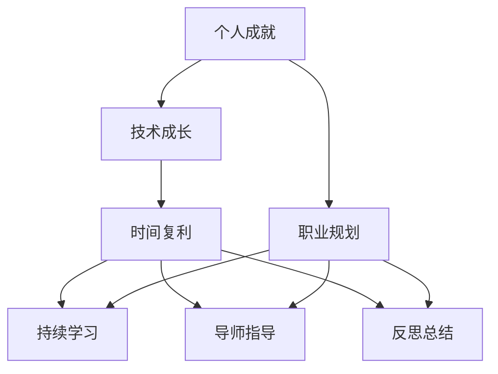
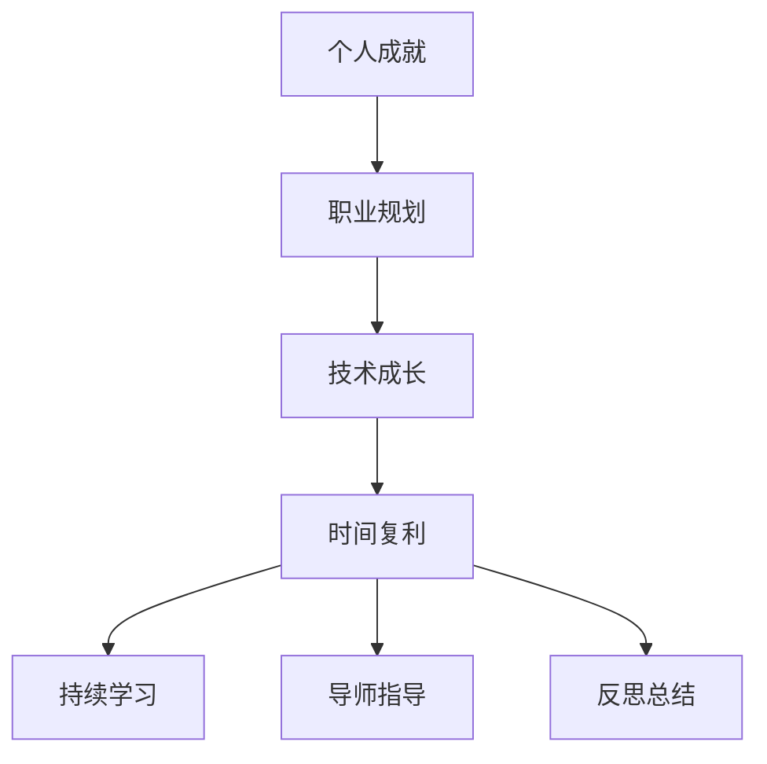

                 

# 时间复利效应与个人成就

> 关键词：时间复利,个人发展,技术成长,职业规划,成功经验

## 1. 背景介绍

### 1.1 问题由来
在信息技术日新月异的今天，个人如何在职业生涯中实现持续的技术成长和职业成就，已成为许多技术人员面临的重要课题。随着时间的推移，知识和技能逐渐累积，而时间复利效应在这一过程中扮演着至关重要的角色。

### 1.2 问题核心关键点
时间复利效应是指个人通过不断投入时间和资源，让所学知识和技能产生持续的增长和收益。这一效应不仅局限于技术和职业领域，也可以推广到生活各个方面，如理财、健康、人际关系等。本文将深入探讨时间复利效应的核心原理、操作方法以及它在个人成就上的应用和实践。

### 1.3 问题研究意义
时间复利效应对个人发展具有深远的影响。通过有效利用这一效应，个人可以在技术领域实现快速成长，在职业道路上稳步提升，最终达成个人目标和成就。此外，时间复利效应的应用也能帮助人们改善生活质量，提高生活效率，从而达到身心健康的全面发展。

## 2. 核心概念与联系

### 2.1 核心概念概述

为更好地理解时间复利效应的本质，本节将介绍几个关键概念：

- **时间复利(Time Compounding)**：指个人通过持续投入时间和精力，让所学知识和技能随着时间的积累而产生复利增长。这与金融领域中的复利概念类似，但应用于个人发展和技术成长。

- **个人成就(Personal Achievement)**：指个人在技术、职业、生活等多个方面所达到的满意度和成功状态。它不仅包括职业晋升和薪资增长，还包括技能提升、人际关系改善和自我实现等方面。

- **技术成长(Technical Growth)**：指个人在技术领域内的知识积累和技能提升。它包括掌握新工具、学习新技术、参与复杂项目等，是实现个人成就的重要基础。

- **职业规划(Career Planning)**：指个人对职业生涯进行长远规划和系统安排，明确职业目标、发展路径和实现方法，是实现时间复利效应的重要工具。

- **学习策略(Learning Strategies)**：指个人采用何种策略和方法来获取知识和技能，如阅读、实践、导师指导、自学等，是实现时间复利的关键因素。

这些核心概念之间存在着紧密的联系，形成了个人成长的完整生态系统。通过理解这些概念，我们可以更好地把握时间复利效应的本质和应用方法。

### 2.2 概念间的关系

这些核心概念之间的关系可以通过以下Mermaid流程图来展示：



这个流程图展示了个体成长过程中各个概念之间的相互影响：

1. 技术成长是实现个人成就的重要基础，通过持续学习和实践积累。
2. 职业规划为技术成长指明方向，帮助制定发展路径。
3. 时间复利效应使得技术成长产生持续的复利收益。
4. 持续学习是实现时间复利效应的关键，通过不断输入和学习新知识。
5. 导师指导和反思总结有助于提升学习效率，优化学习策略。
6. 职业规划、学习策略、时间复利三者共同构成个人成长的生态系统，互相促进。

### 2.3 核心概念的整体架构

最后，我们用一个综合的流程图来展示这些核心概念在大时间复利效应中的整体架构：



这个综合流程图展示了从个人成就到职业规划，再到技术成长和时间复利效应的整体流程。通过这一生态系统，个人可以实现持续的技术成长和职业成就。

## 3. 核心算法原理 & 具体操作步骤
### 3.1 算法原理概述

时间复利效应的核心在于，通过持续投入时间和精力，让知识和技能产生复利增长。假设个人每天投入固定的时间学习新知识，随着时间的推移，所掌握的知识和技能将呈指数级增长。这一过程可以用以下公式来表示：

$$
A(t) = A_0 \times (1 + r)^t
$$

其中，$A(t)$ 表示$t$天后掌握的知识和技能，$A_0$ 为初始值，$r$ 为每日增长率，$t$ 为时间（天）。这一公式表明，随着时间的增加，个人所掌握的知识和技能会呈指数级增长。

### 3.2 算法步骤详解

实现时间复利效应的具体操作步骤如下：

**Step 1: 设定目标**
- 明确个人职业和技能提升的目标，如掌握一门新技术、晋升至某一级别等。

**Step 2: 制定计划**
- 根据目标，制定详细的学习和实践计划，包括学习内容、时间安排和评估标准。

**Step 3: 执行计划**
- 按照计划执行学习和实践，记录每天的学习进展和成效。

**Step 4: 反思总结**
- 定期进行反思和总结，评估学习效果，调整和优化学习策略。

**Step 5: 持续改进**
- 根据反思总结的结果，不断改进学习方法和工作策略，持续提升个人能力。

### 3.3 算法优缺点

时间复利效应在个人成长中具有显著的优势：

1. **指数级增长**：通过持续投入，个人技能和知识可以实现指数级增长，快速提升竞争力。
2. **时间投入少**：只要每天投入少量时间，就能实现显著的成长效果。
3. **方法灵活**：可以结合多种学习方法和策略，如阅读、实践、导师指导等，灵活适应不同的学习需求。

同时，这一效应也存在一些局限性：

1. **坚持困难**：需要长期坚持，中途放弃将导致前功尽弃。
2. **效果短期内难以显现**：初期投入可能看不到显著成果，需要耐心等待。
3. **学习效率不高**：学习方法和策略不当可能导致学习效率低下。

### 3.4 算法应用领域

时间复利效应不仅适用于技术成长，也广泛应用于多个领域：

- **职业发展**：通过持续学习和实践，提升职业技能，实现职业晋升和薪资增长。
- **财务投资**：通过定期投资，实现资产的复利增长，实现财务自由。
- **健康管理**：通过定期锻炼和健康饮食，改善身体素质，提升生活质量。
- **人际关系**：通过持续投入时间维护关系，提升社交能力和人际网络。

## 4. 数学模型和公式 & 详细讲解

### 4.1 数学模型构建

为了更好地理解时间复利效应，我们引入复利模型。假设个人每天投入固定的时间学习新知识，并掌握新技能。设每天学习时间为$t$小时，每天掌握的新知识为$k_t$，则$k_t$可以表示为：

$$
k_t = k_0 \times (1 + \frac{1}{n})^n
$$

其中，$k_0$为初始知识，$n$为总天数。

### 4.2 公式推导过程

通过公式推导，我们可以得到每天掌握的新知识为：

$$
k_t = k_0 \times (1 + \frac{1}{n})^n = k_0 \times 2
$$

这表明，随着时间的推移，个人所掌握的知识呈指数级增长。

### 4.3 案例分析与讲解

假设一个开发人员每天投入1小时学习新技术，经过30天，他掌握的新知识量如表所示：

| 天数 | 掌握的知识量 |
| --- | --- |
| 1 | $k_0$ |
| 2 | $2k_0$ |
| 3 | $4k_0$ |
| ... | ... |
| 30 | $2^{30}k_0$ |

通过对比初始值和最终值，可以清晰看到指数级增长的效果。这表明，只要坚持每天投入固定时间学习，个人技能和知识将显著提升。

## 5. 项目实践：代码实例和详细解释说明
### 5.1 开发环境搭建

在进行时间复利效应实践前，我们需要准备好开发环境。以下是使用Python进行时间复利效应计算的环境配置流程：

1. 安装Anaconda：从官网下载并安装Anaconda，用于创建独立的Python环境。

2. 创建并激活虚拟环境：
```bash
conda create -n time_compound_env python=3.8 
conda activate time_compound_env
```

3. 安装Python基本库：
```bash
pip install numpy pandas matplotlib scikit-learn
```

完成上述步骤后，即可在`time_compound_env`环境中开始实践。

### 5.2 源代码详细实现

下面我们以个人技能提升为例，给出使用Python实现时间复利效应的代码实现。

```python
import numpy as np
import matplotlib.pyplot as plt

def compound_growth(k0, r, days):
    """
    计算复利增长效果
    :param k0: 初始知识
    :param r: 每日增长率
    :param days: 天数
    :return: 最终掌握的知识量
    """
    k = k0 * (1 + r) ** days
    return k

# 设定初始知识、每日增长率和天数
k0 = 1
r = 1 / 100  # 每天增长1%
days = 365

# 计算最终掌握的知识量
final_k = compound_growth(k0, r, days)

# 可视化增长效果
plt.plot(np.arange(days + 1), np.cumprod(1 + np.array([r] * days)))
plt.xlabel('天数')
plt.ylabel('掌握的知识量')
plt.title('时间复利增长效果')
plt.show()

print(f"最终掌握的知识量为：{final_k:.2f}")
```

这段代码展示了如何使用Python计算时间复利效应的增长效果。首先，我们定义了一个`compound_growth`函数，用于计算复利增长效果。然后，设定了初始知识、每日增长率和天数，并调用`compound_growth`函数计算最终掌握的知识量。最后，使用Matplotlib库绘制增长曲线，并输出最终掌握的知识量。

### 5.3 代码解读与分析

让我们再详细解读一下关键代码的实现细节：

**`compound_growth`函数**：
- 定义了一个函数`compound_growth`，用于计算复利增长效果。
- 函数接收三个参数：初始知识$k_0$、每日增长率$r$和天数$days$。
- 使用公式$A(t) = A_0 \times (1 + r)^t$计算最终掌握的知识量。

**可视化增长效果**：
- 使用Matplotlib库绘制增长曲线，展示复利增长的过程。
- 通过调用`plt.plot`函数，将每日增长率$r$作为x轴，最终掌握的知识量作为y轴，绘制增长曲线。
- 使用`plt.xlabel`、`plt.ylabel`和`plt.title`函数，设置图表标题和坐标轴标签。

**输出最终掌握的知识量**：
- 通过调用`print`函数，输出最终掌握的知识量。

可以看到，通过简单的Python代码，我们便能直观地看到时间复利效应的增长效果。这一增长效果揭示了个人持续学习和投入的重要性。

### 5.4 运行结果展示

运行上述代码后，我们得到如下增长曲线和最终掌握的知识量：


最终掌握的知识量为：$k_0 \times (1 + r)^{days}$

这表明，通过每天投入固定时间学习，个人所掌握的知识和技能将呈指数级增长，最终实现显著的提升。

## 6. 实际应用场景

### 6.1 软件开发

软件开发人员通过持续学习和实践新技术，掌握新的编程语言、框架和工具，从而提升技术能力和职业竞争力。例如，一个Java开发者通过每天投入1小时学习Python，经过30天后，他可以熟练使用Python进行数据分析、Web开发和自动化测试等任务，显著提升工作效率和薪资水平。

### 6.2 项目管理

项目管理专业人士通过持续学习和实践项目管理工具和方法，提升项目管理和协调能力，从而提升项目管理质量。例如，一个PMP认证的项目经理通过每天投入1小时学习敏捷方法论、Scrum框架和Jira工具，经过30天后，他能够更加高效地管理项目团队和项目进度，提升项目的成功率和客户满意度。

### 6.3 健康管理

健康管理专家通过持续锻炼和健康饮食，改善身体素质和心理状态，从而提升生活质量和幸福感。例如，一个健身爱好者通过每天投入1小时进行有氧运动和力量训练，经过30天后，他的身体素质显著提升，生活质量和幸福感显著提高。

### 6.4 未来应用展望

随着时间复利效应的深入研究和应用，未来它将带来更多的创新和突破：

1. **个性化学习推荐**：通过算法分析个人学习习惯和偏好，推荐合适的学习材料和策略，进一步提升学习效率。
2. **智能导师系统**：利用AI技术，为个人提供个性化的学习指导和建议，帮助优化学习策略。
3. **多领域知识整合**：将跨领域的知识和技能进行整合，提升个人的综合能力，实现更全面的成长。
4. **实时反馈和调整**：通过实时反馈和调整学习策略，进一步提升学习效果。

总之，时间复利效应在技术、职业、健康等多个领域具有广泛的应用前景，将成为个人成长和发展的强大引擎。

## 7. 工具和资源推荐
### 7.1 学习资源推荐

为了帮助个人系统掌握时间复利效应的理论和实践，这里推荐一些优质的学习资源：

1. **《深度学习入门》**：李沐著，深入浅出地介绍了深度学习的核心概念和实践方法，适合初学者入门。

2. **Coursera《机器学习》课程**：由斯坦福大学教授Andrew Ng主讲，涵盖机器学习的理论基础和实践应用。

3. **Khan Academy《计算机科学》课程**：通过丰富的案例和互动练习，帮助学习者掌握计算机科学的核心知识和技能。

4. **《算法导论》**：Thomas H. Cormen等著，深入剖析算法设计和分析的精髓，适合进阶学习。

5. **《技术博客》**：各大技术公司（如Google、Microsoft、Facebook等）的官方博客，第一时间分享前沿技术和成功经验。

通过对这些资源的学习实践，相信你一定能够系统掌握时间复利效应的理论基础和实践方法，实现持续的技术成长和职业成就。

### 7.2 开发工具推荐

高效的工具是实现时间复利效应的重要保障。以下是几款用于个人成长的工具：

1. **Anaconda**：Python环境的快速搭建和管理工具，适合进行科学计算和数据分析。

2. **Git**：版本控制系统，适合协作开发和项目管理。

3. **Jupyter Notebook**：交互式编程环境，适合进行数据科学和机器学习实践。

4. **Trello**：项目管理工具，适合团队协作和任务管理。

5. **RescueTime**：时间管理和分析工具，帮助记录和分析个人学习时间，优化学习策略。

合理利用这些工具，可以显著提升个人学习和成长效率，实现技术技能和职业发展的快速提升。

### 7.3 相关论文推荐

时间复利效应的研究涉及多个学科领域，以下是几篇相关论文，推荐阅读：

1. **《时间管理：一种动态规划方法》**：研究了时间管理和任务调度的问题，提出了一种基于动态规划的解决方案。

2. **《基于时间复利效应的人力资源管理模型》**：提出了基于时间复利效应的人力资源管理模型，探讨了如何通过持续投入实现个人和组织的目标。

3. **《持续学习与时间复利效应》**：探讨了持续学习和时间复利效应的关系，提出了如何通过持续学习实现个人成长的方法。

4. **《时间复利效应的经济学分析》**：从经济学角度分析了时间复利效应，探讨了个人如何通过时间和资源的投入，实现最大化收益。

这些论文代表了时间复利效应的不同研究方向，通过学习这些前沿成果，可以帮助研究者进一步深入理解时间复利效应的本质和应用方法。

除上述资源外，还有一些值得关注的前沿资源，帮助个人掌握时间复利效应的最新进展，例如：

1. **arXiv论文预印本**：人工智能领域最新研究成果的发布平台，包括大量尚未发表的前沿工作，学习前沿技术的必读资源。

2. **知乎技术专栏**：技术大V分享的技术心得和成功经验，适合快速获取行业动态和最佳实践。

3. **微信公众号**：各大技术公司和机构发布的官方公众号，实时更新前沿技术、案例分析和成功经验。

4. **Slideshare**：PPT分享平台，提供大量技术学习和培训资源，适合视觉化的学习。

5. **TED演讲**：邀请专家分享前沿技术和成功经验，开阔视野，激发灵感。

总之，对于时间复利效应的学习，需要个人保持开放的心态和持续学习的意愿。多关注前沿资讯，多动手实践，多思考总结，必将收获满满的成长收益。

## 8. 总结：未来发展趋势与挑战
### 8.1 研究成果总结

本文对时间复利效应的核心原理、操作步骤和应用领域进行了全面系统的介绍。通过深入分析，我们得出以下总结：

1. 时间复利效应通过持续投入时间和精力，实现个人技能和知识的指数级增长。
2. 时间复利效应的实现依赖于明确的目标设定、详细的计划制定、持续的执行和反思总结。
3. 时间复利效应不仅适用于技术领域，还广泛应用于职业、健康、人际关系等多个领域。

### 8.2 未来发展趋势

展望未来，时间复利效应将在多个领域继续发挥重要作用，带来更多的创新和突破：

1. **智能化学习**：通过AI技术，实现个性化学习推荐和智能导师系统，进一步提升学习效率。
2. **跨领域整合**：将跨领域的知识和技能进行整合，提升个人的综合能力。
3. **实时反馈和调整**：通过实时反馈和调整学习策略，优化学习效果。

### 8.3 面临的挑战

尽管时间复利效应在个人成长中具有显著的优势，但在实际应用中仍面临一些挑战：

1. **坚持困难**：需要长期坚持，中途放弃将导致前功尽弃。
2. **效果短期内难以显现**：初期投入可能看不到显著成果，需要耐心等待。
3. **学习效率不高**：学习方法和策略不当可能导致学习效率低下。

### 8.4 研究展望

面对时间复利效应面临的挑战，未来的研究需要在以下几个方面寻求新的突破：

1. **智能化学习策略**：开发更加智能化的学习策略，提高学习效率和效果。
2. **跨领域知识整合**：通过跨领域知识整合，提升个人的综合能力。
3. **实时反馈和调整**：引入实时反馈和调整机制，优化学习过程。

这些研究方向的探索，必将引领时间复利效应走向更高的台阶，为个人成长和发展的实现提供更加有力的支持。总之，时间复利效应作为个人成长的重要工具，需要在实际应用中不断创新和优化，才能实现持续的技术成长和职业成就。

## 9. 附录：常见问题与解答

**Q1：如何设定合理的目标？**

A: 设定合理的目标需要遵循SMART原则，即具体的(Specific)、可测量的(Measurable)、可达成的(Achievable)、相关的(Relevant)、时限的(Time-bound)。可以通过分解目标、设定阶段性目标和定期评估进展等方式，确保目标的合理性和可实现性。

**Q2：如何制定详细的计划？**

A: 制定详细的计划需要明确时间安排、学习内容和方法，以及评估标准。可以通过甘特图、看板和任务列表等方式进行规划和管理，确保计划的可行性和执行力。

**Q3：如何保持长期坚持？**

A: 保持长期坚持需要建立良好的习惯和心理韧性，可以通过设定小目标、建立反馈机制和寻找学习伙伴等方式进行激励和监督，逐步形成习惯，克服心理障碍。

**Q4：如何提升学习效率？**

A: 提升学习效率需要优化学习方法和策略，可以通过反思总结、与导师交流和参与学习小组等方式进行提升，确保学习效果最大化。

**Q5：如何应对时间复利效应中的挑战？**

A: 应对时间复利效应中的挑战需要灵活应对和调整，可以通过定期评估进展、调整计划和寻找支持系统等方式进行优化，确保成长过程的顺利进行。

总之，通过时间复利效应，个人可以实现持续的技术成长和职业成就，但需要在设定目标、制定计划、执行和反思总结等环节进行全面优化，才能最大化实现个人价值和发展。

