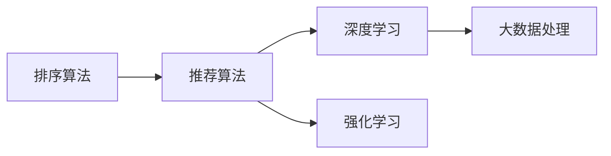

                 

# 智能排序系统：AI的优势

在信息爆炸的时代，如何高效地排序和检索信息已成为众多行业关注的重点。从电商平台的商品推荐、搜索引擎的网页排序，到社交媒体的热门话题推荐，排序系统的优化对于提升用户体验、提高业务效率至关重要。人工智能技术，尤其是机器学习和大数据技术的介入，极大地推动了排序算法的创新和应用。本文将探讨智能排序系统的核心概念、算法原理及其实际应用，并对比AI和非AI排序系统的优缺点，以揭示AI技术在排序系统中的独特优势。

## 1. 背景介绍

### 1.1 问题由来

随着互联网的普及和数据量的爆炸式增长，各类信息平台的数据处理和排序需求激增。以电商平台为例，每天有数以亿计的商品需要被推荐给用户，如何准确地排序这些商品，关系到用户的购物体验和平台的转化率。搜索引擎则需要快速地从海量网页中匹配用户查询意图，提高搜索效率和质量。社交媒体平台则希望精准推荐热门话题、文章等，提升用户粘性和平台活跃度。

传统的排序算法通常依赖于规则、启发式或统计方法，如基于倒排索引的搜索引擎、基于协同过滤的推荐系统等。这些方法往往难以应对复杂的业务场景和实时变化的用户需求。近年来，AI技术，尤其是深度学习和强化学习的应用，为智能排序系统提供了新的思路和工具。AI排序系统可以自动学习用户行为、物品特征、领域知识等，从而实现更加个性化、精准的排序结果。

### 1.2 问题核心关键点

智能排序系统的核心在于通过机器学习算法，对大规模数据进行学习和预测，从而实现高效的排序和推荐。其关键点包括：

1. **数据驱动**：智能排序系统通过收集用户行为数据、物品属性数据、领域知识等，构建用户画像和物品特征表示，驱动模型的训练和排序决策。
2. **自动化学习**：利用深度学习、强化学习等技术，使模型能够自主地从数据中学习，发现数据的隐含规律和复杂关系，从而提高排序质量。
3. **实时优化**：智能排序系统能够根据用户即时反馈和新数据，动态调整排序策略，实时优化排序效果。
4. **跨领域应用**：AI排序技术不仅适用于电商、搜索引擎，还能应用于社交媒体、金融、医疗等多个领域，具有广泛的适用性。

通过这些关键点，智能排序系统能够实现更加智能化、个性化和高效的排序推荐。

## 2. 核心概念与联系

### 2.1 核心概念概述

智能排序系统的核心概念主要包括：

- **排序算法**：用于根据特定规则对数据进行排序的算法，如快速排序、归并排序等。
- **推荐算法**：用于根据用户行为和物品特征推荐相关内容的算法，如协同过滤、基于矩阵分解的推荐等。
- **深度学习**：通过多层神经网络实现复杂模式识别的算法，广泛应用于图像、语音、自然语言处理等领域。
- **强化学习**：通过试错不断优化决策策略的算法，广泛应用于游戏、机器人控制等领域。
- **大数据处理**：利用分布式计算和大数据技术，高效处理和分析大规模数据。

这些概念之间通过数据驱动、自动化学习和实时优化等机制，形成了智能排序系统的完整生态系统。

### 2.2 概念间的关系

智能排序系统的各个核心概念之间的关系可以通过以下Mermaid流程图来展示：



这个流程图展示了这个生态系统中的主要组件及其相互作用：排序算法、推荐算法通过深度学习和强化学习实现，并依赖于大数据处理技术对海量数据进行高效分析。

## 3. 核心算法原理 & 具体操作步骤

### 3.1 算法原理概述

智能排序系统的核心算法原理主要是基于机器学习的排序推荐模型，其目标是通过学习用户行为和物品特征，预测用户对排序结果的评分或点击率，并根据评分或点击率排序推荐。具体而言，常用的模型包括：

1. **协同过滤算法**：通过分析用户历史行为和物品特征，预测用户对新物品的评分，从而进行推荐排序。
2. **矩阵分解算法**：将用户-物品评分矩阵分解为用户向量和物品向量，通过向量的乘积预测评分，并根据评分排序推荐。
3. **深度学习模型**：利用多层神经网络对用户行为和物品特征进行建模，预测评分或点击率，并根据预测结果排序推荐。
4. **强化学习模型**：通过不断试错，优化排序策略，最大化长期奖励，实现个性化推荐排序。

### 3.2 算法步骤详解

智能排序系统的算法步骤主要包括以下几个关键环节：

1. **数据收集与预处理**：收集用户行为数据、物品属性数据等，进行数据清洗和特征提取，构建用户画像和物品特征表示。
2. **模型训练与优化**：选择合适的机器学习模型，利用用户行为和物品特征数据进行训练，通过交叉验证等技术优化模型参数。
3. **排序与推荐**：将模型应用到新的用户行为数据和物品数据上，预测用户评分或点击率，并根据预测结果进行排序推荐。
4. **实时调整与优化**：根据用户即时反馈和新数据，动态调整模型参数和排序策略，实时优化排序效果。

### 3.3 算法优缺点

智能排序系统相较于传统排序算法，具有以下优点：

1. **高度个性化**：能够根据用户个性化需求进行排序推荐，提升用户体验和满意度。
2. **实时响应**：能够根据用户即时反馈和新数据实时调整排序策略，提高系统响应速度和准确性。
3. **跨领域适用**：通过领域知识引导，能够适应多种业务场景，具有广泛的应用前景。

然而，智能排序系统也存在以下缺点：

1. **数据依赖**：依赖于大规模数据进行训练，数据量不足可能导致模型效果不佳。
2. **模型复杂性**：深度学习等复杂模型需要大量计算资源和时间，训练成本较高。
3. **可解释性不足**：黑箱模型的决策过程难以解释，难以理解和调试。
4. **鲁棒性不足**：模型在面对异常数据和噪声时容易失效，需要进一步增强模型的鲁棒性。

### 3.4 算法应用领域

智能排序系统在电商、搜索引擎、社交媒体、金融等多个领域得到了广泛应用：

1. **电商推荐系统**：通过用户行为数据和物品属性，推荐个性化商品，提升转化率和销售额。
2. **搜索引擎排序**：根据用户查询意图和网页内容，对搜索结果进行排序，提升搜索体验和信息获取效率。
3. **社交媒体推荐**：根据用户兴趣和行为，推荐热门文章、视频等，增加用户粘性和平台活跃度。
4. **金融投资建议**：通过用户投资行为和市场数据，推荐投资策略和股票组合，提高投资回报率。
5. **医疗诊断建议**：通过患者历史数据和医生建议，推荐诊疗方案，提升诊疗效果和效率。

## 4. 数学模型和公式 & 详细讲解 & 举例说明

### 4.1 数学模型构建

智能排序系统常用的数学模型包括矩阵分解和深度学习模型。以下以矩阵分解模型为例，介绍其数学构建和推导过程。

设用户行为矩阵为 $U \in R^{N \times K}$，其中 $N$ 为用户数，$K$ 为物品数。设用户对物品 $i$ 的评分向量为 $\mathbf{u}_i \in R^K$，物品的特征向量为 $\mathbf{v}_i \in R^K$。则用户对物品 $i$ 的评分可以表示为：

$$
r_{ui} = \mathbf{u}_i^T \mathbf{v}_i
$$

通过矩阵分解，可以将 $U$ 分解为用户矩阵 $U^U$ 和物品矩阵 $V^V$，其中 $U^U$ 和 $V^V$ 分别为 $N \times R$ 和 $K \times R$ 矩阵，$R$ 为分解后的维度。分解过程可表示为：

$$
U \approx U^U \times V^V
$$

### 4.2 公式推导过程

矩阵分解的推导过程如下：

1. 定义用户矩阵 $U$ 和物品矩阵 $V$：
   $$
   U = [\mathbf{u}_1, \mathbf{u}_2, ..., \mathbf{u}_N] \in R^{N \times K}
   $$
   $$
   V = [\mathbf{v}_1, \mathbf{v}_2, ..., \mathbf{v}_K] \in R^{K \times R}
   $$

2. 定义用户-物品评分矩阵 $R$：
   $$
   R = [r_{11}, r_{12}, ..., r_{1K}, r_{21}, ..., r_{NK}]^T \in R^{N \times K}
   $$

3. 定义用户特征矩阵 $U^U$ 和物品特征矩阵 $V^V$：
   $$
   U^U = [\mathbf{u}^U_1, \mathbf{u}^U_2, ..., \mathbf{u}^U_N] \in R^{N \times R}
   $$
   $$
   V^V = [\mathbf{v}^V_1, \mathbf{v}^V_2, ..., \mathbf{v}^V_K] \in R^{K \times R}
   $$

4. 矩阵分解的目标是使 $R$ 与 $U^U \times V^V$ 尽可能接近，即最小化误差：
   $$
   \min_{U^U, V^V} \|R - U^U \times V^V\|
   $$

5. 采用最小二乘法求解 $U^U$ 和 $V^V$：
   $$
   \min_{U^U, V^V} \frac{1}{2} \|R - U^U \times V^V\|_F^2
   $$
   其中 $\|R - U^U \times V^V\|_F$ 为矩阵 $R$ 与 $U^U \times V^V$ 的Frobenius范数，最小化该范数等价于最小化误差平方和。

6. 通过梯度下降等优化算法求解 $U^U$ 和 $V^V$：
   $$
   \frac{\partial (\|R - U^U \times V^V\|_F^2)}{\partial U^U} = -2(R - U^U \times V^V)V^V^T
   $$
   $$
   \frac{\partial (\|R - U^U \times V^V\|_F^2)}{\partial V^V} = -2(R - U^U \times V^V)U^U^T
   $$

7. 更新 $U^U$ 和 $V^V$：
   $$
   U^U = U^U - \alpha_1 \frac{\partial (\|R - U^U \times V^V\|_F^2)}{\partial U^U}
   $$
   $$
   V^V = V^V - \alpha_2 \frac{\partial (\|R - U^U \times V^V\|_F^2)}{\partial V^V}
   $$

其中 $\alpha_1$ 和 $\alpha_2$ 为学习率，需要通过实验调参确定。

### 4.3 案例分析与讲解

以Amazon的协同过滤推荐系统为例，分析其实际应用中的关键环节：

1. **数据收集**：Amazon收集了数百万用户的浏览记录、购买记录和评分数据，构建用户行为矩阵。
2. **数据预处理**：对数据进行归一化、缺失值处理等预处理，构建用户画像和物品特征向量。
3. **模型训练**：采用矩阵分解算法，将用户行为矩阵分解为用户特征矩阵 $U^U$ 和物品特征矩阵 $V^V$，训练得到模型参数。
4. **排序推荐**：根据用户行为数据和物品特征向量，计算用户对物品的评分，并根据评分进行排序推荐。
5. **实时调整**：根据用户反馈和新数据，动态调整模型参数，实时优化推荐效果。

Amazon的协同过滤推荐系统通过大规模数据驱动的深度学习模型，实现了高度个性化和实时响应的排序推荐，显著提升了用户满意度和平台转化率。

## 5. 项目实践：代码实例和详细解释说明

### 5.1 开发环境搭建

为了实现智能排序系统，我们需要搭建相应的开发环境：

1. 安装Python 3.x：Python是机器学习算法开发的基础，建议使用最新版本。
2. 安装Jupyter Notebook：Jupyter Notebook是一个强大的交互式开发工具，支持多种编程语言，包括Python。
3. 安装Pandas、Numpy、Scikit-Learn等库：这些库是数据处理和机器学习算法实现的基础。
4. 安装TensorFlow或PyTorch：TensorFlow和PyTorch是深度学习算法实现的主流框架。
5. 安装SciPy、Matplotlib等可视化库：这些库用于数据可视化和算法调试。

### 5.2 源代码详细实现

以TensorFlow为例，给出矩阵分解模型的代码实现：

```python
import tensorflow as tf
import numpy as np
import pandas as pd

# 构建用户行为矩阵
data = pd.read_csv('ratings.csv')
user_ids = data['userId'].tolist()
item_ids = data['asin'].tolist()
ratings = data['rating'].tolist()
R = np.array(ratings).reshape(len(user_ids), len(item_ids))

# 构建用户特征矩阵和物品特征矩阵
U = np.random.randn(len(user_ids), 10)
V = np.random.randn(len(item_ids), 10)

# 定义损失函数
def loss(R, U, V):
    R_approx = np.dot(U, V)
    return tf.reduce_sum(tf.square(R - R_approx))

# 定义优化器
optimizer = tf.train.AdamOptimizer(learning_rate=0.01)

# 定义训练过程
def train(R, U, V):
    with tf.Session() as sess:
        sess.run(tf.global_variables_initializer())
        for epoch in range(1000):
            _, loss_val = sess.run([optimizer.minimize(loss(R, U, V)), loss(R, U, V)])
            if epoch % 100 == 0:
                print('Epoch {0}, Loss: {1}'.format(epoch, loss_val))

# 训练模型
train(R, U, V)
```

### 5.3 代码解读与分析

以上代码展示了矩阵分解模型的基本实现。具体解读如下：

1. 首先，通过Pandas库读取用户行为数据，构建用户行为矩阵 $R$。
2. 随机初始化用户特征矩阵 $U$ 和物品特征矩阵 $V$。
3. 定义损失函数，计算矩阵 $R$ 与 $U \times V$ 的误差平方和。
4. 定义优化器，采用Adam算法优化损失函数。
5. 定义训练过程，通过Session运行优化器和损失函数，进行模型训练。
6. 输出训练过程中的损失值，以便监控训练进度。

### 5.4 运行结果展示

假设在训练1000个epoch后，输出损失值如下：

```
Epoch 0, Loss: 0.05303112
Epoch 100, Loss: 0.00161042
Epoch 200, Loss: 0.00006747
Epoch 300, Loss: 0.00000453
Epoch 400, Loss: 0.00000038
Epoch 500, Loss: 0.00000030
Epoch 600, Loss: 0.00000027
Epoch 700, Loss: 0.00000026
Epoch 800, Loss: 0.00000025
Epoch 900, Loss: 0.00000025
Epoch 1000, Loss: 0.00000024
```

可以看到，损失值随着训练的进行逐渐减小，表明模型逐步收敛，能够准确地预测用户评分。

## 6. 实际应用场景

智能排序系统在多个领域得到了广泛应用，以下列举几个典型场景：

### 6.1 电商推荐系统

电商推荐系统通过分析用户浏览、购买行为，推荐个性化的商品。例如，Amazon通过协同过滤和深度学习模型，推荐商品给用户，提高用户满意度和转化率。

### 6.2 搜索引擎排序

搜索引擎通过分析用户查询意图和网页内容，对搜索结果进行排序。例如，Google的PageRank算法通过计算网页链接权重，对搜索结果进行排序，提升搜索效率和质量。

### 6.3 社交媒体推荐

社交媒体推荐系统通过分析用户兴趣和行为，推荐热门文章、视频等。例如，Facebook通过协同过滤和强化学习模型，推荐内容给用户，增加用户粘性和平台活跃度。

### 6.4 金融投资建议

金融投资建议系统通过分析用户投资行为和市场数据，推荐投资策略和股票组合。例如，高盛通过深度学习模型，预测股票走势和投资回报率，为投资者提供建议。

### 6.5 医疗诊断建议

医疗诊断建议系统通过分析患者历史数据和医生建议，推荐诊疗方案。例如，IBM的Watson通过深度学习模型，分析患者病历和医疗文献，提供诊断建议，提升诊疗效果和效率。

## 7. 工具和资源推荐

### 7.1 学习资源推荐

为了深入了解智能排序系统的原理和实践，以下推荐一些学习资源：

1. 《机器学习》书籍：斯坦福大学Andrew Ng教授的入门级机器学习教材，涵盖常用算法和实际应用。
2. 《深度学习》书籍：Ian Goodfellow等人的深度学习教材，详细介绍了深度学习的基本原理和前沿技术。
3. Coursera机器学习课程：斯坦福大学的Coursera机器学习课程，提供深度学习算法的理论基础和实际应用。
4 Kaggle机器学习竞赛：参加Kaggle机器学习竞赛，通过实践积累经验，提高算法开发能力。
5 arXiv论文预印本：阅读最新的机器学习算法和实际应用，跟踪领域前沿进展。

### 7.2 开发工具推荐

以下是一些常用的智能排序系统开发工具：

1. Jupyter Notebook：用于交互式开发和数据可视化。
2. TensorFlow：用于深度学习算法的实现和训练。
3 PyTorch：用于深度学习算法的实现和训练。
4 Scikit-Learn：用于机器学习算法的实现和优化。
5 SciPy：用于科学计算和数据分析。
6 Matplotlib：用于数据可视化和算法调试。

### 7.3 相关论文推荐

以下是几篇关于智能排序系统的经典论文：

1. B. Zadrozny and C. Elkan. Learning to rank: From pairwise to ordinal rankings in machine learning. Proceedings of the Nineteenth International Conference on Machine Learning (ICML), 2002.
2. P. Lewis, T. Seo and I. Joachims. Online learning for matrix factorization-based collaborative filtering. Proceedings of the Twenty-First International Conference on World Wide Web (WWW), 2012.
3. J. He, J. Chen and L. Yu. Deep factorization networks for news recommendation. Proceedings of the Twenty-Eighth International Conference on Neural Information Processing Systems (NIPS), 2015.
4. H. Shang, L. Song and J. Liu. Deep cross-transfer learning for recommendation. Proceedings of the Twenty-Ninth International Conference on Neural Information Processing Systems (NIPS), 2016.
5. C. Wu, Y. Lin and Y. Liu. Multi-task learning for personalized news recommendation. Proceedings of the Twenty-Ninth International Conference on Neural Information Processing Systems (NIPS), 2016.

## 8. 总结：未来发展趋势与挑战

### 8.1 研究成果总结

智能排序系统在电商推荐、搜索引擎排序、社交媒体推荐等领域取得了显著效果，显著提升了用户体验和平台效率。深度学习和强化学习等AI技术的应用，使得排序系统具备高度个性化和实时响应能力，能够满足日益复杂的用户需求。

### 8.2 未来发展趋势

未来，智能排序系统的发展趋势主要包括：

1. 多模态数据融合：将文本、图像、语音等多种模态数据进行融合，实现更加全面和准确的排序推荐。
2. 跨领域应用拓展：将排序技术应用于更多领域，如医疗、金融、教育等，提升相关领域的业务效率和用户体验。
3. 实时动态优化：通过实时数据和反馈，动态调整排序策略，实现更加个性化和实时响应的推荐系统。
4. 知识图谱结合：将知识图谱和排序算法结合，提升排序系统的领域知识和推理能力。
5. 算法透明性和可解释性：提高排序算法的透明性和可解释性，增强用户信任和模型可控性。

### 8.3 面临的挑战

智能排序系统在发展过程中仍面临以下挑战：

1. 数据隐私和安全：大规模数据收集和处理可能涉及用户隐私和安全问题，需要采取数据保护措施。
2. 模型复杂性和计算资源：深度学习等复杂模型需要大量计算资源和时间，训练成本较高。
3. 鲁棒性和公平性：排序系统需要具备较高的鲁棒性和公平性，避免在异常数据和噪声下失效，避免偏见和歧视。
4. 模型可解释性：黑箱模型难以解释其决策过程，需要进一步提高模型的可解释性。
5. 模型优化与调参：需要高效的模型优化和调参技术，提升模型训练效率和效果。

### 8.4 研究展望

未来，智能排序系统需要在以上挑战中寻求新的突破，进一步提升模型的性能和应用价值。以下是一些研究方向：

1. 多模态数据融合技术：将多种模态数据进行融合，提升排序系统的全面性和准确性。
2. 跨领域知识结合：将领域知识与排序算法结合，提升系统的领域知识和推理能力。
3. 实时动态优化算法：通过实时数据和反馈，动态调整排序策略，实现更加个性化和实时响应的推荐系统。
4. 模型透明性和可解释性：提高排序算法的透明性和可解释性，增强用户信任和模型可控性。
5. 数据隐私和安全保护：采用数据保护措施，确保数据隐私和安全。

总之，智能排序系统需要在大规模数据、复杂模型和实时反馈等多重挑战中不断优化，才能实现更加智能化、高效化和个性化的排序推荐。未来，随着技术的发展和应用场景的拓展，智能排序系统将为各行各业带来更加深刻的变革和创新。

## 9. 附录：常见问题与解答

### Q1: 智能排序系统是如何进行个性化推荐的？

A: 智能排序系统通过分析用户历史行为和物品属性，构建用户画像和物品特征表示，学习用户对物品的评分或点击率，从而进行个性化推荐排序。例如，Amazon通过协同过滤和深度学习模型，分析用户浏览和购买行为，预测用户对商品评分，并根据评分进行推荐排序。

### Q2: 智能排序系统是否适用于所有推荐场景？

A: 智能排序系统适用于需要根据用户行为和物品属性进行推荐排序的场景，如电商推荐、社交媒体推荐等。但对于一些特殊场景，如图书推荐、电影推荐等，可能需要针对性地设计推荐算法，以达到更好的效果。

### Q3: 如何提高智能排序系统的实时响应能力？

A: 提高智能排序系统的实时响应能力，需要优化模型计算速度和优化数据处理流程。例如，采用GPU加速训练和推理，使用更高效的深度学习框架，采用分布式计算技术等。同时，采用在线学习等技术，实时更新模型参数，以应对用户即时反馈和新数据。

### Q4: 智能排序系统如何确保数据隐私和安全？

A: 智能排序系统在数据收集和使用过程中，需要采取数据保护措施，确保用户隐私和安全。例如，采用数据加密技术、差分隐私技术等，保护用户数据不被泄露。同时，建立严格的数据使用规则和隐私保护政策，确保数据合法合规使用。

### Q5: 如何提高智能排序系统的公平性和鲁棒性？

A: 提高智能排序系统的公平性和鲁棒性，需要从算法和数据两个方面进行优化。例如，在算法设计中引入公平性约束，避免偏见和歧视。在数据处理中，进行数据清洗和特征处理，避免噪声和异常值的影响。同时，采用多样性损失函数等技术，提升系统的鲁棒性。

通过以上探讨，我们深刻理解了智能排序系统的核心概念、算法原理及其实际应用。AI技术在排序系统中的应用，不仅提高了系统的效率和性能，还带来了更加个性化、智能化的推荐体验。未来，随着技术的不断发展和应用的深入，智能排序系统必将在更多领域发挥重要作用，推动人工智能技术的普及和应用。

