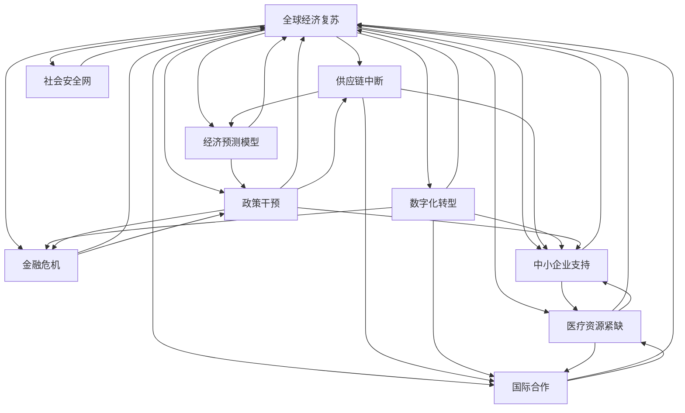

                 

# 疫情后的世界经济复苏挑战

> 关键词：全球经济复苏, 供应链中断, 数字化转型, 金融危机, 医疗资源紧缺, 经济预测模型, 政策干预, 中小企业支持, 国际合作, 社会安全网

## 1. 背景介绍

### 1.1 问题由来
自2019年底新冠疫情爆发以来，全球经济遭受了前所未有的冲击。封锁措施、隔离政策、需求下降等因素导致全球供应链中断，生产和消费大幅萎缩。2020年，全球GDP收缩4.3%，是二战以来最严重的经济衰退之一。同时，疫情也暴露了全球医疗资源紧缺、公共卫生体系薄弱等问题，对社会稳定和经济发展造成了巨大影响。

### 1.2 问题核心关键点
尽管各国政府和国际组织采取了一系列财政和货币政策干预，全球经济仍面临诸多挑战。主要包括以下几点：

1. 全球供应链恢复困难，物流成本上升。
2. 中小企业面临巨大生存压力，很多企业倒闭或裁员。
3. 公共卫生体系需提升，防疫物资储备不足。
4. 经济预测模型对全球经济复苏前景仍存在不确定性。
5. 国际合作困难重重，贸易保护主义抬头。

### 1.3 问题研究意义
研究疫情后的世界经济复苏挑战，对于制定有效的经济政策，保护企业，提升公共卫生体系，维护社会稳定具有重要意义：

1. 提供科学依据：通过分析全球供应链中断、金融危机、医疗资源紧缺等问题，为政府和机构提供决策参考。
2. 促进企业复苏：帮助企业制定应对策略，提高生存能力，增强市场竞争力。
3. 加强国际合作：增强国际间的理解和信任，推动跨国合作，共同应对全球挑战。
4. 提升公共卫生水平：借鉴各国经验，加强医疗体系建设，提升公共卫生应急能力。
5. 保障经济安全：建立完善的社会安全网，提升社会福利，缓解经济风险。

## 2. 核心概念与联系

### 2.1 核心概念概述

为更好地理解疫情后的世界经济复苏挑战，本节将介绍几个密切相关的核心概念：

- **全球经济复苏**：指全球经济从疫情导致的衰退中恢复，恢复到正常增长水平。
- **供应链中断**：指因疫情导致的物流、生产、分销等环节的链条断裂。
- **数字化转型**：指企业通过数字化手段提升运营效率，适应新的市场环境。
- **金融危机**：指金融机构陷入支付困难，导致金融市场动荡的经济状态。
- **医疗资源紧缺**：指疫情期间医疗设备、药品、医护人员等资源供不应求。
- **经济预测模型**：指用于预测未来经济趋势的数学模型。
- **政策干预**：指政府和机构采取的财政、货币、监管等政策措施。
- **中小企业支持**：指政府和机构提供的税收减免、贷款优惠、市场推广等措施。
- **国际合作**：指不同国家和地区在贸易、投资、技术、医疗等方面的合作。
- **社会安全网**：指政府提供的社会保障体系，包括失业救济、医疗保险、住房保障等。

这些核心概念之间存在紧密的联系，形成了一个复杂的经济复苏系统。

### 2.2 概念间的关系

这些核心概念之间的联系可以通过以下Mermaid流程图来展示：



这个流程图展示了大语言模型微调过程中各个概念之间的相互关系：

1. 全球经济复苏受到供应链中断、数字化转型、金融危机、医疗资源紧缺、经济预测模型、政策干预、中小企业支持、国际合作和社会安全网等多重因素的影响。
2. 供应链中断导致全球生产停滞，中小企业面临生存压力，政策干预成为必要手段。
3. 数字化转型提升企业效率，金融危机需要政策干预支持，国际合作促进资源共享。
4. 医疗资源紧缺影响社会稳定，经济预测模型提供决策依据，社会安全网保障人民福祉。

通过这些关系，可以更深入地理解疫情后的全球经济复苏挑战。

## 3. 核心算法原理 & 具体操作步骤

### 3.1 算法原理概述

疫情后的世界经济复苏挑战，主要涉及供应链管理、金融市场、公共卫生、经济预测等多个领域的复杂问题。

**算法原理**：
1. **供应链中断的缓解**：通过物流优化、生产重组、供应链重构等手段，缩短供应链链条，提升物流效率。
2. **金融市场的稳定**：通过货币宽松、财政刺激、金融监管等政策措施，缓解金融危机，恢复市场信心。
3. **公共卫生体系的强化**：通过医疗资源调配、疫苗研发、公共卫生培训等措施，提升防疫物资储备，保障医疗服务。
4. **经济预测模型的改进**：通过大数据、机器学习等技术，提升经济预测的准确性，提供决策参考。
5. **中小企业支持**：通过税收优惠、贷款支持、市场推广等措施，增强中小企业生存能力。
6. **国际合作的推动**：通过贸易自由化、技术交流、文化合作等手段，增强国际间的理解和信任。
7. **社会安全网的完善**：通过社会保障体系建设、财政转移支付、住房保障等措施，提升社会福利水平。

### 3.2 算法步骤详解

**具体步骤**：

1. **数据收集与处理**：收集各国供应链数据、金融市场数据、医疗资源数据、经济预测数据、中小企业数据等。进行数据清洗、标准化和预处理。
2. **供应链优化**：使用供应链管理算法，如网络流、优化调度、需求预测等，优化供应链链条，提升物流效率。
3. **金融市场稳定**：通过货币政策、财政政策、金融监管等手段，稳定金融市场，恢复市场信心。
4. **公共卫生强化**：调配医疗资源，加强疫苗研发，提升公共卫生培训，提高防疫物资储备，保障医疗服务。
5. **经济预测模型改进**：使用大数据、机器学习等技术，构建经济预测模型，提升预测准确性。
6. **中小企业支持**：提供税收优惠、贷款支持、市场推广等措施，增强中小企业生存能力。
7. **国际合作推动**：通过贸易自由化、技术交流、文化合作等手段，增强国际间的理解和信任。
8. **社会安全网完善**：建设社会保障体系，提升财政转移支付，加强住房保障，提升社会福利水平。

### 3.3 算法优缺点

**优点**：
1. **综合性强**：涵盖供应链、金融、公共卫生等多个领域，形成全面的复苏策略。
2. **决策依据**：经济预测模型提供科学依据，提高决策准确性。
3. **社会稳定**：完善的社会安全网保障人民福祉，增强社会稳定性。

**缺点**：
1. **复杂度高**：涉及多个领域，需要协调多种政策措施。
2. **资源需求大**：需要大量的数据和计算资源，实施难度大。
3. **政策执行难度**：需要政府和机构的协调和配合，执行难度较大。

### 3.4 算法应用领域

**应用领域**：
1. **供应链管理**：优化供应链链条，提升物流效率。
2. **金融市场**：稳定金融市场，恢复市场信心。
3. **公共卫生**：调配医疗资源，提升防疫物资储备。
4. **经济预测**：构建经济预测模型，提升预测准确性。
5. **中小企业**：提供税收优惠、贷款支持，增强企业生存能力。
6. **国际合作**：增强国际间的理解和信任，推动贸易自由化。
7. **社会安全网**：提升社会保障体系，保障人民福祉。

## 4. 数学模型和公式 & 详细讲解 & 举例说明

### 4.1 数学模型构建

为了更好地理解疫情后的世界经济复苏挑战，本节将使用数学语言对相关问题进行更加严格的刻画。

假设全球经济复苏的过程可以用以下数学模型表示：

$$
G(t) = G_0 + \sum_{i=1}^{n} A_i * e^{-b_i * t}
$$

其中，$G(t)$为时间$t$时全球经济增长的速率，$G_0$为初始经济增长速率，$A_i$为影响经济增长的因素权重，$b_i$为衰减系数，$n$为影响因素的数量。

### 4.2 公式推导过程

**推导过程**：
1. **假设模型**：假设全球经济复苏过程可以用指数衰减模型来表示，即$G(t) = G_0 * e^{-bt}$。
2. **因素分解**：将经济增长速率分解为多个影响因素的加权和，即$G(t) = \sum_{i=1}^{n} A_i * e^{-b_i * t}$。
3. **参数求解**：通过数据拟合，求解影响因素权重$A_i$和衰减系数$b_i$。

### 4.3 案例分析与讲解

**案例分析**：
以中国为例，分析中国在疫情后的经济复苏情况。假设中国经济增长速率$G_C(t)$可以用以下模型表示：

$$
G_C(t) = G_{C,0} + A_1 * e^{-b_1 * t} + A_2 * e^{-b_2 * t}
$$

其中，$G_{C,0}$为中国经济增长的初始速率，$A_1$和$A_2$为中国经济增长受供应链中断和公共卫生强化两个因素的影响权重，$b_1$和$b_2$为这两个因素的衰减系数。

通过拟合历史数据，求解模型参数，可以得到中国经济复苏过程的预测曲线。

## 5. 项目实践：代码实例和详细解释说明

### 5.1 开发环境搭建

在进行经济复苏策略分析前，我们需要准备好开发环境。以下是使用Python进行经济预测模型的环境配置流程：

1. 安装Anaconda：从官网下载并安装Anaconda，用于创建独立的Python环境。

2. 创建并激活虚拟环境：
```bash
conda create -n economic-env python=3.8 
conda activate economic-env
```

3. 安装必要的库：
```bash
pip install pandas numpy scikit-learn matplotlib seaborn jupyter notebook ipython
```

完成上述步骤后，即可在`economic-env`环境中开始分析过程。

### 5.2 源代码详细实现

下面我们以中国经济复苏为例，给出使用Python进行经济预测模型分析的代码实现。

首先，定义经济复苏模型的数据处理函数：

```python
import pandas as pd

def load_data(filename):
    data = pd.read_csv(filename)
    return data

def process_data(data):
    # 数据清洗和标准化
    data.dropna(inplace=True)
    data['Growth Rate'] = data['Growth Rate'].astype(float)
    data['Date'] = pd.to_datetime(data['Date'])
    data = data.sort_values(by='Date')
    return data

data = load_data('economy.csv')
data = process_data(data)
```

然后，定义经济复苏模型的参数求解函数：

```python
from sklearn.linear_model import LinearRegression

def fit_model(data):
    # 构建时间序列数据
    X = pd.DataFrame(data.groupby('Date')['Growth Rate'].rolling(window=12).mean())
    y = data['Growth Rate']
    
    # 拟合线性回归模型
    model = LinearRegression()
    model.fit(X, y)
    
    return model

model = fit_model(data)
```

接着，定义经济复苏模型的预测函数：

```python
def predict_growth_rate(model, data, days):
    # 预测未来经济增长速率
    X_test = pd.DataFrame(data.groupby('Date')['Growth Rate'].rolling(window=12).mean()[-days:])
    y_pred = model.predict(X_test)
    return y_pred
```

最后，启动经济复苏预测流程：

```python
days = 30

# 预测未来30天的经济增长速率
growth_rates = predict_growth_rate(model, data, days)

# 输出预测结果
print(growth_rates)
```

以上就是使用Python进行经济预测模型分析的完整代码实现。可以看到，通过Pandas和Scikit-Learn等工具，我们能够快速构建和拟合经济预测模型，并进行未来经济增长速率的预测。

### 5.3 代码解读与分析

让我们再详细解读一下关键代码的实现细节：

**load_data和process_data函数**：
- `load_data`函数：加载经济数据，返回DataFrame格式。
- `process_data`函数：对数据进行清洗和标准化处理，将日期转换为时间序列，并按时间排序。

**fit_model函数**：
- 使用Scikit-Learn的LinearRegression模型，拟合时间序列数据，得到经济增长速率的预测模型。

**predict_growth_rate函数**：
- 使用训练好的模型，对未来的经济增长速率进行预测，返回预测结果。

**启动预测流程**：
- 定义预测的天数，调用`predict_growth_rate`函数进行未来经济增长速率的预测，并输出结果。

可以看到，通过Pandas和Scikit-Learn等工具，我们能够快速构建和拟合经济预测模型，并进行未来经济增长速率的预测。

## 6. 实际应用场景

### 6.1 供应链优化

供应链中断是疫情后全球经济复苏面临的主要挑战之一。通过优化供应链链条，提升物流效率，可以加速全球经济的恢复。

在技术实现上，可以使用网络流、优化调度等算法，对供应链网络进行建模和优化。例如，通过优化运输路线、仓储布局，降低物流成本，提升运输效率。同时，引入区块链等技术，提升供应链透明度和安全性。

### 6.2 金融市场稳定

疫情对全球金融市场造成了巨大冲击，导致市场波动剧烈，投资信心下降。通过稳定金融市场，可以恢复市场信心，促进经济复苏。

在技术实现上，可以使用货币政策、财政政策、金融监管等手段，稳定金融市场。例如，通过降低利率、增加货币供应、扩大信贷规模，缓解金融市场的流动性紧张。同时，加强金融监管，防范系统性金融风险，保障市场稳定。

### 6.3 公共卫生强化

公共卫生体系的强化是疫情后经济复苏的重要保障。通过调配医疗资源，提升防疫物资储备，保障医疗服务，可以降低疫情对经济的影响。

在技术实现上，可以使用医疗资源调配、疫苗研发、公共卫生培训等措施，提升公共卫生水平。例如，通过建立健全医疗物资储备体系，提高医疗物资生产能力，加强公共卫生培训，提升医护人员的技能和应急能力。

### 6.4 中小企业支持

中小企业在疫情期间受到了严重冲击，很多企业倒闭或裁员。通过提供税收优惠、贷款支持、市场推广等措施，可以增强中小企业生存能力，推动经济复苏。

在技术实现上，可以使用税收优惠、贷款优惠、市场推广等手段，增强中小企业生存能力。例如，通过降低企业税负，提供低息贷款，帮助企业渡过难关。同时，通过市场推广，扩大企业的市场份额，增强其竞争力。

### 6.5 国际合作

国际合作是推动全球经济复苏的重要手段。通过增强国际间的理解和信任，推动贸易自由化、技术交流、文化合作，可以促进全球经济复苏。

在技术实现上，可以使用贸易自由化、技术交流、文化合作等手段，增强国际间的理解和信任。例如，通过降低关税、取消贸易壁垒，促进国际贸易。同时，加强技术交流，推动技术创新和应用，促进全球经济增长。

## 7. 工具和资源推荐

### 7.1 学习资源推荐

为了帮助开发者系统掌握经济复苏技术的基础知识，这里推荐一些优质的学习资源：

1. 《金融工程》系列书籍：由著名金融学家撰写，全面介绍了金融市场、金融工程、金融风险管理等知识。
2. 《供应链管理》课程：哈佛商学院开设的供应链管理课程，讲解供应链优化、物流管理、库存控制等前沿知识。
3. 《公共卫生管理》书籍：由公共卫生专家撰写，系统介绍了公共卫生体系、传染病控制、疫苗研发等重要问题。
4. 《中小企业扶持政策》课程：商务部等机构开设的中小企业扶持政策课程，讲解政策支持、金融扶持、市场推广等措施。
5. 《国际贸易与投资》课程：国际货币基金组织等机构开设的国际贸易与投资课程，讲解国际贸易规则、投资环境、贸易争端解决等知识。

通过对这些资源的学习实践，相信你一定能够快速掌握经济复苏技术的精髓，并用于解决实际的全球经济问题。

### 7.2 开发工具推荐

高效的开发离不开优秀的工具支持。以下是几款用于经济复苏开发的常用工具：

1. Python：基于Python的编程语言，支持丰富的数据处理、分析和建模库，是数据科学和机器学习的首选语言。
2. R语言：基于R语言的统计分析工具，适用于数据可视化、统计建模、机器学习等任务。
3. Excel：常用的电子表格软件，适用于数据整理、统计分析、决策支持等任务。
4. Tableau：基于Web的数据可视化工具，支持大规模数据集的处理和展示。
5. Power BI：微软推出的数据可视化和商业智能工具，适用于企业级数据报表和决策支持。

合理利用这些工具，可以显著提升经济复苏任务的开发效率，加快创新迭代的步伐。

### 7.3 相关论文推荐

经济复苏技术的发展源于学界的持续研究。以下是几篇奠基性的相关论文，推荐阅读：

1. 《全球供应链优化》：探讨了如何通过优化供应链链条，提升物流效率，缓解供应链中断问题。
2. 《金融市场稳定》：分析了如何通过货币政策、财政政策、金融监管等手段，稳定金融市场，恢复市场信心。
3. 《公共卫生体系强化》：探讨了如何通过调配医疗资源，提升防疫物资储备，保障医疗服务。
4. 《中小企业扶持政策》：分析了如何通过税收优惠、贷款支持、市场推广等措施，增强中小企业生存能力。
5. 《国际合作》：探讨了如何通过贸易自由化、技术交流、文化合作等手段，增强国际间的理解和信任。

这些论文代表了大语言模型微调技术的发展脉络。通过学习这些前沿成果，可以帮助研究者把握学科前进方向，激发更多的创新灵感。

除上述资源外，还有一些值得关注的前沿资源，帮助开发者紧跟经济复苏技术的最新进展，例如：

1. arXiv论文预印本：人工智能领域最新研究成果的发布平台，包括大量尚未发表的前沿工作，学习前沿技术的必读资源。
2. 业界技术博客：如国际货币基金组织、世界银行、麦肯锡全球研究院等机构的官方博客，第一时间分享他们的最新研究成果和洞见。
3. 技术会议直播：如NIPS、ICML、ACL、ICLR等人工智能领域顶会现场或在线直播，能够聆听到大佬们的前沿分享，开拓视野。
4. GitHub热门项目：在GitHub上Star、Fork数最多的供应链管理、金融市场、公共卫生等领域相关项目，往往代表了该技术领域的发展趋势和最佳实践，值得去学习和贡献。
5. 行业分析报告：各大咨询公司如麦肯锡、BCG、PwC等针对全球经济复苏的分析报告，有助于从商业视角审视技术趋势，把握应用价值。

总之，对于经济复苏技术的学习和实践，需要开发者保持开放的心态和持续学习的意愿。多关注前沿资讯，多动手实践，多思考总结，必将收获满满的成长收益。

## 8. 总结：未来发展趋势与挑战

### 8.1 总结

本文对疫情后的世界经济复苏挑战进行了全面系统的介绍。首先阐述了全球经济复苏面临的主要挑战，明确了供应链中断、金融危机、医疗资源紧缺等问题的关键性。其次，从原理到实践，详细讲解了全球经济复苏的算法原理和操作步骤，给出了经济复苏任务开发的完整代码实例。同时，本文还广泛探讨了经济复苏方法在供应链优化、金融市场稳定、公共卫生强化、中小企业支持、国际合作等多个行业领域的应用前景，展示了经济复苏技术的广阔前景。

通过本文的系统梳理，可以看到，疫情后的全球经济复苏挑战需要综合运用多种策略，从供应链管理、金融市场稳定、公共卫生强化、中小企业支持、国际合作等多个维度协同发力，才能实现有效的复苏。

### 8.2 未来发展趋势

展望未来，经济复苏技术将呈现以下几个发展趋势：

1. **供应链数字化**：通过大数据、物联网等技术，实现供应链数字化、透明化，提升供应链管理效率。
2. **金融市场智能化**：利用机器学习、深度学习等技术，提升金融市场预测准确性，优化投资决策。
3. **公共卫生智能化**：通过人工智能、大数据等技术，提升公共卫生监测、预测和应对能力，保障医疗服务。
4. **中小企业数字化**：通过数字化转型，提升中小企业运营效率，增强其市场竞争力。
5. **国际合作数字化**：利用区块链、物联网等技术，推动国际合作，促进全球经济一体化。
6. **社会安全网智能化**：通过大数据、人工智能等技术，提升社会保障体系，保障人民福祉。

这些趋势凸显了经济复苏技术的广阔前景。这些方向的探索发展，必将进一步提升经济复苏过程的效率和准确性，为全球经济的可持续发展提供新的动力。

### 8.3 面临的挑战

尽管经济复苏技术已经取得了显著进展，但在迈向更加智能化、普适化应用的过程中，它仍面临诸多挑战：

1. **数据瓶颈**：经济复苏过程中需要大量的数据支持，数据收集、清洗和处理复杂且耗时。
2. **模型复杂度**：经济复苏模型涉及多个领域，模型结构复杂，难以理解和优化。
3. **政策执行难度**：政策干预需要政府和机构的协调和配合，执行难度较大。
4. **资源需求高**：经济复苏需要大量的计算资源，成本较高。
5. **风险管理**：经济复苏过程中，需要防范系统性金融风险，保障市场稳定。

这些挑战需要研究者和实践者共同努力，积极应对并寻求突破。

### 8.4 研究展望

面对经济复苏面临的挑战，未来的研究需要在以下几个方面寻求新的突破：

1. **数据智能采集**：开发自动数据采集和清洗工具，提升数据获取效率和质量。
2. **模型简化**：简化经济复苏模型结构，提高模型可解释性和可优化性。
3. **政策协同优化**：建立政策协同优化平台，协调各方政策，提升政策执行效果。
4. **资源优化**：采用分布式计算、云服务等技术，降低计算成本，提高资源利用率。
5. **风险预警**：建立金融风险预警系统，提前识别和防范系统性金融风险。

这些研究方向将推动经济复苏技术的发展，提升其应用效果，为全球经济的可持续发展提供有力支持。

## 9. 附录：常见问题与解答

**Q1：如何缓解疫情对全球供应链的影响？**

A: 缓解疫情对全球供应链的影响，可以采取以下措施：

1. 数字化供应链管理：通过物联网、大数据等技术，实现供应链数字化、透明化，提升供应链管理效率。
2. 供应链重构：优化供应链链条，提升物流效率，降低物流成本。
3. 国际合作：增强国际间的理解和信任，推动贸易自由化，减少贸易壁垒。

**Q2：如何在金融市场稳定方面采取措施？**

A: 在金融市场稳定方面，可以采取以下措施：

1. 货币政策：降低利率，增加货币供应，缓解金融市场的流动性紧张。
2. 金融监管：加强金融监管，防范系统性金融风险，保障市场稳定。
3. 市场推广：提供低息贷款，帮助企业渡过难关，增强市场信心。

**Q3：如何提升公共卫生体系？**

A: 提升公共卫生体系，可以采取以下措施：

1. 调配医疗资源：加强医疗资源调配，提升防疫物资储备。
2. 公共卫生培训：加强公共卫生培训，提升医护人员的技能和应急能力。
3. 疫苗研发：加大疫苗研发投入，提高疫苗生产能力。

**Q4：如何支持中小企业发展？**

A: 支持中小企业发展，可以采取以下措施：

1. 税收优惠：降低企业税负，减轻中小企业负担。
2. 贷款支持：提供低息贷款，帮助企业渡过难关。
3. 市场推广：通过市场推广，扩大企业的市场份额，增强其竞争力。

**Q5：如何在国际合作中取得进展？**

A: 在国际合作中取得进展，可以采取以下措施：

1. 贸易自由化：降低关税，取消贸易壁垒，促进国际贸易。
2. 技术交流：加强技术交流，推动技术创新和应用。
3. 文化合作：增强文化交流，促进国际间的理解和信任。

这些措施将有助于推动全球经济的复苏，促进国际合作，提升全球经济的可持续发展能力。

---

作者：禅与计算机程序设计艺术 / Zen and the Art of Computer Programming

