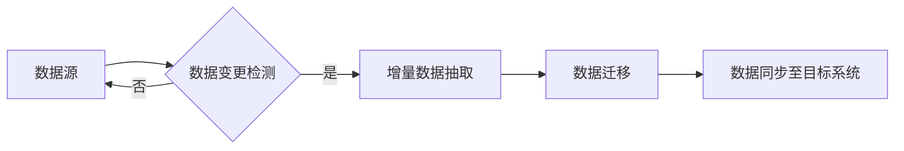

# Sqoop增量导入原理与代码实例讲解

> 关键词：Sqoop, 增量导入, Hadoop, 数据迁移, 分布式计算, 数据同步

## 1. 背景介绍

随着大数据时代的到来，数据迁移和同步成为了数据管理中的重要环节。Sqoop作为Apache Hadoop生态系统中的一个关键工具，提供了高效的数据迁移功能，特别是其增量导入特性，使得数据同步变得更加高效和可靠。本文将深入探讨Sqoop增量导入的原理，并通过代码实例进行详细讲解。

### 1.1 问题的由来

在企业级应用中，数据通常分散存储在不同的数据源中，如关系型数据库、NoSQL数据库、HDFS等。随着业务的发展，这些数据源之间的数据同步需求日益增长。传统的全量同步方式在数据量大、更新频繁的情况下，效率低下且不便于管理。因此，增量导入成为了数据迁移和同步的首选方案。

### 1.2 研究现状

Sqoop作为Hadoop生态系统的一部分，提供了从关系型数据库到HDFS的增量导入功能。它通过识别数据变更并仅同步变更的数据，大大减少了数据迁移的时间和工作量。目前，Sqoop的增量导入功能支持多种数据库，如MySQL、Oracle、PostgreSQL等。

### 1.3 研究意义

研究Sqoop增量导入的原理和实现，对于以下方面具有重要意义：

- 提高数据迁移效率，减少资源消耗。
- 确保数据同步的准确性和可靠性。
- 降低数据管理成本，提高运维效率。

### 1.4 本文结构

本文将按照以下结构进行展开：

- 第2部分，介绍增量导入的核心概念和流程。
- 第3部分，详细解析增量导入的原理和操作步骤。
- 第4部分，通过代码实例讲解Sqoop增量导入的实现。
- 第5部分，探讨增量导入在实际应用场景中的使用。
- 第6部分，展望增量导入技术的未来发展趋势。
- 第7部分，推荐相关学习资源和开发工具。
- 第8部分，总结研究成果，展望未来挑战和机遇。
- 第9部分，提供常见问题的解答。

## 2. 核心概念与联系

### 2.1 核心概念

- **增量导入**：仅同步自上次同步以来发生变化的数据。
- **变更数据识别**：识别数据源中发生的变化，如插入、更新、删除等。
- **数据同步**：将变更数据从数据源迁移到目标存储系统。

### 2.2 架构流程图

以下是增量导入的Mermaid流程图：



### 2.3 关联概念

- **Sqoop**：Apache Hadoop生态系统中的数据迁移工具。
- **Hadoop**：分布式计算框架，用于存储和处理大规模数据。
- **关系型数据库**：如MySQL、Oracle等，常用的数据源。
- **NoSQL数据库**：如MongoDB、Cassandra等，也可以作为数据源。

## 3. 核心算法原理 & 具体操作步骤

### 3.1 算法原理概述

Sqoop增量导入的核心原理是检测数据源中的数据变更，并仅同步这些变更数据到目标系统。通常，数据变更包括插入、更新、删除等操作。

### 3.2 算法步骤详解

1. **数据变更检测**：通过比较上次同步时间和当前时间，判断数据源中是否存在变更。
2. **增量数据抽取**：根据变更类型，抽取对应的数据变更记录。
3. **数据迁移**：将抽取的增量数据迁移到目标系统。
4. **数据同步至目标系统**：将迁移的数据同步到目标系统，如HDFS。

### 3.3 算法优缺点

#### 优点：

- **高效**：仅同步变更数据，减少数据迁移量。
- **可靠**：通过检测数据变更，确保数据一致性。
- **灵活**：支持多种数据库和数据源。

#### 缺点：

- **复杂**：需要配置复杂的增量逻辑。
- **性能**：数据变更检测可能影响性能。
- **数据丢失**：在增量同步过程中，可能存在数据丢失的风险。

### 3.4 算法应用领域

Sqoop增量导入适用于以下场景：

- **数据仓库**：将数据库数据同步到数据仓库进行分析。
- **大数据平台**：将数据同步到Hadoop生态系统进行分布式处理。
- **数据同步**：实现不同数据源之间的数据同步。

## 4. 数学模型和公式 & 详细讲解 & 举例说明

### 4.1 数学模型构建

增量数据量 \$ I \$ 可以用以下公式表示：

\$$ I = C - S \$$

其中，\$ C \$ 表示变更数据量，\$ S \$ 表示上次同步后的数据量。

### 4.2 公式推导过程

\$$ C = I_{\text{insert}} + I_{\text{update}} + I_{\text{delete}} \$$
\$$ S = I_{\text{last}} + O_{\text{insert}} + O_{\text{update}} \$$
\$$ I = C - S \$$

### 4.3 案例分析与讲解

假设数据库中有1000条记录，其中插入了100条，更新了50条，删除了20条。上次同步后，有200条记录被插入，100条记录被更新。

\$$ C = 100 + 50 + 20 = 170 \$$
\$$ S = 200 + 100 = 300 \$$
\$$ I = 170 - 300 = -130 \$$

这里，增量数据量 \$ I \$ 为负值，表示需要删除130条记录。

## 5. 项目实践：代码实例和详细解释说明

### 5.1 开发环境搭建

为了演示Sqoop增量导入，需要以下环境：

- Hadoop集群
- 数据库（如MySQL）
- Sqoop安装包

### 5.2 源代码详细实现

以下是一个简单的Sqoop增量导入示例：

```sql
CREATE TABLE mysql_table (
    id INT,
    name VARCHAR(100)
);

-- 创建HDFS目录
hadoop fs -mkdir -p /user/hadoop/sqoop/mysql_table

-- Sqoop导入命令
sqoop import --connect jdbc:mysql://mysql_host:3306/mysql_db --username username --password password \
--table mysql_table --target-dir /user/hadoop/sqoop/mysql_table \
--incremental append --check-column id --last-value 100
```

### 5.3 代码解读与分析

- `--connect`：指定数据库连接信息。
- `--username` 和 `--password`：指定数据库用户名和密码。
- `--table`：指定导入的表名。
- `--target-dir`：指定HDFS目标目录。
- `--incremental append`：启用增量导入，并追加到目标目录。
- `--check-column`：指定用于增量检测的列。
- `--last-value`：指定增量检测的起始值。

### 5.4 运行结果展示

执行上述命令后，Sqoop将只同步自上次同步以来ID大于100的记录。

## 6. 实际应用场景

### 6.1 数据仓库

将数据库中的销售数据增量同步到数据仓库，以便进行实时分析。

### 6.2 大数据平台

将社交媒体数据增量同步到Hadoop平台，以便进行实时处理和分析。

### 6.3 数据同步

实现不同数据源之间的数据同步，如将客户关系管理(CRM)系统的数据同步到财务系统。

## 7. 工具和资源推荐

### 7.1 学习资源推荐

- Apache Sqoop官方文档
- Hadoop官方文档
- 数据迁移和同步最佳实践

### 7.2 开发工具推荐

- Sqoop
- Hadoop
- MySQL Workbench

### 7.3 相关论文推荐

- Apache Sqoop用户指南
- Hadoop生态系统介绍
- 分布式数据迁移技术

## 8. 总结：未来发展趋势与挑战

### 8.1 研究成果总结

本文深入探讨了Sqoop增量导入的原理和实现，并通过代码实例进行了详细讲解。Sqoop增量导入作为一种高效的数据迁移和同步方法，在数据仓库、大数据平台和数据同步等领域有着广泛的应用。

### 8.2 未来发展趋势

- 更多的增量检测策略
- 更高效的数据迁移算法
- 与更多数据源和目标系统的兼容性

### 8.3 面临的挑战

- 复杂的增量逻辑
- 数据迁移性能瓶颈
- 数据一致性和安全性

### 8.4 研究展望

随着大数据技术的不断发展，Sqoop增量导入技术将在以下方面取得突破：

- 更高效的数据迁移算法
- 更强的数据一致性保证
- 更广泛的数据源和目标系统支持

## 9. 附录：常见问题与解答

**Q1：Sqoop增量导入支持哪些数据库？**

A: Sqoop支持多种数据库，如MySQL、Oracle、PostgreSQL、SQL Server等。

**Q2：Sqoop增量导入如何处理数据冲突？**

A: Sqoop增量导入会根据指定的增量检测列来识别数据变更，并同步变更数据。如果出现数据冲突，可以在 Sqoop 的配置中设置相应的策略来处理。

**Q3：Sqoop增量导入的性能如何？**

A: Sqoop增量导入的性能取决于数据量、网络带宽、硬件资源等因素。一般来说，Sqoop增量导入的性能比较高效，尤其是在处理大量数据时。

**Q4：Sqoop增量导入是否安全？**

A: Sqoop提供了数据加密和访问控制等安全特性，以确保数据在迁移过程中的安全性。

**Q5：如何优化Sqoop增量导入的性能？**

A: 可以通过以下方式优化Sqoop增量导入的性能：

- 使用合适的增量检测策略。
- 调整Sqoop的配置参数。
- 使用高效的数据库连接和查询。
- 增加硬件资源。

作者：禅与计算机程序设计艺术 / Zen and the Art of Computer Programming