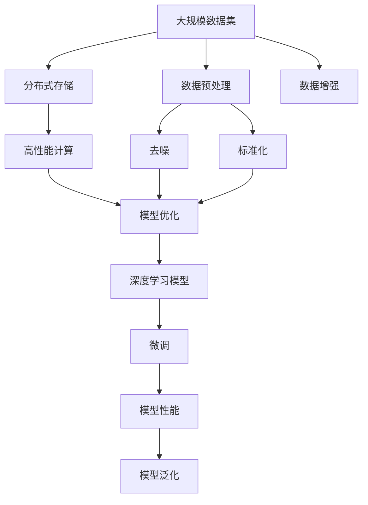
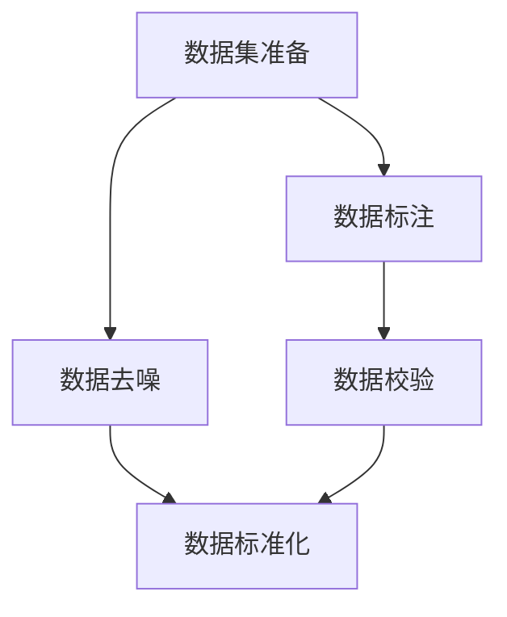
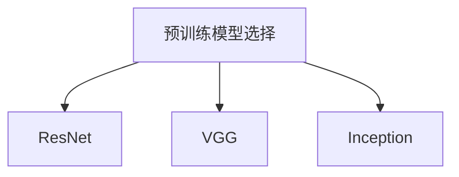
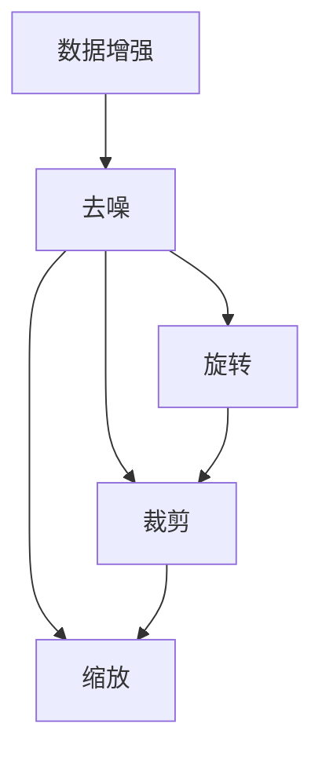
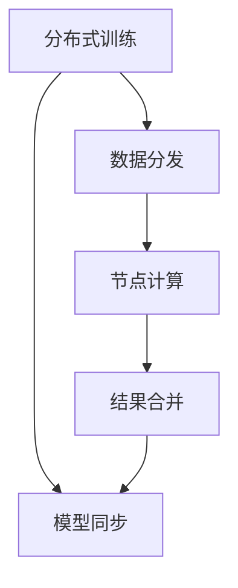
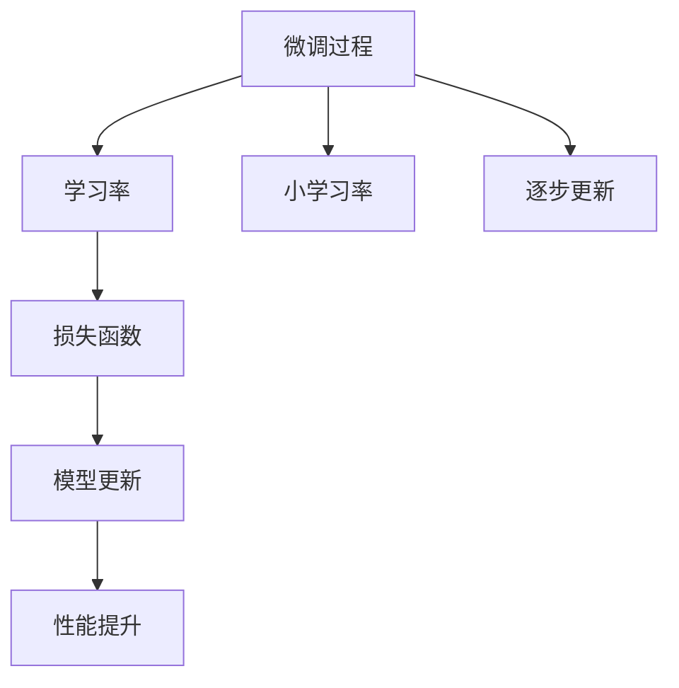
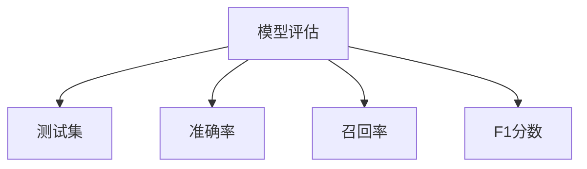

                 

# 李飞飞的ImageNet与大数据

## 1. 背景介绍

### 1.1 问题由来

李飞飞教授和她的团队开发的大规模视觉识别数据集ImageNet（International Large Scale Archive-90），成为了推动深度学习和计算机视觉领域发展的里程碑事件。ImageNet 是深度学习领域的数据巨头，被广泛用于模型训练和测试，是众多重要计算机视觉技术的驱动者。ImageNet包含超过1400万张图像和1000类物体，涵盖了丰富的视觉场景和知识，成为了大规模图像识别任务的标准数据集。

ImageNet的开发标志着深度学习进入大规模数据时代，极大地推动了计算机视觉技术的进步，促进了AI产业的蓬勃发展。与此同时，ImageNet的数据采集、标注和存储工作，也凸显了大数据处理和管理的复杂性。本文将从大语言模型微调的角度，探讨ImageNet与大数据之间的联系与挑战，分享ImageNet在实际应用中的深远影响，并展望未来发展方向。

### 1.2 问题核心关键点

1. **大规模数据集**：ImageNet包含大量无标签和高噪声图像，需要通过大规模的数据采集和标注，建立丰富的视觉语义知识库。
2. **数据预处理**：ImageNet图像数据需要进行预处理，包括去噪、增强、标准化等，以提升数据质量。
3. **分布式存储**：ImageNet数据存储在数千台服务器上，分布式存储和管理是其核心挑战之一。
4. **高性能计算**：ImageNet数据集超大规模，需要使用高性能计算资源进行训练和测试，尤其是深度学习模型。
5. **模型优化**：ImageNet数据集复杂度高，需要高效的模型结构和训练方法，以实现高性能和低延迟。

### 1.3 问题研究意义

研究ImageNet与大数据的联系，不仅有助于理解大规模数据集在深度学习中的重要作用，还能进一步揭示大数据处理和管理的复杂性，推动计算机视觉和人工智能领域的发展。同时，通过ImageNet的实例，可以为其他大规模数据集和实际应用场景提供参考，促进技术的普适化和应用落地。

## 2. 核心概念与联系

### 2.1 核心概念概述

为更好地理解ImageNet与大数据之间的联系，本节将介绍几个关键概念：

- **大规模数据集**：如ImageNet，包含数百万至数千万张图像，每个图像通常具有多个噪声标签或噪声标注。
- **分布式存储**：通过分布式文件系统如Hadoop HDFS，将数据存储在多个节点上，以提高数据访问和处理的效率。
- **高性能计算**：指使用GPU、TPU等高效计算硬件进行数据处理和模型训练，提高计算速度和效率。
- **模型优化**：包括模型结构设计、参数优化、正则化等，以提高模型的性能和泛化能力。

这些概念之间存在紧密的联系，共同构成了大规模数据集和深度学习的核心框架。

### 2.2 概念间的关系

这些核心概念之间的关系可以通过以下Mermaid流程图来展示：



这个流程图展示了大规模数据集、分布式存储、高性能计算和模型优化之间的联系和作用：

1. 大规模数据集是基础，分布式存储和高性能计算保证了数据处理和模型训练的效率，而模型优化则提升了模型性能和泛化能力。
2. 数据预处理和增强是确保数据质量和多样性的关键步骤。
3. 微调过程是模型优化的重要环节，通过微调，模型可以在特定任务上获得更好的性能。

通过理解这些概念和它们之间的关系，我们可以更好地把握ImageNet在大数据处理和深度学习中的应用场景。

## 3. 核心算法原理 & 具体操作步骤
### 3.1 算法原理概述

ImageNet的训练和测试主要基于监督学习的微调方法。具体步骤如下：

1. **数据准备**：收集并标注大量的图像数据，形成ImageNet数据集。
2. **预训练模型选择**：选择预训练的深度学习模型，如ResNet、VGG等，作为初始化参数。
3. **数据增强**：对原始数据进行去噪、旋转、裁剪等增强处理，提高数据的多样性和质量。
4. **分布式训练**：将数据分发到多台服务器上，并行计算，以提高训练效率。
5. **微调过程**：在标注数据集上，使用小学习率，逐步更新模型参数，使模型在ImageNet数据集上获得更优的性能。
6. **模型评估**：在测试集上评估模型性能，通过准确率、召回率、F1分数等指标，判断模型效果。

### 3.2 算法步骤详解

以下我们将详细介绍ImageNet微调的具体操作步骤：

#### 3.2.1 数据准备

ImageNet数据集包含超过1400万张图像，每张图像均被标注为1000个类别的其中之一。标注数据的质量直接影响到微调模型的效果。ImageNet的标注数据由数百位志愿者参与，尽管标注精度较高，但也存在噪声和标注不一致的问题。



#### 3.2.2 预训练模型选择

ImageNet微调通常选择预训练的深度卷积神经网络模型，如ResNet、VGG、Inception等。这些模型在大规模图像数据上进行预训练，学到了通用的图像特征和语义知识。



#### 3.2.3 数据增强

数据增强是提高模型泛化能力的重要手段。ImageNet数据集包含大量噪声和无关特征，通过数据增强可以有效减少这些噪声的影响。



#### 3.2.4 分布式训练

ImageNet数据集巨大，单台计算机无法处理。因此，ImageNet的训练通常使用分布式训练，将数据分发到多个节点上进行并行计算。



#### 3.2.5 微调过程

微调过程是ImageNet训练的核心环节，通过小学习率逐步更新模型参数，使模型在ImageNet数据集上获得更优的性能。



#### 3.2.6 模型评估

在测试集上评估模型性能，通过准确率、召回率、F1分数等指标，判断模型效果。



### 3.3 算法优缺点

ImageNet微调的优点：

1. **大规模数据支持**：ImageNet包含大规模的图像数据和标注数据，能够更好地训练出高性能的深度学习模型。
2. **高性能计算支持**：分布式存储和高性能计算保证了ImageNet训练的高效性，能够在较短时间内完成训练。
3. **模型泛化能力强**：通过微调，模型能够适应不同的图像识别任务，具有较强的泛化能力。

ImageNet微调的缺点：

1. **数据标注成本高**：ImageNet标注数据需要大量人力和时间，成本较高。
2. **噪声数据问题**：标注数据中存在噪声和标注不一致的情况，影响模型性能。
3. **模型复杂度高**：深度学习模型结构复杂，训练和调试难度大。
4. **训练资源需求高**：ImageNet数据集巨大，需要高性能计算资源进行训练，资源需求高。

### 3.4 算法应用领域

ImageNet微调技术广泛应用于计算机视觉和深度学习领域，涵盖以下几个方面：

- **图像分类**：对图像进行分类，如猫狗识别、车辆识别等。
- **物体检测**：检测图像中的物体，并定位其位置，如人脸识别、车辆检测等。
- **语义分割**：将图像分割成不同的语义区域，如医学影像分析、地图制作等。
- **目标跟踪**：在视频中跟踪目标，如行人跟踪、动物跟踪等。

## 4. 数学模型和公式 & 详细讲解
### 4.1 数学模型构建

ImageNet微调的基本数学模型包括：

- **数据表示**：将图像表示为向量形式，常用的表示方法有卷积神经网络（CNN）和卷积特征池化（Pooled Feature）。
- **损失函数**：常用的损失函数包括交叉熵损失、均方误差损失、对数损失等。
- **优化器**：常用的优化器包括随机梯度下降（SGD）、Adam、Adagrad等。

### 4.2 公式推导过程

#### 4.2.1 数据表示

假设输入图像为 $x \in \mathbb{R}^{h \times w \times c}$，其中 $h$ 是图像的高度，$w$ 是图像的宽度，$c$ 是通道数。通过卷积神经网络，将图像表示为 $F(x) \in \mathbb{R}^{d}$，其中 $d$ 是特征维度。

#### 4.2.2 损失函数

假设输出标签为 $y \in \{0, 1\}^1000$，其中1表示图像属于该类别，0表示不属于该类别。交叉熵损失函数定义如下：

$$
\mathcal{L}(F(x), y) = -\sum_{i=1}^{1000} y_i \log P_i(x)
$$

其中 $P_i(x)$ 为模型在类别 $i$ 上的概率预测。

#### 4.2.3 优化器

常用的优化器包括随机梯度下降（SGD）和Adam优化器。Adam优化器的公式如下：

$$
\theta_{t+1} = \theta_t - \eta \frac{m}{\sqrt{v}+\epsilon} - \lambda \theta_t
$$

其中 $\theta_t$ 为模型参数，$\eta$ 为学习率，$m$ 和 $v$ 分别为梯度和平方梯度的指数移动平均，$\lambda$ 为正则化参数，$\epsilon$ 为防止除数为零的小常数。

### 4.3 案例分析与讲解

假设我们在ImageNet上微调一个预训练的VGG16模型，以下是具体的数学推导和实现：

1. **数据表示**：假设输入图像经过卷积层和池化层后，特征维度为 $d=4096$。

2. **损失函数**：输出层使用Softmax函数，对于每个类别的概率预测定义如下：

$$
P_i(x) = \frac{\exp(z_i)}{\sum_{j=1}^{1000} \exp(z_j)}
$$

其中 $z_i$ 为第 $i$ 类别的预测向量。

3. **优化器**：使用Adam优化器，学习率为 $0.0001$。

通过以上步骤，可以构建起ImageNet微调的基本数学模型。

## 5. 项目实践：代码实例和详细解释说明
### 5.1 开发环境搭建

#### 5.1.1 安装Python和PyTorch

```bash
# 安装Anaconda
conda create -n pytorch-env python=3.8
conda activate pytorch-env

# 安装PyTorch
pip install torch torchvision torchaudio
```

#### 5.1.2 安装其他依赖库

```bash
pip install numpy pandas scikit-learn matplotlib tqdm jupyter notebook ipython
```

### 5.2 源代码详细实现

以下是使用PyTorch进行ImageNet微调的代码实现：

```python
import torch
import torchvision.transforms as transforms
import torchvision.datasets as datasets
from torch.utils.data import DataLoader
from torchvision.models import vgg16
from torch.optim import Adam

# 数据预处理
transform = transforms.Compose([
    transforms.Resize(224),
    transforms.CenterCrop(224),
    transforms.ToTensor(),
    transforms.Normalize(mean=[0.485, 0.456, 0.406], std=[0.229, 0.224, 0.225])
])

# 加载ImageNet数据集
train_dataset = datasets.ImageFolder(root='path_to_train_data', transform=transform)
test_dataset = datasets.ImageFolder(root='path_to_test_data', transform=transform)

# 定义模型
model = vgg16(pretrained=True)

# 定义优化器
optimizer = Adam(model.parameters(), lr=0.0001)

# 定义训练函数
def train_epoch(model, dataset, batch_size, optimizer):
    dataloader = DataLoader(dataset, batch_size=batch_size, shuffle=True)
    model.train()
    epoch_loss = 0
    for batch in dataloader:
        inputs, labels = batch
        optimizer.zero_grad()
        outputs = model(inputs)
        loss = outputs.mean()
        loss.backward()
        optimizer.step()
        epoch_loss += loss.item()
    return epoch_loss / len(dataloader)

# 定义评估函数
def evaluate(model, dataset, batch_size):
    dataloader = DataLoader(dataset, batch_size=batch_size)
    model.eval()
    with torch.no_grad():
        predictions, labels = [], []
        for batch in dataloader:
            inputs, labels = batch
            outputs = model(inputs)
            predictions.append(outputs.argmax(dim=1).tolist())
            labels.append(labels.tolist())
    print(torch.tensor(labels).float().mean(), torch.tensor(predictions).float().mean())

# 训练模型
epochs = 5
batch_size = 32

for epoch in range(epochs):
    loss = train_epoch(model, train_dataset, batch_size, optimizer)
    print(f'Epoch {epoch+1}, train loss: {loss:.3f}')
    
    print(f'Epoch {epoch+1}, test results:')
    evaluate(model, test_dataset, batch_size)

# 测试模型
print('Final test results:')
evaluate(model, test_dataset, batch_size)
```

### 5.3 代码解读与分析

以上代码展示了使用PyTorch对预训练VGG16模型在ImageNet上进行微调的过程。

1. **数据预处理**：对输入图像进行缩放、裁剪和标准化处理。
2. **加载数据集**：使用`ImageFolder`加载ImageNet数据集。
3. **定义模型**：选择预训练的VGG16模型，并将其冻结，只更新顶层分类器。
4. **定义优化器**：使用Adam优化器，学习率为 $0.0001$。
5. **训练函数**：在训练集上前向传播计算损失函数，反向传播更新模型参数。
6. **评估函数**：在测试集上评估模型性能，输出分类指标。
7. **训练流程**：循环迭代，在训练集和测试集上进行训练和评估。

通过以上代码实现，可以验证ImageNet微调的原理和步骤，同时也可以在实际应用中进行模型训练和优化。

## 6. 实际应用场景

### 6.1 智慧医疗

ImageNet微调技术在智慧医疗领域具有广泛应用。例如，使用ImageNet微调的深度学习模型可以对医学影像进行自动分析和诊断，帮助医生快速识别疾病，提升医疗诊断效率和准确性。

### 6.2 智能安防

在智能安防领域，ImageNet微调技术可以用于视频监控和人脸识别。通过微调，模型能够识别出监控视频中的异常行为和可疑人员，提高安防系统的智能化和自动化水平。

### 6.3 自动驾驶

在自动驾驶领域，ImageNet微调技术可以用于图像识别和目标检测。通过微调，模型能够准确识别道路标志、车辆、行人等目标，提升自动驾驶系统的安全性和可靠性。

### 6.4 未来应用展望

未来，ImageNet微调技术将继续在更多领域得到应用，如智慧城市、智能家居、智能客服等。同时，随着深度学习技术的不断进步，微调模型的性能将进一步提升，应用场景将更加广泛。

## 7. 工具和资源推荐

### 7.1 学习资源推荐

#### 7.1.1 课程和教程

- [深度学习课程](https://www.coursera.org/learn/deep-learning)
- [ImageNet微调教程](https://www.kaggle.com/learn/image-classification)

#### 7.1.2 书籍和论文

- 《深度学习》书籍
- 《计算机视觉：算法与应用》书籍
- [ImageNet论文](http://www.cv-foundation.org/openaccess/content_iccv_2012/html/Krizhevsky_Si_and_Bengio_Hinton_ICCV_2012_paper.pdf)

#### 7.1.3 在线资源

- [Kaggle](https://www.kaggle.com/datasets/cocodataset/coco-2017)
- [Google Colab](https://colab.research.google.com/github/tensorflow/docs/blob/master/site/en/guide/tf_get_started.ipynb)

### 7.2 开发工具推荐

#### 7.2.1 深度学习框架

- PyTorch：灵活动态的计算图，支持分布式训练。
- TensorFlow：开源深度学习框架，支持大规模分布式训练。
- MXNet：高效的深度学习框架，支持多种计算平台。

#### 7.2.2 分布式计算工具

- Hadoop：开源分布式计算框架，支持大规模数据处理。
- Spark：开源大数据处理框架，支持分布式计算和数据管理。

#### 7.2.3 可视化工具

- TensorBoard：TensorFlow配套的可视化工具，实时监测模型训练状态。
- Visdom：深度学习可视化工具，支持多维数据的可视化。

### 7.3 相关论文推荐

#### 7.3.1 ImageNet相关论文

- [ImageNet分类](http://www.cv-foundation.org/openaccess/content_iccv_2012/html/Krizhevsky_Si_and_Bengio_Hinton_ICCV_2012_paper.pdf)
- [深度学习与ImageNet](http://proceedings.mlr.press/v48/krizhevsky13.pdf)

#### 7.3.2 深度学习优化相关论文

- [Adam算法](https://arxiv.org/abs/1412.6980)
- [随机梯度下降](https://jmlr.org/papers/v12/sutskever10a.html)

#### 7.3.3 计算机视觉相关论文

- [R-CNN](https://arxiv.org/abs/1311.2524)
- [YOLO](https://arxiv.org/abs/1612.08242)

## 8. 总结：未来发展趋势与挑战

### 8.1 研究成果总结

ImageNet微调技术在大规模数据集和深度学习领域发挥了重要作用，推动了计算机视觉技术的发展。通过微调，深度学习模型能够更好地适应特定任务，提升模型性能和泛化能力。未来，ImageNet微调技术将继续在更多领域得到应用，推动人工智能技术的普适化和落地。

### 8.2 未来发展趋势

1. **大规模数据集的发展**：随着数据采集和标注技术的进步，未来将出现更大规模的数据集，进一步提升深度学习模型的性能。
2. **深度学习模型的优化**：随着深度学习模型的不断优化，未来将出现更加高效、轻量级的模型，降低资源需求，提升推理速度。
3. **分布式计算的普及**：随着分布式计算技术的普及，未来将出现更加高效的分布式计算框架，提升大规模数据集的处理效率。
4. **跨领域知识的融合**：未来将出现更多的跨领域知识融合技术，使深度学习模型能够更好地理解现实世界的多样性和复杂性。

### 8.3 面临的挑战

1. **数据标注成本高**：大规模数据集的标注需要大量人力和时间，成本较高。
2. **噪声数据问题**：标注数据中存在噪声和标注不一致的情况，影响模型性能。
3. **模型复杂度高**：深度学习模型结构复杂，训练和调试难度大。
4. **训练资源需求高**：大规模数据集需要高性能计算资源进行训练，资源需求高。

### 8.4 研究展望

未来，我们需要进一步研究以下问题：

1. **如何降低数据标注成本**：探索无监督和半监督学习技术，减少对大规模标注数据的依赖。
2. **如何提高模型鲁棒性**：研究模型鲁棒性提升技术，增强模型对噪声数据的抵抗能力。
3. **如何优化模型结构**：探索更加高效、轻量级的模型结构，降低资源需求，提升推理速度。
4. **如何提高数据处理效率**：研究高效数据处理技术，提升大规模数据集的存储和处理效率。

总之，ImageNet微调技术在未来将持续推动计算机视觉和深度学习领域的发展，同时也面临诸多挑战和研究方向。只有在数据、模型、计算等方面不断优化，才能充分发挥ImageNet微调技术的潜力，推动人工智能技术的广泛应用。

## 9. 附录：常见问题与解答

### 9.1 问题1：ImageNet微调如何处理噪声数据？

解答：ImageNet微调通过数据增强和正则化技术，可以有效减少噪声数据的影响。例如，可以通过旋转、缩放、裁剪等方法增强数据多样性，使用Dropout、L2正则等方法进行数据正则化，降低过拟合风险。

### 9.2 问题2：ImageNet微调需要多少数据？

解答：ImageNet微调通常需要至少几百万到几千万张标注图像，数据量越大，模型性能越好。但数据量的多少并不是决定性因素，更关键的是数据的质量和多样性。

### 9.3 问题3：ImageNet微调需要哪些硬件资源？

解答：ImageNet微调需要高性能计算资源，如GPU、TPU等。数据集巨大，通常需要在多台服务器上进行分布式训练，因此还需要分布式存储和计算资源的支持。

---

作者：禅与计算机程序设计艺术 / Zen and the Art of Computer Programming

