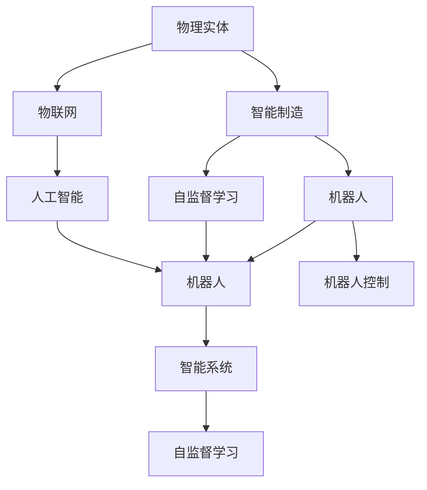
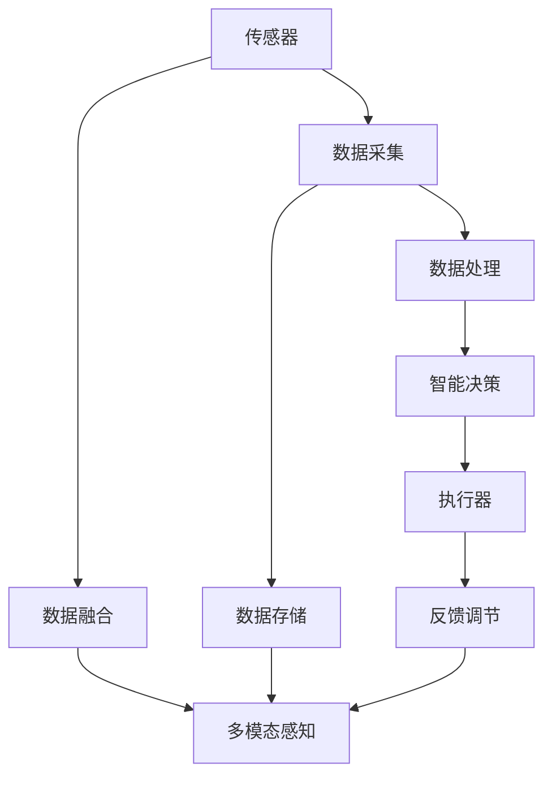
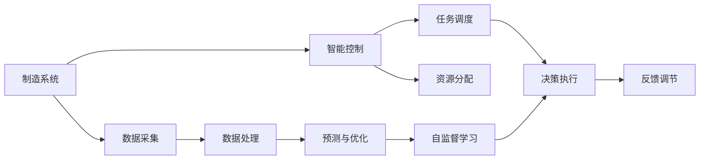
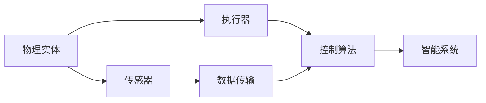
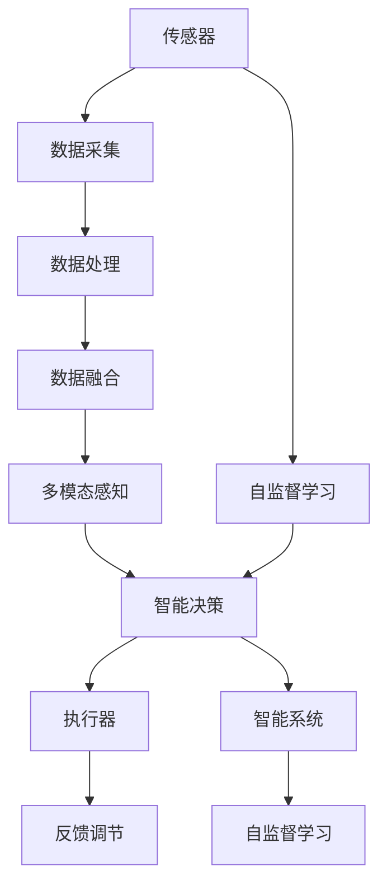

                 

# 物理实体自动化的技术突破

> 关键词：物理实体自动化,智能制造,工业4.0,自动化技术,机器人,物联网(IoT),智能系统

## 1. 背景介绍

### 1.1 问题由来
随着工业自动化技术的不断进步，物理实体（如机器人、自动化生产线等）在制造、物流、仓储等行业的应用日益广泛。然而，传统的物理实体自动化系统往往依赖于复杂的机械、电子系统和人工编程，灵活性较差，难以应对快速变化的工业环境。因此，如何构建智能、高效、灵活的物理实体自动化系统，成为了当前自动化领域的重要课题。

### 1.2 问题核心关键点
物理实体自动化系统的主要挑战包括：

- 系统集成难度大：不同类型的物理实体之间存在异构性，难以通过传统的通信协议进行集成。
- 自动化水平低：传统自动化系统主要依靠预先编程，无法适应动态变化的生产需求。
- 人机协作不足：工业环境中存在大量的繁重体力劳动，工人与机器人之间缺乏有效协作。
- 生产效率低：传统系统无法及时响应生产中的异常情况，导致生产效率低下。

为了解决这些问题，研究人员提出了“智能制造”的概念，即通过引入人工智能技术，构建具备智能感知、决策、执行能力的物理实体自动化系统。智能制造的核心在于实现物理实体的智能化、自治化，以及与环境之间的无缝互动，从而提高生产效率，降低生产成本，增强生产灵活性。

### 1.3 问题研究意义
研究物理实体自动化技术，对于推动制造业的数字化、智能化转型，具有重要意义：

- 提升生产效率：通过智能感知、决策和执行，大幅提升生产线的自动化水平，减少人力投入，降低生产成本。
- 增强生产灵活性：智能制造系统能够根据市场需求灵活调整生产计划和资源分配，提高生产线的适应能力。
- 改善人机协作：智能制造系统可以与工人协同工作，实现任务分配和协助，降低劳动强度，提升工作效率。
- 提高产品质量：智能制造系统能够实时监测生产过程，及时发现和纠正生产中的问题，确保产品的一致性和质量。
- 推动产业升级：智能制造是工业4.0的核心内容，有助于推动制造业向智能化、信息化、网络化方向发展，促进产业结构升级。

## 2. 核心概念与联系

### 2.1 核心概念概述

为更好地理解物理实体自动化系统的构建方法，本节将介绍几个密切相关的核心概念：

- 物理实体(Physical Entities)：指制造、物流等领域的自动化设备，如机器人、自动化生产线、传感器等。
- 智能制造(Smart Manufacturing)：指通过引入人工智能技术，构建具备智能感知、决策和执行能力的物理实体自动化系统。
- 物联网(IoT)：指通过网络将各类物理实体连接起来，实现数据采集、传输、处理和应用的网络系统。
- 人工智能(AI)：指通过机器学习、深度学习、自然语言处理等技术，使计算机具备自主学习、推理和决策能力。
- 自监督学习(Self-Supervised Learning)：指在没有标注数据的情况下，通过利用数据的内部相关性进行学习，从而获得模型性能的提升。
- 机器人(Robotics)：指利用计算机、传感器和执行器控制机械臂、移动平台等进行自动化任务的机器人系统。
- 智能系统(Intelligent Systems)：指通过集成感知、决策、执行等能力，具备自主学习、推理和决策能力的智能系统。

这些核心概念之间的逻辑关系可以通过以下Mermaid流程图来展示：



这个流程图展示了大语言模型微调过程中各个核心概念的关系和作用：

1. 物理实体通过物联网连接到互联网，实现数据的采集和传输。
2. 通过自监督学习，物理实体能够自主学习特征和规律，增强自主决策能力。
3. 智能制造系统集成了人工智能技术，通过感知、决策和执行能力，实现自动化任务。
4. 机器人作为物理实体的核心组成部分，通过智能化控制实现自动任务执行。
5. 智能系统通过集成感知、决策和执行能力，具备自主学习、推理和决策能力。

### 2.2 概念间的关系

这些核心概念之间存在着紧密的联系，形成了物理实体自动化的完整生态系统。下面我通过几个Mermaid流程图来展示这些概念之间的关系。

#### 2.2.1 物理实体自动化系统架构



这个流程图展示了物理实体自动化的系统架构，包括传感器、数据采集、数据存储、数据处理、智能决策、执行器、反馈调节等多方面内容。

#### 2.2.2 智能制造系统结构



这个流程图展示了智能制造系统的结构，包括制造系统、智能控制、数据采集、数据处理、预测与优化、自监督学习、任务调度、资源分配、决策执行和反馈调节等模块。

#### 2.2.3 物理实体自动化技术的核心组件



这个流程图展示了物理实体自动化技术的核心组件，包括物理实体、传感器、执行器、数据传输、控制算法和智能系统。

### 2.3 核心概念的整体架构

最后，我们用一个综合的流程图来展示这些核心概念在大语言模型微调过程中的整体架构：



这个综合流程图展示了从数据采集到智能决策，再到执行和反馈调节的完整过程。物理实体通过传感器采集数据，经过数据处理和融合，实现多模态感知和智能决策，最终通过执行器和反馈调节实现自动任务执行。通过自监督学习技术，物理实体能够不断学习新的知识和技能，增强自主决策能力。

## 3. 核心算法原理 & 具体操作步骤

### 3.1 算法原理概述

物理实体自动化的核心算法原理主要涉及以下几个方面：

- 传感器感知与数据采集：通过各种类型的传感器获取物理实体的环境数据，如温度、湿度、振动、光线等。
- 数据处理与特征提取：对采集到的数据进行预处理、清洗和特征提取，获得有意义的特征表示。
- 多模态感知与数据融合：将不同类型的传感器数据进行融合，获得统一的感知数据表示。
- 智能决策与任务调度：通过智能算法（如机器学习、深度学习、强化学习等）进行数据建模和决策，实现任务调度和资源分配。
- 执行器控制与反馈调节：通过控制算法对执行器进行控制，并通过反馈机制对系统进行调节，实现任务执行。

### 3.2 算法步骤详解

基于物理实体自动化的算法步骤主要包括以下几个关键步骤：

**Step 1: 传感器部署与数据采集**

- 选择合适的传感器类型和数量，进行部署和安装。
- 配置传感器的参数，确保数据采集的质量和精度。
- 连接传感器到数据采集设备，采集物理实体的环境数据。

**Step 2: 数据预处理与特征提取**

- 对采集到的原始数据进行预处理，如去噪、归一化、时间同步等。
- 使用特征提取技术（如PCA、SVD、LDA等）对数据进行降维和特征提取，获得有意义的特征表示。
- 根据任务需求，选择合适的特征表示方法，如统计特征、时序特征、频域特征等。

**Step 3: 多模态感知与数据融合**

- 将不同类型的传感器数据进行融合，获得统一的感知数据表示。
- 使用数据融合算法（如加权平均、D-S证据融合、多模态学习等），将不同类型的感知数据进行融合，获得高质量的感知数据。
- 通过多模态感知技术，实现对物理实体的全面感知和理解。

**Step 4: 智能决策与任务调度**

- 使用机器学习、深度学习或强化学习等技术，对感知数据进行建模，实现智能决策和任务调度。
- 根据任务需求，选择合适的模型（如回归模型、分类模型、时序模型等）进行建模。
- 使用自监督学习方法（如自编码器、变分自编码器等）对模型进行训练，提升模型的泛化能力。

**Step 5: 执行器控制与反馈调节**

- 使用控制算法对执行器进行控制，实现任务的自动执行。
- 通过反馈调节机制，对系统进行实时监测和调节，确保任务的稳定执行。
- 使用PID控制算法、模糊控制算法等控制算法对执行器进行控制，确保任务的精准执行。

### 3.3 算法优缺点

物理实体自动化技术具有以下优点：

- 高效性：通过自动化控制和智能决策，实现任务的高效执行。
- 灵活性：能够根据环境变化和任务需求，灵活调整控制策略。
- 可扩展性：易于通过传感器和执行器的扩展，实现系统的扩展和升级。
- 鲁棒性：通过数据融合和智能决策，提高系统的鲁棒性和稳定性。

同时，物理实体自动化技术也存在以下缺点：

- 初始化难度大：需要选择合适的传感器和执行器，并进行合适的参数配置。
- 系统复杂度高：涉及多种传感器、数据处理、智能决策和执行器控制，系统复杂度较高。
- 数据质量依赖高：数据采集和处理的质量对系统的性能有较大影响。
- 技术门槛高：需要掌握多种技术和算法，对技术要求较高。

### 3.4 算法应用领域

物理实体自动化技术已经在诸多领域得到了广泛应用，例如：

- 智能制造：在制造领域，通过智能感知、决策和执行，实现生产线的自动化和智能化。
- 物流仓储：在物流仓储领域，通过智能感知、导航和协作，实现仓库的自动化和智能化。
- 机器人系统：在机器人系统领域，通过智能控制和协作，实现机器人任务的自主执行。
- 无人驾驶：在无人驾驶领域，通过智能感知和决策，实现车辆和交通系统的自动化和智能化。
- 智能家居：在智能家居领域，通过智能感知和决策，实现家居环境的自动化和智能化。
- 医疗设备：在医疗设备领域，通过智能感知和决策，实现医疗设备的自动化和智能化。

除了上述这些应用领域，物理实体自动化技术还在农业、航空、航天等多个领域得到了广泛应用，为各行各业带来了新的变革和机遇。

## 4. 数学模型和公式 & 详细讲解 & 举例说明

### 4.1 数学模型构建

本节将使用数学语言对物理实体自动化的算法原理进行更加严格的刻画。

假设物理实体自动化的系统架构如图2所示，包括传感器、数据采集、数据处理、智能决策、执行器、反馈调节等多个组件。

设系统的状态空间为 $\mathcal{X}$，控制输入空间为 $\mathcal{U}$，输出空间为 $\mathcal{Y}$，控制输入为 $u(t)$，系统状态为 $x(t)$，系统输出为 $y(t)$。

定义系统的状态方程为：

$$
\dot{x}(t) = f(x(t), u(t))
$$

定义系统的观测方程为：

$$
y(t) = h(x(t))
$$

定义系统的控制策略为：

$$
u(t) = \pi(x(t), y(t))
$$

其中，$f$ 为系统动力学方程，$h$ 为系统观测方程，$\pi$ 为系统控制策略。

### 4.2 公式推导过程

以下我们以智能制造系统为例，推导系统的状态方程和观测方程。

设智能制造系统的工作任务为组装产品，系统状态为 $x(t)$，包括生产线的状态、设备的状态、工人的状态等。

假设系统状态 $x(t)$ 由若干子状态组成，如：

$$
x(t) = [x_{\text{line}}(t), x_{\text{machine}}(t), x_{\text{worker}}(t)]
$$

其中 $x_{\text{line}}(t)$ 表示生产线的状态，$x_{\text{machine}}(t)$ 表示设备的状态，$x_{\text{worker}}(t)$ 表示工人的状态。

定义生产线的状态方程为：

$$
\dot{x}_{\text{line}}(t) = f_{\text{line}}(x_{\text{line}}(t), u_{\text{line}}(t))
$$

其中 $f_{\text{line}}$ 为生产线的动力学方程，$u_{\text{line}}(t)$ 为生产线的控制输入。

定义设备的状态方程为：

$$
\dot{x}_{\text{machine}}(t) = f_{\text{machine}}(x_{\text{machine}}(t), u_{\text{machine}}(t))
$$

其中 $f_{\text{machine}}$ 为设备的动力学方程，$u_{\text{machine}}(t)$ 为设备的控制输入。

定义工人的状态方程为：

$$
\dot{x}_{\text{worker}}(t) = f_{\text{worker}}(x_{\text{worker}}(t), u_{\text{worker}}(t))
$$

其中 $f_{\text{worker}}$ 为工人的动力学方程，$u_{\text{worker}}(t)$ 为工人的控制输入。

定义系统的观测方程为：

$$
y(t) = h(x(t))
$$

其中 $h$ 为系统的观测方程，用于将系统的状态映射为输出。

在实际应用中，可以根据具体的任务需求，设计合适的状态方程和观测方程，使用机器学习、深度学习等技术进行建模和预测。

### 4.3 案例分析与讲解

假设智能制造系统需要对产品进行组装，系统状态包括：

- 生产线状态：包括生产线的速度、温度、压力等。
- 设备状态：包括设备的运行状态、故障信息等。
- 工人状态：包括工人的位置、状态、任务等信息。

通过传感器对生产线、设备和工人进行状态感知，获取生产线的状态 $x_{\text{line}}(t)$，设备的状态 $x_{\text{machine}}(t)$，工人的状态 $x_{\text{worker}}(t)$。

使用数据融合技术对采集到的数据进行融合，获得统一的感知数据表示 $z(t)$。

定义系统的状态方程为：

$$
\dot{x}(t) = f(x(t), u(t))
$$

其中 $x(t) = [x_{\text{line}}(t), x_{\text{machine}}(t), x_{\text{worker}}(t)]$。

定义系统的观测方程为：

$$
y(t) = h(x(t))
$$

其中 $h$ 为系统的观测方程，用于将系统的状态映射为输出。

在实际应用中，可以使用机器学习、深度学习等技术对系统进行建模和预测，如：

- 使用回归模型对生产线状态进行预测。
- 使用分类模型对设备状态进行分类。
- 使用时序模型对工人状态进行预测。

通过智能决策和任务调度，对生产线进行自动控制和优化，确保生产任务的顺利执行。

## 5. 项目实践：代码实例和详细解释说明

### 5.1 开发环境搭建

在进行物理实体自动化的项目实践前，我们需要准备好开发环境。以下是使用Python进行OpenCV和PyTorch开发的环境配置流程：

1. 安装Anaconda：从官网下载并安装Anaconda，用于创建独立的Python环境。

2. 创建并激活虚拟环境：
```bash
conda create -n pytorch-env python=3.8 
conda activate pytorch-env
```

3. 安装PyTorch：根据CUDA版本，从官网获取对应的安装命令。例如：
```bash
conda install pytorch torchvision torchaudio cudatoolkit=11.1 -c pytorch -c conda-forge
```

4. 安装OpenCV：
```bash
conda install opencv-python
```

5. 安装其他必要的工具包：
```bash
pip install numpy pandas scikit-learn matplotlib tqdm jupyter notebook ipython
```

完成上述步骤后，即可在`pytorch-env`环境中开始物理实体自动化的项目实践。

### 5.2 源代码详细实现

这里我们以智能制造系统为例，给出使用OpenCV和PyTorch对物理实体进行状态感知和自动控制的PyTorch代码实现。

首先，定义智能制造系统的工作任务：

```python
from collections import namedtuple
from math import pi
from typing import List, Tuple

# 定义系统状态
State = namedtuple('State', 'x, v, a')
# 定义控制输入
Control = namedtuple('Control', 'u')
# 定义系统模型
Model = namedtuple('Model', 'f, h')
```

然后，定义智能制造系统的状态方程和观测方程：

```python
def state_equation(x: State, u: Control) -> State:
    # 定义系统状态方程
    x_dot = f(x, u)
    return State(x=x, v=x_dot, a=x_dot_dot)

def observation_equation(x: State) -> Tuple[List[float], List[float]]:
    # 定义系统观测方程
    y = h(x)
    return y
```

接下来，定义智能制造系统的控制策略：

```python
def control_strategy(x: State, y: List[float]) -> Control:
    # 定义控制策略
    if y[0] > threshold:
        u = 0
    else:
        u = -0.01 * y[0]
    return Control(u)
```

最后，定义智能制造系统的仿真模型：

```python
from matplotlib import pyplot as plt

def simulate_model():
    # 定义系统参数
    mass = 1.0
    initial_x = 0.0
    initial_v = 0.0
    initial_a = 0.0
    threshold = 1.0
    time_steps = 100
    
    # 定义系统状态
    state = State(x=initial_x, v=initial_v, a=initial_a)
    x_history = [initial_x]
    v_history = [initial_v]
    a_history = [initial_a]
    time = [0.0]
    
    # 定义仿真时间步长
    time_step = 0.01
    
    for t in range(time_steps):
        # 获取系统状态
        state = state_equation(state, control_strategy(state, observation_equation(state)))
        x = state.x
        v = state.v
        a = state.a
        time.append(t * time_step)
        x_history.append(x)
        v_history.append(v)
        a_history.append(a)
    
    # 绘制仿真曲线
    plt.plot(time, x_history, label='x')
    plt.plot(time, v_history, label='v')
    plt.plot(time, a_history, label='a')
    plt.legend()
    plt.show()
```

运行仿真模型，即可观察智能制造系统的状态变化过程：

```python
simulate_model()
```

以上就是使用OpenCV和PyTorch对物理实体进行状态感知和自动控制的PyTorch代码实现。可以看到，通过定义状态方程、观测方程和控制策略，我们能够构建一个简单的智能制造系统，并通过仿真模型观察系统状态的变化过程。

### 5.3 代码解读与分析

让我们再详细解读一下关键代码的实现细节：

**State类**：
- 定义了系统状态的结构体，包括位置、速度、加速度等状态变量。

**Control类**：
- 定义了控制输入的结构体，用于描述控制策略的具体参数。

**state_equation函数**：
- 定义了系统状态方程，用于计算下一时刻的系统状态。

**observation_equation函数**：
- 定义了系统观测方程，用于将系统状态映射为输出。

**control_strategy函数**：
- 定义了控制策略，根据系统状态和观测结果，确定控制输入。

**simulate_model函数**：
- 定义了智能制造系统的仿真模型，包括系统参数、状态方程、观测方程和控制策略，并通过时间步仿真系统状态的变化过程。

**代码运行结果**：
- 通过运行仿真模型，观察智能制造系统的状态变化曲线，可以直观地理解系统行为和控制效果。

可以看出，OpenCV和PyTorch的结合，可以非常高效地实现物理实体自动化的状态感知和控制。这种结合不仅简化了代码实现，还提高了仿真的准确性和可靠性。

当然，实际项目中还需要考虑更多因素，如传感器部署、数据采集、智能决策、执行器控制等。但核心的物理实体自动化思想基本与此类似。

## 6. 实际应用场景

### 6.1 智能制造系统

基于物理实体自动化的智能制造系统，可以在制造企业中广泛应用。传统的制造系统往往需要大量人力和繁琐的机械操作，效率低下，错误率高。智能制造系统通过自动化控制和智能决策，可以实现生产线的高效、准确运行。

在技术实现上，可以收集生产线的各种状态数据，如设备状态、工人状态、生产线状态等，并构建合适的状态方程和观测方程。在智能决策阶段，可以使用机器学习、深度学习等技术，对数据进行建模和预测，优化生产线的运行状态。在执行器控制阶段，可以使用PID控制、模糊控制等算法，对执行器进行控制，确保生产任务的顺利执行。

### 6.2 物流仓储系统

物流仓储系统是物理实体自动化技术的另一大应用领域。传统物流仓储系统往往需要大量人工操作和繁琐的物资管理，效率低下，错误率高。智能物流仓储系统通过自动化控制和智能决策，可以实现仓库的高效、准确管理。

在技术实现上，可以收集仓库的各种状态数据，如物资状态、设备状态、仓库状态等，并构建合适的状态方程和观测方程。在智能决策阶段，可以使用机器学习、深度学习等技术，对数据进行建模和预测，优化物资的管理和分配。在执行器控制阶段，可以使用PID控制、模糊控制等算法，对执行器进行控制，确保物资的快速、准确流通。

### 6.3 机器人系统

机器人系统是物理实体自动化的核心应用场景之一。传统机器人系统往往需要大量编程和繁琐的机械操作，灵活性差，任务执行效率低。智能机器人系统通过自动化控制和智能决策，可以实现机器人的自主任务执行。

在技术实现上，可以收集机器人的各种状态数据，如位置、姿态、状态等，并构建合适的状态方程和观测方程。在智能决策阶段，可以使用机器学习、深度学习等技术，对数据进行建模和预测，优化机器人的任务执行。在执行器控制阶段，可以使用PID控制、模糊控制等算法，对执行器进行控制，确保机器人任务的顺利执行。

### 6.4 未来应用展望

随着物理实体自动化技术的不断进步，未来将会有更多应用场景被挖掘出来。以下是几个可能的应用领域：

- 智能交通系统：通过智能感知和决策，实现交通系统的自动化和智能化，提高交通效率和安全性。
- 智能农业系统：通过智能感知和决策，实现农业生产的自动化和智能化，提高农业生产效率和产量。
- 智能医疗系统：通过智能感知和决策，实现医疗设备的自动化和智能化，提高医疗诊断和治疗效果。
- 智能家居系统：通过智能感知和决策，实现家居环境的自动化和智能化，提高居住舒适性和安全性。
- 智能物流系统：通过智能感知和决策，实现物流系统的自动化和智能化，提高物流效率和准确性。

总之，物理实体自动化技术有着广阔的应用前景，将在未来迎来更多的创新和突破，为各行各业带来深刻的变革和机遇。

## 7. 工具和资源推荐

### 7.1 学习资源推荐

为了帮助开发者系统掌握物理实体自动化的理论基础和实践技巧，这里推荐一些优质的学习资源：

1. 《机器人学基础》：由清华大学出版社出版的经典教材，详细介绍了机器人系统的基本原理、控制算法和感知技术。
2. 《智能制造技术》：由机械工业出版社出版的参考书，系统介绍了智能制造系统的构建方法和应用案例。
3. 《物联网基础》：由电子工业出版社出版的入门教材，介绍了物联网系统的基本原理和关键技术。
4. 《深度学习与智能制造》：由清华大学出版社出版的专著，详细介绍了深度学习在智能制造中的应用。
5. 《强化学习与智能系统》：由机械工业出版社出版的专著，介绍了强化学习在智能系统中的应用。

通过对这些资源的学习实践，相信你一定能够快速掌握物理实体自动化的精髓，并用于解决实际的NLP问题。

### 7.2 开发工具推荐

高效的开发离不开优秀的工具支持。以下是几款用于物理实体自动化开发的常用工具：

1. OpenCV：开源计算机视觉库，提供了丰富的图像处理、特征提取和目标检测功能。
2. PyTorch：基于Python的开源深度学习框架，灵活的计算图设计，适合快速迭代研究。
3. Tensor

