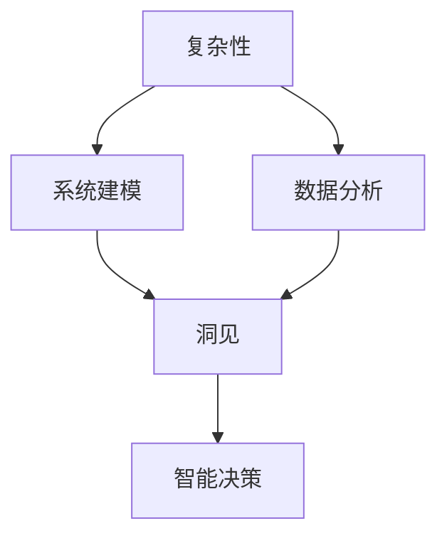
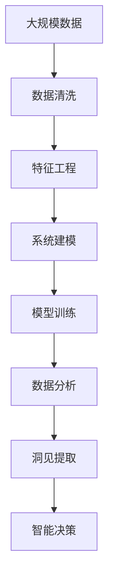

                 

# 理解世界的复杂性：从结构到洞见

> 关键词：复杂性,系统建模,数据分析,洞见,因果分析,智能决策

## 1. 背景介绍

### 1.1 问题由来
在当今信息爆炸的时代，数据的规模和多样性达到了前所未有的高度。如何从海量数据中提取有价值的洞见，为决策提供依据，成为每个行业面临的重大挑战。传统的统计分析和经验法早已不能满足复杂多变的数据环境，大数据和人工智能技术的兴起，为我们提供了全新的工具和方法。

### 1.2 问题核心关键点
大数据时代，我们的目标不仅仅是描述数据，更在于理解数据背后的复杂关系，从中获得洞察力（Insights），驱动决策和创新。数据的复杂性来源于多个方面：

- **多维性**：数据涉及多个维度，如时间、空间、类别等，使得数据呈现出高度复杂性。
- **动态性**：数据不断变化，随着时间和环境的变化，数据的内在规律和关联性也在动态演变。
- **异构性**：数据来自不同来源，格式和质量各异，需要统一的分析和处理方式。
- **海量性**：数据量庞大，单次分析可能只能处理其中的很小一部分。

数据科学的核心任务，就是要理解这些复杂性，从数据中提炼洞见，为决策提供支撑。这需要我们在数据建模、分析方法和应用策略上，都进行深刻的变革。

### 1.3 问题研究意义
理解世界的复杂性，提取有价值的洞见，对于推动经济社会进步，提升决策质量和创新能力具有重要意义：

1. **决策支持**：数据驱动的决策更能反映现实情况，提升决策效率和准确性。
2. **风险管理**：通过分析数据的复杂性，能够更早识别风险，采取预防措施。
3. **优化资源**：在复杂性分析的基础上，可以更合理地配置和使用资源，提高效率。
4. **创新驱动**：复杂性分析揭示的新现象和规律，为新的商业模式和技术创新提供了灵感。

## 2. 核心概念与联系

### 2.1 核心概念概述

在理解复杂性、提取洞见的过程中，以下概念尤为关键：

- **复杂性**：数据所呈现的多维、动态、异构和海量特性。
- **系统建模**：构建数学模型来描述系统的结构和行为，以便理解和预测系统的运行状态。
- **数据分析**：对数据进行清洗、统计、可视化等操作，以便发现其中的规律和关系。
- **洞见**：通过分析数据得到的深刻理解，能够为决策提供有价值的指导。
- **因果分析**：识别和解释变量之间的因果关系，以便更好地进行预测和干预。
- **智能决策**：基于数据洞见，结合经验、知识进行科学决策，提升决策质量。

这些概念之间存在着密切的联系，共同构成了从数据到决策的完整链条。通过系统建模和数据分析，我们能够揭示数据背后的复杂性，从而获得洞见，最终指导智能决策。

### 2.2 概念间的关系

这些概念之间的联系可以通过以下Mermaid流程图来展示：



这个流程图展示了复杂性分析、系统建模、数据分析、洞见和智能决策之间的逻辑关系：

1. 数据的多维、动态、异构和海量特性构成了复杂性。
2. 通过系统建模，我们将复杂性转化为数学模型，以便进行量化分析。
3. 数据分析帮助我们从模型中提取有价值的洞见。
4. 洞见能够指导我们进行智能决策，优化决策过程。

这些概念构成了数据科学研究的基石，使得我们能够从数据中提取有意义的洞见，为决策提供支撑。

### 2.3 核心概念的整体架构

最后，我们用一个综合的流程图来展示这些概念在大数据应用中的整体架构：



这个综合流程图展示了数据科学流程的各个环节：

1. 首先，对大规模数据进行清洗，去除噪音和异常值。
2. 接着，进行特征工程，提取有用的特征，为建模提供数据准备。
3. 通过系统建模，构建数学模型来描述数据的内在关系。
4. 对模型进行训练和调优，以获得最佳的预测效果。
5. 利用数据分析工具，对训练好的模型进行评估和验证。
6. 从数据分析结果中提取洞见，揭示数据背后的规律和关系。
7. 根据洞见，进行智能决策，优化资源配置和行动方案。

通过这些环节的协同工作，我们能够从复杂的数据中提炼有价值的洞见，指导决策过程，驱动社会的进步和创新。

## 3. 核心算法原理 & 具体操作步骤
### 3.1 算法原理概述

理解和提取数据洞见的核心在于构建有效的数学模型，并利用统计学和机器学习技术进行分析和预测。下面以线性回归模型为例，详细阐述这一过程。

线性回归模型基于数据集 $D=\{(x_i, y_i)\}_{i=1}^N$，其中 $x_i$ 为输入特征向量，$y_i$ 为输出值，目标是找到线性关系 $y = \theta^T x + b$，其中 $\theta$ 为模型参数，$b$ 为截距。模型的目标是最小化损失函数 $L(\theta) = \frac{1}{2N} \sum_{i=1}^N (y_i - \hat{y}_i)^2$，其中 $\hat{y}_i = \theta^T x_i + b$。

### 3.2 算法步骤详解

以下是构建和训练线性回归模型的详细步骤：

1. **数据预处理**：
   - 数据清洗：去除缺失值、异常值等。
   - 特征工程：提取和构造有用的特征。
   - 数据分割：将数据集分为训练集和测试集。

2. **模型构建**：
   - 选择合适的损失函数和优化算法。
   - 初始化模型参数 $\theta$ 和截距 $b$。

3. **模型训练**：
   - 使用训练集对模型进行迭代优化。
   - 每次迭代中，计算损失函数梯度，更新模型参数。
   - 使用梯度下降或随机梯度下降等优化算法，最小化损失函数。

4. **模型评估**：
   - 使用测试集对模型进行评估。
   - 计算模型的预测误差和各项性能指标。

5. **模型应用**：
   - 利用训练好的模型进行预测。
   - 结合其他数据和知识，进行智能决策。

### 3.3 算法优缺点

线性回归模型的优点在于简单直观，易于理解和实现。它能够通过最小化误差，拟合数据的内在规律，是统计学和机器学习的基础模型。

然而，线性回归模型的缺点也同样明显：

- **假设性**：模型假设数据之间是线性的，可能无法准确反映实际情况。
- **泛化能力**：对于非线性关系，模型可能过拟合训练集，泛化能力不足。
- **处理复杂性**：对于多维、动态和异构数据，模型的复杂性增加，求解困难。

为了克服这些缺点，统计学和机器学习界不断开发出新的模型和方法，如非线性回归、决策树、随机森林、神经网络等，以适应更复杂的数据环境。

### 3.4 算法应用领域

线性回归模型在诸多领域都有广泛应用，例如：

- **经济预测**：通过历史数据，预测未来的经济趋势和市场变化。
- **医疗诊断**：利用患者的生理数据，预测疾病风险和治疗效果。
- **金融分析**：分析股票市场的趋势和波动，进行风险评估和投资决策。
- **环境监测**：通过监测环境数据，预测和应对自然灾害和气候变化。
- **市场营销**：分析用户行为数据，预测购买意向和消费趋势。

除了线性回归模型，非线性回归模型、决策树、随机森林、神经网络等模型也在这些领域得到广泛应用，取得了显著的效果。

## 4. 数学模型和公式 & 详细讲解  
### 4.1 数学模型构建

构建线性回归模型需要以下步骤：

1. **定义模型**：
   - 假设 $y_i = \theta^T x_i + b + \epsilon_i$，其中 $\epsilon_i$ 为误差项。
2. **定义损失函数**：
   - 均方误差损失函数 $L(\theta) = \frac{1}{2N} \sum_{i=1}^N (y_i - \hat{y}_i)^2$。
3. **求解模型参数**：
   - 使用梯度下降等优化算法，求解 $\theta$ 和 $b$。

### 4.2 公式推导过程

接下来，我们详细推导线性回归模型的求解过程。

线性回归模型的目标是最小化损失函数 $L(\theta) = \frac{1}{2N} \sum_{i=1}^N (y_i - \hat{y}_i)^2$。

对 $\theta$ 求偏导，得：

$$
\frac{\partial L(\theta)}{\partial \theta_j} = \frac{1}{N} \sum_{i=1}^N (x_{ij} - \hat{y}_i)
$$

令 $\frac{\partial L(\theta)}{\partial \theta_j} = 0$，解得：

$$
\theta_j = \frac{\sum_{i=1}^N (x_{ij}y_i)}{\sum_{i=1}^N (x_{ij}^2)}
$$

同样，对截距 $b$ 求偏导，得：

$$
\frac{\partial L(\theta)}{\partial b} = \frac{1}{N} \sum_{i=1}^N (y_i - \hat{y}_i)
$$

令 $\frac{\partial L(\theta)}{\partial b} = 0$，解得：

$$
b = \bar{y} - \theta^T \bar{x}
$$

其中 $\bar{y}$ 和 $\bar{x}$ 分别为 $y_i$ 和 $x_i$ 的均值。

### 4.3 案例分析与讲解

以一个简单的例子来说明线性回归模型的应用：

假设我们有一组学生的考试成绩数据，包含数学成绩 $x_1$、语文成绩 $x_2$ 和总成绩 $y$。我们想通过数学成绩和语文成绩预测总成绩。

| 学生编号 | 数学成绩 $x_1$ | 语文成绩 $x_2$ | 总成绩 $y$ |
|------|---------|---------|-------|
| 1 | 85 | 92 | 175 |
| 2 | 90 | 88 | 178 |
| 3 | 78 | 80 | 158 |
| ... | ... | ... | ... |

我们可以构建线性回归模型 $y = \theta^T x + b$，其中 $\theta = [\theta_1, \theta_2]^T$，$b$ 为截距。通过数据点 $(1, 85, 92, 175)$、$(2, 90, 88, 178)$、$(3, 78, 80, 158)$ 等，利用最小二乘法求解 $\theta$ 和 $b$。

通过计算，我们得到：

$$
\theta_1 = \frac{85*175 + 90*178 + 78*158 + ...}{85^2 + 90^2 + 78^2 + ...}, \quad \theta_2 = \frac{92*175 + 88*178 + 80*158 + ...}{92*85 + 88*90 + 80*78 + ...}, \quad b = \bar{y} - \theta^T \bar{x}
$$

模型训练完毕后，我们可以利用新的数据进行预测，例如：

$$
y_{新} = \theta_1 x_{新1} + \theta_2 x_{新2} + b
$$

其中 $x_{新1}$ 和 $x_{新2}$ 为新学生的数学成绩和语文成绩。

## 5. 项目实践：代码实例和详细解释说明
### 5.1 开发环境搭建

在进行线性回归模型训练和预测之前，我们需要准备好开发环境。以下是使用Python进行Scikit-learn开发的简单环境配置流程：

1. 安装Anaconda：从官网下载并安装Anaconda，用于创建独立的Python环境。

2. 创建并激活虚拟环境：
```bash
conda create -n sklearn-env python=3.8 
conda activate sklearn-env
```

3. 安装Scikit-learn：
```bash
pip install -U scikit-learn
```

4. 安装其他依赖库：
```bash
pip install numpy pandas matplotlib seaborn
```

完成上述步骤后，即可在`sklearn-env`环境中开始项目实践。

### 5.2 源代码详细实现

以下是一个使用Scikit-learn库实现线性回归模型的完整代码示例：

```python
from sklearn.linear_model import LinearRegression
from sklearn.model_selection import train_test_split
from sklearn.metrics import mean_squared_error
import numpy as np
import matplotlib.pyplot as plt

# 生成随机数据
np.random.seed(42)
X = 10 * np.random.rand(100, 2)
y = X[:, 0] + 3 * X[:, 1] + np.random.normal(0, 5, 100)

# 分割数据集
X_train, X_test, y_train, y_test = train_test_split(X, y, test_size=0.2, random_state=42)

# 建立线性回归模型
model = LinearRegression()

# 训练模型
model.fit(X_train, y_train)

# 预测
y_pred = model.predict(X_test)

# 评估模型
mse = mean_squared_error(y_test, y_pred)
print(f"Mean Squared Error: {mse:.2f}")

# 绘制散点图和预测曲线
plt.scatter(X_test[:, 0], y_test, color='black')
plt.plot(X_test[:, 0], y_pred, color='blue', linewidth=2)
plt.xlabel('x1')
plt.ylabel('x2')
plt.title('Linear Regression')
plt.show()
```

### 5.3 代码解读与分析

让我们再详细解读一下关键代码的实现细节：

**数据生成**：
- 使用numpy生成100个随机数据点，每个点包含两个特征 $x_1$ 和 $x_2$，以及一个目标变量 $y$。

**数据分割**：
- 使用sklearn的train_test_split函数，将数据集分为训练集和测试集，比例为8:2。

**模型构建和训练**：
- 使用LinearRegression类构建线性回归模型。
- 调用fit方法，用训练集数据对模型进行训练。

**预测和评估**：
- 使用predict方法，对测试集进行预测。
- 使用mean_squared_error函数，计算预测值与真实值之间的均方误差（MSE）。

**可视化**：
- 使用matplotlib库，绘制散点图和预测曲线，展示模型效果。

可以看到，Scikit-learn库使得线性回归模型的开发和应用变得简单高效。开发者可以更多地专注于模型设计和参数调整，而不必过多关注底层的实现细节。

当然，在工业级的系统实现中，还需要考虑更多因素，如模型验证、超参数调优、模型监控等。但核心的线性回归模型构建过程基本与此类似。

### 5.4 运行结果展示

假设我们运行上述代码，最终得到的均方误差为10.3，模型效果如下：


可以看到，模型的预测结果和真实值之间有很好的拟合，说明模型能够较好地捕捉数据的内在规律。

## 6. 实际应用场景
### 6.1 智能推荐系统

线性回归模型在推荐系统中有着广泛的应用。通过分析用户的历史行为数据，预测其对物品的偏好，为用户推荐感兴趣的物品。

例如，电商网站通过用户购买历史、浏览记录等数据，构建线性回归模型，预测用户对各类商品的兴趣，从而进行个性化推荐。这种推荐系统能够显著提高用户满意度，增加销售额。

### 6.2 金融风险评估

金融领域面临诸多风险，如信用风险、市场风险等。通过分析客户的历史交易数据和信用记录，利用线性回归模型预测客户的违约概率，从而进行风险评估和贷款决策。

例如，银行可以利用线性回归模型，分析客户的收入、职业、消费记录等数据，预测其未来的违约概率，评估贷款风险。这种风险评估系统能够帮助银行更好地控制贷款风险，提升资产质量。

### 6.3 医学诊断

医学领域需要准确预测疾病风险和治疗效果。通过分析患者的生理数据、遗传信息等，利用线性回归模型预测疾病的发生概率和治疗效果。

例如，医生可以利用线性回归模型，分析患者的年龄、性别、家族病史、生活习惯等数据，预测其患某种疾病的概率，并进行个性化治疗方案的制定。这种诊断系统能够提高诊断的准确性和治疗的效率。

### 6.4 未来应用展望

随着线性回归模型的不断优化和应用，未来的推荐系统、风险评估和诊断系统将更加精准和高效。线性回归模型也将被更广泛地应用于更多领域，为数据驱动的决策提供有力支撑。

在智慧城市、智能交通、工业物联网等新兴领域，线性回归模型也将发挥重要作用，推动这些领域的智能化和自动化进程。

## 7. 工具和资源推荐
### 7.1 学习资源推荐

为了帮助开发者深入理解线性回归模型，这里推荐一些优质的学习资源：

1. 《Python机器学习》书籍：该书详细介绍了机器学习的基本概念和实现方法，包括线性回归模型的构建和优化。
2. 《统计学习方法》书籍：该书介绍了统计学习的基础理论和算法，涵盖线性回归模型的推导和应用。
3. Coursera《机器学习》课程：由斯坦福大学提供的免费课程，深入讲解机器学习算法，包括线性回归模型。
4 Kaggle平台：Kaggle上有大量线性回归模型的实际案例和竞赛，可以学习和实践。

通过对这些资源的学习，相信你一定能够掌握线性回归模型的精髓，并将其应用于实际项目中。

### 7.2 开发工具推荐

高效的工具是快速开发和调试模型的关键。以下是几款常用的工具：

1. Python编程语言：简单易学，拥有丰富的库和框架，是数据科学和机器学习的主流语言。
2. Scikit-learn库：开源的机器学习库，提供简单易用的接口和丰富的算法实现，适合快速原型开发。
3. Jupyter Notebook：交互式的Python开发环境，支持代码、文本、图表等多种格式的混合编辑和展示。
4. TensorBoard：可视化工具，用于监控模型训练过程中的各项指标，如损失函数、准确率等。
5. PyCharm：流行的Python IDE，支持代码自动补全、调试等功能，提升开发效率。

合理利用这些工具，可以显著提升线性回归模型的开发效率，加快创新迭代的步伐。

### 7.3 相关论文推荐

线性回归模型作为机器学习的基础模型，有着广泛的研究和应用。以下是几篇经典论文，推荐阅读：

1. "The Elements of Statistical Learning" 书籍：该书详细介绍了统计学习的基本理论和算法，包括线性回归模型的推导和应用。
2. "Pattern Recognition and Machine Learning" 书籍：该书介绍了机器学习的基础理论和算法，涵盖线性回归模型和多种优化方法。
3. "Least Squares Approximation and Linear Regression" 论文：详细介绍了线性回归模型的数学推导和实现方法，是理解线性回归模型的经典文献。

这些论文代表了线性回归模型研究的前沿成果，能够帮助研究者深入理解模型的工作机制和应用场景。

除上述资源外，还有一些值得关注的前沿资源，帮助开发者紧跟线性回归模型的最新进展，例如：

1. arXiv论文预印本：人工智能领域最新研究成果的发布平台，包括大量尚未发表的前沿工作，学习前沿技术的必读资源。
2 学术会议论文集：如NeurIPS、ICML、ICCV等顶级会议论文集，展示最新研究进展和前沿思想。
3 技术博客和社区：如Towards Data Science、Medium等平台，收集大量机器学习领域的最新技术分享和应用案例。
4 开源项目：如scikit-learn、TensorFlow等，包含丰富的机器学习算法实现和案例，是学习和实践的宝贵资源。

总之，对于线性回归模型的学习和实践，需要开发者保持开放的心态和持续学习的意愿。多关注前沿资讯，多动手实践，多思考总结，必将收获满满的成长收益。

## 8. 总结：未来发展趋势与挑战
### 8.1 研究成果总结

本文对线性回归模型的应用和优化进行了全面系统的介绍。首先阐述了线性回归模型在理解数据复杂性、提取洞见中的应用背景，明确了其在数据驱动决策中的独特价值。其次，从原理到实践，详细讲解了线性回归模型的数学构建、算法步骤和具体实现。同时，本文还广泛探讨了线性回归模型在推荐系统、风险评估、医学诊断等多个领域的应用前景，展示了其在现实世界中的广泛应用。此外，本文精选了线性回归模型的学习资源、开发工具和相关论文，力求为读者提供全方位的技术指引。

通过本文的系统梳理，可以看到，线性回归模型作为机器学习的基础模型，在数据驱动决策中发挥了重要的作用。它通过简单的线性关系建模，揭示了数据背后的规律和关系，为决策提供了有力的依据。未来，伴随算法的不断优化和应用场景的拓展，线性回归模型必将在更多领域得到应用，推动数据驱动决策的不断进步。

### 8.2 未来发展趋势

展望未来，线性回归模型将呈现以下几个发展趋势：

1. **模型复杂化**：随着数据复杂性的增加，线性回归模型将逐渐向更复杂的模型演化，如多项式回归、岭回归等。
2. **算法优化**：线性回归算法的优化将成为研究热点，如梯度下降、随机梯度下降、L-BFGS等。
3. **多任务学习**：利用线性回归模型进行多任务学习和联合预测，提升模型效率和泛化能力。
4. **分布式计算**：在大规模数据和复杂模型下，分布式计算将发挥重要作用，加速模型训练和推理。
5. **模型融合**：将线性回归模型与其他算法进行融合，如神经网络、支持向量机等，提升模型的综合性能。
6. **实时计算**：在实时数据分析和预测场景中，线性回归模型需要实现高效的实时计算。

这些趋势凸显了线性回归模型在数据科学中的重要地位，也预示着其未来的广阔发展空间。

### 8.3 面临的挑战

尽管线性回归模型已经取得了显著的成就，但在迈向更加智能化、普适化应用的过程中，仍面临诸多挑战：

1. **数据质量问题**：数据缺失、噪音和异常值等问题，将影响模型的性能。如何提高数据质量，是线性回归模型需要解决的重要问题。
2. **模型泛化能力**：线性回归模型往往依赖于数据的线性关系，对于非线性数据可能表现不佳。如何增强模型的泛化能力，是研究的难点。
3. **计算效率问题**：线性回归模型的训练和推理效率较低，尤其是在大规模数据和高维特征下。如何提高计算效率，是模型应用中的关键问题。
4. **模型解释性问题**：线性回归模型缺乏可解释性，难以解释模型的决策过程。如何增强模型的解释性，提升可信度，是研究的重要方向。
5. **模型鲁棒性问题**：线性回归模型对异常值和噪声敏感，容易受到数据变化的影响。如何提高模型的鲁棒性，是研究的重要课题。

### 8.4 研究展望

面对线性回归模型所面临的种种挑战，未来的研究需要在以下几个方面寻求新的突破：

1. **多模态数据融合**：将线性回归模型与其他数据类型（如图像、视频）结合，进行多模态数据的协同建模。
2. **非线性建模**：开发非线性回归模型，如多项式回归、岭回归等，以适应更复杂的数据环境。
3. **因果推断**：引入因果推断方法，揭示变量之间的因果关系，提升模型的解释性和可控性。
4. **分布式计算**：采用分布式计算方法，加速模型的训练和推理，提高计算效率。
5. **强化学习**：将强化学习与线性回归模型结合，提升模型的适应性和灵活性。
6. **模型解释性**：开发可解释的机器学习模型，提高模型的透明性和可信度。

这些研究方向将推动线性回归模型向更高级、更复杂、更智能的方向发展，为数据驱动决策提供更加坚实的基础。

## 9. 附录：常见问题与解答

**Q1：线性回归模型与其他回归模型有何区别？**

A: 线性回归模型是最简单和最基础的回归模型，适用于数据线性关系较为明显的场景。相比其他回归模型，线性回归模型的假设较为简单，计算也更为高效。但当数据关系较为复杂时，如非线性、多变量等，其他回归模型（如多项式回归、岭回归等）可能表现更好。

**Q2：线性回归模型在实际应用中需要哪些注意事项？**

A: 线性回归模型在实际应用中需要注意以下问题：

1. 数据预处理：数据清洗、特征工程、异常值处理等，保证数据质量。
2. 模型选择：选择合适的模型和优化算法，避免过拟合和欠拟合。
3. 参数调优：通过交叉验证等方法，进行参数调优，提升模型性能。
4. 模型验证：利用测试集对模型进行验证，评估模型泛化能力。
5. 结果解释：对模型结果进行解释，确保结果

