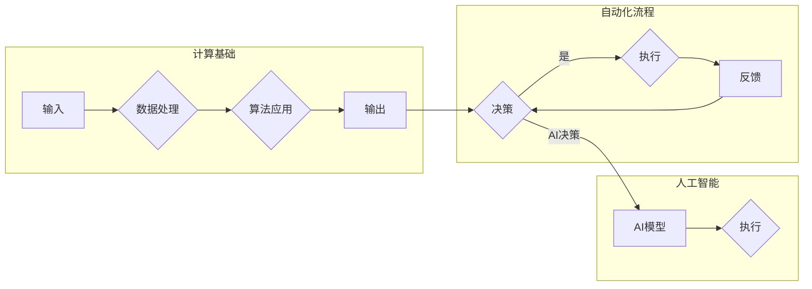

> 机器学习，神经网络，深度学习，自动驾驶，自然语言处理，人工智能，计算范式，自动化，Andrej Karpathy

# Andrej Karpathy谈计算与自动化

### 1. 背景介绍

Andrej Karpathy 是一位杰出的计算机科学家和工程师，以其在深度学习和自然语言处理领域的贡献而闻名。他的作品，包括著名的博客文章《The Unreasonable Effectiveness of Recurrent Neural Networks》（《循环神经网络不可思议的有效性》），不仅展示了深度学习在自然语言处理中的潜力，也反映了他对计算与自动化深刻的理解。本文将探讨 Andrej Karpathy 的思想，分析计算与自动化的核心概念，并探讨其在当前和未来技术发展中的重要性。

### 2. 核心概念与联系

#### 2.1 核心概念

**计算**：计算是信息处理的基础，涉及使用算法和硬件来处理数据和解决问题。它包括逻辑运算、数学运算、数据存储和检索等。

**自动化**：自动化是指使用机器和系统来执行原本由人类完成的任务。它旨在提高效率、减少错误并释放人类劳动力。

#### 2.2 架构的 Mermaid 流程图



### 3. 核心算法原理 & 具体操作步骤

#### 3.1 算法原理概述

深度学习是自动化和人工智能的核心。它通过模仿人脑神经网络的结构和功能，使计算机能够从数据中学习，从而进行预测和决策。

#### 3.2 算法步骤详解

1. **数据收集**：收集用于训练的原始数据。
2. **数据预处理**：清洗和转换数据，使其适合机器学习算法。
3. **模型选择**：选择合适的神经网络架构。
4. **模型训练**：使用标记数据训练模型。
5. **模型评估**：在测试集上评估模型的性能。
6. **模型部署**：将训练好的模型部署到生产环境中。

#### 3.3 算法优缺点

**优点**：

- 高效：能够处理大量数据，速度快。
- 准确：在许多任务上能够达到或超过人类的表现。
- 自适应性：能够从新数据中学习。

**缺点**：

- 数据依赖：需要大量高质量的训练数据。
- 过度拟合：模型可能在新数据上表现不佳。
- 可解释性差：难以解释模型的决策过程。

#### 3.4 算法应用领域

深度学习在图像识别、语音识别、自然语言处理、自动驾驶等领域有着广泛的应用。

### 4. 数学模型和公式 & 详细讲解 & 举例说明

#### 4.1 数学模型构建

深度学习模型通常由多个层组成，包括输入层、隐藏层和输出层。每个层由神经元组成，神经元通过权重和偏置进行连接。

#### 4.2 公式推导过程

神经元的激活函数通常使用 sigmoid、ReLU 或 tanh 函数。

$$
a_i = f(W_i \cdot x_i + b_i)
$$

其中 $a_i$ 是第 $i$ 个神经元的激活值，$W_i$ 是连接权重，$x_i$ 是输入值，$b_i$ 是偏置。

#### 4.3 案例分析与讲解

以卷积神经网络（CNN）为例，它由卷积层、池化层和全连接层组成。

- **卷积层**：提取图像特征。
- **池化层**：降低特征的空间维度。
- **全连接层**：进行分类。

### 5. 项目实践：代码实例和详细解释说明

#### 5.1 开发环境搭建

使用 Python 和 TensorFlow 库进行深度学习项目开发。

#### 5.2 源代码详细实现

```python
import tensorflow as tf
from tensorflow.keras import layers

model = tf.keras.Sequential([
    layers.Conv2D(32, kernel_size=(3, 3), activation='relu', input_shape=(28, 28, 1)),
    layers.MaxPooling2D(pool_size=(2, 2)),
    layers.Flatten(),
    layers.Dense(128, activation='relu'),
    layers.Dense(10, activation='softmax')
])

model.compile(optimizer='adam', loss='categorical_crossentropy', metrics=['accuracy'])
```

#### 5.3 代码解读与分析

这段代码定义了一个简单的卷积神经网络，用于图像分类。它包含一个卷积层、一个池化层、一个展平层和两个全连接层。

#### 5.4 运行结果展示

```python
model.fit(x_train, y_train, batch_size=128, epochs=10, validation_data=(x_test, y_test))
```

这段代码使用训练数据训练模型，并在测试数据上评估其性能。

### 6. 实际应用场景

#### 6.4 未来应用展望

深度学习和自动化的未来将更加紧密地结合，推动各个行业的自动化和智能化。以下是几个可能的应用场景：

- **自动驾驶**：深度学习技术将使自动驾驶汽车更安全、更可靠。
- **医疗诊断**：深度学习可以帮助医生更准确地诊断疾病。
- **自然语言处理**：深度学习将使机器更好地理解人类语言。

### 7. 工具和资源推荐

#### 7.1 学习资源推荐

- 《深度学习》（Ian Goodfellow、Yoshua Bengio、Aaron Courville 著）
- TensorFlow 官方文档

#### 7.2 开发工具推荐

- TensorFlow
- PyTorch

#### 7.3 相关论文推荐

- "ImageNet Classification with Deep Convolutional Neural Networks" (Alex Krizhevsky, Ilya Sutskever, Geoffrey Hinton)
- "Sequence to Sequence Learning with Neural Networks" (Ilya Sutskever, Oriol Vinyals, Quoc V. Le)

### 8. 总结：未来发展趋势与挑战

#### 8.1 研究成果总结

深度学习和自动化技术取得了显著的进展，并在许多领域取得了成功应用。

#### 8.2 未来发展趋势

- 模型将更加复杂，能够处理更复杂的任务。
- 模型将更加高效，能够更快地训练和推理。
- 模型将更加可解释，使人类更容易理解其决策过程。

#### 8.3 面临的挑战

- 数据隐私和安全。
- 模型可解释性。
- 伦理和道德问题。

#### 8.4 研究展望

深度学习和自动化技术将继续发展，并将在更多领域得到应用。我们将见证一个更加智能和自动化的未来。

### 9. 附录：常见问题与解答

**Q1：什么是深度学习？**

A1：深度学习是一种机器学习方法，通过模拟人脑神经网络的结构和功能，使计算机能够从数据中学习。

**Q2：深度学习有哪些应用？**

A2：深度学习在图像识别、语音识别、自然语言处理、自动驾驶等领域有着广泛的应用。

**Q3：深度学习有哪些挑战？**

A3：深度学习的挑战包括数据隐私和安全、模型可解释性、伦理和道德问题。

作者：禅与计算机程序设计艺术 / Zen and the Art of Computer Programming