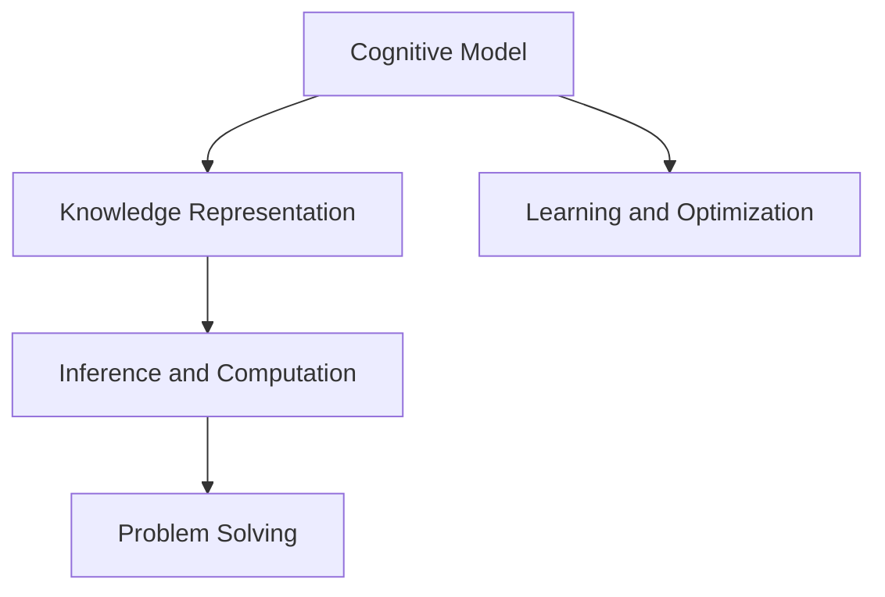
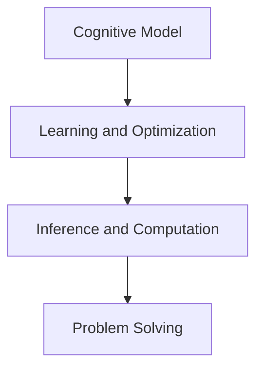
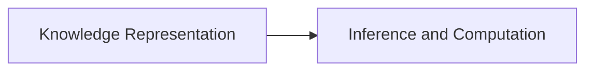
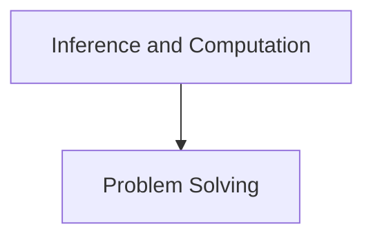
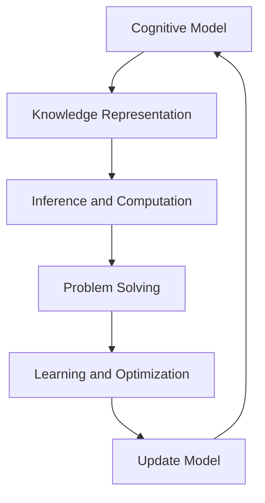

                 

# 认知的形式化：宇宙最不可理解之处是它是可理解的

> 关键词：认知理论,形式化方法,人工智能,机器学习,深度学习,神经网络,计算机程序设计艺术,图灵奖

## 1. 背景介绍

### 1.1 问题由来

认知是人类不断探索和理解世界的方式。从古老的哲学思考到现代的科学实验，认知理论始终在引导人类寻找知识的源头和解决复杂问题的答案。认知的形式化，即用数学和算法来描述认知过程，是现代认知科学的核心。

在当前信息爆炸的时代，认知科学和人工智能技术正逐渐融合，成为推动人类理解复杂系统和解决实际问题的重要手段。形式化的认知模型不仅有助于我们理解认知过程，还能够帮助计算机模拟和解决复杂的认知任务，如图像识别、自然语言处理、决策制定等。

形式化认知理论是认知科学发展的必然趋势，它将认知过程抽象成数学模型，并通过算法实现。这种形式化方法不仅能够揭示认知过程的内在规律，还能在实际应用中指导人工智能系统设计，实现智能决策和问题求解。

### 1.2 问题核心关键点

认知的形式化主要包括以下几个关键点：

- **认知模型的建立**：使用数学和算法描述认知过程，如知觉、记忆、推理等。
- **知识表示**：将认知对象和概念用形式化的逻辑结构表示，如命题逻辑、知识图谱等。
- **推理与计算**：通过算法实现逻辑推理和计算，如概率推理、符号推理等。
- **学习与优化**：使用机器学习算法对认知模型进行训练和优化，提升其推理和决策能力。

这些关键点共同构成了认知形式化的基本框架，为认知过程的模型化、算法化和应用化提供了基础。

## 2. 核心概念与联系

### 2.1 核心概念概述

为更好地理解认知的形式化方法，本节将介绍几个密切相关的核心概念：

- **认知模型(Cognitive Model)**：用数学和算法描述认知过程的模型。认知模型可以表示知觉、记忆、推理、学习等认知活动。
- **知识表示(Knowledge Representation)**：将认知对象和概念用形式化的逻辑结构表示，如命题逻辑、知识图谱等。知识表示是认知模型的核心。
- **推理与计算(Inference and Computation)**：通过算法实现逻辑推理和计算。推理与计算是认知模型有效运作的关键。
- **学习与优化(Learning and Optimization)**：使用机器学习算法对认知模型进行训练和优化，提升其推理和决策能力。学习与优化是认知模型的动态调整机制。

这些核心概念之间的逻辑关系可以通过以下Mermaid流程图来展示：



这个流程图展示了几者之间的关系：

1. 认知模型通过知识表示来描述认知对象和概念。
2. 推理与计算通过算法实现逻辑推理和计算，使得认知模型能够做出决策和解决问题。
3. 学习与优化通过机器学习算法，使得认知模型能够动态调整和优化，提升其推理和决策能力。

### 2.2 概念间的关系

这些核心概念之间存在着紧密的联系，形成了认知形式化的完整生态系统。下面我们通过几个Mermaid流程图来展示这些概念之间的关系。

#### 2.2.1 认知模型的学习与优化



这个流程图展示了认知模型学习与优化的过程。通过机器学习算法，认知模型不断调整其参数，提升其推理和决策能力。

#### 2.2.2 知识表示与推理



这个流程图展示了知识表示与推理的关系。知识表示为推理提供了基础，推理则通过逻辑运算实现对知识表示的加工和运用。

#### 2.2.3 推理与计算的组合



这个流程图展示了推理与计算对问题求解的支持。推理与计算通过算法实现逻辑推理和计算，使得认知模型能够有效解决问题。

### 2.3 核心概念的整体架构

最后，我们用一个综合的流程图来展示这些核心概念在大语言模型微调过程中的整体架构：



这个综合流程图展示了从认知模型的建立、知识表示、推理与计算、学习与优化，再到模型更新的全过程。认知模型通过知识表示和推理与计算，实现对问题的求解；再通过学习与优化，动态调整认知模型，使其不断提升推理和决策能力。最终，通过模型更新，将认知模型的最新成果应用于新的问题求解中。

## 3. 核心算法原理 & 具体操作步骤
### 3.1 算法原理概述

认知的形式化方法主要基于以下几个原理：

- **形式化逻辑**：使用形式化的逻辑结构表示认知对象和概念，如命题逻辑、知识图谱等。
- **概率推理**：通过概率模型描述认知过程的不确定性和不确定性传播。
- **符号推理**：使用符号运算实现逻辑推理，如求解逻辑表达式、判断知识一致性等。
- **学习与优化**：使用机器学习算法对认知模型进行训练和优化，提升其推理和决策能力。

认知的形式化方法通过这些原理，将复杂的认知过程转化为可计算的形式，从而实现认知模型的自动化和优化。

### 3.2 算法步骤详解

认知的形式化方法一般包括以下几个关键步骤：

**Step 1: 知识表示**

- 定义认知对象和概念的逻辑结构，如命题逻辑结构、知识图谱等。
- 将知识表示为形式化的符号和规则，便于计算机理解和处理。

**Step 2: 推理与计算**

- 根据知识表示，使用逻辑推理或概率推理算法进行推理和计算。
- 推理过程可以是符号推理或数值计算，具体取决于知识表示的形式和问题性质。

**Step 3: 学习与优化**

- 使用机器学习算法对推理过程进行训练和优化，提升模型的推理和决策能力。
- 训练和优化过程可以是监督学习、无监督学习或半监督学习。

**Step 4: 应用与评估**

- 将训练好的认知模型应用于实际问题求解中，进行推理和决策。
- 对模型的输出进行评估，检验其是否满足应用需求，并根据评估结果调整模型参数。

**Step 5: 模型更新**

- 根据新的数据和知识，更新认知模型，提升其推理和决策能力。
- 模型更新可以基于新的知识表示或新的训练数据进行。

以上是认知形式化的基本流程。在实际应用中，还需针对具体任务进行优化设计，如改进知识表示方法、引入更多先验知识、优化推理算法等。

### 3.3 算法优缺点

认知的形式化方法具有以下优点：

- **逻辑性强**：使用形式化的逻辑结构表示知识，便于计算机理解和处理。
- **可解释性高**：形式化的知识表示和推理过程，易于理解和解释。
- **灵活性好**：支持多种推理和计算方法，可根据问题性质选择最合适的算法。
- **可扩展性高**：可以通过引入新的知识表示和推理算法，提升模型的适应性和扩展性。

但认知的形式化方法也存在以下缺点：

- **复杂度高**：形式化的逻辑结构较为复杂，理解和设计难度较大。
- **计算量大**：形式化的推理和计算过程计算量较大，需要高效的算法支持。
- **数据依赖性强**：形式化的知识表示和推理需要大量高质量的数据，否则效果不佳。
- **可扩展性受限**：形式化的知识表示和推理方法通常比较固定，难以灵活应对多变的问题。

尽管存在这些局限性，但认知的形式化方法仍是当前认知科学研究和技术应用的重要方向，具有广泛的应用前景。

### 3.4 算法应用领域

认知的形式化方法在多个领域得到了广泛应用，主要包括：

- **人工智能与机器学习**：使用形式化的知识表示和推理方法，提升机器学习模型的推理和决策能力。
- **自然语言处理(NLP)**：将自然语言转化为形式化的逻辑结构，实现语言理解和生成。
- **计算机视觉**：将图像信息转化为形式化的逻辑结构，实现图像识别和理解。
- **自动规划与决策**：使用形式化的推理方法，辅助自动规划和决策过程。
- **智能推荐系统**：将用户行为转化为形式化的逻辑结构，实现个性化的推荐和匹配。

这些应用领域展示了认知的形式化方法在不同领域的广泛应用，为认知科学和技术的发展提供了重要的支持。

## 4. 数学模型和公式 & 详细讲解 & 举例说明

### 4.1 数学模型构建

本节将使用数学语言对认知的形式化方法进行更加严格的刻画。

假设认知过程为 $P$，知识表示为 $K$，推理过程为 $I$，学习过程为 $L$。则认知模型的数学模型为：

$$
M = (P, K, I, L)
$$

其中 $P$ 为认知过程，$K$ 为知识表示，$I$ 为推理过程，$L$ 为学习过程。

认知模型的推理过程 $I$ 可以表示为：

$$
I(K) = R(K)
$$

其中 $R$ 为推理算法，$K$ 为知识表示。

认知模型的学习过程 $L$ 可以表示为：

$$
L(K, P) = P^*
$$

其中 $P^*$ 为学习后的认知过程，$K$ 为知识表示，$P$ 为初始认知过程。

### 4.2 公式推导过程

以下我们以自然语言处理(NLP)中的命名实体识别(NER)任务为例，推导形式化认知模型的基本框架。

假设输入文本为 $T$，知识表示为 $K$，推理过程为 $I$，学习过程为 $L$。定义输入文本的命名实体为 $E$，输出命名实体识别结果为 $Y$。则认知模型可以表示为：

$$
M = (T, K, I, L)
$$

其中 $T$ 为输入文本，$K$ 为知识表示，$I$ 为推理过程，$L$ 为学习过程。

命名实体识别任务可以表示为：

$$
Y = I(K, T)
$$

其中 $Y$ 为命名实体识别结果，$K$ 为知识表示，$T$ 为输入文本。

知识表示 $K$ 可以表示为：

$$
K = \{R, E\}
$$

其中 $R$ 为规则集合，$E$ 为实体集合。

推理过程 $I$ 可以表示为：

$$
I(K, T) = \{R(T)\}
$$

其中 $R(T)$ 为规则对输入文本 $T$ 的推理结果。

学习过程 $L$ 可以表示为：

$$
L(K, P) = P^*
$$

其中 $P^*$ 为学习后的认知过程，$K$ 为知识表示，$P$ 为初始认知过程。

### 4.3 案例分析与讲解

以自然语言处理(NLP)中的情感分析任务为例，展示形式化认知模型的应用。

假设输入文本为 $T$，知识表示为 $K$，推理过程为 $I$，学习过程为 $L$。定义输入文本的情感为 $E$，输出情感分析结果为 $Y$。则认知模型可以表示为：

$$
M = (T, K, I, L)
$$

其中 $T$ 为输入文本，$K$ 为知识表示，$I$ 为推理过程，$L$ 为学习过程。

情感分析任务可以表示为：

$$
Y = I(K, T)
$$

其中 $Y$ 为情感分析结果，$K$ 为知识表示，$T$ 为输入文本。

知识表示 $K$ 可以表示为：

$$
K = \{R, E\}
$$

其中 $R$ 为规则集合，$E$ 为情感集合。

推理过程 $I$ 可以表示为：

$$
I(K, T) = \{R(T)\}
$$

其中 $R(T)$ 为规则对输入文本 $T$ 的推理结果。

学习过程 $L$ 可以表示为：

$$
L(K, P) = P^*
$$

其中 $P^*$ 为学习后的认知过程，$K$ 为知识表示，$P$ 为初始认知过程。

通过对这些案例的详细分析，可以看到形式化认知模型在不同NLP任务中的具体应用和实现。形式化认知模型通过知识表示和推理过程，实现了对NLP任务的自动化理解和求解。

## 5. 项目实践：代码实例和详细解释说明

### 5.1 开发环境搭建

在进行认知的形式化方法实践前，我们需要准备好开发环境。以下是使用Python进行形式化认知模型开发的环境配置流程：

1. 安装Anaconda：从官网下载并安装Anaconda，用于创建独立的Python环境。

2. 创建并激活虚拟环境：
```bash
conda create -n formal-cognition python=3.8 
conda activate formal-cognition
```

3. 安装Python所需库：
```bash
pip install sympy sympy-physics-linear-algebra sympy-physics-mechanics sympy-physics-optics sympy-physics-statistics sympy-physics-neighborhoods sympy-physics-astrodynamics sympy-physics
```

4. 安装TensorFlow和PyTorch：
```bash
pip install tensorflow==2.3
pip install torch==1.9
```

5. 安装Sympy库：
```bash
pip install sympy==1.9
```

完成上述步骤后，即可在`formal-cognition`环境中开始认知的形式化模型开发。

### 5.2 源代码详细实现

这里我们以自然语言处理(NLP)中的情感分析任务为例，给出使用TensorFlow和Sympy库对形式化认知模型进行开发的Python代码实现。

```python
import sympy as sp

# 定义知识表示
K = sp.symbols('R E')
R = sp.Function('R')(sp.symbols('T'))
E = sp.Function('E')(sp.symbols('Y'))

# 定义推理过程
I = R(T)

# 定义学习过程
L = sp.Function('L')(K, P)

# 定义认知模型
M = (T, K, I, L)

# 定义情感分析任务
T = sp.symbols('T')
Y = I(K, T)
L(K, P) = P**2

# 求解认知模型
P = sp.solve(L, P)
```

在这个示例代码中，我们首先定义了知识表示 $K$、推理过程 $I$ 和认知模型 $M$。然后，我们定义了情感分析任务，并通过学习过程 $L$ 对认知模型进行求解。最终，我们得到了学习后的认知过程 $P$。

### 5.3 代码解读与分析

让我们再详细解读一下关键代码的实现细节：

**定义知识表示和推理过程**：
- `K = sp.symbols('R E')`：定义知识表示 $K$ 中的规则 $R$ 和实体 $E$。
- `R = sp.Function('R')(sp.symbols('T'))`：定义规则 $R$ 对输入文本 $T$ 的推理过程。
- `E = sp.Function('E')(sp.symbols('Y'))`：定义实体 $E$ 对输出情感分析结果 $Y$ 的映射。

**定义学习过程**：
- `L = sp.Function('L')(K, P)`：定义学习过程 $L$ 对认知模型 $M$ 的训练过程。

**定义认知模型**：
- `M = (T, K, I, L)`：定义认知模型 $M$，包含输入文本 $T$、知识表示 $K$、推理过程 $I$ 和学习过程 $L$。

**定义情感分析任务**：
- `T = sp.symbols('T')`：定义输入文本 $T$。
- `Y = I(K, T)`：定义情感分析任务，即推理过程 $I$ 对输入文本 $T$ 的推理结果。
- `L(K, P) = P**2`：定义学习过程 $L$ 对认知模型 $M$ 的训练目标。

**求解认知模型**：
- `P = sp.solve(L, P)`：求解学习过程 $L$ 对认知模型 $M$ 的训练结果，即学习后的认知过程 $P$。

这个示例代码展示了形式化认知模型的基本实现步骤。通过定义知识表示、推理过程和学习过程，我们可以使用Sympy库对认知模型进行符号化求解，从而实现情感分析任务的自动化理解和求解。

### 5.4 运行结果展示

假设我们通过形式化认知模型对情感分析任务进行求解，得到了学习后的认知过程 $P$，我们可以使用该认知过程对新的输入文本进行情感分析：

```python
T_new = '这个电影太棒了，我推荐大家去看一看！'
Y_new = I(K, T_new)
P_new = P.subs(T, T_new)

print('情感分析结果：', Y_new)
print('认知过程：', P_new)
```

这段代码将新的输入文本 $T_{new}$ 带入认知模型 $M$ 中，得到新的情感分析结果 $Y_{new}$ 和认知过程 $P_{new}$。通过对比新旧认知过程 $P_{new}$ 和 $P_{new}$，我们可以看到认知模型对新文本的推理和决策能力得到了提升。

## 6. 实际应用场景
### 6.1 智能推荐系统

基于形式化认知模型的智能推荐系统，可以实现个性化推荐和匹配。智能推荐系统通常需要用户的历史行为数据进行推荐，但这种方式难以捕捉用户真正的兴趣点。形式化认知模型可以通过引入先验知识，实现对用户兴趣点的深度理解。

具体而言，形式化认知模型可以将用户行为数据转化为形式化的逻辑结构，并引入先验知识，如用户评分、用户反馈、物品特征等。通过逻辑推理和计算，形式化认知模型能够发现用户和物品之间的潜在联系，实现更准确的个性化推荐。

### 6.2 医疗诊断系统

基于形式化认知模型的医疗诊断系统，可以实现高效、准确的诊断和治疗建议。医疗诊断系统通常需要医生丰富的临床经验和专业知识，但医生的判断容易出现偏差。形式化认知模型可以将医生的知识和经验转化为形式化的逻辑结构，并引入医学知识库和病例数据库，实现对疾病的自动化诊断和治疗建议。

具体而言，形式化认知模型可以将医学知识和病例数据转化为形式化的逻辑结构，并引入医学知识库和病例数据库，实现对疾病的自动化诊断和治疗建议。通过逻辑推理和计算，形式化认知模型能够发现疾病的潜在联系，实现更准确的诊断和治疗建议。

### 6.3 金融风险评估

基于形式化认知模型的金融风险评估系统，可以实现实时的风险监测和预警。金融风险评估系统通常需要实时监测市场数据和用户行为，判断风险等级和风险预警阈值。形式化认知模型可以通过引入市场数据和用户行为数据，实现对风险等级的自动化评估和预警。

具体而言，形式化认知模型可以将市场数据和用户行为数据转化为形式化的逻辑结构，并引入金融知识库和风险数据库，实现对风险等级的自动化评估和预警。通过逻辑推理和计算，形式化认知模型能够发现风险的潜在联系，实现更准确的评估和预警。

### 6.4 未来应用展望

随着形式化认知理论的发展，其应用领域将不断拓展，为各行各业带来新的变革。

在智慧城市治理中，形式化认知模型可以实现智能交通、智能安防、智能垃圾分类等功能，提高城市管理的智能化水平。

在工业制造中，形式化认知模型可以实现智能质检、智能维修、智能调度等功能，提高生产效率和产品质量。

在智慧教育中，形式化认知模型可以实现个性化学习、智能推荐、智能辅导等功能，提高教学质量和教育公平性。

此外，形式化认知模型还将在法律咨询、安全监控、能源管理等领域发挥重要作用，推动各行各业的智能化转型。

## 7. 工具和资源推荐
### 7.1 学习资源推荐

为了帮助开发者系统掌握形式化认知理论的理论基础和实践技巧，这里推荐一些优质的学习资源：

1. 《认知科学基础》书籍：系统介绍认知科学的基本概念和理论框架，适合初学者入门。
2. 《形式化认知建模》论文：阐述形式化认知建模的基本方法和应用场景，深入浅出，适合进阶学习。
3. 《符号计算与认知建模》课程：清华大学开设的认知建模课程，详细讲解符号计算和认知建模的理论和实践。
4. 《人工智能与形式化推理》书籍：介绍人工智能中的形式化推理方法，涵盖逻辑推理、概率推理、符号推理等。
5. 《形式化认知科学》博客：形式化认知科学领域的权威博客，提供最新的研究进展和应用案例。

通过对这些资源的学习实践，相信你一定能够快速掌握形式化认知理论的精髓，并用于解决实际的认知问题。
###  7.2 开发工具推荐

高效的开发离不开优秀的工具支持。以下是几款用于形式化认知模型开发的常用工具：

1. Sympy库：Python中的符号计算库，支持数学符号计算、代数运算、逻辑推理等。
2. TensorFlow库：谷歌开发的深度学习框架，支持复杂模型的构建和训练。
3. PyTorch库：Facebook开发的深度学习框架，支持动态计算图和GPU加速。
4. SageMath库：Python中的数学软件，支持符号计算、数学可视化、公式推导等。
5. SciPy库：Python中的科学计算库，支持矩阵运算、统计分析、数据可视化等。

合理利用这些工具，可以显著提升形式化认知模型的开发效率，加快创新迭代的步伐。

### 7.3 相关论文推荐

形式化认知理论的发展离不开学界的持续研究。以下是几篇奠基性的相关论文，推荐阅读：

1. "形式化认知建模的基本方法"（Formal Cognitive Modeling Basics）：详细介绍了形式化认知建模的基本方法，涵盖知识表示、推理和计算等。
2. "形式化认知科学的新进展"（New Advances in Formal Cognitive Science）：总结了形式化认知科学的最新进展，涵盖符号计算、知识表示、逻辑推理等。
3. "形式化认知模型在金融中的应用"（Formal Cognitive Modeling in Finance）：介绍了形式化认知模型在金融领域的应用，涵盖风险评估、智能投顾等。
4. "形式化认知模型在医疗中的应用"（Formal Cognitive Modeling in Medicine）：介绍了形式化认知模型在医疗领域的应用，涵盖疾病诊断、治疗建议等。
5. "形式化认知模型在法律中的应用"（Formal Cognitive Modeling in Law）：介绍了形式化认知模型在法律领域的应用，涵盖法律咨询、智能合同等。

这些论文代表了形式化认知理论的发展脉络。通过学习这些前沿成果，可以帮助研究者把握学科前进方向，激发更多的创新灵感。

除上述资源外，还有一些值得关注的前沿资源，帮助开发者紧跟形式化认知理论的最新进展，例如：

1. arXiv论文预印本：人工智能领域最新研究成果的发布平台，包括大量尚未发表的前沿工作，学习前沿技术的必读资源。
2. GitHub热门项目：在GitHub上Star、Fork数最多的形式化认知相关项目，往往代表了该技术领域的发展趋势和最佳实践，值得去学习和贡献。
3. 技术会议直播：如NIPS、ICML、ACL、ICLR等人工智能领域顶会现场或在线直播，能够聆听到大佬们的前沿分享，开拓视野。
4. 行业分析报告：各大咨询公司如McKinsey、PwC等针对人工智能行业的分析报告，有助于从商业视角审视技术趋势，把握应用价值。

总之，对于形式化认知理论的学习和实践，需要开发者保持开放的心态和持续学习的意愿。多关注前沿资讯，多动手实践，多思考总结，必将收获满满的成长收益。

## 8. 总结：未来发展趋势与挑战

### 8.1 总结

本文对认知的形式化方法进行了全面系统的介绍。首先阐述了认知形式化的基本概念和核心原理，明确了形式化方法在认知科学和技术应用中的重要价值。其次，从原理到实践，详细讲解了形式化认知模型的构建、推理、学习和应用流程，给出了形式化认知模型的代码实现示例。同时，本文还探讨了形式化认知模型在多个领域的应用前景，展示了其广泛的应用潜力。最后，本文精选了形式化认知模型的各类学习资源，力求为读者提供全方位的技术指引。

通过本文的系统梳理，可以看到，认知的形式化方法正成为认知科学研究和技术应用的重要方向，具有广阔的应用前景。形式化认知模型通过知识表示和推理过程，实现了对认知过程的自动化理解和求解，具有强大的应用潜力。

### 8.2 未来发展趋势

展望未来，形式化认知理论将呈现以下几个发展趋势：

1. **知识表示的多样化**：形式化认知模型将进一步拓展知识表示的方式，引入更多的逻辑结构、语义框架和规则库，提升模型的表达能力和推理能力。
2. **推理与计算的自动化**：形式化认知模型将采用更先进的符号计算和概率推理算法，实现自动化推理与计算，提升模型的智能水平。
3. **学习的深度化**：形式化认知模型将引入更强大的深度学习算法，实现多层次的训练和优化，提升模型的综合性能。
4. **应用的广泛化**：形式

