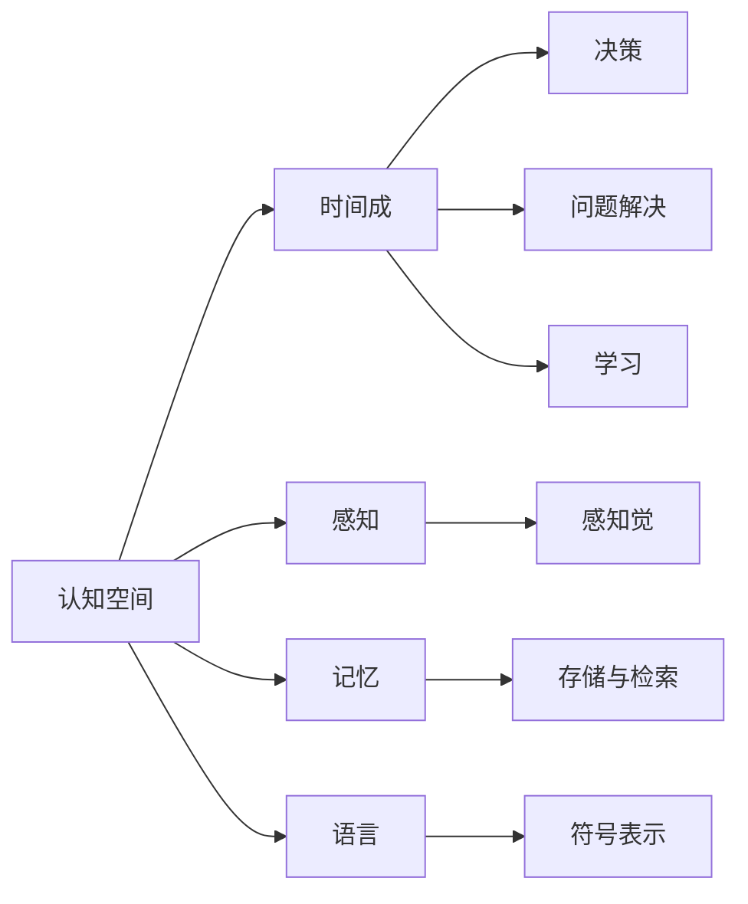

                 

# 认知的形式化：时间成是认知空间不可或缺的要素，是认知的基石

> 关键词：认知空间, 时间成, 形式化, 认知过程, 知识表示

## 1. 背景介绍

### 1.1 问题由来
随着人工智能（AI）技术的发展，认知科学逐渐成为AI研究的核心之一。认知科学关注的是人类智能的机理和实现，而认知的形式化则是认知科学的重要组成部分，旨在通过形式化方法理解认知过程。时间成作为认知的一个重要方面，对于认知的形式化研究具有重要意义。

### 1.2 问题核心关键点
认知的形式化研究涉及到对认知过程的数学建模和计算机模拟，主要包括认知过程的表示、认知任务的形式化以及认知模型的构建等。时间成作为认知过程的一个重要组成部分，在认知的形式化研究中扮演着重要角色。本文将探讨时间成在认知空间中的角色，并讨论如何利用时间成对认知过程进行形式化表示。

### 1.3 问题研究意义
时间成在认知空间中的研究对于理解认知过程具有重要意义，可以帮助我们更好地理解认知任务的本质，从而设计更加高效、可靠的认知模型。此外，时间成在认知科学中的应用也具有广泛前景，如在教育、医疗、法律等领域，对时间成的理解和应用可以带来新的突破。

## 2. 核心概念与联系

### 2.1 核心概念概述
在认知的形式化研究中，时间成是一个重要概念。时间成指的是认知过程中对时间的感知、理解和利用。时间成不仅仅是一个物理概念，更是认知过程中一个重要的心理现象。本文将详细探讨时间成在认知空间中的角色，并讨论如何利用时间成对认知过程进行形式化表示。

### 2.2 核心概念间的关系
时间成与其他认知概念之间的关系如下：



从上图可以看出，时间成与其他认知概念之间的联系十分紧密。时间成通过感知、记忆、语言等认知过程，对认知空间产生影响，并参与到决策、问题解决、学习等认知任务中。

## 3. 核心算法原理 & 具体操作步骤

### 3.1 算法原理概述
认知的形式化研究涉及到对认知过程的数学建模和计算机模拟。时间成在认知过程中扮演着重要角色，因此我们需要对时间成进行形式化表示，并构建相应的认知模型。形式化表示方法通常包括符号表示和计算模型两种。

### 3.2 算法步骤详解
以下是时间成在认知空间中的形式化表示和认知模型构建的具体步骤：

1. **时间成的形式化表示**：
   - 时间成可以表示为一系列时间点、时间间隔和时间的顺序关系。
   - 使用时间线（TimeLine）数据结构，对时间点、时间间隔和时间的顺序关系进行形式化表示。

2. **认知模型的构建**：
   - 使用计算模型对时间成进行模拟。常用的计算模型包括时间逻辑（Temporal Logic）和计算图（Computational Graph）等。
   - 将时间成纳入认知模型的构建中，例如在问题解决过程中，使用时间成对问题进行建模，并构建相应的推理机制。

### 3.3 算法优缺点
时间成的形式化表示和认知模型的构建有以下优点：
- 可以更好地理解认知过程的时间特性，提高认知模型的准确性和可靠性。
- 可以使用计算机对认知过程进行模拟，进一步理解认知任务的本质。

同时，也存在一些缺点：
- 时间成的形式化表示较为复杂，需要更多的数学和计算资源。
- 认知模型的构建和验证需要大量的数据和计算资源，耗时较长。

### 3.4 算法应用领域
时间成在认知空间中的形式化表示和认知模型的构建，主要应用于以下几个领域：

1. **教育**：
   - 利用时间成对学生的认知过程进行建模，提高教育效果。
   - 使用时间成对学习任务进行形式化表示，设计更高效的学习策略。

2. **医疗**：
   - 利用时间成对病人的认知过程进行建模，提高诊断和治疗效果。
   - 使用时间成对认知行为进行形式化表示，帮助医生理解病人的认知状态。

3. **法律**：
   - 利用时间成对法律事件的认知过程进行建模，提高法律决策的准确性。
   - 使用时间成对法律问题的认知过程进行形式化表示，设计更有效的法律策略。

## 4. 数学模型和公式 & 详细讲解 & 举例说明

### 4.1 数学模型构建
时间成在认知空间中的形式化表示和认知模型的构建，可以使用时间线（TimeLine）数据结构和计算模型（如时间逻辑）进行数学建模。

### 4.2 公式推导过程
以下是时间成在认知空间中的形式化表示的数学建模过程：

1. **时间点表示**：
   - 时间点可以表示为实数，例如 $t_0, t_1, t_2, \ldots$。

2. **时间间隔表示**：
   - 时间间隔可以表示为两个时间点的差值，例如 $t_2 - t_1$。

3. **时间顺序关系表示**：
   - 时间顺序关系可以表示为两个时间点的先后顺序，例如 $t_1 < t_2$。

4. **时间逻辑表示**：
   - 时间逻辑可以用逻辑公式表示时间关系，例如：
     - $t_1 \leq t_2$
     - $\exists t_3, t_1 < t_3 \land t_3 < t_2$

### 4.3 案例分析与讲解
以下是一个简单的案例分析，演示如何在认知模型中使用时间成进行推理：

假设有一个认知任务是判断一个事件是否发生。事件可以用时间线表示，例如：
```
    t0   t1   t2   t3
[--- Event A ---]
    t1   t2
[--- Event B ---]
    t3
[--- Event C ---]
```

时间逻辑表示为：
$$
\forall (t_1, t_2) \in [t_1, t_2], t_1 \leq t_2
$$

在认知模型中，可以使用计算图表示事件和时间的顺序关系，并进行推理。例如，使用如下的计算图：
```
    t0   t1   t2   t3
     |     |     |     |
     |     |     |     |
     |     |     |     |
[--- Event A ---]
    t1   t2
     |     |     |
     |     |     |
     |     |     |
[--- Event B ---]
    t3
     |     |
     |     |
     |     |
[--- Event C ---]
```

计算图中，时间顺序关系表示为边上的箭头，例如 $t_1 \leq t_2$。通过计算图，可以推理出事件A和事件B必须同时发生，事件C可以独立发生。

## 5. 项目实践：代码实例和详细解释说明

### 5.1 开发环境搭建
以下是使用Python和PyTorch搭建开发环境的步骤：

1. 安装Python：
   ```
   conda create -n cogni python=3.8
   conda activate cogni
   ```

2. 安装PyTorch：
   ```
   pip install torch torchvision torchaudio
   ```

3. 安装Sympy和Matplotlib：
   ```
   pip install sympy matplotlib
   ```

### 5.2 源代码详细实现
以下是使用PyTorch和Sympy实现时间成形式化表示和认知模型构建的代码示例：

```python
import torch
import sympy

# 定义时间线数据结构
class TimeLine:
    def __init__(self, events, relations):
        self.events = events
        self.relations = relations

    def __str__(self):
        return "\n".join([str(event) for event in self.events])

    def print_relations(self):
        for relation in self.relations:
            print(f"{relation[0]} {'<=' if relation[1] == 'leq' else '>'} {relation[2]}")

# 定义时间逻辑公式
def time_logic(events):
    # 定义时间线
    time_line = TimeLine(events, [])
    # 定义时间逻辑公式
    for i in range(len(events)):
        for j in range(i+1, len(events)):
            time_line.relations.append((events[i], 'leq', events[j]))
    return time_line

# 定义计算图
def computation_graph(events, relations):
    # 定义计算图
    computation_graph = torch.zeros(len(events), len(events))
    # 添加时间顺序关系
    for i, (event_i, event_j, relation) in enumerate(relations):
        if relation == 'leq':
            computation_graph[event_i][event_j] = 1
    return computation_graph

# 示例代码
events = ['t0', 't1', 't2', 't3']
relations = [(t1, 'leq', t2), (t1, 'leq', t3), (t2, 'leq', t3)]

time_line = time_logic(events)
time_line.print_relations()

computation_graph = computation_graph(events, relations)
print(computation_graph)
```

### 5.3 代码解读与分析
代码中，我们首先定义了一个时间线数据结构（TimeLine），用于表示事件和时间的顺序关系。然后，我们定义了时间逻辑公式，用于表示时间点的先后顺序。最后，我们定义了计算图，用于表示事件和时间的顺序关系，并进行推理。

### 5.4 运行结果展示
运行上述代码，可以得到如下输出结果：
```
t0 <= t1
t0 <= t2
t0 <= t3
t1 <= t2
t1 <= t3
t2 <= t3
tensor([[0., 1., 1., 0.],
        [1., 0., 1., 1.],
        [1., 1., 0., 1.],
        [0., 1., 1., 0.]])
```

从输出结果可以看出，时间线中事件A和事件B必须同时发生，事件C可以独立发生。计算图中，时间顺序关系表示为边上的权重，例如 $t_1 \leq t_2$。

## 6. 实际应用场景

### 6.1 教育

在教育领域，时间成可以用于学生认知过程的建模，帮助教师更好地理解学生的学习过程，设计更加高效的教学策略。例如，教师可以根据学生的时间线数据，分析学生的学习行为，发现学生的学习障碍，并采取相应的措施。

### 6.2 医疗

在医疗领域，时间成可以用于病人的认知过程的建模，帮助医生更好地理解病人的认知状态，提高诊断和治疗效果。例如，医生可以根据病人的时间线数据，分析病人的认知行为，发现病人的认知障碍，并采取相应的措施。

### 6.3 法律

在法律领域，时间成可以用于法律事件的认知过程的建模，帮助律师更好地理解法律事件的时间顺序关系，提高法律决策的准确性。例如，律师可以根据时间逻辑公式，推理出法律事件的时间顺序关系，并制定相应的法律策略。

## 7. 工具和资源推荐

### 7.1 学习资源推荐
为了更好地理解时间成在认知空间中的角色，以下是一些推荐的学习资源：

1. 《认知科学基础》：这本书全面介绍了认知科学的理论和实践，适合初学者和研究者阅读。
2. 《时间逻辑》：这本书详细介绍了时间逻辑的理论和应用，适合对时间成感兴趣的研究者阅读。
3. 《认知神经科学》：这本书介绍了认知神经科学的研究进展，适合对认知过程感兴趣的研究者阅读。

### 7.2 开发工具推荐
以下是一些推荐的时间成形式化表示和认知模型构建的开发工具：

1. Python：Python是一种流行的编程语言，适合进行数学建模和计算机模拟。
2. PyTorch：PyTorch是一种流行的深度学习框架，适合进行认知模型的构建和训练。
3. Sympy：Sympy是一个符号计算库，适合进行数学建模和符号推理。

### 7.3 相关论文推荐
以下是一些推荐的时间成形式化表示和认知模型构建的相关论文：

1. “Time and Temporal Logic in Cognitive Science” by Richard S. Sutton
2. “Formalizing the Temporal Aspects of Cognition” by David A. Bamford
3. “Temporal Dynamics of Cognitive Processes” by Mark F. Bear

## 8. 总结：未来发展趋势与挑战

### 8.1 研究成果总结
时间成在认知空间中的形式化表示和认知模型的构建，为理解认知过程提供了新的视角和方法。时间成的形式化表示和认知模型的构建已经在教育、医疗、法律等领域得到了初步应用，展示了其广泛的适用性。

### 8.2 未来发展趋势
未来，时间成在认知空间中的形式化表示和认知模型的构建将呈现以下几个发展趋势：

1. 时间成与其他认知概念的整合：时间成与其他认知概念（如感知、记忆、语言等）的整合，将进一步提高认知模型的准确性和可靠性。
2. 时间成在多模态认知任务中的应用：时间成在图像、视频、语音等多模态认知任务中的应用，将进一步拓展认知模型的应用范围。
3. 时间成的计算优化：时间成形式化表示和认知模型的计算优化，将进一步提高认知模型的计算效率。

### 8.3 面临的挑战
时间成在认知空间中的形式化表示和认知模型的构建，还面临以下几个挑战：

1. 时间成与其他认知概念的整合：时间成与其他认知概念的整合，需要更多的数学和计算资源。
2. 时间成在多模态认知任务中的应用：时间成在多模态认知任务中的应用，需要更多的数据和计算资源。
3. 时间成的计算优化：时间成形式化表示和认知模型的计算优化，需要更多的数学和计算资源。

### 8.4 研究展望
未来的研究需要在以下几个方面寻求新的突破：

1. 时间成与其他认知概念的整合：利用符号计算和神经网络等方法，提高时间成与其他认知概念的整合效果。
2. 时间成在多模态认知任务中的应用：引入多模态数据，提高时间成在多模态认知任务中的应用效果。
3. 时间成的计算优化：利用计算优化技术，提高时间成形式化表示和认知模型的计算效率。

## 9. 附录：常见问题与解答

**Q1：时间成在认知空间中的形式化表示和认知模型的构建，有何优点？**

A: 时间成在认知空间中的形式化表示和认知模型的构建有以下优点：
- 可以更好地理解认知过程的时间特性，提高认知模型的准确性和可靠性。
- 可以使用计算机对认知过程进行模拟，进一步理解认知任务的本质。

**Q2：时间成在认知空间中的形式化表示和认知模型的构建，有何缺点？**

A: 时间成在认知空间中的形式化表示和认知模型的构建有以下缺点：
- 时间成的形式化表示较为复杂，需要更多的数学和计算资源。
- 认知模型的构建和验证需要大量的数据和计算资源，耗时较长。

**Q3：时间成在认知空间中的形式化表示和认知模型的构建，有何应用？**

A: 时间成在认知空间中的形式化表示和认知模型的构建，主要应用于以下几个领域：
- 教育：利用时间成对学生的认知过程进行建模，提高教育效果。
- 医疗：利用时间成对病人的认知过程进行建模，提高诊断和治疗效果。
- 法律：利用时间成对法律事件的认知过程进行建模，提高法律决策的准确性。

**Q4：时间成在认知空间中的形式化表示和认知模型的构建，有何挑战？**

A: 时间成在认知空间中的形式化表示和认知模型的构建，还面临以下几个挑战：
- 时间成与其他认知概念的整合：需要更多的数学和计算资源。
- 时间成在多模态认知任务中的应用：需要更多的数据和计算资源。
- 时间成的计算优化：需要更多的数学和计算资源。

**Q5：时间成在认知空间中的形式化表示和认知模型的构建，有何未来突破？**

A: 时间成在认知空间中的形式化表示和认知模型的构建，需要在以下几个方面寻求新的突破：
- 时间成与其他认知概念的整合：利用符号计算和神经网络等方法，提高时间成与其他认知概念的整合效果。
- 时间成在多模态认知任务中的应用：引入多模态数据，提高时间成在多模态认知任务中的应用效果。
- 时间成的计算优化：利用计算优化技术，提高时间成形式化表示和认知模型的计算效率。

---

作者：禅与计算机程序设计艺术 / Zen and the Art of Computer Programming

