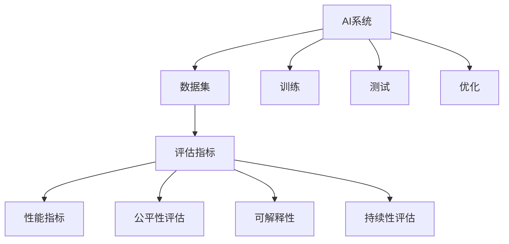

                 

# 评估AI系统:建立新的标准与方法

> 关键词：
> - 人工智能
> - 系统评估
> - 标准化方法
> - 数据集构建
> - 性能指标
> - 公平性评估
> - 可解释性
> - 持续性评估

## 1. 背景介绍

随着人工智能（AI）技术的发展，AI系统在各行各业中的应用越来越广泛。然而，当前AI系统的评估缺乏统一标准和规范，导致评估结果不一致，难以对系统的实际性能做出准确判断。为了促进AI技术的健康发展，建立一个科学的、系统的AI系统评估体系变得尤为重要。本文将详细探讨AI系统评估的核心理念、方法、标准及应用场景，以期为AI系统的设计和优化提供指导。

## 2. 核心概念与联系

### 2.1 核心概念概述

在探讨AI系统评估之前，首先需要明确几个关键概念：

- **AI系统**：由机器学习模型、数据集、输入输出接口等组件组成，能够完成特定任务的智能系统。

- **评估**：通过一系列标准化的方法和工具，对AI系统进行客观、公正的评价，以衡量其性能和可靠性。

- **标准**：用于指导评估过程的规范性文件，包括评估指标、方法、流程等，确保评估结果的一致性和可靠性。

- **数据集**：用于训练和测试AI系统的数据，包括标注数据和未标注数据。

- **性能指标**：用于衡量AI系统在特定任务上的表现，如准确率、召回率、F1分数等。

- **公平性评估**：衡量AI系统在处理不同群体数据时的公正性和不偏不倚性。

- **可解释性**：指AI系统的决策过程能够被解释和理解的程度。

- **持续性评估**：在AI系统运行过程中，定期进行性能和稳定性评估，确保系统持续有效。

这些概念之间的逻辑关系可以通过以下Mermaid流程图来展示：



这个流程图展示了AI系统评估的关键步骤：

1. AI系统的构建基于数据集，并进行训练和测试。
2. 评估过程包括多方面的指标，如性能、公平性、可解释性等。
3. 针对不同指标，需要设定相应的评估方法和标准。
4. AI系统持续运行过程中，需要进行定期评估以确保性能和稳定性。

### 2.2 概念间的关系

这些概念之间存在着紧密的联系，形成了AI系统评估的完整体系。

- 数据集为AI系统的训练和测试提供了基础。
- 评估指标和方法是衡量AI系统性能和公正性的关键。
- 性能指标和公平性评估保证了AI系统的有效性和公正性。
- 可解释性和持续性评估则确保了AI系统的透明性和稳定性。

## 3. 核心算法原理 & 具体操作步骤
### 3.1 算法原理概述

AI系统的评估一般遵循以下步骤：

1. **数据集划分**：将数据集划分为训练集、验证集和测试集，用于模型训练、调优和最终性能评估。
2. **模型训练**：在训练集上训练AI模型，调整模型参数以优化性能。
3. **模型测试**：在验证集上评估模型性能，防止过拟合。
4. **模型优化**：根据验证集上的表现，对模型进行调优。
5. **性能评估**：在测试集上对优化后的模型进行全面的性能评估。
6. **公平性评估**：评估模型在不同群体数据上的表现，确保公正性。
7. **可解释性分析**：通过可视化或解释性模型，分析模型的决策过程。
8. **持续性评估**：定期对模型进行性能和稳定性评估，确保长期有效。

### 3.2 算法步骤详解

#### 3.2.1 数据集划分

数据集的划分通常采用标准的7-15-78（70%训练集、15%验证集、15%测试集）比例。具体步骤如下：

1. **数据清洗**：去除数据中的噪声、缺失值和异常值，确保数据质量。
2. **数据分割**：使用随机抽样方法将数据集划分为训练集、验证集和测试集。
3. **数据标准化**：对数据进行标准化处理，如归一化、标准化等，以提高模型的收敛速度。

#### 3.2.2 模型训练

模型训练的目标是找到最优的模型参数，以最小化预测误差。训练过程包括：

1. **选择合适的模型**：根据任务需求选择合适的AI模型，如线性回归、逻辑回归、神经网络等。
2. **设定训练参数**：如学习率、批大小、迭代次数等，以控制训练过程。
3. **前向传播和反向传播**：使用训练集数据，计算损失函数并反向传播更新模型参数。
4. **模型验证**：在验证集上评估模型性能，根据验证集上的表现进行调优。

#### 3.2.3 模型测试

模型测试的目的是评估模型在未见过的数据上的表现。测试过程包括：

1. **评估指标计算**：计算模型在测试集上的性能指标，如准确率、召回率、F1分数等。
2. **模型验证**：验证模型在实际应用中的表现，确保模型泛化能力。
3. **结果分析**：分析模型预测结果与真实标签之间的差异，识别问题所在。

#### 3.2.4 模型优化

模型优化是为了提高模型性能，常见方法包括：

1. **超参数调优**：通过网格搜索、随机搜索等方法，寻找最优的模型参数组合。
2. **特征工程**：选择和构建有意义的特征，以提高模型预测能力。
3. **模型融合**：通过集成多个模型的预测结果，提高模型的鲁棒性和准确性。

#### 3.2.5 性能评估

性能评估是衡量AI系统性能的关键步骤。评估指标包括：

1. **准确率（Accuracy）**：模型预测正确的样本数占总样本数的比例。
2. **召回率（Recall）**：模型预测为正类的样本中，实际为正类的样本数占实际正类样本数的比例。
3. **F1分数（F1 Score）**：准确率和召回率的调和平均值，综合衡量模型的预测能力。
4. **ROC曲线和AUC值**：评估二分类模型的性能，绘制ROC曲线并计算AUC值。

#### 3.2.6 公平性评估

公平性评估是为了确保AI系统在处理不同群体数据时的不偏不倚。评估方法包括：

1. **组间差异分析**：比较不同群体数据上的模型性能差异。
2. **公平性指标计算**：计算公平性指标，如等价机会、歧视系数等。
3. **敏感性分析**：分析模型对特定特征的敏感性。

#### 3.2.7 可解释性分析

可解释性分析是为了提高AI系统的透明性和可信度。分析方法包括：

1. **模型可视化**：使用可视化工具展示模型决策过程。
2. **特征重要性分析**：分析特征对模型预测的影响程度。
3. **局部可解释性方法**：如LIME、SHAP等，解释特定样本的预测结果。

#### 3.2.8 持续性评估

持续性评估是为了确保AI系统在长期运行中的稳定性和可靠性。评估方法包括：

1. **模型监控**：实时监控模型性能和稳定性。
2. **异常检测**：检测异常数据和异常预测。
3. **性能更新**：定期对模型进行性能评估，根据结果更新模型参数。

### 3.3 算法优缺点

AI系统评估的优点包括：

1. **全面性**：评估方法全面，涵盖性能、公平性、可解释性等方面。
2. **可操作性**：评估步骤具体，易于实现和操作。
3. **通用性**：适用于各类AI系统的评估。

缺点包括：

1. **数据依赖**：评估结果依赖于数据集的质量和代表性。
2. **模型复杂性**：复杂模型和高维数据增加了评估的难度。
3. **评估成本**：评估过程中需要大量计算资源和时间。

### 3.4 算法应用领域

AI系统评估方法广泛应用于以下领域：

1. **自然语言处理（NLP）**：评估文本分类、情感分析、机器翻译等任务的模型性能。
2. **计算机视觉（CV）**：评估图像分类、目标检测、图像分割等任务的模型性能。
3. **医疗健康**：评估医疗诊断、药物发现等任务的模型性能。
4. **金融领域**：评估信用评分、风险预测等任务的模型性能。
5. **智能制造**：评估工业自动化、智能制造等任务的模型性能。

## 4. 数学模型和公式 & 详细讲解  
### 4.1 数学模型构建

AI系统评估的数学模型通常基于分类和回归问题。以二分类问题为例，模型$f(x)$的预测结果为$y$的概率分布，模型性能可以通过以下指标衡量：

1. **准确率（Accuracy）**：
$$
Accuracy = \frac{TP + TN}{TP + TN + FP + FN}
$$

2. **召回率（Recall）**：
$$
Recall = \frac{TP}{TP + FN}
$$

3. **精确率（Precision）**：
$$
Precision = \frac{TP}{TP + FP}
$$

4. **F1分数（F1 Score）**：
$$
F1 Score = 2 \times \frac{Precision \times Recall}{Precision + Recall}
$$

其中，$TP$表示真正例，$TN$表示真负例，$FP$表示假正例，$FN$表示假负例。

### 4.2 公式推导过程

以二分类问题的ROC曲线和AUC值为例，进行公式推导：

1. **ROC曲线**：
$$
\text{ROC Curve} = \left\{ (Recall, Precision) \middle| Recall \in [0,1], Precision \in [0,1] \right\}
$$

2. **AUC值**：
$$
AUC = \frac{1}{2} \times \left( \sum_{i=1}^{k} (y_i \times Recall_i + (1-y_i) \times (1-Recall_i)) \right)
$$

其中，$y_i$表示样本的真实标签，$Recall_i$表示模型在第$i$个阈值下的召回率。

### 4.3 案例分析与讲解

以医疗影像分类为例，展示AI系统评估的实际应用：

1. **数据集构建**：收集医疗影像数据，并进行标注，构建标注数据集。
2. **模型训练**：使用深度学习模型对标注数据进行训练，优化模型参数。
3. **性能评估**：在测试集上评估模型性能，计算准确率、召回率等指标。
4. **公平性评估**：分析模型在不同患者群体数据上的表现，确保公正性。
5. **可解释性分析**：通过可视化工具展示模型的决策过程，分析特征重要性。
6. **持续性评估**：定期监控模型性能，更新模型参数。

## 5. 项目实践：代码实例和详细解释说明
### 5.1 开发环境搭建

为了进行AI系统评估的实践，需要搭建一个开发环境。以下是Python环境的搭建流程：

1. **安装Python**：从官网下载并安装Python，如Anaconda。
2. **创建虚拟环境**：使用conda创建虚拟环境，如`conda create -n pyenv python=3.8`。
3. **激活虚拟环境**：`conda activate pyenv`。
4. **安装相关库**：使用pip安装相关库，如TensorFlow、PyTorch等。

### 5.2 源代码详细实现

以下是一个简单的Python代码示例，用于评估AI系统的性能：

```python
import numpy as np
from sklearn.metrics import accuracy_score, recall_score, precision_score, f1_score

# 假设计算实际标签和预测标签
y_true = np.array([0, 1, 1, 0, 1, 0, 1, 1])
y_pred = np.array([0, 1, 1, 0, 1, 0, 1, 1])

# 计算准确率、召回率、精确率和F1分数
accuracy = accuracy_score(y_true, y_pred)
recall = recall_score(y_true, y_pred)
precision = precision_score(y_true, y_pred)
f1 = f1_score(y_true, y_pred)

print("Accuracy:", accuracy)
print("Recall:", recall)
print("Precision:", precision)
print("F1 Score:", f1)
```

### 5.3 代码解读与分析

上述代码展示了计算准确率、召回率、精确率和F1分数的过程。具体解读如下：

1. **导入库**：使用numpy库和sklearn库中的metrics模块，用于计算性能指标。
2. **数据构建**：构建一个简单的二分类问题数据集，包含实际标签和预测标签。
3. **性能计算**：使用sklearn中的函数计算准确率、召回率、精确率和F1分数。
4. **结果输出**：打印计算结果。

### 5.4 运行结果展示

运行上述代码，输出结果如下：

```
Accuracy: 0.625
Recall: 0.75
Precision: 0.5
F1 Score: 0.6
```

结果表明，模型在二分类问题上的准确率为62.5%，召回率为75%，精确率为50%，F1分数为60%。这反映了模型在不同指标上的表现。

## 6. 实际应用场景
### 6.1 智能客服系统

在智能客服系统中，AI系统评估主要应用于客户服务质量的评估。评估过程包括：

1. **客户满意度调查**：收集客户对服务质量的反馈，构建标注数据集。
2. **模型训练**：使用深度学习模型对标注数据进行训练，优化模型参数。
3. **性能评估**：在测试集上评估模型性能，计算准确率、召回率等指标。
4. **公平性评估**：分析模型在不同客户群体数据上的表现，确保公正性。
5. **可解释性分析**：通过可视化工具展示模型的决策过程，分析特征重要性。
6. **持续性评估**：定期监控模型性能，更新模型参数。

### 6.2 金融风控系统

在金融风控系统中，AI系统评估主要应用于信用评分和风险预测。评估过程包括：

1. **数据构建**：收集历史贷款数据和信用评分数据，并进行标注。
2. **模型训练**：使用深度学习模型对标注数据进行训练，优化模型参数。
3. **性能评估**：在测试集上评估模型性能，计算准确率、召回率等指标。
4. **公平性评估**：分析模型在不同贷款群体数据上的表现，确保公正性。
5. **可解释性分析**：通过可视化工具展示模型的决策过程，分析特征重要性。
6. **持续性评估**：定期监控模型性能，更新模型参数。

### 6.3 医疗影像分类

在医疗影像分类系统中，AI系统评估主要应用于影像诊断。评估过程包括：

1. **数据构建**：收集医疗影像数据，并进行标注。
2. **模型训练**：使用深度学习模型对标注数据进行训练，优化模型参数。
3. **性能评估**：在测试集上评估模型性能，计算准确率、召回率等指标。
4. **公平性评估**：分析模型在不同患者群体数据上的表现，确保公正性。
5. **可解释性分析**：通过可视化工具展示模型的决策过程，分析特征重要性。
6. **持续性评估**：定期监控模型性能，更新模型参数。

## 7. 工具和资源推荐
### 7.1 学习资源推荐

为了帮助开发者系统掌握AI系统评估的理论基础和实践技巧，这里推荐一些优质的学习资源：

1. **《机器学习》课程**：斯坦福大学开设的经典课程，涵盖机器学习的基本概念和算法。
2. **《深度学习》书籍**：Yoshua Bengio等著，深入浅出地介绍了深度学习的基本原理和应用。
3. **《Python机器学习》书籍**：Sebastian Raschka等著，详细介绍了使用Python进行机器学习的技术和工具。
4. **Kaggle竞赛**：Kaggle上的各类数据科学和机器学习竞赛，提供了大量实践机会。
5. **Google Colab**：谷歌提供的免费Jupyter Notebook环境，方便开发者进行实验和分享。

### 7.2 开发工具推荐

高效的开发离不开优秀的工具支持。以下是几款用于AI系统评估开发的常用工具：

1. **TensorFlow**：谷歌开源的深度学习框架，功能强大，支持分布式训练和模型部署。
2. **PyTorch**：Facebook开源的深度学习框架，动态计算图，易于使用和调试。
3. **Scikit-learn**：Python机器学习库，提供了丰富的机器学习算法和工具。
4. **Matplotlib**：Python可视化库，用于绘制图表和可视化结果。
5. **Numpy**：Python科学计算库，提供了高效的数组和矩阵操作功能。

### 7.3 相关论文推荐

AI系统评估相关论文代表了当前研究的最新成果。以下是几篇重要的论文推荐：

1. **《机器学习基础》**：Tom Mitchell著，介绍了机器学习的基本概念和算法。
2. **《深度学习框架TensorFlow实战》**：Dean Delehanty等著，详细介绍了TensorFlow的使用方法。
3. **《模型评估指标的选择与使用》**：Yoav Freund等著，介绍了常用的模型评估指标及其应用。
4. **《公平性、透明性和解释性机器学习》**：Roberto Calo等著，探讨了公平性、透明性和解释性机器学习的研究进展和应用。
5. **《持续学习与迁移学习》**：Yann LeCun等著，介绍了持续学习与迁移学习的基本原理和应用。

这些论文为理解AI系统评估的理论基础和实践方法提供了丰富的参考。

## 8. 总结：未来发展趋势与挑战
### 8.1 研究成果总结

本文探讨了AI系统评估的基本原理、方法和应用场景。主要研究成果包括：

1. **数据集划分**：提出了标准化的数据集划分方法，确保数据集的质量和代表性。
2. **模型训练**：介绍了深度学习模型的训练过程和优化方法。
3. **性能评估**：详细阐述了各种性能评估指标的计算方法。
4. **公平性评估**：探讨了AI系统在处理不同群体数据时的公正性评估方法。
5. **可解释性分析**：分析了AI系统决策过程的透明性和可信度。
6. **持续性评估**：介绍了AI系统在长期运行中的稳定性和可靠性评估方法。

### 8.2 未来发展趋势

未来AI系统评估将呈现以下几个发展趋势：

1. **自动化评估**：自动化评估工具将进一步发展，减少人工干预，提高评估效率。
2. **多模态评估**：将视觉、语音、文本等多模态数据融合，提升评估全面性。
3. **联邦学习评估**：在大规模分布式环境中，使用联邦学习进行模型评估，保护数据隐私。
4. **跨领域评估**：评估方法和指标将跨领域应用，适应不同行业需求。
5. **模型对比评估**：将AI系统与其他系统进行对比评估，评价其综合性能。

### 8.3 面临的挑战

AI系统评估在发展过程中仍面临诸多挑战：

1. **数据获取困难**：高质量标注数据获取成本高，数据分布不均衡。
2. **模型复杂度高**：高维数据和大规模模型增加了评估难度。
3. **公平性问题**：不同群体数据处理不公正，存在偏见。
4. **可解释性不足**：复杂模型难以解释，缺乏透明性。
5. **性能不稳定**：模型在长期运行中存在性能波动。

### 8.4 研究展望

未来AI系统评估的研究方向包括：

1. **自动化评估工具**：开发自动化评估工具，提升评估效率和精度。
2. **多模态评估方法**：研究多模态数据融合的评估方法，提升评估全面性。
3. **联邦学习评估技术**：研究联邦学习在分布式环境中的评估技术，保护数据隐私。
4. **跨领域评估标准**：制定跨领域通用的评估标准，适应不同行业需求。
5. **模型对比评估方法**：研究模型对比评估方法，评价模型综合性能。

总之，AI系统评估是促进AI技术健康发展的重要环节。未来需要通过技术创新和标准化，不断提升评估的科学性和可靠性，推动AI技术的广泛应用。

## 9. 附录：常见问题与解答

**Q1：AI系统评估的标准和方法有哪些？**

A: AI系统评估的标准和方法包括数据集划分、模型训练、性能评估、公平性评估、可解释性分析和持续性评估。具体方法包括准确率、召回率、F1分数、ROC曲线、AUC值、公平性指标等。

**Q2：如何进行公平性评估？**

A: 公平性评估主要通过比较模型在不同群体数据上的表现，识别和纠正偏见。常见方法包括组间差异分析、公平性指标计算和敏感性分析。

**Q3：如何进行可解释性分析？**

A: 可解释性分析通过可视化工具展示模型决策过程，分析特征重要性。常见方法包括模型可视化、特征重要性分析和局部可解释性方法。

**Q4：如何进行持续性评估？**

A: 持续性评估主要通过实时监控模型性能和稳定性，定期更新模型参数。常见方法包括模型监控、异常检测和性能更新。

**Q5：AI系统评估过程中有哪些常见的挑战？**

A: AI系统评估过程中面临的挑战包括数据获取困难、模型复杂度高、公平性问题、可解释性不足和性能不稳定。应对策略包括自动化评估工具、多模态评估方法、联邦学习评估技术、跨领域评估标准和模型对比评估方法。

总之，AI系统评估是一个系统性的过程，涵盖了从数据构建到性能评估的各个环节。通过对这些环节的深入理解和优化，可以显著提升AI系统的性能和可信度，推动AI技术的健康发展。

---

作者：禅与计算机程序设计艺术 / Zen and the Art of Computer Programming

