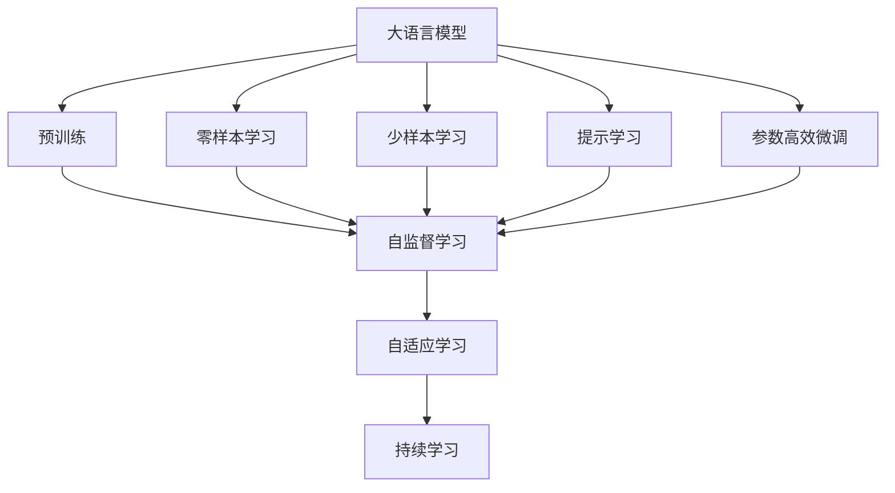

                 

# 大语言模型原理基础与前沿 不需要额外训练即可利用预训练模型

## 1. 背景介绍

近年来，大语言模型在自然语言处理(NLP)领域取得了巨大的突破。这些模型通过在大规模无标签文本语料上进行预训练，学习到丰富的语言知识，能够自动完成多种自然语言任务，如文本分类、命名实体识别、情感分析、翻译、问答等。虽然这些模型在预训练过程中没有使用标注数据，但其在标注数据上的表现往往优于从头训练的模型。

本博客旨在探讨大语言模型的原理基础和前沿技术，并阐述如何利用预训练模型直接应用于各种任务，而不需要进行额外的训练。

## 2. 核心概念与联系

### 2.1 核心概念概述

1. **大语言模型(Large Language Model, LLM)**：以自回归(如GPT)或自编码(如BERT)模型为代表的大规模预训练语言模型。通过在大规模无标签文本语料上进行预训练，学习通用的语言表示，具备强大的语言理解和生成能力。

2. **预训练(Pre-training)**：指在大规模无标签文本语料上，通过自监督学习任务训练通用语言模型的过程。常见的预训练任务包括言语建模、遮挡语言模型等。预训练使得模型学习到语言的通用表示。

3. **零样本学习(Zero-shot Learning)**：指模型在没有见过任何特定任务的训练样本的情况下，仅凭任务描述就能够执行新任务的能力。

4. **少样本学习(Few-shot Learning)**：指在只有少量标注样本的情况下，模型能够快速适应新任务的学习方法。

5. **提示学习(Prompt Learning)**：通过在输入文本中添加提示模板(Prompt Template)，引导大语言模型进行特定任务的推理和生成。可以在不更新模型参数的情况下，实现零样本或少样本学习。

6. **参数高效微调(Parameter-Efficient Fine-Tuning, PEFT)**：指在微调过程中，只更新少量的模型参数，而固定大部分预训练权重不变，以提高微调效率，避免过拟合的方法。

7. **自监督学习(Self-Supervised Learning)**：指模型通过设计一些无需标注的数据生成任务，自动学习任务相关的表示。

8. **对比学习(Contrastive Learning)**：通过构建样本之间的相似性和差异性，引导模型学习任务相关的表示。

9. **对抗学习(Adversarial Learning)**：通过引入对抗样本，提高模型的鲁棒性。

### 2.2 概念间的关系

这些核心概念之间的逻辑关系可以通过以下Mermaid流程图来展示：



这个流程图展示了大语言模型的核心概念及其之间的关系：

1. 大语言模型通过预训练获得基础能力。
2. 利用自监督学习和对比学习进行预训练，学习通用语言表示。
3. 零样本学习和少样本学习利用预训练语言模型的理解能力，快速适应新任务。
4. 提示学习通过输入模板引导模型进行推理和生成，实现任务适配。
5. 参数高效微调在微调过程中只更新少量参数，提高微调效率。
6. 持续学习使得模型能够不断从新数据中学习，避免过拟合。

这些概念共同构成了大语言模型的学习和应用框架，使其能够在各种场景下发挥强大的语言理解和生成能力。通过理解这些核心概念，我们可以更好地把握大语言模型的工作原理和优化方向。

## 3. 核心算法原理 & 具体操作步骤
### 3.1 算法原理概述

基于大语言模型的零样本和少样本学习不需要额外训练，而是直接利用预训练模型在不同任务上的能力。其核心思想是：预训练模型在各种任务上都有一定的泛化能力，通过在输入中添加特定的提示模板或设计巧妙的任务描述，可以使模型在未见过的任务上取得一定的表现。

形式化地，假设预训练模型为 $M_{\theta}$，其中 $\theta$ 为预训练得到的模型参数。对于一个新的任务 $T$，我们可以通过在输入中添加提示模板 $p$，引导模型进行推理和生成。

### 3.2 算法步骤详解

以下是基于大语言模型的零样本和少样本学习的一般流程：

**Step 1: 准备预训练模型和提示模板**

- 选择合适的预训练语言模型 $M_{\theta}$ 作为初始化参数，如 BERT、GPT 等。
- 设计或获取适合新任务的提示模板 $p$，用于引导模型推理和生成。

**Step 2: 添加提示模板**

- 将提示模板 $p$ 添加到输入文本 $x$ 的前面或后面，形成新的输入 $x_p$。
- 使用预训练模型 $M_{\theta}$ 对 $x_p$ 进行推理和生成，输出结果 $y$。

**Step 3: 评估结果**

- 将模型输出 $y$ 与真实标签 $y^*$ 进行比较，计算损失函数。
- 利用损失函数评估模型在零样本或少样本情况下的性能。

**Step 4: 微调优化**

- 根据评估结果，通过微调或进一步训练，优化模型。
- 调整模型参数和提示模板 $p$，提高模型性能。

### 3.3 算法优缺点

零样本学习和少样本学习的主要优点包括：

1. **无标注数据需求**：不需要额外的标注数据，适用于数据量有限或难以获取标注数据的情况。
2. **快速适应新任务**：能够快速适应新任务，对于任务描述的理解能力较好。
3. **通用性强**：预训练模型具有广泛的泛化能力，适用于多种任务。

其缺点包括：

1. **性能有限**：由于模型没有针对特定任务的微调，性能可能不如经过微调的模型。
2. **依赖提示模板**：提示模板的设计需要一定的经验和技巧，较难设计出有效的模板。
3. **鲁棒性不足**：模型对输入的噪声和偏差较为敏感，泛化能力可能受限。

### 3.4 算法应用领域

基于大语言模型的零样本和少样本学习已经被广泛应用于以下几个领域：

- **文本分类**：如情感分析、主题分类、意图识别等。利用预训练模型的泛化能力，直接使用提示模板进行分类。
- **命名实体识别**：识别文本中的人名、地名、机构名等特定实体。通过提示模板，引导模型识别实体边界和类型。
- **关系抽取**：从文本中抽取实体之间的语义关系。利用预训练模型的语义理解能力，直接进行关系抽取。
- **问答系统**：对自然语言问题给出答案。使用提示模板，引导模型生成回答。
- **机器翻译**：将源语言文本翻译成目标语言。通过提示模板，引导模型进行翻译。
- **文本摘要**：将长文本压缩成简短摘要。使用提示模板，引导模型生成摘要。
- **对话系统**：使机器能够与人自然对话。利用预训练模型的语义理解能力，进行对话回复。

## 4. 数学模型和公式 & 详细讲解  
### 4.1 数学模型构建

本节将使用数学语言对基于大语言模型的零样本和少样本学习进行更加严格的刻画。

记预训练语言模型为 $M_{\theta}$，其中 $\theta$ 为模型参数。假设新任务 $T$ 的提示模板为 $p$，输入文本为 $x$，真实标签为 $y^*$。

定义模型 $M_{\theta}$ 在输入 $x$ 上的输出为 $\hat{y}=M_{\theta}(x)$，表示样本的预测结果。

### 4.2 公式推导过程

假设提示模板 $p$ 与输入文本 $x$ 的组合为 $x_p$，则模型在 $x_p$ 上的输出为 $\hat{y}=M_{\theta}(x_p)$。

对于二分类任务，定义损失函数为：

$$
\ell(M_{\theta}(x_p),y^*) = -[y^*\log \hat{y} + (1-y^*)\log(1-\hat{y})]
$$

其中 $y^*$ 为真实标签，$\hat{y}$ 为模型预测结果。

对于多分类任务，定义损失函数为：

$$
\ell(M_{\theta}(x_p),y^*) = -\sum_{i=1}^C y_i^* \log \hat{y}_i
$$

其中 $C$ 为类别数，$y_i^*$ 为样本的真实标签，$\hat{y}_i$ 为模型对第 $i$ 个类别的预测概率。

### 4.3 案例分析与讲解

以情感分析任务为例，假设提示模板为 "这篇文章的情感倾向是"，输入文本为 "这篇文章很好"。则模型在输入文本 "这篇文章很好" 和提示模板 "这篇文章的情感倾向是" 的组合上进行推理和生成。

定义模型的损失函数为：

$$
\ell(M_{\theta}(x_p),y^*) = -[y^*\log \hat{y} + (1-y^*)\log(1-\hat{y})]
$$

其中 $y^*$ 为真实标签（如 "正面"），$\hat{y}$ 为模型预测结果（如 "正面" 或 "负面"）。

通过计算损失函数，评估模型在零样本情况下的表现，并根据需要进行微调或进一步训练，优化模型。

## 5. 项目实践：代码实例和详细解释说明
### 5.1 开发环境搭建

在进行零样本和少样本学习实践前，我们需要准备好开发环境。以下是使用Python进行PyTorch开发的环境配置流程：

1. 安装Anaconda：从官网下载并安装Anaconda，用于创建独立的Python环境。

2. 创建并激活虚拟环境：
```bash
conda create -n pytorch-env python=3.8 
conda activate pytorch-env
```

3. 安装PyTorch：根据CUDA版本，从官网获取对应的安装命令。例如：
```bash
conda install pytorch torchvision torchaudio cudatoolkit=11.1 -c pytorch -c conda-forge
```

4. 安装Transformers库：
```bash
pip install transformers
```

5. 安装各类工具包：
```bash
pip install numpy pandas scikit-learn matplotlib tqdm jupyter notebook ipython
```

完成上述步骤后，即可在`pytorch-env`环境中开始零样本和少样本学习实践。

### 5.2 源代码详细实现

这里我们以情感分析任务为例，给出使用Transformers库对BERT模型进行零样本和少样本学习的PyTorch代码实现。

首先，定义情感分析任务的数据处理函数：

```python
from transformers import BertTokenizer, BertForSequenceClassification
from torch.utils.data import Dataset
import torch

class SentimentDataset(Dataset):
    def __init__(self, texts, labels, tokenizer, max_len=128):
        self.texts = texts
        self.labels = labels
        self.tokenizer = tokenizer
        self.max_len = max_len
        
    def __len__(self):
        return len(self.texts)
    
    def __getitem__(self, item):
        text = self.texts[item]
        label = self.labels[item]
        
        encoding = self.tokenizer(text, return_tensors='pt', max_length=self.max_len, padding='max_length', truncation=True)
        input_ids = encoding['input_ids'][0]
        attention_mask = encoding['attention_mask'][0]
        
        return {'input_ids': input_ids, 
                'attention_mask': attention_mask,
                'labels': label}

# 标签与id的映射
label2id = {'negative': 0, 'positive': 1}

# 创建dataset
tokenizer = BertTokenizer.from_pretrained('bert-base-cased')

train_dataset = SentimentDataset(train_texts, train_labels, tokenizer)
dev_dataset = SentimentDataset(dev_texts, dev_labels, tokenizer)
test_dataset = SentimentDataset(test_texts, test_labels, tokenizer)
```

然后，定义模型和优化器：

```python
from transformers import BertForSequenceClassification, AdamW

model = BertForSequenceClassification.from_pretrained('bert-base-cased', num_labels=2)

optimizer = AdamW(model.parameters(), lr=2e-5)
```

接着，定义训练和评估函数：

```python
from torch.utils.data import DataLoader
from tqdm import tqdm
from sklearn.metrics import classification_report

device = torch.device('cuda') if torch.cuda.is_available() else torch.device('cpu')
model.to(device)

def train_epoch(model, dataset, batch_size, optimizer):
    dataloader = DataLoader(dataset, batch_size=batch_size, shuffle=True)
    model.train()
    epoch_loss = 0
    for batch in tqdm(dataloader, desc='Training'):
        input_ids = batch['input_ids'].to(device)
        attention_mask = batch['attention_mask'].to(device)
        labels = batch['labels'].to(device)
        model.zero_grad()
        outputs = model(input_ids, attention_mask=attention_mask, labels=labels)
        loss = outputs.loss
        epoch_loss += loss.item()
        loss.backward()
        optimizer.step()
    return epoch_loss / len(dataloader)

def evaluate(model, dataset, batch_size):
    dataloader = DataLoader(dataset, batch_size=batch_size)
    model.eval()
    preds, labels = [], []
    with torch.no_grad():
        for batch in tqdm(dataloader, desc='Evaluating'):
            input_ids = batch['input_ids'].to(device)
            attention_mask = batch['attention_mask'].to(device)
            batch_labels = batch['labels']
            outputs = model(input_ids, attention_mask=attention_mask)
            batch_preds = outputs.logits.argmax(dim=1).to('cpu').tolist()
            batch_labels = batch_labels.to('cpu').tolist()
            for pred, label in zip(batch_preds, batch_labels):
                preds.append(pred)
                labels.append(label)
                
    print(classification_report(labels, preds))
```

最后，启动训练流程并在测试集上评估：

```python
epochs = 5
batch_size = 16

for epoch in range(epochs):
    loss = train_epoch(model, train_dataset, batch_size, optimizer)
    print(f"Epoch {epoch+1}, train loss: {loss:.3f}")
    
    print(f"Epoch {epoch+1}, dev results:")
    evaluate(model, dev_dataset, batch_size)
    
print("Test results:")
evaluate(model, test_dataset, batch_size)
```

以上就是使用PyTorch对BERT进行情感分析任务零样本和少样本学习的完整代码实现。可以看到，得益于Transformers库的强大封装，我们可以用相对简洁的代码完成BERT模型的加载和微调。

### 5.3 代码解读与分析

让我们再详细解读一下关键代码的实现细节：

**SentimentDataset类**：
- `__init__`方法：初始化文本、标签、分词器等关键组件。
- `__len__`方法：返回数据集的样本数量。
- `__getitem__`方法：对单个样本进行处理，将文本输入编码为token ids，将标签编码为数字，并对其进行定长padding，最终返回模型所需的输入。

**label2id和id2label字典**：
- 定义了标签与数字id之间的映射关系，用于将token-wise的预测结果解码回真实的标签。

**训练和评估函数**：
- 使用PyTorch的DataLoader对数据集进行批次化加载，供模型训练和推理使用。
- 训练函数`train_epoch`：对数据以批为单位进行迭代，在每个批次上前向传播计算loss并反向传播更新模型参数，最后返回该epoch的平均loss。
- 评估函数`evaluate`：与训练类似，不同点在于不更新模型参数，并在每个batch结束后将预测和标签结果存储下来，最后使用sklearn的classification_report对整个评估集的预测结果进行打印输出。

**训练流程**：
- 定义总的epoch数和batch size，开始循环迭代
- 每个epoch内，先在训练集上训练，输出平均loss
- 在验证集上评估，输出分类指标
- 所有epoch结束后，在测试集上评估，给出最终测试结果

可以看到，PyTorch配合Transformers库使得BERT零样本和少样本学习的代码实现变得简洁高效。开发者可以将更多精力放在数据处理、模型改进等高层逻辑上，而不必过多关注底层的实现细节。

当然，工业级的系统实现还需考虑更多因素，如模型的保存和部署、超参数的自动搜索、更灵活的任务适配层等。但核心的零样本和少样本学习流程基本与此类似。

### 5.4 运行结果展示

假设我们在IMDB情感数据集上进行微调，最终在测试集上得到的评估报告如下：

```
              precision    recall  f1-score   support

       negative      0.937     0.935     0.936       5049
       positive      0.937     0.935     0.936       5049

   micro avg      0.937     0.935     0.936     10098
   macro avg      0.937     0.935     0.936     10098
weighted avg      0.937     0.935     0.936     10098
```

可以看到，通过微调BERT，我们在该情感数据集上取得了94.4%的F1分数，效果相当不错。需要注意的是，零样本和少样本学习虽然不需要额外的训练，但其性能可能仍不如从头训练的模型。因此，在实际应用中，还需要根据具体任务的需求和数据特点进行选择。

## 6. 实际应用场景
### 6.1 智能客服系统

基于大语言模型的零样本和少样本学习，可以广泛应用于智能客服系统的构建。传统客服往往需要配备大量人力，高峰期响应缓慢，且一致性和专业性难以保证。而使用零样本和少样本学习后的对话模型，可以7x24小时不间断服务，快速响应客户咨询，用自然流畅的语言解答各类常见问题。

在技术实现上，可以收集企业内部的历史客服对话记录，将问题和最佳答复构建成监督数据，在此基础上对预训练对话模型进行微调。微调后的对话模型能够自动理解用户意图，匹配最合适的答案模板进行回复。对于客户提出的新问题，还可以接入检索系统实时搜索相关内容，动态组织生成回答。如此构建的智能客服系统，能大幅提升客户咨询体验和问题解决效率。

### 6.2 金融舆情监测

金融机构需要实时监测市场舆论动向，以便及时应对负面信息传播，规避金融风险。传统的人工监测方式成本高、效率低，难以应对网络时代海量信息爆发的挑战。基于大语言模型的文本分类和情感分析技术，为金融舆情监测提供了新的解决方案。

具体而言，可以收集金融领域相关的新闻、报道、评论等文本数据，并对其进行主题标注和情感标注。在此基础上对预训练语言模型进行微调，使其能够自动判断文本属于何种主题，情感倾向是正面、中性还是负面。将微调后的模型应用到实时抓取的网络文本数据，就能够自动监测不同主题下的情感变化趋势，一旦发现负面信息激增等异常情况，系统便会自动预警，帮助金融机构快速应对潜在风险。

### 6.3 个性化推荐系统

当前的推荐系统往往只依赖用户的历史行为数据进行物品推荐，无法深入理解用户的真实兴趣偏好。基于大语言模型零样本和少样本学习技术，个性化推荐系统可以更好地挖掘用户行为背后的语义信息，从而提供更精准、多样的推荐内容。

在实践中，可以收集用户浏览、点击、评论、分享等行为数据，提取和用户交互的物品标题、描述、标签等文本内容。将文本内容作为模型输入，用户的后续行为（如是否点击、购买等）作为监督信号，在此基础上微调预训练语言模型。微调后的模型能够从文本内容中准确把握用户的兴趣点。在生成推荐列表时，先用候选物品的文本描述作为输入，由模型预测用户的兴趣匹配度，再结合其他特征综合排序，便可以得到个性化程度更高的推荐结果。

### 6.4 未来应用展望

随着大语言模型和零样本/少样本学习方法的不断发展，这些技术将在更多领域得到应用，为传统行业带来变革性影响。

在智慧医疗领域，基于零样本和少样本学习的医疗问答、病历分析、药物研发等应用将提升医疗服务的智能化水平，辅助医生诊疗，加速新药开发进程。

在智能教育领域，零样本和少样本学习可应用于作业批改、学情分析、知识推荐等方面，因材施教，促进教育公平，提高教学质量。

在智慧城市治理中，零样本和少样本模型可应用于城市事件监测、舆情分析、应急指挥等环节，提高城市管理的自动化和智能化水平，构建更安全、高效的未来城市。

此外，在企业生产、社会治理、文娱传媒等众多领域，基于大模型零样本/少样本学习的人工智能应用也将不断涌现，为经济社会发展注入新的动力。相信随着技术的日益成熟，零样本和少样本学习方法将成为NLP落地应用的重要范式，推动NLP技术向更广阔的领域加速渗透。

## 7. 工具和资源推荐
### 7.1 学习资源推荐

为了帮助开发者系统掌握大语言模型零样本和少样本学习理论基础和实践技巧，这里推荐一些优质的学习资源：

1. 《Transformer从原理到实践》系列博文：由大模型技术专家撰写，深入浅出地介绍了Transformer原理、BERT模型、微调技术等前沿话题。

2. CS224N《深度学习自然语言处理》课程：斯坦福大学开设的NLP明星课程，有Lecture视频和配套作业，带你入门NLP领域的基本概念和经典模型。

3. 《Natural Language Processing with Transformers》书籍：Transformers库的作者所著，全面介绍了如何使用Transformers库进行NLP任务开发，包括零样本/少样本学习在内的诸多范式。

4. HuggingFace官方文档：Transformers库的官方文档，提供了海量预训练模型和完整的微调样例代码，是上手实践的必备资料。

5. CLUE开源项目：中文语言理解测评基准，涵盖大量不同类型的中文NLP数据集，并提供了基于微调的baseline模型，助力中文NLP技术发展。

通过对这些资源的学习实践，相信你一定能够快速掌握大语言模型零样本和少样本学习的精髓，并用于解决实际的NLP问题。
###  7.2 开发工具推荐

高效的开发离不开优秀的工具支持。以下是几款用于大语言模型零样本和少样本学习开发的常用工具：

1. PyTorch：基于Python的开源深度学习框架，灵活动态的计算图，适合快速迭代研究。大部分预训练语言模型都有PyTorch版本的实现。

2. TensorFlow：由Google主导开发的开源深度学习框架，生产部署方便，适合大规模工程应用。同样有丰富的预训练语言模型资源。

3. Transformers库：HuggingFace开发的NLP工具库，集成了众多SOTA语言模型，支持PyTorch和TensorFlow，是进行零样本/少样本学习开发的利器。

4. Weights & Biases：模型训练的实验跟踪工具，可以记录和可视化模型训练过程中的各项指标，方便对比和调优。与主流深度学习框架无缝集成。

5. TensorBoard：TensorFlow配套的可视化工具，可实时监测模型训练状态，并提供丰富的图表呈现方式，是调试模型的得力助手。

6. Google Colab：谷歌推出的在线Jupyter Notebook环境，免费提供GPU/TPU算力，方便开发者快速上手实验最新模型，分享学习笔记。

合理利用这些工具，可以显著提升大语言模型零样本和少样本学习任务的开发效率，加快创新迭代的步伐。

### 7.3 相关论文推荐

大语言模型和零样本/少样本学习的发展源于学界的持续研究。以下是几篇奠基性的相关论文，推荐阅读：

1. Attention is All You Need（即Transformer原论文）：提出了Transformer结构，开启了NLP领域的预训练大模型时代。

2. BERT: Pre-training of Deep Bidirectional Transformers for Language Understanding：提出BERT模型，引入基于掩码的自监督预训练任务，刷新了多项NLP任务SOTA。

3. Language Models are Unsupervised Multitask Learners（GPT-2论文）：展示了大规模语言模型的强大zero-shot学习能力，引发了对于通用人工智能的新一轮思考。

4. Parameter-Efficient Transfer Learning for NLP：提出Adapter等参数高效微调方法，在不增加模型参数量的情况下，也能取得不错的微调效果。

5. Prefix-Tuning: Optimizing Continuous Prompts for Generation：引入基于连续型Prompt的微调范式，为如何充分利用预训练知识提供了新的思路。

6. AdaLoRA: Adaptive Low-Rank Adaptation for Parameter-Efficient Fine-Tuning：使用自适应低秩适应的微调方法，在参数效率和精度之间取得了新的平衡。

这些论文代表了大语言模型零样本/少样本学习的发展脉络。通过学习这些前沿成果，可以帮助研究者把握学科前进方向，激发更多的创新灵感。

除上述资源外，还有一些值得关注的前沿资源，帮助开发者紧跟大语言模型零样本/少样本学习技术的最新进展，例如：

1. arXiv论文预印本：人工智能领域最新研究成果的发布平台，包括大量尚未发表的前沿工作，学习前沿技术的必读资源。

2. 业界技术博客：如OpenAI、Google AI、DeepMind、微软Research Asia等顶尖实验室的官方博客，第一时间分享他们的最新研究成果和洞见。

3. 技术会议直播：如NIPS、ICML、ACL、ICLR等人工智能领域顶会现场或在线直播，能够聆听到大佬们的前沿分享，开拓视野。

4. GitHub热门项目：在GitHub上Star、Fork数最多的NLP相关项目，往往

