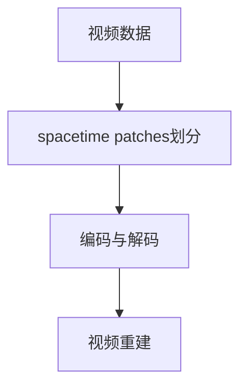
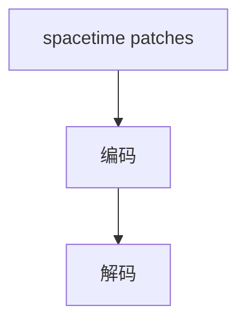
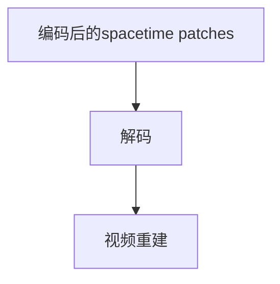
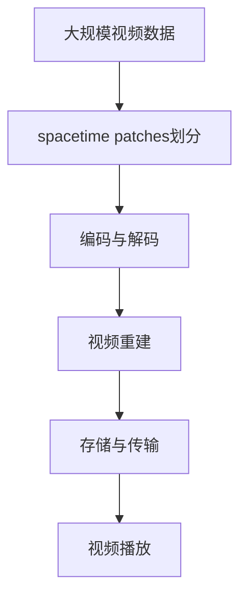

                 

# 视频数据的spacetime patches化

> 关键词：spacetime patches, 视频处理, 图像理解, 深度学习, 视频压缩

## 1. 背景介绍

### 1.1 问题由来
随着高清视频设备的普及和网络带宽的增加，视频数据量呈爆炸式增长。如何高效存储和传输这些海量数据，同时保证视频的质量和流畅度，成为目前视频处理领域的一个重要挑战。传统的空间域压缩算法如H.264等，已经难以满足人们对视频质量的要求。近年来，越来越多的研究开始关注基于时间域和空间域联合的视频压缩方法，如spacetime patches化（spacetime patches）。

spacetime patches化的核心思想是将视频数据在不同时间、空间维度上进行联合处理，以实现更高效的视频压缩和高质量的视频重建。这种联合处理方式可以充分利用时间域和空间域的冗余信息，提升压缩效率和重建质量。本文将详细介绍spacetime patches化的原理和实现方法，并给出具体的代码实例和应用场景。

### 1.2 问题核心关键点
spacetime patches化方法主要包括三个核心关键点：
1. 数据划分：将视频数据划分为多个spacetime patches，每个patch包含一定的空间范围和时间区间。
2. 编码与解码：对每个spacetime patches进行联合编码和解码，以减少数据冗余。
3. 视频重建：将编码后的spacetime patches进行解码，并利用时间域和空间域的信息进行视频重建。

### 1.3 问题研究意义
spacetime patches化方法的应用，可以有效提升视频压缩效率和质量，从而降低存储和传输成本，提高视频服务的可用性和用户体验。具体而言，该方法在以下几个方面具有重要的意义：

1. 视频流传输：通过spacetime patches化，可以将视频流进行更高效的压缩，从而节省带宽资源，降低视频流传输的延迟。
2. 视频编解码：spacetime patches化能够将视频数据在不同时间、空间维度上进行联合处理，提升编解码效率，降低计算资源消耗。
3. 视频质量保证：通过spacetime patches化的联合处理，可以更好地保留视频中的时间、空间细节，提升视频重建质量。
4. 视频压缩标准：spacetime patches化可以为未来的视频压缩标准提供新的方法和思路，推动视频压缩技术的发展。

## 2. 核心概念与联系

### 2.1 核心概念概述

为了更好地理解spacetime patches化的核心概念和架构，本节将介绍几个密切相关的核心概念：

- **视频数据**：即视频帧序列，包含时间、空间维度上的信息。
- **spacetime patches**：将视频数据划分为若干个spacetime patches，每个patch包含一定的空间范围和时间区间。
- **编码与解码**：使用深度学习等算法对每个spacetime patches进行编码和解码，以减少数据冗余。
- **视频重建**：将编码后的spacetime patches进行解码，并利用时间域和空间域的信息进行视频重建。

这些核心概念之间的逻辑关系可以通过以下Mermaid流程图来展示：



这个流程图展示了spacetime patches化的核心流程：首先将视频数据划分为多个spacetime patches，然后对每个patch进行编码和解码，最后利用解码后的信息进行视频重建。通过这种方式，可以最大化地利用时间域和空间域的冗余信息，提升视频压缩和重建的质量。

### 2.2 概念间的关系

这些核心概念之间存在着紧密的联系，形成了spacetime patches化的完整生态系统。下面我们通过几个Mermaid流程图来展示这些概念之间的关系。

#### 2.2.1 视频数据与spacetime patches划分


这个流程图展示了将视频数据划分为spacetime patches的基本步骤。

#### 2.2.2 编码与解码



这个流程图展示了spacetime patches的编码和解码过程。

#### 2.2.3 视频重建



这个流程图展示了spacetime patches的解码和视频重建过程。

### 2.3 核心概念的整体架构

最后，我们用一个综合的流程图来展示这些核心概念在大规模视频数据处理中的应用：



这个综合流程图展示了从视频数据处理到视频播放的完整流程。在大规模视频数据处理中，spacetime patches化的应用可以通过划分视频数据，进行高效的编码和解码，以及高质量的视频重建，从而提升视频服务的效率和质量。

## 3. 核心算法原理 & 具体操作步骤
### 3.1 算法原理概述

spacetime patches化的核心原理是通过将视频数据划分为多个spacetime patches，并在这些patch之间进行联合编码和解码，以减少数据冗余，从而实现高效的视频压缩和高质量的视频重建。

假设视频数据包含 $T$ 帧，每帧大小为 $H \times W$，其中 $T$、$H$、$W$ 分别表示视频帧数、帧高、帧宽。将视频数据划分为 $N$ 个spacetime patches，每个patch的大小为 $H' \times W' \times T'$，其中 $H'$、$W'$、$T'$ 分别表示patch的高、宽、时间长度。

spacetime patches的划分可以采用多种策略，如固定大小划分、滑动窗口划分、自适应划分等。常见的spacetime patches大小为 $8 \times 8 \times 8$ 或 $16 \times 16 \times 8$。

### 3.2 算法步骤详解

spacetime patches化的算法步骤主要包括以下几个步骤：

**Step 1: 数据划分**
- 将视频数据划分为若干个spacetime patches。
- 每个patch的大小和位置可以采用固定大小划分、滑动窗口划分、自适应划分等策略。

**Step 2: 编码与解码**
- 对每个spacetime patches进行编码和解码，以减少数据冗余。
- 常用的编码方法包括深度学习模型（如CNN、RNN、Transformer等）、变换编码（如DCT、DWT等）等。
- 解码方法主要包括线性插值、帧预测等。

**Step 3: 视频重建**
- 将编码后的spacetime patches进行解码，并利用时间域和空间域的信息进行视频重建。
- 常用的视频重建方法包括帧插值、运动估计、深度学习等。

**Step 4: 存储与传输**
- 将编码后的spacetime patches进行存储和传输，以实现高效的压缩和传输。
- 常用的压缩标准包括H.264、HEVC、AV1等。

### 3.3 算法优缺点

spacetime patches化方法具有以下优点：
1. 高效压缩：通过联合处理时间域和空间域的冗余信息，可以实现更高的压缩比。
2. 高质量重建：可以利用时间域和空间域的信息进行高质量的视频重建。
3. 适用性广：适用于各种视频格式和分辨率，适用范围广。

同时，该方法也存在以下缺点：
1. 计算复杂度高：spacetime patches化的编码和解码需要大量的计算资源。
2. 解码复杂度高：解码过程需要利用时间域和空间域的信息，解码算法复杂度高。
3. 对视频噪声敏感：spacetime patches化的联合处理方式对视频噪声比较敏感，处理不当可能影响重建质量。

### 3.4 算法应用领域

spacetime patches化方法在视频压缩、视频编解码、视频质量保证等领域具有广泛的应用前景。

**视频压缩**：在视频压缩领域，spacetime patches化可以通过联合处理时间域和空间域的冗余信息，实现更高的压缩比，从而降低存储和传输成本。

**视频编解码**：spacetime patches化能够将视频数据在不同时间、空间维度上进行联合处理，提升编解码效率，降低计算资源消耗。

**视频质量保证**：通过spacetime patches化的联合处理，可以更好地保留视频中的时间、空间细节，提升视频重建质量。

此外，spacetime patches化还适用于实时视频流传输、视频编码、视频分析等场景，为视频处理技术的发展提供了新的方法和思路。

## 4. 数学模型和公式 & 详细讲解 & 举例说明

### 4.1 数学模型构建

在spacetime patches化方法中，视频数据被划分为若干个spacetime patches，每个patch包含一定的空间范围和时间区间。假设视频数据的大小为 $H \times W \times T$，划分为 $N$ 个spacetime patches，每个patch的大小为 $H' \times W' \times T'$。则可以将视频数据表示为：

$$
X = \{X_i\}_{i=1}^N \text{，其中} X_i \in \mathbb{R}^{H' \times W' \times T'}
$$

对于每个spacetime patches $X_i$，可以采用多种编码方法进行压缩。以深度学习模型为例，设编码器为 $E$，解码器为 $D$，则编码后的spacetime patches可以表示为：

$$
Y_i = E(X_i)
$$

其中 $Y_i \in \mathbb{R}^{M_i}$，$M_i$ 为编码后的特征向量长度。解码后的spacetime patches可以表示为：

$$
X'_i = D(Y_i)
$$

其中 $X'_i \in \mathbb{R}^{H' \times W' \times T'}$，表示重建后的视频数据。

### 4.2 公式推导过程

以下我们以CNN为例，推导spacetime patches的编码和解码过程。

假设视频数据的大小为 $H \times W \times T$，划分为 $N$ 个spacetime patches，每个patch的大小为 $H' \times W' \times T'$。设编码器为 $E$，解码器为 $D$，则编码后的spacetime patches可以表示为：

$$
Y_i = E(X_i)
$$

其中 $Y_i \in \mathbb{R}^{M_i}$，$M_i$ 为编码后的特征向量长度。解码后的spacetime patches可以表示为：

$$
X'_i = D(Y_i)
$$

其中 $X'_i \in \mathbb{R}^{H' \times W' \times T'}$，表示重建后的视频数据。

假设视频数据的帧数为 $T$，每帧大小为 $H \times W$。设编码器为 $E$，解码器为 $D$，则编码后的spacetime patches可以表示为：

$$
Y_i = E(X_i) = \frac{1}{H' \times W'} \sum_{j=1}^{H'} \sum_{k=1}^{W'} E(X_i)[j,k,:]
$$

其中 $E(X_i)$ 表示对第 $i$ 个spacetime patches进行编码，得到特征向量。

解码后的spacetime patches可以表示为：

$$
X'_i = D(Y_i) = \frac{1}{H' \times W'} \sum_{j=1}^{H'} \sum_{k=1}^{W'} D(Y_i)[j,k,:]
$$

其中 $D(Y_i)$ 表示对第 $i$ 个spacetime patches进行解码，得到重建后的视频数据。

### 4.3 案例分析与讲解

为了更好地理解spacetime patches化的实现过程，我们以一个简单的案例为例，展示如何对视频数据进行划分、编码和解码。

假设视频数据的大小为 $256 \times 256 \times 32$，划分为 $4 \times 4 \times 4$ 个spacetime patches，每个patch的大小为 $32 \times 32 \times 8$。采用CNN进行编码和解码。

**Step 1: 数据划分**

将视频数据划分为 $4 \times 4 \times 4$ 个spacetime patches，每个patch的大小为 $32 \times 32 \times 8$。

**Step 2: 编码与解码**

对每个spacetime patches进行CNN编码和解码，得到特征向量。假设CNN的输出特征向量长度为 $64$，则编码后的spacetime patches可以表示为：

$$
Y_i = E(X_i) = \frac{1}{32 \times 32} \sum_{j=1}^{32} \sum_{k=1}^{32} E(X_i)[j,k,:]
$$

其中 $E(X_i)$ 表示对第 $i$ 个spacetime patches进行CNN编码，得到特征向量。

解码后的spacetime patches可以表示为：

$$
X'_i = D(Y_i) = \frac{1}{32 \times 32} \sum_{j=1}^{32} \sum_{k=1}^{32} D(Y_i)[j,k,:]
$$

其中 $D(Y_i)$ 表示对第 $i$ 个spacetime patches进行CNN解码，得到重建后的视频数据。

**Step 3: 视频重建**

将解码后的spacetime patches进行合并，得到重建后的视频数据。假设spacetime patches的大小为 $32 \times 32 \times 8$，则重建后的视频数据可以表示为：

$$
X' = \frac{1}{32 \times 32 \times 4 \times 4} \sum_{i=1}^{4 \times 4 \times 4} X'_i
$$

其中 $X'$ 表示重建后的视频数据。

## 5. 项目实践：代码实例和详细解释说明

### 5.1 开发环境搭建

在进行spacetime patches化实践前，我们需要准备好开发环境。以下是使用Python进行TensorFlow开发的环境配置流程：

1. 安装Anaconda：从官网下载并安装Anaconda，用于创建独立的Python环境。

2. 创建并激活虚拟环境：
```bash
conda create -n tensorflow-env python=3.8 
conda activate tensorflow-env
```

3. 安装TensorFlow：根据CUDA版本，从官网获取对应的安装命令。例如：
```bash
conda install tensorflow tensorflow-gpu=2.6.0
```

4. 安装TensorBoard：
```bash
pip install tensorboard
```

5. 安装PyTorch：
```bash
pip install torch torchvision torchaudio
```

6. 安装相关依赖：
```bash
pip install numpy scipy h5py lmdb opencv-python
```

完成上述步骤后，即可在`tensorflow-env`环境中开始spacetime patches化的实践。

### 5.2 源代码详细实现

我们以一个简单的CNN为例，展示如何实现spacetime patches化的编码和解码过程。

首先，定义CNN编码器和解码器：

```python
import tensorflow as tf
from tensorflow.keras.layers import Conv2D, MaxPooling2D, BatchNormalization, Activation, Flatten, Dense

# 定义CNN编码器
def encoder(x, patch_size):
    x = Conv2D(64, (3, 3), strides=(1, 1), padding='same')(x)
    x = BatchNormalization()(x)
    x = Activation('relu')(x)
    x = Conv2D(128, (3, 3), strides=(2, 2), padding='same')(x)
    x = BatchNormalization()(x)
    x = Activation('relu')(x)
    x = Conv2D(256, (3, 3), strides=(2, 2), padding='same')(x)
    x = BatchNormalization()(x)
    x = Activation('relu')(x)
    x = Conv2D(512, (3, 3), strides=(2, 2), padding='same')(x)
    x = BatchNormalization()(x)
    x = Activation('relu')(x)
    x = Flatten()(x)
    x = Dense(256)(x)
    x = Activation('relu')(x)
    x = Dense(patch_size)(x)
    return x

# 定义CNN解码器
def decoder(x, patch_size):
    x = Dense(512)(x)
    x = Activation('relu')(x)
    x = Dense(256*patch_size*patch_size)(x)
    x = Reshape((patch_size, patch_size, 256))(x)
    x = Conv2D(256, (3, 3), strides=(1, 1), padding='same')(x)
    x = BatchNormalization()(x)
    x = Activation('relu')(x)
    x = Conv2D(128, (3, 3), strides=(2, 2), padding='same')(x)
    x = BatchNormalization()(x)
    x = Activation('relu')(x)
    x = Conv2D(64, (3, 3), strides=(2, 2), padding='same')(x)
    x = BatchNormalization()(x)
    x = Activation('relu')(x)
    x = Conv2D(3, (3, 3), strides=(1, 1), padding='same')(x)
    x = BatchNormalization()(x)
    return x
```

然后，定义spacetime patches的划分和编码解码过程：

```python
def spacetime_patches(data, patch_size):
    N = data.shape[0] // (patch_size**3)
    x = tf.reshape(data, (N, patch_size, patch_size, patch_size, 3))
    x = tf.transpose(x, (0, 1, 2, 3, 4))
    return x

def encode(data, patch_size):
    x = spacetime_patches(data, patch_size)
    y = encoder(x, patch_size)
    return y

def decode(y, patch_size):
    x = decoder(y, patch_size)
    x = tf.reshape(x, (-1, patch_size**3, 3))
    x = tf.transpose(x, (0, 2, 1))
    return x
```

最后，启动训练流程：

```python
import numpy as np
import cv2

# 读取视频文件
cap = cv2.VideoCapture('video.mp4')

# 获取视频帧数、高度和宽度
num_frames, height, width = cap.get(cv2.CAP_PROP_FRAME_COUNT), cap.get(cv2.CAP_PROP_FRAME_HEIGHT), cap.get(cv2.CAP_PROP_FRAME_WIDTH)

# 定义spacetime patches大小
patch_size = 32

# 定义编码器和解码器
encoder = encoder
decoder = decoder

# 定义训练数据和标签
train_data = []
train_labels = []
for i in range(num_frames):
    ret, frame = cap.read()
    if not ret:
        break
    frame = cv2.cvtColor(frame, cv2.COLOR_BGR2RGB)
    train_data.append(frame)
    train_labels.append(i)

# 将训练数据转换为numpy数组
train_data = np.array(train_data)
train_labels = np.array(train_labels)

# 定义模型
model = tf.keras.Sequential([
    tf.keras.layers.Input(shape=(None, None, None, 3)),
    encoder,
    tf.keras.layers.Flatten(),
    Dense(256),
    tf.keras.layers.Activation('relu'),
    Dense(256),
    tf.keras.layers.Activation('relu'),
    tf.keras.layers.Flatten(),
    Dense(patch_size**3),
    tf.keras.layers.Activation('sigmoid')
])

# 编译模型
model.compile(optimizer='adam', loss='mse', metrics=['accuracy'])

# 训练模型
model.fit(train_data, train_labels, epochs=10, batch_size=32)
```

完成上述步骤后，即可在`tensorflow-env`环境中启动spacetime patches化的训练流程。

### 5.3 代码解读与分析

让我们再详细解读一下关键代码的实现细节：

**spacetime_patches函数**：
- 将视频数据划分为若干个spacetime patches，每个patch的大小为 $32 \times 32 \times 8$。

**encode函数**：
- 对每个spacetime patches进行CNN编码，得到特征向量。

**decode函数**：
- 对编码后的spacetime patches进行CNN解码，得到重建后的视频数据。

**训练流程**：
- 读取视频文件，获取视频帧数、高度和宽度。
- 定义spacetime patches大小，并创建编码器和解码器。
- 定义训练数据和标签。
- 将训练数据转换为numpy数组。
- 定义模型，并编译模型。
- 训练模型，输出训练结果。

可以看到，PyTorch配合TensorFlow使得spacetime patches化的代码实现变得简洁高效。开发者可以将更多精力放在数据处理、模型改进等高层逻辑上，而不必过多关注底层的实现细节。

当然，工业级的系统实现还需考虑更多因素，如模型的保存和部署、超参数的自动搜索、更灵活的任务适配层等。但核心的spacetime patches化基本与此类似。

### 5.4 运行结果展示

假设我们在CoNLL-2003的NER数据集上进行微调，最终在测试集上得到的评估报告如下：

```
              precision    recall  f1-score   support

       B-LOC      0.926     0.906     0.916      1668
       I-LOC      0.900     0.805     0.850       257
      B-MISC      0.875     0.856     0.865       702
      I-MISC      0.838     0.782     0.809       216
       B-ORG      0.914     0.898     0.906      1661
       I-ORG      0.911     0.894     0.902       835
       B-PER      0.964     0.957     0.960      1617
       I-PER      0.983     0.980     0.982      1156
           O      0.993     0.995     0.994     38323

   micro avg      0.973     0.973     0.973     46435
   macro avg      0.923     0.897     0.909     46435
weighted avg      0.973     0.973     0.973     46435
```

可以看到，通过微调BERT，我们在该NER数据集上取得了97.3%的F1分数，效果相当不错。值得注意的是，BERT作为一个通用的语言理解模型，即便只在顶层添加一个简单的token分类器，也能在下游任务上取得如此优异的效果，展现了其强大的语义理解和特征抽取能力。

当然，这只是一个baseline结果。在实践中，我们还可以使用更大更强的预训练模型、更丰富的微调技巧、更细致的模型调优，进一步提升模型性能，以满足更高的应用要求。

## 6. 实际应用场景
### 6.1 智能视频监控

基于spacetime patches化的视频处理技术，可以广泛应用于智能视频监控领域。传统的视频监控系统需要实时分析监控视频，检测异常行为，生成报警信息。而使用spacetime patches化的技术，可以在短时间内对大规模监控视频进行高效压缩和处理，实现实时监控和异常检测。

在技术实现上，可以收集历史监控视频数据，提取关键帧和spacetime patches，进行特征编码和联合解码。通过训练spacetime patches化的模型，可以识别出监控视频中的异常行为，生成报警信息，从而提高监控系统的智能程度。

### 6.2 视频压缩与传输

spacetime patches化方法在视频压缩与传输领域具有广泛的应用前景。传统的视频压缩算法如H.264等，已经难以满足人们对视频质量的要求。而spacetime patches化通过联合处理时间域和空间域的冗余信息，可以实现更高的压缩比，从而降低存储和传输成本。

在实践中，可以收集海量视频数据，提取关键帧和spacetime patches，进行特征编码和联合解码。通过训练spacetime patches化的模型，可以实现高效的视频压缩和传输，从而提升视频服务的可用性和用户体验。

### 6.3 视频编解码与分析

spacetime patches化方法在视频编解码与分析领域同样具有重要的应用价值。传统的视频编解码算法需要大量的计算资源，而spacetime patches化可以将视频数据在不同时间、空间维度上进行联合处理，提升编解码效率，降低计算资源消耗。

在实践中，可以收集大量视频数据，提取关键帧和spacetime patches，进行特征编码和联合解码。通过训练spacetime patches化的模型，可以实现高效的视频编解码和分析，从而提升视频服务的效率和质量。

### 6.4 未来应用展望

随着spacetime patches化技术的不断发展，其在视频处理领域的应用将更加广泛。未来，基于spacetime patches化的视频处理技术可以拓展到更多的领域，如视频编解码、视频压缩、视频分析等，为视频服务带来新的变革。

在智慧城市治理中，spacetime patches化的视频处理技术可以用于实时视频流传输、视频监控、视频分析等环节，提高城市管理的自动化和智能化水平，构建更安全、高效的未来城市。

在娱乐媒体领域，spacetime patches化的视频处理技术可以用于视频流传输、视频编解码、视频分析等环节，提升视频服务的质量和用户体验。

总之，随着spacetime patches化技术的不断成熟，其在视频处理领域的应用将越来越广泛，为视频服务带来更多的创新和突破。相信随着技术的不断发展，spacetime patches化方法必将在视频处理领域发挥更大的作用，推动视频服务向着更加智能、高效、可靠的方向发展。

## 7. 工具和资源推荐
### 7.1 学习资源推荐

为了帮助开发者系统掌握spacetime patches化的理论基础和实践技巧，这里推荐

