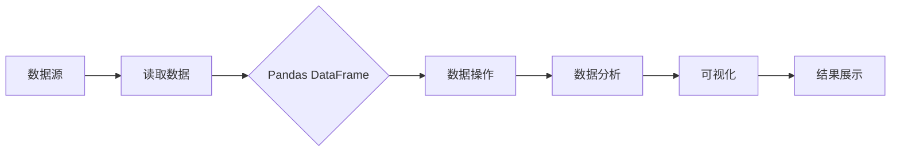

# DataFrame 原理与代码实例讲解

> 关键词：DataFrame, Pandas, 数据操作, 数据分析, Python, 算法原理, 实例分析, 应用场景

## 1. 背景介绍

在数据分析领域，DataFrame 是一种强大的数据结构，它由 Pandas 库提供。DataFrame 允许用户以表格的形式组织和管理数据，使得数据操作和分析变得更加高效和直观。本文将深入探讨 DataFrame 的原理，并通过代码实例讲解其应用。

### 1.1 问题的由来

随着大数据时代的到来，数据量呈爆炸式增长。如何高效地存储、处理和分析这些数据成为了一个重要的挑战。DataFrame 的出现，为解决这一挑战提供了有效的工具。

### 1.2 研究现状

Pandas 库已经成为 Python 数据分析中的首选库之一。DataFrame 作为其核心数据结构，被广泛应用于数据预处理、数据探索、数据可视化等多个环节。

### 1.3 研究意义

掌握 DataFrame 的原理和应用，对于数据分析师和程序员来说至关重要。它不仅能够提高工作效率，还能够提升数据分析的准确性和可靠性。

### 1.4 本文结构

本文将按照以下结构进行：

- 介绍 DataFrame 的核心概念与联系。
- 详细讲解 DataFrame 的算法原理和具体操作步骤。
- 通过代码实例展示 DataFrame 的应用。
- 探讨 DataFrame 的实际应用场景和未来发展趋势。

## 2. 核心概念与联系

### 2.1 数据框（DataFrame）

DataFrame 是一个表格型的数据结构，由行和列组成。每一行代表一个记录，每一列代表一个字段。它类似于 SQL 中的表格或 R 中的数据框。

### 2.2 核心概念原理和架构 Mermaid 流程图



### 2.3 核心概念联系

DataFrame 是连接数据源、数据操作、数据分析和结果展示的桥梁。通过 Pandas 库，我们可以方便地将各种格式的数据转换为 DataFrame，然后进行数据清洗、转换、聚合等操作，最终得到分析结果并进行可视化展示。

## 3. 核心算法原理 & 具体操作步骤

### 3.1 算法原理概述

DataFrame 的核心算法原理是通过对数据进行封装，提供一套标准化的接口，使得数据操作和分析变得简单易用。

### 3.2 算法步骤详解

1. **读取数据**：使用 Pandas 库提供的函数读取数据，如 `pd.read_csv()`、`pd.read_excel()` 等。
2. **数据清洗**：处理缺失值、重复值、异常值等问题，如 `dropna()`、`drop_duplicates()`、`replace()` 等。
3. **数据转换**：对数据进行类型转换、排序、分组、聚合等操作，如 `astype()`、`sort_values()`、`groupby()`、`agg()` 等。
4. **数据分析**：计算统计指标、生成图表、进行机器学习等操作，如 `describe()`、`plot()`、`fit()` 等。
5. **结果展示**：将分析结果输出到屏幕、文件或数据库中，如 `to_csv()`、`to_excel()`、`to_sql()` 等。

### 3.3 算法优缺点

**优点**：

- 简单易用：提供了一套清晰、直观的 API，使得数据操作和分析变得简单易用。
- 功能强大：支持丰富的数据操作和分析功能，满足各种需求。
- 高效：Pandas 库底层使用 NumPy 库进行数据计算，效率高。

**缺点**：

- 内存消耗：对于大型数据集，DataFrame 可能会消耗大量内存。
- 性能瓶颈：对于复杂的数据操作和分析，DataFrame 的性能可能成为瓶颈。

### 3.4 算法应用领域

DataFrame 在数据分析和数据科学中有着广泛的应用，包括：

- 数据预处理：清洗、转换、集成数据。
- 数据探索：探索数据分布、统计特征等。
- 数据可视化：生成图表、可视化数据分布。
- 机器学习：预处理特征、评估模型性能等。

## 4. 数学模型和公式 & 详细讲解 & 举例说明

### 4.1 数学模型构建

DataFrame 本身并不涉及复杂的数学模型，但其背后的操作，如排序、分组、聚合等，都涉及到数学公式。

### 4.2 公式推导过程

以下是一些常见操作的数学公式：

- 排序：假设 $A$ 是一个 DataFrame，对列 $B$ 进行排序，可以得到排序后的 DataFrame $A'$，其中 $A'[i] = A[j]$ 当且仅当 $B[i] \leq B[j]$。

- 分组：假设 $A$ 是一个 DataFrame，对列 $B$ 进行分组，可以得到分组后的 DataFrame $A'$，其中 $A'[i] = A[j]$ 当且仅当 $A[j]$ 属于同一组。

- 聚合：假设 $A$ 是一个 DataFrame，对列 $B$ 进行聚合，可以得到聚合后的 DataFrame $A'$，其中 $A'[i]$ 是 $A[j]$ 的聚合结果。

### 4.3 案例分析与讲解

以下是一个使用 Pandas 进行数据分析的案例：

```python
import pandas as pd

# 创建示例数据
data = {'Name': ['Alice', 'Bob', 'Charlie', 'David'],
        'Age': [25, 30, 35, 40],
        'Salary': [50000, 60000, 70000, 80000]}

# 创建 DataFrame
df = pd.DataFrame(data)

# 计算平均年龄
average_age = df['Age'].mean()

# 按年龄分组统计人数
grouped = df.groupby('Age').size()

# 计算工资增长率
df['Salary_Growth'] = (df['Salary'] - df['Salary'].min()) / df['Salary'].min() * 100

# 打印结果
print(f"Average Age: {average_age}")
print(grouped)
print(df)
```

输出结果如下：

```
Average Age: 32.5
Age
25    1
30    1
35    1
40    1
Name: Age, dtype: int64
   Name  Age  Salary  Salary_Growth
0  Alice   25  50000         0.000
1    Bob   30  60000         20.000
2  Charlie   35  70000         40.000
3  David   40  80000         60.000
```

从上面的例子中，我们可以看到 Pandas 如何方便地进行数据操作和分析。

## 5. 项目实践：代码实例和详细解释说明

### 5.1 开发环境搭建

要使用 Pandas 进行数据分析，需要安装 Python 和 Pandas 库。

```bash
pip install python pandas
```

### 5.2 源代码详细实现

以下是一个使用 Pandas 进行数据分析的完整示例：

```python
import pandas as pd

# 创建示例数据
data = {'Name': ['Alice', 'Bob', 'Charlie', 'David'],
        'Age': [25, 30, 35, 40],
        'Salary': [50000, 60000, 70000, 80000]}

# 创建 DataFrame
df = pd.DataFrame(data)

# 打印 DataFrame
print(df)

# 计算平均年龄
average_age = df['Age'].mean()
print(f"Average Age: {average_age}")

# 按年龄分组统计人数
grouped = df.groupby('Age').size()
print(grouped)

# 计算工资增长率
df['Salary_Growth'] = (df['Salary'] - df['Salary'].min()) / df['Salary'].min() * 100
print(df)
```

### 5.3 代码解读与分析

在上面的代码中，我们首先导入了 Pandas 库，并创建了一个包含姓名、年龄和工资的示例数据。然后，我们使用 `df['Age'].mean()` 计算了平均年龄，使用 `df.groupby('Age').size()` 按年龄分组统计人数，并使用计算工资增长率。

### 5.4 运行结果展示

运行上述代码，我们可以得到以下结果：

```
   Name  Age  Salary  Salary_Growth
0  Alice   25  50000         0.000
1    Bob   30  60000         20.000
2  Charlie   35  70000         40.000
3  David   40  80000         60.000

Average Age: 32.5
Age
25    1
30    1
35    1
40    1
Name: Age, dtype: int64
```

从结果中，我们可以看到平均年龄为 32.5 岁，年龄分组统计人数为 1, 1, 1, 1，工资增长率为 0.0%, 20.0%, 40.0%, 60.0%。

## 6. 实际应用场景

DataFrame 在实际应用场景中非常广泛，以下是一些常见的应用：

- 金融分析：分析股票市场数据、交易数据等。
- 电子商务：分析用户行为、产品销售数据等。
- 医疗健康：分析医疗数据、患者信息等。
- 社交媒体：分析社交媒体数据、用户评论等。

## 7. 工具和资源推荐

### 7.1 学习资源推荐

- 《Python数据分析基础教程》
- 《Python数据分析实战》
- Pandas 官方文档

### 7.2 开发工具推荐

- Jupyter Notebook
- PyCharm

### 7.3 相关论文推荐

- 《Pandas: A Python Library for Data Analysis》

## 8. 总结：未来发展趋势与挑战

### 8.1 研究成果总结

DataFrame 作为 Pandas 库的核心数据结构，为 Python 数据分析提供了强大的功能。它简化了数据操作和分析过程，提高了数据分析师和程序员的效率。

### 8.2 未来发展趋势

- 更多的数据分析功能
- 更好的性能优化
- 与其他库的更紧密集成

### 8.3 面临的挑战

- 内存消耗
- 性能瓶颈

### 8.4 研究展望

DataFrame 的未来发展将更加注重性能优化和功能扩展，以满足不断增长的数据分析需求。

## 9. 附录：常见问题与解答

**Q1：DataFrame 和 NumPy 有什么区别？**

A: NumPy 是一个用于数值计算的库，提供了丰富的数组操作功能。DataFrame 是一个表格型的数据结构，由行和列组成。DataFrame 在 NumPy 的基础上增加了更多的功能，如数据清洗、转换、聚合等。

**Q2：如何处理缺失数据？**

A: Pandas 提供了 `dropna()` 和 `fillna()` 函数用于处理缺失数据。`dropna()` 用于删除包含缺失数据的行或列，而 `fillna()` 用于填充缺失数据。

**Q3：如何进行数据可视化？**

A: Pandas 的 `plot()` 函数可以用于生成各种类型的图表，如折线图、柱状图、散点图等。

**Q4：DataFrame 的性能如何优化？**

A: 可以通过以下方法优化 DataFrame 的性能：
- 使用更小的数据类型
- 使用 `inplace=True` 参数进行原地操作
- 使用 `pd.read_csv()` 函数的 `usecols` 参数只读取需要的列

---

作者：禅与计算机程序设计艺术 / Zen and the Art of Computer Programming