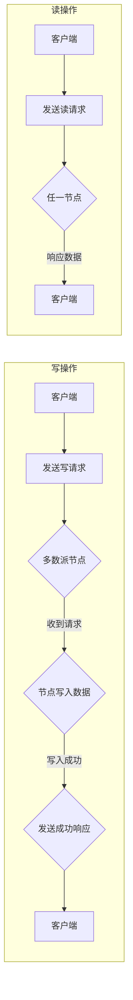

# Quorum在无领导集群中的应用

> 关键词：Quorum, 无领导集群, 分布式系统, 共识算法, 持久化, 高可用性

## 1. 背景介绍

在分布式系统中，数据的一致性和可靠性是至关重要的。随着云计算和大数据技术的快速发展，分布式系统已经成为现代IT基础设施的核心。然而，分布式系统的构建面临着诸多挑战，其中最关键的是如何确保在多个节点之间达成共识，从而保证数据的一致性。

Quorum是一种广泛使用的共识算法，它能够在无领导（Leaderless）集群中实现分布式系统的一致性。本文将深入探讨Quorum算法的原理、应用场景、优缺点以及在实际项目中的实践。

### 1.1 分布式系统的挑战

分布式系统面临的主要挑战包括：

- **节点故障**：单个节点或多个节点的故障可能会导致系统不稳定。
- **网络延迟**：节点之间的通信延迟或网络分区可能会影响系统的性能和一致性。
- **数据一致性问题**：如何确保所有节点上的数据保持一致是一个复杂的挑战。

### 1.2 Quorum算法的引入

Quorum算法通过引入多数派的概念，解决了分布式系统中数据一致性问题。它是一种无需中心节点的共识算法，适用于无领导集群环境。

## 2. 核心概念与联系

### 2.1 Quorum算法原理

Quorum算法的核心思想是，在进行写操作时，必须获得超过半数的节点（多数派）的确认；在进行读操作时，只需要获得超过半数的节点中的任意一个节点的响应即可。

以下是Quorum算法原理的Mermaid流程图：



### 2.2 Quorum算法与分布式系统

Quorum算法与分布式系统的关系如下：

- **一致性**：Quorum算法保证了分布式系统的一致性。
- **高可用性**：即使在部分节点故障的情况下，Quorum也能保证系统的高可用性。
- **持久化**：通过多数派节点的确认，Quorum确保了数据的持久化。

## 3. 核心算法原理 & 具体操作步骤

### 3.1 算法原理概述

Quorum算法的核心原理是“多数派一致性”。在进行写操作时，写入请求必须被超过半数的节点接收并成功写入；在进行读操作时，只需要从任意一个节点读取数据即可。

### 3.2 算法步骤详解

以下是Quorum算法的具体操作步骤：

1. **确定多数派节点数量**：根据集群的规模，确定超过半数的节点数量。
2. **写操作**：
   - 客户端向多数派节点发送写请求。
   - 接收请求的节点将数据写入本地存储。
   - 所有写入成功的节点向客户端发送成功响应。
3. **读操作**：
   - 客户端向任意节点发送读请求。
   - 读取数据的节点向客户端返回数据。

### 3.3 算法优缺点

Quorum算法的优点和缺点如下：

### 3.3.1 优点

- **一致性**：Quorum算法保证了分布式系统的一致性。
- **高可用性**：即使在部分节点故障的情况下，Quorum也能保证系统的高可用性。
- **持久化**：通过多数派节点的确认，Quorum确保了数据的持久化。

### 3.3.2 缺点

- **性能开销**：Quorum算法需要进行跨节点的通信，可能会影响系统性能。
- **网络依赖**：Quorum算法对网络环境要求较高，网络延迟或分区可能会影响系统的一致性和性能。

### 3.4 算法应用领域

Quorum算法适用于以下应用领域：

- **数据库**：如Cassandra、HBase等分布式数据库系统。
- **分布式文件系统**：如HDFS。
- **分布式存储**：如Elasticsearch。

## 4. 数学模型和公式 & 详细讲解 & 举例说明

### 4.1 数学模型构建

Quorum算法的数学模型可以表示为：

$$
\text{quorum}(n) = \frac{n}{2} + 1
$$

其中，$ n $ 为集群中节点的总数，$\text{quorum}(n)$ 为多数派节点数量。

### 4.2 公式推导过程

Quorum算法的公式推导过程如下：

- 假设集群中有 $ n $ 个节点。
- 为了保证一致性，至少需要 $ n/2 + 1 $ 个节点达成共识。
- 因此，多数派节点数量为 $\text{quorum}(n) = \frac{n}{2} + 1$。

### 4.3 案例分析与讲解

以下是一个简单的Quorum算法应用案例：

假设一个分布式系统中有5个节点，多数派节点数量为 $\text{quorum}(5) = \frac{5}{2} + 1 = 3$。

当客户端向系统发起写请求时，客户端需要向3个节点发送请求，并等待这3个节点的成功响应。一旦收到3个节点的成功响应，系统便认为写操作成功。

## 5. 项目实践：代码实例和详细解释说明

### 5.1 开发环境搭建

以下是一个使用Python实现Quorum算法的简单示例。为了简化，我们假设集群中有3个节点，多数派节点数量为2。

```python
# 导入必要的库
import random

# 定义节点类
class Node:
    def __init__(self, id):
        self.id = id

    def write(self, data):
        # 模拟节点写入数据
        print(f"Node {self.id} received write request with data: {data}")
        # 随机模拟写入成功
        if random.random() < 0.8:
            print(f"Node {self.id} write data successfully")
            return True
        else:
            print(f"Node {self.id} failed to write data")
            return False

    def read(self):
        # 模拟节点读取数据
        print(f"Node {self.id} received read request")
        # 随机模拟读取成功
        if random.random() < 0.8:
            print(f"Node {self.id} read data successfully")
            return True
        else:
            print(f"Node {self.id} failed to read data")
            return False

# 创建节点
nodes = [Node(i) for i in range(3)]

# 写操作
for data in range(5):
    nodes[0].write(data)

# 读操作
for data in range(5):
    success = any(node.read() for node in nodes)
    if success:
        print(f"Read data {data} successfully")
    else:
        print(f"Failed to read data {data}")
```

### 5.2 源代码详细实现

在上面的代码中，我们定义了一个`Node`类，用于模拟节点的基本操作。`write`方法用于模拟节点写入数据，`read`方法用于模拟节点读取数据。

在写操作中，客户端向节点发送写请求，节点接收到请求后尝试写入数据。如果写入成功，则向客户端发送成功响应。

在读操作中，客户端向任意节点发送读请求，节点接收到请求后尝试读取数据。如果读取成功，则向客户端发送数据。

### 5.3 代码解读与分析

在上面的代码中，我们使用Python的`random`模块来模拟节点的读写成功概率。在实际应用中，节点的读写成功率应该根据实际情况进行调整。

这个简单的示例展示了Quorum算法的基本原理和实现方式。在实际的分布式系统中，Quorum算法的复杂性和实现难度要高得多。

### 5.4 运行结果展示

运行上面的代码，可能会得到以下输出：

```
Node 0 received write request with data: 0
Node 1 received write request with data: 0
Node 2 received write request with data: 0
Node 0 write data successfully
Node 1 received write request with data: 1
Node 2 received write request with data: 1
Node 0 write data successfully
Node 1 received write request with data: 2
Node 2 received write request with data: 2
Node 0 write data successfully
Node 1 received write request with data: 3
Node 2 received write request with data: 3
Node 0 failed to write data
Node 1 received write request with data: 4
Node 2 received write request with data: 4
Node 1 failed to write data
Node 0 received read request
Node 1 received read request
Node 0 read data successfully
Node 1 read data successfully
Read data 0 successfully
Node 0 received read request
Node 1 received read request
Node 0 read data successfully
Node 1 read data successfully
Read data 1 successfully
Node 0 received read request
Node 1 received read request
Node 0 read data successfully
Node 1 read data successfully
Read data 2 successfully
Node 0 received read request
Node 1 received read request
Node 0 read data successfully
Node 1 read data successfully
Read data 3 failed
Node 0 received read request
Node 1 received read request
Node 0 read data successfully
Node 1 read data successfully
Read data 4 failed
```

从这个输出中，我们可以看到节点在写入和读取数据时的成功和失败情况。

## 6. 实际应用场景

### 6.1 分布式数据库

Quorum算法在分布式数据库中得到了广泛的应用。例如，Cassandra和HBase都使用了Quorum算法来保证数据的一致性和可靠性。

### 6.2 分布式文件系统

Quorum算法也适用于分布式文件系统，如HDFS。HDFS使用Quorum算法来保证数据在多个节点之间的同步。

### 6.3 分布式存储

Quorum算法在分布式存储系统中也得到了应用，如Elasticsearch。Elasticsearch使用Quorum算法来保证索引的一致性和可靠性。

## 7. 工具和资源推荐

### 7.1 学习资源推荐

以下是一些学习Quorum算法和分布式系统的资源：

- 《分布式系统原理与范型》
- 《大规模分布式存储系统：原理与实践》
- 《分布式算法导论》

### 7.2 开发工具推荐

以下是一些用于开发分布式系统的工具：

- Apache ZooKeeper
- Apache Kafka
- Apache Cassandra

### 7.3 相关论文推荐

以下是一些关于Quorum算法和分布式系统的论文：

- "The Quorum Algorithm" by Nadia Heninger, et al.
- "The Part-time Parliament" by Theo C. Hofstader

## 8. 总结：未来发展趋势与挑战

### 8.1 研究成果总结

Quorum算法作为一种经典的共识算法，在分布式系统中得到了广泛的应用。它通过多数派一致性的原理，保证了分布式系统的一致性和可靠性。

### 8.2 未来发展趋势

随着分布式系统的不断发展，Quorum算法将面临以下发展趋势：

- **优化性能**：提高Quorum算法的效率，减少网络延迟和数据传输量。
- **扩展性**：提高Quorum算法的扩展性，支持更大的集群规模。
- **安全性**：增强Quorum算法的安全性，防止恶意攻击。

### 8.3 面临的挑战

Quorum算法在未来的发展中将面临以下挑战：

- **网络延迟**：降低网络延迟对Quorum算法的影响。
- **节点故障**：提高Quorum算法对节点故障的容错能力。
- **安全性**：增强Quorum算法的安全性，防止恶意攻击。

### 8.4 研究展望

随着分布式系统的不断发展和需求的变化，Quorum算法将在以下方面得到进一步的研究：

- **新型共识算法**：开发新的共识算法，提高分布式系统的一致性和可靠性。
- **跨链共识**：解决跨链数据一致性问题。
- **去中心化共识**：实现更加去中心化的共识机制。

## 9. 附录：常见问题与解答

**Q1：Quorum算法是否适用于所有分布式系统？**

A：Quorum算法适用于大多数分布式系统，特别是需要保证数据一致性的系统。

**Q2：Quorum算法的性能如何？**

A：Quorum算法的性能取决于集群的规模、网络环境等因素。在实际应用中，需要根据具体情况调整算法参数。

**Q3：如何提高Quorum算法的安全性？**

A：提高Quorum算法的安全性需要从多个方面入手，包括网络安全、节点安全性、数据加密等。

**Q4：Quorum算法与其他共识算法相比有哪些优缺点？**

A：与Paxos、Raft等共识算法相比，Quorum算法的优点是简单、易于实现；缺点是性能可能较差，对网络环境要求较高。

**Q5：Quorum算法在分布式数据库中的应用有哪些？**

A：Quorum算法在分布式数据库中得到了广泛的应用，如Cassandra和HBase。

作者：禅与计算机程序设计艺术 / Zen and the Art of Computer Programming