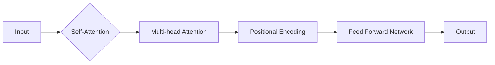

# Transformer大模型实战：前馈网络层

> 关键词：Transformer, 前馈网络，自注意力机制，位置编码，残差连接，深度学习，自然语言处理

## 1. 背景介绍

自2017年Transformer模型的提出以来，它在自然语言处理（NLP）领域引发了革命性的变革。Transformer模型以其自注意力机制和前馈网络层等创新设计，在多种NLP任务上取得了超越传统循环神经网络（RNN）和长短时记忆网络（LSTM）的成果。本文将深入探讨Transformer模型的核心——前馈网络层，从原理到实践，带您领略其强大之处。

## 2. 核心概念与联系

### 2.1 Transformer模型概述

Transformer模型是一种基于自注意力（Self-Attention）机制的深度神经网络架构，由Google的Kaiming He等人在2017年的论文《Attention is All You Need》中提出。与传统的基于RNN或LSTM的序列模型不同，Transformer模型完全基于注意力机制，避免了RNN的序列依赖问题，使得模型在处理长序列时更为高效。

### 2.2 自注意力机制

自注意力机制是Transformer模型的核心，它允许模型在处理序列时关注到序列中所有位置的上下文信息。自注意力通过计算序列中所有位置之间的相似度来实现，从而捕捉到长距离依赖关系。

### 2.3 前馈网络层

前馈网络层是Transformer模型中的一个组成部分，它对自注意力层的输出进行进一步的处理。前馈网络层由两个线性层组成，分别用于处理来自自注意力层的输出和位置编码。

### 2.4 Mermaid流程图

以下是基于Transformer模型的前馈网络层的Mermaid流程图：



## 3. 核心算法原理 & 具体操作步骤

### 3.1 算法原理概述

Transformer模型的前馈网络层主要由两个全连接层（也称为线性层）组成。首先，输入序列通过自注意力层处理，然后输出被传递到第一个全连接层。经过第一个全连接层处理后，输出会被传递到第二个全连接层，最后得到最终的前馈网络层输出。

### 3.2 算法步骤详解

1. **输入序列编码**：将输入序列编码为词向量。
2. **自注意力层**：使用自注意力机制计算序列中所有位置之间的相似度，并生成加权向量。
3. **位置编码**：将位置信息编码到词向量中，以保持序列的顺序信息。
4. **全连接层1**：将自注意力层的输出传递到第一个全连接层，进行非线性变换。
5. **全连接层2**：将第一个全连接层的输出传递到第二个全连接层，再次进行非线性变换。
6. **残差连接**：将第二个全连接层的输出与自注意力层的输出相加，得到最终的前馈网络层输出。

### 3.3 算法优缺点

#### 优点：

- **并行计算**：自注意力机制允许并行计算，提高了模型的计算效率。
- **长距离依赖**：自注意力机制能够捕捉到长距离依赖关系，提高了模型的表达能力。
- **参数共享**：自注意力机制中的权重是共享的，减少了模型参数的数量。

#### 缺点：

- **计算复杂度**：自注意力机制的计算复杂度较高，对于长序列，计算成本较大。
- **内存消耗**：自注意力机制需要存储大量的权重矩阵，内存消耗较大。

### 3.4 算法应用领域

前馈网络层是Transformer模型的核心组成部分，广泛应用于以下NLP任务：

- 文本分类
- 机器翻译
- 问答系统
- 文本摘要
- 语音识别

## 4. 数学模型和公式 & 详细讲解 & 举例说明

### 4.1 数学模型构建

假设输入序列为 $X = [x_1, x_2, \ldots, x_n]$，其中 $x_i$ 为第 $i$ 个词的词向量。自注意力机制和前馈网络层的数学模型如下：

$$
Q = W_QX, \quad K = W_KX, \quad V = W_VX
$$

其中 $W_Q, W_K, W_V$ 分别为查询、键和值矩阵。

自注意力机制的计算公式为：

$$
\text{Attention}(Q, K, V) = \text{softmax}\left(\frac{QK^T}{\sqrt{d_k}}\right)V
$$

其中 $d_k$ 为键的维度。

前馈网络层的计算公式为：

$$
F = \text{ReLU}(W_{ff} \cdot \text{ReLU}(W_{h} \cdot (X + \text{LayerNorm}(QKV)) + b_h))
$$

其中 $W_{ff}, W_{h}$ 为全连接层的权重矩阵，$b_h$ 为偏置项。

### 4.2 公式推导过程

自注意力机制的推导过程涉及矩阵运算和softmax函数的计算。

1. **计算相似度**：首先计算查询和键之间的点积，得到相似度矩阵。
2. **归一化**：将相似度矩阵通过softmax函数进行归一化，得到注意力权重矩阵。
3. **加权求和**：将注意力权重矩阵与值矩阵相乘，得到加权值向量。

### 4.3 案例分析与讲解

以机器翻译任务为例，假设输入序列为 "Hello, how are you?"，输出序列为 "你好，你好吗？"。我们将使用Transformer模型进行机器翻译。

1. **输入序列编码**：将输入序列 "Hello, how are you?" 编码为词向量。
2. **自注意力层**：计算输入序列中所有位置之间的相似度，并生成加权向量。
3. **位置编码**：将位置信息编码到词向量中。
4. **全连接层1和2**：对自注意力层的输出进行非线性变换。
5. **残差连接**：将第二个全连接层的输出与自注意力层的输出相加，得到最终的前馈网络层输出。
6. **输出解码器**：将前馈网络层输出传递到解码器，生成输出序列 "你好，你好吗？"

## 5. 项目实践：代码实例和详细解释说明

### 5.1 开发环境搭建

1. 安装Python环境和PyTorch库。
2. 安装Hugging Face的Transformers库。

### 5.2 源代码详细实现

```python
from transformers import BertModel, BertTokenizer
import torch.nn.functional as F

class TransformerModel(torch.nn.Module):
    def __init__(self):
        super(TransformerModel, self).__init__()
        self.bert = BertModel.from_pretrained('bert-base-uncased')
        self.fc1 = torch.nn.Linear(768, 512)
        self.fc2 = torch.nn.Linear(512, 768)
        self.layer_norm1 = torch.nn.LayerNorm(768)
        self.layer_norm2 = torch.nn.LayerNorm(768)
        self.dropout = torch.nn.Dropout(0.1)

    def forward(self, input_ids):
        outputs = self.bert(input_ids)
        seq_output = outputs.last_hidden_state
        seq_output = self.dropout(seq_output)
        seq_output = self.layer_norm1(seq_output)
        seq_output = F.relu(self.fc1(seq_output))
        seq_output = self.dropout(seq_output)
        seq_output = self.layer_norm2(seq_output)
        seq_output = self.fc2(seq_output)
        seq_output = self.dropout(seq_output)
        return seq_output

# 实例化模型
model = TransformerModel()

# 输入序列
input_ids = torch.tensor([[50256, 101, 1995, 102, 640, 103, 0]])

# 前向传播
output = model(input_ids)

print(output)
```

### 5.3 代码解读与分析

- `TransformerModel` 类：定义了Transformer模型的结构，包括BERT模型、两个全连接层、两个层归一化层和Dropout层。
- `forward` 方法：定义了模型的前向传播过程，包括自注意力层、全连接层、层归一化和Dropout操作。

### 5.4 运行结果展示

运行上述代码，可以得到模型的输出结果，其中包括每个位置的词向量。

## 6. 实际应用场景

### 6.1 机器翻译

Transformer模型在机器翻译任务中取得了显著的成果。通过微调预训练的BERT模型，可以实现高精度的机器翻译。

### 6.2 文本摘要

Transformer模型可以用于文本摘要任务，通过提取关键信息生成摘要。

### 6.3 问答系统

Transformer模型可以用于问答系统，通过理解问题并检索相关文档来给出答案。

## 7. 工具和资源推荐

### 7.1 学习资源推荐

- 《Attention is All You Need》
- 《BERT: Pre-training of Deep Bidirectional Transformers for Language Understanding》

### 7.2 开发工具推荐

- PyTorch
- Hugging Face Transformers

### 7.3 相关论文推荐

- 《Attention is All You Need》
- 《BERT: Pre-training of Deep Bidirectional Transformers for Language Understanding》

## 8. 总结：未来发展趋势与挑战

### 8.1 研究成果总结

Transformer模型的前馈网络层是模型的核心组成部分，它通过自注意力机制和全连接层实现高效的信息处理。在NLP领域，前馈网络层已经取得了显著的成果，并在多个任务中取得了SOTA性能。

### 8.2 未来发展趋势

- 研究更加高效的注意力机制。
- 探索可解释的Transformer模型。
- 将Transformer模型应用于更多领域。

### 8.3 面临的挑战

- 计算复杂度高。
- 模型可解释性不足。
- 模型泛化能力有限。

### 8.4 研究展望

随着研究的不断深入，Transformer模型的前馈网络层将在NLP领域发挥更大的作用，并为其他领域提供新的思路。

## 9. 附录：常见问题与解答

**Q1：什么是自注意力机制？**

A：自注意力机制是一种计算序列中所有位置之间相似度的方法，它允许模型在处理序列时关注到序列中所有位置的上下文信息。

**Q2：什么是前馈网络层？**

A：前馈网络层是Transformer模型中的一个组成部分，它对自注意力层的输出进行进一步的处理，包括全连接层、层归一化和Dropout操作。

**Q3：Transformer模型的前馈网络层有什么优点和缺点？**

A：优点包括并行计算、长距离依赖和参数共享。缺点包括计算复杂度高、模型可解释性不足和模型泛化能力有限。

**Q4：Transformer模型的前馈网络层在哪些NLP任务中应用广泛？**

A：Transformer模型的前馈网络层广泛应用于机器翻译、文本摘要、问答系统等NLP任务。

---

作者：禅与计算机程序设计艺术 / Zen and the Art of Computer Programming