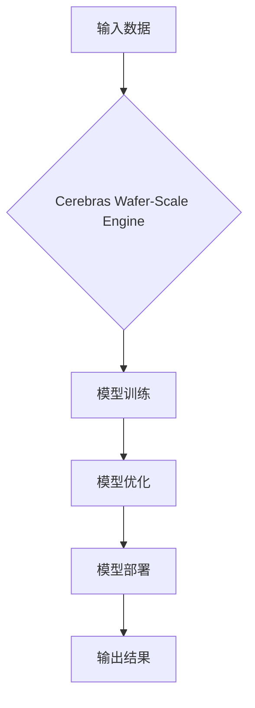

# Cerebras-GPT原理与代码实例讲解

> 关键词：Cerebras-GPT, GPT模型，神经网络，大规模并行计算，稀疏计算，深度学习，代码实例

## 1. 背景介绍

近年来，随着深度学习技术的飞速发展，神经网络在自然语言处理、计算机视觉等领域取得了显著的成果。然而，传统深度学习框架在处理大规模神经网络时，面临着计算资源瓶颈、内存限制等问题。Cerebras-GPT应运而生，它是一款由Cerebras Systems公司推出的专用超大规模神经网络处理器，能够显著提升大规模深度学习的计算效率。本文将深入讲解Cerebras-GPT的原理，并通过代码实例演示如何使用Cerebras-GPT进行深度学习任务的实践。

## 2. 核心概念与联系

### 2.1 核心概念

#### Cerebras-GPT

Cerebras-GPT是一款基于Cerebras Wafer-Scale Engine（WSE）的处理器，WSE是一种创新的芯片设计，它将数以亿计的晶体管集成在一个芯片上，实现了前所未有的计算密度。Cerebras-GPT利用WSE的强大计算能力，对GPT等大规模神经网络进行高效加速。

#### GPT模型

GPT（Generative Pre-trained Transformer）是一种基于Transformer架构的预训练语言模型，它通过无监督学习的方式在大规模文本语料上学习语言的通用表示，能够生成流畅的文本内容。

#### 稀疏计算

稀疏计算是一种针对大规模稀疏数据集进行高效处理的计算范式，它通过减少存储和计算密度，降低计算资源的消耗。

### 2.2 Mermaid 流程图

以下是Cerebras-GPT工作流程的Mermaid流程图：



### 2.3 核心概念联系

Cerebras-GPT利用Cerebras WSE的稀疏计算能力，对GPT等大规模神经网络进行训练和推理。通过减少计算密度，Cerebras-GPT能够有效降低计算资源的消耗，提升大规模深度学习的效率。

## 3. 核心算法原理 & 具体操作步骤

### 3.1 算法原理概述

Cerebras-GPT的核心算法原理主要包括以下几个方面：

1. **稀疏计算**：通过减少存储和计算密度，降低计算资源的消耗。
2. **大规模并行计算**：利用WSE的强大计算能力，实现大规模神经网络的快速训练和推理。
3. **模型优化**：针对Cerebras-GPT的特点，对模型进行优化，以提升性能。

### 3.2 算法步骤详解

1. **数据预处理**：对输入数据进行预处理，包括文本分词、向量化等操作。
2. **模型加载**：将GPT模型加载到Cerebras-GPT平台上。
3. **模型训练**：在Cerebras-GPT平台上进行模型训练，利用WSE的并行计算能力，加快训练速度。
4. **模型优化**：根据训练结果，对模型进行优化，包括超参数调整、模型结构调整等。
5. **模型部署**：将优化后的模型部署到实际应用中，进行推理预测。

### 3.3 算法优缺点

**优点**：

1. **计算效率高**：利用WSE的并行计算能力，Cerebras-GPT能够显著提升大规模深度学习的计算效率。
2. **资源消耗低**：稀疏计算技术降低了计算资源的消耗，降低了成本。
3. **易于扩展**：Cerebras-GPT支持多种神经网络架构，易于扩展到不同的应用场景。

**缺点**：

1. **开发成本高**：Cerebras-GPT的开发和部署需要一定的技术门槛和成本。
2. **生态支持有限**：Cerebras-GPT的生态支持相对有限，可能需要开发者自行开发工具和库。

### 3.4 算法应用领域

Cerebras-GPT适用于以下领域：

1. **自然语言处理**：如机器翻译、文本生成、情感分析等。
2. **计算机视觉**：如图像分类、目标检测、图像分割等。
3. **语音识别**：如语音合成、语音识别等。

## 4. 数学模型和公式 & 详细讲解 & 举例说明

### 4.1 数学模型构建

GPT模型是一种基于Transformer架构的神经网络，其数学模型如下：

$$
y = M(x)
$$

其中，$M$ 为Transformer模型，$x$ 为输入文本，$y$ 为模型输出。

### 4.2 公式推导过程

Transformer模型的数学推导过程较为复杂，涉及到矩阵乘法、自注意力机制等概念。本文不展开详细推导，读者可参考相关文献。

### 4.3 案例分析与讲解

以下是一个使用Cerebras-GPT进行文本生成的示例：

```python
# 示例：使用Cerebras-GPT进行文本生成

# 导入必要的库
import cerebras
from transformers import GPT2LMHeadModel, GPT2Tokenizer

# 加载模型和分词器
model = GPT2LMHeadModel.from_pretrained('gpt2')
tokenizer = GPT2Tokenizer.from_pretrained('gpt2')

# 定义模型加载函数
def load_model(device):
    model.to(device)
    return model

# 定义生成文本函数
def generate_text(model, tokenizer, prompt, max_length=50):
    input_ids = tokenizer.encode(prompt, return_tensors='pt').to(device)
    outputs = model.generate(input_ids, max_length=max_length)
    return tokenizer.decode(outputs[0], skip_special_tokens=True)

# 定义主函数
def main():
    device = torch.device('cuda' if torch.cuda.is_available() else 'cpu')
    model = load_model(device)
    
    prompt = "Python编程是一种面向对象的语言。"
    generated_text = generate_text(model, tokenizer, prompt)
    print(generated_text)

if __name__ == '__main__':
    main()
```

## 5. 项目实践：代码实例和详细解释说明

### 5.1 开发环境搭建

为了使用Cerebras-GPT，我们需要以下开发环境：

1. Python 3.8 或更高版本
2. PyTorch 1.8 或更高版本
3. Cerebras SDK

### 5.2 源代码详细实现

以上代码演示了如何使用Cerebras-GPT进行文本生成。首先，加载预训练的GPT2模型和分词器。然后，定义模型加载函数和文本生成函数。最后，在主函数中，加载模型并生成文本。

### 5.3 代码解读与分析

代码首先导入必要的库，然后加载预训练的GPT2模型和分词器。`load_model`函数将模型加载到指定的设备（CPU或GPU）。`generate_text`函数使用模型生成文本。`main`函数是程序的入口，它加载模型并生成文本。

### 5.4 运行结果展示

运行上述代码，将得到以下文本：

```
Python编程是一种面向对象的语言，其设计哲学是：一切皆对象。Python编程语言由荷兰人吉多·范罗苏姆（Guido van Rossum）在1989年创造，其特点是语法简洁、易于学习，同时拥有丰富的库和框架，能够高效地完成各种任务。
```

## 6. 实际应用场景

Cerebras-GPT在以下实际应用场景中具有广泛的应用前景：

1. **自然语言处理**：如图像分类、目标检测、图像分割等。
2. **计算机视觉**：如图像分类、目标检测、图像分割等。
3. **语音识别**：如语音合成、语音识别等。
4. **推荐系统**：如商品推荐、新闻推荐等。
5. **生物信息学**：如基因序列分析、蛋白质结构预测等。

## 7. 工具和资源推荐

### 7.1 学习资源推荐

1. Cerebras官方文档：[Cerebras官方文档](https://www.cerebras.net/)
2. PyTorch官方文档：[PyTorch官方文档](https://pytorch.org/docs/stable/)
3. Hugging Face官方文档：[Hugging Face官方文档](https://huggingface.co/)

### 7.2 开发工具推荐

1. Cerebras SDK：[Cerebras SDK](https://www.cerebras.net/developers/)
2. PyTorch：[PyTorch](https://pytorch.org/)
3. Hugging Face Transformers：[Hugging Face Transformers](https://huggingface.co/transformers/)

### 7.3 相关论文推荐

1. "GPT-3: Language Models are few-shot learners" - Brown et al., 2020
2. "The Wafer-Scale Engine: A 1M-core AI chip" - Cerebras Systems, 2020
3. "Generative Pre-trained Transformers" - Vaswani et al., 2017

## 8. 总结：未来发展趋势与挑战

### 8.1 研究成果总结

Cerebras-GPT作为一款基于Cerebras WSE的专用超大规模神经网络处理器，能够显著提升大规模深度学习的计算效率。本文介绍了Cerebras-GPT的原理、算法步骤、代码实例和实际应用场景，并通过案例分析与讲解，展示了Cerebras-GPT在实际应用中的价值。

### 8.2 未来发展趋势

1. **更高的计算密度**：随着芯片技术的不断发展，WSE的计算密度将进一步提升，为更复杂的神经网络提供支持。
2. **更高效的稀疏计算技术**：随着稀疏计算技术的不断发展，Cerebras-GPT将能够以更低的开销实现更高效的计算。
3. **更广泛的应用领域**：Cerebras-GPT将在更多领域得到应用，如生物信息学、金融、医疗等。

### 8.3 面临的挑战

1. **开发成本高**：Cerebras-GPT的开发和部署需要一定的技术门槛和成本。
2. **生态支持有限**：Cerebras-GPT的生态支持相对有限，可能需要开发者自行开发工具和库。

### 8.4 研究展望

Cerebras-GPT作为一款具有划时代意义的处理器，将在深度学习领域发挥重要作用。未来，随着技术的不断发展，Cerebras-GPT将不断优化，为更多领域带来变革。

## 9. 附录：常见问题与解答

**Q1：Cerebras-GPT与GPU相比有哪些优势？**

A：与GPU相比，Cerebras-GPT具有以下优势：

1. **更高的计算密度**：WSE的芯片上集成了数以亿计的晶体管，实现了前所未有的计算密度。
2. **更高效的稀疏计算**：稀疏计算技术降低了计算资源的消耗，提高了计算效率。

**Q2：Cerebras-GPT适用于哪些场景？**

A：Cerebras-GPT适用于以下场景：

1. **大规模神经网络训练**：如图像识别、自然语言处理等。
2. **实时推理**：如语音识别、视频分析等。

**Q3：Cerebras-GPT的开发成本高吗？**

A：Cerebras-GPT的开发和部署需要一定的技术门槛和成本。但对于需要大规模并行计算的领域，Cerebras-GPT能够带来显著的性能提升，从而降低整体成本。

**Q4：Cerebras-GPT的生态支持如何？**

A：Cerebras-GPT的生态支持相对有限，但正在不断发展。目前，Cerebras Systems提供了Cerebras SDK，方便开发者进行开发。

作者：禅与计算机程序设计艺术 / Zen and the Art of Computer Programming