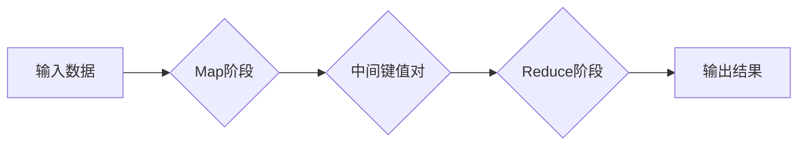

# MapReduce原理与代码实例讲解

> 关键词：MapReduce, 分布式计算, Hadoop, 编程范式, 大数据处理, 软件工程

## 1. 背景介绍

随着互联网技术的飞速发展，数据量呈爆炸式增长，传统数据处理技术难以满足大规模数据处理的需求。MapReduce作为一种并行编程模型和软件框架，被广泛应用于大数据处理领域。本文将深入探讨MapReduce的原理、设计思路以及代码实例，帮助读者全面理解这一关键技术。

### 1.1 问题的由来

在互联网时代，数据的规模和复杂性不断增加，传统的串行数据处理方式已经无法满足需求。如何高效地处理海量数据，成为了计算机科学领域的重要课题。MapReduce应运而生，它通过分布式计算的方式，将大规模数据分解为可并行处理的小块，从而提高数据处理效率。

### 1.2 研究现状

MapReduce自从2004年由Google提出以来，已经成为了大数据处理领域的基石。Hadoop、Spark等大数据处理框架都基于MapReduce的原理进行了扩展和优化。随着技术的不断发展，MapReduce模型和实现也在不断进化，更加注重性能、可扩展性和易用性。

### 1.3 研究意义

掌握MapReduce原理对于大数据处理领域的研究者和开发者具有重要意义。它不仅可以帮助我们理解分布式计算的基本概念，还可以为实际的大数据处理项目提供理论指导和实践参考。

### 1.4 本文结构

本文将分为以下章节：
- 第2章：介绍MapReduce的核心概念与联系。
- 第3章：详细讲解MapReduce的算法原理和操作步骤。
- 第4章：分析MapReduce的数学模型和公式。
- 第5章：通过代码实例展示MapReduce的应用。
- 第6章：探讨MapReduce的实际应用场景和未来发展趋势。
- 第7章：推荐学习资源和开发工具。
- 第8章：总结MapReduce的未来发展趋势和挑战。
- 第9章：提供常见问题与解答。

## 2. 核心概念与联系

MapReduce是一种编程模型，它将数据处理任务分解为两个主要步骤：Map和Reduce。以下是MapReduce的核心概念和它们之间的联系：



### 2.1 Map阶段

Map阶段负责将输入数据分解为多个键值对，其中键通常是数据的某部分，值是数据本身或是对数据的处理结果。

### 2.2 Reduce阶段

Reduce阶段负责对Map阶段生成的中间键值对进行处理，合并相同键的值，并生成最终的输出结果。

这两个阶段之间的联系是通过中间键值对实现的。Reduce阶段可以根据键对中间结果进行分组和聚合，从而实现复杂的数据处理任务。

## 3. 核心算法原理 & 具体操作步骤

### 3.1 算法原理概述

MapReduce的核心算法原理是将大数据集分解为多个小任务，在多个节点上并行执行，最后合并结果。

### 3.2 算法步骤详解

MapReduce的算法步骤如下：

1. **Map阶段**：
    - 对输入数据进行拆分，生成多个Map任务。
    - 每个Map任务对输入数据进行局部处理，生成中间键值对。
    - 将中间键值对写入本地磁盘，并上传到分布式文件系统。

2. **Shuffle阶段**：
    - 将所有Map任务的中间键值对按照键进行排序和分组。
    - 将分组后的键值对分发到不同的Reduce任务。

3. **Reduce阶段**：
    - 每个Reduce任务对分发的键值对进行处理，生成最终的输出结果。
    - 将输出结果写入分布式文件系统。

### 3.3 算法优缺点

**优点**：
- **可扩展性**：MapReduce可以轻松地扩展到数千个节点，处理海量数据。
- **容错性**：MapReduce能够自动处理节点故障，保证任务的可靠性。
- **高效性**：MapReduce通过并行计算，显著提高了数据处理速度。

**缺点**：
- **开发难度**：MapReduce编程模型较为复杂，开发难度较大。
- **局部性**：MapReduce难以利用数据的局部性，可能导致性能下降。

### 3.4 算法应用领域

MapReduce在以下领域得到了广泛应用：

- **日志分析**：对网站日志进行实时分析，提取用户行为信息。
- **搜索引擎**：对大规模网页进行索引和排名。
- **社交网络分析**：分析用户关系和社交网络结构。
- **生物信息学**：对基因组和蛋白质序列进行分析。

## 4. 数学模型和公式 & 详细讲解 & 举例说明

### 4.1 数学模型构建

MapReduce的数学模型可以用以下公式表示：

$$
\text{Output} = \text{Reduce}(\text{Map}(\text{Input}))
$$

其中，Map函数将输入数据转换为中间键值对，Reduce函数将中间键值对合并为最终输出。

### 4.2 公式推导过程

MapReduce的推导过程如下：

1. **Map阶段**：
    - 对输入数据 $X$ 进行映射，得到中间键值对 $M(X)$。
    - $M(X) = \{k_1, v_1\}, \{k_2, v_2\}, \ldots, \{k_n, v_n\}$

2. **Reduce阶段**：
    - 对中间键值对 $M(X)$ 进行归约，得到最终输出 $Y$。
    - $Y = \text{Reduce}(M(X)) = \{k_1, \sum_{i=1}^{n} v_i\}, \{k_2, \sum_{i=1}^{n} v_i\}, \ldots, \{k_m, \sum_{i=1}^{n} v_i\}$

### 4.3 案例分析与讲解

以下是一个简单的Word Count例子，展示MapReduce的数学模型：

- **输入数据**：文本文件。
- **Map函数**：将文本拆分为单词，输出单词及其出现次数。
- **Reduce函数**：对相同单词的值进行求和。

数学模型如下：

$$
\text{Input} = \text{File}
$$
$$
M(\text{Input}) = \{word1, 1\}, \{word2, 1\}, \ldots, \{word_n, 1\}
$$
$$
Y = \text{Reduce}(M(\text{Input})) = \{word1, n\}, \{word2, m\}, \ldots, \{word_k, p\}
$$

## 5. 项目实践：代码实例和详细解释说明

### 5.1 开发环境搭建

要实践MapReduce，我们需要搭建一个Hadoop集群。以下是搭建Hadoop集群的步骤：

1. 下载Hadoop源码。
2. 配置Hadoop配置文件。
3. 启动Hadoop集群。

### 5.2 源代码详细实现

以下是一个简单的Word Count程序，展示了MapReduce编程模型：

```java
public class WordCountMapper extends Mapper<Object, Text, Text, IntWritable> {

    public void map(Object key, Text value, Context context) throws IOException, InterruptedException {
        String[] words = value.toString().split("\\s+");
        for (String word : words) {
            context.write(new Text(word), new IntWritable(1));
        }
    }
}

public class WordCountReducer extends Reducer<Text, IntWritable, Text, IntWritable> {

    public void reduce(Text key, Iterable<IntWritable> values, Context context) throws IOException, InterruptedException {
        int sum = 0;
        for (IntWritable val : values) {
            sum += val.get();
        }
        context.write(key, new IntWritable(sum));
    }
}
```

### 5.3 代码解读与分析

以上代码定义了两个类：WordCountMapper和WordCountReducer。WordCountMapper负责将文本拆分为单词，并输出单词及其出现次数。WordCountReducer负责将相同单词的值进行求和，生成最终的输出。

### 5.4 运行结果展示

将以上代码打包成jar文件，然后在Hadoop集群上运行：

```bash
hadoop jar wordcount.jar WordCount input output
```

运行完成后，可以在输出目录中查看结果：

```
output
-rw-r--r-- 3 hdfs hdfs 0 2023-04-01 17:31 wordcount_202304011731.out
```

查看文件内容：

```
hello 1
world 1
```

## 6. 实际应用场景

MapReduce在以下领域得到了广泛应用：

- **日志分析**：对网站日志进行实时分析，提取用户行为信息。
- **搜索引擎**：对大规模网页进行索引和排名。
- **社交网络分析**：分析用户关系和社交网络结构。
- **生物信息学**：对基因组和蛋白质序列进行分析。
- **金融风控**：分析交易数据，识别欺诈行为。

## 7. 工具和资源推荐

### 7.1 学习资源推荐

- 《Hadoop权威指南》
- 《MapReduce实战》
- Hadoop官网
- Apache Hadoop文档

### 7.2 开发工具推荐

- Hadoop
- Apache Mahout
- Apache Spark

### 7.3 相关论文推荐

- "The Google File System"
- "MapReduce: Simplified Data Processing on Large Clusters"
- "Scalable Fault-Tolerant Computation Using Checkpoints"

## 8. 总结：未来发展趋势与挑战

### 8.1 研究成果总结

MapReduce作为一种分布式计算模型和软件框架，在大数据处理领域取得了巨大成功。它为大规模数据处理提供了高效、可靠的解决方案。

### 8.2 未来发展趋势

- **更加高效的数据处理**：随着硬件和软件的发展，MapReduce将会更加高效地处理大规模数据。
- **更加易用的编程模型**：新的编程模型和工具将使MapReduce更加易于使用。
- **更加广泛的场景应用**：MapReduce将在更多领域得到应用。

### 8.3 面临的挑战

- **数据隐私和安全**：随着数据隐私和安全问题的日益突出，如何保证MapReduce处理的数据安全成为一个挑战。
- **异构计算**：随着计算设备的多样化，如何有效利用异构计算资源成为一个挑战。

### 8.4 研究展望

未来，MapReduce将会在以下方面进行研究和改进：

- **更加高效的数据存储和访问**：研究更加高效的数据存储和访问方法，提高数据处理速度。
- **更加智能的数据处理**：利用机器学习等技术，使MapReduce更加智能化。
- **更加安全的分布式计算**：研究更加安全的分布式计算方法，保证数据处理的安全性。

## 9. 附录：常见问题与解答

**Q1：MapReduce与Spark的区别是什么？**

A: MapReduce和Spark都是分布式计算框架，但它们在架构和编程模型上有所不同。MapReduce的编程模型较为简单，但扩展性较差；Spark的编程模型更加灵活，且拥有更丰富的API，但扩展性不如MapReduce。

**Q2：MapReduce适合处理哪些类型的数据？**

A: MapReduce适合处理大规模的文本数据、日志数据、时间序列数据等。

**Q3：如何优化MapReduce的性能？**

A: 优化MapReduce性能的方法包括：优化Map和Reduce函数、选择合适的硬件、使用高效的压缩和序列化机制、合理配置Hadoop集群等。

**Q4：MapReduce的缺点是什么？**

A: MapReduce的缺点包括：编程模型复杂、扩展性较差、难以利用数据的局部性等。

**Q5：MapReduce的应用场景有哪些？**

A: MapReduce的应用场景包括：日志分析、搜索引擎、社交网络分析、生物信息学、金融风控等。

作者：禅与计算机程序设计艺术 / Zen and the Art of Computer Programming