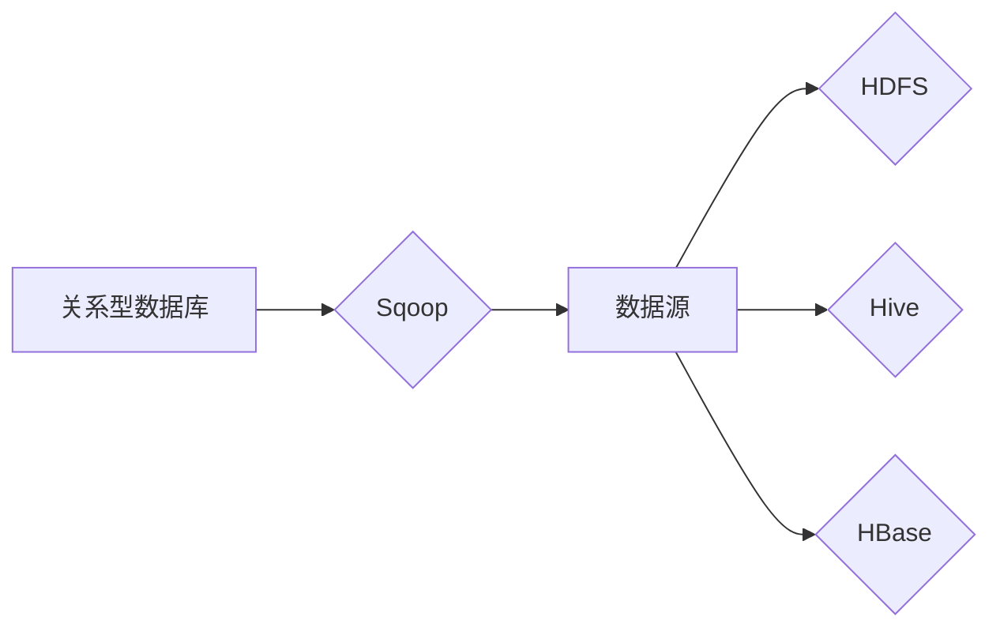

# Sqoop导入导出原理与代码实例讲解

> 关键词：Sqoop, Hadoop, 数据迁移, 数据同步, 导入导出, 元数据, Hive, HDFS

## 1. 背景介绍

随着大数据技术的快速发展，数据迁移和同步成为了企业数据管理和分析过程中的重要环节。Sqoop作为Apache Hadoop生态系统中的一个重要工具，专门用于在Hadoop生态系统（如HDFS、Hive、HBase等）与关系型数据库之间进行数据的导入导出。本文将深入讲解Sqoop的原理、操作步骤、应用领域以及代码实例，帮助读者全面理解并掌握Sqoop的使用。

### 1.1 问题的由来

在企业信息化过程中，数据通常分散存储在多个系统中，如关系型数据库、NoSQL数据库、文件系统等。为了进行数据分析、挖掘和报告，往往需要将这些数据迁移到Hadoop生态系统中进行统一处理。Sqoop正是为了解决这一需求而诞生的。

### 1.2 研究现状

Sqoop自2009年开源以来，已经成为了Hadoop生态系统中的一个成熟工具。随着版本的不断更新，Sqoop的功能也在不断完善，如支持更多的数据源和目标系统、增强数据迁移性能、提高数据迁移的可靠性和安全性等。

### 1.3 研究意义

掌握Sqoop的使用对于大数据开发者和数据工程师来说至关重要。它可以帮助我们：

- 将关系型数据库中的数据导入到Hadoop生态系统中，方便进行大数据分析。
- 将Hadoop生态系统中的数据导出到关系型数据库，实现数据同步。
- 实现不同Hadoop生态系统组件之间的数据迁移，如从Hive到HBase等。

### 1.4 本文结构

本文将按照以下结构进行讲解：

- 第2部分：介绍Sqoop的核心概念与联系。
- 第3部分：详细阐述Sqoop的原理和操作步骤。
- 第4部分：讲解Sqoop中常用的数学模型和公式。
- 第5部分：提供Sqoop的代码实例和详细解释。
- 第6部分：探讨Sqoop的实际应用场景。
- 第7部分：推荐Sqoop相关的学习资源和开发工具。
- 第8部分：总结Sqoop的未来发展趋势与挑战。

## 2. 核心概念与联系

### 2.1 核心概念

- **Sqoop**：Apache Hadoop生态系统中的一个工具，用于在关系型数据库和Hadoop生态系统（如HDFS、Hive、HBase等）之间进行数据的导入导出。
- **Hadoop**：一个开源的大数据处理框架，包括HDFS（分布式文件系统）、MapReduce（数据处理引擎）等组件。
- **HDFS**：Hadoop的分布式文件系统，用于存储大规模数据。
- **Hive**：一个数据仓库工具，用于数据存储、查询和分析。
- **HBase**：一个分布式的、可扩展的非关系型数据库，用于存储非结构化和半结构化的稀疏数据。

### 2.2 核心概念原理和架构的 Mermaid 流程图



### 2.3 核心概念联系

Sqoop作为连接关系型数据库和Hadoop生态系统的桥梁，通过以下方式实现数据的导入导出：

- 将关系型数据库中的数据导入到HDFS、Hive或HBase中。
- 将HDFS、Hive或HBase中的数据导出到关系型数据库。

## 3. 核心算法原理 & 具体操作步骤

### 3.1 算法原理概述

Sqoop的数据迁移过程主要包括以下步骤：

1.Sqoop读取关系型数据库中的数据，并将其转换为Hadoop支持的格式，如文本、序列化对象或JSON。
2.将转换后的数据写入到HDFS、Hive或HBase中。

### 3.2 算法步骤详解

1. **安装Sqoop**：从Apache Sqoop官方网站下载并安装Sqoop。
2. **配置Sqoop**：配置Sqoop的连接信息，包括数据库连接信息、Hadoop集群信息等。
3. **编写Sqoop命令**：编写Sqoop命令，指定数据迁移的源和目标，以及相关参数。
4. **执行Sqoop命令**：执行Sqoop命令，开始数据迁移。

### 3.3 算法优缺点

**优点**：

- 简单易用：Sqoop提供了简单易用的命令行工具和Java API，方便用户进行数据迁移。
- 支持多种数据源和目标系统：Sqoop支持多种关系型数据库和Hadoop生态系统组件。
- 高效的数据迁移：Sqoop支持并行数据迁移，可以提高迁移效率。

**缺点**：

- 需要手动编写Sqoop命令：对于大型数据迁移，需要手动编写复杂的Sqoop命令。
- 缺乏实时性：Sqoop不支持实时数据同步。

### 3.4 算法应用领域

Sqoop广泛应用于以下领域：

- 数据迁移：将关系型数据库中的数据迁移到Hadoop生态系统中。
- 数据同步：将Hadoop生态系统中的数据同步到关系型数据库。
- 数据分析：将Hadoop生态系统中的数据用于数据分析、挖掘和报告。

## 4. 数学模型和公式 & 详细讲解 & 举例说明

### 4.1 数学模型构建

Sqoop的数据迁移过程中，涉及到的数学模型主要包括：

- 数据量模型：描述数据迁移过程中的数据量。
- 传输速率模型：描述数据迁移过程中的传输速率。
- 时间模型：描述数据迁移所需的时间。

### 4.2 公式推导过程

假设数据量为 $D$，传输速率为 $R$，则数据迁移所需的时间 $T$ 可以表示为：

$$
T = \frac{D}{R}
$$

### 4.3 案例分析与讲解

假设我们需要将一个包含1亿条记录的关系型数据库表迁移到HDFS中。假设数据库和HDFS之间的网络带宽为1 Gbps，则数据迁移所需的时间约为：

$$
T = \frac{1亿 \times 8字节/记录}{1 \times 10^9字节/秒} \approx 80秒
$$

## 5. 项目实践：代码实例和详细解释说明

### 5.1 开发环境搭建

1. 安装Java环境：Sqoop是基于Java开发的，因此需要安装Java环境。
2. 安装Hadoop：从Apache Hadoop官方网站下载并安装Hadoop。
3. 安装Sqoop：从Apache Sqoop官方网站下载并安装Sqoop。

### 5.2 源代码详细实现

以下是一个简单的Sqoop导入命令示例：

```bash
sqoop import \
  --connect jdbc:mysql://mysqlserver/dbname \
  --username username \
  --password password \
  --table tablename \
  --target-dir /user/hive/warehouse/tablename
```

### 5.3 代码解读与分析

- `--connect`：指定数据库连接信息，格式为`jdbc:mysql://<主机名>/<数据库名>`.
- `--username`：指定数据库用户名。
- `--password`：指定数据库密码。
- `--table`：指定需要导入的表名。
- `--target-dir`：指定数据在HDFS中的存储路径。

### 5.4 运行结果展示

执行上述命令后，Sqoop会从关系型数据库中读取数据，并将其导入到HDFS中。

## 6. 实际应用场景

### 6.1 数据迁移

将关系型数据库中的数据迁移到Hadoop生态系统中，方便进行大数据分析。

### 6.2 数据同步

将Hadoop生态系统中的数据同步到关系型数据库，实现数据一致性。

### 6.3 数据分析

将Hadoop生态系统中的数据用于数据分析、挖掘和报告。

## 7. 工具和资源推荐

### 7.1 学习资源推荐

- Apache Sqoop官方文档：[https://sqoop.apache.org/docs/latest/sqoop-docs.html](https://sqoop.apache.org/docs/latest/sqoop-docs.html)
- 《Hadoop实战》
- 《大数据技术精粹》

### 7.2 开发工具推荐

- IntelliJ IDEA
- PyCharm

### 7.3 相关论文推荐

- 《Sqoop: An Extensible and Flexible Data Integration Tool for Hadoop》

## 8. 总结：未来发展趋势与挑战

### 8.1 研究成果总结

本文介绍了Sqoop的原理、操作步骤、应用领域以及代码实例，帮助读者全面理解并掌握Sqoop的使用。

### 8.2 未来发展趋势

- Sqoop将支持更多数据源和目标系统。
- Sqoop将提供更加丰富的功能，如数据转换、数据清洗等。
- Sqoop将与其他大数据技术更加紧密地集成。

### 8.3 面临的挑战

- Sqoop需要进一步优化数据迁移性能。
- Sqoop需要提高数据迁移的可靠性和安全性。
- Sqoop需要提供更加直观的用户界面。

### 8.4 研究展望

Sqoop将继续发展，成为Hadoop生态系统中的一个重要工具，为大数据应用提供更加便捷的数据迁移和同步解决方案。

## 9. 附录：常见问题与解答

### 9.1 Sqoop支持哪些数据库？

A：Sqoop支持多种关系型数据库，如MySQL、PostgreSQL、Oracle等。

### 9.2 如何解决Sqoop数据迁移失败的问题？

A：检查数据库连接信息是否正确，检查网络连接是否稳定，检查目标存储路径是否有足够的空间等。

### 9.3 Sqoop如何提高数据迁移性能？

A：使用并行数据迁移，提高数据传输速率，优化Sqoop命令等。

### 9.4 Sqoop如何保证数据迁移的可靠性？

A：使用Sqoop的检查点功能，在数据迁移过程中遇到问题时可以恢复到上一个检查点。

作者：禅与计算机程序设计艺术 / Zen and the Art of Computer Programming