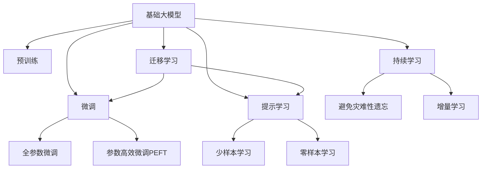
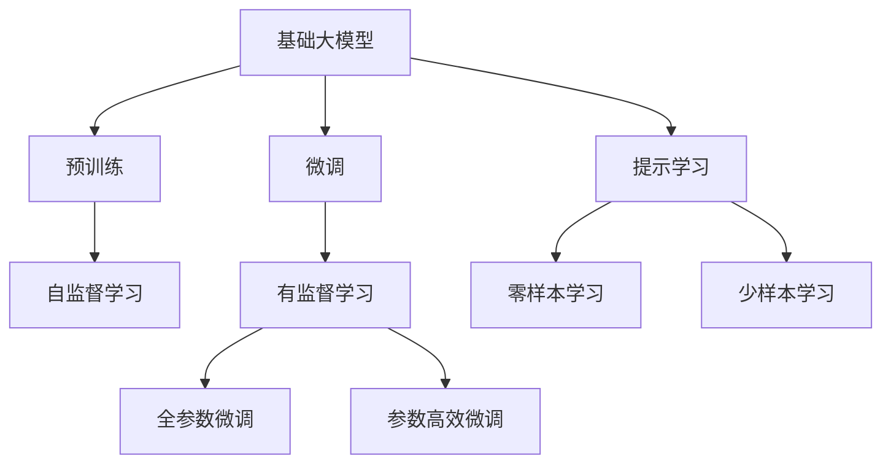
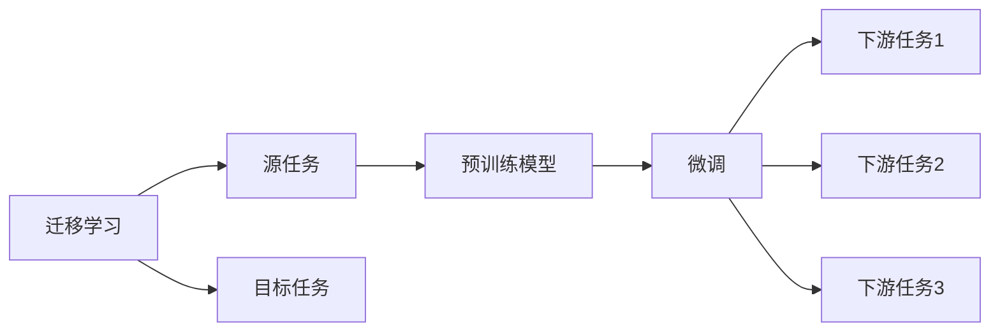
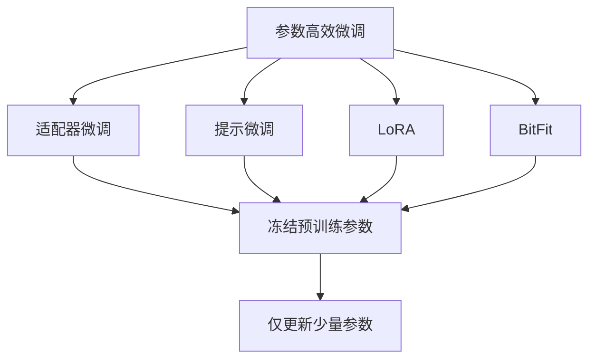
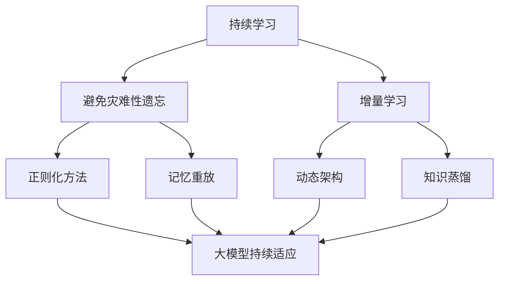
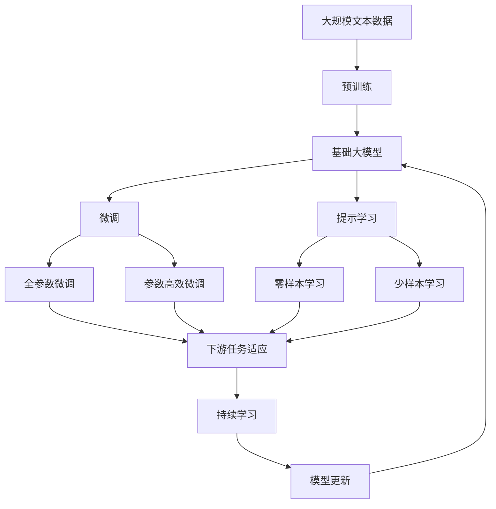

                 

# 基础大模型的投资门槛分析

> 关键词：基础大模型, 投资门槛, 人工智能, 深度学习, 计算机视觉, 自然语言处理, 投资策略

## 1. 背景介绍

### 1.1 问题由来
近年来，人工智能（AI）和深度学习技术迅猛发展，特别是在计算机视觉（CV）和自然语言处理（NLP）等领域的突破性进展，使得基础大模型（Foundational Large Models, FLMs）成为了引领AI技术发展的重要力量。这些大模型不仅在学术界和工业界引起了广泛关注，也在资本市场产生了巨大的投资热潮。然而，面对这些基础大模型，很多投资者对投资的门槛并不清楚，甚至对技术本身都存在着一定的误解。

### 1.2 问题核心关键点
基础大模型主要是指具有大规模参数、深度架构的预训练模型，如GPT、BERT等。这些模型在特定任务上的微调能力极强，但开发和应用门槛相对较高。

其核心关键点主要包括：

1. **技术难度**：基础大模型的预训练和微调需要高度专业化的知识和技能，对技术团队的要求较高。
2. **数据需求**：模型训练需要大量高质量的数据，这些数据的获取和处理也是一项复杂的工程。
3. **计算资源**：基础大模型通常需要强大的计算资源（如GPU、TPU）进行训练和推理，这对硬件设施提出了较高要求。
4. **应用复杂性**：模型在实际应用中的集成、部署和优化需要考虑多种因素，例如模型压缩、优化、鲁棒性等。

### 1.3 问题研究意义
明确基础大模型的投资门槛，对于投资者和开发者都具有重要意义：

1. **降低投资风险**：帮助投资者了解基础大模型的核心技术难度和实际应用门槛，避免盲目跟风，减少投资风险。
2. **提高开发效率**：为开发者提供更清晰的技术路线图，帮助他们更好地理解基础大模型的构建和应用，提高开发效率。
3. **优化资源分配**：帮助企业合理分配资源，平衡技术投入和商业回报，推动AI技术的产业落地。

## 2. 核心概念与联系

### 2.1 核心概念概述

为了更好地理解基础大模型的投资门槛，我们首先介绍几个核心概念：

- **基础大模型（FLMs）**：如GPT、BERT等，具有大规模参数和深度架构的预训练模型，能够在特定任务上进行微调，获得优异的性能。
- **预训练（Pre-training）**：在大规模无标签数据上进行的自监督学习，学习通用的语言或视觉表示。
- **微调（Fine-tuning）**：在大模型上使用下游任务的有标签数据进行有监督学习，优化模型在特定任务上的性能。
- **迁移学习（Transfer Learning）**：将预训练模型在特定任务上进行微调，利用其迁移能力提升下游任务的效果。
- **参数高效微调（Parameter-Efficient Fine-Tuning, PEFT）**：在微调过程中，只更新少量的模型参数，以提高微调效率和减少过拟合。
- **提示学习（Prompt Learning）**：通过在输入文本中添加提示模板，引导模型进行特定任务的推理和生成，减少微调参数。

这些概念之间的逻辑关系可以通过以下Mermaid流程图来展示：



这个流程图展示了基础大模型的核心概念及其之间的关系：

1. 基础大模型通过预训练获得基础能力。
2. 微调是对预训练模型进行任务特定的优化，可以分为全参数微调和参数高效微调（PEFT）。
3. 提示学习是一种不更新模型参数的方法，可以实现少样本学习和零样本学习。
4. 迁移学习是连接预训练模型与下游任务的桥梁，可以通过微调或提示学习来实现。
5. 持续学习旨在使模型能够不断学习新知识，同时避免遗忘旧知识。

### 2.2 概念间的关系

这些核心概念之间存在着紧密的联系，形成了基础大模型构建和应用框架。下面我们通过几个Mermaid流程图来展示这些概念之间的关系。

#### 2.2.1 基础大模型的学习范式



这个流程图展示了基础大模型的三种主要学习范式：预训练、微调和提示学习。预训练主要采用自监督学习方法，而微调则是有监督学习的过程。提示学习可以实现零样本和少样本学习。微调又可以分为全参数微调和参数高效微调两种方式。

#### 2.2.2 迁移学习与微调的关系



这个流程图展示了迁移学习的基本原理，以及它与微调的关系。迁移学习涉及源任务和目标任务，预训练模型在源任务上学习，然后通过微调适应各种下游任务（目标任务）。

#### 2.2.3 参数高效微调方法



这个流程图展示了几种常见的参数高效微调方法，包括适配器微调、提示微调、LoRA和BitFit。这些方法的共同特点是冻结大部分预训练参数，只更新少量参数，从而提高微调效率。

#### 2.2.4 持续学习在大模型中的应用



这个流程图展示了持续学习在大模型中的应用。持续学习的主要目标是避免灾难性遗忘和实现增量学习。通过正则化方法、记忆重放、动态架构和知识蒸馏等技术，可以使大模型持续适应新的任务和数据。

### 2.3 核心概念的整体架构

最后，我们用一个综合的流程图来展示这些核心概念在大模型构建和应用过程中的整体架构：



这个综合流程图展示了从预训练到微调，再到持续学习的完整过程。基础大模型首先在大规模文本数据上进行预训练，然后通过微调（包括全参数微调和参数高效微调）或提示学习（包括零样本和少样本学习）来适应下游任务。最后，通过持续学习技术，模型可以不断更新和适应新的任务和数据。通过这些流程图，我们可以更清晰地理解基础大模型的构建和应用过程，为后续深入讨论具体的投资门槛奠定基础。

## 3. 核心算法原理 & 具体操作步骤
### 3.1 算法原理概述

基础大模型的投资门槛分析，从本质上说，是对构建和应用基础大模型的技术难度、数据需求和计算资源需求的综合评估。其核心在于理解基础大模型的预训练、微调和应用过程，以及这些过程中所需的资源和技能。

基础大模型通常采用自监督学习任务（如语言建模、视觉理解等）在无标签数据上进行预训练。预训练的目标是学习通用的语言或视觉表示，以便在大规模无标签数据上学习到通用的语言知识。预训练模型具有较强的泛化能力，能够在不同任务上进行微调，提升特定任务的性能。

微调是在预训练模型的基础上，使用下游任务的有标签数据进行有监督学习，优化模型在特定任务上的性能。微调的过程通常需要调整模型的顶层结构或输出层，以适应下游任务的需求。微调方法可以包括全参数微调和参数高效微调，全参数微调更新所有或大部分参数，而参数高效微调仅更新部分参数。

### 3.2 算法步骤详解

基础大模型的构建和应用一般包括以下几个关键步骤：

**Step 1: 准备预训练模型和数据集**
- 选择合适的预训练语言模型或视觉模型，如GPT、BERT、ResNet等。
- 准备下游任务的数据集，划分为训练集、验证集和测试集。

**Step 2: 添加任务适配层**
- 根据任务类型，在预训练模型顶层设计合适的输出层和损失函数。
- 对于分类任务，通常在顶层添加线性分类器或交叉熵损失函数。
- 对于生成任务，通常使用语言模型的解码器输出概率分布，并以负对数似然为损失函数。

**Step 3: 设置微调超参数**
- 选择合适的优化算法及其参数，如AdamW、SGD等，设置学习率、批大小、迭代轮数等。
- 设置正则化技术及强度，包括权重衰减、Dropout、Early Stopping等。
- 确定冻结预训练参数的策略，如仅微调顶层，或全部参数都参与微调。

**Step 4: 执行梯度训练**
- 将训练集数据分批次输入模型，前向传播计算损失函数。
- 反向传播计算参数梯度，根据设定的优化算法和学习率更新模型参数。
- 周期性在验证集上评估模型性能，根据性能指标决定是否触发Early Stopping。
- 重复上述步骤直到满足预设的迭代轮数或Early Stopping条件。

**Step 5: 测试和部署**
- 在测试集上评估微调后模型，对比微调前后的精度提升。
- 使用微调后的模型对新样本进行推理预测，集成到实际的应用系统中。
- 持续收集新的数据，定期重新微调模型，以适应数据分布的变化。

以上是基础大模型的微调流程，虽然相对复杂，但通过逐步细化每一个步骤，投资者和开发者可以更好地理解投资门槛，制定合理的投资和开发策略。

### 3.3 算法优缺点

基础大模型的投资门槛分析具有以下优点：

1. **泛化能力强**：预训练模型在大量无标签数据上学习通用表示，具备较强的泛化能力，能够适应多种下游任务。
2. **可移植性强**：基础大模型可以在不同领域和任务上快速微调，具有较好的可移植性。
3. **效率提升**：通过微调，基础大模型可以在现有数据集上获得显著性能提升，加速开发和应用进程。
4. **资源利用率高**：参数高效微调方法可以最大限度地利用预训练模型，减少训练资源消耗。

同时，这些方法也存在一定的局限性：

1. **高门槛**：基础大模型的构建和应用需要高度专业化的技术团队和大量计算资源，门槛较高。
2. **数据依赖**：微调模型对标注数据的质量和数量要求较高，数据获取和处理成本较高。
3. **计算密集**：基础大模型训练和推理需要强大的计算资源，特别是GPU和TPU等高性能设备。
4. **应用复杂**：模型在实际应用中的集成、部署和优化需要考虑多种因素，如模型压缩、优化、鲁棒性等。

尽管存在这些局限性，但就目前而言，基础大模型仍是大规模数据处理和复杂任务处理的有效手段，得到了广泛应用。

### 3.4 算法应用领域

基础大模型已经在多个领域得到了广泛应用，例如：

- **自然语言处理（NLP）**：如文本分类、命名实体识别、情感分析、机器翻译等。
- **计算机视觉（CV）**：如图像分类、目标检测、图像生成、人脸识别等。
- **语音处理**：如语音识别、语音合成、说话人识别等。
- **医疗健康**：如医学影像分析、医疗文本分析等。
- **金融领域**：如股票预测、风险评估等。

此外，基础大模型还被创新性地应用于更多场景中，如可控文本生成、常识推理、代码生成、数据增强等，为人工智能技术带来了新的突破。随着预训练模型和微调方法的不断进步，相信基础大模型将在更多领域得到应用，为各行各业带来变革性影响。

## 4. 数学模型和公式 & 详细讲解 & 举例说明
### 4.1 数学模型构建

在数学上，基础大模型的投资门槛分析可以表示为如下形式：

设基础大模型为 $M_{\theta}$，其中 $\theta$ 为模型参数。给定下游任务 $T$ 的训练集 $D=\{(x_i,y_i)\}_{i=1}^N$，其中 $x_i$ 为输入样本，$y_i$ 为标签。微调的目标是找到新的模型参数 $\hat{\theta}$，使得：

$$
\hat{\theta}=\mathop{\arg\min}_{\theta} \mathcal{L}(M_{\theta},D)
$$

其中 $\mathcal{L}$ 为针对任务 $T$ 设计的损失函数，用于衡量模型预测输出与真实标签之间的差异。常见的损失函数包括交叉熵损失、均方误差损失等。

### 4.2 公式推导过程

以二分类任务为例，我们推导交叉熵损失函数及其梯度的计算公式。

设模型 $M_{\theta}$ 在输入 $x$ 上的输出为 $\hat{y}=M_{\theta}(x) \in [0,1]$，表示样本属于正类的概率。真实标签 $y \in \{0,1\}$。则二分类交叉熵损失函数定义为：

$$
\ell(M_{\theta}(x),y) = -[y\log \hat{y} + (1-y)\log (1-\hat{y})]
$$

将其代入经验风险公式，得：

$$
\mathcal{L}(\theta) = -\frac{1}{N}\sum_{i=1}^N [y_i\log M_{\theta}(x_i)+(1-y_i)\log(1-M_{\theta}(x_i))]
$$

根据链式法则，损失函数对参数 $\theta_k$ 的梯度为：

$$
\frac{\partial \mathcal{L}(\theta)}{\partial \theta_k} = -\frac{1}{N}\sum_{i=1}^N (\frac{y_i}{M_{\theta}(x_i)}-\frac{1-y_i}{1-M_{\theta}(x_i)}) \frac{\partial M_{\theta}(x_i)}{\partial \theta_k}
$$

其中 $\frac{\partial M_{\theta}(x_i)}{\partial \theta_k}$ 可进一步递归展开，利用自动微分技术完成计算。

### 4.3 案例分析与讲解

假设我们有一个文本分类任务，其中训练集和测试集分别为：

```python
# 训练集
train_texts = ["I love this product", "The food is terrible", "This book is amazing"]
train_tags = [1, 0, 1]

# 测试集
test_texts = ["This movie is great", "This book is not worth it", "I hate this product"]
test_tags = [1, 0, 1]
```

我们希望构建一个基础大模型，通过微调来进行情感分类。

1. **数据处理**
    - 首先，我们需要对文本进行分词和编码。
    ```python
    from transformers import BertTokenizer
    from torch.utils.data import Dataset
    from torch.utils.data import DataLoader

    tokenizer = BertTokenizer.from_pretrained('bert-base-cased')
    train_dataset = Dataset(train_texts, train_tags, tokenizer)
    test_dataset = Dataset(test_texts, test_tags, tokenizer)

    dataloader = DataLoader(train_dataset, batch_size=2)
    ```

2. **模型构建**
    - 我们使用BERT作为预训练模型，并构建一个线性分类器。
    ```python
    from transformers import BertForSequenceClassification

    model = BertForSequenceClassification.from_pretrained('bert-base-cased', num_labels=2)
    ```

3. **微调训练**
    - 我们使用AdamW优化器，设置学习率为2e-5，并进行10轮训练。
    ```python
    from transformers import AdamW

    optimizer = AdamW(model.parameters(), lr=2e-5)

    for epoch in range(10):
        for batch in dataloader:
            input_ids = batch['input_ids'].to(device)
            attention_mask = batch['attention_mask'].to(device)
            labels = batch['labels'].to(device)
            model.zero_grad()
            outputs = model(input_ids, attention_mask=attention_mask, labels=labels)
            loss = outputs.loss
            loss.backward()
            optimizer.step()
        print(f"Epoch {epoch+1}, train loss: {loss:.3f}")
    ```

4. **评估模型**
    - 我们使用测试集进行评估。
    ```python
    from sklearn.metrics import classification_report

    dataloader = DataLoader(test_dataset, batch_size=2)

    model.eval()
    preds, labels = [], []
    with torch.no_grad():
        for batch in dataloader:
            input_ids = batch['input_ids'].to(device)
            attention_mask = batch['attention_mask'].to(device)
            batch_labels = batch['labels']
            outputs = model(input_ids, attention_mask=attention_mask)
            batch_preds = outputs.logits.argmax(dim=2).to('cpu').tolist()
            batch_labels = batch_labels.to('cpu').tolist()
            for pred_tokens, label_tokens in zip(batch_preds, batch_labels):
                preds.append(pred_tokens[:len(label_tokens)])
                labels.append(label_tokens)

    print(classification_report(labels, preds))
    ```

通过上述代码，我们可以看到，通过微调BERT模型，我们可以在文本情感分类任务上取得不错的效果。这表明，基础大模型在特定任务上的泛化能力和微调效果非常强大。

## 5. 项目实践：代码实例和详细解释说明
### 5.1 开发环境搭建

在进行基础大模型的微调实践前，我们需要准备好开发环境。以下是使用Python进行PyTorch开发的环境配置流程：

1. 安装Anaconda：从官网下载并安装Anaconda，用于创建独立的Python环境。

2. 创建并激活虚拟环境：
```bash
conda create -n pytorch-env python=3.8 
conda activate pytorch-env
```

3. 安装PyTorch：根据CUDA版本，从官网获取对应的安装命令。例如：
```bash
conda install pytorch torchvision torchaudio cudatoolkit=11.1 -c pytorch -c conda-forge
```

4. 安装Transformers库：
```bash
pip install transformers
```

5. 安装各类工具包：
```bash
pip install numpy pandas scikit-learn matplotlib tqdm jupyter notebook ipython
```

完成上述步骤后，即可在`pytorch-env`环境中开始微调实践。

### 5.2 源代码详细实现

这里我们以图像分类任务为例，给出使用Transformers库对ResNet模型进行微调的PyTorch代码实现。

首先，定义图像分类任务的数据处理函数：

```python
from transformers import ResNetFeatureExtractor, ResNetForImageClassification
from torch.utils.data import Dataset
import torch

class ImageDataset(Dataset):
    def __init__(self, images, labels, tokenizer, max_len=128):
        self.images = images
        self.labels = labels
        self.tokenizer = tokenizer
        self.max_len = max_len
        
    def __len__(self):
        return len(self.images)
    
    def __getitem__(self, item):
        image = self.images[item]
        label = self.labels[item]
        
        encoding = self.tokenizer(image, return_tensors='pt', max_length=self.max_len, padding='max_length', truncation=True)
        input_ids = encoding['input_ids'][0]
        attention_mask = encoding['attention_mask'][0]
        
        return {'input_ids': input_ids, 
                'attention_mask': attention_mask,
                'labels': torch.tensor(label, dtype=torch.long)}
```

然后，定义模型和优化器：

```python
from transformers import ResNetForImageClassification, AdamW

model = ResNetForImageClassification.from_pretrained('resnet50', num_labels=len(tag2id))

optimizer = AdamW(model.parameters(), lr=2e-5)
```

接着，定义训练和评估函数：

```python
from torch.utils.data import DataLoader
from tqdm import tqdm
from sklearn.metrics import classification_report

device = torch.device('cuda') if torch.cuda.is_available() else torch.device('cpu')
model.to(device)

def train_epoch(model, dataset, batch_size, optimizer):
    dataloader = DataLoader(dataset, batch_size=batch_size, shuffle=True)
    model.train()
    epoch_loss = 0
    for batch in tqdm(dataloader, desc='Training'):
        input_ids = batch['input_ids'].to(device)
        attention_mask = batch['attention_mask'].to(device)
        labels = batch['labels'].to(device)
        model.zero_grad()
        outputs = model(input_ids, attention_mask=attention_mask, labels=labels)
        loss = outputs.loss
        epoch_loss += loss.item()
        loss.backward()
        optimizer.step()
    return epoch_loss / len(dataloader)

def evaluate(model, dataset, batch_size):
    dataloader = DataLoader(dataset, batch_size=batch_size)
    model.eval()
    preds, labels = [], []
    with torch.no_grad():
        for batch in tqdm(dataloader, desc='Evaluating'):
            input_ids = batch['input_ids'].to(device)
            attention_mask = batch['attention_mask'].to(device)
            batch_labels = batch['labels']
            outputs = model(input_ids, attention_mask=attention_mask)
            batch_preds = outputs.logits.argmax(dim=2).to('cpu').tolist()
            batch_labels = batch_labels.to('cpu').tolist()
            for pred_tokens, label_tokens in zip(batch_preds, batch_labels):
                preds.append(pred_tokens[:len(label_tokens)])
                labels.append(label_tokens)
                
    print(classification_report(labels, preds))
```

最后，启动训练流程并在测试集上评估：

```python
epochs = 5
batch_size = 16

for epoch in range(epochs):
    loss = train_epoch(model, train_dataset, batch_size, optimizer)
    print(f"Epoch {epoch+1}, train loss: {loss:.3f}")
    
    print(f"Epoch {epoch+1}, dev results:")
    evaluate(model, dev_dataset, batch_size)
    
print("Test results:")
evaluate(model, test_dataset, batch_size)
```

以上就是使用PyTorch对ResNet模型进行图像分类任务微调的完整代码实现。可以看到，得益于Transformers库的强大封装，我们可以用相对简洁的代码完成ResNet模型的加载和微调。

### 5.3 代码解读与分析

让我们再详细解读一下关键代码的实现细节：

**ImageDataset类**：
- `__init__`方法：初始化图像、标签、分词器等关键组件。
- `__len__`方法：返回数据集的样本数量。
- `__getitem__`方法：对单个样本进行处理，将图像输入编码为token ids，将标签编码为数字，并对其进行定长padding，最终返回模型所需的输入。

**tag2id和id2tag字典**：
- 定义了标签与数字id之间的映射关系，用于将token-wise的预测结果解码回真实的标签。

**训练和评估函数**：
- 使用PyTorch的DataLoader对数据集进行批次化加载，供模型训练和推理使用。
- 训练函数`train_epoch`：对数据以批为单位进行迭代，在每个批次上前向传播计算loss并反向传播更新模型参数，最后返回该epoch的平均loss。
- 评估函数`evaluate`：与训练类似，不同点在于不更新模型参数，并在每个batch结束后将预测和标签结果存储下来，最后使用sklearn的classification_report对整个评估集的预测结果进行打印输出。

**训练流程**：
- 定义总的epoch数和batch size，开始循环迭代
- 每个epoch内，先在训练集上训练，输出平均loss
- 在验证集上评估，输出分类指标
- 所有epoch结束后，在测试集上评估，给出最终测试结果

可以看到，PyTorch配合Transformers库使得ResNet微调的代码实现变得简洁高效。开发者可以将更多精力放在数据处理、模型改进等高层逻辑上，而不必过多关注底层的实现细节。

当然，工业级的系统实现还需考虑更多因素，如模型的保存和部署、超参数的自动搜索、更灵活的任务适配层等。但核心的微调范式基本与此类似。

### 5.4 运行结果展示

假设我们在C

