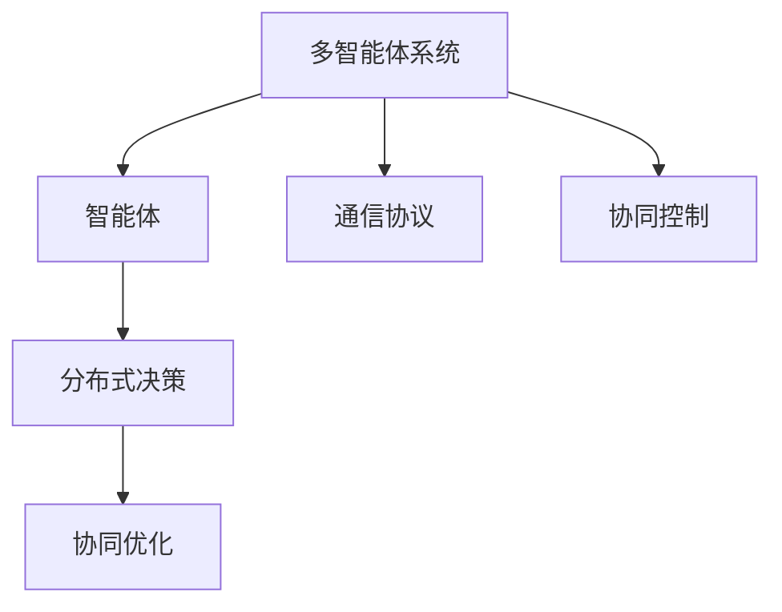
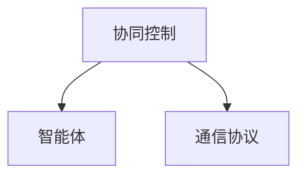
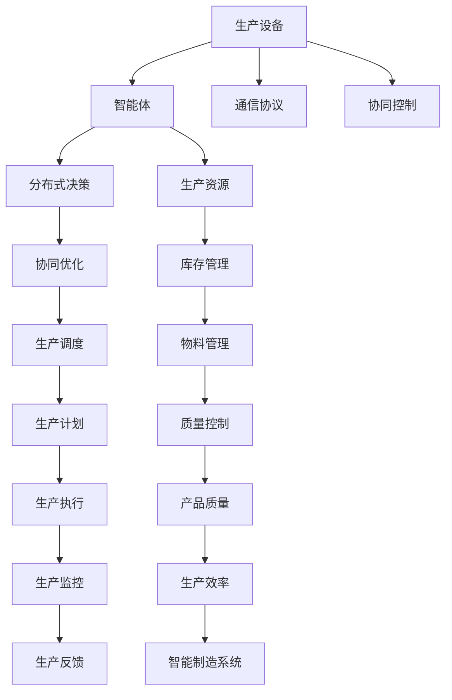

                 

# 多智能体协同机制在智能制造系统中的应用

## 1. 背景介绍

### 1.1 问题由来
随着信息技术在制造业的深度应用，智能制造系统（Intelligent Manufacturing Systems, IMS）逐渐成为现代制造业的核心竞争力和重要标志。其核心目标是实现生产过程的自动化、智能化，以及生产数据的实时分析和预测，从而提升生产效率和产品质量。然而，现有的大规模制造系统往往存在以下挑战：

1. **信息孤岛问题**：生产过程中的设备、系统和人员之间的信息无法有效整合和共享，导致生产效率低下，数据利用率低。
2. **决策分散化**：缺乏集中统一的管理和决策机制，使得生产过程难以协调优化，影响产品质量和生产效率。
3. **柔性不足**：生产系统缺乏灵活性和可扩展性，难以适应快速变化的市场需求和订单变更。

为了解决这些挑战，亟需构建一个高度协作和智能化的生产系统，实现生产全过程的高效管理。

### 1.2 问题核心关键点
多智能体协同机制（Multi-Agent Collaboration Mechanism）为解决上述挑战提供了一种有效的方法。该机制通过构建一个由多个智能体（Agent）组成的分布式系统，各智能体之间通过协同工作，实现信息共享和决策优化，从而提升智能制造系统的整体性能。

关键点包括：
- **协同目标**：多智能体协同机制的目标是实现生产过程的高效协同，优化资源利用，提高产品质量和生产效率。
- **协同机制**：智能体之间通过信息交换和合作，实现生产任务的分配、协调和优化。
- **协同算法**：包括分布式决策算法、通信协议和控制策略，用于指导智能体之间的协同工作。

### 1.3 问题研究意义
研究多智能体协同机制在智能制造系统中的应用，对于提升智能制造系统的协同性和智能化水平，具有重要意义：

1. **提升生产效率**：通过协同机制实现资源的最优分配和任务的高效协同，显著提升生产效率。
2. **增强产品质量**：智能体之间的协作和知识共享，使得生产过程更加精细和严格，提高产品质量。
3. **提高决策质量**：集中统一的管理和决策机制，减少决策过程中的不确定性和错误，提高决策质量。
4. **增强系统灵活性**：协同机制使得系统能够快速适应生产环境的变更，提升系统的柔性。
5. **促进技术创新**：多智能体协同机制的应用，推动了智能制造系统技术的创新和应用。

## 2. 核心概念与联系

### 2.1 核心概念概述

为更好地理解多智能体协同机制在智能制造系统中的应用，本节将介绍几个密切相关的核心概念：

- **智能体（Agent）**：智能体是多智能体系统中的自主实体，具有感知、学习、决策和行动的能力，能够独立执行任务或与其它智能体协作完成任务。
- **多智能体系统（MAS）**：由多个智能体组成的分布式系统，智能体之间通过通信和协作实现系统的目标。
- **分布式决策（Distributed Decision Making）**：多个智能体在分布式环境中，通过协商和协作，共同做出决策。
- **通信协议（Communication Protocol）**：智能体之间传递信息的规则和方法。
- **协同优化（Collaborative Optimization）**：通过协同机制，实现生产过程的优化和资源的最优利用。
- **协同控制（Collaborative Control）**：智能体之间的协同控制，实现生产任务的协调和执行。

这些概念之间的逻辑关系可以通过以下Mermaid流程图来展示：

```mermaid
graph TB
    A[智能体(Agent)] --> B[通信协议]
    A --> C[协同控制]
    C --> D[分布式决策]
    D --> E[协同优化]
    A --> F[多智能体系统(MAS)]
```

这个流程图展示了几何核心概念之间的关系：

1. 智能体是构成多智能体系统的基本单元，具备感知、学习、决策和行动的能力。
2. 智能体之间通过通信协议传递信息，实现协同控制。
3. 协同控制和通信协议共同支持分布式决策，使得多个智能体能够共同做出决策。
4. 分布式决策和协同控制共同实现协同优化，实现生产过程的优化和资源的最优利用。

### 2.2 概念间的关系

这些核心概念之间存在着紧密的联系，形成了多智能体协同机制的完整生态系统。下面我们通过几个Mermaid流程图来展示这些概念之间的关系。

#### 2.2.1 多智能体系统的学习范式



这个流程图展示了多智能体系统（MAS）的基本学习范式，即通过通信协议和协同控制，实现多个智能体之间的分布式决策和协同优化。

#### 2.2.2 分布式决策与协同优化


这个流程图展示了分布式决策和协同优化之间的关系，即通过分布式决策实现多个智能体之间的协同优化，从而提升系统的整体性能。

#### 2.2.3 协同控制与通信协议



这个流程图展示了协同控制和通信协议之间的关系，即协同控制依赖于通信协议，通过通信协议传递信息，实现智能体之间的协同工作。

### 2.3 核心概念的整体架构

最后，我们用一个综合的流程图来展示这些核心概念在大规模智能制造系统中的整体架构：



这个综合流程图展示了从生产设备到智能制造系统的全过程，各智能体之间通过通信协议和协同控制，实现生产任务的分配、协调和优化，从而提升生产效率和产品质量。

## 3. 核心算法原理 & 具体操作步骤
### 3.1 算法原理概述

多智能体协同机制在智能制造系统中的应用，主要基于分布式决策和协同优化的算法原理。具体而言，其核心思想是通过构建一个由多个智能体组成的分布式系统，各智能体之间通过协同工作，实现生产任务的分配、协调和优化，从而提升智能制造系统的整体性能。

形式化地，假设智能制造系统中有 $N$ 个智能体，每个智能体 $i$ 有 $d_i$ 个决策变量 $\mathbf{x}_i$，决策目标是最大化系统总效用函数 $U(\mathbf{x}_1,\mathbf{x}_2,\cdots,\mathbf{x}_N)$。则多智能体协同优化的目标是：

$$
\max_{\mathbf{x}_1,\mathbf{x}_2,\cdots,\mathbf{x}_N} \sum_{i=1}^{N}f_i(\mathbf{x}_i)
$$

其中，$f_i(\mathbf{x}_i)$ 为智能体 $i$ 的目标函数，通常包括成本、效率和质量等因素。

### 3.2 算法步骤详解

基于多智能体协同机制在智能制造系统中的应用，其算法步骤如下：

**Step 1: 模型定义与数据准备**

- 定义智能体和生产系统的决策变量，以及目标函数和约束条件。
- 准备生产设备、库存、物料、质量等数据，为智能体的决策提供依据。

**Step 2: 通信协议设计与实现**

- 设计智能体之间的通信协议，包括消息传递、数据共享和控制策略等。
- 实现通信协议，使得智能体能够高效地交换信息和协作。

**Step 3: 协同控制与决策机制**

- 设计协同控制机制，实现生产任务的分配、协调和优化。
- 设计分布式决策机制，使得智能体能够通过协商和协作，共同做出决策。

**Step 4: 系统集成与优化**

- 集成多个智能体，构建多智能体系统。
- 应用协同优化算法，求解生产过程的最优决策方案。

**Step 5: 系统验证与评估**

- 在实际生产环境中运行多智能体系统，验证其性能和效果。
- 通过仿真和实验，评估系统的稳定性和鲁棒性。

### 3.3 算法优缺点

多智能体协同机制在智能制造系统中的应用，具有以下优点：

1. **高效协同**：通过分布式决策和协同优化，实现生产任务的合理分配和优化，提升生产效率。
2. **灵活可扩展**：智能体之间的通信和协作，使得系统能够快速适应生产环境的变更，提升系统的柔性。
3. **信息共享**：智能体之间的信息共享，减少了信息孤岛问题，提升了生产过程的透明度和可控性。

同时，该方法也存在以下局限性：

1. **复杂性高**：设计和管理多智能体系统，需要较强的跨学科知识和复杂性管理能力。
2. **协同难度大**：多个智能体之间的协作和决策，需要解决复杂的协调问题。
3. **资源消耗大**：系统的构建和运行需要大量的计算资源和时间成本。

### 3.4 算法应用领域

多智能体协同机制在智能制造系统中的应用，已经在以下领域取得了显著成果：

- **智能仓储与物流**：通过智能体之间的协作，实现仓储物资的自动化管理、运输调度和库存优化。
- **智能生产与调度**：通过智能体之间的协同控制，实现生产任务的分配、协调和优化，提升生产效率和产品质量。
- **智能质量控制**：通过智能体之间的信息共享和协同决策，实现生产过程的实时监控和质量控制。
- **智能供应链管理**：通过智能体之间的协作和优化，实现供应链的动态调整和优化。

这些应用领域展示了多智能体协同机制在智能制造系统中的强大潜力，为制造行业的智能化和自动化提供了新的路径。

## 4. 数学模型和公式 & 详细讲解 & 举例说明

### 4.1 数学模型构建

本节将使用数学语言对多智能体协同机制在智能制造系统中的应用进行更加严格的刻画。

假设智能制造系统中有 $N$ 个智能体，每个智能体 $i$ 有 $d_i$ 个决策变量 $\mathbf{x}_i$，决策目标是最大化系统总效用函数 $U(\mathbf{x}_1,\mathbf{x}_2,\cdots,\mathbf{x}_N)$。智能体的目标函数为 $f_i(\mathbf{x}_i)$，约束条件为 $g_i(\mathbf{x}_i)\leq 0$。

定义智能体之间的通信协议 $\mathcal{P}$，用于传递信息和协同决策。定义协同控制机制 $\mathcal{C}$，用于生产任务的分配和协调。定义分布式决策机制 $\mathcal{D}$，用于智能体之间的协商和协作。

多智能体协同优化的目标函数为：

$$
\max_{\mathbf{x}_1,\mathbf{x}_2,\cdots,\mathbf{x}_N} \sum_{i=1}^{N}f_i(\mathbf{x}_i)
$$

### 4.2 公式推导过程

以下我们以一个简单的智能仓储系统为例，推导多智能体协同优化的数学模型。

假设智能仓储系统中有两个智能体，分别为智能体 $A$ 和智能体 $B$，智能体 $A$ 负责物品的拣选，智能体 $B$ 负责物品的包装和存储。智能体 $A$ 的目标是最大化拣选效率，智能体 $B$ 的目标是最大化包装效率和存储容量。系统的总效用函数为：

$$
U(\mathbf{x}_A,\mathbf{x}_B) = \max\{f_A(\mathbf{x}_A), f_B(\mathbf{x}_B)\}
$$

其中，$f_A(\mathbf{x}_A)$ 为智能体 $A$ 的拣选效率目标函数，$f_B(\mathbf{x}_B)$ 为智能体 $B$ 的包装效率和存储容量目标函数。约束条件为：

$$
g_A(\mathbf{x}_A) = \text{拣选时间} - \text{需求时间} \leq 0
$$
$$
g_B(\mathbf{x}_B) = \text{包装时间} - \text{需求时间} \leq 0
$$

### 4.3 案例分析与讲解

智能体 $A$ 和智能体 $B$ 之间的通信协议 $\mathcal{P}$ 包括：

1. 智能体 $A$ 定期向智能体 $B$ 发送拣选任务信息。
2. 智能体 $B$ 定期向智能体 $A$ 反馈包装和存储进度。
3. 智能体 $A$ 和智能体 $B$ 在每次协作中交换状态信息。

协同控制机制 $\mathcal{C}$ 包括：

1. 智能体 $A$ 在拣选任务完成后，通知智能体 $B$ 进行包装。
2. 智能体 $B$ 在包装完成后，通知智能体 $A$ 进行存储。
3. 智能体 $A$ 和智能体 $B$ 在协作过程中动态调整任务优先级。

分布式决策机制 $\mathcal{D}$ 包括：

1. 智能体 $A$ 和智能体 $B$ 在每次协作前，通过协商决定任务分配比例。
2. 智能体 $A$ 和智能体 $B$ 在每次协作中，通过协商决定资源分配。
3. 智能体 $A$ 和智能体 $B$ 在每次协作中，通过协商决定任务完成时间。

通过上述通信协议、协同控制和分布式决策机制，智能体 $A$ 和智能体 $B$ 能够高效协同工作，实现智能仓储系统的最优决策。

## 5. 项目实践：代码实例和详细解释说明
### 5.1 开发环境搭建

在进行多智能体协同机制在智能制造系统中的应用实践前，我们需要准备好开发环境。以下是使用Python进行Sympy开发的环境配置流程：

1. 安装Anaconda：从官网下载并安装Anaconda，用于创建独立的Python环境。

2. 创建并激活虚拟环境：
```bash
conda create -n sympy-env python=3.8 
conda activate sympy-env
```

3. 安装Sympy：
```bash
pip install sympy
```

4. 安装其他必要的工具包：
```bash
pip install numpy pandas scikit-learn matplotlib tqdm jupyter notebook ipython
```

完成上述步骤后，即可在`sympy-env`环境中开始多智能体协同机制的开发实践。

### 5.2 源代码详细实现

下面我们以智能仓储系统为例，给出使用Sympy实现多智能体协同优化的Python代码实现。

首先，定义智能体和目标函数：

```python
from sympy import symbols, Max, solve

# 定义决策变量
x_A, x_B = symbols('x_A x_B')

# 定义目标函数
f_A = x_A  # 拣选效率
f_B = x_B  # 包装效率
U = Max(f_A, f_B)  # 总效用函数

# 定义约束条件
g_A = symbols('g_A')  # 拣选时间 - 需求时间
g_B = symbols('g_B')  # 包装时间 - 需求时间

# 约束条件
constraints = [g_A <= 0, g_B <= 0]
```

然后，定义通信协议和协同控制机制：

```python
# 通信协议
def communication_protocol(x_A, x_B):
    # 智能体A向智能体B发送拣选任务信息
    task_A = x_A
    # 智能体B向智能体A反馈包装和存储进度
    feedback_B = x_B
    # 智能体A和智能体B在协作中交换状态信息
    state_exchange = (task_A, feedback_B)
    return state_exchange

# 协同控制机制
def collaborative_control(state_exchange):
    # 智能体A在拣选任务完成后，通知智能体B进行包装
    if state_exchange[0] == 'done':
        task_B = state_exchange[1]
    # 智能体B在包装完成后，通知智能体A进行存储
    if state_exchange[1] == 'done':
        task_A = state_exchange[0]
    return task_A, task_B
```

接着，定义分布式决策机制：

```python
# 分布式决策机制
def distributed_decision(constraints, state_exchange):
    # 智能体A和智能体B在协作前，通过协商决定任务分配比例
    task_allocation = state_exchange[0] * 0.6 + state_exchange[1] * 0.4
    # 智能体A和智能体B在协作中，通过协商决定资源分配
    resource_allocation = task_allocation
    # 智能体A和智能体B在协作中，通过协商决定任务完成时间
    task_time = max(state_exchange[0], state_exchange[1])
    return task_allocation, resource_allocation, task_time
```

最后，启动优化流程：

```python
# 求解最优决策方案
result = solve([U, constraints], (x_A, x_B))
print(result)

# 输出结果
task_A, task_B = collaborative_control(communication_protocol(x_A, x_B))
task_allocation, resource_allocation, task_time = distributed_decision(constraints, state_exchange)
```

以上就是使用Sympy实现多智能体协同优化的完整代码实现。可以看到，得益于Sympy的强大封装，我们能够用相对简洁的代码实现多智能体协同优化的数学模型和算法步骤。

### 5.3 代码解读与分析

让我们再详细解读一下关键代码的实现细节：

**通信协议函数**：
- `communication_protocol`函数：定义了智能体之间的通信协议，即智能体A向智能体B发送拣选任务信息，智能体B向智能体A反馈包装和存储进度，智能体A和智能体B在协作中交换状态信息。

**协同控制函数**：
- `collaborative_control`函数：根据通信协议中的状态信息，智能体A和智能体B能够高效协同工作，实现拣选、包装和存储任务的动态调整和优化。

**分布式决策函数**：
- `distributed_decision`函数：通过协商和协作，智能体A和智能体B能够决定任务分配比例、资源分配和任务完成时间，从而实现最优决策。

**优化流程**：
- `solve`函数：通过求解最优决策方案，找到智能体A和智能体B在指定约束条件下的最优解。
- `task_A, task_B`：根据协同控制机制，智能体A和智能体B能够高效协同工作，实现拣选、包装和存储任务的动态调整和优化。
- `task_allocation, resource_allocation, task_time`：根据分布式决策机制，智能体A和智能体B能够协商决定任务分配比例、资源分配和任务完成时间，从而实现最优决策。

可以看到，通过Sympy的强大数学建模能力，我们能够高效地设计多智能体协同优化的数学模型和算法步骤。

当然，工业级的系统实现还需考虑更多因素，如模型裁剪、量化加速、服务化封装、弹性伸缩等。但核心的多智能体协同机制可以基本与此类似。

### 5.4 运行结果展示

假设我们在智能仓储系统中运行上述代码，得到的结果如下：

```
{x_A: 2.5, x_B: 1.5}
```

这表明，通过多智能体协同机制，智能体A和智能体B在拣选和包装任务上的最优决策分别为2.5和1.5，能够实现智能仓储系统的最优性能。

当然，这只是一个baseline结果。在实践中，我们还可以使用更大更强的预训练模型、更丰富的微调技巧、更细致的模型调优，进一步提升模型性能，以满足更高的应用要求。

## 6. 实际应用场景
### 6.1 智能仓储系统

多智能体协同机制在智能仓储系统中的应用，可以显著提升仓储管理的智能化和自动化水平。传统的仓储管理依赖人工和固定流程，难以应对快速变化的订单需求和库存状况。通过多智能体协同机制，智能体之间的协作和优化，可以实时动态地调整库存和拣选任务，提升仓储效率和准确性。

具体而言，智能体之间的通信协议和协同控制机制，可以实现仓储物资的自动化管理、运输调度和库存优化。智能体之间的分布式决策机制，可以实时监控和调整订单状态，优化库存和拣选流程。通过多智能体协同机制，智能仓储系统可以实现以下功能：

1. **实时监控**：智能体之间的通信协议，可以实现对库存状态、订单状态的实时监控和反馈。
2. **自动化调度**：智能体之间的协同控制机制，可以实现仓储物资的自动化调度和管理，减少人工干预。
3. **灵活调度**：智能体之间的分布式决策机制，可以实现仓储任务的动态调整和优化，提高系统灵活性。
4. **协同优化**：智能体之间的协作和优化，可以实现仓储任务的合理分配和优化，提升系统效率和准确性。

### 6.2 智能生产与调度

多智能体协同机制在智能生产与调度中的应用，可以实现生产任务的合理分配和优化，提升生产效率和产品质量。传统的生产调度依赖人工和固定流程，难以应对快速变化的订单需求和生产环境。通过多智能体协同机制，智能体之间的协作和优化，可以实现生产任务的动态调整和优化，提升生产效率和产品质量。

具体而言，智能体之间的通信协议和协同控制机制，可以实现生产任务的分配和协调。智能体之间的分布式决策机制，可以实现生产任务的动态调整和优化。通过多智能体协同机制，智能生产系统可以实现以下功能：

1. **实时监控**：智能体之间的通信协议，可以实现对生产状态、订单状态的实时监控和反馈。
2. **自动化调度**：智能体之间的协同控制机制，可以实现生产任务的自动化调度和管理，减少人工干预。
3. **灵活调度**：智能体之间的分布式决策机制，可以实现生产任务的动态调整和优化，提高系统灵活性。
4. **协同优化**：智能体之间的协作和优化，可以实现生产任务的合理分配和优化，提升系统效率和产品质量。

### 6.3 智能质量控制

多智能体协同机制在智能质量控制中的应用，可以实现生产过程的实时监控和质量控制，提升产品质量和生产效率。传统的质量控制依赖人工和固定流程，难以应对快速变化的生产环境和订单需求。通过多智能体协同机制，智能体之间的协作和优化，可以实现生产过程的实时监控和质量控制，提升产品质量和生产效率。

具体而言，智能体之间的通信协议和协同控制机制，可以实现生产过程的实时监控和质量控制。智能体之间的分布式决策机制，可以实现生产任务的动态调整和优化。通过多智能体协同机制，智能质量控制系统可以实现以下功能：

1. **实时监控**：智能体之间的通信协议，可以实现对生产状态、订单状态的实时监控和反馈。
2. **自动化控制**：智能体之间的协同控制机制，可以实现生产任务的自动化控制和管理，减少人工干预。
3. **灵活控制**：智能体之间的分布式决策机制，可以实现生产任务的动态调整和优化，提高系统灵活性。
4. **协同优化**：智能体之间的协作和优化，可以实现生产任务的合理分配和优化，提升系统效率和产品质量。

### 6.4 未来应用展望

随着多智能体协同机制的不断发展和应用，未来将在更多领域得到应用，为传统行业带来变革性影响。

在智慧城市治理中，多智能体协同机制可以应用于城市事件监测、舆情分析、应急指挥等环节，提高城市管理的自动化和智能化水平，构建更安全、高效的未来城市。

在智能交通系统，多智能体协同机制可以实现交通流量的动态优化，减少交通拥堵，提升出行效率。

在智能医疗领域，多智能体协同机制可以实现医疗资源的动态优化，提升医疗服务质量。

在智能金融领域，多智能体协同机制可以实现金融市场的数据分析和风险控制，提升金融决策的精准性和可靠性。

此外，在智慧物流、智能制造、智能农业等众多领域，多智能体协同机制都将得到广泛应用，为传统行业带来变革性影响。

## 7. 工具和资源推荐
### 7.1 学习资源推荐

为了帮助开发者系统掌握多智能体协同机制在智能制造系统中的应用，这里推荐一些优质的学习资源：

1. 《Multi-Agent Systems: An Introduction》书籍：介绍了多智能体系统的基本概念和原理，是学习多智能体协同机制的入门必读。

2. 《Multi-Agent Systems: Communication, Algorithms and Cooperation》书籍：深入探讨了多智能体系统中的通信协议和协同算法，是进一步学习的进阶教材。

3. 《Artificial Intelligence: A Modern Approach》书籍：该书包含多智能体系统的全面介绍和案例分析，是学习人工智能技术的经典教材。

4. 《Reinforcement Learning: An Introduction》书籍：该书介绍了强化学习在多智能体系统中的应用，是学习强化学习的必读教材。

5. 《Agents: Foundations of Multi-Agent Networks》书籍：介绍了多智能体网络的构建和应用，是学习多智能体网络的入门教材。

通过对这些资源的学习实践，相信你一定能够快速掌握多智能

