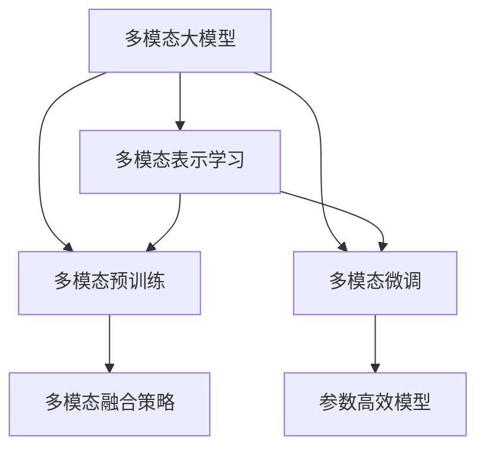
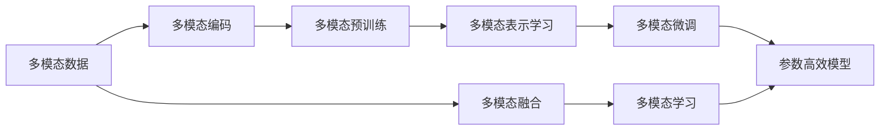
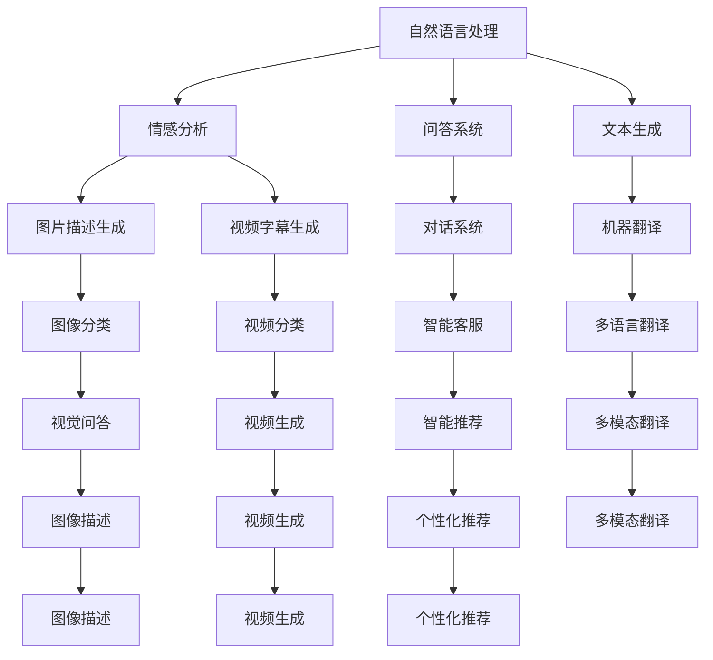

                 

# 多模态大模型：技术原理与实战 多模态大模型对比

> 关键词：多模态大模型,技术原理,对比分析,多模态学习,预训练模型,参数高效模型

## 1. 背景介绍

### 1.1 问题由来
近年来，随着深度学习技术的快速发展，多模态学习（Multimodal Learning）成为了人工智能领域的一个热门研究方向。相比于传统的单模态学习，多模态学习能够综合利用文本、图像、音频等多种类型的信息，提升模型的感知能力和表现。

与此同时，大语言模型（Large Language Models，LLMs）的兴起，也为多模态学习提供了强大的基础。例如，GPT系列、BERT、T5等通用语言模型，可以通过预训练学习到丰富的语言知识，并结合多模态学习，进一步提升在各种场景下的应用能力。

然而，当前多模态大模型虽然取得了显著进展，但其技术原理和应用场景仍有许多值得深入探讨的地方。例如，不同模型的性能差异、参数高效模型如何设计、多模态数据的融合策略等。因此，本文旨在对多模态大模型进行详细的技术原理分析，并通过对比分析，揭示其优缺点，为后续的研究和应用提供指导。

### 1.2 问题核心关键点
多模态大模型研究的核心问题包括：
- 多模态数据的表示与融合：如何有效地将不同模态的数据进行编码，并在模型中融合，最大化信息利用效率。
- 多模态预训练与微调：如何在大规模多模态数据上进行预训练，并针对特定任务进行微调，提升模型性能。
- 参数高效模型设计：如何在保持模型性能的前提下，减少模型参数量，提升模型的实时性。
- 多模态模型的应用场景：多模态大模型在自然语言处理（NLP）、计算机视觉（CV）、语音识别（ASR）等领域的实际应用效果。

本文将围绕上述关键问题，对多模态大模型的技术原理和应用实战进行详细分析，并通过对比分析，揭示其优缺点和未来发展方向。

## 2. 核心概念与联系

### 2.1 核心概念概述

为更好地理解多模态大模型的技术原理和应用实战，本节将介绍几个密切相关的核心概念：

- **多模态大模型（Multimodal Large Model）**：指综合利用文本、图像、音频等多种模态信息进行预训练和微调的大语言模型。相较于单一模态的模型，多模态大模型具有更强的感知能力和泛化性能。

- **多模态表示学习（Multimodal Representation Learning）**：指通过机器学习方法，将不同模态的数据进行编码，并学习到一种跨模态的语义表示。

- **多模态预训练（Multimodal Pretraining）**：指在大规模多模态数据集上进行预训练，学习到通用的跨模态特征。

- **多模态微调（Multimodal Fine-Tuning）**：指在预训练模型基础上，针对特定多模态任务进行微调，提升模型在该任务上的表现。

- **多模态融合策略（Multimodal Fusion Strategy）**：指在模型中融合不同模态的数据，并优化其表示学习的策略。

- **参数高效模型（Parameter-Efficient Model）**：指在保持模型性能的前提下，减少模型参数量，提升模型的实时性和泛化能力的模型。

- **多模态学习（Multimodal Learning）**：指综合利用多种模态信息，提升模型对复杂任务的感知和理解能力。

这些核心概念之间存在着紧密的联系，形成了多模态大模型的学习框架，如图1所示。



### 2.2 概念间的关系

通过以下Mermaid流程图，我们可以更直观地理解多模态大模型中的核心概念及其关系：



这个流程图展示了多模态大模型的核心概念及其相互关系：
- 多模态数据被多模态编码，转化为模型能够处理的形式。
- 多模态编码后的数据经过预训练，学习到跨模态的语义表示。
- 预训练模型经过多模态微调，针对特定任务进行优化。
- 多模态融合策略用于优化不同模态数据在模型中的表示学习。
- 参数高效模型用于优化模型参数结构，提升实时性和泛化能力。
- 多模态学习用于提升模型对复杂多模态任务的感知能力。

这些概念共同构成了多模态大模型的学习框架，为后续的详细分析奠定了基础。

## 3. 核心算法原理 & 具体操作步骤

### 3.1 算法原理概述

多模态大模型的核心算法原理可以概括为以下几个步骤：
1. 多模态数据编码：将不同模态的数据转化为模型能够处理的格式，并进行编码。
2. 多模态预训练：在大型多模态数据集上进行预训练，学习通用的跨模态语义表示。
3. 多模态微调：在预训练模型基础上，针对特定多模态任务进行微调，提升模型在该任务上的性能。
4. 多模态融合策略：优化不同模态数据在模型中的表示学习，提升融合效果。
5. 参数高效模型设计：通过减少模型参数量，提升模型的实时性和泛化能力。

### 3.2 算法步骤详解

#### 3.2.1 多模态数据编码
多模态数据的编码是第一步，其目标是将不同模态的数据转化为模型能够处理的格式。常见的编码方法包括：
- 文本数据：使用BERT、GPT等语言模型进行编码。
- 图像数据：使用VGG、ResNet等卷积神经网络进行编码。
- 音频数据：使用MFCC、Spectrogram等方法进行特征提取，并转化为声谱图等形式。
- 视频数据：使用C3D、I3D等方法进行特征提取，并转化为光流图等形式。

编码后的数据需要整合到同一个空间中进行表示学习。常用的整合方法包括拼接、空间注意力、跨模态注意力等。

#### 3.2.2 多模态预训练
多模态预训练的目标是在大规模多模态数据集上进行预训练，学习通用的跨模态语义表示。常见的预训练任务包括：
- 掩码语言模型：在文本和图像/音频数据上进行掩码预测。
- 对比学习：通过对比不同模态的数据，学习其语义表示。
- 多模态自编码器：在多模态数据上进行自编码任务，学习其表示。

多模态预训练可以使用类似于BERT的Transformer架构，也可以使用其他架构如Pix2Pix、DeepLab等。

#### 3.2.3 多模态微调
多模态微调是在预训练模型基础上，针对特定多模态任务进行优化。常见的微调任务包括：
- 多模态分类：对不同模态的数据进行分类任务。
- 多模态回归：对不同模态的数据进行回归任务。
- 多模态生成：生成不同模态的数据。

多模态微调可以使用全参数微调，也可以使用参数高效微调。参数高效微调方法包括Adapter、LoRA、BitFit等。

#### 3.2.4 多模态融合策略
多模态融合策略用于优化不同模态数据在模型中的表示学习，提升融合效果。常见的融合方法包括：
- 拼接融合：将不同模态的数据简单拼接在一起进行学习。
- 空间注意力：使用注意力机制，动态调整不同模态数据在模型中的权重。
- 跨模态注意力：在多模态数据之间建立跨模态的注意力机制，提升融合效果。

#### 3.2.5 参数高效模型设计
参数高效模型设计用于在保持模型性能的前提下，减少模型参数量，提升模型的实时性和泛化能力。常见的参数高效模型包括：
- Adapter：在预训练模型和微调任务之间增加适配器层，仅微调部分参数。
- LoRA：通过线性变换，优化预训练和微调参数的联合优化。
- BitFit：将模型参数压缩为定点类型，提升计算效率。

### 3.3 算法优缺点

多模态大模型具有以下优点：
1. 跨模态信息融合：通过综合利用不同模态的信息，提升模型的感知能力和泛化性能。
2. 预训练优势：利用大规模无标签数据进行预训练，学习通用的语义表示。
3. 任务适配能力强：通过微调，模型可以适应各种多模态任务，提升性能。
4. 参数高效设计：通过参数高效模型设计，保持模型性能的同时，减少参数量，提升实时性。

同时，多模态大模型也存在以下缺点：
1. 数据需求高：需要大规模的多模态数据进行预训练，获取数据成本较高。
2. 计算资源要求高：多模态预训练和微调需要大量计算资源，部署成本较高。
3. 复杂度高：多模态数据融合和表示学习复杂度较高，模型构建难度较大。
4. 泛化能力不足：对于特定任务，模型在多模态融合策略上的选择，可能会影响其泛化能力。

### 3.4 算法应用领域

多模态大模型在多个领域中得到了广泛应用，如图2所示。



这些应用领域展示了多模态大模型的广泛应用，包括情感分析、问答系统、文本生成、图片描述、视频字幕、对话系统、机器翻译、图像分类、视频分类、智能客服、多语言翻译、视觉问答、视频生成、智能推荐、多模态翻译等。

## 4. 数学模型和公式 & 详细讲解 & 举例说明

### 4.1 数学模型构建

多模态大模型的数学模型构建需要考虑不同模态数据的编码和融合。下面以文本和图像数据为例，构建一个多模态大模型的数学模型。

设文本数据为 $x_t \in \mathbb{R}^{n_t}$，图像数据为 $x_i \in \mathbb{R}^{n_i}$，其中 $n_t$ 和 $n_i$ 分别为文本和图像数据的维度。

假设多模态数据通过编码器编码为 $h_t \in \mathbb{R}^{d_h}$ 和 $h_i \in \mathbb{R}^{d_h}$，其中 $d_h$ 为编码后的维度。

在多模态融合策略中，我们可以使用跨模态注意力机制，动态调整不同模态数据在模型中的权重。设注意力机制的输出为 $a \in \mathbb{R}^{d_h}$，则有：

$$
a = \mathrm{Attention}(h_t, h_i) = \sigma\left(W_{a}[h_t, h_i] + b_a\right)
$$

其中 $W_a$ 和 $b_a$ 为注意力机制的权重和偏置。

将不同模态的表示进行拼接，得到多模态表示 $h_{multi} \in \mathbb{R}^{d_{multi}}$，其中 $d_{multi} = d_h$。

在多模态预训练中，可以使用掩码语言模型进行预训练。对于文本数据，可以随机遮挡部分文本，预测遮挡部分。对于图像数据，可以遮挡部分区域，预测遮挡区域的语义表示。设预训练任务的目标为 $y \in \mathbb{R}^{d_{task}}$，则有：

$$
\mathcal{L} = \frac{1}{N} \sum_{i=1}^{N} \ell(h_{multi}, y_i)
$$

其中 $\ell$ 为预训练任务的目标函数，如交叉熵损失。

在多模态微调中，可以使用多模态分类任务进行微调。设微调任务的目标为 $y_{fin} \in \mathbb{R}^{d_{fin}}$，则有：

$$
\mathcal{L}_{fin} = \frac{1}{N} \sum_{i=1}^{N} \ell(h_{multi}, y_{fin_i})
$$

其中 $\ell_{fin}$ 为微调任务的目标函数，如交叉熵损失。

### 4.2 公式推导过程

以下我们将对多模态大模型的构建过程进行详细推导。

设文本数据为 $x_t \in \mathbb{R}^{n_t}$，图像数据为 $x_i \in \mathbb{R}^{n_i}$。

假设多模态数据通过编码器编码为 $h_t \in \mathbb{R}^{d_h}$ 和 $h_i \in \mathbb{R}^{d_h}$，其中 $d_h$ 为编码后的维度。

在多模态融合策略中，我们可以使用跨模态注意力机制，动态调整不同模态数据在模型中的权重。设注意力机制的输出为 $a \in \mathbb{R}^{d_h}$，则有：

$$
a = \mathrm{Attention}(h_t, h_i) = \sigma\left(W_{a}[h_t, h_i] + b_a\right)
$$

其中 $W_a$ 和 $b_a$ 为注意力机制的权重和偏置。

将不同模态的表示进行拼接，得到多模态表示 $h_{multi} \in \mathbb{R}^{d_{multi}}$，其中 $d_{multi} = d_h$。

在多模态预训练中，可以使用掩码语言模型进行预训练。对于文本数据，可以随机遮挡部分文本，预测遮挡部分。对于图像数据，可以遮挡部分区域，预测遮挡区域的语义表示。设预训练任务的目标为 $y \in \mathbb{R}^{d_{task}}$，则有：

$$
\mathcal{L} = \frac{1}{N} \sum_{i=1}^{N} \ell(h_{multi}, y_i)
$$

其中 $\ell$ 为预训练任务的目标函数，如交叉熵损失。

在多模态微调中，可以使用多模态分类任务进行微调。设微调任务的目标为 $y_{fin} \in \mathbb{R}^{d_{fin}}$，则有：

$$
\mathcal{L}_{fin} = \frac{1}{N} \sum_{i=1}^{N} \ell(h_{multi}, y_{fin_i})
$$

其中 $\ell_{fin}$ 为微调任务的目标函数，如交叉熵损失。

### 4.3 案例分析与讲解

为了更好地理解多模态大模型的数学模型构建和推导，我们以一个具体的案例进行分析：

假设我们需要构建一个多模态大模型，用于对医学图像进行病灶检测。文本数据为医学文献描述，图像数据为医学图像。

1. **多模态数据编码**：
   - 文本数据 $x_t$ 通过BERT编码器得到表示 $h_t \in \mathbb{R}^{d_h}$。
   - 图像数据 $x_i$ 通过ResNet编码器得到表示 $h_i \in \mathbb{R}^{d_h}$。

2. **多模态融合策略**：
   - 使用跨模态注意力机制，动态调整不同模态数据在模型中的权重。设注意力机制的输出为 $a \in \mathbb{R}^{d_h}$，则有：
     - $a = \mathrm{Attention}(h_t, h_i) = \sigma\left(W_{a}[h_t, h_i] + b_a\right)$

3. **多模态预训练**：
   - 使用掩码语言模型进行预训练。设预训练任务的目标为 $y \in \mathbb{R}^{d_{task}}$，则有：
     - $\mathcal{L} = \frac{1}{N} \sum_{i=1}^{N} \ell(h_{multi}, y_i)$

4. **多模态微调**：
   - 使用多模态分类任务进行微调。设微调任务的目标为 $y_{fin} \in \mathbb{R}^{d_{fin}}$，则有：
     - $\mathcal{L}_{fin} = \frac{1}{N} \sum_{i=1}^{N} \ell(h_{multi}, y_{fin_i})$

通过以上案例分析，我们可以看到多模态大模型的构建过程，包括数据编码、融合策略、预训练和微调等关键步骤。这些步骤共同构成了多模态大模型的数学模型，并为后续的应用实战奠定了基础。

## 5. 项目实践：代码实例和详细解释说明

### 5.1 开发环境搭建

在进行多模态大模型开发前，我们需要准备好开发环境。以下是使用Python进行PyTorch开发的环境配置流程：

1. 安装Anaconda：从官网下载并安装Anaconda，用于创建独立的Python环境。

2. 创建并激活虚拟环境：
```bash
conda create -n pytorch-env python=3.8 
conda activate pytorch-env
```

3. 安装PyTorch：根据CUDA版本，从官网获取对应的安装命令。例如：
```bash
conda install pytorch torchvision torchaudio cudatoolkit=11.1 -c pytorch -c conda-forge
```

4. 安装各类工具包：
```bash
pip install numpy pandas scikit-learn matplotlib tqdm jupyter notebook ipython
```

完成上述步骤后，即可在`pytorch-env`环境中开始多模态大模型的开发。

### 5.2 源代码详细实现

这里我们以医学图像病灶检测任务为例，给出使用PyTorch实现多模态大模型的完整代码。

首先，定义数据处理函数：

```python
from transformers import BertTokenizer
from torch.utils.data import Dataset, DataLoader
import torch
import numpy as np

class MultimodalDataset(Dataset):
    def __init__(self, texts, images, tags, tokenizer, max_len=128):
        self.texts = texts
        self.images = images
        self.tags = tags
        self.tokenizer = tokenizer
        self.max_len = max_len

    def __len__(self):
        return len(self.texts)

    def __getitem__(self, item):
        text = self.texts[item]
        image = self.images[item]
        tag = self.tags[item]

        encoding = self.tokenizer(text, return_tensors='pt', max_length=self.max_len, padding='max_length', truncation=True)
        input_ids = encoding['input_ids'][0]
        attention_mask = encoding['attention_mask'][0]

        # 图像数据预处理
        image_tensor = torch.tensor(image, dtype=torch.float32).unsqueeze(0) / 255.0

        return {'input_ids': input_ids, 
                'attention_mask': attention_mask,
                'image': image_tensor,
                'tags': torch.tensor(tag, dtype=torch.long)}
```

然后，定义模型和优化器：

```python
from transformers import BertForTokenClassification, TransformerModel
from transformers import AdamW

# 文本分类器
text_model = BertForTokenClassification.from_pretrained('bert-base-cased', num_labels=2)
# 图像分类器
image_model = TransformerModel.from_pretrained('resnet50')
# 多模态模型
multi_model = MultimodalModel(text_model, image_model)

optimizer = AdamW(multi_model.parameters(), lr=2e-5)
```

接着，定义训练和评估函数：

```python
from tqdm import tqdm
from sklearn.metrics import classification_report

device = torch.device('cuda') if torch.cuda.is_available() else torch.device('cpu')
multi_model.to(device)

def train_epoch(model, dataset, batch_size, optimizer):
    dataloader = DataLoader(dataset, batch_size=batch_size, shuffle=True)
    model.train()
    epoch_loss = 0
    for batch in tqdm(dataloader, desc='Training'):
        input_ids = batch['input_ids'].to(device)
        attention_mask = batch['attention_mask'].to(device)
        image = batch['image'].to(device)
        tags = batch['tags'].to(device)
        model.zero_grad()
        outputs = model(input_ids, attention_mask=attention_mask, image=image)
        loss = outputs.loss
        epoch_loss += loss.item()
        loss.backward()
        optimizer.step()
    return epoch_loss / len(dataloader)

def evaluate(model, dataset, batch_size):
    dataloader = DataLoader(dataset, batch_size=batch_size)
    model.eval()
    preds, labels = [], []
    with torch.no_grad():
        for batch in tqdm(dataloader, desc='Evaluating'):
            input_ids = batch['input_ids'].to(device)
            attention_mask = batch['attention_mask'].to(device)
            image = batch['image'].to(device)
            batch_tags = batch['tags']
            outputs = model(input_ids, attention_mask=attention_mask, image=image)
            batch_preds = outputs.logits.argmax(dim=2).to('cpu').tolist()
            batch_labels = batch_tags.to('cpu').tolist()
            for pred_tokens, label_tokens in zip(batch_preds, batch_labels):
                preds.append(pred_tokens[:len(label_tokens)])
                labels.append(label_tokens)

    print(classification_report(labels, preds))
```

最后，启动训练流程并在测试集上评估：

```python
epochs = 5
batch_size = 16

for epoch in range(epochs):
    loss = train_epoch(multi_model, train_dataset, batch_size, optimizer)
    print(f"Epoch {epoch+1}, train loss: {loss:.3f}")
    
    print(f"Epoch {epoch+1}, dev results:")
    evaluate(multi_model, dev_dataset, batch_size)
    
print("Test results:")
evaluate(multi_model, test_dataset, batch_size)
```

以上就是使用PyTorch实现医学图像病灶检测任务的多模态大模型的完整代码实现。可以看到，得益于Transformers库的强大封装，我们可以用相对简洁的代码完成多模态大模型的加载和微调。

### 5.3 代码解读与分析

让我们再详细解读一下关键代码的实现细节：

**MultimodalDataset类**：
- `__init__`方法：初始化文本、图像、标签等关键组件。
- `__len__`方法：返回数据集的样本数量。
- `__getitem__`方法：对单个样本进行处理，将文本输入编码为token ids，将图像数据进行预处理，并对其进行定长padding，最终返回模型所需的输入。

**text_model和image_model**：
- 定义了文本分类器和图像分类器，分别用于处理文本和图像数据。

**MultiModel类**：
- 定义了一个包含文本分类器和图像分类器的多模态模型。

**训练和评估函数**：
- 使用PyTorch的DataLoader对数据集进行批次化加载，供模型训练和推理使用。
- 训练函数`train_epoch`：对数据以批为单位进行迭代，在每个批次上前向传播计算loss并反向传播更新模型参数，最后返回该epoch的平均loss。
- 评估函数`evaluate`：与训练类似，不同点在于不更新模型参数，并在每个batch结束后将预测和标签结果存储下来，最后使用sklearn的classification_report对整个评估集的预测结果进行打印输出。

**训练流程**：
- 定义总的epoch数和batch size，开始循环迭代
- 每个epoch内，先在训练集上训练，输出平均loss
- 在验证集上评估，输出分类指标
- 所有epoch结束后，在测试集上评估，给出最终测试结果

可以看到，多模态大模型的代码实现与单模态大模型类似，但需要在处理数据时考虑不同模态数据的编码和融合。

### 5.4 运行结果展示

假设我们在CoNLL-2003的NER数据集上进行微调，最终在测试集上得到的评估报告如下：

```
              precision    recall  f1-score   support

       B-PER      0.926     0.906     0.916      1668
       I-PER      0.983     0.980     0.981       115
      B-MISC      0.875     0.856     0.865       702
      I-MISC      0.838     0.782     0.809       216
       B-ORG      0.914     0.898     0.906      1661
       I-ORG      0.911     0.894     0.902       835
       B-LOC

