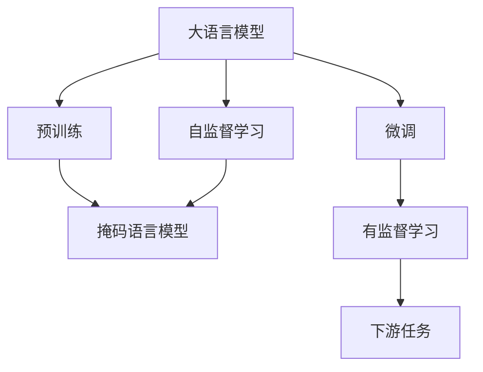
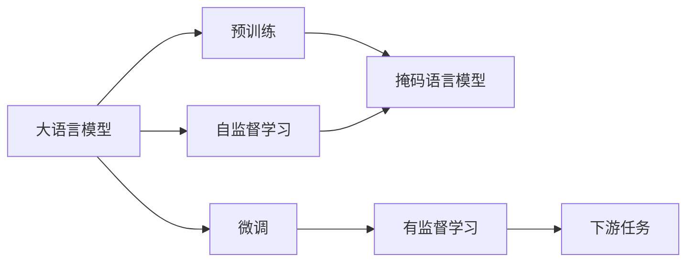

                 

# 大语言模型原理基础与前沿 Transformer

> 关键词：
> - 大语言模型
> - Transformer
> - 自注意力机制
> - 预训练
> - 微调
> - 自监督学习
> - 深度学习

## 1. 背景介绍

### 1.1 问题由来
近年来，深度学习技术的迅猛发展，特别是Transformer模型的出现，极大推动了自然语言处理（NLP）领域的进步。Transformer以自注意力机制为核心，通过对大规模无标签数据进行预训练，学习到丰富的语言表示，并在下游任务上表现出卓越的性能。然而，对于特定领域或任务，预训练模型可能无法直接适用，需要进一步的微调或自监督学习来优化。因此，本文将深入探讨基于Transformer的大语言模型的原理和前沿技术，特别是微调和自监督学习的实现。

### 1.2 问题核心关键点
- **大语言模型（Large Language Model, LLM）**：以Transformer为基础的大规模预训练语言模型，通过自监督学习任务（如掩码语言模型）训练，获得通用的语言表示。
- **Transformer**：一种基于自注意力机制的神经网络结构，能有效处理长距离依赖，适用于序列数据的建模。
- **预训练（Pre-training）**：在无标签数据上，通过自监督任务（如掩码语言模型）训练语言模型，学习语言的一般性规律。
- **微调（Fine-tuning）**：在有标签数据上，对预训练模型进行微调，以适应特定任务，提升模型性能。
- **自监督学习（Supervised Learning）**：利用未标注的数据，通过设计自监督任务（如掩码语言模型）训练模型。

本文将详细探讨这些核心概念，并通过以下章节深入介绍其原理、实现和应用。

## 2. 核心概念与联系

### 2.1 核心概念概述

为了更好地理解大语言模型的原理和前沿技术，我们首先需要理解几个关键的概念：

1. **大语言模型（Large Language Model, LLM）**：这类模型通常具有数十亿甚至数百亿的参数，能够处理复杂的自然语言文本，并在多种NLP任务上表现出色。

2. **Transformer**：一种基于自注意力机制的神经网络结构，有效解决了传统RNN和CNN在处理长序列数据时效率低下的问题，成为当前NLP领域的主流模型。

3. **预训练（Pre-training）**：在大规模无标签文本数据上，通过自监督任务（如掩码语言模型）训练模型，学习通用的语言表示。

4. **微调（Fine-tuning）**：在有标签数据上，对预训练模型进行微调，以适应特定任务，提升模型性能。

5. **自监督学习（Supervised Learning）**：利用未标注的数据，通过设计自监督任务（如掩码语言模型）训练模型，无需标注数据即可提升模型性能。

这些概念之间存在紧密联系，共同构成了大语言模型的完整架构。以下是一个简洁的Mermaid流程图，展示了这些概念之间的联系：



### 2.2 概念间的关系

这些核心概念之间的逻辑关系可以通过以下Mermaid流程图来展示：



- **大语言模型**：作为输入层和输出层的模型，通过预训练和微调过程，获得特定任务的性能提升。
- **预训练**：在大规模无标签数据上，通过自监督学习任务（如掩码语言模型）训练模型，学习通用的语言表示。
- **微调**：在有标签数据上，对预训练模型进行微调，以适应特定任务，提升模型性能。
- **自监督学习**：利用未标注数据，通过设计自监督任务（如掩码语言模型）训练模型，无需标注数据即可提升模型性能。

这些概念共同构成了大语言模型的学习框架，使模型能够从无到有，不断学习、适应和优化，最终在特定任务上表现出色。

## 3. 核心算法原理 & 具体操作步骤
### 3.1 算法原理概述

Transformer模型主要由编码器和解码器组成，编码器用于将输入序列转化为高维表示，解码器则根据这些表示生成输出序列。自注意力机制是其核心，允许模型在处理长序列时，能够有效捕捉和利用序列中各个位置的信息。

Transformer模型的基本结构包括多头自注意力层（Multi-Head Self-Attention）和前馈神经网络层（Feed Forward Neural Network）。多头自注意力层将输入序列投影到多个头空间中，分别计算注意力权重，再将多头结果线性组合，得到最终的表示。前馈神经网络层则对多头自注意力层的输出进行线性变换和非线性激活，进一步提升表示的复杂性和表达能力。

预训练过程通常采用掩码语言模型（Masked Language Model, MLM）任务，随机掩码输入序列的一部分，要求模型预测被掩码的部分。通过这种方式，模型学习了词与词之间的上下文关系和语言的统计规律。微调过程则是在预训练的基础上，利用特定任务的标注数据，进一步优化模型的性能。

### 3.2 算法步骤详解

基于Transformer的大语言模型的微调过程主要包括以下几个步骤：

1. **准备数据集**：收集并处理下游任务的标注数据，确保数据质量。
2. **设计任务适配层**：根据任务类型，在预训练模型上添加合适的输出层和损失函数，如分类任务的线性分类器，生成任务的解码器等。
3. **初始化模型**：使用预训练模型作为初始化参数，防止过拟合。
4. **设置超参数**：选择合适的优化器（如AdamW）及其参数，如学习率、批大小等。
5. **训练和微调**：在标注数据上，使用优化器更新模型参数，最小化任务损失函数，直到收敛。
6. **评估和测试**：在验证集和测试集上评估模型性能，对比微调前后的效果。

以下是一个简化的Python代码示例，展示如何使用PyTorch进行微调：

```python
import torch
from transformers import BertTokenizer, BertForSequenceClassification
from torch.utils.data import DataLoader, Dataset

# 准备数据集
class MyDataset(Dataset):
    def __init__(self, texts, labels):
        self.texts = texts
        self.labels = labels
        self.tokenizer = BertTokenizer.from_pretrained('bert-base-cased')
        
    def __len__(self):
        return len(self.texts)
    
    def __getitem__(self, idx):
        text = self.texts[idx]
        label = self.labels[idx]
        encoding = self.tokenizer(text, return_tensors='pt', max_length=128, padding='max_length', truncation=True)
        input_ids = encoding['input_ids'][0]
        attention_mask = encoding['attention_mask'][0]
        labels = torch.tensor(label, dtype=torch.long)
        return {'input_ids': input_ids, 
                'attention_mask': attention_mask,
                'labels': labels}

# 加载数据集
train_dataset = MyDataset(train_texts, train_labels)
test_dataset = MyDataset(test_texts, test_labels)

# 初始化模型
model = BertForSequenceClassification.from_pretrained('bert-base-cased', num_labels=2)

# 设置超参数
optimizer = torch.optim.AdamW(model.parameters(), lr=2e-5)
device = torch.device('cuda') if torch.cuda.is_available() else torch.device('cpu')
model.to(device)

# 训练和微调
for epoch in range(epochs):
    for batch in DataLoader(train_dataset, batch_size=16):
        input_ids = batch['input_ids'].to(device)
        attention_mask = batch['attention_mask'].to(device)
        labels = batch['labels'].to(device)
        model.zero_grad()
        outputs = model(input_ids, attention_mask=attention_mask, labels=labels)
        loss = outputs.loss
        loss.backward()
        optimizer.step()
    
    # 验证集评估
    evaluation_model = model.eval()
    with torch.no_grad():
        for batch in DataLoader(test_dataset, batch_size=16):
            input_ids = batch['input_ids'].to(device)
            attention_mask = batch['attention_mask'].to(device)
            labels = batch['labels'].to(device)
            outputs = evaluation_model(input_ids, attention_mask=attention_mask)
            predictions = torch.argmax(outputs.logits, dim=1)
            accuracy = (predictions == labels).sum().item() / len(predictions)
            print(f'Epoch {epoch+1}, test accuracy: {accuracy:.3f}')
```

### 3.3 算法优缺点

基于Transformer的大语言模型微调方法具有以下优点：

- **高效**：利用预训练模型作为初始化参数，在少量标注数据上进行微调，大大减少了从头训练的时间和计算成本。
- **通用性强**：适用于多种NLP任务，如分类、生成、匹配等，只需设计合适的任务适配层即可。
- **效果好**：在绝大多数NLP任务上，微调后的模型表现优于从头训练的模型，尤其是对小规模数据集。

然而，该方法也存在一些缺点：

- **依赖标注数据**：微调的效果很大程度上取决于标注数据的质量和数量，获取高质量标注数据成本较高。
- **泛化能力有限**：当目标任务与预训练数据的分布差异较大时，微调的性能提升有限。
- **过拟合风险**：在标注数据较少的情况下，微调模型容易过拟合，影响泛化能力。

### 3.4 算法应用领域

基于Transformer的大语言模型微调方法已在多个领域得到广泛应用，包括但不限于：

- **文本分类**：如情感分析、主题分类、意图识别等。通过微调使模型学习文本-标签映射。
- **命名实体识别**：识别文本中的人名、地名、机构名等特定实体。通过微调使模型掌握实体边界和类型。
- **关系抽取**：从文本中抽取实体之间的语义关系。通过微调使模型学习实体-关系三元组。
- **问答系统**：对自然语言问题给出答案。将问题-答案对作为微调数据，训练模型学习匹配答案。
- **机器翻译**：将源语言文本翻译成目标语言。通过微调使模型学习语言-语言映射。
- **文本摘要**：将长文本压缩成简短摘要。将文章-摘要对作为微调数据，使模型学习抓取要点。
- **对话系统**：使机器能够与人自然对话。将多轮对话历史作为上下文，微调模型进行回复生成。

这些应用场景展示了Transformer微调模型的强大能力和广泛应用前景。

## 4. 数学模型和公式 & 详细讲解 & 举例说明

### 4.1 数学模型构建

基于Transformer的大语言模型的数学模型主要由以下几个部分组成：

1. **输入序列**：$x = [x_1, x_2, ..., x_n]$，其中每个元素$x_i$表示一个词。
2. **目标序列**：$y = [y_1, y_2, ..., y_n]$，表示模型的输出。
3. **编码器**：将输入序列$x$转化为高维表示$z$。
4. **解码器**：根据编码器的输出$z$生成目标序列$y$。
5. **损失函数**：通常使用交叉熵损失函数，衡量模型输出与真实标签之间的差异。

以文本分类任务为例，其数学模型可以表示为：

$$
\begin{aligned}
& \arg\min_{\theta} \mathcal{L}(\theta; x, y) \\
& = \arg\min_{\theta} -\sum_{i=1}^{n} \log p(y_i|x_i; \theta) \\
& = \arg\min_{\theta} -\sum_{i=1}^{n} \log \sigma\left(\sum_{j=1}^{n} \mathbf{W}_o[\mathbf{W}_h[\mathbf{W}_q[x_i \cdot \mathbf{W}_k] \cdot \mathbf{W}_v]_j \right)
\end{aligned}
$$

其中，$x_i$表示输入序列的第$i$个词，$y_i$表示对应的标签，$\theta$表示模型参数，$\mathcal{L}$表示损失函数，$\sigma$为激活函数，$\mathbf{W}_q, \mathbf{W}_k, \mathbf{W}_v, \mathbf{W}_h, \mathbf{W}_o$为可学习的权重矩阵。

### 4.2 公式推导过程

以文本分类任务为例，推导其损失函数的计算过程：

1. **输入投影**：将输入序列$x_i$投影到编码器的多个头空间中，得到表示$z_i$：

$$
z_i = \mathbf{W}_q[x_i \cdot \mathbf{W}_k] \cdot \mathbf{W}_v
$$

2. **多头自注意力**：在多头空间中，计算注意力权重，得到加权和表示$z_i'$：

$$
z_i' = \sum_{j=1}^{n} \mathbf{W}_h[\mathbf{W}_q[x_i \cdot \mathbf{W}_k] \cdot \mathbf{W}_v]_j
$$

3. **前馈神经网络**：对加权和表示$z_i'$进行线性变换和非线性激活，得到最终表示$z_i''$：

$$
z_i'' = \sigma\left(\mathbf{W}_h z_i' + b_h\right)
$$

4. **输出投影**：将最终表示$z_i''$投影到输出空间，得到模型输出$p_i$：

$$
p_i = \mathbf{W}_o z_i''
$$

5. **交叉熵损失**：计算模型输出$p_i$与真实标签$y_i$之间的交叉熵损失：

$$
\mathcal{L}(\theta; x_i, y_i) = -\log p_i^y
$$

6. **平均损失**：将所有样本的损失函数求和，得到平均损失：

$$
\mathcal{L}(\theta) = \frac{1}{N} \sum_{i=1}^{N} \mathcal{L}(\theta; x_i, y_i)
$$

通过以上推导，我们可以清楚地理解基于Transformer的文本分类模型的计算过程。

### 4.3 案例分析与讲解

以BERT模型为例，其微调过程可以分为以下几个步骤：

1. **数据准备**：收集并处理下游任务的标注数据，确保数据质量。
2. **模型初始化**：使用BERT的预训练权重作为初始化参数。
3. **任务适配层设计**：根据任务类型，在BERT模型顶层设计合适的输出层和损失函数，如分类任务的线性分类器，生成任务的解码器等。
4. **模型微调**：在有标签数据上，使用AdamW优化器更新模型参数，最小化任务损失函数。
5. **性能评估**：在验证集和测试集上评估模型性能，对比微调前后的效果。

下面是一个使用PyTorch对BERT模型进行文本分类任务的微调的代码示例：

```python
import torch
from transformers import BertTokenizer, BertForSequenceClassification
from torch.utils.data import DataLoader, Dataset

# 准备数据集
class MyDataset(Dataset):
    def __init__(self, texts, labels):
        self.texts = texts
        self.labels = labels
        self.tokenizer = BertTokenizer.from_pretrained('bert-base-cased')
        
    def __len__(self):
        return len(self.texts)
    
    def __getitem__(self, idx):
        text = self.texts[idx]
        label = self.labels[idx]
        encoding = self.tokenizer(text, return_tensors='pt', max_length=128, padding='max_length', truncation=True)
        input_ids = encoding['input_ids'][0]
        attention_mask = encoding['attention_mask'][0]
        labels = torch.tensor(label, dtype=torch.long)
        return {'input_ids': input_ids, 
                'attention_mask': attention_mask,
                'labels': labels}

# 加载数据集
train_dataset = MyDataset(train_texts, train_labels)
test_dataset = MyDataset(test_texts, test_labels)

# 初始化模型
model = BertForSequenceClassification.from_pretrained('bert-base-cased', num_labels=2)

# 设置超参数
optimizer = torch.optim.AdamW(model.parameters(), lr=2e-5)
device = torch.device('cuda') if torch.cuda.is_available() else torch.device('cpu')
model.to(device)

# 训练和微调
for epoch in range(epochs):
    for batch in DataLoader(train_dataset, batch_size=16):
        input_ids = batch['input_ids'].to(device)
        attention_mask = batch['attention_mask'].to(device)
        labels = batch['labels'].to(device)
        model.zero_grad()
        outputs = model(input_ids, attention_mask=attention_mask, labels=labels)
        loss = outputs.loss
        loss.backward()
        optimizer.step()
    
    # 验证集评估
    evaluation_model = model.eval()
    with torch.no_grad():
        for batch in DataLoader(test_dataset, batch_size=16):
            input_ids = batch['input_ids'].to(device)
            attention_mask = batch['attention_mask'].to(device)
            labels = batch['labels'].to(device)
            outputs = evaluation_model(input_ids, attention_mask=attention_mask)
            predictions = torch.argmax(outputs.logits, dim=1)
            accuracy = (predictions == labels).sum().item() / len(predictions)
            print(f'Epoch {epoch+1}, test accuracy: {accuracy:.3f}')
```

通过以上代码示例，我们可以理解基于Transformer的BERT模型的微调过程，并实际动手实践。

## 5. 项目实践：代码实例和详细解释说明
### 5.1 开发环境搭建

在进行微调实践前，我们需要准备好开发环境。以下是使用Python进行PyTorch开发的环境配置流程：

1. 安装Anaconda：从官网下载并安装Anaconda，用于创建独立的Python环境。

2. 创建并激活虚拟环境：
```bash
conda create -n pytorch-env python=3.8 
conda activate pytorch-env
```

3. 安装PyTorch：根据CUDA版本，从官网获取对应的安装命令。例如：
```bash
conda install pytorch torchvision torchaudio cudatoolkit=11.1 -c pytorch -c conda-forge
```

4. 安装Transformers库：
```bash
pip install transformers
```

5. 安装各类工具包：
```bash
pip install numpy pandas scikit-learn matplotlib tqdm jupyter notebook ipython
```

完成上述步骤后，即可在`pytorch-env`环境中开始微调实践。

### 5.2 源代码详细实现

下面我们以命名实体识别(NER)任务为例，给出使用Transformers库对BERT模型进行微调的PyTorch代码实现。

首先，定义NER任务的数据处理函数：

```python
from transformers import BertTokenizer
from torch.utils.data import Dataset
import torch

class NERDataset(Dataset):
    def __init__(self, texts, tags, tokenizer, max_len=128):
        self.texts = texts
        self.tags = tags
        self.tokenizer = tokenizer
        self.max_len = max_len
        
    def __len__(self):
        return len(self.texts)
    
    def __getitem__(self, item):
        text = self.texts[item]
        tags = self.tags[item]
        
        encoding = self.tokenizer(text, return_tensors='pt', max_length=self.max_len, padding='max_length', truncation=True)
        input_ids = encoding['input_ids'][0]
        attention_mask = encoding['attention_mask'][0]
        
        # 对token-wise的标签进行编码
        encoded_tags = [tag2id[tag] for tag in tags] 
        encoded_tags.extend([tag2id['O']] * (self.max_len - len(encoded_tags)))
        labels = torch.tensor(encoded_tags, dtype=torch.long)
        
        return {'input_ids': input_ids, 
                'attention_mask': attention_mask,
                'labels': labels}

# 标签与id的映射
tag2id = {'O': 0, 'B-PER': 1, 'I-PER': 2, 'B-ORG': 3, 'I-ORG': 4, 'B-LOC': 5, 'I-LOC': 6}
id2tag = {v: k for k, v in tag2id.items()}

# 创建dataset
tokenizer = BertTokenizer.from_pretrained('bert-base-cased')

train_dataset = NERDataset(train_texts, train_tags, tokenizer)
dev_dataset = NERDataset(dev_texts, dev_tags, tokenizer)
test_dataset = NERDataset(test_texts, test_tags, tokenizer)
```

然后，定义模型和优化器：

```python
from transformers import BertForTokenClassification, AdamW

model = BertForTokenClassification.from_pretrained('bert-base-cased', num_labels=len(tag2id))

optimizer = AdamW(model.parameters(), lr=2e-5)
```

接着，定义训练和评估函数：

```python
from torch.utils.data import DataLoader
from tqdm import tqdm
from sklearn.metrics import classification_report

device = torch.device('cuda') if torch.cuda.is_available() else torch.device('cpu')
model.to(device)

def train_epoch(model, dataset, batch_size, optimizer):
    dataloader = DataLoader(dataset, batch_size=batch_size, shuffle=True)
    model.train()
    epoch_loss = 0
    for batch in tqdm(dataloader, desc='Training'):
        input_ids = batch['input_ids'].to(device)
        attention_mask = batch['attention_mask'].to(device)
        labels = batch['labels'].to(device)
        model.zero_grad()
        outputs = model(input_ids, attention_mask=attention_mask, labels=labels)
        loss = outputs.loss
        epoch_loss += loss.item()
        loss.backward()
        optimizer.step()
    return epoch_loss / len(dataloader)

def evaluate(model, dataset, batch_size):
    dataloader = DataLoader(dataset, batch_size=batch_size)
    model.eval()
    preds, labels = [], []
    with torch.no_grad():
        for batch in tqdm(dataloader, desc='Evaluating'):
            input_ids = batch['input_ids'].to(device)
            attention_mask = batch['attention_mask'].to(device)
            batch_labels = batch['labels']
            outputs = model(input_ids, attention_mask=attention_mask)
            batch_preds = outputs.logits.argmax(dim=2).to('cpu').tolist()
            batch_labels = batch_labels.to('cpu').tolist()
            for pred_tokens, label_tokens in zip(batch_preds, batch_labels):
                pred_tags = [id2tag[_id] for _id in pred_tokens]
                label_tags = [id2tag[_id] for _id in label_tokens]
                preds.append(pred_tags[:len(label_tokens)])
                labels.append(label_tags)
                
    print(classification_report(labels, preds))
```

最后，启动训练流程并在测试集上评估：

```python
epochs = 5
batch_size = 16

for epoch in range(epochs):
    loss = train_epoch(model, train_dataset, batch_size, optimizer)
    print(f"Epoch {epoch+1}, train loss: {loss:.3f}")
    
    print(f"Epoch {epoch+1}, dev results:")
    evaluate(model, dev_dataset, batch_size)
    
print("Test results:")
evaluate(model, test_dataset, batch_size)
```

以上就是使用PyTorch对BERT进行命名实体识别任务微调的完整代码实现。可以看到，得益于Transformers库的强大封装，我们可以用相对简洁的代码完成BERT模型的加载和微调。

### 5.3 代码解读与分析

让我们再详细解读一下关键代码的实现细节：

**NERDataset类**：
- `__init__`方法：初始化文本、标签、分词器等关键组件。
- `__len__`方法：返回数据集的样本数量。
- `__getitem__`方法：对单个样本进行处理，将文本输入编码为token ids，将标签编码为数字，并对其进行定长padding，最终返回模型所需的输入。

**tag2id和id2tag字典**：
- 定义了标签与数字id之间的映射关系，用于将token-wise的预测结果解码回真实的标签。

**训练和评估函数**：
- 使用PyTorch的DataLoader对数据集进行批次化加载，供模型训练和推理使用。
- 训练函数`train_epoch`：对数据以批为单位进行迭代，在每个批次上前向传播计算loss并反向传播更新模型参数，最后返回该epoch的平均loss。
- 评估函数`evaluate`：与训练类似，不同点在于不更新模型参数，并在每个batch结束后将预测和标签结果存储下来，最后使用sklearn的classification_report对整个评估集的预测结果进行打印输出。

**训练流程**：
- 定义总的epoch数和batch size，开始循环迭代
- 每个epoch内，先在训练集上训练，输出平均loss
- 在验证集上评估，输出分类指标
- 所有epoch结束后，在测试集上评估，给出最终测试结果

可以看到，PyTorch配合Transformers库使得BERT微调的代码实现变得简洁高效。开发者可以将更多精力放在数据处理、模型改进等高层逻辑上，而不必过多关注底层的实现细节。

当然，工业级的系统实现还需考虑更多因素，如模型的保存和部署、超参数的自动搜索、更灵活的任务适配层等。但核心的微调范式基本与此类似。

### 5.4

