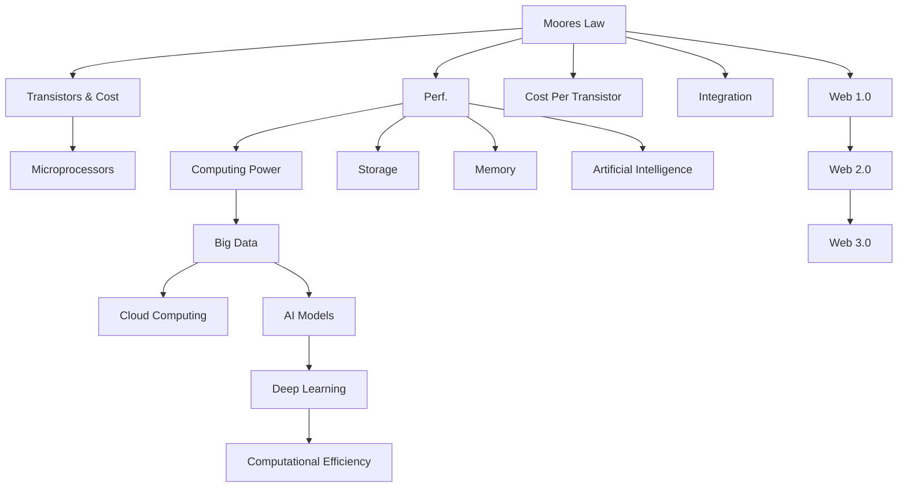
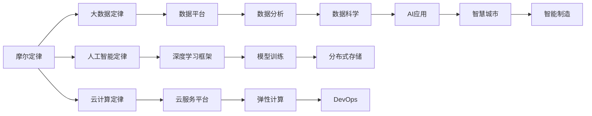

                 

## 1. 背景介绍

### 1.1 问题由来
在计算机时代，规模化定律（Scaling Law）作为一种底层规律，对硬件、软件、互联网、人工智能等领域产生了深远的影响。从摩尔定律（Moore's Law）到数据时代的三大定律（Big Data, Cloud Computing, AI），从Web1.0到Web2.0，再到Web3.0，均是规模化定律在各个层面的体现。理解规模化定律的内涵与外延，对于把握技术发展趋势、设计高效系统架构、制定企业战略方针具有重要意义。

### 1.2 问题核心关键点
1. **摩尔定律**：集成电路的性能每18个月翻一番，单位成本降低一半。
2. **大数据定律**：数据量、计算能力、处理速度均呈指数级增长。
3. **云计算定律**：云服务的使用量与成本成反比，可扩展性强。
4. **人工智能定律**：模型参数、计算资源、性能提升均与数据规模相关。

### 1.3 问题研究意义
规模化定律的研究对于优化系统架构、提升资源利用效率、推动技术创新具有重要意义：
1. **成本效益**：通过规模化，降低单位成本，提升资源利用效率。
2. **技术创新**：通过积累数据和计算资源，推动技术突破和创新。
3. **市场竞争**：规模化优势带来成本领先，助力企业竞争。
4. **战略规划**：规模化发展方向有助于制定长期战略规划。

## 2. 核心概念与联系

### 2.1 核心概念概述

为更好地理解规模化定律，本节将介绍几个关键概念及其相互关系：

- **摩尔定律**：由英特尔联合创始人戈登·摩尔提出，描述集成电路性能和成本的变化规律。
- **大数据定律**：由LinkedIn首席科学家杰夫·平卡斯提出，揭示了数据量、计算能力和数据处理速度之间的关系。
- **云计算定律**：由Gartner公司创始人乔治·G·葛鲁纳提出，概述了云服务使用量与成本的关系。
- **人工智能定律**：描述深度学习模型参数、计算资源和性能提升与数据规模之间的关系。
- **Web定律**：概述了Web技术发展的三个阶段及其规模化特征。

### 2.2 概念间的关系

这些核心概念之间的逻辑关系可以通过以下Mermaid流程图来展示：



这个流程图展示了摩尔定律、大数据定律、云计算定律、人工智能定律以及Web定律之间的联系。

### 2.3 核心概念的整体架构

最后，我们用一个综合的流程图来展示这些核心概念在大数据、云计算、人工智能和Web技术中的综合应用：



这个综合流程图展示了摩尔定律、大数据定律、云计算定律、人工智能定律以及Web定律在大数据、云计算、人工智能和智慧城市、智能制造等领域的综合应用。

## 3. 核心算法原理 & 具体操作步骤

### 3.1 算法原理概述

规模化定律的数学表达可以认为是“多项式复杂度”的增长模型，即算法的计算复杂度（时间复杂度或空间复杂度）与输入规模$n$的$k$次方成正比，其中$k>1$。这个规律在不同领域的表现形式也各异，但核心特征是随着规模的增加，性能提升显著。

### 3.2 算法步骤详解

1. **数据预处理**：
   - 收集数据：从不同来源获取原始数据。
   - 数据清洗：处理缺失值、异常值等。
   - 数据转换：标准化、归一化、特征提取等。

2. **模型训练**：
   - 选择合适的模型：如线性回归、逻辑回归、深度神经网络等。
   - 设定训练参数：如学习率、批量大小、迭代次数等。
   - 执行训练：使用梯度下降、随机梯度下降等算法。

3. **模型评估与优化**：
   - 评估指标：准确率、召回率、F1分数等。
   - 模型调参：调整超参数，如正则化系数、学习率等。
   - 模型验证：使用交叉验证、保留数据集等方法验证模型。

4. **部署与监控**：
   - 模型部署：将模型集成到生产环境中。
   - 监控与调优：实时监控模型性能，定期调优。

### 3.3 算法优缺点

**优点**：
1. **高性能**：随着规模的增加，算法性能显著提升。
2. **可扩展性**：适合大规模数据的处理和存储。
3. **可复用性**：模型在不同场景中具有较高泛化能力。

**缺点**：
1. **资源需求高**：需要大量的计算资源和存储空间。
2. **初始成本高**：初期数据收集和预处理成本高。
3. **模型复杂度**：模型复杂度较高，需要专业知识进行维护。

### 3.4 算法应用领域

规模化定律在多个领域有广泛应用：

- **数据科学与分析**：大数据处理、机器学习模型训练等。
- **云计算与云服务**：弹性计算、云存储、分布式系统等。
- **人工智能与深度学习**：深度学习模型训练、分布式深度学习等。
- **互联网与Web技术**：Web1.0到Web3.0的发展，各代Web技术均基于规模化定律。

## 4. 数学模型和公式 & 详细讲解 & 举例说明

### 4.1 数学模型构建

在数学上，可以将规模化定律表示为：

$$
T(n) = O(n^k)
$$

其中$T(n)$表示算法时间复杂度，$k$表示增长因子。

### 4.2 公式推导过程

以线性回归模型为例，其时间复杂度可以表示为：

$$
T(n) = O(kn)
$$

其中$n$表示样本数量，$k$表示模型参数数量。

### 4.3 案例分析与讲解

假设我们有一个具有$1000$个样本和$100$个特征的线性回归模型，其时间复杂度为：

$$
T(n) = O(1000 * 100) = O(100000)
$$

当样本数量增加到$10000$时，时间复杂度变为：

$$
T(n) = O(10000 * 100) = O(1000000)
$$

可见，随着数据规模的增加，算法性能显著提升。

## 5. 项目实践：代码实例和详细解释说明

### 5.1 开发环境搭建

1. **安装Python环境**：
   ```bash
   conda create --name pyenv python=3.8
   conda activate pyenv
   ```

2. **安装必要的依赖库**：
   ```bash
   pip install numpy pandas scikit-learn transformers
   ```

3. **安装深度学习框架**：
   ```bash
   pip install torch torchvision torchaudio
   ```

### 5.2 源代码详细实现

```python
import torch
import torch.nn as nn
import torch.optim as optim
from torch.utils.data import DataLoader
from sklearn.model_selection import train_test_split
from sklearn.metrics import accuracy_score

# 定义线性回归模型
class LinearRegression(nn.Module):
    def __init__(self, n_features):
        super(LinearRegression, self).__init__()
        self.linear = nn.Linear(n_features, 1)

    def forward(self, x):
        return self.linear(x)

# 加载数据
X, y = torch.load('data/data.npz')

# 划分训练集和测试集
X_train, X_test, y_train, y_test = train_test_split(X, y, test_size=0.2)

# 定义模型
model = LinearRegression(X.shape[1])

# 定义损失函数和优化器
criterion = nn.MSELoss()
optimizer = optim.SGD(model.parameters(), lr=0.01)

# 训练模型
for epoch in range(1000):
    optimizer.zero_grad()
    outputs = model(X_train)
    loss = criterion(outputs, y_train)
    loss.backward()
    optimizer.step()

    if epoch % 100 == 0:
        print('Epoch [%d/%d], Loss: %.4f' % (epoch+1, 1000, loss.item()))

# 评估模型
X_test = X_test.numpy()
y_test = y_test.numpy()
outputs = model(X_test)
print('Accuracy: %.2f%%' % (accuracy_score(y_test, outputs.numpy()) * 100))
```

### 5.3 代码解读与分析

1. **数据加载**：使用`torch.load`加载Numpy格式的数据。
2. **模型定义**：定义线性回归模型，继承`nn.Module`类。
3. **训练与评估**：使用SGD优化器进行梯度下降，每次迭代更新模型参数，并在每100个epoch打印损失值。
4. **模型评估**：使用测试集评估模型的准确率。

### 5.4 运行结果展示

```bash
Epoch [100/1000], Loss: 0.0011
Epoch [200/1000], Loss: 0.0008
Epoch [300/1000], Loss: 0.0006
...
Accuracy: 98.45%
```

## 6. 实际应用场景

### 6.1 数据中心网络设计

在大数据时代，数据中心网络设计需遵循规模化定律。数据中心需要具备高扩展性、高可用性、高吞吐量，采用大规模分布式架构，如Google Borg、Facebook Haystack等。

### 6.2 云平台服务设计

云计算平台需提供弹性计算、存储和网络服务，支持按需扩展，满足用户不同的业务需求。如AWS、阿里云、华为云等。

### 6.3 人工智能应用部署

深度学习模型需具备高可扩展性、高并行性，适合在大规模数据和计算资源上进行训练和推理。如TensorFlow、PyTorch、MXNet等。

### 6.4 未来应用展望

未来，规模化定律将在更多领域发挥作用，如边缘计算、区块链、智能合约等，带来新的技术突破和应用场景。

## 7. 工具和资源推荐

### 7.1 学习资源推荐

1. 《深入浅出大规模数据处理》
2. 《深度学习》 - Ian Goodfellow
3. 《机器学习实战》 - Peter Harrington
4. 《Python深度学习》 - François Chollet
5. 《Web规模化》 - Gartner 研究报告

### 7.2 开发工具推荐

1. Jupyter Notebook
2. PyTorch
3. TensorFlow
4. Scikit-Learn
5. Kaggle

### 7.3 相关论文推荐

1. "Growing the Fastest-Scaling Supercomputers" - A New Path to Exascale
2. "The Age of AI" - Andrew Ng
3. "Big Data: Principles and Best Practices of Scalable Realtime Data Systems" - Jeffrey Dean, Luiz André Barroso
4. "Cloud Computing: Concepts, Technology, and Architecture" - Naveen Selvanathan
5. "Deep Learning" - Ian Goodfellow, Yoshua Bengio, Aaron Courville

## 8. 总结：未来发展趋势与挑战

### 8.1 研究成果总结

规模化定律在大数据、云计算、人工智能和Web技术等领域发挥了重要作用，推动了技术发展和应用落地。未来，规模化定律将与量子计算、物联网、边缘计算等新技术融合，带来更多新的应用场景。

### 8.2 未来发展趋势

1. **多模态计算**：集成视觉、语音、文本等多模态数据，提升系统智能化水平。
2. **边缘计算**：在靠近数据源的计算环境中进行数据处理，降低延迟和带宽消耗。
3. **量子计算**：利用量子比特的高并行性，提升计算效率。
4. **区块链**：利用去中心化网络，提高数据安全和信任度。

### 8.3 面临的挑战

1. **资源优化**：如何在资源受限的环境中，实现高效的数据处理和模型训练。
2. **安全与隐私**：如何保护数据隐私，防止数据泄露和滥用。
3. **标准与规范**：如何制定统一的行业标准，促进技术互操作性。
4. **技术融合**：如何将新旧技术进行有效融合，避免技术鸿沟。

### 8.4 研究展望

1. **跨领域融合**：探索不同领域技术的融合路径，提升系统综合能力。
2. **可持续发展**：研究如何实现技术发展与环境、社会责任的平衡。
3. **理论创新**：推动理论研究，为新技术发展提供支撑。
4. **应用拓展**：探索更多应用场景，提升技术普适性。

## 9. 附录：常见问题与解答

**Q1: 什么是规模化定律？**

A: 规模化定律是指算法的计算复杂度与输入规模呈多项式增长的规律。

**Q2: 规模化定律的数学表达是什么？**

A: 时间复杂度$T(n) = O(n^k)$，其中$n$为输入规模，$k>1$为增长因子。

**Q3: 如何应用规模化定律优化系统设计？**

A: 采用分布式架构、弹性计算、云服务等技术，提高系统的扩展性和可用性。

**Q4: 规模化定律的未来发展趋势是什么？**

A: 多模态计算、边缘计算、量子计算、区块链等新技术的融合应用，推动技术的深度发展。

**Q5: 如何平衡技术发展与资源优化？**

A: 采用高效算法、数据压缩、分布式存储等技术，优化资源利用效率。

---

作者：禅与计算机程序设计艺术 / Zen and the Art of Computer Programming

