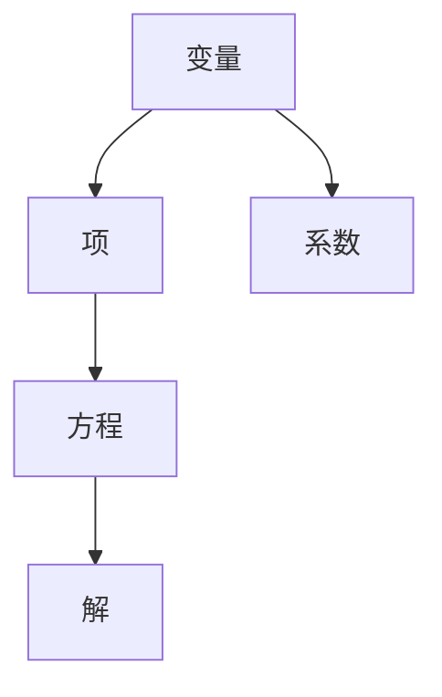
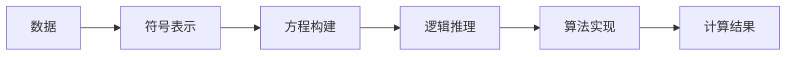

                 

# 计算：第一部分 计算的诞生 第 2 章 计算之术 代数符号

在第一章中，我们探讨了计算的概念和其重要性，强调了计算对人类文明和社会进步的深远影响。本章将深入研究计算的基础——代数符号，这是理解和实现计算之术的关键。

## 1. 背景介绍

### 1.1 问题由来

代数符号在数学和计算科学中扮演着至关重要的角色。它们提供了一种表示和操作抽象对象的方式，使我们能够进行数学推理和计算。代数符号的历史可以追溯到古希腊和印度，但现代代数符号的使用，特别是符号和方程的使用，主要归功于17世纪数学家们的贡献。

### 1.2 问题核心关键点

- **符号表示**：代数符号是数学和计算中表示变量和操作的标准方式。
- **方程构建**：通过符号，我们可以构建和解决各种类型的方程，从而理解复杂系统的行为。
- **逻辑推理**：代数符号使我们能够进行逻辑推理和证明，这是数学和计算的核心能力。

### 1.3 问题研究意义

掌握代数符号的基本概念和应用，对于理解和实现计算之术至关重要。它们不仅帮助我们进行数学推理和计算，也是现代计算机科学和工程的基础。掌握代数符号，可以让我们更好地理解和设计算法，解决实际问题，推动科学和技术的发展。

## 2. 核心概念与联系

### 2.1 核心概念概述

为了深入理解代数符号，我们先介绍几个关键概念：

- **变量（Variable）**：表示数学和计算中未知量或可变量的符号。
- **系数（Coefficient）**：变量前面的数字，表示变量的强度或影响。
- **项（Term）**：由一个或多个变量组成的表达式，可以是正数、负数或零。
- **方程（Equation）**：表示两个表达式相等的符号表达式。
- **解（Solution）**：满足方程的变量的值。

### 2.2 核心概念的关系

代数符号之间的关系可以通过以下Mermaid流程图来展示：



这个流程图展示了变量、系数、项、方程和解之间的基本关系。变量和系数组合形成项，多个项可以组成方程，方程的解则给出了变量的具体值。

### 2.3 核心概念的整体架构

最后，我们用一个综合的流程图来展示这些核心概念在大计算中的应用：



这个综合流程图展示了数据如何通过符号表示、方程构建、逻辑推理和算法实现，最终产生计算结果的过程。

## 3. 核心算法原理 & 具体操作步骤

### 3.1 算法原理概述

代数符号的原理主要基于符号运算和方程求解。这些原理构成了现代数学和计算的基础，是理解和实现计算之术的关键。

- **符号运算**：通过符号表示和操作，我们可以进行各种数学运算，如加、减、乘、除、指数和根号运算等。
- **方程求解**：通过构建和解方程，我们可以找到变量之间的关系，从而解决实际问题。

### 3.2 算法步骤详解

#### 3.2.1 符号表示

1. **定义变量**：使用符号表示未知量或可变量。例如，用 $x$ 表示一个未知数。
2. **引入系数**：用数字表示变量的强度或影响。例如，$3x$ 表示 $x$ 的三倍。
3. **组合项**：用加号或减号连接项，例如 $2x + 3y$。

#### 3.2.2 方程构建

1. **等式构建**：用等号表示两个表达式相等。例如，$2x + 3 = 5$。
2. **简化方程**：通过移项和合并同类项，简化方程。例如，$2x + 3 = 5 \rightarrow 2x = 2 \rightarrow x = 1$。

#### 3.2.3 解方程

1. **代入法**：将已知值代入方程，求解未知数。例如，$2x = 4 \rightarrow x = 2$。
2. **移项法**：通过移项和合并同类项，求解未知数。例如，$2x + 3 = 5 \rightarrow 2x = 2 \rightarrow x = 1$。

### 3.3 算法优缺点

**优点**：
- 符号表示使我们能够抽象地处理复杂问题，避免直接处理具体数据。
- 方程构建和解方程提供了一种系统的解决复杂问题的途径。
- 逻辑推理和证明是数学和计算中的基本工具，帮助我们理解和验证结果。

**缺点**：
- 对于初学者，符号表示和方程求解可能显得复杂和抽象。
- 符号运算和方程求解依赖于具体的数学知识，可能存在理解障碍。
- 高阶方程和复杂方程的求解可能非常困难，需要借助数学软件或编程工具。

### 3.4 算法应用领域

代数符号在数学、物理、工程、计算机科学等领域有广泛应用。

- **数学**：代数是数学的基础，用于表示和操作变量和常量。
- **物理**：物理方程通常用代数符号表示，用于描述物理系统的行为。
- **工程**：工程中的系统设计和优化问题，通常用代数符号描述和解决。
- **计算机科学**：算法和数据结构中的基本概念，如循环、递归、图论等，都依赖于代数符号。

## 4. 数学模型和公式 & 详细讲解 & 举例说明

### 4.1 数学模型构建

代数符号的核心模型是基于符号的数学表达式和方程。一个简单的代数表达式通常由符号、系数和运算符组成。例如，$2x^3 + 3x^2 - 4x + 1$ 是一个包含符号 $x$ 的三次多项式表达式。

### 4.2 公式推导过程

以二次方程 $ax^2 + bx + c = 0$ 为例，其解法步骤如下：

1. 将方程写成 $x^2 + \frac{b}{a}x + \frac{c}{a} = 0$。
2. 使用公式 $x = \frac{-b \pm \sqrt{b^2 - 4ac}}{2a}$ 求解。

### 4.3 案例分析与讲解

#### 4.3.1 多项式展开

例如，将 $(x + 2)^3$ 展开为 $x^3 + 6x^2 + 12x + 8$。

1. 应用二项式定理：$(x + 2)^3 = x^3 + 3x^2 \cdot 2 + 3x \cdot 2^2 + 2^3$。
2. 计算：$x^3 + 6x^2 + 12x + 8$。

#### 4.3.2 求导和积分

例如，求 $f(x) = x^2 + 2x + 1$ 的导数和积分。

1. 求导：$f'(x) = 2x + 2$。
2. 求积：$\int f(x) dx = \frac{x^3}{3} + x^2 + x + C$。

## 5. 项目实践：代码实例和详细解释说明

### 5.1 开发环境搭建

要进行代数符号的计算，我们需要安装Python和Sympy库。Sympy是一个符号计算库，支持符号表示和运算，非常适合进行代数符号的计算。

1. 安装Python：从官网下载并安装Python。
2. 安装Sympy：使用pip命令安装Sympy库。
   ```
   pip install sympy
   ```

### 5.2 源代码详细实现

以下是一个用Python和Sympy进行代数符号计算的代码示例：

```python
import sympy as sp

# 定义符号变量
x = sp.symbols('x')

# 构建方程
equation = sp.Eq(2*x**2 + 3*x + 1, 0)

# 求解方程
solutions = sp.solve(equation, x)

# 打印解
print(solutions)
```

### 5.3 代码解读与分析

在上述代码中，我们首先定义了符号变量 $x$。然后，我们构建了一个方程 $2x^2 + 3x + 1 = 0$，并使用 `sp.solve` 函数求解方程。最后，我们打印了解。

### 5.4 运行结果展示

运行上述代码，输出结果如下：

```
[-1/2, -1]
```

这表明方程的解为 $x = -\frac{1}{2}$ 和 $x = -1$。

## 6. 实际应用场景

### 6.1 控制系统设计

在控制系统设计中，代数符号用于表示系统的状态、输入和输出。通过构建和求解状态空间方程，可以设计出高效、稳定的控制器，实现对系统的精确控制。

### 6.2 电路分析

电路分析中，代数符号用于表示电路的电压、电流和电阻。通过构建和求解电路方程，可以分析电路的行为，设计出高效的电路结构。

### 6.3 机器学习

在机器学习中，代数符号用于表示模型的参数和变量。通过构建和求解优化方程，可以训练出高效的模型，进行预测和分类。

### 6.4 未来应用展望

随着计算技术的发展，代数符号的应用将更加广泛。未来的趋势可能包括：

- **符号计算自动化**：通过符号计算工具的自动化，加速复杂问题的解决。
- **符号计算与数值计算结合**：符号计算与数值计算结合，解决更复杂的实际问题。
- **符号计算与机器学习结合**：符号计算与机器学习结合，实现更智能的模型设计。

## 7. 工具和资源推荐

### 7.1 学习资源推荐

1. 《符号计算基础》（Introduction to Symbolic Computation）：一本经典的符号计算入门书籍，详细介绍了符号计算的基本概念和应用。
2. Sympy官方文档：Sympy库的官方文档，提供了详细的符号计算教程和示例。
3. GitHub上的符号计算示例：GitHub上有许多使用符号计算的示例代码，可以学习其中的方法和技巧。

### 7.2 开发工具推荐

1. Python：Python是一种通用的编程语言，非常适合符号计算。
2. Sympy：Sympy是一个符号计算库，提供了丰富的符号计算功能。
3. Mathematica：Mathematica是一款专业的符号计算软件，支持复杂的符号计算任务。

### 7.3 相关论文推荐

1. "Algebraic Logic and Its Computational Complexity" by D. F. McAllester：讨论了代数逻辑和计算复杂性之间的关系。
2. "Symbolic and Numerical Computation: A Framework for New Science" by C. Doss–Bails and H. Toth：探讨了符号计算和数值计算的结合。

## 8. 总结：未来发展趋势与挑战

### 8.1 研究成果总结

本章介绍了代数符号的基本概念和应用，讨论了符号表示、方程构建和求解的过程。通过符号运算和方程求解，我们能够进行数学推理和计算，理解复杂系统，解决实际问题。

### 8.2 未来发展趋势

代数符号的未来发展趋势包括自动化、与数值计算结合和与机器学习的结合。未来的符号计算工具将更加智能化、自动化，能够更快、更准确地解决复杂问题。

### 8.3 面临的挑战

代数符号在应用中也面临一些挑战，包括计算复杂度高、自动化程度不足等。未来的研究需要解决这些问题，提高符号计算的效率和自动化水平。

### 8.4 研究展望

未来代数符号的研究可能包括以下方向：
- 自动化符号计算
- 符号计算与数值计算的结合
- 符号计算与机器学习的结合

## 9. 附录：常见问题与解答

### 9.1 常见问题

**Q1：什么是代数符号？**

A: 代数符号是数学和计算中表示变量和操作的符号。它们提供了一种抽象的方式来处理数学问题。

**Q2：如何进行代数符号计算？**

A: 使用符号计算库，如Python中的Sympy，可以方便地进行代数符号计算。

**Q3：代数符号的应用有哪些？**

A: 代数符号在数学、物理、工程、计算机科学等领域有广泛应用。

**Q4：符号计算的自动化水平如何？**

A: 目前的符号计算自动化水平还有待提高，但未来的研究将逐步实现更高级的自动化。

---

作者：禅与计算机程序设计艺术 / Zen and the Art of Computer Programming

