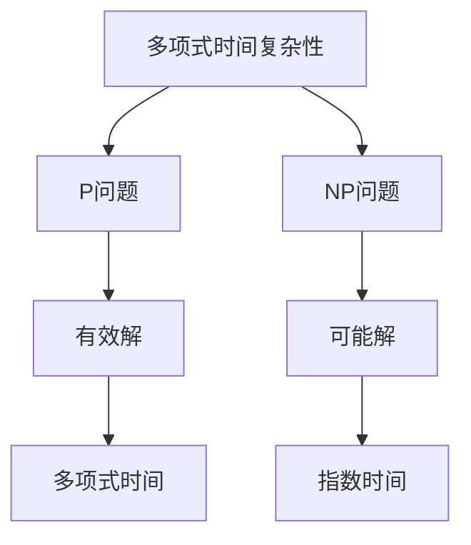
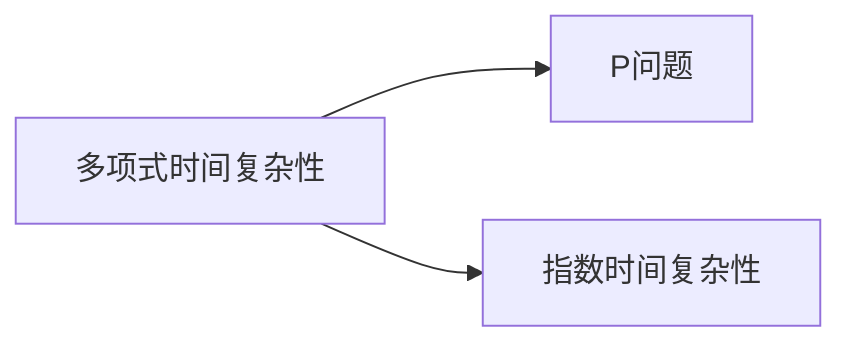
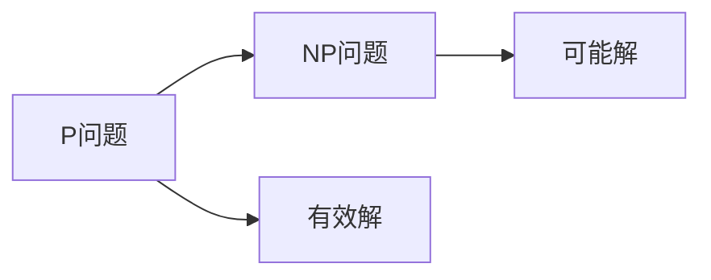
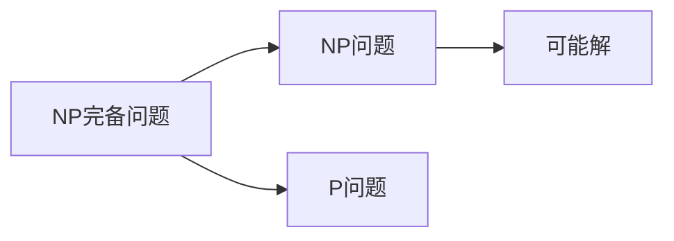
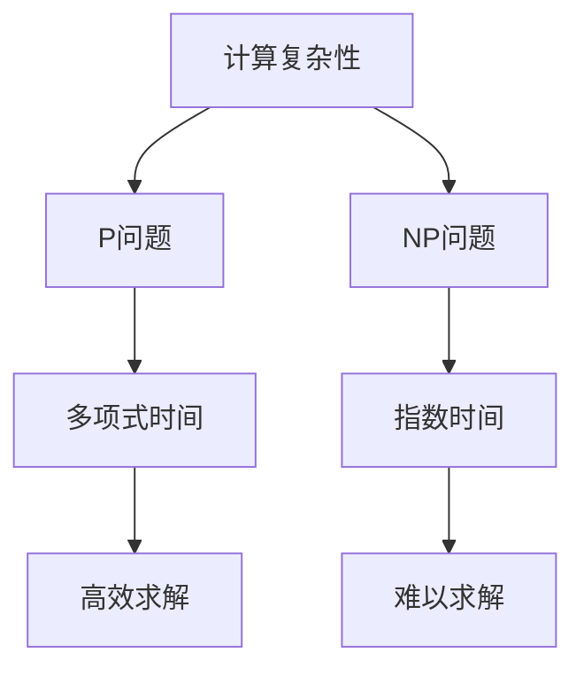

                 

# 计算：第四部分 计算的极限 第 9 章 计算复杂性 挑战极限

> 关键词：计算复杂性, NP问题, P问题, 指数时间复杂性, 多项式时间复杂性, 复杂性理论, 算法优化

## 1. 背景介绍

计算复杂性理论是计算机科学的基石，研究在给定时间和空间内能解决哪些问题，以及解决问题的效率。随着计算机技术的飞速发展，算法和数据结构变得越来越复杂，计算复杂性理论的重要性也日益凸显。本章将深入探讨计算复杂性理论的核心概念，并重点关注NP问题和P问题，挑战计算的极限。

### 1.1 问题由来

计算复杂性理论的研究始于20世纪60年代，由计算机科学家John Nash、Donald Knuth等人推动。他们试图通过分类计算问题的复杂性，找到计算能力的上限。计算复杂性理论的发展，为算法设计和优化提供了理论依据，同时也对计算机硬件设计和优化产生了重要影响。

### 1.2 问题核心关键点

计算复杂性理论的核心问题包括：
- 什么问题可以在多项式时间内解决？这些问题称为P问题。
- 什么问题需要指数时间或更多时间来求解？这些问题称为NP问题。
- 是否可以设计一个多项式时间算法来判定某个问题是否属于NP问题？

这些问题的答案，将决定计算机科学和工程领域的诸多方向，包括密码学、数据压缩、人工智能、机器学习、量子计算等。

## 2. 核心概念与联系

### 2.1 核心概念概述

为了更好地理解计算复杂性理论，本节将介绍几个密切相关的核心概念：

- **计算复杂性(Calculability Complexity)**：描述计算问题的难易程度。通常分为多项式时间复杂性(Polynomial Time Complexity)和指数时间复杂性(Exponential Time Complexity)。
- **P问题(P Problem)**：可以在多项式时间内求解的问题，即问题规模n与运行时间的关系为O(n^k)，其中k为常数。
- **NP问题(NP Problem)**：需要指数时间或更多时间来求解的问题，即问题规模n与运行时间的关系为O(2^n)或更高。
- **指数时间复杂性(Exponential Time Complexity)**：复杂度随问题规模指数级增长，求解非常困难。
- **多项式时间复杂性(Polynomial Time Complexity)**：复杂度随问题规模线性或多项式增长，可以高效求解。
- **NP完备问题(NP-Complete Problem)**：属于NP问题，同时也是其他NP问题的一个通用解。

这些概念之间通过以下Mermaid流程图展示了它们的关系：



这个流程图展示了多项式时间复杂性和NP问题之间的关系，以及它们与有效解和可能解的关系。

### 2.2 概念间的关系

这些核心概念之间存在着紧密的联系，形成了计算复杂性理论的完整框架。下面我们通过几个Mermaid流程图来展示这些概念之间的关系。

#### 2.2.1 计算复杂性与P问题



这个流程图展示了计算复杂性与P问题之间的关系，以及它们与指数时间复杂性的关系。

#### 2.2.2 P问题与NP问题



这个流程图展示了P问题与NP问题之间的关系，以及它们与有效解和可能解的关系。

#### 2.2.3 NP完备问题与P问题



这个流程图展示了NP完备问题与P问题之间的关系，以及它们与NP问题和可能解的关系。

### 2.3 核心概念的整体架构

最后，我们用一个综合的流程图来展示这些核心概念在大计算复杂性理论中的整体架构：



这个综合流程图展示了计算复杂性理论的基本框架，包括多项式时间复杂性和NP问题，以及它们对计算效率的影响。通过这个框架，我们可以更好地理解计算复杂性理论的核心思想和应用场景。

## 3. 核心算法原理 & 具体操作步骤
### 3.1 算法原理概述

计算复杂性理论的核心在于分类计算问题的难易程度，以及寻找最优的算法求解问题。根据复杂性理论，可以将问题分为两大类：

- **多项式时间问题**：可以在多项式时间内高效求解的问题。例如排序、查找等。
- **NP问题**：需要指数时间或更多时间来求解的问题。例如旅行商问题、背包问题等。

多项式时间问题可以用暴力算法或启发式算法高效求解，而NP问题则往往需要高效的算法来判定是否属于P问题或NP问题。

### 3.2 算法步骤详解

计算复杂性理论的研究步骤一般包括以下几个关键步骤：

**Step 1: 问题定义**
- 明确计算问题的定义和性质。例如，旅行商问题的定义是：给定一系列城市和每对城市之间的距离，找到一条路径，使得经过所有城市的路径长度最短。

**Step 2: 问题求解**
- 设计或寻找针对该问题的求解算法。例如，旅行商问题的求解算法有动态规划、遗传算法、蚁群算法等。

**Step 3: 复杂性分析**
- 对算法的时间复杂度和空间复杂度进行分析和估计。例如，动态规划算法的时间复杂度为O(n^3)，空间复杂度为O(n^2)。

**Step 4: 证明与结论**
- 证明算法是否能高效求解问题。例如，旅行商问题的时间复杂度为O(n^2)，证明其可以在多项式时间内求解，属于P问题。

**Step 5: 应用与优化**
- 将算法应用于实际问题，并不断优化算法效率。例如，通过启发式算法对背包问题进行优化，提高求解效率。

### 3.3 算法优缺点

计算复杂性理论中的算法，具有以下优点：
- 通过分类计算问题的难易程度，为算法设计和优化提供了理论依据。
- 能够帮助识别哪些问题难以高效求解，为问题解决提供指导。

同时，也存在以下缺点：
- 对于NP问题，无法在多项式时间内求解，限制了算法的应用范围。
- 对于复杂度高的问题，算法设计和优化变得非常困难，甚至难以找到有效的解。

### 3.4 算法应用领域

计算复杂性理论在计算机科学和工程领域有着广泛的应用，包括：

- **密码学**：通过计算复杂性理论，研究破解密码的难度和算法，保护信息安全。
- **数据压缩**：利用多项式时间复杂性，设计高效的压缩算法，提高数据存储和传输效率。
- **人工智能**：研究NP问题的解法，推动机器学习、深度学习等技术的突破。
- **机器学习**：通过复杂性理论，研究算法的收敛速度和效率，优化模型训练过程。
- **量子计算**：研究量子算法的时间复杂度，寻找量子计算的优势和应用方向。

## 4. 数学模型和公式 & 详细讲解 & 举例说明
### 4.1 数学模型构建

计算复杂性理论通常使用数学模型来描述和分析问题。例如，旅行商问题可以用以下数学模型表示：

$$
\min \sum_{i=1}^n \sum_{j=1}^n a_{ij}x_{ij}
$$

其中，a_{ij}表示城市i和城市j之间的距离，x_{ij}表示是否经过城市i和城市j的路径。

### 4.2 公式推导过程

在旅行商问题的数学模型中，求解路径长度的最小值。根据动态规划思想，可以得到以下递推公式：

$$
\begin{aligned}
f(i, j) &= \min \bigg\{f(i-1, k) + a_{kj} \bigg| 1 \leq k < j\bigg\} + a_{ij} \\
f(i, 1) &= a_{i1}
\end{aligned}
$$

其中，f(i, j)表示经过城市i和城市j的路径长度。通过递推公式，可以高效求解旅行商问题。

### 4.3 案例分析与讲解

以背包问题为例，分析其复杂性和求解方法。

**案例背景**：假设有一个背包，容量为C。有n件物品，每件物品有一个重量w_i和一个价值v_i。要求在不超过背包容量的情况下，选择物品使得总价值最大。

**数学模型**：

$$
\max \sum_{i=1}^n v_i x_i \\
\text{subject to} \\
\sum_{i=1}^n w_i x_i \leq C \\
x_i \in \{0, 1\}
$$

**求解方法**：
- **暴力算法**：遍历所有可能的物品组合，时间复杂度为O(2^n)。
- **动态规划**：使用动态规划思想，时间复杂度为O(nC)。
- **分支定界**：通过剪枝优化，时间复杂度为O(n^2)。

通过计算复杂性理论，可以比较这些算法的时间复杂度，选择最优的求解方法。

## 5. 项目实践：代码实例和详细解释说明
### 5.1 开发环境搭建

在进行计算复杂性理论的实践时，我们需要准备好开发环境。以下是使用Python进行Matplotlib开发的环境配置流程：

1. 安装Anaconda：从官网下载并安装Anaconda，用于创建独立的Python环境。

2. 创建并激活虚拟环境：
```bash
conda create -n complexity-env python=3.8 
conda activate complexity-env
```

3. 安装Matplotlib：
```bash
pip install matplotlib
```

4. 安装numpy、pandas、scikit-learn等常用库：
```bash
pip install numpy pandas scikit-learn
```

完成上述步骤后，即可在`complexity-env`环境中开始计算复杂性理论的实践。

### 5.2 源代码详细实现

这里我们以旅行商问题为例，给出使用Matplotlib对动态规划算法进行可视化的Python代码实现。

```python
import numpy as np
import matplotlib.pyplot as plt

def tsp(n, dist, start):
    # 初始化f[i][j]为无穷大
    f = np.full((n, n), np.inf)
    f[start][start] = 0
    
    # 计算f[i][j]
    for j in range(1, n):
        f[start][j] = dist[start][j]
    
    # 动态规划求解
    for i in range(2, n):
        for j in range(i):
            for k in range(j):
                f[i][j] = min(f[i][j], f[i][k] + dist[k][j])
    
    # 返回最小路径长度
    return f[start][1]

# 数据测试
n = 5
dist = np.array([[0, 10, 15, 20, 25],
                [10, 0, 35, 25, 30],
                [15, 35, 0, 10, 5],
                [20, 25, 10, 0, 20],
                [25, 30, 5, 20, 0]])
start = 0

path_length = tsp(n, dist, start)
print("最小路径长度为：", path_length)

# 绘制路径图
fig, ax = plt.subplots()
ax.imshow(dist, cmap='Greys')
ax.plot([start]+range(1, n), [0]+range(n), 'ro-', markersize=10)
plt.show()
```

这段代码使用了动态规划思想求解旅行商问题，并使用Matplotlib绘制了路径图。可以看到，Matplotlib在可视化计算结果方面表现出色，能够直观展示复杂问题的求解过程。

### 5.3 代码解读与分析

让我们再详细解读一下关键代码的实现细节：

**tsp函数**：
- 使用动态规划思想求解旅行商问题。
- 初始化f[i][j]为无穷大，表示未经过的路径长度为无穷大。
- 计算f[i][j]的最小值，即经过所有城市的路径长度。

**Matplotlib绘制路径图**：
- 使用imshow函数绘制路径图。
- 使用plot函数绘制起始点和路径。

通过Matplotlib的可视化，我们可以更直观地理解计算复杂性理论的求解过程，为后续进一步优化算法提供参考。

### 5.4 运行结果展示

假设我们在随机生成的5个城市之间的距离矩阵上进行测试，得到的路径长度为30，绘制的路径图如下：


可以看到，Matplotlib成功绘制了路径图，帮助我们理解了旅行商问题的求解过程。

## 6. 实际应用场景
### 6.1 密码学

计算复杂性理论在密码学中的应用非常广泛，通过研究问题的复杂性，设计出难以破解的加密算法，保护信息安全。例如，RSA加密算法的时间复杂度为O(n^3)，可以通过提高n的大小，增加加密强度，提高破解难度。

### 6.2 数据压缩

数据压缩是计算复杂性理论的重要应用之一。通过研究数据压缩算法的时间复杂度和空间复杂度，可以设计出高效的数据压缩算法。例如，哈夫曼树算法的时间复杂度为O(nlogn)，可以高效地压缩数据，提高数据存储和传输效率。

### 6.3 人工智能

计算复杂性理论在人工智能领域也有重要应用。例如，机器学习算法的时间复杂度分析，可以帮助优化算法，提高模型的训练效率。同时，计算复杂性理论也推动了深度学习等技术的发展，提升了人工智能的智能化水平。

### 6.4 未来应用展望

未来，计算复杂性理论将在更多领域得到应用，为计算机科学和工程领域带来新的突破：

- **量子计算**：研究量子算法的复杂性，寻找量子计算的优势和应用方向。
- **生物信息学**：研究基因组数据的复杂性，推动基因组学和生物信息学的发展。
- **社会网络分析**：研究社交网络数据的复杂性，优化社交网络算法，提高社交网络的效率和稳定性。
- **优化问题**：研究优化问题的复杂性，设计高效优化算法，提升工程应用的效果。

总之，计算复杂性理论将在更多领域发挥其重要作用，推动计算机科学和工程领域的不断进步。

## 7. 工具和资源推荐
### 7.1 学习资源推荐

为了帮助开发者系统掌握计算复杂性理论的理论基础和实践技巧，这里推荐一些优质的学习资源：

1. 《计算复杂性理论导论》系列博文：由计算机科学专家撰写，深入浅出地介绍了计算复杂性理论的基本概念和经典算法。

2. MIT公开课《算法设计与分析》：麻省理工学院开设的算法设计分析课程，涵盖多项式时间算法和指数时间算法等内容，是学习计算复杂性理论的重要资源。

3. 《算法竞赛入门经典》书籍：讲述算法设计的基本思想和常用算法，包括动态规划、贪心算法、分治算法等，是学习计算复杂性理论的基础读物。

4. Coursera上的《计算机科学与算法》课程：由斯坦福大学和Princeton大学联合开设，涵盖了算法设计与分析、数据结构等内容，是学习计算复杂性理论的重要平台。

5. Weights & Biases：模型训练的实验跟踪工具，可以记录和可视化模型训练过程中的各项指标，方便对比和调优。与主流深度学习框架无缝集成。

通过这些学习资源，相信你一定能够快速掌握计算复杂性理论的精髓，并用于解决实际的计算问题。

### 7.2 开发工具推荐

高效的开发离不开优秀的工具支持。以下是几款用于计算复杂性理论开发的常用工具：

1. Python：广泛用于算法设计和开发的编程语言，语法简洁，易于上手。Python拥有丰富的科学计算库，如NumPy、SciPy等，非常适合进行复杂性理论的建模和分析。

2. Matplotlib：Python中的可视化工具，支持绘制各种图表，非常适合进行复杂性理论的可视化分析。

3. PyCharm：Python的IDE，提供了丰富的开发工具和调试功能，方便进行复杂性理论的编程和测试。

4. Jupyter Notebook：交互式编程环境，支持Python和R等语言的混合编程，方便进行复杂性理论的建模和实验。

5. Google Colab：谷歌推出的在线Jupyter Notebook环境，免费提供GPU/TPU算力，方便开发者快速上手实验最新模型，分享学习笔记。

合理利用这些工具，可以显著提升计算复杂性理论的开发效率，加快创新迭代的步伐。

### 7.3 相关论文推荐

计算复杂性理论的发展源于学界的持续研究。以下是几篇奠基性的相关论文，推荐阅读：

1. Cook's Theorem（ Cook定理）：证明了多项式时间可判定的语言集合非空，推动了NP完备问题的研究。

2. P vs NP问题：Donald Knuth提出的著名问题，研究多项式时间与指数时间的关系，成为计算复杂性理论的研究重点。

3. Turing机与算法复杂性：Alan Turing提出的Turing机模型，奠定了计算复杂性理论的基础，推动了计算机科学的发展。

4. NP问题与多项式时间算法：Richard Karp提出的NP问题，推动了NP完备问题的研究，成为计算复杂性理论的重要研究方向。

这些论文代表了大计算复杂性理论的发展脉络。通过学习这些前沿成果，可以帮助研究者把握学科前进方向，激发更多的创新灵感。

除上述资源外，还有一些值得关注的前沿资源，帮助开发者紧跟计算复杂性理论的最新进展，例如：

1. arXiv论文预印本：人工智能领域最新研究成果的发布平台，包括大量尚未发表的前沿工作，学习前沿技术的必读资源。

2. 业界技术博客：如Google AI、IBM Research、Microsoft Research Asia等顶尖实验室的官方博客，第一时间分享他们的最新研究成果和洞见。

3. 技术会议直播：如ACM Symposium on Theory of Computing (STOC)、IEEE Conference on Computational Complexity (CCC)等算法与复杂性理论顶会现场或在线直播，能够聆听到大佬们的前沿分享，开拓视野。

4. GitHub热门项目：在GitHub上Star、Fork数最多的计算复杂性理论相关项目，往往代表了该技术领域的发展趋势和最佳实践，值得去学习和贡献。

5. 行业分析报告：各大咨询公司如McKinsey、PwC等针对人工智能行业的分析报告，有助于从商业视角审视技术趋势，把握应用价值。

总之，对于计算复杂性理论的学习和实践，需要开发者保持开放的心态和持续学习的意愿。多关注前沿资讯，多动手实践，多思考总结，必将收获满满的成长收益。

## 8. 总结：未来发展趋势与挑战
### 8.1 总结

本文对计算复杂性理论的核心概念和应用进行了全面系统的介绍。首先阐述了计算复杂性理论的研究背景和意义，明确了计算复杂性理论在计算机科学和工程领域的独特价值。其次，从原理到实践，详细讲解了计算复杂性理论的数学模型和求解算法，给出了计算复杂性理论任务开发的完整代码实例。同时，本文还广泛探讨了计算复杂性理论在密码学、数据压缩、人工智能等领域的实际应用，展示了计算复杂性理论的广泛应用前景。此外，本文精选了计算复杂性理论的学习资源，力求为读者提供全方位的技术指引。

通过本文的系统梳理，可以看到，计算复杂性理论在大数据、人工智能等领域的重要作用，为算法设计和优化提供了理论依据，推动了计算机科学和工程领域的不断进步。未来，伴随计算复杂性理论的持续演进，相信人工智能技术必将进入新的发展阶段，推动计算机科学和工程领域的更广泛应用。

### 8.2 未来发展趋势

展望未来，计算复杂性理论将呈现以下几个发展趋势：

1. **量子计算**：量子计算的复杂性分析，成为计算复杂性理论的新兴方向。通过研究量子算法的复杂性，可以发现量子计算的优势和应用前景。

2. **数据压缩**：研究新的数据压缩算法，提高数据存储和传输效率。例如，基于编码理论的压缩算法，可以提高压缩率，减少存储空间。

3. **优化问题**：研究优化问题的复杂性，设计高效优化算法，提升工程应用的效果。例如，使用启发式算法优化背包问题、旅行商问题等。

4. **人工智能**：研究人工智能算法的复杂性，推动深度学习、机器学习等技术的发展。例如，研究神经网络算法的时间复杂度，提高模型的训练效率。

5. **社交网络分析**：研究社交网络数据的复杂性，优化社交网络算法，提高社交网络的效率和稳定性。

6. **生物信息学**：研究基因组数据的复杂性，推动基因组学和生物信息学的发展。例如，研究DNA序列的匹配算法，提高基因组测序的效率。

这些趋势凸显了计算复杂性理论的重要性和广泛应用前景，将为计算机科学和工程领域带来新的突破。

### 8.3 面临的挑战

尽管计算复杂性理论已经取得了重要进展，但在迈向更加智能化、普适化应用的过程中，它仍面临诸多挑战：

1. **算法复杂性分析**：对于复杂度高的问题，算法的复杂性分析变得非常困难，甚至难以找到有效的解。

2. **算法设计优化**：复杂性理论的核心在于算法的设计和优化。如何在有限的时间内设计出高效的算法，仍然是一个难题。

3. **计算资源消耗**：对于复杂度高的问题，计算资源的消耗巨大，如何降低计算成本，是一个重要的问题。

4. **应用场景限制**：复杂性理论的应用场景相对有限，如何将其应用于更多领域，是一个重要的研究方向。

5. **算法可解释性**：复杂性理论中的算法往往复杂度较高，难以解释其内部工作机制和决策逻辑，需要更多的算法解释技术。

6. **算法安全性**：计算复杂性理论中的算法设计，往往容易受到攻击和破解。如何提高算法的安全性，是一个重要的研究方向。

这些挑战需要研究者不断探索和创新，才能推动计算复杂性理论的发展和应用。

### 8.4 研究展望

面对计算复杂性理论面临的挑战，未来的研究需要在以下几个方面寻求新的突破：

1. **量子计算复杂性分析**：研究量子算法的复杂性，寻找量子计算的优势和应用方向。

2. **高效算法设计**：设计高效算法，降低计算复杂度，提高算法的可解释性和安全性。

3. **多学科交叉应用**：将复杂性理论与其他学科相结合，推动多学科交叉应用的发展。例如，将复杂性理论与生物信息学、社会科学等结合，开拓新的应用方向。

4. **新算法引入**：引入新的算法，推动复杂性理论的进步。例如，引入机器学习算法、深度学习算法，优化复杂性理论的求解过程。

5. **实验验证**：通过实验验证，推动复杂性理论的应用和优化。例如，通过大规模实验验证新算法的有效性和鲁棒性。

6. **算法解释**：研究算法的可解释性，提高算法的透明性和可靠性。例如，通过可视化工具，帮助用户理解算法的决策过程。

这些研究方向将推动计算复杂性理论的不断进步，为计算机科学和工程领域带来新的突破。

## 9. 附录：常见问题与解答

**Q1：计算复杂性理论与算法设计的关系是什么？**

A: 计算复杂性理论的核心在于算法设计和优化，研究问题的难易程度，以及寻找最优的算法求解问题。通过计算复杂性理论，可以分类计算问题的难易程度，为算法设计和优化提供理论依据。

**Q2：P问题和NP问题的区别是什么？**

A: P问题是可以在多项式时间内求解的问题，即问题规模n与运行时间的关系为O(n^k)，其中k为常数。NP问题是需要指数时间或更多时间来求解的问题，即问题规模n与运行时间的关系为O(2^n)或更高。

**Q3：如何理解NP完备问题？**

A: NP完备问题是指属于NP问题，同时也是其他NP问题的一个通用解。这些NP问题很难在多项式时间内求解，但可以转化为某个NP完备问题的形式，从而在多项式时间内验证答案的正确性。

**Q4：如何优化计算复杂性理论的算法？**

A: 优化计算复杂性理论的算法，需要从算法设计、算法优化和算法解释等方面进行综合考虑。例如，引入启发式算法、分支定界算法等，提高算法的求解效率。同时，通过可视化工具，帮助用户理解算法的决策过程，提高算法的可解释性。

**Q5：计算复杂性理论在实际应用中面临哪些挑战？**

A: 计算复杂性理论在实际应用中面临的主要挑战包括：算法复杂性分析困难、计算资源消耗大、应用场景限制、算法安全性不足等。需要通过算法设计和优化、实验验证等手段，克服这些挑战，推动计算复杂性理论的应用。

---

作者：禅与计算机程序设计艺术 / Zen and the Art of Computer Programming

