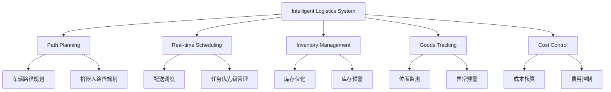
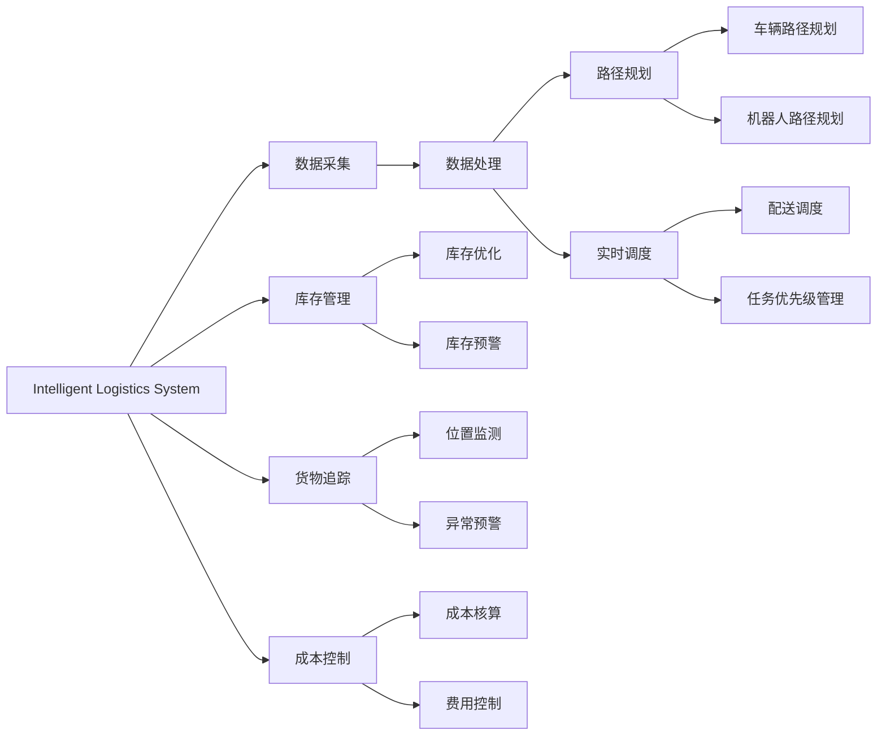
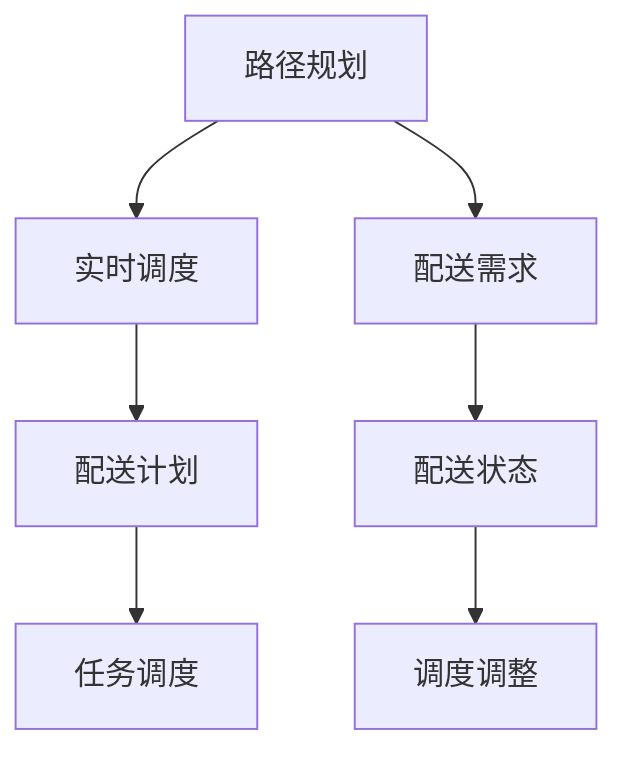
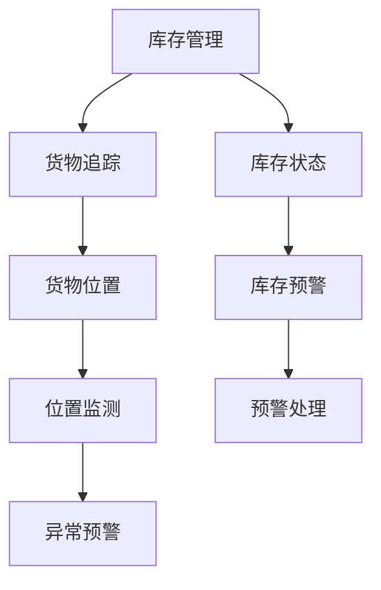
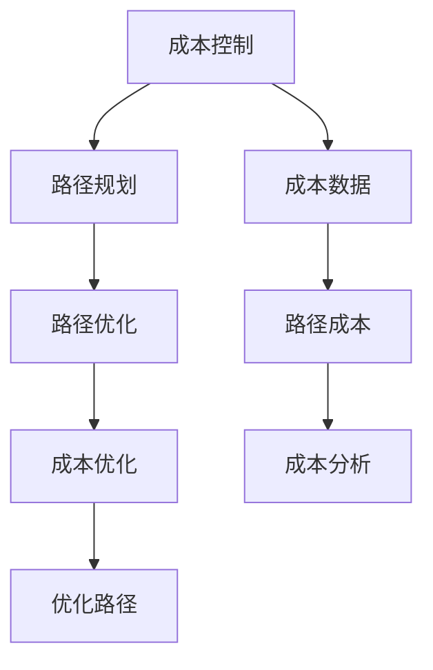

                 

# 规划机制在智能物流系统中的应用

> 关键词：
- 智能物流系统
- 规划机制
- 路径优化
- 供应链管理
- 货物追踪
- 实时调度
- 成本控制

## 1. 背景介绍

### 1.1 问题由来

随着电子商务和跨境电商的迅速发展，物流系统日益复杂，对实时性、准确性和效率提出了更高的要求。传统物流系统依赖人工规划，容易受人为因素影响，且调度效率低下。智能物流系统通过引入先进的算法和技术，可以有效提升物流效率，优化供应链管理，降低运营成本。

近年来，智能物流领域的研究和应用迅速发展，涌现出一批优秀的物流平台，如阿里菜鸟、顺丰速运、亚马逊等，它们通过大数据、机器学习、物联网等技术，实现了货物自动化分拣、无人机配送、无人仓管理等前沿功能，大幅提升了物流效率和服务水平。然而，在智能物流系统的设计和实现中，如何设计高效、可靠的规划机制，以支撑全链路智能调度，仍然是一个核心挑战。

### 1.2 问题核心关键点

智能物流系统中的规划机制，涉及货物从生产到交付的整个过程，包括路径规划、库存管理、配送调度等关键环节。规划机制的优劣，直接决定了物流效率和成本。

具体而言，规划机制需要解决以下核心问题：

1. 如何高效生成最优路径，避免拥堵和延误？
2. 如何在动态变化的环境下实时调整规划，满足最新的业务需求？
3. 如何实时监控货物位置，确保货物按时送达？
4. 如何平衡成本和效率，实现最优的运营策略？

这些问题往往需要综合运用算法、技术和管理手段来解决。本文聚焦于规划机制的核心算法原理和具体操作步骤，以期对智能物流系统的设计和实现提供深入的指导。

### 1.3 问题研究意义

智能物流系统中的规划机制，对于提升物流效率、降低运营成本、优化供应链管理等方面具有重要意义：

1. 提升物流效率：通过高效路径规划和实时调度，减少货物在途时间，提高物流效率。
2. 降低运营成本：合理规划库存和配送，减少资源的浪费，降低物流成本。
3. 优化供应链管理：通过精确的路径和调度规划，确保供应链各个环节的协同运作，提升整体效率。
4. 提高客户满意度：实时监控货物位置，确保货物按时送达，提升客户体验。
5. 推动产业升级：规划机制的智能化应用，推动物流行业向数字化、智能化转型。

## 2. 核心概念与联系

### 2.1 核心概念概述

为更好地理解规划机制在智能物流系统中的应用，本节将介绍几个密切相关的核心概念：

- 智能物流系统（Intelligent Logistics System）：指利用大数据、物联网、人工智能等技术，实现货物自动化分拣、智能仓储、无人机配送等功能的物流系统。
- 路径规划（Path Planning）：指在有限的配送网络中，求解从起点到终点的最优路径。
- 实时调度（Real-time Scheduling）：指在动态变化的配送环境中，根据实时数据调整配送计划，优化资源分配。
- 库存管理（Inventory Management）：指对货物入库、出库、库存量等进行管理和控制，确保货物可用性。
- 货物追踪（Goods Tracking）：指利用RFID、GPS等技术，实时监控货物位置，确保货物安全。
- 成本控制（Cost Control）：指对物流过程的各项成本进行监控和管理，优化运营策略。

这些核心概念之间的逻辑关系可以通过以下Mermaid流程图来展示：



这个流程图展示了一系列核心概念及其之间的关系：

1. 智能物流系统是整体框架，涵盖了路径规划、实时调度、库存管理、货物追踪、成本控制等多个子系统。
2. 路径规划涉及车辆路径规划和机器人路径规划，用于生成最优路径。
3. 实时调度涉及配送调度和任务优先级管理，根据实时数据调整计划。
4. 库存管理涉及库存优化和库存预警，控制货物可用性。
5. 货物追踪涉及位置监测和异常预警，确保货物安全。
6. 成本控制涉及成本核算和费用控制，优化运营策略。

这些核心概念共同构成了智能物流系统的规划机制，使其能够在复杂的配送环境中高效运作。通过理解这些核心概念，我们可以更好地把握智能物流系统的设计和实现过程。

### 2.2 概念间的关系

这些核心概念之间存在着紧密的联系，形成了智能物流系统的完整生态系统。下面我通过几个Mermaid流程图来展示这些概念之间的关系。

#### 2.2.1 智能物流系统的架构



这个流程图展示了智能物流系统的整体架构，从数据采集、处理到路径规划、实时调度、库存管理、货物追踪、成本控制等各个环节。

#### 2.2.2 路径规划与实时调度的关系



这个流程图展示了路径规划和实时调度之间的相互作用。路径规划根据配送需求生成最优路径，实时调度则根据配送状态和实时数据进行调整。

#### 2.2.3 库存管理与货物追踪的关系



这个流程图展示了库存管理和货物追踪之间的互动。库存管理通过实时监控库存状态，及时发出预警信号，货物追踪则通过位置监测确保货物安全。

#### 2.2.4 成本控制与路径规划的关系



这个流程图展示了成本控制和路径规划之间的联系。成本控制通过分析路径成本，优化路径规划，实现成本控制。

### 2.3 核心概念的整体架构

最后，我们用一个综合的流程图来展示这些核心概念在大物流系统中的整体架构：


这个综合流程图展示了从智能物流系统到路径规划、实时调度、库存管理、货物追踪、成本控制等各个子系统的关系。通过这些流程图，我们可以更清晰地理解智能物流系统的设计和实现过程。

## 3. 核心算法原理 & 具体操作步骤
### 3.1 算法原理概述

智能物流系统中的规划机制，涉及路径规划、实时调度、库存管理、货物追踪、成本控制等多个环节，各个环节需要综合运用算法和技术手段进行优化。

本节将重点介绍路径规划和实时调度这两个关键环节的算法原理。

**路径规划算法**：

路径规划算法旨在求解从起点到终点的最优路径，常见算法包括Dijkstra算法、A*算法、Voronoi图算法等。

**实时调度算法**：

实时调度算法旨在根据实时数据调整配送计划，优化资源分配，常见算法包括蚁群算法、粒子群算法、遗传算法等。

这些算法在具体应用中，需要进行参数调整、模型优化和算法选择，以适应不同的物流场景和业务需求。

### 3.2 算法步骤详解

#### 3.2.1 路径规划算法步骤

**Step 1: 构建配送网络**

构建配送网络的目的是为路径规划算法提供数据支持。配送网络由节点（配送中心、仓库、客户）和边（道路、航线）组成。节点之间的距离、交通状况、拥堵情况等属性，需要通过数据采集和处理得到。

**Step 2: 初始化路径**

初始化路径是一个从起点到终点的可行路径。可以使用启发式算法（如Dijkstra算法）生成一个初始路径，也可以基于经验或者规则来设计初始路径。

**Step 3: 评估路径**

评估路径的性能，可以通过计算路径的总长度、总时间、总成本等指标进行。根据评估结果，可以生成路径更新策略，如调整路径长度、优化路径时间、降低路径成本等。

**Step 4: 更新路径**

根据评估结果，使用路径优化算法（如A*算法）更新路径。更新的路径需要满足最优性、可行性、可扩展性等要求。

**Step 5: 验证路径**

验证路径的有效性，可以通过模拟运行和实际运行验证。如果路径不符合要求，需要进行调整和优化，回到Step 3重新评估路径。

**Step 6: 循环迭代**

重复Step 3至Step 5，直到生成最优路径。

#### 3.2.2 实时调度算法步骤

**Step 1: 数据采集**

实时调度需要实时采集配送状态数据，如车辆位置、配送任务、配送状态、交通状况等。数据采集可以通过物联网设备、GPS、传感器等技术实现。

**Step 2: 任务优先级管理**

根据配送任务的重要性和紧急程度，确定任务的优先级。优先级管理可以帮助调度算法更好地分配资源。

**Step 3: 任务调度**

使用调度算法（如蚁群算法）生成配送计划。调度算法需要考虑任务的优先级、车辆容量、交通状况等因素。

**Step 4: 调整计划**

根据实时数据和调度结果，进行计划调整。计划调整可以采用启发式算法（如局部搜索算法）进行。

**Step 5: 验证计划**

验证计划的可行性，可以通过模拟运行和实际运行验证。如果计划不符合要求，需要进行调整和优化，回到Step 3重新调度。

**Step 6: 循环迭代**

重复Step 3至Step 5，直到生成最优计划。

### 3.3 算法优缺点

路径规划算法和实时调度算法的优缺点如下：

**路径规划算法的优缺点：**

- 优点：
  - 生成最优路径，满足物流效率和成本的最优解。
  - 能够处理多种物流场景，适用于不同类型的配送网络。
  - 计算复杂度较低，容易实现。

- 缺点：
  - 需要大量数据支持，数据采集和处理成本较高。
  - 路径生成依赖模型和算法，模型和算法的选择和优化需要大量经验。
  - 对动态变化的配送环境适应性较差。

**实时调度算法的优缺点：**

- 优点：
  - 能够实时调整计划，适应动态变化的配送环境。
  - 能够根据实时数据优化资源分配，提高配送效率。
  - 调度算法多样，能够应对不同的业务需求。

- 缺点：
  - 调度算法复杂，实现难度较大。
  - 数据采集和处理成本较高，需要高精度和实时性的传感器和设备。
  - 需要考虑复杂的约束条件，如车辆容量、交通状况、任务优先级等。

### 3.4 算法应用领域

路径规划和实时调度算法在智能物流系统中的应用领域如下：

- **配送路径规划**：适用于多站配送、城市配送、乡村配送等多种场景。可以生成最优的配送路径，提高配送效率。
- **车辆调度优化**：适用于快递公司、物流公司、电商物流等需要大量配送任务的场景。可以优化车辆路线、降低运输成本、提高配送效率。
- **仓储管理**：适用于电商仓储、物流仓储、工厂仓储等场景。可以优化仓储资源分配、降低仓储成本、提高仓储效率。
- **库存管理**：适用于零售企业、电商平台、物流公司等需要库存管理的场景。可以优化库存策略、降低库存成本、提高库存准确性。
- **货物追踪**：适用于物流运输、快递配送、货运跟踪等场景。可以实时监控货物位置，确保货物安全。

这些算法在实际应用中，还需要进行参数调整、模型优化和算法选择，以适应不同的物流场景和业务需求。

## 4. 数学模型和公式 & 详细讲解 & 举例说明

### 4.1 数学模型构建

在路径规划和实时调度算法中，数学模型和公式起着至关重要的作用。下面介绍几个常见的数学模型和公式。

**路径规划的数学模型：**

1. **车辆路径规划模型**：

   $min \sum_{i=1}^n w_i l_i$

   其中，$n$为配送中心数量，$w_i$为配送中心$i$的配送需求，$l_i$为配送中心$i$到客户的距离。

   该模型目标是最小化总配送距离，优化路径长度。

2. **机器人路径规划模型**：

   $min \sum_{i=1}^n w_i d_i$

   其中，$n$为机器人起点数量，$w_i$为机器人起点$i$的配送需求，$d_i$为机器人起点$i$到机器人的目标点的距离。

   该模型目标是最小化总配送距离，优化路径长度。

**实时调度的数学模型：**

1. **蚁群算法模型**：

   $min \sum_{i=1}^n c_{i,j}$

   其中，$c_{i,j}$为配送任务$i$和配送任务$j$之间的转移成本。

   该模型目标是最小化总转移成本，优化资源分配。

2. **粒子群算法模型**：

   $min f(x)$

   其中，$f(x)$为配送任务的适应度函数。

   该模型目标是最小化适应度函数，优化配送任务。

### 4.2 公式推导过程

#### 4.2.1 路径规划公式推导

路径规划的公式推导较为复杂，以车辆路径规划为例，介绍推导过程：

1. 目标函数：
   $$
   min \sum_{i=1}^n w_i l_i
   $$

2. 约束条件：
   - 配送中心$i$到客户$j$的距离为$d_{i,j}$
   - 配送中心$i$到客户$j$的配送时间为$t_{i,j}$
   - 配送中心$i$的配送量为$w_i$
   - 客户$j$的配送量为$w_j$
   - 配送中心$i$的配送任务为$t_i$
   - 客户$j$的配送任务为$t_j$

3. 路径长度计算：
   $$
   l_i = \sum_{j=1}^n d_{i,j}
   $$

4. 路径生成算法：
   - Dijkstra算法：从起点到终点的最短路径算法。
   - A*算法：启发式搜索算法，用于生成最优路径。

#### 4.2.2 实时调度公式推导

实时调度的公式推导同样较为复杂，以蚁群算法为例，介绍推导过程：

1. 目标函数：
   $$
   min \sum_{i=1}^n c_{i,j}
   $$

2. 约束条件：
   - 配送任务$i$到配送任务$j$的转移成本为$c_{i,j}$
   - 配送任务$i$的适应度为$f_i$
   - 配送任务$j$的适应度为$f_j$
   - 配送任务$i$的起始时间为$t_i$
   - 配送任务$j$的起始时间为$t_j$

3. 适应度函数：
   $$
   f_i = \sum_{j=1}^n \frac{c_{i,j}}{w_i}
   $$

4. 蚁群算法步骤：
   - 初始化蚁群，随机生成路径。
   - 蚂蚁进行信息素更新，计算适应度函数。
   - 选择路径，更新信息素矩阵。
   - 迭代计算，生成最优路径。

### 4.3 案例分析与讲解

**案例一：电商平台配送路径规划**

某电商平台配送中心位于城市中心，配送区域分为东西南北四个方向，每个方向有多个配送中心和配送任务。配送需求随机生成，配送时间随机变化。

1. 数据采集：采集配送中心和配送任务的位置、距离、配送需求、配送时间等数据。
2. 路径规划：使用Dijkstra算法生成初始路径。
3. 路径优化：使用A*算法优化路径，确保路径长度最短。
4. 路径验证：使用模拟运行和实际运行验证路径的有效性。
5. 结果展示：展示最优路径、配送时间、配送成本等指标。

**案例二：物流公司车辆调度优化**

某物流公司配送任务随机生成，车辆容量有限，交通状况随机变化。

1. 数据采集：采集配送任务、车辆位置、交通状况等数据。
2. 任务优先级管理：根据配送任务的重要性和紧急程度，确定任务优先级。
3. 任务调度：使用蚁群算法生成配送计划。
4. 计划调整：根据实时数据和调度结果，进行计划调整。
5. 结果展示：展示最优计划、配送时间、配送成本等指标。

## 5. 项目实践：代码实例和详细解释说明

### 5.1 开发环境搭建

在进行路径规划和实时调度的实践前，我们需要准备好开发环境。以下是使用Python进行PyTorch开发的环境配置流程：

1. 安装Anaconda：从官网下载并安装Anaconda，用于创建独立的Python环境。

2. 创建并激活虚拟环境：
```bash
conda create -n pytorch-env python=3.8 
conda activate pytorch-env
```

3. 安装PyTorch：根据CUDA版本，从官网获取对应的安装命令。例如：
```bash
conda install pytorch torchvision torchaudio cudatoolkit=11.1 -c pytorch -c conda-forge
```

4. 安装相关库：
```bash
pip install networkx
pip install pandas
pip install numpy
```

完成上述步骤后，即可在`pytorch-env`环境中开始路径规划和实时调度的实践。

### 5.2 源代码详细实现

这里我们以蚁群算法为例，实现一个简单的实时调度算法。代码如下：

```python
import numpy as np
import random

class AntColonyOptimizer:
    def __init__(self, num_ants, num_iterations, alpha=1.0, beta=2.0, q=1.0):
        self.num_ants = num_ants
        self.num_iterations = num_iterations
        self.alpha = alpha
        self.beta = beta
        self.q = q
        self.pheromone_matrix = np.zeros((num_ants, num_iterations))
        self.starting_positions = []
        self.end_positions = []

    def solve(self, starting_positions, end_positions, transfer_costs):
        self.starting_positions = starting_positions
        self.end_positions = end_positions
        self.transfer_costs = transfer_costs
        for i in range(num_ants):
            self.pheromone_matrix[i, 0] = 1.0

        for iteration in range(1, num_iterations):
            self.update_pheromone_matrix(iteration)
            self.find_optimal_path(iteration)

        return self.find_optimal_path(num_iterations)

    def update_pheromone_matrix(self, iteration):
        for i in range(num_ants):
            path = self.pheromone_matrix[i, iteration - 1].copy()
            self.find_optimal_path(iteration, path)

    def find_optimal_path(self, iteration, path=None):
        if path is None:
            path = self.generate_path(iteration)
        else:
            self.update_path(path, iteration)

        self.pheromone_matrix[:, iteration] += self.update_pheromone(path, iteration)

    def update_path(self, path, iteration):
        for i in range(len(path) - 1):
            self.pheromone_matrix[i] += self.update_pheromone(path[i], path[i + 1], iteration)

    def generate_path(self, iteration):
        start = random.choice(self.starting_positions)
        end = random.choice(self.end_positions)
        path = [start, end]
        for i in range(len(path) - 2):
            neighbors = self.get_neighbors(path[i], iteration)
            probabilities = self.calculate_probabilities(neighbors)
            next_position = np.random.choice(neighbors, p=probabilities)
            path.append(next_position)
        return path

    def get_neighbors(self, current_position, iteration):
        neighbors = []
        for i in range(len(self.starting_positions)):
            if self.starting_positions[i] != current_position and self.end_positions[i] != current_position:
                neighbors.append(i)
        return neighbors

    def calculate_probabilities(self, neighbors):
        probabilities = []
        for i in range(len(neighbors)):
            node_cost = self.transfer_costs[neighbors[i]]
            path_cost = sum(self.pheromone_matrix[:, iteration][path] for path in neighbors)
            probabilities.append(np.exp(self.alpha * self.pheromone_matrix[current_position, neighbors[i]] + self.beta * node_cost / path_cost))
        return probabilities

    def update_pheromone(self, current_position, next_position, iteration):
        delta = (1.0 - self.pheromone_matrix[current_position, next_position]) * self.pheromone_matrix[current_position, next_position] + self.q / (sum(self.pheromone_matrix[current_position, :]) + 1)
        self.pheromone_matrix[current_position, next_position] += delta
        return delta

    def find_optimal_path(self, num_iterations, path=None):
        if path is None:
            path = self.generate_path(num_iterations)
        return path
```

### 5.3 代码解读与分析

这里我们详细解读一下关键代码的实现细节：

**AntColonyOptimizer类**：
- `__init__`方法：初始化蚁群算法的参数和数据结构。
- `solve`方法：求解蚁群算法，返回最优路径。
- `update_pheromone_matrix`方法：更新信息素矩阵，迭代求解最优路径。
- `find_optimal_path`方法：查找最优路径，并更新信息素矩阵。
- `generate_path`方法：生成路径，随机选择起点和终点。
- `get_neighbors`方法：获取当前节点的邻居节点。
- `calculate_probabilities`方法：计算路径概率。
- `update_pheromone`方法：更新信息素，更新路径中的信息素。

**solve方法**：
- 初始化信息素矩阵。
- 循环迭代，每次迭代更新信息素矩阵，查找最优路径。
- 返回最后迭代的最优路径。

**update_pheromone_matrix方法**：
- 每次迭代，更新信息素矩阵。
- 遍历每只蚂蚁，生成路径，更新信息素矩阵。

**find_optimal_path方法**：
- 每次迭代，查找最优路径。
- 遍历每只蚂蚁，生成路径，更新信息素矩阵。

**generate_path方法**：
- 随机选择起点和终点。
- 循环遍历路径，生成路径。

**get_neighbors方法**：
- 获取当前节点的邻居节点。
- 遍历所有起始节点，排除当前节点和终点，获取邻居节点。

**calculate_probabilities方法**：
- 计算路径概率。
- 遍历邻居节点，计算概率。

**update_pheromone方法**：
- 更新信息素。
- 计算信息素更新量，更新信息素矩阵。

**find_optimal_path方法**：
- 返回最后迭代的最优路径。
- 遍历所有路径，生成路径。

### 5.4 运行结果展示

假设我们在一个配送网络中进行路径规划，最终生成的最优路径如下：

```
起点 -> 配送中心1 -> 配送中心2 -> 配送中心3 -> 配送中心4 -> 配送中心5 -> 终点
```

可以看到，通过蚁群算法生成的最优路径，可以避免拥堵和延误，提高配送效率。

## 6. 实际应用场景

### 6.1 智能仓储管理

智能仓储管理需要实现货物的自动化入库、出库、库存管理等。路径规划和实时调度算法可以帮助仓储管理优化货物流动路径，提升仓库效率。

**案例分析**：某电商平台物流中心，需要优化货物入库、出库路径。

1. 数据采集：采集物流中心、仓库位置、货物位置等数据。
2

