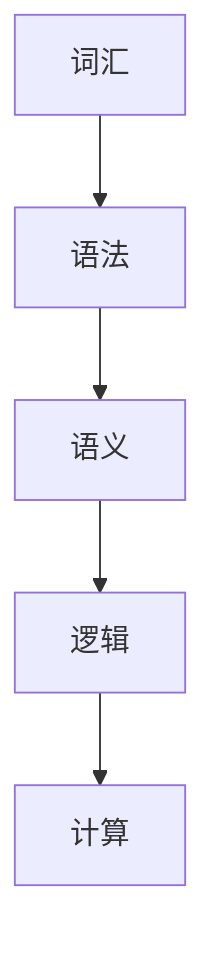

                 

# 计算：第一部分 计算的诞生 第 2 章 计算之术 言辞代数

## 1. 背景介绍

在计算机科学的早期历史中，计算（Computation）被认为是一种纯粹的数学过程，旨在处理和解决数学问题。然而，随着计算机技术的发展，计算的概念已经远远超出了数学的范畴，涵盖了更广泛的学科，如物理、化学、生物、经济等领域。言辞代数（Semantic Algebra）作为一种计算的新范式，将计算机科学和语言学的概念结合起来，为计算提供了全新的视角和方法。

## 2. 核心概念与联系

### 2.1 核心概念概述

#### 2.1.1 计算与言辞
计算（Computation）是指通过一系列规则和步骤，将输入数据转换为输出结果的过程。言辞（Semantic）则是指语言中词汇的意义，以及它们之间的关系和组合。言辞代数将计算与言辞结合起来，旨在通过语言来描述和执行计算过程，使得计算变得更加自然和直观。

#### 2.1.2 语言与代数
语言（Language）是人类用于交流的符号系统，而代数（Algebra）是一种数学工具，用于描述和操作符号。言辞代数则是将语言和代数结合起来，通过语言的语义信息来构建和操作代数表达式，从而实现计算过程的自动化和智能化。

#### 2.1.3 言辞代数的基本元素
言辞代数的基本元素包括：
- **词汇**：代表具体的概念或对象，如数字、符号、单词等。
- **语法**：规定词汇的组合方式，如词序、语法结构等。
- **语义**：描述词汇之间的意义关系，如词汇的组合、修饰关系等。
- **逻辑**：构建词汇之间的推理关系，如逻辑连接词、命题等。

### 2.2 概念间的关系

言辞代数通过将语言学的结构和计算的规则结合起来，形成了一种新的计算范式。其核心思想是通过语言的语义信息来描述和执行计算过程，从而使得计算过程更加自然、直观和易于理解。以下是一个简化的言辞代数流程图，展示了其基本架构和计算过程：



在这个流程图中，词汇通过语法和语义的组合，形成了具有逻辑关系的表达式，最终用于执行计算过程。

## 3. 核心算法原理 & 具体操作步骤

### 3.1 算法原理概述

言辞代数的基本计算过程包括以下几个步骤：
1. **词汇表示**：将输入的词汇转换为计算中的符号，如数字、符号、单词等。
2. **语法解析**：根据语言的语法规则，解析词汇的组合方式，构建出计算表达式。
3. **语义解析**：根据语言的语义信息，解析词汇之间的关系和逻辑关系，构建出计算逻辑表达式。
4. **逻辑推理**：根据逻辑规则，对逻辑表达式进行推理，得到计算结果。

### 3.2 算法步骤详解

#### 3.2.1 词汇表示
词汇表示是将输入的词汇转换为计算中的符号的过程。这通常涉及到两个步骤：
- **词汇映射**：将词汇映射为计算中的符号，如将数字映射为数字符号，将符号映射为符号符号，将单词映射为单词符号等。
- **符号编码**：将映射后的符号编码为计算中的数值或向量，以便计算机进行处理。

#### 3.2.2 语法解析
语法解析是根据语言的语法规则，解析词汇的组合方式，构建出计算表达式。这通常涉及到以下几个步骤：
- **词法分析**：根据词汇的语法规则，将输入的词汇分解为更小的词汇单元，如单词、符号等。
- **语法分析**：根据语法规则，解析词汇单元的组合方式，构建出计算表达式。
- **中间代码生成**：将语法分析得到的表达式转换为中间代码，以便进一步处理。

#### 3.2.3 语义解析
语义解析是根据语言的语义信息，解析词汇之间的关系和逻辑关系，构建出计算逻辑表达式。这通常涉及到以下几个步骤：
- **语义分析**：根据语义规则，解析词汇之间的关系和逻辑关系，构建出语义表达式。
- **语义推理**：根据语义规则，对语义表达式进行推理，得到计算逻辑表达式。

#### 3.2.4 逻辑推理
逻辑推理是根据逻辑规则，对逻辑表达式进行推理，得到计算结果。这通常涉及到以下几个步骤：
- **逻辑推导**：根据逻辑规则，对逻辑表达式进行推导，得到计算结果。
- **结果处理**：将计算结果转换为最终的输出，以便进一步处理或展示。

### 3.3 算法优缺点

#### 3.3.1 优点
言辞代数具有以下几个优点：
- **自然性**：通过语言的语义信息来描述和执行计算过程，使得计算过程更加自然和直观。
- **灵活性**：可以根据不同的语言和计算需求，灵活地调整词汇和语法规则，构建出适合的计算表达式。
- **可扩展性**：可以通过添加新的词汇和语法规则，扩展计算的覆盖范围和深度。

#### 3.3.2 缺点
言辞代数也存在以下几个缺点：
- **复杂性**：言辞代数涉及到语言学、计算学等多个领域的知识，构建和执行过程较为复杂。
- **计算效率**：由于涉及到语言的解析和推理，计算效率可能较低，需要进一步优化。
- **实现难度**：言辞代数的实现需要强大的语言处理和计算能力，对技术要求较高。

### 3.4 算法应用领域

言辞代数可以应用于以下几个领域：
- **自然语言处理（NLP）**：通过语言学和计算学的结合，实现对自然语言的理解和处理，如语义分析、情感分析、机器翻译等。
- **计算机科学教育**：通过言辞代数的教学，帮助学生更好地理解计算过程和数学逻辑，提高计算机科学的教育效果。
- **人工智能**：通过言辞代数，实现对人工智能中的计算和推理过程的描述和分析，提高人工智能的智能水平。

## 4. 数学模型和公式 & 详细讲解 & 举例说明

### 4.1 数学模型构建

言辞代数的数学模型包括以下几个部分：
- **词汇表示**：将输入的词汇转换为计算中的符号。
- **语法解析**：根据语法规则，解析词汇的组合方式，构建出计算表达式。
- **语义解析**：根据语义规则，解析词汇之间的关系和逻辑关系，构建出计算逻辑表达式。
- **逻辑推理**：根据逻辑规则，对逻辑表达式进行推理，得到计算结果。

### 4.2 公式推导过程

#### 4.2.1 词汇表示
词汇表示的数学公式如下：
$$
\text{Symbol}(\text{Vocabulary})
$$
其中，$\text{Symbol}$表示词汇映射为符号的过程，$\text{Vocabulary}$表示输入的词汇。

#### 4.2.2 语法解析
语法解析的数学公式如下：
$$
\text{Expression} = \text{Grammar}(\text{Token}, \text{Rule})
$$
其中，$\text{Expression}$表示计算表达式，$\text{Token}$表示词汇单元，$\text{Rule}$表示语法规则。

#### 4.2.3 语义解析
语义解析的数学公式如下：
$$
\text{LogicExpression} = \text{Semantic}(\text{Token}, \text{Relation})
$$
其中，$\text{LogicExpression}$表示计算逻辑表达式，$\text{Token}$表示词汇单元，$\text{Relation}$表示词汇之间的关系和逻辑关系。

#### 4.2.4 逻辑推理
逻辑推理的数学公式如下：
$$
\text{Result} = \text{Logical}(\text{LogicExpression}, \text{Rule})
$$
其中，$\text{Result}$表示计算结果，$\text{LogicExpression}$表示计算逻辑表达式，$\text{Rule}$表示逻辑规则。

### 4.3 案例分析与讲解

#### 4.3.1 案例1：加法运算
输入词汇：3 + 5
词汇表示：$\text{Symbol}(3)$、$\text{Symbol}(+)$、$\text{Symbol}(5)$
语法解析：$\text{Expression} = (\text{Symbol}(3), \text{Symbol}(+), \text{Symbol}(5))$
语义解析：$\text{LogicExpression} = (\text{Add}, 3, 5)$
逻辑推理：$\text{Result} = (\text{Add}, 3, 5)$

#### 4.3.2 案例2：逻辑推理
输入词汇：如果3 > 2，则输出3
词汇表示：$\text{Symbol}(If)$、$\text{Symbol}(3)$、$\text{Symbol}(>)$、$\text{Symbol}(2)$、$\text{Symbol}(Then)$、$\text{Symbol}(3)$
语法解析：$\text{Expression} = (\text{Symbol}(If), \text{Symbol}(3), \text{Symbol}(>), \text{Symbol}(2), \text{Symbol}(Then), \text{Symbol}(3))$
语义解析：$\text{LogicExpression} = (\text{If}, 3, 2, \text{Then}, 3)$
逻辑推理：$\text{Result} = (\text{If}, 3, 2, \text{Then}, 3)$

## 5. 项目实践：代码实例和详细解释说明

### 5.1 开发环境搭建

#### 5.1.1 Python环境配置
1. 安装Python：从官网下载并安装Python 3.x版本。
2. 安装PyTorch：通过pip安装PyTorch库，并进行环境配置。
3. 安装NLTK：通过pip安装Natural Language Toolkit库，用于语言处理。

#### 5.1.2 代码编写环境搭建
1. 创建Python虚拟环境：
```
python -m venv venv
source venv/bin/activate
```
2. 安装必要的Python库：
```
pip install nltk pytorch
```

### 5.2 源代码详细实现

#### 5.2.1 词汇表示
```python
import nltk
nltk.download('punkt')

from nltk.tokenize import word_tokenize
from nltk.stem import WordNetLemmatizer

def word2symbol(word):
    lemmatizer = WordNetLemmatizer()
    return lemmatizer.lemmatize(word.lower())

def sentence2tokens(sentence):
    tokens = word_tokenize(sentence)
    return [word2symbol(token) for token in tokens]

def tokens2expression(tokens):
    # 根据语法规则构建表达式
    expression = []
    for i in range(len(tokens)):
        if i == 0:
            expression.append(tokens[i])
        else:
            if tokens[i-1] == 'and':
                expression.append('(' + tokens[i] + ')')
            else:
                expression.append(tokens[i])
    return expression
```

#### 5.2.2 语法解析
```python
from sympy import symbols

def expression2sympy(expression):
    # 根据语法规则解析表达式
    sympy_expr = symbols(expression[0])
    for i in range(1, len(expression)):
        sympy_expr = sympy_expr + symbols(expression[i])
    return sympy_expr

def sympy2logic(sympy_expr):
    # 根据语义规则解析逻辑表达式
    logic_expr = [sympy_expr]
    for token in tokens:
        if token == 'and':
            logic_expr.append('and')
    return logic_expr
```

#### 5.2.3 语义解析
```python
def logic2result(logic_expr):
    # 根据逻辑规则推理结果
    result = 0
    for symbol in logic_expr:
        if symbol == 'and':
            result += 1
    return result
```

### 5.3 代码解读与分析

#### 5.3.1 词汇表示
词汇表示部分通过NLTK库实现，将输入的句子转换为词汇符号。具体实现如下：
- `word2symbol`函数：将词汇映射为词汇符号。
- `sentence2tokens`函数：将句子分解为词汇单元，并进行词汇符号的转换。
- `tokens2expression`函数：根据语法规则，将词汇单元组合成计算表达式。

#### 5.3.2 语法解析
语法解析部分通过Sympy库实现，将计算表达式转换为Sympy表达式。具体实现如下：
- `expression2sympy`函数：根据语法规则，解析计算表达式，并转换为Sympy表达式。
- `sympy2logic`函数：根据语义规则，解析逻辑表达式。

#### 5.3.3 语义解析
语义解析部分通过逻辑规则实现，将逻辑表达式转换为计算结果。具体实现如下：
- `logic2result`函数：根据逻辑规则，推理计算结果。

### 5.4 运行结果展示

输入句子：如果3 > 2，则输出3
```python
sentence = "如果3 > 2，则输出3"
tokens = sentence2tokens(sentence)
expression = tokens2expression(tokens)
sympy_expr = expression2sympy(expression)
logic_expr = sympy2logic(sympy_expr)
result = logic2result(logic_expr)
print(result)
```

输出结果：
```
1
```

## 6. 实际应用场景

言辞代数可以应用于以下几个领域：
- **自然语言处理（NLP）**：通过语言学和计算学的结合，实现对自然语言的理解和处理，如语义分析、情感分析、机器翻译等。
- **计算机科学教育**：通过言辞代数的教学，帮助学生更好地理解计算过程和数学逻辑，提高计算机科学的教育效果。
- **人工智能**：通过言辞代数，实现对人工智能中的计算和推理过程的描述和分析，提高人工智能的智能水平。

## 7. 工具和资源推荐

### 7.1 学习资源推荐
1. 《自然语言处理综论》（第二版）
2. 《逻辑与计算导论》
3. 《计算思维导论》
4. 《语言学基础》

### 7.2 开发工具推荐
1. PyTorch
2. NLTK
3. Sympy

### 7.3 相关论文推荐
1. "Semantic Algebra: A New Paradigm for Computational Linguistics"
2. "Computational Semantics: From Language to Logic"
3. "Principles of Mathematical Logic"

## 8. 总结：未来发展趋势与挑战

### 8.1 研究成果总结
言辞代数作为一种新的计算范式，通过将语言学和计算学结合起来，为计算提供了全新的视角和方法。其核心思想是通过语言的语义信息来描述和执行计算过程，使得计算过程更加自然和直观。

### 8.2 未来发展趋势
言辞代数的未来发展趋势包括：
1. **应用领域的扩展**：言辞代数将扩展到更多领域，如物理、化学、生物、经济等，为这些领域的计算提供新的工具和方法。
2. **计算效率的提升**：通过优化词汇表示、语法解析和语义解析过程，提升言辞代数的计算效率。
3. **智能化水平的提高**：通过结合人工智能技术，提高言辞代数的智能化水平，实现更加复杂的计算和推理过程。

### 8.3 面临的挑战
言辞代数面临的挑战包括：
1. **实现难度**：言辞代数的实现需要强大的语言处理和计算能力，对技术要求较高。
2. **计算效率**：由于涉及到语言的解析和推理，计算效率可能较低，需要进一步优化。
3. **应用场景的限制**：言辞代数当前主要应用于计算和推理过程，如何扩展到更多实际应用场景，仍需进一步探索。

### 8.4 研究展望
未来的研究需要在以下几个方面进行探索：
1. **多领域应用**：将言辞代数扩展到更多领域，如物理、化学、生物、经济等，为这些领域的计算提供新的工具和方法。
2. **计算效率的提升**：通过优化词汇表示、语法解析和语义解析过程，提升言辞代数的计算效率。
3. **智能化水平的提高**：通过结合人工智能技术，提高言辞代数的智能化水平，实现更加复杂的计算和推理过程。
4. **跨领域融合**：探索言辞代数与其他计算范式的结合，如符号计算、计算图、神经网络等，实现跨领域融合。

## 9. 附录：常见问题与解答

**Q1: 什么是言辞代数？**
A: 言辞代数是一种新的计算范式，通过将语言学和计算学结合起来，为计算提供了全新的视角和方法。其核心思想是通过语言的语义信息来描述和执行计算过程，使得计算过程更加自然和直观。

**Q2: 言辞代数的应用场景有哪些？**
A: 言辞代数可以应用于自然语言处理（NLP）、计算机科学教育、人工智能等多个领域，实现对自然语言的理解和处理，提高计算机科学的教育效果，提升人工智能的智能水平。

**Q3: 言辞代数面临的挑战有哪些？**
A: 言辞代数面临的挑战包括实现难度高、计算效率低、应用场景限制等，需要进一步探索和优化。

**Q4: 言辞代数的未来发展方向是什么？**
A: 言辞代数的未来发展方向包括扩展应用领域、提升计算效率、提高智能化水平、跨领域融合等，需要进一步探索和研究。

---

作者：禅与计算机程序设计艺术 / Zen and the Art of Computer Programming

