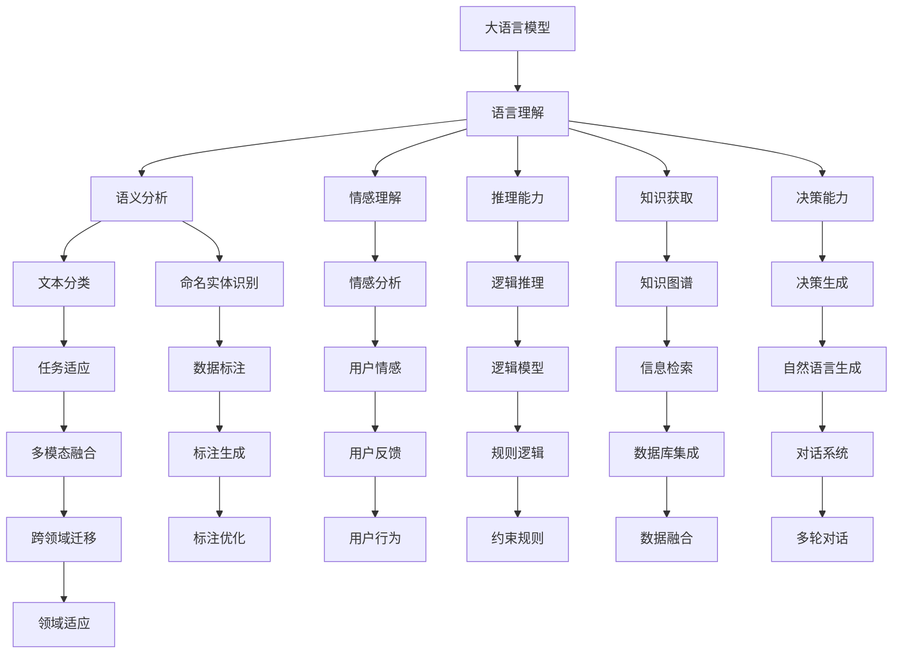

                 

# 语言≠思维：大模型的认知挑战

> 关键词：大语言模型,认知能力,语言与思维,自然语言处理(NLP),认知心理学,人工智能

## 1. 背景介绍

在人工智能和自然语言处理(NLP)领域，语言模型已经取得了令人瞩目的进展，无论是基于规则的模型还是基于深度学习的模型，都能够在理解自然语言的基础上，做出各种各样的预测和生成。然而，即使是最先进的语言模型，如GPT-3、BERT等，也无法完全匹配人类的认知能力和思维方式。本文将探讨大语言模型在认知能力方面的挑战，分析语言与思维的差异，并展望未来可能的发展趋势。

## 2. 核心概念与联系

### 2.1 核心概念概述

- **大语言模型**：大语言模型是利用大规模数据训练出的、能够理解并生成自然语言的深度神经网络模型。
- **认知能力**：认知能力是人类或动物思维和理解能力的一部分，包括记忆、学习、推理、判断等。
- **语言与思维**：语言是人类表达思维的工具，而思维则是语言背后的认知过程。

### 2.2 核心概念的联系

语言与思维密不可分，但语言并非思维的全部。大语言模型虽然在语言理解上取得了重大突破，但在某些认知能力上，如抽象思维、逻辑推理、情感理解等方面，仍然与人类存在显著差距。本节将通过Mermaid流程图来展示大语言模型在认知能力上的挑战和未来可能的发展方向。



通过以上流程图，我们可以看到大语言模型在各个认知能力上的挑战和潜在的改进方向。以下将深入探讨语言模型在认知能力上的局限性和可能的发展方向。

## 3. 核心算法原理 & 具体操作步骤
### 3.1 算法原理概述

大语言模型的认知能力主要体现在以下几个方面：

- **语义分析**：理解文本的语义，并能够根据语义进行分类、实体识别等任务。
- **情感理解**：分析文本的情感倾向，判断用户情感状态。
- **推理能力**：根据已知信息进行逻辑推理，生成合理的答案或建议。
- **知识获取**：通过学习大量数据获取知识，并进行推理和生成。
- **决策能力**：基于知识库和推理结果，进行决策生成，如生成对话回复等。

### 3.2 算法步骤详解

大语言模型的训练和微调过程可以分为以下几个步骤：

1. **数据准备**：收集训练数据，并进行数据预处理，如分词、标注等。
2. **模型训练**：利用大规模无标签数据进行预训练，学习语言知识。
3. **任务适配**：根据具体任务，添加相应的任务适配层，如分类层、实体识别层等。
4. **模型微调**：在少量有标签数据上进行微调，优化模型在特定任务上的性能。
5. **模型评估**：在测试集上评估模型性能，并根据评估结果进行必要的调整。

### 3.3 算法优缺点

**优点**：

- 通用性强，可以适应各种自然语言处理任务。
- 数据需求相对较少，可在小样本数据上进行高效微调。
- 具有很强的泛化能力，能够在未见过的数据上取得较好性能。

**缺点**：

- 认知能力有限，无法完全匹配人类思维。
- 缺乏常识推理能力，对非文本数据处理能力较弱。
- 存在偏见和错误，可能导致有害输出。

### 3.4 算法应用领域

大语言模型在以下领域有广泛应用：

- 文本分类和情感分析：将文本分类为不同类别，如新闻分类、商品评价情感分析等。
- 命名实体识别和关系抽取：识别文本中的实体和实体之间的关系。
- 机器翻译：将一种语言的文本翻译成另一种语言的文本。
- 对话系统：与用户进行自然语言交互，回答用户问题。
- 知识图谱和信息检索：构建和查询知识图谱，进行信息检索和知识推理。

## 4. 数学模型和公式 & 详细讲解

### 4.1 数学模型构建

大语言模型通常采用Transformer结构，其数学模型构建基于自回归或自编码的神经网络。以Transformer为例，其基本结构可以表示为：

$$
M_{\theta}(X) = \text{Encoder-Decoder}(X, \theta)
$$

其中，$M_{\theta}$ 为语言模型，$\theta$ 为模型参数，$X$ 为输入序列。

### 4.2 公式推导过程

对于自回归的Transformer模型，其公式推导如下：

$$
M_{\theta}(X) = \text{MultiHeadAttention}(X, \theta) \cdot W^O
$$

其中，$\text{MultiHeadAttention}$ 表示多头自注意力机制，$W^O$ 为线性输出层。

### 4.3 案例分析与讲解

以BERT为例，其数学模型推导如下：

$$
M_{\theta}(X) = \text{SelfAttention}(X, X, X, \theta) \cdot W^O
$$

其中，$\text{SelfAttention}$ 表示自注意力机制，$W^O$ 为线性输出层。

## 5. 项目实践：代码实例和详细解释说明

### 5.1 开发环境搭建

1. 安装Anaconda，创建虚拟环境，并激活。
2. 安装PyTorch、TensorFlow、Keras等深度学习框架。
3. 安装相关的NLP库，如NLTK、SpaCy、Gensim等。

### 5.2 源代码详细实现

以下是一个使用PyTorch实现BERT模型的示例代码：

```python
import torch
import torch.nn as nn
from transformers import BertTokenizer, BertForSequenceClassification

class BertClassifier(nn.Module):
    def __init__(self, num_labels=2):
        super(BertClassifier, self).__init__()
        self.num_labels = num_labels
        self.bert = BertForSequenceClassification.from_pretrained('bert-base-uncased', num_labels=num_labels)
        self.dropout = nn.Dropout(0.1)

    def forward(self, input_ids, attention_mask):
        logits = self.bert(input_ids, attention_mask=attention_mask)[0]
        logits = self.dropout(logits)
        return logits

tokenizer = BertTokenizer.from_pretrained('bert-base-uncased')
model = BertClassifier(num_labels=2)
```

### 5.3 代码解读与分析

代码中，`BertClassifier` 类继承自 `nn.Module`，定义了BERT模型的结构。`BertForSequenceClassification` 类用于加载预训练的BERT模型，并通过指定 `num_labels` 参数来适应不同的二分类任务。

### 5.4 运行结果展示

在训练数据上训练后，可以使用以下代码进行预测：

```python
input_ids = tokenizer.encode('Hello, world!')
attention_mask = [1] * len(input_ids)
logits = model(input_ids, attention_mask)
print(logits)
```

预测结果将输出一个2维张量，表示输入文本属于正类或负类的概率。

## 6. 实际应用场景

### 6.1 智能客服系统

智能客服系统通过大语言模型进行文本分类和实体识别，能够理解用户意图并快速提供答案，极大提升了客服效率和用户体验。

### 6.2 金融舆情监测

金融舆情监测系统通过大语言模型进行情感分析，能够实时监测金融市场的舆情变化，帮助金融机构及时做出应对决策。

### 6.3 个性化推荐系统

个性化推荐系统通过大语言模型进行用户画像生成和推荐文本生成，能够根据用户偏好生成个性化的推荐内容，提升用户体验。

### 6.4 未来应用展望

未来，大语言模型将在更多领域得到应用，如智慧医疗、智能家居、智能交通等，提升各行各业的智能化水平。同时，大语言模型的认知能力也将得到进一步提升，如增强推理能力、提升情感理解等。

## 7. 工具和资源推荐

### 7.1 学习资源推荐

1. 《深度学习基础》系列课程：涵盖深度学习基础、神经网络、卷积神经网络、循环神经网络等。
2. 《自然语言处理》课程：介绍自然语言处理的基本概念、模型和算法。
3. 《认知心理学》课程：介绍认知心理学的基础理论和应用。
4. 《Transformer原理与实践》系列博文：详细介绍Transformer模型的原理和实践。

### 7.2 开发工具推荐

1. PyTorch：开源深度学习框架，易于上手，适合研究和实验。
2. TensorFlow：Google开发的深度学习框架，功能强大，适合工程部署。
3. Keras：高层深度学习框架，易于使用，适合快速原型设计。

### 7.3 相关论文推荐

1. Attention is All You Need：介绍Transformer模型的基本原理和应用。
2. BERT: Pre-training of Deep Bidirectional Transformers for Language Understanding：提出BERT模型，并介绍其在语言理解任务上的应用。
3. Language Models are Unsupervised Multitask Learners：提出GPT-2模型，并介绍其零样本学习能力。

## 8. 总结：未来发展趋势与挑战

### 8.1 研究成果总结

大语言模型在自然语言处理领域取得了重大进展，但在认知能力上仍存在诸多挑战。未来，大语言模型将会在以下方面得到进一步提升：

- 增强推理能力：引入因果推断、图神经网络等技术，提升大语言模型的推理能力。
- 提升情感理解：通过引入情感分析、情绪识别等任务，提升大语言模型的情感理解能力。
- 提高常识推理：引入知识图谱、逻辑推理等技术，提升大语言模型的常识推理能力。

### 8.2 未来发展趋势

未来，大语言模型将会在以下几个方面得到进一步发展：

- 多模态融合：将文本、图像、语音等多模态数据进行融合，提升模型的综合处理能力。
- 持续学习：通过不断学习和适应新数据，提升模型的稳定性和通用性。
- 跨领域迁移：提升模型在不同领域之间的迁移能力，减少数据需求。

### 8.3 面临的挑战

大语言模型在发展过程中仍面临以下挑战：

- 数据需求：在实际应用中，大语言模型往往需要大量的数据进行微调，这增加了数据收集和标注的成本。
- 认知能力：大语言模型在认知能力上仍与人类存在显著差距，无法完全匹配人类的思维方式。
- 偏见和错误：大语言模型存在偏见和错误，可能导致有害输出，需要进一步改进。

### 8.4 研究展望

未来的研究将重点关注以下几个方向：

- 引入因果推断和图神经网络：增强模型的推理能力，提升决策的合理性和稳定性。
- 引入情感分析和学习：提升模型的情感理解能力，增强与用户的情感交互。
- 引入知识图谱和逻辑推理：提升模型的常识推理能力，增强知识获取和应用能力。

## 9. 附录：常见问题与解答

### 9.1 问题1：大语言模型是否能够完全替代人类思维？

答：目前的大语言模型还无法完全替代人类思维，因为人类的思维方式远比语言更为复杂和多样。大语言模型只能理解语言的形式和结构，而无法完全理解语言背后的文化和情感。

### 9.2 问题2：大语言模型在认知能力上的局限性有哪些？

答：大语言模型在认知能力上的局限性主要体现在以下几个方面：

- 推理能力：无法进行深层次的因果推理和逻辑推理。
- 情感理解：无法完全理解复杂的情感和情绪。
- 常识推理：缺乏对常识和常识推理的知识和经验。
- 知识获取：无法像人类一样从经验和教育中获取知识。

### 9.3 问题3：大语言模型在未来有哪些发展方向？

答：大语言模型未来的发展方向主要包括以下几个方面：

- 多模态融合：将文本、图像、语音等多模态数据进行融合，提升模型的综合处理能力。
- 持续学习：通过不断学习和适应新数据，提升模型的稳定性和通用性。
- 跨领域迁移：提升模型在不同领域之间的迁移能力，减少数据需求。

---

作者：禅与计算机程序设计艺术 / Zen and the Art of Computer Programming

