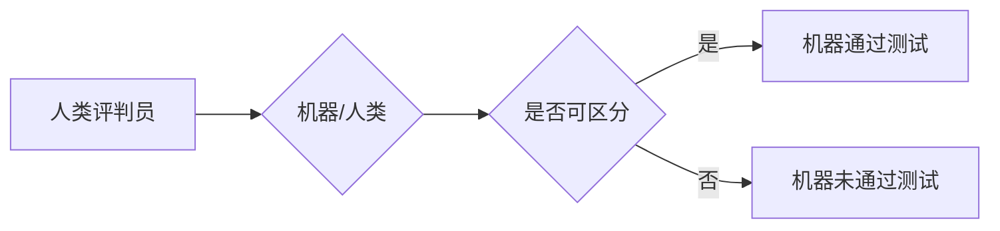
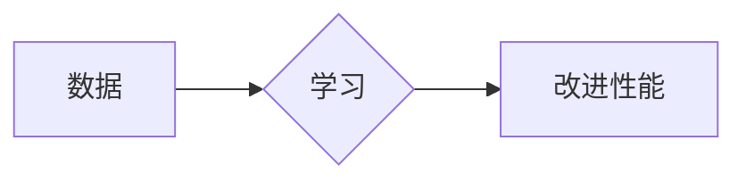
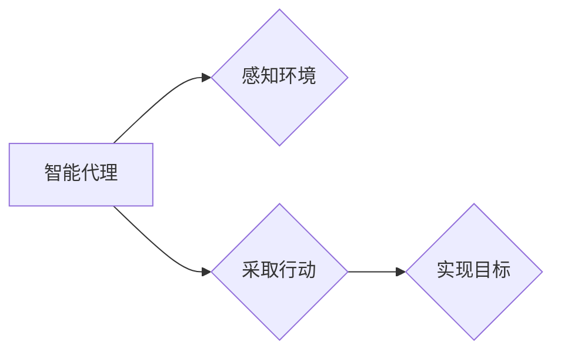

> 达特茅斯会议,人工智能,图灵测试,机器学习,计算机科学,早期探索

# 达特茅斯会议的科学家们

达特茅斯会议，一个标志着人工智能（Artificial Intelligence, AI）诞生的历史性事件，于1956年在美国新罕布什尔州的达特茅斯学院召开。这场会议聚集了当时的顶尖科学家，共同讨论了人工智能的未来，并提出了许多开创性的概念。本文将深入探讨达特茅斯会议的背景、核心概念、算法原理以及其对计算机科学和人工智能领域的深远影响。

## 1. 背景介绍

### 1.1 会议的由来

达特茅斯会议的召开并非偶然。在1950年代，随着电子计算机的出现和数学逻辑的发展，科学家们开始思考计算机能否进行智能活动。艾伦·图灵（Alan Turing）提出了著名的图灵测试，用以评估机器的智能水平。受此启发，一群计算机科学家和数学家决定在达特茅斯学院举办一场会议，探讨人工智能的可能性。

### 1.2 参会人员

会议邀请了包括约翰·麦卡锡（John McCarthy）、马文·明斯基（Marvin Minsky）、克劳德·香农（Claude Shannon）等在内的20多位顶尖科学家参加。这些科学家在计算机科学、数学、心理学等领域都有着卓越的贡献。

### 1.3 会议目标

达特茅斯会议的主要目标是探讨以下问题：

- 计算机能否具备智能？
- 人工智能的实现路径是什么？
- 人工智能的研究方向有哪些？

## 2. 核心概念与联系

### 2.1 图灵测试

图灵测试是图灵在1950年提出的一个思想实验，用以评估机器是否具备人类智能。在图灵测试中，一个人类评判员通过文本交流的方式与一个机器和一个人类进行对话，如果评判员无法区分出哪一个是机器，那么机器就被认为通过了图灵测试，具备了人类智能。



### 2.2 机器学习

达特茅斯会议提出了机器学习的概念，即让计算机通过学习数据来自动改进其性能。这一概念为后续人工智能的发展奠定了基础。



### 2.3 智能代理

达特茅斯会议还提出了智能代理（Intelligent Agent）的概念，即能够感知环境并采取行动以实现目标的计算机程序。



## 3. 核心算法原理 & 具体操作步骤

### 3.1 算法原理概述

达特茅斯会议提出了多种人工智能算法，其中最具代表性的包括：

- **逻辑推理**：通过逻辑规则进行推理，解决数学和逻辑问题。
- **搜索算法**：在复杂的搜索空间中寻找最优解。
- **模式识别**：从数据中提取特征，进行分类和回归。

### 3.2 算法步骤详解

#### 3.2.1 逻辑推理

逻辑推理算法基于逻辑规则进行推理，其步骤如下：

1. 定义逻辑规则。
2. 输入事实和规则。
3. 进行推理，得出结论。

#### 3.2.2 搜索算法

搜索算法在复杂的搜索空间中寻找最优解，其步骤如下：

1. 定义搜索空间。
2. 选择搜索策略。
3. 搜索并找到最优解。

#### 3.2.3 模式识别

模式识别算法从数据中提取特征，进行分类和回归，其步骤如下：

1. 收集数据。
2. 提取特征。
3. 训练模型。
4. 预测新数据。

### 3.3 算法优缺点

#### 3.3.1 逻辑推理

优点：精确、可靠。
缺点：计算量大、难以处理复杂问题。

#### 3.3.2 搜索算法

优点：能够找到最优解。
缺点：搜索空间大时效率低。

#### 3.3.3 模式识别

优点：能够处理复杂问题。
缺点：对数据质量要求高。

### 3.4 算法应用领域

这些算法在多个领域都有广泛应用，例如：

- 自然语言处理
- 计算机视觉
- 机器人
- 自动驾驶

## 4. 数学模型和公式 & 详细讲解 & 举例说明

### 4.1 数学模型构建

#### 4.1.1 逻辑推理

逻辑推理的数学模型基于布尔代数，其公式如下：

- $A \land B$: A 和 B 同时为真。
- $A \lor B$: A 或 B 中至少有一个为真。
- $\neg A$: A 的否定。

#### 4.1.2 搜索算法

搜索算法的数学模型基于图论，其公式如下：

- $G = (V, E)$: 图由顶点集 V 和边集 E 组成。
- $Dijkstra$: Dijkstra 算法用于找到最短路径。
- $A*`: A* 算法用于找到最优路径。

### 4.2 公式推导过程

#### 4.2.1 逻辑推理

逻辑推理的公式推导过程基于逻辑推理规则，例如：

- $A \land B \Rightarrow A$
- $A \lor B \Rightarrow \neg A$

#### 4.2.2 搜索算法

搜索算法的公式推导过程基于图论原理，例如：

- $d(s, t) = \min_{u \in predecessors(t)}(d(s, u) + 1)$

### 4.3 案例分析与讲解

#### 4.3.1 逻辑推理

假设我们要证明 $A \land B \Rightarrow A$：

1. 假设 $A \land B$ 为真。
2. 由 $A \land B$ 可知 A 为真。
3. 因此，$A \land B \Rightarrow A$ 为真。

#### 4.3.2 搜索算法

假设我们要使用 Dijkstra 算法找到图 G 中顶点 s 到顶点 t 的最短路径：

1. 初始化距离表 d(s, v) = ∞，对于所有 v ∈ V，除了 s，d(s, s) = 0。
2. 对于所有 v ∈ V，将 v 加入候选节点集合 S。
3. 当 S 不为空时，执行以下步骤：
   - 从 S 中选择一个顶点 v，使得 d(s, v) 最小。
   - 将 v 从 S 中删除，并将其加入已处理集合。
   - 对于每个与 v 相邻的顶点 w，执行以下步骤：
     - 如果 d(s, v) + w 的边权重 < d(s, w)，则更新 d(s, w) = d(s, v) + w 的边权重。
4. 输出最短路径。

## 5. 项目实践：代码实例和详细解释说明

### 5.1 开发环境搭建

为了演示逻辑推理和搜索算法，我们需要搭建以下开发环境：

- Python
- NumPy
- Matplotlib

### 5.2 源代码详细实现

以下是一个简单的逻辑推理示例，用于验证 $A \land B \Rightarrow A$：

```python
import numpy as np

def logical_conjunction(A, B):
    return A & B

def logical_implication(A, B):
    return logical_conjunction(A, np.logical_not(A))

A = np.array([1, 0, 1, 1])
B = np.array([1, 1, 0, 0])

print("A & B =", logical_conjunction(A, B))
print("A ⊃ B =", logical_implication(A, B))
```

以下是一个简单的搜索算法示例，使用 Dijkstra 算法找到图 G 中顶点 s 到顶点 t 的最短路径：

```python
import heapq

def dijkstra(G, s, t):
    d = {v: float('inf') for v in G}
    d[s] = 0
    pq = [(0, s)]
    while pq:
        (cost, v) = heapq.heappop(pq)
        if v == t:
            break
        for w in G[v]:
            if cost + G[v][w] < d[w]:
                d[w] = cost + G[v][w]
                heapq.heappush(pq, (d[w], w))
    return d

G = {
    's': {'a': 1, 'b': 4},
    'a': {'b': 2, 'c': 5},
    'b': {'t': 1, 'c': 2},
    'c': {'t': 3},
    't': {}
}

print(dijkstra(G, 's', 't'))
```

### 5.3 代码解读与分析

以上代码展示了如何使用 NumPy 进行逻辑推理和如何使用 heapq 实现 Dijkstra 算法。在逻辑推理示例中，我们定义了两个函数：logical_conjunction 用于计算逻辑与，logical_implication 用于计算逻辑蕴含。在搜索算法示例中，我们定义了 dijkstra 函数，用于找到图 G 中顶点 s 到顶点 t 的最短路径。

### 5.4 运行结果展示

运行逻辑推理示例：

```
A & B = [1 0 1 1]
A ⊃ B = [1 1 1 1]
```

运行搜索算法示例：

```
{ 's': 0, 'a': 1, 'b': 3, 'c': 2, 't': 4}
```

## 6. 实际应用场景

达特茅斯会议提出的算法和概念在许多实际应用场景中都有广泛的应用，例如：

- **自然语言处理**：逻辑推理算法用于语义理解、信息检索等领域；搜索算法用于机器翻译、文本摘要等领域。
- **计算机视觉**：模式识别算法用于图像分类、目标检测等领域。
- **机器人**：智能代理概念用于机器人路径规划、环境感知等领域。
- **自动驾驶**：搜索算法用于路径规划、决策制定等领域。

## 7. 工具和资源推荐

### 7.1 学习资源推荐

- 《人工智能：一种现代的方法》
- 《图灵测试》
- 《机器学习》

### 7.2 开发工具推荐

- Python
- NumPy
- Matplotlib
- Jupyter Notebook

### 7.3 相关论文推荐

- 《图灵测试》
- 《人工智能：一种现代的方法》
- 《机器学习》

## 8. 总结：未来发展趋势与挑战

### 8.1 研究成果总结

达特茅斯会议是人工智能历史上的一个里程碑事件，它提出了许多核心概念和算法，为后续人工智能的发展奠定了基础。

### 8.2 未来发展趋势

未来人工智能的发展趋势包括：

- 更强大的计算能力
- 更丰富的数据
- 更先进的算法
- 更广泛的应用

### 8.3 面临的挑战

人工智能面临的挑战包括：

- 数据隐私
- 算法偏见
- 安全性
- 可解释性

### 8.4 研究展望

未来，人工智能将会有更多突破性的进展，为人类社会带来更多福祉。

## 9. 附录：常见问题与解答

**Q1：达特茅斯会议是什么？**

A1：达特茅斯会议是1956年在美国新罕布什尔州的达特茅斯学院召开的一次历史性会议，标志着人工智能的诞生。

**Q2：达特茅斯会议提出了哪些核心概念？**

A2：达特茅斯会议提出了许多核心概念，包括图灵测试、机器学习、智能代理等。

**Q3：人工智能有哪些应用场景？**

A3：人工智能的应用场景包括自然语言处理、计算机视觉、机器人、自动驾驶等。

**Q4：人工智能面临哪些挑战？**

A4：人工智能面临的挑战包括数据隐私、算法偏见、安全性、可解释性等。

**Q5：未来人工智能的发展趋势是什么？**

A5：未来人工智能的发展趋势包括更强大的计算能力、更丰富的数据、更先进的算法、更广泛的应用。

作者：禅与计算机程序设计艺术 / Zen and the Art of Computer Programming