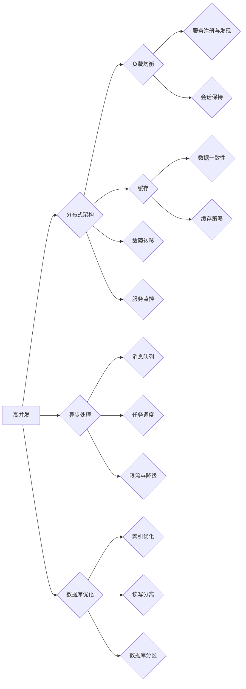

# 系统设计中的“三高”解决方案解析

> 关键词：高并发、高可用、高可用性、系统设计、架构设计、性能优化

## 1. 背景介绍

在当今互联网时代，系统设计面临着巨大的挑战。随着用户规模的扩大、业务场景的复杂化，系统需要处理的海量数据和高并发请求对系统架构和性能提出了更高的要求。在系统设计中，我们常常需要解决“三高”问题，即高并发（High Concurrency）、高可用（High Availability）和高可用性（High Reliability）。本文将深入解析“三高”解决方案的原理、方法和技术，帮助读者更好地理解如何在系统设计中实现“三高”。

## 2. 核心概念与联系

### 2.1 核心概念

#### 高并发（High Concurrency）

高并发是指系统能够同时处理大量用户请求的能力。在高并发场景下，系统需要高效地处理请求，保证用户体验和系统稳定性。

#### 高可用（High Availability）

高可用是指系统在长时间运行过程中，能够持续提供服务的能力。高可用系统通常具有故障转移、负载均衡等功能，以保证在发生故障时能够快速恢复。

#### 高可用性（High Reliability）

高可用性是指系统在长时间运行过程中，能够保持稳定运行的能力。高可用性系统不仅要求系统在发生故障时能够快速恢复，还要求系统在面对异常情况时能够自动调整，保持稳定运行。

### 2.2 架构的 Mermaid 流程图



图中展示了高并发系统设计中常见的架构组件及其相互关系。可以看到，高并发系统设计需要从多个维度进行优化，包括分布式架构、负载均衡、缓存、异步处理、数据库优化、故障转移、服务监控等。

## 3. 核心算法原理 & 具体操作步骤

### 3.1 算法原理概述

“三高”解决方案的核心原理在于对系统架构、资源和流程进行优化，以提高系统的并发能力、可用性和可靠性。

### 3.2 算法步骤详解

#### 高并发

1. **分布式架构**：将系统拆分为多个独立的模块，部署在多个服务器上，实现负载均衡和故障转移。
2. **负载均衡**：将请求分发到不同的服务器，提高系统并发处理能力。
3. **缓存**：使用缓存技术减少数据库访问，提高系统响应速度。
4. **异步处理**：将耗时的任务异步处理，提高系统并发处理能力。
5. **数据库优化**：优化数据库索引、读写分离、分区等，提高数据库性能。

#### 高可用

1. **故障转移**：在主节点发生故障时，自动切换到备用节点，保证服务持续可用。
2. **负载均衡**：通过负载均衡器分发请求，避免单点故障。
3. **服务监控**：实时监控系统状态，及时发现和处理故障。

#### 高可用性

1. **自动调整**：在系统发生异常时，自动调整资源配置和流程，保证系统稳定运行。
2. **限流与降级**：在系统负载过高时，限制请求量和降低服务质量，避免系统崩溃。
3. **数据一致性**：保证数据在不同节点之间的同步和一致性。

### 3.3 算法优缺点

#### 高并发

**优点**：

- 提高系统并发处理能力，满足大量用户请求。
- 提高系统性能，缩短用户响应时间。

**缺点**：

- 系统复杂度增加，开发和维护成本较高。
- 资源利用率可能降低。

#### 高可用

**优点**：

- 保证系统持续可用，提升用户体验。
- 降低系统故障带来的损失。

**缺点**：

- 系统成本增加，需要更多的硬件和软件资源。
- 系统设计难度加大。

#### 高可用性

**优点**：

- 提高系统稳定性和可靠性。
- 降低系统故障带来的损失。

**缺点**：

- 系统复杂度增加，开发和维护成本较高。
- 可能会牺牲部分性能。

### 3.4 算法应用领域

“三高”解决方案在以下领域具有广泛的应用：

- 在线支付系统
- 社交媒体平台
- 电子商务网站
- 在线教育平台
- 企业级应用

## 4. 数学模型和公式 & 详细讲解 & 举例说明

### 4.1 数学模型构建

为了量化评估系统的并发能力、可用性和可靠性，我们可以构建以下数学模型：

#### 并发能力

$$
C = \frac{U}{P}
$$

其中，$C$ 为并发能力，$U$ 为系统资源总量，$P$ 为系统资源分配比例。

#### 可用性

$$
A = 1 - \frac{D}{T}
$$

其中，$A$ 为可用性，$D$ 为系统故障时间，$T$ 为系统运行时间。

#### 可靠性

$$
R = 1 - F(t)
$$

其中，$R$ 为可靠性，$F(t)$ 为系统在时间 $t$ 内发生故障的概率。

### 4.2 公式推导过程

#### 并发能力

并发能力是指在单位时间内系统能够处理的请求数量。假设系统资源总量为 $U$，资源分配比例为 $P$，则并发能力 $C$ 可以表示为：

$$
C = \frac{U}{P}
$$

#### 可用性

可用性是指在长时间运行过程中，系统能够持续提供服务的能力。假设系统故障时间为 $D$，运行时间为 $T$，则可用性 $A$ 可以表示为：

$$
A = 1 - \frac{D}{T}
$$

#### 可靠性

可靠性是指在长时间运行过程中，系统保持稳定运行的能力。假设系统在时间 $t$ 内发生故障的概率为 $F(t)$，则可靠性 $R$ 可以表示为：

$$
R = 1 - F(t)
$$

### 4.3 案例分析与讲解

以下以电商网站为例，分析“三高”解决方案的应用。

#### 高并发

假设电商网站需要处理每天数百万的订单，每秒需要处理数百至上千个订单。为了满足高并发需求，我们可以采用以下策略：

- **分布式架构**：将系统拆分为多个独立的模块，部署在多个服务器上，实现负载均衡和故障转移。
- **负载均衡**：使用负载均衡器将请求分发到不同的服务器，提高系统并发处理能力。
- **缓存**：使用缓存技术减少数据库访问，提高系统响应速度。
- **异步处理**：将耗时的任务异步处理，提高系统并发处理能力。

#### 高可用

为了确保电商网站的高可用性，我们可以采用以下策略：

- **故障转移**：在主节点发生故障时，自动切换到备用节点，保证服务持续可用。
- **负载均衡**：通过负载均衡器分发请求，避免单点故障。
- **服务监控**：实时监控系统状态，及时发现和处理故障。

#### 高可用性

为了提高电商网站的可信度，我们可以采用以下策略：

- **自动调整**：在系统发生异常时，自动调整资源配置和流程，保证系统稳定运行。
- **限流与降级**：在系统负载过高时，限制请求量和降低服务质量，避免系统崩溃。
- **数据一致性**：保证数据在不同节点之间的同步和一致性。

## 5. 项目实践：代码实例和详细解释说明

### 5.1 开发环境搭建

本节以使用Java和Spring Boot框架实现一个简单的电商网站为例，介绍如何在高并发、高可用和高可用性方面进行系统设计。

1. 创建Spring Boot项目。
2. 添加相关依赖，如Spring Web、Spring Security、MyBatis等。
3. 设计系统架构，包括服务层、业务层、数据访问层等。

### 5.2 源代码详细实现

以下为电商网站的简单实现代码：

```java
@RestController
@RequestMapping("/order")
public class OrderController {

    @Autowired
    private OrderService orderService;

    @PostMapping("/create")
    public ResponseEntity<String> createOrder(@RequestBody OrderRequest request) {
        // 创建订单逻辑
        orderService.createOrder(request);
        return ResponseEntity.ok("Order created successfully");
    }
}
```

### 5.3 代码解读与分析

以上代码展示了电商网站订单创建功能的实现。在实现过程中，我们关注以下方面：

- **服务层**：负责业务逻辑处理，如创建订单、支付订单等。
- **业务层**：负责数据访问层和表示层的交互，如从数据库获取订单信息、将订单信息转换为JSON格式等。
- **数据访问层**：负责与数据库进行交互，如查询订单信息、插入订单数据等。

### 5.4 运行结果展示

在实际部署过程中，我们可以使用JMeter等工具对电商网站进行压力测试，评估其在高并发、高可用和高可用性方面的表现。

## 6. 实际应用场景

“三高”解决方案在以下实际应用场景中具有重要作用：

- **在线支付系统**：保证高并发交易处理能力，确保支付过程稳定可靠。
- **社交媒体平台**：保证高并发用户访问，确保平台稳定运行。
- **电子商务网站**：保证高并发订单处理能力，确保用户购物体验。
- **在线教育平台**：保证高并发课程访问和在线直播，确保教学效果。
- **企业级应用**：保证系统稳定运行，确保企业业务连续性。

## 7. 工具和资源推荐

### 7.1 学习资源推荐

1. 《大型网站技术架构》
2. 《微服务设计》
3. 《高并发编程实战》
4. 《分布式系统原理与范型》

### 7.2 开发工具推荐

1. JMeter：用于进行性能测试。
2. Docker：用于容器化部署。
3. Kubernetes：用于容器编排。
4. Prometheus：用于监控系统指标。
5. Grafana：用于监控数据可视化。

### 7.3 相关论文推荐

1. "The Design of the UNIX Operating System"
2. "Patterns of Enterprise Application Architecture"
3. "Large-Scale Distributed Systems: Principles and Paradigms"
4. "Designing Data-Intensive Applications"
5. "The Art of Multiprocessor Programming"

## 8. 总结：未来发展趋势与挑战

### 8.1 研究成果总结

本文深入解析了系统设计中的“三高”解决方案，从核心概念、算法原理、具体步骤、数学模型等多个角度进行了全面阐述。通过案例分析，展示了“三高”解决方案在实际应用中的重要作用。

### 8.2 未来发展趋势

随着云计算、大数据、人工智能等技术的不断发展，系统设计将呈现以下趋势：

1. **云原生应用**：基于容器和微服务架构，实现高并发、高可用和高可用的云原生应用。
2. **边缘计算**：将计算能力下沉到边缘，降低网络延迟，提高系统响应速度。
3. **人工智能辅助**：利用人工智能技术优化系统架构、资源和流程，提高系统性能和可靠性。

### 8.3 面临的挑战

在实现“三高”解决方案的过程中，我们将面临以下挑战：

1. **系统复杂度**：随着系统规模的扩大，系统复杂度将不断提高，开发和维护成本也随之增加。
2. **资源瓶颈**：随着用户规模的扩大，系统资源将面临瓶颈，需要不断升级硬件和软件资源。
3. **安全性**：系统在处理海量数据时，面临着数据安全、隐私保护等挑战。

### 8.4 研究展望

未来，我们将继续关注以下研究方向：

1. **自动化系统设计**：利用人工智能技术实现自动化系统设计，降低开发和维护成本。
2. **绿色计算**：降低系统能耗，实现可持续发展。
3. **安全可靠**：提高系统安全性，保障用户数据安全。

## 9. 附录：常见问题与解答

**Q1：什么是微服务架构？**

A：微服务架构是一种将系统拆分为多个独立的、轻量级的服务的架构风格。每个微服务负责处理特定功能，独立部署和维护，通过API进行交互。

**Q2：什么是容器化技术？**

A：容器化技术是一种轻量级的虚拟化技术，可以将应用程序及其运行环境打包成一个容器，实现快速部署、隔离和扩展。

**Q3：什么是服务网格？**

A：服务网格是一种用于服务间通信的中间件基础设施，负责处理服务发现、负载均衡、熔断、限流等任务，提高服务间通信的效率。

**Q4：什么是分布式事务？**

A：分布式事务是指在分布式系统中，对多个数据源进行操作的事务。分布式事务需要保证原子性、一致性、隔离性和持久性。

**Q5：什么是负载均衡？**

A：负载均衡是指将请求分发到多个服务器上，以提高系统并发处理能力和可用性。

**Q6：什么是缓存？**

A：缓存是一种将数据存储在内存中，以便快速访问的技术。缓存可以减少数据库访问，提高系统响应速度。

**Q7：什么是限流与降级？**

A：限流是指限制请求的频率，防止系统过载。降级是指在系统负载过高时，降低服务质量，保证系统稳定运行。

**Q8：什么是故障转移？**

A：故障转移是指当主节点发生故障时，自动切换到备用节点，保证服务持续可用。

**Q9：什么是服务监控？**

A：服务监控是指实时监控系统状态，及时发现和处理故障。

**Q10：什么是数据一致性？**

A：数据一致性是指数据在不同节点之间的同步和一致性。

作者：禅与计算机程序设计艺术 / Zen and the Art of Computer Programming