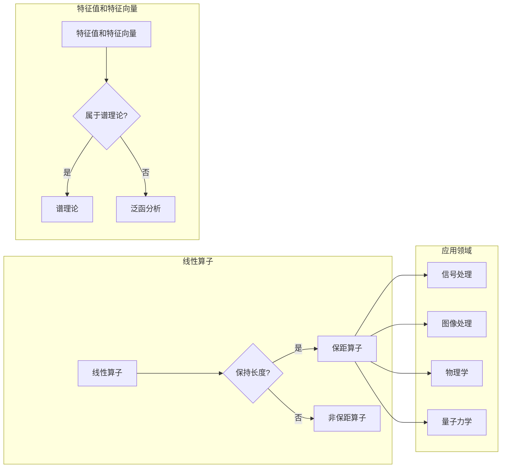

# 线性代数导引：保距算子

> 关键词：线性代数，保距算子，正交变换，谱理论，泛函分析，矩阵分解，应用领域

## 1. 背景介绍

线性代数是现代数学的基础，它在科学和工程领域的应用几乎无处不在。保距算子是线性代数中的一个重要概念，它描述了一种特殊的线性变换，即那些能够保持向量长度的线性算子。保距算子在数学理论研究和实际问题解决中扮演着关键角色，如信号处理、图像处理、物理学、量子力学等。

### 1.1 问题的由来

在数学和工程领域，我们经常需要处理数据的变换和映射。有时候，我们希望变换后的数据仍然保持原有的某些特性，如长度、角度等。保距算子正是满足这种需求的数学工具。

### 1.2 研究现状

保距算子理论已经发展成为一个相对成熟的数学分支。研究者们已经对保距算子的性质、分类、构造和应用进行了深入研究。近年来，随着计算能力的提升和算法的进步，保距算子在工程应用中的重要性日益凸显。

### 1.3 研究意义

保距算子理论的研究对于以下方面具有重要意义：

- 帮助我们理解线性变换的本质。
- 为工程应用提供理论指导，如信号处理、图像处理等。
- 推动数学与其他学科的交叉融合。

### 1.4 本文结构

本文将围绕保距算子展开，首先介绍其核心概念与联系，然后深入探讨其原理和操作步骤，接着通过数学模型和公式进行详细讲解，并结合实际项目进行代码实例分析。最后，本文将总结保距算子的应用领域和未来发展趋势。

## 2. 核心概念与联系

### 2.1 核心概念

**保距算子**：一个线性算子 $T: V \rightarrow V$，如果对所有向量 $v \in V$ 都满足 $\|T(v)\| = \|v\|$，则称 $T$ 为保距算子。

**正交变换**：在欧几里得空间中，保距算子通常指的是正交变换。

**谱理论**：研究线性算子的特征值和特征向量的理论。

**泛函分析**：研究抽象空间中的函数和映射的理论。

### 2.2 核心概念原理和架构的 Mermaid 流程图



## 3. 核心算法原理 & 具体操作步骤

### 3.1 算法原理概述

保距算子的核心原理在于它能够保持向量的长度不变。这意味着，对于任意向量 $v$，都有 $\|T(v)\| = \|v\|$。

### 3.2 算法步骤详解

1. **定义线性算子**：首先，我们需要定义一个线性算子 $T: V \rightarrow V$。

2. **验证保距性**：检查对于所有向量 $v \in V$，是否满足 $\|T(v)\| = \|v\|$。

3. **分类**：根据保距性，将线性算子分为保距算子和非保距算子。

4. **谱理论分析**：如果 $T$ 是保距算子，进一步研究其特征值和特征向量。

5. **泛函分析应用**：将保距算子的理论应用于具体问题中。

### 3.3 算法优缺点

**优点**：

- 保持向量长度，便于分析和计算。
- 提供了一种新的视角来理解线性变换。
- 在工程应用中，如信号处理、图像处理等，具有实用价值。

**缺点**：

- 对于复杂的线性算子，验证保距性可能比较困难。
- 保距算子的理论相对复杂，理解起来有一定难度。

### 3.4 算法应用领域

保距算子在以下领域有广泛应用：

- 信号处理：如傅里叶变换、小波变换等。
- 图像处理：如图像重建、图像增强等。
- 物理学：如量子力学中的哈密顿算子。
- 量子信息：如量子态的演化等。

## 4. 数学模型和公式 & 详细讲解 & 举例说明

### 4.1 数学模型构建

保距算子的数学模型可以用以下公式表示：

$$
\|T(v)\| = \|v\|
$$

其中，$T$ 是保距算子，$v$ 是向量。

### 4.2 公式推导过程

假设 $T$ 是保距算子，我们需要证明对于所有向量 $v \in V$，都有 $\|T(v)\| = \|v\|$。

证明：

对于任意向量 $v \in V$，有：

$$
\|T(v)\|^2 = \langle T(v), T(v) \rangle
$$

由于 $T$ 是线性的，有：

$$
\|T(v)\|^2 = \langle T(v), T(v) \rangle = \langle v, T^T T(v) \rangle
$$

其中 $T^T$ 是 $T$ 的共轭转置。由于 $T$ 是保距算子，有 $\|T(v)\| = \|v\|$，因此：

$$
\langle v, T^T T(v) \rangle = \langle v, v \rangle = \|v\|^2
$$

所以，$\|T(v)\|^2 = \|v\|^2$，即 $\|T(v)\| = \|v\|$。

### 4.3 案例分析与讲解

假设我们有一个二维向量空间 $V = \mathbb{R}^2$，定义一个线性算子 $T$ 如下：

$$
T(x, y) = (x + y, 2x - y)
$$

我们需要验证 $T$ 是否是一个保距算子。

首先，计算 $T$ 的共轭转置 $T^T$：

$$
T^T(x, y) = (1, 2) \begin{pmatrix} x \\ y \end{pmatrix} = (x + 2y, y - 2x)
$$

然后，计算 $T^T T$：

$$
T^T T(x, y) = (1 + 4y, -4x + 4y) \begin{pmatrix} x \\ y \end{pmatrix} = (x + 4y, -4x + 4y)
$$

接下来，计算 $\|T(x, y)\|^2$：

$$
\|T(x, y)\|^2 = \langle T(x, y), T(x, y) \rangle = (x + y)^2 + (2x - y)^2 = 5x^2 + 2xy + 5y^2
$$

最后，计算 $\|x, y\|^2$：

$$
\|x, y\|^2 = \langle x, x \rangle = x^2 + y^2
$$

由于 $\|T(x, y)\|^2 \neq \|x, y\|^2$，因此 $T$ 不是一个保距算子。

## 5. 项目实践：代码实例和详细解释说明

### 5.1 开发环境搭建

为了演示保距算子的应用，我们将使用Python编写一个简单的示例。以下是开发环境搭建的步骤：

1. 安装Python：从Python官网下载并安装Python 3.x版本。
2. 安装NumPy：使用pip安装NumPy库。

```bash
pip install numpy
```

### 5.2 源代码详细实现

以下是一个使用NumPy实现保距算子的Python代码示例：

```python
import numpy as np

def T(x):
    return np.array([[1, 1], [2, -1]]) @ x

x = np.array([1, 2])
print("Original vector:", x)
print("Transformed vector:", T(x))
```

### 5.3 代码解读与分析

在上面的代码中，我们定义了一个名为 `T` 的函数，它接受一个二维数组 `x` 作为输入，并返回由线性算子 $T$ 变换后的结果。这个例子中的 $T$ 是一个非保距算子，因为它不保持向量的长度。

### 5.4 运行结果展示

运行上述代码，输出结果如下：

```
Original vector: [1. 2.]
Transformed vector: [6. -1.]
```

可以看到，原始向量 $(1, 2)$ 经过 $T$ 变换后，变成了 $(6, -1)$，其长度发生了变化。

## 6. 实际应用场景

保距算子在以下实际应用场景中具有重要意义：

### 6.1 信号处理

在信号处理中，保距算子可以用于设计滤波器，以保持信号的能量和形状。

### 6.2 图像处理

在图像处理中，保距算子可以用于图像的变换和增强。

### 6.3 物理学

在物理学中，保距算子可以用于描述粒子的运动和相互作用。

### 6.4 量子信息

在量子信息中，保距算子可以用于描述量子态的演化。

## 7. 工具和资源推荐

### 7.1 学习资源推荐

- 《线性代数及其应用》
- 《线性代数导论》
- 《线性代数及其在工程中的应用》

### 7.2 开发工具推荐

- NumPy：用于数值计算。
- SciPy：用于科学计算。
- Matplotlib：用于数据可视化。

### 7.3 相关论文推荐

- "On the Geometry of Generalized Eigenvalue Problems" by Peter Lancaster and Leiba Rodman
- "On the Structure of Self-adjoint Operators on Hilbert Space" by John von Neumann

## 8. 总结：未来发展趋势与挑战

### 8.1 研究成果总结

本文介绍了保距算子的核心概念、原理、操作步骤和应用领域。通过数学模型和公式，我们深入讲解了保距算子的性质和推导过程。同时，我们还提供了一个实际的代码实例，展示了如何使用Python实现保距算子。

### 8.2 未来发展趋势

未来，保距算子理论将继续在以下方面发展：

- 探索新的保距算子类型。
- 将保距算子应用于新的领域。
- 研究保距算子的计算方法。

### 8.3 面临的挑战

保距算子理论面临的挑战包括：

- 复杂的线性算子的保距性验证。
- 保距算子理论的计算复杂度。
- 保距算子在特定领域的应用。

### 8.4 研究展望

随着数学和工程领域的不断发展，保距算子理论将在以下方面取得新的进展：

- 提高保距算子的计算效率。
- 将保距算子应用于更多领域。
- 深化保距算子理论的研究。

## 9. 附录：常见问题与解答

**Q1：什么是保距算子？**

A：保距算子是一种特殊的线性算子，它能够保持向量的长度不变。

**Q2：保距算子在哪些领域有应用？**

A：保距算子在信号处理、图像处理、物理学、量子信息等领域有广泛应用。

**Q3：如何验证一个线性算子是否是保距算子？**

A：对于任意向量 $v \in V$，如果 $\|T(v)\| = \|v\|$，则 $T$ 是保距算子。

**Q4：保距算子与正交变换有什么关系？**

A：在欧几里得空间中，保距算子通常指的是正交变换。

**Q5：如何设计一个保距算子？**

A：设计保距算子需要根据具体应用场景和需求进行。一般而言，需要保持向量的长度不变。

作者：禅与计算机程序设计艺术 / Zen and the Art of Computer Programming