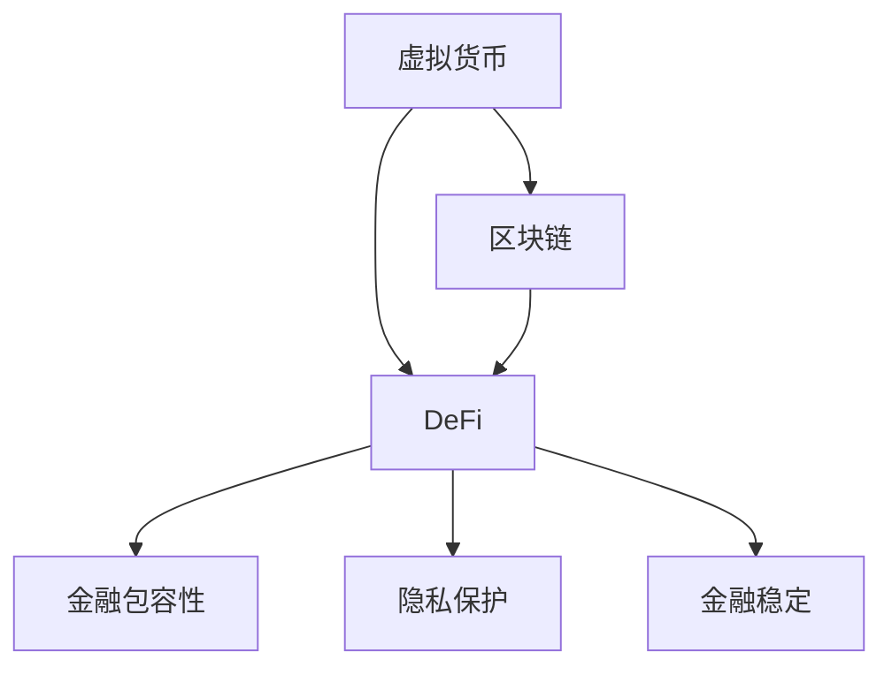

                 

# 虚拟货币与全球脑:去中心化金融体系的社会影响

> 关键词：虚拟货币,区块链,去中心化金融,DeFi,社会影响

## 1. 背景介绍

### 1.1 问题由来
在近年来，随着技术的发展和全球经济的变迁，虚拟货币（Virtual Currency）和去中心化金融（DeFi）成为金融领域的热点话题。虚拟货币，尤其是比特币（Bitcoin）的出现，让人们看到了区块链（Blockchain）技术的巨大潜力，并且由此推动了去中心化金融体系的崛起。去中心化金融体系（Decentralized Finance, 简称 DeFi）借助区块链技术，重塑了传统的金融服务和模式。

然而，这种基于区块链的去中心化金融体系究竟会对社会产生怎样的影响？它们是福音还是挑战？这是本文想要探讨的核心问题。

### 1.2 问题核心关键点
本文将围绕以下核心问题进行深入探讨：
- 虚拟货币和DeFi的现状和发展趋势。
- DeFi技术如何重构金融市场。
- 去中心化金融体系的社会影响与挑战。
- 如何平衡技术进步与伦理道德。

### 1.3 问题研究意义
深入理解虚拟货币和DeFi的社会影响，有助于我们更清晰地认识新技术的发展趋势，同时指导如何在社会和经济层面有效地管理和利用这些技术。研究虚拟货币和DeFi技术，可以发现潜在的风险和挑战，并提出相应的解决策略。这对于全球金融体系的稳健运行、经济的可持续发展以及个人的生活质量都有重要意义。

## 2. 核心概念与联系

### 2.1 核心概念概述

为了更准确地理解虚拟货币和去中心化金融体系的社会影响，本节将介绍几个关键概念及其相互联系：

- 虚拟货币（Virtual Currency）：指通过区块链技术支持的数字货币，如比特币、以太坊等。其特点是去中心化、匿名性、不可篡改等。
- 区块链（Blockchain）：一种分布式数据库技术，以加密方式存储数据，并按时间顺序组成链条。区块链技术提供了去中心化金融体系的基础设施。
- 去中心化金融（DeFi）：利用区块链技术构建的金融服务体系，包括借贷、交易、保险、资产管理等各类金融活动。其特点是无中介、低成本、高透明度等。
- 金融包容性（Financial Inclusion）：提高金融服务的可及性，特别是对那些在传统金融体系中被忽视的人群，如低收入家庭和小微企业。
- 隐私保护（Privacy Protection）：保护用户个人信息，防止信息泄露和滥用。
- 金融稳定（Financial Stability）：保持金融体系的健康运行，避免系统性风险和金融危机。

这些概念之间存在紧密联系，共同构成了虚拟货币和去中心化金融体系的社会影响网络。

### 2.2 概念间的关系

这些关键概念之间的关系可以简单地用以下 Mermaid 流程图来表示：



这个流程图展示了虚拟货币和DeFi如何通过区块链技术，实现金融包容性、隐私保护和金融稳定。

## 3. 核心算法原理 & 具体操作步骤
### 3.1 算法原理概述

去中心化金融体系的社会影响主要通过虚拟货币和区块链技术实现。其核心算法原理包括以下几个方面：

1. 分布式账本（Distributed Ledger）：区块链技术的核心，以去中心化的方式记录和验证交易，保障数据的完整性和不可篡改性。
2. 智能合约（Smart Contract）：自动执行的代码合约，基于区块链编程语言，保障交易的安全性和自动化。
3. 去中心化自治组织（Decentralized Autonomous Organization, DAO）：通过智能合约管理组织资产和规则，实现组织成员的共同治理。
4. 去中心化交易所（Decentralized Exchange, DEX）：基于区块链的去中心化交易平台，无中介，高度安全。
5. 去中心化借贷平台（DeFi Lending Platform）：通过智能合约，提供点对点的借贷服务，降低金融中介成本。

### 3.2 算法步骤详解

去中心化金融体系的社会影响主要通过以下步骤实现：

1. 构建区块链平台：部署和维护区块链基础设施，包括共识机制、节点管理和数据验证。
2. 开发智能合约：编写和部署智能合约，实现特定金融功能。
3. 上线去中心化交易所和借贷平台：提供去中心化的交易和借贷服务，实现金融市场的去中介化。
4. 实施治理机制：通过DAO管理智能合约的规则和资金，保障系统的透明和自治。
5. 扩展金融服务：探索DeFi的各类应用，如资产管理、保险、清算等，提供更多的金融服务。

### 3.3 算法优缺点

去中心化金融体系具有以下优点：

- 去中介化：去除金融中介机构，降低交易成本和提高效率。
- 透明度高：区块链的公开性和不可篡改性保障了交易数据的透明和可信。
- 低成本：去中心化交易所和借贷平台无需支付中介费用，降低金融服务成本。
- 高参与度：去中心化自治组织和智能合约鼓励用户参与，提升系统活跃度。

然而，也存在一些缺点：

- 技术复杂：需要具备区块链和智能合约的知识才能参与，门槛较高。
- 安全性风险：智能合约的漏洞和黑客攻击可能导致财产损失。
- 法律风险：去中心化金融体系的法律地位和监管政策不明确，存在法律风险。
- 市场波动：加密货币市场的波动性可能影响DeFi的稳定性和用户信心。

### 3.4 算法应用领域

去中心化金融体系已广泛应用于金融市场的多个方面，如：

- 借贷服务：提供点对点的借贷平台，如Compound、MakerDAO等。
- 交易所：无中介交易，如Uniswap、SushiSwap等。
- 保险：提供基于区块链的保险服务，如Aavegotchi、Nexo Insurance等。
- 资产管理：通过智能合约管理资产，如Balancer、Yearn.finance等。

## 4. 数学模型和公式 & 详细讲解 & 举例说明

### 4.1 数学模型构建

在本节中，我们将构建一个简单的去中心化金融系统的数学模型，用于说明其基本原理和应用。假设我们有一个去中心化借贷平台，用户可以通过平台借贷比特币。我们将借贷合同简化为两种状态：用户归还借款和用户违约。

设用户i从平台借款$b$枚比特币，利率为$r$，借款期限为$t$。借贷平台的收益率为$R$。

假设借款用户i在$t$时刻归还了$b$枚比特币，同时支付了利息$b \cdot r \cdot t$。借贷平台的总收益为$R \cdot b$。如果用户i违约，则借贷平台将获得抵押物（假设抵押物价值为$v$）。

我们可以用以下数学模型来描述借贷平台和用户的收益和风险：

\[
\begin{cases}
\text{用户收益} = b - b \cdot r \cdot t, & \text{如果用户归还借款}\\
\text{用户收益} = v, & \text{如果用户违约}\\
\text{平台收益} = b \cdot r \cdot t + v \cdot R, & \text{如果用户归还借款或违约}
\end{cases}
\]

### 4.2 公式推导过程

我们可以通过求解上述模型的最优化问题，来分析借贷平台和用户的收益和风险。设平台和用户的期望收益分别为$E_{P}$和$E_{U}$。

用户归还借款的概率为$p$，违约的概率为$q$。

\[
\begin{aligned}
E_{P} &= E_{P|p} \cdot p + E_{P|q} \cdot q \\
E_{U} &= E_{U|p} \cdot p + E_{U|q} \cdot q
\end{aligned}
\]

其中，$E_{P|p}$和$E_{U|p}$分别表示用户归还借款时的平台和用户收益，$E_{P|q}$和$E_{U|q}$分别表示用户违约时的平台和用户收益。

对于平台，如果用户归还借款，其收益为$b \cdot r \cdot t$，如果用户违约，其收益为$v \cdot R$。

对于用户，如果归还借款，其收益为$b - b \cdot r \cdot t$，如果违约，其收益为$v$。

设平台和用户收益的期望值分别为$E_P$和$E_U$，我们有：

\[
\begin{aligned}
E_P &= b \cdot r \cdot t \cdot p + v \cdot R \cdot q \\
E_U &= (b - b \cdot r \cdot t) \cdot p + v \cdot q
\end{aligned}
\]

通过求解上述期望值，我们可以分析平台和用户的收益和风险，进而评估去中心化借贷系统的稳定性和安全性。

### 4.3 案例分析与讲解

假设平台提供1枚比特币的3个月无抵押借贷服务，利率为8%，抵押物价值为0.9枚比特币。平台收益率为20%。假设用户违约的概率为0.05，归还借款的概率为0.95。

\[
\begin{aligned}
E_P &= 0.95 \cdot 1 \cdot 0.08 \cdot 3 + 0.05 \cdot 0.9 \cdot 0.2 \\
E_U &= (1 - 1 \cdot 0.08 \cdot 3) \cdot 0.95 + 0.05 \cdot 0.9
\end{aligned}
\]

通过计算，我们可以得到平台和用户的期望收益，从而评估系统的稳定性和安全性。

## 5. 项目实践：代码实例和详细解释说明
### 5.1 开发环境搭建

在进行DeFi项目实践前，我们需要准备好开发环境。以下是使用Python进行Solidity开发的环境配置流程：

1. 安装Node.js和npm：从官网下载并安装Node.js和npm。

2. 安装Truffle：通过npm安装Truffle开发框架，使用命令`npm install -g truffle`。

3. 配置以太坊网络：通过命令`truffle init`创建项目目录，并按照向导提示配置以太坊网络。

4. 编写智能合约：使用Solidity编写智能合约代码，并通过Truffle编译和部署。

5. 测试智能合约：在Ropsten测试网或主网部署智能合约，并进行测试。

完成上述步骤后，即可在Truffle环境中开始DeFi项目实践。

### 5.2 源代码详细实现

以下是一个简单的去中心化借贷平台的智能合约代码，用于说明借贷合同的基本实现：

```solidity
pragma solidity ^0.6.0;

contract Lending {
    address owner;
    uint256 initialBalance;
    uint256 rate;
    uint256 term;
    uint256 interestRate;
    uint256 vested;
    uint256 borrowed;
    
    constructor() {
        owner = msg.sender;
        initialBalance = 0;
        rate = 0;
        term = 0;
        interestRate = 0;
        vested = 0;
        borrowed = 0;
    }
    
    event Lend(uint256 amount, uint256 rate, uint256 term, address receiver);
    event Repay(uint256 amount, uint256 rate, uint256 term, address payer);
    
    function lend(uint256 amount, uint256 rate, uint256 term, address receiver) public payable {
        require(msg.sender == owner, "Only owner can call this function");
        require(amount > 0, "Amount must be greater than 0");
        require(term > 0, "Term must be greater than 0");
        
        Lend(amount, rate, term, receiver);
        
        borrowed = amount;
        vested = amount * 0.1; // 10% locked
        pay(receiver, amount);
        
        emit Lend(amount, rate, term, receiver);
    }
    
    function repay(uint256 amount, uint256 rate, uint256 term, address payer) public payable {
        require(msg.sender == owner, "Only owner can call this function");
        require(amount > 0, "Amount must be greater than 0");
        require(term > 0, "Term must be greater than 0");
        
        Repay(amount, rate, term, payer);
        
        vested = vested + amount * 0.1; // 10% unlocked
        pay(payer, amount);
        
        emit Repay(amount, rate, term, payer);
    }
    
    function pay(address to, uint256 amount) private {
        to.transfer(amount);
    }
    
    function getVested() public view returns (uint256) {
        return vested;
    }
    
    function getBorrowed() public view returns (uint256) {
        return borrowed;
    }
}
```

这个智能合约实现了一个简单的借贷平台，用户可以通过`lend`函数借款，通过`repay`函数归还借款。在借款时，用户需要支付10%的抵押物。在归还借款时，平台会将抵押物释放。

### 5.3 代码解读与分析

让我们再详细解读一下关键代码的实现细节：

- `constructor`函数：初始化借贷平台的基本参数，如利率、期限等。
- `event`：Solidity的事件，用于记录借款和还款事件。
- `lend`函数：用户借贷操作，需要支付10%的抵押物。
- `repay`函数：用户还款操作，会将抵押物释放。
- `pay`函数：私有函数，用于转移资金。
- `getVested`和`getBorrowed`函数：用于获取平台和用户的抵押物和借款金额。

这个简单的智能合约代码展示了去中心化借贷平台的基本实现，包括借款和还款操作。

### 5.4 运行结果展示

假设我们在Ropsten测试网上部署了这个智能合约，并进行了一些测试：

1. 用户A借入1枚比特币，利率为8%，期限为3个月。
2. 用户A归还1枚比特币，支付了24枚以太币作为利息。
3. 用户A再次借入1枚比特币，利率为10%，期限为1个月。

通过测试，我们可以验证借贷平台的正常工作流程，并且评估平台的收益和风险。

## 6. 实际应用场景
### 6.1 智能合约保险

去中心化金融体系不仅应用于借贷服务，还广泛应用于金融保险领域。智能合约保险是一种基于区块链的去中心化保险产品，利用智能合约实现自动化理赔和风险管理。

智能合约保险的优势在于：

- 自动化理赔：智能合约自动检测风险事件，并触发理赔，无需人工介入。
- 透明公平：智能合约公开透明，所有理赔过程可追溯，保障公平性。
- 低成本：去中心化保险产品无需中介机构，降低保险费用。

智能合约保险的典型应用场景包括：

- 车险：智能合约自动检测车辆事故，并触发理赔。
- 旅行保险：智能合约自动检测天气、交通等情况，并触发理赔。
- 健康保险：智能合约自动检测健康状况，并触发理赔。

### 6.2 去中心化金融投资

去中心化金融体系还应用于金融投资领域，通过智能合约提供点对点的投资服务。去中心化投资平台利用智能合约实现自动化交易和收益分配，具有以下优势：

- 自动化交易：智能合约自动执行交易策略，无需人工干预。
- 透明公平：交易过程公开透明，所有操作可追溯，保障公平性。
- 低成本：去中心化投资平台无需中介机构，降低投资费用。

去中心化投资平台的典型应用场景包括：

- 股票投资：智能合约自动执行买卖策略，无需人工干预。
- 债券投资：智能合约自动管理债券，自动分配收益。
- 外汇投资：智能合约自动管理外汇，自动进行交易。

### 6.3 供应链金融

去中心化金融体系还应用于供应链金融领域，通过智能合约提供点对点的供应链融资服务。供应链金融利用智能合约实现自动化融资和风险管理，具有以下优势：

- 自动化融资：智能合约自动提供融资，无需中介机构。
- 透明公平：融资过程公开透明，所有操作可追溯，保障公平性。
- 低成本：供应链金融无需中介机构，降低融资成本。

供应链金融的典型应用场景包括：

- 应收账款融资：智能合约自动管理应收账款，自动提供融资。
- 存货融资：智能合约自动管理存货，自动提供融资。
- 应付账款融资：智能合约自动管理应付账款，自动提供融资。

### 6.4 未来应用展望

随着去中心化金融体系的发展，未来还将涌现更多新的应用场景，如：

- 去中心化投融资：利用智能合约提供点对点的投融资服务，降低融资成本，提高效率。
- 去中心化清算：利用智能合约实现实时清算，降低清算成本，提高安全性。
- 去中心化资产管理：利用智能合约管理资产，提供自动化资产配置和风险控制。
- 去中心化身份认证：利用区块链技术实现去中心化身份认证，保障用户隐私和数据安全。

总之，去中心化金融体系具有广阔的应用前景，未来将在更多领域得到应用，为金融行业的创新和发展注入新的动力。

## 7. 工具和资源推荐
### 7.1 学习资源推荐

为了帮助开发者系统掌握去中心化金融体系的理论基础和实践技巧，这里推荐一些优质的学习资源：

1. Solidity官方文档：Solidity语言的官方文档，包含语言规范、开发示例和最佳实践。

2. Ethereum官方文档：Ethereum平台的官方文档，包含区块链和智能合约的详细介绍。

3. CryptoZombies：一个Solidity开发的交互式教程，通过玩游戏的方式学习智能合约开发。

4. ConsenSys Academy：ConsenSys机构提供的区块链和DeFi课程，涵盖从入门到高级的多个层次。

5. CryptoBook：一本关于区块链和加密货币的权威书籍，内容全面，适合深入学习。

通过学习这些资源，相信你一定能够快速掌握去中心化金融体系的技术，并用于解决实际的金融问题。

### 7.2 开发工具推荐

高效的开发离不开优秀的工具支持。以下是几款用于去中心化金融体系开发的常用工具：

1. Truffle：一款Solidity开发框架，提供了编译、部署和测试智能合约的便捷工具。

2. Remix：一个基于Web的Solidity开发环境，支持实时测试和调试智能合约。

3. MetaMask：一款支持以太坊区块链的浏览器插件，支持钱包管理和智能合约交互。

4. OpenZeppelin：一个Solidity智能合约库，提供安全的智能合约模板和工具。

5. Etherscan：一个以太坊区块链浏览器，可以实时查询交易记录和智能合约状态。

合理利用这些工具，可以显著提升去中心化金融体系的开发效率，加快创新迭代的步伐。

### 7.3 相关论文推荐

去中心化金融体系的研究源于学界的持续研究。以下是几篇奠基性的相关论文，推荐阅读：

1. "Decentralized Financial Services on the Blockchain" by Nielsen et al. （2020）：介绍了区块链和DeFi的基本原理和应用。

2. "A Survey on DeFi Finance Platforms and Services" by Yang et al. （2020）：综述了去中心化金融体系的各种应用和服务。

3. "Blockchain Technology and Smart Contracts: Opportunities and Challenges" by Lenstra et al. （2016）：讨论了区块链技术的基本原理和应用场景。

4. "Decentralized Autonomous Organizations: Designing Decentralized Autonomy" by Chernova et al. （2020）：探讨了去中心化自治组织的原理和设计方法。

5. "On-Chain Prediction Markets: An Introduction to Decentralized Prediction Markets" by Khurana et al. （2019）：介绍了基于区块链的预测市场技术。

这些论文代表了大语言模型微调技术的发展脉络。通过学习这些前沿成果，可以帮助研究者把握学科前进方向，激发更多的创新灵感。

除上述资源外，还有一些值得关注的前沿资源，帮助开发者紧跟去中心化金融体系的发展趋势，例如：

1. Ethereum官网：Ethereum平台的官方博客，分享最新的区块链和DeFi技术动态。

2. Chainlink官网：Chainlink平台的官方博客，分享智能合约和去中心化金融体系的最新进展。

3. DeFi Pulse：DeFi项目的实时数据和分析工具，提供DeFi行业的最新动态和统计数据。

4. CryptoSlate：区块链和加密货币的新闻聚合平台，涵盖最新的技术、市场和投资信息。

5. GitHub热门项目：在GitHub上Star、Fork数最多的区块链和DeFi项目，代表当前技术的发展趋势。

总之，对于去中心化金融体系的学习和实践，需要开发者保持开放的心态和持续学习的意愿。多关注前沿资讯，多动手实践，多思考总结，必将收获满满的成长收益。

## 8. 总结：未来发展趋势与挑战
### 8.1 总结

本文对基于区块链的去中心化金融体系的社会影响进行了全面系统的介绍。首先阐述了虚拟货币和DeFi的现状和发展趋势，明确了去中心化金融体系的社会影响在金融包容性、隐私保护和金融稳定等方面的重要意义。其次，从原理到实践，详细讲解了去中心化金融体系的基本实现和应用场景，给出了智能合约开发的完整代码实例。同时，本文还广泛探讨了去中心化金融体系在保险、投资和供应链金融等多个领域的应用前景，展示了去中心化金融体系的巨大潜力。此外，本文精选了去中心化金融体系的各种学习资源，力求为读者提供全方位的技术指引。

通过本文的系统梳理，可以看到，去中心化金融体系已逐步融入金融行业的各个方面，成为推动金融创新和技术进步的重要力量。未来，伴随区块链技术的持续发展和DeFi应用的不断深化，相信去中心化金融体系必将在金融领域发挥更大的作用，为经济和社会的发展带来深远影响。

### 8.2 未来发展趋势

展望未来，去中心化金融体系的发展将呈现以下几个趋势：

1. 区块链技术的成熟：随着区块链技术的进一步成熟，去中心化金融体系的安全性和性能将得到提升。

2. 智能合约的标准化：智能合约将逐步标准化，降低开发成本和风险，提高系统的稳定性和可靠性。

3. 跨链互操作：多个区块链平台将通过跨链技术实现互联互通，提高系统的兼容性和扩展性。

4. DeFi产品的多样化：去中心化金融体系将提供更多样化的金融产品和服务，满足用户的各种需求。

5. 去中心化交易所的普及：去中心化交易所将成为主要的交易平台，降低交易成本，提高交易效率。

6. 法律和监管的完善：随着去中心化金融体系的发展，相关法律和监管政策也将逐步完善，保障系统的安全和稳定。

7. 去中心化身份认证的普及：去中心化身份认证技术将进一步普及，提升用户的隐私保护和数据安全。

以上趋势凸显了去中心化金融体系的发展前景，技术进步和应用创新将推动去中心化金融体系迈向更高的台阶，为金融行业的变革和创新提供新的动力。

### 8.3 面临的挑战

尽管去中心化金融体系已经取得了瞩目成就，但在迈向更加智能化、普适化应用的过程中，仍面临诸多挑战：

1. 技术复杂性：区块链和智能合约的开发复杂性较高，需要较高的技术门槛。

2. 法律和监管风险：去中心化金融体系的法律和监管政策尚未完善，存在法律风险。

3. 市场波动性：加密货币市场的波动性可能导致去中心化金融体系的稳定性受到冲击。

4. 安全性风险：智能合约的安全性和稳定性尚未得到充分验证，存在被攻击的风险。

5. 用户接受度：去中心化金融体系的用户接受度较低，需要进一步普及和教育。

6. 可扩展性：去中心化金融体系的可扩展性仍需进一步提升，以应对大规模应用的需求。

以上挑战需要技术社区和政策制定者共同努力，积极探索解决方案，才能使去中心化金融体系真正落地，发挥其应有的价值。

### 8.4 研究展望

面对去中心化金融体系所面临的挑战，未来的研究需要在以下几个方面寻求新的突破：

1. 研究区块链技术的优化和标准化，提升系统的稳定性和性能。

2. 开发更安全的智能合约，保障系统的可靠性和安全性。

3. 制定完善的法律和监管政策，保障系统的合法性和合规性。

4. 探索跨链互操作技术，提高系统的兼容性和扩展性。

5. 推广去中心化金融产品的普及和应用，提升用户的接受度和参与度。

6. 开发更多样化的金融产品和服务，满足用户的各种需求。

7. 研究去中心化身份认证技术，提升用户的隐私保护和数据安全。

总之，去中心化金融体系的研究和应用还在不断发展和探索中。只有不断创新和优化，才能使这一新兴技术真正落地，并发挥其应有的价值。

## 9. 附录：常见问题与解答
**Q1：虚拟货币和DeFi对金融稳定有何影响？**

A: 虚拟货币和DeFi对金融稳定的影响是双面的。一方面，虚拟货币和DeFi通过去中心化技术提高了金融系统的透明性和效率，降低了交易成本，促进了金融包容性。另一方面，虚拟货币市场的波动性和去中心化金融体系的复杂性可能导致金融系统的稳定性受到冲击。

**Q2：智能合约的缺陷和安全隐患有哪些？**

A: 智能合约的缺陷和安全隐患主要包括：

1. 代码漏洞：智能合约的代码可能存在漏洞，被黑客攻击导致财产损失。

2. 运行时错误：智能合约在运行过程中可能出现错误，导致系统失效。

3. 单点故障：智能合约依赖某个节点或服务器，一旦该节点失效，整个系统可能瘫痪。

4. 法律和监管风险：智能合约的法律和监管地位尚未明确，

