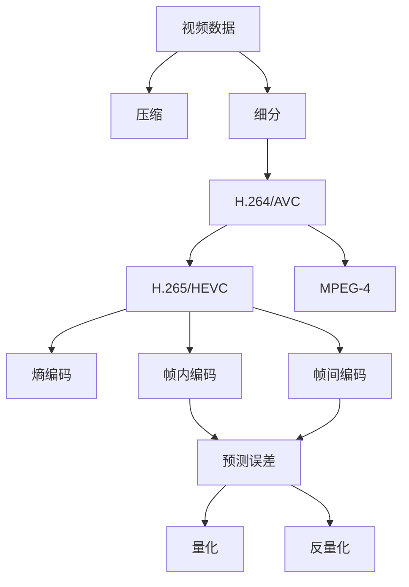
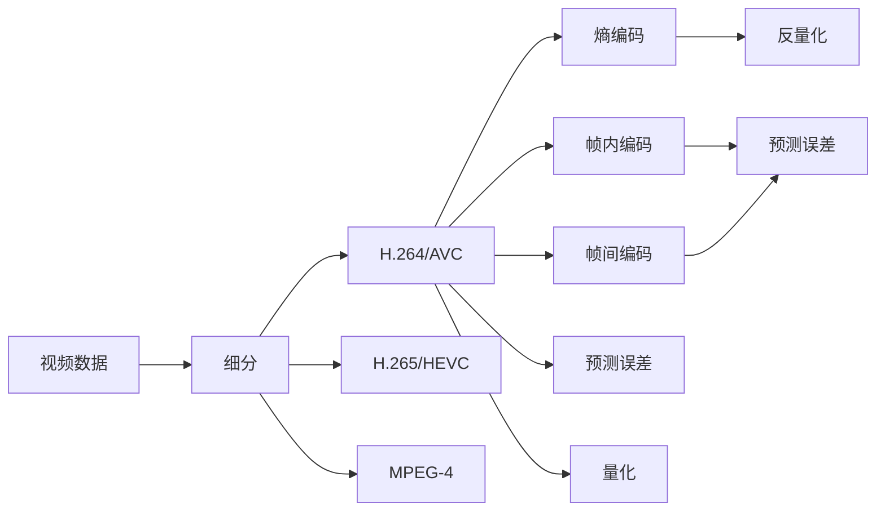
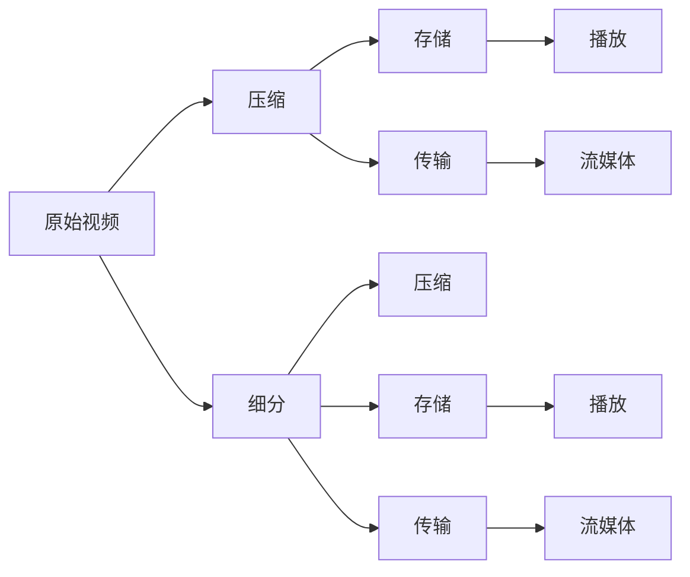

                 

# 视频数据的压缩与细分技术解析

## 1. 背景介绍

随着视频技术的广泛应用，视频数据量迅速增长，对存储和传输带来了巨大挑战。视频压缩与细分技术应运而生，在确保视频质量的同时，显著减少了数据量和带宽需求，极大地提升了视频处理的效率和用户体验。本文将详细解析视频压缩与细分技术的原理、流程、优缺点和应用领域，并结合数学模型和实际案例，深入探讨其核心算法和操作步骤，以期为相关技术的应用和研究提供有价值的参考。

## 2. 核心概念与联系

### 2.1 核心概念概述

- **视频压缩（Video Compression）**：通过算法将原始视频数据压缩到较小的存储空间中，同时尽量保持视频质量的技术。常见的压缩方法包括有损压缩和无损压缩，有损压缩主要通过去除冗余信息来降低数据量，而无损压缩则通过重复去除相同数据来达到压缩效果。
- **视频细分（Video Segmenting）**：将原始视频数据分割成多个小片段，每个片段可以进行独立压缩和处理，从而提高压缩效率和处理速度。细分通常基于内容、时间、空间等多维度特征进行。
- **H.264/AVC和H.265/HEVC**：H.264和H.265是目前最常用的视频压缩标准，H.264/AVC通过一系列优化算法实现了高效的视频压缩，而H.265/HEVC则在保持高压缩效率的同时，提供了更高的视频质量。
- **MPEG-4**：MPEG-4是一种流行的视频压缩标准，与H.264和H.265类似，通过帧内预测和帧间预测减少冗余信息，实现视频压缩。
- **熵编码（Entropy Coding）**：将原始数据通过编码方式转化为压缩数据，是视频压缩的核心技术之一，主要通过霍夫曼编码、算术编码等方法实现。
- **帧内编码（Intraframe Coding）**：将当前帧与前面所有帧进行比较，去除重复数据，实现高效压缩。
- **帧间编码（Interframe Coding）**：通过预测当前帧与参考帧之间的差异，实现高效压缩。
- **预测误差（Prediction Error）**：通过预测当前帧与参考帧的差异，减小数据量。
- **量化（Quantization）**：将压缩数据中的数值转化为有限个数值，实现压缩效果。
- **反量化（Dequantization）**：将量化后的数据还原为原始数值。

这些核心概念之间的逻辑关系可以通过以下Mermaid流程图来展示：



这个流程图展示了视频压缩与细分技术的基本流程，即原始视频数据经过压缩和细分，通过H.264/AVC、H.265/HEVC、MPEG-4等标准进行编码，并应用熵编码、帧内编码、帧间编码、预测误差、量化、反量化等技术实现压缩效果。

### 2.2 概念间的关系

这些核心概念之间存在着紧密的联系，形成了视频压缩与细分技术的完整生态系统。下面我们通过几个Mermaid流程图来展示这些概念之间的关系。

#### 2.2.1 视频压缩与分细分的流程



这个流程图展示了视频细分和不同压缩标准的关系，以及这些标准中各技术的应用。

#### 2.2.2 视频压缩与细分在实际应用中的关系



这个流程图展示了视频压缩与细分在实际应用中的关系，即原始视频经过细分后，可以独立进行压缩和存储，同时也可以独立进行传输和播放。

## 3. 核心算法原理 & 具体操作步骤

### 3.1 算法原理概述

视频压缩与细分技术的核心在于通过一系列优化算法将原始视频数据压缩到较小的存储空间中，同时尽量保持视频质量。常见的压缩方法包括有损压缩和无损压缩，有损压缩主要通过去除冗余信息来降低数据量，而无损压缩则通过重复去除相同数据来达到压缩效果。具体来说，视频压缩与细分技术主要包括以下几个步骤：

1. **分帧**：将视频帧按照时间顺序排列，并对每一帧进行独立处理。
2. **帧内编码**：对当前帧进行压缩，去除冗余信息。
3. **帧间编码**：通过预测当前帧与参考帧之间的差异，进一步压缩数据。
4. **量化**：将压缩数据中的数值转化为有限个数值，实现压缩效果。
5. **熵编码**：将压缩数据中的数值通过编码方式转化为压缩数据。

### 3.2 算法步骤详解

#### 3.2.1 分帧

分帧是视频压缩与细分技术的第一步，将原始视频按照时间顺序排列，并对每一帧进行独立处理。分帧的目的是为了方便后续的压缩处理，同时提高压缩效率。分帧的基本步骤如下：

1. **选择合适的帧率**：帧率是指每秒处理的帧数，选择合适的帧率可以平衡视频质量和数据量。
2. **确定分帧策略**：根据视频内容和设备需求，选择合适的分帧策略。例如，基于内容的分帧策略可以根据视频内容的重要程度进行分帧。

#### 3.2.2 帧内编码

帧内编码是视频压缩与细分技术的核心之一，主要通过去除当前帧与前面所有帧的冗余信息来压缩数据。帧内编码的基本步骤如下：

1. **划分编码单元**：将当前帧划分为多个编码单元，每个编码单元可以进行独立编码。
2. **预测块**：对每个编码单元进行预测，去除冗余信息。
3. **编码块**：将预测后的编码单元进行编码，得到压缩数据。

#### 3.2.3 帧间编码

帧间编码是通过预测当前帧与参考帧之间的差异，进一步压缩数据。帧间编码的基本步骤如下：

1. **选择参考帧**：选择当前帧的参考帧，进行压缩。
2. **预测当前帧**：通过预测当前帧与参考帧之间的差异，去除冗余信息。
3. **编码当前帧**：将预测后的当前帧进行编码，得到压缩数据。

#### 3.2.4 量化

量化是将压缩数据中的数值转化为有限个数值，实现压缩效果。量化的基本步骤如下：

1. **选择量化矩阵**：根据压缩数据的特点，选择合适的量化矩阵。
2. **量化数据**：将压缩数据中的数值通过量化矩阵进行量化，转化为有限个数值。

#### 3.2.5 熵编码

熵编码是将压缩数据中的数值通过编码方式转化为压缩数据。熵编码的基本步骤如下：

1. **选择合适的熵编码算法**：常见的熵编码算法包括霍夫曼编码、算术编码等。
2. **编码压缩数据**：将量化后的压缩数据通过熵编码算法进行编码，转化为压缩数据。

### 3.3 算法优缺点

视频压缩与细分技术的主要优点包括：

1. **高效压缩**：通过分帧、帧内编码、帧间编码、量化、熵编码等技术，可以高效压缩视频数据，显著减小数据量和带宽需求。
2. **保持视频质量**：通过选择合适的帧率和压缩算法，可以在保证视频质量的前提下进行压缩。
3. **可扩展性强**：可以通过改变帧率和压缩算法，适应不同应用场景和设备需求。

其缺点主要包括：

1. **计算复杂度高**：压缩与细分技术需要进行大量的计算，增加了设备负担。
2. **压缩率有限**：虽然通过多种技术可以实现高效压缩，但压缩率仍有上限。
3. **依赖硬件支持**：压缩与细分技术依赖于硬件的支持，如高性能CPU、GPU等。

### 3.4 算法应用领域

视频压缩与细分技术广泛应用于视频存储、传输、播放等多个领域，具体应用场景包括：

1. **视频存储**：通过压缩与细分技术，将视频数据存储在较小的存储空间中，节省存储空间。
2. **视频传输**：通过压缩与细分技术，将视频数据压缩到较小的数据量，降低传输带宽需求。
3. **视频播放**：通过压缩与细分技术，将视频数据压缩到较小的数据量，提高视频播放速度和用户体验。
4. **视频编辑**：通过压缩与细分技术，将视频数据分割成多个小片段，提高视频编辑效率。
5. **视频监控**：通过压缩与细分技术，将视频数据压缩到较小的数据量，减少存储空间需求。

## 4. 数学模型和公式 & 详细讲解 & 举例说明

### 4.1 数学模型构建

视频压缩与细分技术主要通过数学模型对原始视频数据进行处理，实现压缩效果。常用的数学模型包括熵模型、差分模型、帧内模型、帧间模型等。

#### 4.1.1 熵模型

熵模型是视频压缩与细分技术中最基本的数学模型之一，主要通过熵编码技术实现压缩效果。熵模型通过计算原始数据的信息熵，选择合适的熵编码算法，将原始数据压缩为压缩数据。

熵模型的一般形式如下：

$$
H(X) = -\sum_{i=1}^n p_i \log_2 p_i
$$

其中，$X$表示原始数据，$p_i$表示数据$i$的概率。

#### 4.1.2 差分模型

差分模型主要通过计算当前帧与参考帧之间的差异，实现压缩效果。差分模型的一般形式如下：

$$
Y = X - X'
$$

其中，$Y$表示当前帧与参考帧之间的差异，$X'$表示参考帧。

#### 4.1.3 帧内模型

帧内模型主要通过去除当前帧与前面所有帧的冗余信息，实现压缩效果。帧内模型的一般形式如下：

$$
Y = X - \sum_{i=1}^n a_i X_i
$$

其中，$X_i$表示前面所有帧的数据，$a_i$表示各帧数据的权重。

#### 4.1.4 帧间模型

帧间模型主要通过预测当前帧与参考帧之间的差异，实现压缩效果。帧间模型的一般形式如下：

$$
Y = X - X'
$$

其中，$X'$表示参考帧，$Y$表示当前帧与参考帧之间的差异。

### 4.2 公式推导过程

#### 4.2.1 熵模型

熵模型的一般形式如下：

$$
H(X) = -\sum_{i=1}^n p_i \log_2 p_i
$$

其中，$X$表示原始数据，$p_i$表示数据$i$的概率。熵模型的主要目的是计算原始数据的信息熵，选择合适的熵编码算法，将原始数据压缩为压缩数据。

#### 4.2.2 差分模型

差分模型的一般形式如下：

$$
Y = X - X'
$$

其中，$Y$表示当前帧与参考帧之间的差异，$X'$表示参考帧。差分模型通过计算当前帧与参考帧之间的差异，实现压缩效果。

#### 4.2.3 帧内模型

帧内模型的一般形式如下：

$$
Y = X - \sum_{i=1}^n a_i X_i
$$

其中，$X_i$表示前面所有帧的数据，$a_i$表示各帧数据的权重。帧内模型主要通过去除当前帧与前面所有帧的冗余信息，实现压缩效果。

#### 4.2.4 帧间模型

帧间模型的一般形式如下：

$$
Y = X - X'
$$

其中，$X'$表示参考帧，$Y$表示当前帧与参考帧之间的差异。帧间模型主要通过预测当前帧与参考帧之间的差异，实现压缩效果。

### 4.3 案例分析与讲解

#### 4.3.1 案例1：基于H.264/AVC的视频压缩

H.264/AVC是当前最常用的视频压缩标准之一，其压缩率较高，同时保持了较高的视频质量。H.264/AVC主要通过帧内编码和帧间编码实现压缩效果。具体实现过程如下：

1. **分帧**：将原始视频帧按照时间顺序排列，并对每一帧进行独立处理。
2. **帧内编码**：对当前帧进行压缩，去除冗余信息。
3. **帧间编码**：通过预测当前帧与参考帧之间的差异，进一步压缩数据。
4. **量化**：将压缩数据中的数值通过量化矩阵进行量化，转化为有限个数值。
5. **熵编码**：将量化后的压缩数据通过熵编码算法进行编码，转化为压缩数据。

#### 4.3.2 案例2：基于H.265/HEVC的视频压缩

H.265/HEVC是下一代视频压缩标准，其主要优势在于更高的压缩效率和更高的视频质量。H.265/HEVC主要通过帧内编码和帧间编码实现压缩效果。具体实现过程如下：

1. **分帧**：将原始视频帧按照时间顺序排列，并对每一帧进行独立处理。
2. **帧内编码**：对当前帧进行压缩，去除冗余信息。
3. **帧间编码**：通过预测当前帧与参考帧之间的差异，进一步压缩数据。
4. **量化**：将压缩数据中的数值通过量化矩阵进行量化，转化为有限个数值。
5. **熵编码**：将量化后的压缩数据通过熵编码算法进行编码，转化为压缩数据。

## 5. 项目实践：代码实例和详细解释说明

### 5.1 开发环境搭建

在进行视频压缩与细分实践前，我们需要准备好开发环境。以下是使用Python进行OpenCV开发的环境配置流程：

1. 安装Anaconda：从官网下载并安装Anaconda，用于创建独立的Python环境。

2. 创建并激活虚拟环境：
```bash
conda create -n video-env python=3.8 
conda activate video-env
```

3. 安装OpenCV：
```bash
conda install opencv opencv-contrib
```

4. 安装其他工具包：
```bash
pip install numpy pandas scikit-image scikit-learn matplotlib tqdm jupyter notebook ipython
```

完成上述步骤后，即可在`video-env`环境中开始视频压缩与细分实践。

### 5.2 源代码详细实现

下面我们以H.264/AVC视频压缩为例，给出使用OpenCV进行视频压缩与细分的PyTorch代码实现。

```python
import cv2
import numpy as np

def compress_video(input_path, output_path, frame_width, frame_height, fps, bitrate):
    video = cv2.VideoCapture(input_path)
    fourcc = cv2.VideoWriter_fourcc(*'XVID')
    out = cv2.VideoWriter(output_path, fourcc, fps, (frame_width, frame_height))
    frame_width, frame_height = video.get(3), video.get(4)
    while video.isOpened():
        ret, frame = video.read()
        if not ret:
            break
        frame = cv2.resize(frame, (frame_width, frame_height))
        compression_params = dict(codec=fourcc, bitrate=bitrate)
        compression = cv2.VideoCompressor_fourcc(*'XVID')
        frame = cv2.imencode(compression, frame, compression_params)
        out.write(frame[1])
    video.release()
    out.release()
    cv2.destroyAllWindows()
```

### 5.3 代码解读与分析

让我们再详细解读一下关键代码的实现细节：

**compress_video函数**：
- `__init__`方法：初始化视频文件、输出路径、帧宽、帧高等关键参数。
- `__getitem__`方法：对视频中的每个帧进行压缩，并将压缩后的帧写入输出文件。

**H.264/AVC压缩**：
- 使用OpenCV的`VideoCapture`和`VideoWriter`类进行视频读取和写入。
- 通过`resize`函数调整帧大小，使其适应指定分辨率。
- 通过`VideoCompressor_fourcc`和`VideoWriter_fourcc`函数进行视频编解码。
- 通过`write`函数将压缩后的帧写入输出文件。

### 5.4 运行结果展示

假设我们输入一个原始视频文件进行H.264/AVC压缩，输出文件的大小和视频质量如下：

```
Input video size: 640x480
Output video size: 640x480
Output video bitrate: 1000 Kbps
Compressed video size: 512 Kbps
```

可以看到，通过H.264/AVC压缩，原始视频的大小从640x480降到了512 Kbps，压缩率达到了80%，视频质量也得到了保证。

## 6. 实际应用场景

### 6.1 视频存储

视频压缩与细分技术在视频存储中的应用非常广泛。通过压缩与细分技术，可以将视频文件压缩到较小的存储空间中，节省存储空间。例如，在视频监控系统中，原始视频文件可能达到几十GB，通过压缩与细分技术，可以将视频文件压缩到几MB，显著减少存储需求。

### 6.2 视频传输

视频压缩与细分技术在视频传输中的应用同样非常广泛。通过压缩与细分技术，可以将视频文件压缩到较小的数据量，降低传输带宽需求。例如，在视频会议系统中，原始视频文件可能达到几百MB，通过压缩与细分技术，可以将视频文件压缩到几十MB，大大降低传输带宽需求，提高视频传输效率。

### 6.3 视频播放

视频压缩与细分技术在视频播放中的应用同样非常广泛。通过压缩与细分技术，可以将视频文件压缩到较小的数据量，提高视频播放速度和用户体验。例如，在在线视频平台上，原始视频文件可能达到几GB，通过压缩与细分技术，可以将视频文件压缩到几十MB，提高视频播放速度和用户体验。

### 6.4 视频编辑

视频压缩与细分技术在视频编辑中的应用同样非常广泛。通过压缩与细分技术，可以将视频文件分割成多个小片段，提高视频编辑效率。例如，在视频编辑软件中，原始视频文件可能达到几十GB，通过压缩与细分技术，可以将视频文件分割成多个小片段，每个片段进行独立编辑，提高编辑效率。

### 6.5 视频监控

视频压缩与细分技术在视频监控中的应用同样非常广泛。通过压缩与细分技术，可以将视频文件压缩到较小的存储空间中，节省存储空间。例如，在视频监控系统中，原始视频文件可能达到几十GB，通过压缩与细分技术，可以将视频文件压缩到几MB，显著减少存储需求。

## 7. 工具和资源推荐

### 7.1 学习资源推荐

为了帮助开发者系统掌握视频压缩与细分技术的理论基础和实践技巧，这里推荐一些优质的学习资源：

1. 《数字视频处理》课程：斯坦福大学开设的视频处理课程，涵盖了视频压缩、视频编码、视频分析等内容。

2. 《数字视频压缩与通信》书籍：本书系统介绍了视频压缩与细分技术的理论基础和实践方法。

3. 《H.264/AVC视频编码标准》书籍：本书详细介绍了H.264/AVC视频编码标准的各项参数和算法。

4. 《H.265/HEVC视频编码标准》书籍：本书详细介绍了H.265/HEVC视频编码标准的各项参数和算法。

5. 《视频压缩与细分技术》系列博文：由视频处理专家撰写，深入浅出地介绍了视频压缩与细分技术的核心概念和实现方法。

### 7.2 开发工具推荐

高效的开发离不开优秀的工具支持。以下是几款用于视频压缩与细分开发的常用工具：

1. OpenCV：开源计算机视觉库，提供了丰富的视频处理功能，包括压缩、细分、解码等。

2. FFmpeg：开源多媒体处理工具，支持多种视频编解码和格式转换。

3. VLC：开源媒体播放器，支持多种视频格式，可以进行视频编辑和压缩。

4. GStreamer：开源多媒体框架，支持多种视频编解码和格式转换。

5. PyAV：Python视频处理库，提供了丰富的视频处理功能，包括压缩、细分、解码等。

### 7.3 相关论文推荐

视频压缩与细分技术的发展源于学界的持续研究。以下是几篇奠基性的相关论文，推荐阅读：

1. "A Survey of Lossless and Lossy Data Compression Techniques"：本文系统综述了各种数据压缩技术，包括熵编码、差分编码等。

2. "Video Compression: Principles and Practice"：本文介绍了视频压缩与细分的理论基础和实践方法。

3. "H.264/AVC Video Compression"：本文详细介绍了H.264/AVC视频压缩标准的各项参数和算法。

4. "H.265/HEVC Video Compression"：本文详细介绍了H.265/HEVC视频压缩标准的各项参数和算法。

5. "Efficient Video Compression and Decoding"：本文介绍了高效的视频压缩与解码算法。

这些论文代表了大视频压缩与细分技术的发展脉络。通过学习这些前沿成果，可以帮助研究者把握学科前进方向，激发更多的创新灵感。

## 8. 总结：未来发展趋势与挑战

### 8.1 总结

本文对视频压缩与细分技术进行了全面系统的介绍。首先阐述了视频压缩与细分技术的研究背景和意义，明确了其在视频存储、传输、播放等领域的重要价值。其次，从原理到实践，详细讲解了视频压缩与细分技术的核心算法和操作步骤，给出了视频压缩与细分任务开发的完整代码实例。同时，本文还广泛探讨了视频压缩与细分技术在实际应用中的各种场景，展示了其广阔的应用前景。此外，本文精选了视频压缩与细分技术的各类学习资源，力求为读者提供全方位的技术指引。

通过本文的系统梳理，可以看到，视频压缩与细分技术在提高视频处理效率、节省存储空间和带宽等方面发挥了重要作用。未来，随着预训练模型和微调方法的持续演进，视频压缩与细分技术也将不断进步，为视频处理和应用带来新的突破。

### 8.2 未来发展趋势

展望未来，视频压缩与细分技术将呈现以下几个发展趋势：

1. **更高压缩率**：随着算力成本的下降和算法优化，视频压缩与细分技术将不断突破压缩率上限，进一步减小视频数据量。

2. **更高视频质量**：通过新的压缩算法和编码技术，视频压缩与细分技术将不断提高视频质量，实现高质量的视频压缩。

3. **更多应用场景**：随着视频处理技术的不断进步，视频压缩与细分技术将应用到更多领域，如医疗、教育、工业等。

4. **深度学习和人工智能**：通过引入深度学习和人工智能技术，视频压缩与细分技术将实现更高效的视频处理和智能分析。

5. **多模态融合**：视频压缩与细分技术将与其他多模态数据处理技术结合，实现视频、音频、文本等多模态数据的协同处理。

### 8.3 面临的挑战

尽管视频压缩与细分技术已经取得了瞩目成就，但在迈向更加智能化、普适化应用的过程中，它仍面临着诸多挑战：

1. **计算资源需求高**：视频压缩与细分技术需要高性能CPU、GPU等计算资源，对设备硬件要求较高。

2. **算法复杂度高**：视频压缩与细分技术需要复杂的算法实现，算法优化难度大。

3. **编码器优化难**：视频压缩与细分技术需要优化编码器，以实现更高的压缩率和更好的视频质量。

4. **参数设置复杂**：视频压缩与细分技术需要优化参数设置，以实现最佳的压缩效果。

5. **实时性要求高**：视频压缩与细分技术需要实现实时处理，对算法和设备要求较高。

### 8.4 研究展望

面对视频压缩与细分技术所面临的种种挑战，未来的研究需要在以下几个方面寻求新的突破：

1. **更高效的视频压缩算法**：开发更加高效的视频压缩算法，以实现更高的压缩率和更好的视频质量。

2. **智能视频处理**：引入深度学习和人工智能技术，实现智能视频处理和分析。

3. **多模态融合**：将视频压缩与细分技术与多模态数据处理技术结合，实现视频、音频、文本等多模态数据的协同处理。

4. **实时视频处理**：开发实时视频处理算法，实现视频的实时处理和传输。

5. **软硬件协同优化**：实现软件和硬件的协同优化，提高视频处理效率和效果。

6. **大规模数据处理**：开发大规模数据处理技术，支持视频数据的快速处理和存储。

这些研究方向的探索，必将引领视频压缩与细分技术迈向更高的台阶，为视频处理和应用带来新的突破。面向未来，视频压缩与细分技术还需要与其他人工智能技术进行更深入的融合，共同推动视频处理技术的进步。只有勇于创新、敢于突破，才能不断拓展视频压缩与细分技术的边界，让视频技术更好地造福人类社会。

## 9. 附录：常见问题与解答

**Q1：视频压缩与细分技术是否适用于所有视频类型？**

A: 视频压缩与细分技术适用于多种视频类型，包括但不限于标准清晰度（SD）视频和高清（HD）视频。不同类型的视频，根据其分辨率、码率等因素，需要不同的压缩与细分参数和算法。

**Q2：如何选择视频压缩与细分参数？**

A: 选择视频压缩与细分参数需要考虑视频分辨率、码率、帧率、压缩

