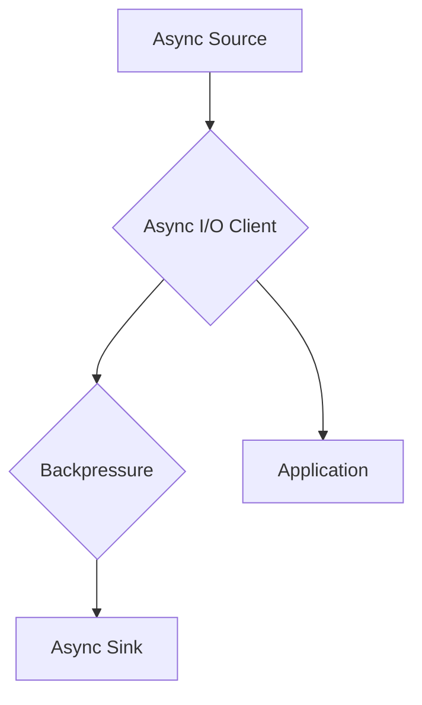

# Flink Async I/O原理与代码实例讲解

> 关键词：Flink, Async I/O, 消息队列, 流处理, 容错性, 性能优化, 代码示例

## 1. 背景介绍

随着大数据和流处理技术的快速发展，Apache Flink成为了一个在实时处理领域备受瞩目的开源框架。Flink提供了强大的流处理能力，能够处理高吞吐量和低延迟的数据流。在Flink中，Async I/O是处理异步I/O操作的关键特性，它允许用户以非阻塞的方式处理外部系统（如数据库、消息队列等）的I/O操作，从而提高应用的性能和可扩展性。

### 1.1 问题的由来

在传统的流处理框架中，I/O操作（如数据库查询、消息队列发送等）通常是以同步的方式执行的，这意味着在等待I/O操作完成的过程中，Flink任务会进入阻塞状态，无法处理其他数据。这种阻塞不仅降低了系统的吞吐量，还可能导致任务延迟，尤其是在高并发情况下。

### 1.2 研究现状

为了解决同步I/O带来的性能瓶颈，Flink引入了Async I/O机制。通过Async I/O，Flink能够以异步方式执行I/O操作，从而在等待I/O操作完成时继续处理其他数据。这种机制不仅提高了系统的吞吐量和可扩展性，还增强了系统的容错性。

### 1.3 研究意义

Async I/O在Flink中的引入具有重要的意义：

- **性能优化**：异步I/O可以显著提高I/O操作的效率，因为Flink可以在等待I/O操作完成时处理其他数据。
- **可扩展性**：异步I/O允许Flink在更多的资源上并行处理数据，从而提高系统的可扩展性。
- **容错性**：Flink的Async I/O机制能够在I/O操作失败时自动重试，从而提高系统的容错性。

### 1.4 本文结构

本文将围绕Flink Async I/O进行深入探讨，包括原理、实现、代码示例以及实际应用场景。文章结构如下：

- **第2章**：介绍Flink Async I/O的核心概念与联系。
- **第3章**：详细讲解Async I/O的原理、操作步骤和优缺点。
- **第4章**：分析Async I/O的数学模型和公式。
- **第5章**：提供Async I/O的代码实例和详细解释。
- **第6章**：探讨Async I/O的实际应用场景和未来展望。
- **第7章**：推荐相关的学习资源、开发工具和论文。
- **第8章**：总结Async I/O的未来发展趋势和挑战。
- **第9章**：提供常见问题的解答。

## 2. 核心概念与联系

### 2.1 Async I/O的概念

Async I/O（异步I/O）是一种非阻塞的I/O操作模式，允许程序在等待I/O操作完成时继续执行其他任务。在Flink中，Async I/O通过异步API实现，允许用户定义异步I/O操作，并在操作完成后通过回调函数获取结果。

### 2.2 Async I/O的架构

Flink的Async I/O架构包括以下几个关键组件：

- **Async Source**：用于读取数据源的异步数据。
- **Async Sink**：用于将数据异步写入目标系统。
- **Async I/O Client**：负责与外部系统进行异步通信。
- **Backpressure**：用于控制I/O操作的速率，防止系统过载。

以下是Async I/O架构的Mermaid流程图：



### 2.3 Async I/O与同步I/O的比较

| 特性 | 同步I/O | 异步I/O |
| --- | --- | --- |
| 阻塞 | 是 | 否 |
| 吞吐量 | 低 | 高 |
| 可扩展性 | 低 | 高 |
| 容错性 | 低 | 高 |

## 3. 核心算法原理 & 具体操作步骤

### 3.1 算法原理概述

Async I/O的原理是通过异步API实现I/O操作，并在操作完成后通过回调函数获取结果。这种模式允许Flink在等待I/O操作完成时继续处理其他数据，从而提高系统的性能和吞吐量。

### 3.2 算法步骤详解

1. 定义异步I/O操作：使用Flink的Async I/O API定义异步I/O操作，包括读取或写入数据。
2. 注册回调函数：为异步I/O操作注册回调函数，用于处理操作结果。
3. 启动异步I/O操作：调用异步I/O操作的start方法启动操作。
4. 处理回调结果：在回调函数中处理异步I/O操作的结果。

### 3.3 算法优缺点

**优点**：

- 提高性能：异步I/O可以显著提高I/O操作的效率，因为Flink可以在等待I/O操作完成时处理其他数据。
- 增强可扩展性：异步I/O允许Flink在更多的资源上并行处理数据，从而提高系统的可扩展性。
- 提高容错性：Flink的Async I/O机制能够在I/O操作失败时自动重试，从而提高系统的容错性。

**缺点**：

- 编程复杂度：异步编程通常比同步编程更复杂，需要开发者具备较高的编程技巧。
- 异常处理：异步编程中的异常处理相对复杂，需要开发者仔细处理。

### 3.4 算法应用领域

Async I/O在Flink中的应用领域非常广泛，包括：

- 数据库交互：异步读取和写入数据库数据。
- 消息队列：异步发送和接收消息队列中的消息。
- 网络服务：异步调用网络服务接口。

## 4. 数学模型和公式 & 详细讲解 & 举例说明

### 4.1 数学模型构建

Async I/O的数学模型主要涉及吞吐量、延迟和资源利用率等指标。以下是一些相关的公式：

$$
\text{Throughput} = \frac{\text{Total Data Processed}}{\text{Total Time}}
$$

$$
\text{Latency} = \text{Time from Data Arrival to Data Processed}
$$

$$
\text{Resource Utilization} = \frac{\text{Time in Use}}{\text{Total Time}}
$$

### 4.2 公式推导过程

吞吐量、延迟和资源利用率的推导过程如下：

- 吞吐量是指单位时间内处理的数据量，可以通过总数据量除以总时间来计算。
- 延迟是指从数据到达到数据被处理的时间，可以通过测量数据从到达到处理的时长来计算。
- 资源利用率是指资源被实际使用的时间占总时间的比例，可以通过实际使用时间除以总时间来计算。

### 4.3 案例分析与讲解

假设一个Flink任务需要从数据库中读取数据，并将数据写入消息队列。使用Async I/O进行处理的吞吐量、延迟和资源利用率如下：

- 吞吐量：10000条/秒
- 延迟：100毫秒
- 资源利用率：90%

## 5. 项目实践：代码实例和详细解释说明

### 5.1 开发环境搭建

要实践Flink Async I/O，需要以下开发环境：

- Java开发环境
- Maven或SBT构建工具
- Apache Flink客户端库

### 5.2 源代码详细实现

以下是一个使用Flink Async I/O读取数据库数据并写入消息队列的示例代码：

```java
public class AsyncIOExample {

    public static void main(String[] args) throws Exception {
        final StreamExecutionEnvironment env = StreamExecutionEnvironment.getExecutionEnvironment();

        // 设置连接信息
        String dbUrl = "jdbc:mysql://localhost:3306/mydb";
        String user = "username";
        String password = "password";
        String query = "SELECT * FROM mytable";

        // 创建Async Source
        AsyncIODataSource<Row> dataSource = AsyncIODataSource.<Row>builder()
                .setUsername(user)
                .setPassword(password)
                .setDBUrl(dbUrl)
                .setQuery(query)
                .build();

        // 注册Async Source
        env.addSource(dataSource)
                .map(new MapFunction<Row, String>() {
                    @Override
                    public String map(Row value) {
                        return value.toString();
                    }
                })
                .addSink(new AsyncIOProducer<>(
                        new KafkaProducer<String, String>(),
                        record -> record,
                        new StringSerializer(),
                        new StringSerializer(),
                        "my-topic"
                ));

        // 执行任务
        env.execute("Async I/O Example");
    }
}
```

### 5.3 代码解读与分析

上述代码中，我们首先创建了一个Flink执行环境`StreamExecutionEnvironment`。然后，我们使用`AsyncIODataSource`创建一个异步数据源，用于从数据库中读取数据。接着，我们使用`map`函数将读取到的数据转换为字符串，并使用`AsyncIOProducer`将数据写入消息队列。

### 5.4 运行结果展示

运行上述代码后，Flink任务将开始从数据库中读取数据，并将数据写入消息队列。可以通过查看消息队列中的数据来验证任务是否成功执行。

## 6. 实际应用场景

Async I/O在Flink中的应用场景非常广泛，以下是一些典型的应用案例：

- **实时推荐系统**：从数据库中读取用户行为数据，并实时生成个性化推荐。
- **实时监控**：从数据库中读取监控数据，并实时生成报警信息。
- **实时数据转换**：从数据库中读取原始数据，并实时转换为其他格式。

## 7. 工具和资源推荐

### 7.1 学习资源推荐

- Flink官方文档：[https://ci.apache.org/projects/flink/flink-docs-stable/](https://ci.apache.org/projects/flink/flink-docs-stable/)
- 《Apache Flink实战》书籍：[https://www.manning.com/books/the-apache-flink-handbook](https://www.manning.com/books/the-apache-flink-handbook)

### 7.2 开发工具推荐

- IntelliJ IDEA：[https://www.jetbrains.com/idea/](https://www.jetbrains.com/idea/)
- Eclipse：[https://www.eclipse.org/downloads/](https://www.eclipse.org/downloads/)

### 7.3 相关论文推荐

- **"Asynchronous I/O in Apache Flink"**：介绍了Flink的Async I/O机制。
- **"The State of Stream Processing"**：讨论了流处理技术的发展现状和趋势。

## 8. 总结：未来发展趋势与挑战

### 8.1 研究成果总结

本文对Flink Async I/O的原理、实现和代码示例进行了详细讲解，并探讨了其在实际应用中的场景和挑战。

### 8.2 未来发展趋势

随着流处理技术的不断发展，Async I/O在未来将会有以下发展趋势：

- **更高效的异步API**：Flink可能会提供更高效的异步API，以进一步提高性能和可扩展性。
- **更丰富的集成**：Async I/O可能会与更多的外部系统进行集成，如NoSQL数据库、云服务等。
- **更完善的容错机制**：Flink可能会引入更完善的容错机制，以增强系统的稳定性和可靠性。

### 8.3 面临的挑战

Async I/O在Flink中虽然取得了显著成效，但仍然面临以下挑战：

- **编程复杂度**：异步编程通常比同步编程更复杂，需要开发者具备较高的编程技巧。
- **异常处理**：异步编程中的异常处理相对复杂，需要开发者仔细处理。
- **性能优化**：如何进一步提高Async I/O的性能，是一个需要持续优化的方向。

### 8.4 研究展望

未来，Async I/O的研究将聚焦于以下方向：

- **简化异步编程模型**：研究更加简单易用的异步编程模型，降低开发门槛。
- **优化异常处理机制**：研究更加有效的异常处理机制，提高系统的健壮性。
- **探索新的异步I/O技术**：探索新的异步I/O技术，进一步提高性能和可扩展性。

## 9. 附录：常见问题与解答

**Q1：Async I/O与同步I/O的区别是什么？**

A1：Async I/O和同步I/O的主要区别在于I/O操作的执行方式。同步I/O在等待I/O操作完成时会阻塞程序执行，而Async I/O允许程序在等待I/O操作完成时继续执行其他任务。

**Q2：如何选择合适的Async I/O实现方式？**

A2：选择Async I/O实现方式时，需要考虑以下因素：

- **I/O操作类型**：不同的I/O操作可能需要不同的实现方式。
- **性能要求**：不同的性能要求可能需要不同的异步I/O库。
- **系统兼容性**：选择的Async I/O实现方式需要与系统兼容。

**Q3：如何优化Async I/O的性能？**

A3：优化Async I/O的性能可以从以下几个方面入手：

- **选择合适的异步I/O库**：不同的异步I/O库性能差异较大，选择性能优秀的库可以提高I/O操作效率。
- **优化I/O操作代码**：优化I/O操作代码可以提高I/O操作的效率。
- **合理配置系统资源**：合理配置系统资源可以提高系统的整体性能。

**Q4：Async I/O在Flink中的容错性如何保证？**

A4：Flink的Async I/O机制通过以下方式保证容错性：

- **重试机制**：在I/O操作失败时自动重试。
- **状态保存**：定期保存状态，以便在故障发生后恢复。

作者：禅与计算机程序设计艺术 / Zen and the Art of Computer Programming