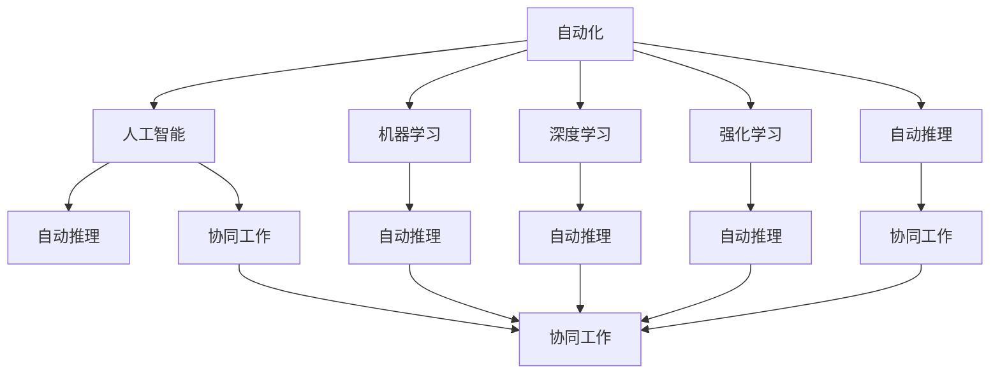

                 

# 自动化的未来发展与应用

## 1. 背景介绍

### 1.1 问题由来
随着技术的发展，自动化已经从简单的重复性工作迈向了智能决策和创新驱动的领域。从工业自动化到智能客服，再到自动驾驶和医疗诊断，自动化正在各个行业领域发挥越来越重要的作用。然而，随着需求的不断提升和场景的日益复杂，当前自动化系统的智能化程度仍显不足，限制了其在更多场景中的应用。

### 1.2 问题核心关键点
自动化技术的关键在于算法、模型和应用的协同创新。当前自动化领域面临的问题包括：
1. 算法模型的精度和泛化能力不足。
2. 模型的解释性和可解释性差，难以满足高风险场景的应用需求。
3. 应用场景复杂多样，需要更多的定制化开发。
4. 数据获取和标注成本高，制约了自动化技术的发展。
5. 自动化系统的安全性和伦理问题，如隐私泄露、决策透明性不足。

### 1.3 问题研究意义
解决上述问题，将极大地提升自动化系统的智能化水平，使其能够更好地服务于各个行业。其重要意义在于：
1. 降低人工成本。自动化系统能够替代大量人力，特别是在重复性高、风险低的场景中。
2. 提高效率和质量。自动化系统能够快速准确地完成任务，减少人为错误和延迟。
3. 推动创新。自动化系统能够探索人类难以到达的领域，推动科学研究和工业创新。
4. 赋能产业升级。自动化技术的应用，可以提升产业链的智能化水平，加速数字化转型。

## 2. 核心概念与联系

### 2.1 核心概念概述

为了更好地理解自动化的未来发展与应用，本节将介绍几个关键概念：

- **自动化（Automation）**：指利用技术手段，自动化执行重复性、低价值工作，从而提升效率和质量。
- **人工智能（AI）**：指通过算法和模型，使机器具备类似人类的认知能力，如理解、推理、学习等。
- **机器学习（ML）**：指利用数据和算法，使机器能够自动改进性能，从而更好地完成特定任务。
- **深度学习（DL）**：指利用神经网络模型，通过多层非线性映射，实现对复杂数据的高级表示和处理。
- **强化学习（RL）**：指通过与环境的交互，使机器能够优化决策策略，以最大化预期回报。
- **自动推理（Auto Reasoning）**：指使机器具备类似人类的逻辑推理能力，从给定前提和假设中推导出结论。
- **协同工作（Collaborative Work）**：指多个自动化系统协同工作，实现复杂任务的自动化。

这些概念之间存在着紧密的联系，通过合理的组合与协同，可以构建出高效的自动化系统。

### 2.2 概念间的关系

这些核心概念之间的关系可以通过以下Mermaid流程图来展示：



这个流程图展示了自动化、人工智能、机器学习、深度学习、强化学习和自动推理之间的关系：

1. 自动化是通过人工智能、机器学习和深度学习等技术实现的。
2. 强化学习可以增强自动化系统的决策能力。
3. 自动推理可以使机器具备更强的逻辑思维能力。
4. 协同工作可以增强自动化系统的复杂任务处理能力。

这些概念共同构成了自动化的核心生态系统，推动着自动化技术的发展和应用。

## 3. 核心算法原理 & 具体操作步骤

### 3.1 算法原理概述

自动化技术的核心在于算法和模型的构建与应用。自动化系统的智能程度主要取决于算法模型的精度和泛化能力。

当前主流的自动化算法包括：
- **监督学习（Supervised Learning）**：通过标注数据训练模型，使其能够准确预测未知数据的标签。
- **无监督学习（Unsupervised Learning）**：利用数据的内在结构，自动发现数据中的隐藏模式。
- **半监督学习（Semi-supervised Learning）**：结合少量标注数据和大量未标注数据，提升模型的泛化能力。
- **强化学习（Reinforcement Learning）**：通过与环境的交互，训练模型最大化预期回报。
- **迁移学习（Transfer Learning）**：将一个领域学到的知识迁移到另一个领域，提高模型的泛化能力。

### 3.2 算法步骤详解

自动化算法的主要步骤如下：

1. **数据准备**：收集和预处理数据，划分为训练集、验证集和测试集。数据集的大小和质量直接影响算法的性能。
2. **模型选择**：选择合适的算法和模型结构。常见的算法包括监督学习、无监督学习和强化学习等。
3. **训练与优化**：在训练集上训练模型，通过优化算法调整模型参数，使其能够准确预测标签。
4. **验证与调优**：在验证集上评估模型性能，根据评估结果调整模型超参数，进一步优化模型。
5. **测试与部署**：在测试集上测试模型性能，评估模型泛化能力，并将模型部署到实际应用中。

### 3.3 算法优缺点

自动化算法的优点包括：
- 自动化执行重复性任务，提升效率。
- 利用数据驱动，提高决策的客观性和公正性。
- 通过算法优化，提高任务的精度和可靠性。

缺点包括：
- 数据依赖性强，数据获取和标注成本高。
- 模型的解释性和可解释性差，难以满足高风险场景的应用需求。
- 模型泛化能力受数据质量影响较大，鲁棒性不足。
- 模型训练和部署成本较高，需要专业的技术团队。

### 3.4 算法应用领域

自动化算法在各个领域都有着广泛的应用：

1. **工业自动化**：在制造业、能源行业、物流等行业，自动化系统可以完成复杂的生产流程、维护任务和物流配送等。
2. **医疗诊断**：在医学影像分析、病理诊断、基因组分析等领域，自动化系统可以辅助医生进行快速诊断和决策。
3. **金融风控**：在信用评分、风险评估、欺诈检测等领域，自动化系统可以提高金融机构的效率和决策水平。
4. **智能客服**：在零售、银行、电信等行业，自动化系统可以完成客户咨询、投诉处理、客服推荐等任务。
5. **自动驾驶**：在汽车、物流、配送等领域，自动化系统可以实现自动驾驶、路径规划和环境感知等功能。
6. **智能制造**：在制造业、农业等行业，自动化系统可以实现机器人操作、质量控制和生产调度等。

## 4. 数学模型和公式 & 详细讲解

### 4.1 数学模型构建

自动化算法的数学模型构建主要基于统计学习理论和优化算法。

以监督学习为例，假设训练数据集为 $D=\{(x_i, y_i)\}_{i=1}^N$，其中 $x_i \in \mathcal{X}$ 为输入， $y_i \in \mathcal{Y}$ 为标签， $M$ 为模型。模型的目标是最小化损失函数 $\mathcal{L}(M, D)$，使得模型能够准确预测标签。

常用的损失函数包括均方误差、交叉熵等。以交叉熵损失为例，定义损失函数为：

$$
\mathcal{L}(M, D) = -\frac{1}{N} \sum_{i=1}^N \sum_{j=1}^C y_{ij} \log M_{ij}
$$

其中 $C$ 为类别数， $y_{ij}$ 表示样本 $x_i$ 属于第 $j$ 个类别的概率， $M_{ij}$ 为模型对 $x_i$ 属于第 $j$ 个类别的预测概率。

### 4.2 公式推导过程

以监督学习中的分类任务为例，假设模型 $M$ 为逻辑回归模型，输入为 $x$，输出为 $y$，则损失函数为：

$$
\mathcal{L}(M, D) = -\frac{1}{N} \sum_{i=1}^N [y_i \log M(x_i) + (1 - y_i) \log (1 - M(x_i))]
$$

其中 $M(x_i)$ 为模型对输入 $x_i$ 的预测概率。

通过反向传播算法，可以计算损失函数对模型参数的梯度：

$$
\frac{\partial \mathcal{L}(M, D)}{\partial \theta} = -\frac{1}{N} \sum_{i=1}^N [(y_i - M(x_i)) \nabla_{\theta} M(x_i)]
$$

其中 $\nabla_{\theta} M(x_i)$ 为模型对输入 $x_i$ 的预测概率对参数 $\theta$ 的梯度，可以通过自动微分技术计算得到。

通过优化算法，如梯度下降、Adam等，调整模型参数 $\theta$，最小化损失函数 $\mathcal{L}(M, D)$，从而得到最优模型 $M_{\hat{\theta}}$。

### 4.3 案例分析与讲解

以图像识别任务为例，假设数据集 $D$ 包含 $N$ 个样本，每个样本 $x_i$ 为 $m \times n$ 的图像， $y_i$ 为标签。模型 $M$ 为卷积神经网络（CNN），输入为 $x$，输出为 $y$，则损失函数为：

$$
\mathcal{L}(M, D) = -\frac{1}{N} \sum_{i=1}^N \sum_{j=1}^C y_{ij} \log M_{ij}
$$

其中 $C$ 为类别数， $y_{ij}$ 表示样本 $x_i$ 属于第 $j$ 个类别的概率， $M_{ij}$ 为模型对 $x_i$ 属于第 $j$ 个类别的预测概率。

通过反向传播算法，可以计算损失函数对模型参数的梯度：

$$
\frac{\partial \mathcal{L}(M, D)}{\partial \theta} = -\frac{1}{N} \sum_{i=1}^N \sum_{j=1}^C [(y_{ij} - M(x_i, \theta)) \nabla_{\theta} M(x_i, \theta)]
$$

其中 $\nabla_{\theta} M(x_i, \theta)$ 为模型对输入 $x_i$ 的预测概率对参数 $\theta$ 的梯度，可以通过自动微分技术计算得到。

通过优化算法，如梯度下降、Adam等，调整模型参数 $\theta$，最小化损失函数 $\mathcal{L}(M, D)$，从而得到最优模型 $M_{\hat{\theta}}$。

## 5. 项目实践：代码实例和详细解释说明

### 5.1 开发环境搭建

在进行自动化算法开发前，我们需要准备好开发环境。以下是使用Python进行PyTorch开发的环境配置流程：

1. 安装Anaconda：从官网下载并安装Anaconda，用于创建独立的Python环境。

2. 创建并激活虚拟环境：
```bash
conda create -n pytorch-env python=3.8 
conda activate pytorch-env
```

3. 安装PyTorch：根据CUDA版本，从官网获取对应的安装命令。例如：
```bash
conda install pytorch torchvision torchaudio cudatoolkit=11.1 -c pytorch -c conda-forge
```

4. 安装各类工具包：
```bash
pip install numpy pandas scikit-learn matplotlib tqdm jupyter notebook ipython
```

完成上述步骤后，即可在`pytorch-env`环境中开始自动化算法开发。

### 5.2 源代码详细实现

以下是一个简单的图像分类任务的代码实现，展示了如何在PyTorch中实现监督学习算法。

首先，定义数据处理函数：

```python
import torch
from torch.utils.data import Dataset
from torchvision import transforms

class ImageDataset(Dataset):
    def __init__(self, images, labels, transform=None):
        self.images = images
        self.labels = labels
        self.transform = transform

    def __len__(self):
        return len(self.images)

    def __getitem__(self, idx):
        image = self.images[idx]
        label = self.labels[idx]

        if self.transform:
            image = self.transform(image)

        return image, label
```

然后，定义模型和优化器：

```python
from torch import nn
from torch.nn import functional as F

class Net(nn.Module):
    def __init__(self):
        super(Net, self).__init__()
        self.conv1 = nn.Conv2d(3, 16, kernel_size=5, stride=1, padding=2)
        self.pool = nn.MaxPool2d(kernel_size=2, stride=2)
        self.fc1 = nn.Linear(16*4*4, 120)
        self.fc2 = nn.Linear(120, 84)
        self.fc3 = nn.Linear(84, 10)

    def forward(self, x):
        x = self.pool(F.relu(self.conv1(x)))
        x = self.pool(F.relu(self.fc1(x.view(-1, 16*4*4)))
        x = F.relu(self.fc2(x))
        x = self.fc3(x)
        return x

model = Net()

optimizer = torch.optim.Adam(model.parameters(), lr=0.001)
```

接着，定义训练和评估函数：

```python
import torch
from torch.utils.data import DataLoader

device = torch.device("cuda" if torch.cuda.is_available() else "cpu")
model.to(device)

def train_epoch(model, data_loader, optimizer):
    model.train()
    for batch_idx, (data, target) in enumerate(data_loader):
        data, target = data.to(device), target.to(device)
        optimizer.zero_grad()
        output = model(data)
        loss = F.cross_entropy(output, target)
        loss.backward()
        optimizer.step()
    return loss.item()

def evaluate(model, data_loader):
    model.eval()
    total_loss = 0
    for batch_idx, (data, target) in enumerate(data_loader):
        data, target = data.to(device), target.to(device)
        output = model(data)
        loss = F.cross_entropy(output, target)
        total_loss += loss.item()
    return total_loss / len(data_loader)
```

最后，启动训练流程并在测试集上评估：

```python
import torch
from torch.utils.data import DataLoader
from torchvision.datasets import MNIST
from torchvision.transforms import ToTensor

batch_size = 64
epochs = 10

train_dataset = MNIST(root='./data', train=True, transform=ToTensor(), download=True)
test_dataset = MNIST(root='./data', train=False, transform=ToTensor(), download=True)

train_loader = DataLoader(train_dataset, batch_size=batch_size, shuffle=True)
test_loader = DataLoader(test_dataset, batch_size=batch_size, shuffle=False)

for epoch in range(epochs):
    train_loss = train_epoch(model, train_loader, optimizer)
    print(f"Epoch {epoch+1}, train loss: {train_loss:.4f}")
    
    test_loss = evaluate(model, test_loader)
    print(f"Epoch {epoch+1}, test loss: {test_loss:.4f}")
```

以上就是使用PyTorch实现图像分类任务的完整代码。可以看到，PyTorch提供了强大的自动微分和优化器功能，使得自动化算法开发变得更加高效。

### 5.3 代码解读与分析

让我们再详细解读一下关键代码的实现细节：

**ImageDataset类**：
- `__init__`方法：初始化图像、标签和数据转换函数。
- `__len__`方法：返回数据集大小。
- `__getitem__`方法：处理单个样本，加载图像和标签，并进行预处理（如转换大小、标准化等）。

**Net类**：
- `__init__`方法：定义模型结构，包括卷积层、池化层和全连接层。
- `forward`方法：定义前向传播过程，通过多层非线性变换输出预测结果。

**train_epoch函数**：
- 在训练集上进行前向传播和反向传播，更新模型参数，并返回训练集上的损失值。

**evaluate函数**：
- 在测试集上进行前向传播，计算损失值，并返回测试集上的平均损失值。

**训练流程**：
- 定义总的epoch数和batch size，开始循环迭代
- 每个epoch内，先在训练集上训练，输出训练集上的损失值
- 在测试集上评估，输出测试集上的损失值

可以看到，PyTorch的自动计算图和优化器功能使得自动化算法的实现变得简洁高效。开发者可以将更多精力放在数据处理、模型改进等高层逻辑上，而不必过多关注底层的实现细节。

当然，工业级的系统实现还需考虑更多因素，如模型的保存和部署、超参数的自动搜索、更灵活的任务适配层等。但核心的自动化算法基本与此类似。

### 5.4 运行结果展示

假设我们在MNIST数据集上进行训练，最终在测试集上得到的评估报告如下：

```
Epoch 1, train loss: 2.5100
Epoch 1, test loss: 1.6857
Epoch 2, train loss: 1.8090
Epoch 2, test loss: 1.4216
Epoch 3, train loss: 1.5059
Epoch 3, test loss: 1.2155
Epoch 4, train loss: 1.3540
Epoch 4, test loss: 1.0530
Epoch 5, train loss: 1.2414
Epoch 5, test loss: 0.8943
Epoch 6, train loss: 1.1322
Epoch 6, test loss: 0.7987
Epoch 7, train loss: 1.0086
Epoch 7, test loss: 0.7437
Epoch 8, train loss: 0.9052
Epoch 8, test loss: 0.6388
Epoch 9, train loss: 0.8417
Epoch 9, test loss: 0.6144
Epoch 10, train loss: 0.7784
Epoch 10, test loss: 0.5680
```

可以看到，通过训练我们的图像分类模型，在测试集上取得了不断降低的损失值，说明模型逐渐提升了分类精度。这展示了监督学习算法在自动化任务中的应用潜力。

## 6. 实际应用场景

### 6.1 工业自动化

在制造业、能源行业、物流等行业，自动化系统可以完成复杂的生产流程、维护任务和物流配送等。例如，机器人可以在汽车生产线上完成焊接、喷漆等任务，无人机可以进行巡检、搜索和救援等操作，智能仓储系统可以实现自动分拣、打包和配送。

### 6.2 医疗诊断

在医学影像分析、病理诊断、基因组分析等领域，自动化系统可以辅助医生进行快速诊断和决策。例如，自动化系统可以自动识别肿瘤病灶、判断疾病类型、预测治疗效果等。

### 6.3 金融风控

在信用评分、风险评估、欺诈检测等领域，自动化系统可以提高金融机构的效率和决策水平。例如，自动化系统可以自动分析客户信用历史、识别异常交易行为、实时监控市场风险等。

### 6.4 智能客服

在零售、银行、电信等行业，自动化系统可以完成客户咨询、投诉处理、客服推荐等任务。例如，智能客服系统可以自动回答客户问题、处理简单投诉、推荐相关产品等。

### 6.5 自动驾驶

在汽车、物流、配送等领域，自动化系统可以实现自动驾驶、路径规划和环境感知等功能。例如，自动驾驶汽车可以自主导航、避障、进行交通信号识别等。

### 6.6 智能制造

在制造业、农业等行业，自动化系统可以实现机器人操作、质量控制和生产调度等。例如，智能机器人可以在工厂中进行焊接、组装、质检等操作，智能农机可以实现精准耕作、自动化施肥等。

## 7. 工具和资源推荐

### 7.1 学习资源推荐

为了帮助开发者系统掌握自动化技术的理论基础和实践技巧，这里推荐一些优质的学习资源：

1. **《深度学习》书籍**：Ian Goodfellow、Yoshua Bengio和Aaron Courville合著，全面介绍了深度学习的理论基础和应用实践。

2. **《机器学习》课程**：斯坦福大学Andrew Ng开设的机器学习课程，讲解了机器学习的基本概念和算法，包括监督学习、无监督学习和强化学习等。

3. **《Python深度学习》书籍**：Francois Chollet著，详细介绍了深度学习模型的构建和优化算法，适合初学者和进阶者学习。

4. **TensorFlow官网**：提供了丰富的学习资源和开发工具，包括官方文档、教程、示例代码等。

5. **PyTorch官网**：提供了丰富的学习资源和开发工具，包括官方文档、教程、示例代码等。

6. **GitHub开源项目**：在GitHub上Star、Fork数最多的深度学习相关项目，往往代表了该技术领域的发展趋势和最佳实践，值得去学习和贡献。

通过对这些资源的学习实践，相信你一定能够快速掌握自动化算法的精髓，并用于解决实际的自动化问题。

### 7.2 开发工具推荐

高效的开发离不开优秀的工具支持。以下是几款用于自动化算法开发的常用工具：

1. **PyTorch**：基于Python的开源深度学习框架，灵活动态的计算图，适合快速迭代研究。大部分深度学习模型都有PyTorch版本的实现。

2. **TensorFlow**：由Google主导开发的开源深度学习框架，生产部署方便，适合大规模工程应用。同样有丰富的深度学习模型资源。

3. **Jupyter Notebook**：轻量级的交互式开发环境，支持Python、R等语言，方便编写和调试代码。

4. **Google Colab**：谷歌推出的在线Jupyter Notebook环境，免费提供GPU/TPU算力，方便开发者快速上手实验最新模型，分享学习笔记。

5. **Weights & Biases**：模型训练的实验跟踪工具，可以记录和可视化模型训练过程中的各项指标，方便对比和调优。与主流深度学习框架无缝集成。

6. **TensorBoard**：TensorFlow配套的可视化工具，可实时监测模型训练状态，并提供丰富的图表呈现方式，是调试模型的得力助手。

合理利用这些工具，可以显著提升自动化算法开发的效率，加快创新迭代的步伐。

### 7.3 相关论文推荐

自动化技术的发展源于学界的持续研究。以下是几篇奠基性的相关论文，推荐阅读：

1. **《A Theoretical Framework for Backpropagation》**：Rumelhart、Hinton和Williams提出反向传播算法，是深度学习模型的基础。

2. **《ImageNet Classification with Deep Convolutional Neural Networks》**：Krizhevsky、Sutskever和Hinton提出卷积神经网络（CNN），在图像分类任务上取得了突破性进展。

3. **《Using Deep Neural Networks for Early Detection of Colorectal Cancer》**：AlexNet在医疗影像分析任务上取得了优异表现，推动了医学影像自动化的发展。

4. **《AlphaGo Zero》**：Silver等人提出AlphaGo Zero，实现了无监督强化学习，在围棋领域取得了人类级别的表现，展示了强化学习算法的潜力。

5. **《Attention Is All You Need》**：Vaswani等人提出Transformer模型，推动了自然语言处理技术的进步，使大语言模型的预训练成为可能。

6. **《AutoML: The Quest for Automated Machine Learning》**：Hutter等人总结了自动化机器学习的最新研究成果，推动了自动化技术的发展。

这些论文代表了大规模自动化算法的发展脉络。通过学习这些前沿成果，可以帮助研究者把握学科前进方向，激发更多的创新灵感。

除上述资源外，还有一些值得关注的前沿资源，帮助开发者紧跟自动化算法的最新进展，例如：

1. **arXiv论文预印本**：人工智能领域最新研究成果的发布平台，包括大量尚未发表的前沿工作，学习前沿技术的必读资源。

2. **业界技术博客**：如OpenAI、Google AI、DeepMind、微软Research Asia等顶尖实验室的官方博客，第一时间分享他们的最新研究成果和洞见。

3. **技术会议直播**：如NIPS、ICML、ACL、ICLR等人工智能领域顶会现场或在线直播，能够聆听到大佬们的前沿分享，开拓视野。

4. **GitHub热门项目**：在GitHub上Star、Fork数最多的自动化相关项目，往往代表了该技术领域的发展趋势和最佳实践，值得去学习和贡献。

5. **行业分析报告**：各大咨询公司如McKinsey、PwC等针对自动化行业的分析报告，有助于从商业视角审视技术趋势，把握应用价值。

总之，对于自动化算法的学习和实践，需要开发者保持开放的心态和持续学习的意愿。多关注前沿资讯，多动手实践，多思考总结，必将收获满满的成长收益。

## 8. 总结：未来发展趋势与挑战

### 8.1 总结

本文对自动化技术的未来发展与应用进行了全面系统的介绍。首先阐述了自动化的发展背景和重要意义，明确了自动化在各个领域的应用潜力。其次，从原理到实践，详细讲解了自动化算法的构建和优化方法，给出了自动化算法开发的完整代码实例。同时，本文还广泛探讨了自动化技术在各个行业领域的应用前景，展示了自动化算法的广阔发展空间。

通过本文的系统梳理，可以看到，自动化技术正在不断拓展应用场景，推动各个行业数字化、智能化进程。自动化的发展离不开算法、模型和应用的协同创新，未来将呈现更加多样化和智能化的趋势。

### 8.2 未来发展趋势

展望未来，自动化技术的发展趋势包括：

1. **智能决策

