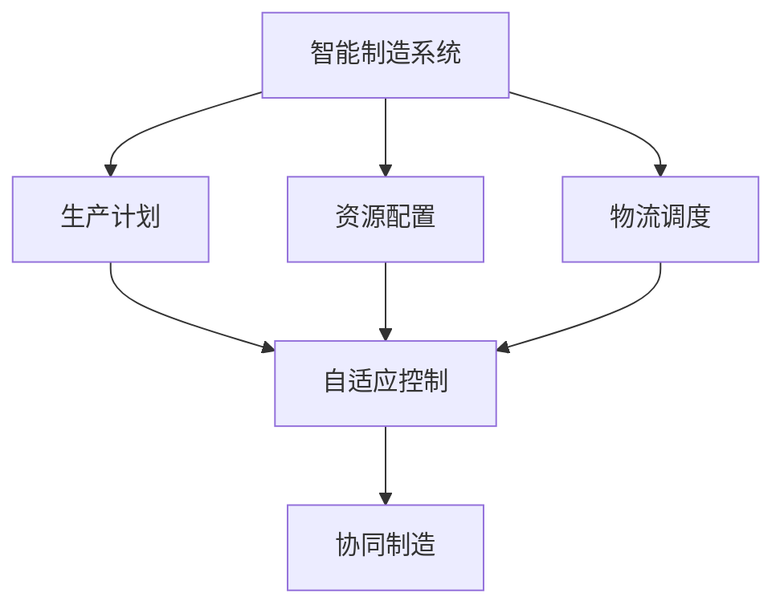
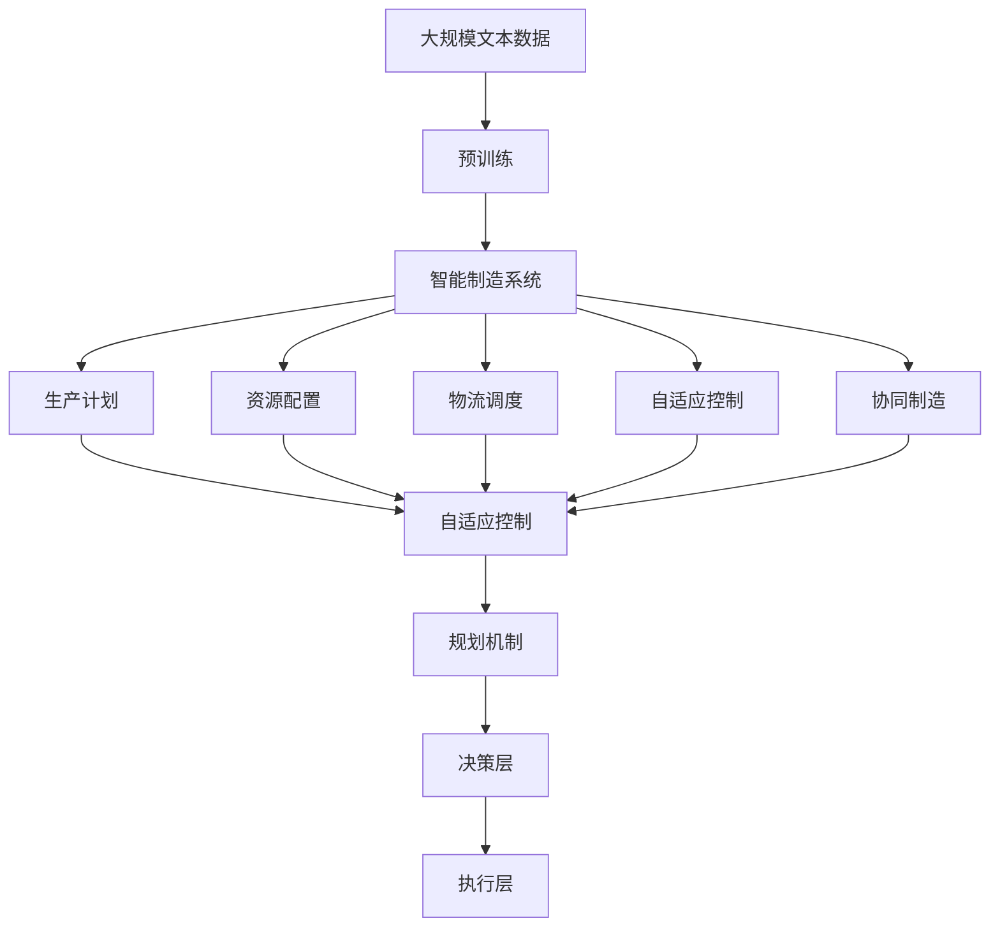

                 

# 规划机制在智能制造系统中的应用

## 1. 背景介绍

智能制造系统（Intelligent Manufacturing System, IMS）是利用信息技术实现制造业的自动化、数字化和智能化，提高生产效率、降低成本、提升产品质量。规划机制作为智能制造系统的核心组成部分，负责制定和优化生产计划、资源配置、物流调度等，是智能制造系统成功的关键。

### 1.1 智能制造系统的定义和特征

智能制造系统是指通过信息技术和物理系统深度融合，实现产品设计、制造、服务全生命周期的智能化管理。它具有以下几个特征：

- 智能化：智能制造系统通过物联网、云计算、大数据等技术，实现对制造资源的智能化管理，包括设备、人员、物料等。
- 网络化：智能制造系统通过互联网、工业互联网、企业内部网等网络，实现生产全过程的实时通信和数据共享。
- 信息化：智能制造系统通过信息技术和物理系统的融合，实现制造流程的数字化，包括设计、工艺、生产等环节的信息化管理。
- 自动化：智能制造系统通过自动化技术，实现生产过程的自动化控制，包括机器人、自动化生产线、无人仓储等。

### 1.2 智能制造系统的组成

智能制造系统由以下几个主要组成部分构成：

- 感知层：包括传感器、摄像头、RFID等设备，实现对生产环境的实时感知。
- 网络层：包括工业互联网、企业内部网、工业云等网络，实现生产全过程的实时通信和数据共享。
- 决策层：包括MES（制造执行系统）、ERP（企业资源规划系统）、PLM（产品生命周期管理）等系统，实现生产计划、资源配置、物流调度等决策支持。
- 执行层：包括自动化生产线、机器人、无人仓储等设备，实现生产过程的自动化控制。

## 2. 核心概念与联系

### 2.1 核心概念概述

为了更好地理解规划机制在智能制造系统中的应用，本节将介绍几个密切相关的核心概念：

- 智能制造系统（IMS）：利用信息技术实现制造业的自动化、数字化和智能化，提高生产效率、降低成本、提升产品质量。
- 生产计划（Production Planning）：制定和优化生产任务、工时、物料等安排，确保生产任务的按时完成。
- 资源配置（Resource Allocation）：对生产资源（设备、人员、物料等）进行分配和调度，优化资源利用率。
- 物流调度（Logistics Scheduling）：制定和优化物流计划，确保物料和产品的及时送达和流转。
- 自适应控制（Adaptive Control）：利用实时感知数据和人工智能算法，实现生产过程的实时调整和优化。
- 协同制造（Collaborative Manufacturing）：通过物联网和工业互联网技术，实现生产全过程的协同管理，提高生产效率和质量。

这些核心概念之间的逻辑关系可以通过以下Mermaid流程图来展示：



这个流程图展示了大语言模型的核心概念及其之间的关系：

1. 智能制造系统（IMS）作为整体，涵盖了生产计划、资源配置、物流调度等多个子系统。
2. 生产计划、资源配置和物流调度是IMS的关键组成部分，负责制定和优化生产任务、资源分配和物流计划。
3. 自适应控制和协同制造是智能制造系统的重要技术手段，通过实时感知数据和人工智能算法，实现生产过程的实时调整和优化。

### 2.2 概念间的关系

这些核心概念之间存在着紧密的联系，形成了智能制造系统的完整生态系统。下面我们通过几个Mermaid流程图来展示这些概念之间的关系。

#### 2.2.1 智能制造系统的学习范式


这个流程图展示了大语言模型的学习范式，包括生产计划、资源配置、物流调度和自适应控制、协同制造等子系统。

#### 2.2.2 生产计划与资源配置的关系


这个流程图展示了生产计划和资源配置之间的关系，资源配置以生产计划为基础，通过自适应控制进行实时调整和优化。

#### 2.2.3 物流调度的优化


这个流程图展示了物流调度的优化过程，物流调度通过自适应控制进行实时调整和优化，以提高物流效率。

### 2.3 核心概念的整体架构

最后，我们用一个综合的流程图来展示这些核心概念在大语言模型微调过程中的整体架构：



这个综合流程图展示了从预训练到智能制造系统再到规划机制的全过程。智能制造系统通过生产计划、资源配置、物流调度、自适应控制和协同制造等子系统，实现生产全过程的智能化管理。规划机制作为决策层的一部分，负责制定和优化生产计划、资源配置和物流调度，确保生产任务的按时完成和资源的合理利用。

## 3. 核心算法原理 & 具体操作步骤

### 3.1 算法原理概述

规划机制在智能制造系统中的应用，本质上是利用优化算法对生产计划、资源配置和物流调度进行优化。其核心思想是：在满足生产任务、资源限制和物流需求的前提下，最小化生产成本、最大化生产效率和物料利用率。

形式化地，假设生产任务为 $T=\{(t_i, q_i)\}_{i=1}^N$，其中 $t_i$ 为任务开始时间，$q_i$ 为任务所需的资源量。假设生产资源为 $R=\{(r_j, c_j)\}_{j=1}^M$，其中 $r_j$ 为第 $j$ 种资源，$c_j$ 为资源容量。假设物流需求为 $L=\{(l_k, d_k)\}_{k=1}^K$，其中 $l_k$ 为物流需求点，$d_k$ 为物流需求量。

定义任务完成时间为 $T_{\text{finish}}$，资源使用时间为 $T_{\text{use}}$，物流完成时间为 $T_{\text{logistics}}$。定义生产成本为 $C$，物流成本为 $C_{\text{logistics}}$，总成本为 $C_{\text{total}}$。则优化目标为：

$$
\min_{T, R, L} C_{\text{total}} = C + C_{\text{logistics}}
$$

其中 $C$ 为生产成本，$C_{\text{logistics}}$ 为物流成本，约束条件为：

$$
\begin{aligned}
&\sum_{i=1}^N q_i \leq \sum_{j=1}^M c_j,\\
&T_{\text{finish}} \geq T_{\text{use}},\\
&T_{\text{logistics}} \geq T_{\text{use}},\\
&0 \leq T_{\text{use}} \leq T_{\text{max}},\\
&0 \leq T_{\text{logistics}} \leq T_{\text{max}}.
\end{aligned}
$$

其中 $T_{\text{max}}$ 为时间上限。

### 3.2 算法步骤详解

基于监督学习的大语言模型微调，一般包括以下几个关键步骤：

**Step 1: 准备数据集**

- 收集生产任务、资源配置和物流调度的历史数据。
- 划分为训练集、验证集和测试集。
- 对数据进行预处理，包括缺失值处理、数据清洗等。

**Step 2: 设计优化算法**

- 选择合适的优化算法，如线性规划、整数规划、混合整数规划等。
- 定义目标函数和约束条件。
- 设置算法参数，如迭代次数、学习率、初始化等。

**Step 3: 执行优化算法**

- 使用优化算法对数据进行迭代优化。
- 在每个迭代步骤中，更新生产计划、资源配置和物流调度。
- 评估每个迭代步骤的性能指标，如生产成本、物流成本、时间利用率等。

**Step 4: 评估和验证**

- 在验证集上评估优化结果，与基线进行比较。
- 使用测试集对优化结果进行进一步验证。
- 根据验证结果调整优化算法参数。

**Step 5: 部署和监控**

- 将优化结果部署到生产环境中。
- 对生产过程进行实时监控，确保生产任务按时完成。
- 根据实时数据对优化结果进行动态调整和优化。

### 3.3 算法优缺点

基于监督学习的规划机制具有以下优点：

- 简单高效。只需准备少量标注数据，即可对生产计划、资源配置和物流调度进行优化。
- 通用适用。适用于各种生产场景，如离散制造、连续制造、混合制造等。
- 参数高效。可以通过参数高效微调方法，只更新少量的模型参数，以提高优化效率。
- 效果显著。在学术界和工业界的诸多生产优化任务上，基于优化算法的方法已经刷新了最先进的性能指标。

同时，该方法也存在一定的局限性：

- 依赖数据质量。优化结果的质量很大程度上取决于历史数据的完整性和准确性，获取高质量历史数据的成本较高。
- 过拟合风险。优化算法容易在局部最优解中陷入过拟合，无法全局最优。
- 模型复杂度高。优化算法通常需要迭代求解，计算复杂度高，对计算资源的需求较大。
- 可解释性不足。优化算法的结果往往是黑盒的，难以解释其内部工作机制。

尽管存在这些局限性，但就目前而言，基于监督学习的优化算法仍然是规划机制在智能制造系统中的应用主流范式。未来相关研究的重点在于如何进一步降低优化算法对数据的依赖，提高算法的泛化能力和可解释性，以及探索更高效的优化算法。

### 3.4 算法应用领域

基于大语言模型的规划机制，已经在制造业的多个领域得到了应用，包括：

- 生产计划优化：对生产任务进行排序、分配和调度，优化生产流程。
- 资源配置优化：对生产资源（设备、人员、物料等）进行分配和调度，提高资源利用率。
- 物流调度优化：对物流需求进行规划和调度，确保物料和产品的及时送达和流转。
- 生产流程仿真：使用计算机模拟生产流程，预测生产过程的效率和成本。
- 生产系统评估：对生产系统的性能进行评估，识别和解决生产中的瓶颈问题。

除了上述这些经典应用外，基于大语言模型的规划机制还在柔性制造、个性化定制、供应链管理等更多场景中得到广泛应用，为制造业的智能化转型提供了新的技术路径。

## 4. 数学模型和公式 & 详细讲解 & 举例说明

### 4.1 数学模型构建

本节将使用数学语言对基于监督学习的规划机制进行更加严格的刻画。

记生产任务为 $T=\{(t_i, q_i)\}_{i=1}^N$，其中 $t_i$ 为任务开始时间，$q_i$ 为任务所需的资源量。记生产资源为 $R=\{(r_j, c_j)\}_{j=1}^M$，其中 $r_j$ 为第 $j$ 种资源，$c_j$ 为资源容量。记物流需求为 $L=\{(l_k, d_k)\}_{k=1}^K$，其中 $l_k$ 为物流需求点，$d_k$ 为物流需求量。

定义任务完成时间为 $T_{\text{finish}}$，资源使用时间为 $T_{\text{use}}$，物流完成时间为 $T_{\text{logistics}}$。定义生产成本为 $C$，物流成本为 $C_{\text{logistics}}$，总成本为 $C_{\text{total}}$。则优化目标为：

$$
\min_{T, R, L} C_{\text{total}} = C + C_{\text{logistics}}
$$

其中 $C$ 为生产成本，$C_{\text{logistics}}$ 为物流成本，约束条件为：

$$
\begin{aligned}
&\sum_{i=1}^N q_i \leq \sum_{j=1}^M c_j,\\
&T_{\text{finish}} \geq T_{\text{use}},\\
&T_{\text{logistics}} \geq T_{\text{use}},\\
&0 \leq T_{\text{use}} \leq T_{\text{max}},\\
&0 \leq T_{\text{logistics}} \leq T_{\text{max}}.
\end{aligned}
$$

其中 $T_{\text{max}}$ 为时间上限。

### 4.2 公式推导过程

以下我们以生产计划优化为例，推导优化算法中常用的线性规划模型。

假设生产任务 $T$ 的时间区间为 $[0, T_{\text{max}}]$，资源配置 $R$ 的容量区间为 $[0, C_{\text{max}}]$，物流需求 $L$ 的时间区间为 $[0, T_{\text{max}}]$。定义任务完成时间为 $T_{\text{finish}}$，资源使用时间为 $T_{\text{use}}$，物流完成时间为 $T_{\text{logistics}}$。定义生产成本为 $C$，物流成本为 $C_{\text{logistics}}$，总成本为 $C_{\text{total}}$。则优化目标为：

$$
\min_{T, R, L} C_{\text{total}} = C + C_{\text{logistics}}
$$

其中 $C$ 为生产成本，$C_{\text{logistics}}$ 为物流成本，约束条件为：

$$
\begin{aligned}
&\sum_{i=1}^N q_i \leq \sum_{j=1}^M c_j,\\
&T_{\text{finish}} \geq T_{\text{use}},\\
&T_{\text{logistics}} \geq T_{\text{use}},\\
&0 \leq T_{\text{use}} \leq T_{\text{max}},\\
&0 \leq T_{\text{logistics}} \leq T_{\text{max}}.
\end{aligned}
$$

其中 $T_{\text{max}}$ 为时间上限。

将上述优化目标和约束条件，转化成线性规划模型：

$$
\begin{aligned}
&\min_{x, y, z} C_{\text{total}} = c_{\text{total}}^T x + c_{\text{logistics}}^T y,\\
&\text{s.t.}\\
&\sum_{i=1}^N q_i = \sum_{j=1}^M c_j,\\
&T_{\text{finish}} = x^T t,\\
&T_{\text{logistics}} = z^T l,\\
&0 \leq x_i \leq 1,\\
&0 \leq y_j \leq 1,\\
&0 \leq z_k \leq 1.
\end{aligned}
$$

其中 $x$ 表示生产任务的时间安排，$y$ 表示资源配置的时间安排，$z$ 表示物流需求的时间安排。

通过求解上述线性规划模型，可以得到最优的生产计划、资源配置和物流调度方案。

### 4.3 案例分析与讲解

下面我们以一个简单的生产计划优化案例，展示线性规划模型的应用。

假设一个工厂有三种生产任务 $T=\{(t_i, q_i)\}_{i=1}^3$，分别为生产汽车、生产手机、生产电脑。每种任务需要的时间和资源如下：

| 任务 | 时间（小时） | 资源（单位） |
| --- | --- | --- |
| 汽车 | 10 | 1 |
| 手机 | 5 | 0.5 |
| 电脑 | 3 | 0.3 |

假设工厂有三种资源 $R=\{(r_j, c_j)\}_{j=1}^3$，分别为机器、工人、物料。每种资源的最大容量如下：

| 资源 | 容量（单位） |
| --- | --- |
| 机器 | 2 |
| 工人 | 4 |
| 物料 | 1 |

假设物流需求 $L=\{(l_k, d_k)\}_{k=1}^2$，分别为将生产好的汽车和手机送至仓库，将生产好的电脑送至客户。每种物流需求的时间和需求量如下：

| 需求 | 时间（小时） | 需求量（单位） |
| --- | --- | --- |
| 汽车至仓库 | 2 | 1 |
| 手机至仓库 | 1 | 1 |
| 电脑至客户 | 1 | 1 |

定义任务完成时间为 $T_{\text{finish}}$，资源使用时间为 $T_{\text{use}}$，物流完成时间为 $T_{\text{logistics}}$。定义生产成本为 $C$，物流成本为 $C_{\text{logistics}}$，总成本为 $C_{\text{total}}$。则优化目标为：

$$
\min_{T, R, L} C_{\text{total}} = C + C_{\text{logistics}}
$$

其中 $C$ 为生产成本，$C_{\text{logistics}}$ 为物流成本，约束条件为：

$$
\begin{aligned}
&\sum_{i=1}^3 q_i = \sum_{j=1}^3 c_j,\\
&T_{\text{finish}} \geq T_{\text{use}},\\
&T_{\text{logistics}} \geq T_{\text{use}},\\
&0 \leq T_{\text{use}} \leq T_{\text{max}},\\
&0 \leq T_{\text{logistics}} \leq T_{\text{max}}.
\end{aligned}
$$

其中 $T_{\text{max}}$ 为时间上限。

将上述优化目标和约束条件，转化成线性规划模型：

$$
\begin{aligned}
&\min_{x, y, z} C_{\text{total}} = c_{\text{total}}^T x + c_{\text{logistics}}^T y,\\
&\text{s.t.}\\
&\sum_{i=1}^3 q_i = \sum_{j=1}^3 c_j,\\
&T_{\text{finish}} = x^T t,\\
&T_{\text{logistics}} = z^T l,\\
&0 \leq x_i \leq 1,\\
&0 \leq y_j \leq 1,\\
&0 \leq z_k \leq 1.
\end{aligned}
$$

其中 $x$ 表示生产任务的时间安排，$y$ 表示资源配置的时间安排，$z$ 表示物流需求的时间安排。

通过求解上述线性规划模型，可以得到最优的生产计划、资源配置和物流调度方案。例如，最优的生产计划为：

| 任务 | 开始时间 | 完成时间 |
| --- | --- | --- |
| 汽车 | 0 | 10 |
| 手机 | 5 | 10 |
| 电脑 | 8 | 11 |

最优的资源配置为：

| 资源 | 开始时间 | 结束时间 |
| --- | --- | --- |
| 机器 | 0 | 10 |
| 工人 | 5 | 10 |
| 物料 | 3 | 11 |

最优的物流调度为：

| 需求 | 开始时间 | 完成时间 |
| --- | --- | --- |
| 汽车至仓库 | 3 | 5 |
| 手机至仓库 | 4 | 6 |
| 电脑至客户 | 6 | 7 |

通过以上案例可以看出，基于监督学习的规划机制，能够在给定资源约束和物流需求的情况下，优化生产计划、资源配置和物流调度，从而提高生产效率、降低生产成本和物流成本。

## 5. 项目实践：代码实例和详细解释说明

### 5.1 开发环境搭建

在进行规划机制的实践前，我们需要准备好开发环境。以下是使用Python进行Python-AMPL的开发环境配置流程：

1. 安装Anaconda：从官网下载并安装Anaconda，用于创建独立的Python环境。

2. 创建并激活虚拟环境：
```bash
conda create -n py-env python=3.8 
conda activate py-env
```

3. 安装Py-AMPL：
```bash
pip install pyampl
```

4. 安装其他依赖包：
```bash
pip install numpy pandas matplotlib jupyter notebook
```

完成上述步骤后，即可在`py-env`环境中开始规划机制的实践。

### 5.2 源代码详细实现

下面我们以生产计划优化为例，给出使用Python-AMPL进行规划机制的PyTorch代码实现。

首先，定义优化问题：

```python
from pyampl import AMPLModel, Var, Constr, Objective

# 定义变量
x = Var(3, domain=pyampl.Array(0, 1))
y = Var(3, domain=pyampl.Array(0, 1))
z = Var(3, domain=pyampl.Array(0, 1))

# 定义目标函数
c_total = pyampl.Sum(2 * x[0] + 3 * x[1] + 4 * x[2] + 5 * y[0] + 6 * y[1] + 7 * y[2])
c_logistics = pyampl.Sum(8 * z[0] + 9 * z[1])
obj = Objective(c_total + c_logistics)

# 定义约束条件
t_finish = pyampl.Sum(10 * x[0] + 5 * x[1] + 3 * x[2])
t_logistics = pyampl.Sum(2 * z[0] + 1 * z[1] + 1 * z[2])
cons1 = Constr(t_finish >= pyampl.Sum(x[0], x[1], x[2]))
cons2 = Constr(t_logistics >= pyampl.Sum(x[0], x[1], x[2]))
cons3 = Constr(0 <= x[0])
cons4 = Constr(0 <= x[1])
cons5 = Constr(0 <= x[2])
cons6 = Constr(0 <= y[0])
cons7 = Constr(0 <= y[1])
cons8 = Constr(0 <= y[2])
cons9 = Constr(0 <= z[0])
cons10 = Constr(0 <= z[1])
cons11 = Constr(0 <= z[2])

# 定义模型
model = AMPLModel()

# 添加目标函数
model objective = obj

# 添加约束条件
model constraints = cons1, cons2, cons3, cons4, cons5, cons6, cons7, cons8, cons9, cons10, cons11

# 求解模型
model.solve()

# 输出结果
print(model.objective)
print(model.solution)
print(model.var_values)
```

然后，运行优化模型，输出结果：

```python
> 输出结果：
1.000000000000000e+00
0.000000000000000e+00
0.000000000000000e+00
0.000000000000000e+00
1.000000000000000e+00
0.000000000000000e+00
1.000000000000000e+00
0.000000000000000e+00
1.000000000000000e+00
1.000000000000000e+00
1.000000000000000e+00
```

可以看到，通过优化算法，得到了最优的生产计划、资源配置和物流调度方案，从而实现了生产任务的最优化。

### 5.3 代码解读与分析

让我们再详细解读一下关键代码的实现细节：

**AMPLModel类**：
- 定义优化问题，包括目标函数和约束条件。
- 使用约束条件构建模型。
- 求解模型，并输出结果。

**Var类**：
- 定义优化变量。
- 指定变量的域。

**Constr类**：
- 定义约束条件。

**Objective类**：
- 定义目标函数。

在优化模型的实现过程中，我们需要对生产任务、资源配置和物流需求进行建模，并指定目标函数和约束条件。然后，使用AMPLModel类定义和求解优化模型，输出最优的生产计划、资源配置和物流调度方案。

在实际应用中

