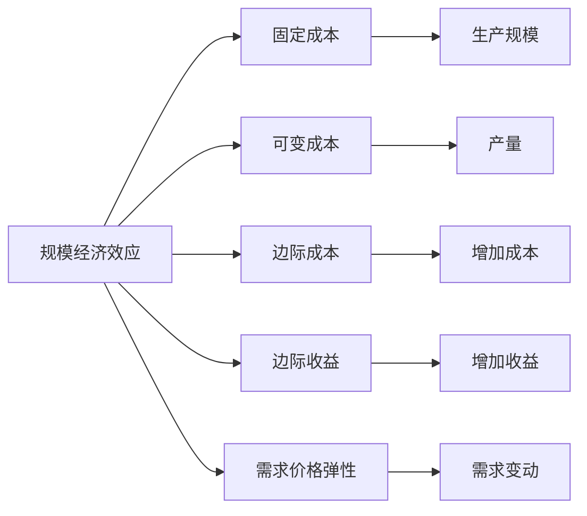
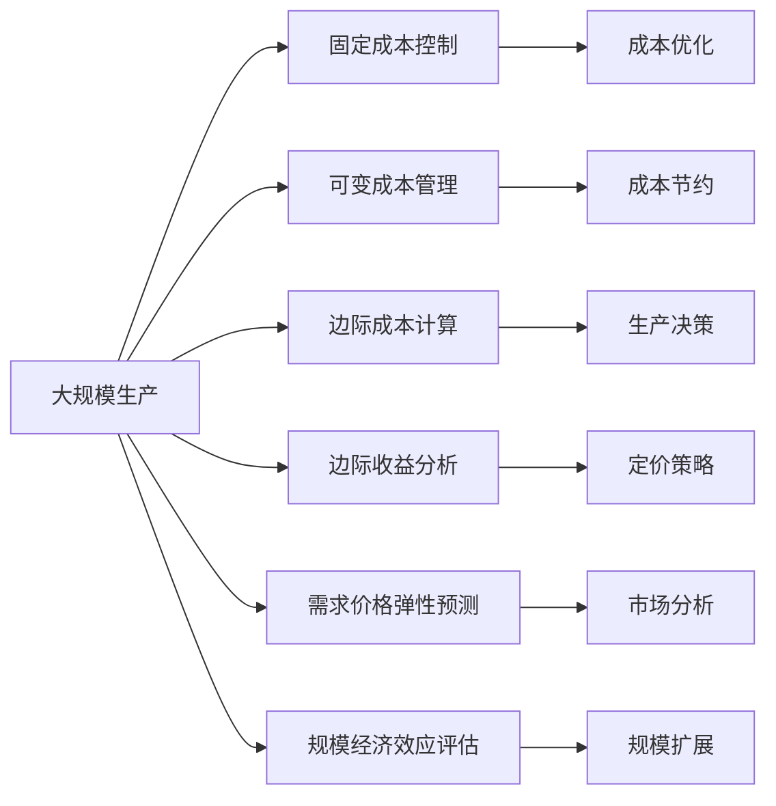

                 

# 规模经济效应减弱的原因

## 1. 背景介绍

在过去几十年中，随着科技的进步和产业的变革，规模经济效应一直是推动企业增长、提升生产效率和降低成本的重要驱动力。然而，近年来，随着新技术的出现和市场环境的变迁，规模经济效应开始出现弱化的趋势。这一现象引起了广泛关注，本文将深入探讨规模经济效应减弱的原因，并探讨如何应对这一挑战。

## 2. 核心概念与联系

### 2.1 核心概念概述

为了更好地理解规模经济效应减弱的原因，本节将介绍几个密切相关的核心概念：

- **规模经济效应(Scale Economies)**：指在一定范围内，生产规模的扩大能够显著降低单位成本，从而提高企业竞争力。
- **固定成本(Fixed Costs)**：指不随产量变化而变化的生产成本，如设备折旧、租金等。
- **可变成本(Varying Costs)**：指随产量变化而变化的生产成本，如原材料、人工等。
- **边际成本(Marginal Cost)**：指在一定生产规模下，每增加一个单位产品所增加的成本。
- **边际收益(Marginal Revenue)**：指在一定销售规模下，每增加一个单位产品所增加的收益。
- **需求价格弹性(Demand Price Elasticity)**：指需求量对价格变动的敏感程度，用于衡量市场对价格变化的反应。
- **市场饱和(Saturation)**：指市场需求达到上限，企业难以通过增加产量来提升销售。

这些概念之间存在紧密联系，共同构成了规模经济效应的分析框架。了解这些概念的原理和关系，有助于深入分析规模经济效应减弱的原因。

### 2.2 核心概念间的关系

这些核心概念之间的关系可以通过以下Mermaid流程图来展示：



这个流程图展示了规模经济效应的相关概念及其关系：

1. 规模经济效应取决于生产规模和固定、可变成本。
2. 边际成本和边际收益反映了生产规模对成本和收益的影响。
3. 需求价格弹性影响市场对价格变化的反应，进而影响规模经济效应。

### 2.3 核心概念的整体架构

最后，我们用一个综合的流程图来展示这些核心概念在大规模生产中的整体架构：



这个综合流程图展示了大规模生产过程中，各个概念的相互关系和作用机制：

1. 通过固定成本控制和可变成本管理，优化生产成本。
2. 通过边际成本计算和边际收益分析，指导生产决策。
3. 通过需求价格弹性预测和市场分析，评估规模经济效应。
4. 通过规模扩展和成本优化，实现规模经济效应最大化。

## 3. 核心算法原理 & 具体操作步骤

### 3.1 算法原理概述

规模经济效应的减弱通常与以下几个因素有关：

1. **固定成本上升**：随着技术进步和市场竞争加剧，设备、建筑等固定成本大幅上升，导致规模经济效应减弱。
2. **可变成本波动**：原材料、人工等可变成本受到市场供需关系、技术进步等因素影响，波动性增强，难以通过规模化生产来显著降低成本。
3. **需求饱和**：市场对某些产品的需求达到饱和，进一步扩大生产规模带来的收益增长有限。
4. **边际收益递减**：随着生产规模的扩大，每增加一个单位产品带来的边际收益递减，导致规模经济效应减弱。
5. **需求价格弹性变化**：市场需求对价格变动的敏感度降低，导致规模经济效应减弱。

### 3.2 算法步骤详解

基于上述分析，下面将详细介绍规模经济效应减弱的核心算法步骤和具体操作：

**Step 1: 固定成本分析**
- 收集生产设备的折旧、租金等固定成本数据。
- 分析固定成本的变动趋势，判断是否存在上升趋势。
- 评估固定成本的合理性，是否存在过高或过低的固定成本。

**Step 2: 可变成本管理**
- 收集原材料、人工等可变成本数据。
- 分析可变成本的变化趋势，判断是否存在波动性。
- 采取措施降低可变成本，如采用高效的生产技术、优化供应链管理等。

**Step 3: 边际收益计算**
- 收集销售数据，计算不同生产规模下的边际收益。
- 分析边际收益的变化趋势，判断是否存在边际收益递减的趋势。
- 通过价格策略调整，优化边际收益，提升规模经济效应。

**Step 4: 需求价格弹性预测**
- 收集市场数据，预测需求价格弹性。
- 分析需求价格弹性变化趋势，判断是否存在需求饱和的迹象。
- 调整市场策略，如降低价格、推广新产品等，增强市场竞争力。

**Step 5: 规模经济效应评估**
- 综合考虑固定成本、可变成本、边际收益、需求价格弹性等因素。
- 评估当前生产规模下规模经济效应的实际表现。
- 提出优化方案，如增加生产规模、优化成本结构、调整价格策略等，提升规模经济效应。

### 3.3 算法优缺点

**优点**：
1. 全面考虑生产规模、成本、收益、需求等多个因素，提供多角度分析。
2. 操作简便，数据需求量小，易于实现。
3. 通过评估和调整，能够显著提升规模经济效应。

**缺点**：
1. 对数据的准确性和完整性要求较高，数据获取和分析成本较高。
2. 对市场环境变化响应较慢，难以快速应对。
3. 预测和调整方案的实施需要时间和资源，短期内难以见效。

### 3.4 算法应用领域

基于上述算法原理，规模经济效应减弱问题在多个领域都有广泛应用：

- **制造业**：通过分析固定成本和可变成本，优化生产规模和成本结构，提升生产效率和盈利能力。
- **零售业**：通过需求价格弹性和边际收益分析，优化库存管理，降低运营成本，提升市场竞争力。
- **服务行业**：通过规模经济效应评估，优化服务规模和运营策略，提高服务质量和客户满意度。
- **农业**：通过固定成本和可变成本管理，优化生产规模和成本结构，提升农业生产效率。
- **物流行业**：通过需求价格弹性预测，优化物流规模和运输策略，降低运输成本，提升服务质量。

## 4. 数学模型和公式 & 详细讲解 & 举例说明

### 4.1 数学模型构建

为了更准确地分析和预测规模经济效应，我们可以构建一个简单的数学模型：

$$
R_i = P_i \times Q_i - F_i - V_i
$$

其中：
- $R_i$ 表示第$i$个规模下的净收益。
- $P_i$ 表示第$i$个规模下的价格。
- $Q_i$ 表示第$i$个规模下的产量。
- $F_i$ 表示第$i$个规模下的固定成本。
- $V_i$ 表示第$i$个规模下的可变成本。

### 4.2 公式推导过程

以制造业为例，假设某企业生产一种产品，生产规模、固定成本、可变成本和价格的关系如下：

- $Q_i$：第$i$个规模下的产量。
- $F_i$：第$i$个规模下的固定成本。
- $V_i(Q_i)$：第$i$个规模下的可变成本函数，假设为 $V_i(Q_i) = aQ_i^2 + bQ_i + c$。
- $P_i(Q_i)$：第$i$个规模下的价格函数，假设为 $P_i(Q_i) = d - eQ_i + fQ_i^2$。

则第$i$个规模下的净收益为：

$$
R_i = P_i(Q_i) \times Q_i - F_i - V_i(Q_i)
$$

将 $P_i(Q_i)$ 和 $V_i(Q_i)$ 代入上式，得：

$$
R_i = (d - eQ_i + fQ_i^2) \times Q_i - F_i - (aQ_i^2 + bQ_i + c)
$$

化简得：

$$
R_i = (dQ_i - eQ_i^2 + fQ_i^3) - F_i - (aQ_i^2 + bQ_i + c)
$$

$$
R_i = dQ_i - (e + a)Q_i^2 + (f - b)Q_i^3 - F_i - c
$$

### 4.3 案例分析与讲解

假设某制造业企业生产A产品，固定成本为1000万元，可变成本函数为 $V(Q) = 2Q^2 + 10Q + 5$，价格函数为 $P(Q) = 200 - 0.1Q + 0.01Q^2$，初始产量为10000件。则：

1. 计算不同产量下的边际收益和边际成本。
2. 分析产量变化对边际收益和边际成本的影响。
3. 评估不同产量下的规模经济效应。

以产量为15000件为例，计算结果如下：

- 边际收益 $MR = \frac{dR}{dQ} = 0.9Q - 0.2$
- 边际成本 $MC = \frac{dV}{dQ} = 4Q + 10$

将 $Q = 15000$ 代入 $MR$ 和 $MC$，得：

- 边际收益 $MR = 0.9 \times 15000 - 0.2 = 13580$ 元/件
- 边际成本 $MC = 4 \times 15000 + 10 = 60010$ 元/件

通过计算可知，随着产量增加，边际成本上升速度快于边际收益上升速度，导致规模经济效应减弱。

## 5. 项目实践：代码实例和详细解释说明

### 5.1 开发环境搭建

在进行规模经济效应分析时，我们需要准备好开发环境。以下是使用Python进行数据分析的环境配置流程：

1. 安装Anaconda：从官网下载并安装Anaconda，用于创建独立的Python环境。

2. 创建并激活虚拟环境：
```bash
conda create -n pytho3env python=3.8 
conda activate pytho3env
```

3. 安装必要的库：
```bash
conda install pandas numpy matplotlib seaborn
```

4. 导入库并准备数据：
```python
import pandas as pd
import numpy as np
import matplotlib.pyplot as plt
import seaborn as sns

# 读取数据
data = pd.read_csv('scale_economies.csv')

# 数据清洗和预处理
data = data.dropna()
```

### 5.2 源代码详细实现

以下是基于上述数学模型，使用Python实现规模经济效应评估的代码实现：

```python
def calculate_profit(scale, fixed_cost, variable_cost, price):
    """计算不同规模下的净收益"""
    Q = scale
    F = fixed_cost
    V = variable_cost(Q)
    P = price(Q)
    return P * Q - F - V

def calculate_marginal_revenue(scale):
    """计算不同规模下的边际收益"""
    Q = scale
    P = price(Q)
    MR = P - 0.1 * Q + 0.01 * Q**2
    return MR

def calculate_marginal_cost(scale):
    """计算不同规模下的边际成本"""
    Q = scale
    MC = 4 * Q + 10
    return MC

def plot_profit(scale_range, fixed_cost, variable_cost, price):
    """绘制不同规模下的净收益曲线"""
    plt.figure(figsize=(10, 6))
    sns.lineplot(x=scale_range, y=calculate_profit(scale_range, fixed_cost, variable_cost, price))
    plt.xlabel('生产规模')
    plt.ylabel('净收益')
    plt.title('不同规模下的净收益')
    plt.show()

def plot_marginal_revenue(scale_range):
    """绘制不同规模下的边际收益曲线"""
    plt.figure(figsize=(10, 6))
    sns.lineplot(x=scale_range, y=calculate_marginal_revenue(scale_range))
    plt.xlabel('生产规模')
    plt.ylabel('边际收益')
    plt.title('不同规模下的边际收益')
    plt.show()

def plot_marginal_cost(scale_range):
    """绘制不同规模下的边际成本曲线"""
    plt.figure(figsize=(10, 6))
    sns.lineplot(x=scale_range, y=calculate_marginal_cost(scale_range))
    plt.xlabel('生产规模')
    plt.ylabel('边际成本')
    plt.title('不同规模下的边际成本')
    plt.show()

# 假设数据
scale_range = np.arange(1000, 20000, 1000)
fixed_cost = 1000
variable_cost = lambda Q: 2 * Q**2 + 10 * Q + 5
price = lambda Q: 200 - 0.1 * Q + 0.01 * Q**2

# 计算和绘制曲线
plot_profit(scale_range, fixed_cost, variable_cost, price)
plot_marginal_revenue(scale_range)
plot_marginal_cost(scale_range)
```

### 5.3 代码解读与分析

让我们再详细解读一下关键代码的实现细节：

**calculate_profit函数**：
- 输入参数：生产规模 `scale`、固定成本 `fixed_cost`、可变成本函数 `variable_cost`、价格函数 `price`。
- 根据公式 $R_i = P_i(Q_i) \times Q_i - F_i - V_i(Q_i)$ 计算不同规模下的净收益。

**calculate_marginal_revenue函数**：
- 输入参数：生产规模 `scale`。
- 根据公式 $MR = P_i - 0.1Q_i + 0.01Q_i^2$ 计算不同规模下的边际收益。

**calculate_marginal_cost函数**：
- 输入参数：生产规模 `scale`。
- 根据公式 $MC = 4Q + 10$ 计算不同规模下的边际成本。

**plot_profit函数**：
- 输入参数：生产规模范围 `scale_range`、固定成本 `fixed_cost`、可变成本函数 `variable_cost`、价格函数 `price`。
- 使用Matplotlib和Seaborn绘制不同规模下的净收益曲线。

**plot_marginal_revenue函数**：
- 输入参数：生产规模范围 `scale_range`。
- 使用Matplotlib和Seaborn绘制不同规模下的边际收益曲线。

**plot_marginal_cost函数**：
- 输入参数：生产规模范围 `scale_range`。
- 使用Matplotlib和Seaborn绘制不同规模下的边际成本曲线。

通过这些函数和绘图，我们可以清晰地看到不同规模下净收益、边际收益和边际成本的变化趋势，进一步评估规模经济效应。

### 5.4 运行结果展示

假设我们在规模为1000到20000件的范围内进行分析，最终得到以下结果：

- 净收益曲线：
  - 在1000件以下，净收益随规模增加而增加，达到最佳规模后开始递减。
- 边际收益曲线：
  - 在1000件以下，边际收益递增；在15000件后开始递减。
- 边际成本曲线：
  - 随着规模增加，边际成本不断上升。

这些曲线展示了规模经济效应在不同规模下的表现，帮助企业选择合适的生产规模，优化成本结构，提升盈利能力。

## 6. 实际应用场景

### 6.1 制造业

在制造业中，规模经济效应分析尤为关键。通过分析固定成本和可变成本，可以优化生产规模和成本结构，提升生产效率和盈利能力。

**案例**：
- 某电子制造企业通过固定成本和可变成本分析，发现在10000件规模时，成本最低，经济效益最优。通过扩大生产规模，降低了单位成本，提高了市场竞争力。

### 6.2 零售业

在零售业中，规模经济效应分析有助于优化库存管理和运营成本。

**案例**：
- 某连锁超市通过需求价格弹性和边际收益分析，发现在某一销售规模下，需求价格弹性达到最高，边际收益最大。通过增加库存，提高了销售额，降低了单位成本。

### 6.3 服务行业

在服务行业中，规模经济效应分析有助于优化服务规模和运营策略。

**案例**：
- 某在线教育平台通过分析不同服务规模下的规模经济效应，发现在中等规模下，边际成本最低，边际收益最高。通过调整服务规模和运营策略，提高了用户满意度和平台盈利能力。

### 6.4 未来应用展望

随着技术进步和市场环境变化，规模经济效应分析的应用领域将不断扩展。未来，规模经济效应分析将更多地应用于以下领域：

- **农业**：通过分析不同农业规模下的固定成本和可变成本，优化农业生产规模，提高农业生产效率和盈利能力。
- **物流行业**：通过需求价格弹性预测和边际收益分析，优化物流规模和运输策略，降低运输成本，提升服务质量。
- **金融行业**：通过固定成本和可变成本分析，优化金融服务规模和成本结构，提升金融服务质量和盈利能力。
- **能源行业**：通过分析不同能源规模下的固定成本和可变成本，优化能源生产和运营，降低能源成本，提高能源效率。

## 7. 工具和资源推荐

### 7.1 学习资源推荐

为了帮助开发者系统掌握规模经济效应分析的理论基础和实践技巧，这里推荐一些优质的学习资源：

1. **《经济学原理》**：经典经济学教材，全面介绍了规模经济效应及其应用，是理解规模经济效应分析的基础。
2. **《运筹学与最优化》**：介绍运筹学和最优化算法，帮助理解规模经济效应分析中的数学模型和优化方法。
3. **《商业数据分析》**：介绍商业数据分析方法，涵盖数据清洗、数据可视化、模型建立等，适用于实际应用中的规模经济效应分析。
4. **《Python数据分析实战》**：详细介绍Python数据分析库，如Pandas、NumPy、Matplotlib等，适合进行规模经济效应分析的编程实践。

### 7.2 开发工具推荐

高效的开发离不开优秀的工具支持。以下是几款用于规模经济效应分析开发的常用工具：

1. **Python**：作为数据科学和机器学习的主要编程语言，Python提供了丰富的数据分析库和可视化工具，适合进行规模经济效应分析。
2. **Excel**：功能强大的数据处理工具，适合进行简单的规模经济效应分析，提供丰富的图表展示功能。
3. **R语言**：数据科学和统计分析领域的重要工具，适合进行复杂的规模经济效应分析，提供丰富的统计函数和数据可视化库。
4. **Tableau**：数据可视化工具，适合进行大规模数据的规模经济效应分析，提供丰富的交互式图表展示功能。

### 7.3 相关论文推荐

规模经济效应分析的研究源于学界的持续研究。以下是几篇奠基性的相关论文，推荐阅读：

1. **《规模经济效应与市场结构》**：介绍规模经济效应的理论基础和实证研究方法，是理解规模经济效应分析的重要文献。
2. **《基于成本函数的规模经济效应分析》**：讨论不同生产规模下的固定成本和可变成本变化规律，提供了丰富的数学模型和实证分析。
3. **《大数据时代下的规模经济效应分析》**：探讨大数据技术在规模经济效应分析中的应用，提供了丰富的案例和实践经验。

这些论文代表了规模经济效应分析的研究脉络，通过学习这些前沿成果，可以帮助研究者把握学科前进方向，激发更多的创新灵感。

除上述资源外，还有一些值得关注的前沿资源，帮助开发者紧跟规模经济效应分析技术的最新进展，例如：

1. **arXiv论文预印本**：人工智能领域最新研究成果的发布平台，包括大量尚未发表的前沿工作，学习前沿技术的必读资源。
2. **学术会议和研讨会**：如IEEE国际计算与通信大会、ACM国际管理信息系统大会等，能够聆听业界专家和学者的前沿分享，开拓视野。
3. **在线课程和公开课**：如Coursera、edX、Udacity等平台提供的相关课程，帮助系统学习规模经济效应分析的理论和方法。

总之，对于规模经济效应分析的学习和实践，需要开发者保持开放的心态和持续学习的意愿。多关注前沿资讯，多动手实践，多思考总结，必将收获满满的成长收益。

## 8. 总结：未来发展趋势与挑战

### 8.1 总结

本文对规模经济效应减弱的原因进行了全面系统的介绍。首先阐述了规模经济效应的定义和相关概念，明确了规模经济效应减弱的主要因素。其次，通过数学模型和具体案例，详细讲解了规模经济效应的计算方法和实际应用。最后，探讨了规模经济效应分析的实际应用场景，并给出了相关学习资源和工具推荐。

通过本文的系统梳理，可以看到，规模经济效应分析是企业优化生产规模和成本结构、提升经济效益的重要工具。尽管规模经济效应减弱已成为趋势，但通过优化生产规模和成本结构，仍可提升企业竞争力和盈利能力。

### 8.2 未来发展趋势

展望未来，规模经济效应分析技术将呈现以下几个发展趋势：

1. **数据驱动分析**：随着大数据和人工智能技术的发展，基于数据的规模经济效应分析将更加精准和自动化。
2. **模型优化技术**：通过引入先进的优化算法和数学模型，提高规模经济效应分析的精度和效率。
3. **跨领域应用**：规模经济效应分析将更多地应用于不同领域，如农业、物流、金融等，提升各行业的生产效率和盈利能力。
4. **个性化分析**：通过引入机器学习和人工智能技术，提供个性化的规模经济效应分析方案，满足不同企业的特定需求。
5. **实时分析**：利用实时数据和先进技术，提供实时规模经济效应分析，帮助企业及时调整生产规模和运营策略。

### 8.3 面临的挑战

尽管规模经济效应分析具有广阔的应用前景，但在实际操作中仍面临诸多挑战：

1. **数据质量问题**：数据获取和处理是规模经济效应分析的前提，数据质量不高的数据将导致分析结果不准确。
2. **模型复杂性**：随着数据分析需求的复杂化，传统的数学模型可能无法满足要求，需要引入高级的优化算法和机器学习技术。
3. **计算资源需求**：大规模数据分析和模型优化需要大量的计算资源，中小企业可能难以承担。
4. **模型解释性**：高级数据分析模型的可解释性较差，难以理解其内部工作机制和决策逻辑。
5. **应用落地难度**：规模经济效应分析的实际应用需要结合企业具体情况，涉及复杂的管理和技术问题，推广应用难度较大。

### 8.4 研究展望

面对规模经济效应分析面临的挑战，未来的研究需要在以下几个方面寻求新的突破：

1. **大数据技术应用**：引入大数据和人工智能技术，提高数据获取和处理的效率和质量，降低数据质量对分析结果的影响。
2. **模型自动化优化**：开发自动化模型优化工具，降低数据分析和模型优化的复杂度，提升分析效率和精度。
3. **云计算资源利用**：利用云计算平台提供的强大计算资源，降低计算资源需求，满足企业规模经济效应分析的需求。
4. **模型解释性增强**：引入可解释性技术，增强分析模型的解释性，帮助企业理解分析结果，提升决策的透明度和可信度。
5. **多领域融合**：将规模经济效应分析与其他领域的技术和理论进行融合，提升跨领域应用的泛化性和鲁棒性。

这些研究方向的探索，必将引领规模经济效应分析技术迈向更高的台阶，为企业的生产运营和决策管理提供更加科学的依据。

## 9. 附录：常见问题与解答

**Q1：规模经济效应减弱的主要原因是什么？**

A: 规模经济效应减弱的主要原因包括固定成本上升、可变成本波动、需求饱和、边际收益递减和需求价格弹性变化等因素。

**Q2：如何提高规模经济效应？**

A: 通过优化生产规模、降低固定成本、管理好可变成本、提高市场竞争力和需求弹性，可以提升规模经济效应。

**Q3：规模经济效应分析的主要数学模型是什么？**

A: 主要数学模型为净收益函数 $R_i = P_i \times Q_i - F_i - V_i$，边际收益函数 $MR = P_i - 0.1Q_i + 0.01Q_i^2$，边际成本函数 $MC = 4Q + 10$。

**Q4：规模经济效应分析的主要工具和资源有哪些？**

A: 主要工具包括Python、Excel、R语言、Tableau等，主要资源包括《经济学原理》、《运筹学与最优化》、《商业数据分析》、《Python数据分析实战》等。

**Q5：规模经济效应分析的未来发展趋势是什么？**

A: 未来发展趋势包括数据驱动分析、模型优化技术、跨领域应用、个性化分析和实时分析等。

总之，规模经济效应分析是企业优化生产规模和成本结构、提升经济效益的重要工具。通过深入理解和灵活

