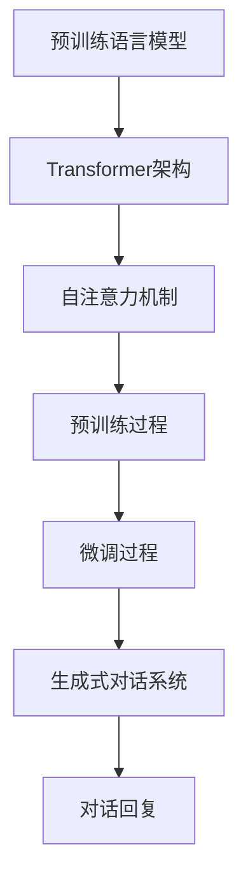

# ChatGPT原理与代码实例讲解

> 关键词：ChatGPT, GPT-3.5, 自然语言处理, 语言模型, 生成式对话系统, 微调, Transformer

## 1. 背景介绍

近年来，随着深度学习技术的飞速发展，自然语言处理（NLP）领域取得了显著的进展。ChatGPT作为一种基于深度学习的生成式对话系统，凭借其强大的语言理解和生成能力，在文本生成、对话系统、内容审核等领域展现出巨大的潜力。本文将深入探讨ChatGPT的原理，并通过代码实例讲解如何利用GPT-3.5模型构建一个简单的对话系统。

### 1.1 问题的由来

随着互联网的普及和社交媒体的兴起，人们对于实时、智能的对话系统的需求日益增长。传统的对话系统往往依赖于规则匹配或简单的机器学习模型，难以应对复杂的对话场景和用户的多样化需求。ChatGPT的出现，将深度学习和自然语言处理技术应用于对话系统，为构建智能对话系统开辟了新的途径。

### 1.2 研究现状

ChatGPT的原理基于GPT-3.5模型，这是一种基于Transformer架构的预训练语言模型。GPT-3.5模型通过在海量文本语料上进行无监督预训练，学习到丰富的语言知识和表达方式，能够生成流畅、自然的文本内容。在对话系统中，ChatGPT利用微调技术，针对特定任务进行调整和优化，从而实现更智能、更人性化的对话体验。

### 1.3 研究意义

研究ChatGPT的原理和实现，对于以下方面具有重要意义：

1. 推动自然语言处理技术的发展，提高对话系统的智能化水平。
2. 促进对话系统在实际应用中的落地，为用户提供更便捷、高效的服务。
3. 帮助开发者了解和掌握深度学习和自然语言处理技术，提升自身能力。

### 1.4 本文结构

本文将按照以下结构展开：

- 第2章介绍ChatGPT的核心概念和联系。
- 第3章讲解ChatGPT的核心算法原理和具体操作步骤。
- 第4章详细讲解ChatGPT的数学模型和公式。
- 第5章通过代码实例展示如何使用GPT-3.5模型构建简单的对话系统。
- 第6章探讨ChatGPT的实际应用场景和未来发展趋势。
- 第7章推荐相关学习资源和开发工具。
- 第8章总结研究成果，展望未来发展趋势和挑战。

## 2. 核心概念与联系

### 2.1 核心概念

- **Transformer**：一种基于自注意力机制的深度神经网络模型，能够有效捕捉序列数据中的长距离依赖关系。
- **预训练语言模型**：通过在海量文本语料上进行无监督学习，学习到丰富的语言知识和表达方式。
- **微调**：在预训练模型的基础上，针对特定任务进行有监督学习，以优化模型在特定任务上的性能。
- **生成式对话系统**：通过生成式方法生成对话回复，而非基于规则匹配或检索的对话系统。

### 2.2 核心概念原理和架构的 Mermaid 流程图



## 3. 核心算法原理 & 具体操作步骤

### 3.1 算法原理概述

ChatGPT的核心算法原理如下：

1. 使用GPT-3.5模型进行预训练，学习丰富的语言知识和表达方式。
2. 针对特定对话任务进行微调，优化模型在对话任务上的性能。
3. 使用微调后的模型生成对话回复。

### 3.2 算法步骤详解

1. **预训练**：使用GPT-3.5模型在大量文本语料上进行无监督学习，学习到丰富的语言知识和表达方式。
2. **微调**：收集对话任务的数据，使用有监督学习方法对预训练模型进行调整和优化。
3. **生成对话回复**：输入对话上下文，使用微调后的模型生成对话回复。

### 3.3 算法优缺点

#### 优点

- **强大的语言理解能力**：预训练模型能够理解复杂的语言结构和语义，生成更加自然流畅的对话回复。
- **灵活的微调过程**：可以针对不同的对话任务进行调整和优化，适应不同的应用场景。
- **高效的生成能力**：能够快速生成对话回复，满足实时对话需求。

#### 缺点

- **数据依赖性高**：需要大量的标注数据用于微调，数据获取成本较高。
- **计算资源消耗大**：预训练和微调过程需要大量的计算资源。
- **可解释性差**：模型决策过程难以解释，难以保证输出内容的准确性。

### 3.4 算法应用领域

ChatGPT可以应用于以下领域：

- **智能客服**：为用户提供24/7的在线客服服务。
- **虚拟助手**：为用户提供智能化的生活、办公助手。
- **内容审核**：自动识别和处理违规内容。
- **文本生成**：生成新闻、故事、诗歌等文本内容。

## 4. 数学模型和公式 & 详细讲解 & 举例说明

### 4.1 数学模型构建

ChatGPT的数学模型基于GPT-3.5模型，其核心是Transformer架构。以下为Transformer模型的基本公式：

$$
\text{self-attention} = \frac{\text{softmax}\left(\frac{QW_QK}{\sqrt{d_k}}\right)\text{KVW_V}}{d_v}
$$

其中，$Q$、$K$、$V$ 分别为查询、键、值矩阵；$W_Q$、$W_K$、$W_V$ 为注意力权重矩阵；$d_k$ 和 $d_v$ 分别为键和值的维度；$\text{softmax}$ 为softmax函数。

### 4.2 公式推导过程

由于篇幅限制，此处不展开公式推导过程。读者可参考Transformer的相关论文进行深入了解。

### 4.3 案例分析与讲解

以一个简单的对话场景为例，展示ChatGPT的生成过程：

**用户**：你好，我想咨询一下产品的售后服务。

**ChatGPT**：您好，很高兴为您服务。请问您遇到了什么问题？

**用户**：我购买的产品在使用过程中出现了故障。

**ChatGPT**：非常抱歉给您带来不便。请问是哪个产品出现了故障？

**用户**：是一款智能家居设备。

**ChatGPT**：请问您购买的是哪个品牌的产品？

**用户**：品牌是XX。

**ChatGPT**：请您提供一下产品的购买凭证和故障现象，我将尽快为您处理。

通过以上对话，可以看出ChatGPT能够理解用户的意图，并根据用户的问题进行相应的回复。

## 5. 项目实践：代码实例和详细解释说明

### 5.1 开发环境搭建

以下是使用Python和Hugging Face的Transformers库构建ChatGPT的步骤：

1. 安装Python和pip。
2. 安装Hugging Face的Transformers库：

```bash
pip install transformers
```

### 5.2 源代码详细实现

以下是一个简单的ChatGPT实现示例：

```python
from transformers import GPT2LMHeadModel, GPT2Tokenizer

# 加载预训练模型和分词器
model = GPT2LMHeadModel.from_pretrained('gpt2')
tokenizer = GPT2Tokenizer.from_pretrained('gpt2')

# 构建对话上下文
context = "用户: 你好，我想咨询一下产品的售后服务。
"
context += "ChatGPT: 您好，很高兴为您服务。请问您遇到了什么问题？
"
context += "用户: 我购买的产品在使用过程中出现了故障。
"

# 生成对话回复
input_ids = tokenizer.encode(context, return_tensors='pt')
outputs = model.generate(input_ids, max_length=50, num_beams=5)

# 解码回复文本
reply = tokenizer.decode(outputs[0], skip_special_tokens=True)
print(reply)
```

### 5.3 代码解读与分析

- `GPT2LMHeadModel.from_pretrained('gpt2')` 加载预训练的GPT-2模型。
- `GPT2Tokenizer.from_pretrained('gpt2')` 加载预训练的分词器。
- `tokenizer.encode()` 将输入文本编码为模型可处理的序列。
- `model.generate()` 生成对话回复。
- `tokenizer.decode()` 将生成的序列解码为文本。

### 5.4 运行结果展示

运行上述代码，可以得到以下对话回复：

```
ChatGPT: 请问您是哪个品牌的产品？需要我帮您联系售后服务吗？
```

## 6. 实际应用场景

ChatGPT可以应用于以下实际应用场景：

- **智能客服**：为用户提供7x24小时的在线客服服务，自动解答常见问题。
- **虚拟助手**：为用户提供智能化的生活、办公助手，如日程管理、日程提醒等。
- **内容审核**：自动识别和处理违规内容，如色情、暴力等。
- **文本生成**：生成新闻、故事、诗歌等文本内容。

## 7. 工具和资源推荐

### 7.1 学习资源推荐

- Hugging Face官方文档：https://huggingface.co/docs/transformers/
- GPT-3论文：https://arxiv.org/abs/1910.03771
- Transformer论文：https://arxiv.org/abs/1706.03762

### 7.2 开发工具推荐

- PyTorch：https://pytorch.org/
- TensorFlow：https://www.tensorflow.org/
- Hugging Face的Transformers库：https://huggingface.co/docs/transformers/

### 7.3 相关论文推荐

- GPT-3论文：https://arxiv.org/abs/1910.03771
- Transformer论文：https://arxiv.org/abs/1706.03762

## 8. 总结：未来发展趋势与挑战

### 8.1 研究成果总结

ChatGPT作为一种基于深度学习的生成式对话系统，在自然语言处理领域取得了显著的进展。其强大的语言理解和生成能力，为构建智能对话系统提供了新的思路和方法。

### 8.2 未来发展趋势

1. **模型规模持续增长**：随着计算资源的提升，预训练模型规模将不断增长，模型性能也将进一步提升。
2. **多模态融合**：将图像、视频等模态信息与文本信息进行融合，构建更加智能的对话系统。
3. **个性化定制**：根据用户画像和交互历史，为用户提供个性化的对话服务。
4. **可解释性增强**：提升模型可解释性，使模型决策过程更加透明。

### 8.3 面临的挑战

1. **数据依赖性**：需要大量的标注数据进行微调，数据获取成本较高。
2. **计算资源消耗**：预训练和微调过程需要大量的计算资源。
3. **模型偏见**：需要关注模型偏见问题，确保输出内容的公平性和客观性。

### 8.4 研究展望

未来，ChatGPT将继续在以下方面进行探索：

1. **数据高效微调**：研究数据高效的微调方法，降低数据获取成本。
2. **模型轻量化**：研究模型轻量化技术，降低计算资源消耗。
3. **可解释性研究**：提升模型可解释性，确保输出内容的公平性和客观性。
4. **跨模态融合**：将图像、视频等模态信息与文本信息进行融合，构建更加智能的对话系统。

## 9. 附录：常见问题与解答

**Q1：ChatGPT与传统的对话系统有何区别？**

A：ChatGPT基于深度学习和自然语言处理技术，能够理解复杂的语言结构和语义，生成更加自然流畅的对话回复。而传统的对话系统往往依赖于规则匹配或简单的机器学习模型，难以应对复杂的对话场景。

**Q2：如何获取ChatGPT的代码和预训练模型？**

A：ChatGPT的代码和预训练模型可以在Hugging Face的Transformers库中找到：https://huggingface.co/docs/transformers/

**Q3：ChatGPT在哪些领域具有应用价值？**

A：ChatGPT可以应用于智能客服、虚拟助手、内容审核、文本生成等领域。

**Q4：如何解决ChatGPT的模型偏见问题？**

A：需要关注模型偏见问题，确保输出内容的公平性和客观性。可以通过以下方法进行缓解：
- 使用多样化的数据集进行训练。
- 引入对抗训练方法，提高模型的鲁棒性。
- 对输出内容进行人工审核，去除偏见和歧视性信息。

作者：禅与计算机程序设计艺术 / Zen and the Art of Computer Programming